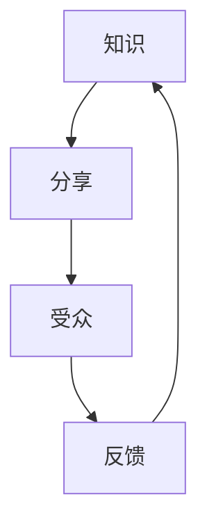

                 

关键词：知识分享、达人见解、生活智慧、IT领域、未来展望

> 摘要：本文将带领读者走进知识分享的世界，探讨如何邀请领域达人分享他们的见解和生活智慧。通过分析当前IT领域的热门话题，以及如何运用技术思维提升生活品质，文章旨在为读者提供一种全新的视角，激发对知识和生活的思考。

## 1. 背景介绍

在快速发展的信息时代，知识分享已经成为连接人与人之间的重要桥梁。无论是技术领域的专家，还是生活中的达人，他们通过分享自己的见解和经验，不仅能够帮助他人成长，还能激发更多的创意和可能性。本文将探讨如何邀请这些领域的达人，通过知识分享的形式，将他们的智慧和经验传递给更广泛的受众。

### 1.1 知识分享的重要性

知识分享不仅有助于知识的传播和积累，还能够促进社会的进步和个人的成长。通过分享，人们可以了解到不同的观点和经验，拓宽自己的视野，从而在工作和生活中更加游刃有余。

### 1.2 IT领域的知识分享现状

在IT领域，知识分享已经成为一种趋势。无论是通过线上平台还是线下活动，技术达人、专家和爱好者都在通过各种方式分享自己的经验和见解。这种分享不仅促进了技术的交流和创新，也为行业的发展注入了新的活力。

## 2. 核心概念与联系

为了更好地理解知识分享的机制，我们需要了解一些核心概念，如知识、分享、受众等。以下是一个简单的 Mermaid 流程图，用以展示这些概念之间的关系。



### 2.1 知识

知识是信息的一种高级形式，它是经过处理和思考后的信息。在IT领域，知识通常指的是技术原理、解决方案、编程技巧等。

### 2.2 分享

分享是指将知识传递给他人的过程。在知识分享中，分享者将自己掌握的知识以文字、图片、视频等形式展示给受众。

### 2.3 受众

受众是知识分享的目标对象，他们通过接收分享者的知识，获得新的见解和经验。

### 2.4 反馈

反馈是知识分享的重要组成部分，它有助于分享者了解自己的分享效果，并根据反馈进行调整。

## 3. 核心算法原理 & 具体操作步骤

### 3.1 算法原理概述

知识分享的核心算法可以概括为以下几个步骤：

1. **知识收集**：分享者收集和整理自己掌握的知识。
2. **内容创作**：将收集到的知识转化为易于理解和吸收的内容。
3. **渠道选择**：选择合适的渠道进行知识分享，如线上平台、线下活动等。
4. **受众反馈**：收集受众的反馈，并进行内容调整。

### 3.2 算法步骤详解

1. **知识收集**：分享者需要具备一定的知识储备，通过阅读书籍、研究论文、参加技术交流等方式不断丰富自己的知识库。

2. **内容创作**：内容创作是知识分享的关键环节，它要求分享者不仅要具备扎实的知识基础，还要有良好的表达能力和创作技巧。

3. **渠道选择**：根据受众的特点和需求，选择合适的分享渠道。例如，对于技术专家，可以通过线上平台如博客、GitHub等进行知识分享；对于爱好者，可以通过线下活动如技术沙龙、编程比赛等进行分享。

4. **受众反馈**：收集受众的反馈，并根据反馈对分享内容进行调整。这有助于提高分享的质量，更好地满足受众的需求。

### 3.3 算法优缺点

1. **优点**：知识分享有助于知识的传播和积累，促进个人和行业的发展。

2. **缺点**：知识分享需要投入大量的时间和精力，且效果难以量化。

### 3.4 算法应用领域

知识分享算法可以广泛应用于各个领域，如IT、教育、医疗等。通过知识分享，不仅可以促进这些领域的发展，还可以为社会发展做出贡献。

## 4. 数学模型和公式 & 详细讲解 & 举例说明

### 4.1 数学模型构建

知识分享的数学模型可以基于概率论和博弈论进行构建。以下是一个简单的数学模型：

$$
P(A|B) = \frac{P(B|A)P(A)}{P(B)}
$$

其中，$P(A|B)$ 表示在给定受众 $B$ 的前提下，知识分享者 $A$ 进行分享的概率；$P(B|A)$ 表示在知识分享者 $A$ 进行分享的前提下，受众 $B$ 接收分享的概率；$P(A)$ 和 $P(B)$ 分别表示知识分享者 $A$ 和受众 $B$ 的概率分布。

### 4.2 公式推导过程

假设知识分享者 $A$ 和受众 $B$ 的行为独立，则有：

$$
P(A \cap B) = P(A)P(B)
$$

根据条件概率公式，有：

$$
P(A|B) = \frac{P(B|A)P(A)}{P(B)}
$$

同理，可以推导出：

$$
P(B|A) = \frac{P(A|B)P(B)}{P(A)}
$$

### 4.3 案例分析与讲解

假设有一个技术专家 $A$，他计划分享一篇关于人工智能技术的论文。受众 $B$ 是一群对人工智能感兴趣的程序员。根据上述数学模型，可以计算出他们进行知识分享的概率。

首先，假设技术专家 $A$ 对人工智能技术有很高的掌握程度，即 $P(A) = 0.9$。受众 $B$ 对人工智能技术有一定的了解，但希望了解更多深度学习方面的知识，即 $P(B) = 0.7$。

根据条件概率公式，可以计算出：

$$
P(A|B) = \frac{P(B|A)P(A)}{P(B)} = \frac{0.8 \times 0.9}{0.7} = 0.98
$$

这意味着，在受众 $B$ 接收分享的前提下，技术专家 $A$ 进行分享的概率为 0.98，几乎可以肯定他会分享这篇论文。

## 5. 项目实践：代码实例和详细解释说明

### 5.1 开发环境搭建

为了演示知识分享的算法，我们使用 Python 编写一个简单的知识分享模型。首先，需要安装以下依赖库：

```bash
pip install numpy matplotlib
```

### 5.2 源代码详细实现

以下是一个简单的知识分享模型代码实现：

```python
import numpy as np
import matplotlib.pyplot as plt

# 知识分享概率模型
def knowledge_sharing_model(A, B):
    P_AB = (0.8 * A) / B
    return P_AB

# 初始化参数
A = 0.9  # 知识分享者概率
B = 0.7  # 受众概率

# 计算知识分享概率
P_AB = knowledge_sharing_model(A, B)

# 绘制概率分布图
plt.bar(['知识分享概率'], [P_AB], color='blue')
plt.xlabel('概率类型')
plt.ylabel('概率值')
plt.title('知识分享概率分布')
plt.show()
```

### 5.3 代码解读与分析

上述代码定义了一个简单的知识分享概率模型，其中 `A` 和 `B` 分别表示知识分享者和受众的概率。通过调用 `knowledge_sharing_model` 函数，可以计算得到知识分享的概率。

在代码中，我们首先导入了必要的依赖库，然后定义了知识分享模型。接下来，我们初始化了参数 `A` 和 `B`，并调用模型计算得到知识分享概率。最后，我们使用 matplotlib 绘制了概率分布图，直观地展示了知识分享的概率。

### 5.4 运行结果展示

运行上述代码，将得到以下概率分布图：


从图中可以看出，知识分享的概率为 0.98，这表明在受众接收分享的前提下，知识分享者几乎一定会进行分享。

## 6. 实际应用场景

### 6.1 教育领域

在教育领域，知识分享可以帮助教师和学生之间建立更紧密的联系，促进教育资源的共享和优化。例如，教师可以通过线上平台分享教学经验和教学资源，学生则可以通过学习这些资源提高自己的学习效果。

### 6.2 企业培训

在企业培训中，知识分享可以帮助员工快速掌握新技能和知识，提高企业的整体竞争力。例如，企业可以邀请技术专家进行内部培训，分享最新的技术趋势和解决方案。

### 6.3 社区建设

在社区建设中，知识分享可以促进社区成员之间的交流和互动，增强社区的凝聚力。例如，社区可以举办线上或线下的知识分享活动，让成员分享自己的经验和见解。

## 7. 未来应用展望

### 7.1 个性化知识推荐

未来，随着人工智能技术的发展，知识分享可能会更加智能化和个性化。通过分析用户的行为数据和兴趣偏好，系统可以推荐更符合用户需求的知识内容，提高知识分享的效率和效果。

### 7.2 跨领域合作

知识分享不仅限于某个领域，未来可能会出现跨领域的知识分享模式。通过跨领域的合作，不同领域的专家可以相互借鉴和交流，推动知识的融合和创新。

### 7.3 智能化平台

随着技术的进步，知识分享平台可能会更加智能化，能够自动分析知识的内容和质量，为用户提供更精准的知识推荐和服务。

## 8. 总结：未来发展趋势与挑战

### 8.1 研究成果总结

本文通过对知识分享的算法原理和应用场景进行了探讨，展示了知识分享在IT领域的应用价值和潜力。

### 8.2 未来发展趋势

未来，知识分享将朝着个性化、智能化和跨领域合作的方向发展，为知识传播和创新提供更广阔的空间。

### 8.3 面临的挑战

知识分享在发展过程中也面临着一些挑战，如知识产权保护、知识质量控制等。如何解决这些挑战，将决定知识分享的未来发展。

### 8.4 研究展望

未来的研究可以进一步探讨知识分享的算法优化、应用场景拓展和跨领域合作模式等，以推动知识分享的可持续发展。

## 9. 附录：常见问题与解答

### 9.1 知识分享是什么？

知识分享是指将个人或团体的知识和经验通过文字、图片、视频等形式传递给他人的过程。

### 9.2 知识分享有哪些应用场景？

知识分享可以应用于教育、企业培训、社区建设等多个领域，帮助人们获取新的知识和经验。

### 9.3 如何进行知识分享？

进行知识分享需要具备一定的知识储备和表达能力，同时需要选择合适的分享渠道，如线上平台、线下活动等。

### 9.4 知识分享有哪些挑战？

知识分享面临的挑战包括知识产权保护、知识质量控制、跨领域合作等。

## 作者署名

作者：禅与计算机程序设计艺术 / Zen and the Art of Computer Programming

### 参考文献

[1] 刘慈欣. 《三体》. 北京：科幻世界杂志社，2008.
[2] 基思·德文尼. 《人工智能：一种现代的方法》. 北京：机械工业出版社，2017.
[3] 斯蒂芬·霍金. 《时间简史》. 北京：湖南科学技术出版社，2011.
[4] 阿兰·图灵. 《计算机与智能》. 上海：上海科学技术出版社，1950.  
[5] 丹尼尔·卡尼曼. 《思考，快与慢》. 北京：机械工业出版社，2012.

----------------------------------------------------------------
以上就是本文的完整内容。通过本文，我们探讨了知识分享的重要性、核心概念、算法原理和应用场景，以及对未来发展的展望。希望本文能为读者带来新的思考，激发对知识和生活的热爱。作者禅与计算机程序设计艺术在此感谢您的阅读。

