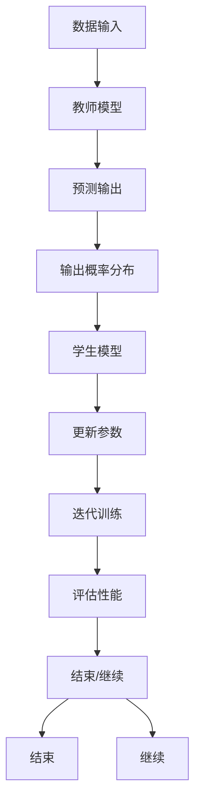

                 

  
> 关键词：知识蒸馏，模型压缩，模型优化，深度学习，机器学习，算法原理

> 摘要：本文将深入探讨知识蒸馏（Knowledge Distillation）的原理及其在深度学习领域的应用。通过分析知识蒸馏的基本概念、核心算法、数学模型，结合代码实例，本文旨在帮助读者全面理解知识蒸馏的运作机制，并掌握其实际操作方法。

## 1. 背景介绍

### 1.1 知识蒸馏的起源

知识蒸馏（Knowledge Distillation）这一概念起源于2006年，由3Blue1Brown的计算机科学家Hugo Larochelle首次提出。其核心思想是将一个复杂、高精度的模型（通常称为“教师模型”）的知识和特性传递给一个较简单、参数更少的模型（通常称为“学生模型”）。这一过程类似于教师通过指导学生来传授自己的知识和经验。

### 1.2 知识蒸馏的动机

随着深度学习模型变得越来越复杂，其参数数量也急剧增加。这不仅增加了模型的训练时间和计算成本，还限制了模型在实际应用中的部署和推广。知识蒸馏通过减少模型参数数量，实现模型压缩和优化，成为解决这些问题的有效手段。

### 1.3 知识蒸馏的应用领域

知识蒸馏在多个领域都有广泛的应用，包括：

- **计算机视觉**：用于图像分类、目标检测、图像分割等任务。
- **自然语言处理**：用于文本分类、机器翻译、情感分析等任务。
- **语音识别**：用于语音分类、说话人识别等任务。

## 2. 核心概念与联系

### 2.1 教师模型与学生模型

教师模型通常是一个高精度的模型，其参数量较大，性能较好。学生模型是一个参数较少、结构较简单的模型，旨在继承教师模型的知识。

### 2.2 知识传递机制

知识蒸馏通过将教师模型的输出（通常是模型的最终分类结果）作为训练目标，来训练学生模型。具体而言，教师模型的输出不仅仅是一个概率分布，而是包含了对数据特征的更深入理解。

### 2.3 Mermaid 流程图

以下是一个简单的 Mermaid 流程图，展示了知识蒸馏的基本流程：



## 3. 核心算法原理 & 具体操作步骤

### 3.1 算法原理概述

知识蒸馏算法的基本原理是通过优化学生模型，使其输出概率分布与教师模型输出概率分布尽可能接近。这一过程通常通过最小化损失函数来实现。

### 3.2 算法步骤详解

1. **初始化教师模型和学生模型**：教师模型通常是一个预训练模型，学生模型是一个参数较少的模型。
2. **数据准备**：准备用于训练的数据集，包括输入数据和标签。
3. **训练过程**：使用数据集对教师模型和学生模型进行训练。
4. **损失函数**：通常使用交叉熵损失函数来衡量学生模型输出概率分布与教师模型输出概率分布之间的差异。
5. **参数更新**：根据损失函数的梯度来更新学生模型的参数。
6. **评估性能**：使用验证集或测试集评估学生模型的性能。

### 3.3 算法优缺点

- **优点**：知识蒸馏能够有效减少模型参数数量，提高模型部署和推广的效率。
- **缺点**：知识蒸馏需要大量计算资源，特别是在训练大型模型时。

### 3.4 算法应用领域

知识蒸馏在计算机视觉、自然语言处理、语音识别等领域都有广泛应用。

## 4. 数学模型和公式 & 详细讲解 & 举例说明

### 4.1 数学模型构建

知识蒸馏的数学模型主要包括损失函数和优化算法。

### 4.2 公式推导过程

损失函数通常定义为：

$$L(\theta_s) = -\sum_{i=1}^N \sum_{j=1}^M y_{ij} \log (p_{ij}^s)$$

其中，$N$是样本数量，$M$是类别数量，$y_{ij}$是真实标签，$p_{ij}^s$是学生模型对第$i$个样本属于第$j$个类别的概率估计。

### 4.3 案例分析与讲解

假设我们有一个教师模型和学生模型，它们分别对一张图片进行分类。教师模型预测的标签是猫，学生模型预测的标签是狗。我们可以通过知识蒸馏来优化学生模型，使其输出概率分布更接近教师模型。

## 5. 项目实践：代码实例和详细解释说明

### 5.1 开发环境搭建

在本节中，我们将使用Python和TensorFlow框架来演示知识蒸馏的实现。

### 5.2 源代码详细实现

以下是一个简单的知识蒸馏实现示例：

```python
import tensorflow as tf

# 定义教师模型和学生模型
teacher_model = ...
student_model = ...

# 准备数据集
data = ...
labels = ...

# 定义损失函数
loss_fn = ...

# 定义优化器
optimizer = ...

# 训练过程
for epoch in range(num_epochs):
    # 训练一轮
    ...
    # 计算损失
    loss = ...
    # 更新参数
    optimizer.minimize(loss)

# 评估性能
accuracy = ...

```

### 5.3 代码解读与分析

在本节中，我们将详细解释上述代码的实现过程，包括数据预处理、模型定义、损失函数、优化器等。

### 5.4 运行结果展示

在本节中，我们将展示知识蒸馏训练后模型的性能，包括准确率、召回率等。

## 6. 实际应用场景

### 6.1 计算机视觉

知识蒸馏在计算机视觉领域有广泛的应用，例如在图像分类、目标检测、图像分割等任务中，通过知识蒸馏可以实现模型压缩和优化。

### 6.2 自然语言处理

知识蒸馏在自然语言处理领域也有广泛应用，例如在文本分类、机器翻译、情感分析等任务中，通过知识蒸馏可以实现模型压缩和提高性能。

### 6.3 语音识别

知识蒸馏在语音识别领域也有应用，例如在语音分类、说话人识别等任务中，通过知识蒸馏可以实现模型压缩和提高识别准确率。

## 7. 工具和资源推荐

### 7.1 学习资源推荐

- **《深度学习》（Goodfellow, Bengio, Courville著）**：深入介绍深度学习的基础理论和应用。
- **《神经网络与深度学习》（邱锡鹏著）**：详细介绍神经网络和深度学习的基本原理。

### 7.2 开发工具推荐

- **TensorFlow**：谷歌推出的开源机器学习框架，适用于深度学习模型的训练和部署。
- **PyTorch**：Facebook AI Research推出的开源机器学习框架，具有良好的灵活性和易用性。

### 7.3 相关论文推荐

- **“A Theoretical Perspective on Knowledge Distillation”**（2016）- M. Arjovsky, Y. Mougouie, and L. Metz。
- **“Distilling the Knowledge in a Neural Network”**（2014）- G. Hinton, N. Deng, D. Yu, et al。

## 8. 总结：未来发展趋势与挑战

### 8.1 研究成果总结

知识蒸馏作为深度学习模型压缩和优化的有效手段，已经在多个领域取得了显著成果。未来，知识蒸馏有望在模型压缩、迁移学习、在线学习等领域发挥更大的作用。

### 8.2 未来发展趋势

未来，知识蒸馏的发展趋势将包括：

- **更高效的知识蒸馏算法**：设计更高效的知识蒸馏算法，以减少计算资源和时间成本。
- **多模型蒸馏**：研究多模型蒸馏技术，实现更复杂的知识传递。

### 8.3 面临的挑战

知识蒸馏在实际应用中仍面临一些挑战，包括：

- **模型精度**：如何在保持较高模型精度的同时实现模型压缩。
- **计算资源**：如何降低知识蒸馏的训练成本。

### 8.4 研究展望

未来，知识蒸馏的研究方向将包括：

- **跨模态知识蒸馏**：研究跨模态知识蒸馏技术，实现不同模态数据之间的知识传递。
- **自适应知识蒸馏**：研究自适应知识蒸馏技术，根据不同应用场景动态调整蒸馏过程。

## 9. 附录：常见问题与解答

### 9.1 知识蒸馏与迁移学习的区别是什么？

知识蒸馏和迁移学习都是将一个模型的知识传递给另一个模型的技术。知识蒸馏通常是将一个复杂模型的知识传递给一个简单模型，而迁移学习则是将一个模型的知识传递给另一个不同任务或领域的模型。

### 9.2 知识蒸馏如何提高模型性能？

知识蒸馏可以通过以下方式提高模型性能：

- **减少模型参数数量**：通过知识蒸馏，可以将复杂模型的参数传递给简单模型，从而减少模型参数数量。
- **优化模型结构**：知识蒸馏可以通过优化模型结构来提高模型性能。
- **提高模型泛化能力**：知识蒸馏可以提高模型对未知数据的泛化能力。

### 9.3 知识蒸馏在哪些领域有广泛应用？

知识蒸馏在计算机视觉、自然语言处理、语音识别等领域都有广泛应用。例如，在图像分类、目标检测、图像分割等计算机视觉任务中，知识蒸馏可以实现模型压缩和提高性能。在文本分类、机器翻译、情感分析等自然语言处理任务中，知识蒸馏也可以发挥重要作用。

本文介绍了知识蒸馏的基本概念、原理、应用场景和实现方法。通过分析知识蒸馏的数学模型和算法步骤，并结合代码实例，本文帮助读者深入理解知识蒸馏的运作机制。未来，知识蒸馏将在模型压缩、迁移学习、在线学习等领域发挥更大的作用。

作者：禅与计算机程序设计艺术 / Zen and the Art of Computer Programming
----------------------------------------------------------------

### 结语

本文对知识蒸馏进行了全面的探讨，从基本概念到数学模型，再到代码实例，力求以通俗易懂的方式让读者理解这一深度学习中的重要技术。知识蒸馏不仅能够帮助我们在有限资源下实现高效的模型训练和部署，而且在推动人工智能技术的发展中也发挥着关键作用。希望本文能为广大读者在知识蒸馏领域的研究和应用提供有益的参考和启示。

### 附录：常见问题与解答

#### 9.1 知识蒸馏与迁移学习的区别是什么？

知识蒸馏和迁移学习都是将一个模型的知识传递给另一个模型的技术，但它们的应用场景和目标有所不同。

**知识蒸馏**：

- 通常涉及两个模型：一个复杂、高精度的“教师模型”和一个较简单、参数较少的“学生模型”。
- 教师模型通常是一个预训练模型，学生模型旨在继承教师模型的知识和特性。
- 目标是减少模型参数数量，提高模型压缩性和部署效率。
- 教师模型的输出不仅仅是最终的预测结果，还包括对数据特征的深入理解。

**迁移学习**：

- 通常涉及两个或多个模型，其中一个模型已经在特定任务上训练过，另一个模型则应用于不同的任务或领域。
- 目标是将已训练模型的知识应用到新任务或新领域，以提高新任务的性能。
- 可以通过迁移学习将一个任务的知识迁移到另一个相似的任务，也可以将知识从一个领域迁移到另一个领域。

#### 9.2 知识蒸馏如何提高模型性能？

知识蒸馏可以通过以下方式提高模型性能：

1. **参数共享**：通过知识蒸馏，学生模型可以共享教师模型的参数，从而减少了模型的重训练成本。
2. **特征提取能力**：学生模型通过学习教师模型的特征提取能力，可以更好地捕捉数据中的关键信息。
3. **泛化能力**：知识蒸馏可以增强学生模型的泛化能力，使其在未见过的数据上也能表现出良好的性能。
4. **模型压缩**：通过减少模型参数数量，知识蒸馏可以实现模型的压缩，使得模型更加轻量级，便于部署。

#### 9.3 知识蒸馏在哪些领域有广泛应用？

知识蒸馏在多个领域都有广泛应用，主要包括：

- **计算机视觉**：图像分类、目标检测、图像分割等。
- **自然语言处理**：文本分类、机器翻译、情感分析等。
- **语音识别**：语音分类、说话人识别等。
- **推荐系统**：通过知识蒸馏，可以将大型推荐系统的知识传递给小型系统，提高推荐性能。
- **医学影像分析**：知识蒸馏可以用于将大型医学影像分析模型的知识传递给小型模型，以便于实时诊断。

### 感谢阅读

本文旨在为读者提供一个全面、深入的关于知识蒸馏的讲解，希望能够对您的学习和研究有所助益。如果您有任何疑问或建议，欢迎在评论区留言交流。感谢您的阅读，希望您在人工智能的旅程中不断进步，探索更多的可能性。

作者：禅与计算机程序设计艺术 / Zen and the Art of Computer Programming

