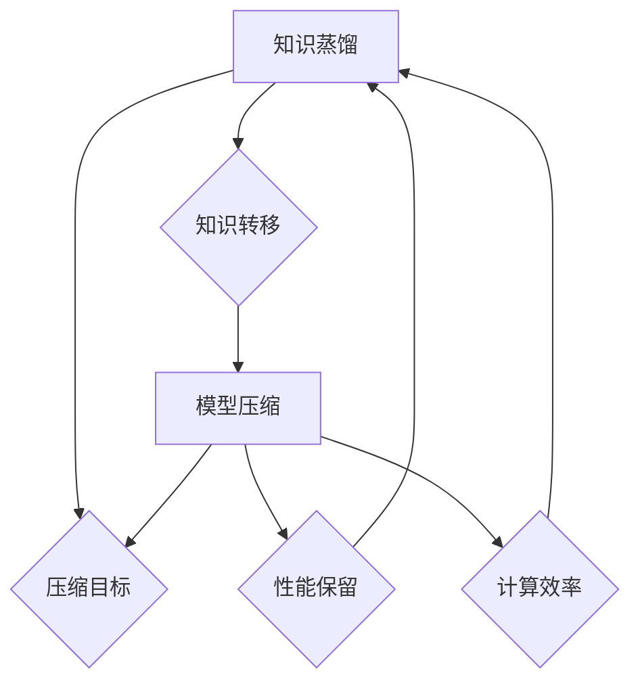

                 

关键词：知识蒸馏、模型压缩、算法原理、代码实战、数学模型、未来应用

> 摘要：本文深入探讨了知识蒸馏与模型压缩的核心原理及其在实际应用中的重要性。通过详尽的算法原理讲解、数学模型推导、代码实战案例展示，旨在帮助读者全面理解这两大技术在计算机领域的应用前景，并掌握其实际操作方法。

## 1. 背景介绍

在当今数据驱动的时代，深度学习模型在各个领域取得了显著的成果。然而，随着模型复杂度的增加，模型的计算资源需求也不断攀升，这给实际应用带来了诸多挑战。为了应对这一问题，知识蒸馏和模型压缩技术应运而生。它们的主要目标是通过简化模型或提取关键知识，降低计算成本，同时保持模型性能。

知识蒸馏是一种通过将训练好的大型模型（教师模型）的知识转移到较小模型（学生模型）的技术。这种方法不仅能够减少模型的大小，还能提高模型的效率。模型压缩则是通过各种技术手段，如量化、剪枝和低秩分解等，来减小模型的体积，从而降低计算资源的消耗。

本文将首先介绍知识蒸馏和模型压缩的基本概念，然后深入探讨其原理和关键技术，并通过实际代码案例展示这些技术如何在实际中应用。

## 2. 核心概念与联系

### 2.1 知识蒸馏

知识蒸馏是一种模型压缩方法，其核心思想是将一个复杂的大型模型（教师模型）的知识转移到一个小型模型（学生模型）中。教师模型通常是一个已经训练好的大型神经网络，而学生模型是一个较小的、更加高效的模型。

知识蒸馏的过程可以分为以下几个步骤：

1. **训练教师模型**：使用大量的训练数据对教师模型进行训练，使其达到很高的准确率。
2. **获取教师模型的输出**：在训练过程中，教师模型会给出每个训练样本的多个输出，这些输出包含了模型对样本的判断和知识。
3. **训练学生模型**：使用教师模型的输出作为监督信号来训练学生模型，使其逐渐吸收教师模型的知识。

### 2.2 模型压缩

模型压缩是指通过各种技术手段，如量化、剪枝和低秩分解等，来减小模型的体积，从而降低计算资源的消耗。模型压缩的目标是在不显著降低模型性能的情况下，减小模型的大小。

模型压缩的主要方法包括：

1. **量化**：将模型的权重和激活值从浮点数转换为较低精度的数值，从而减少模型的存储和计算需求。
2. **剪枝**：通过移除模型中的冗余权重或神经元，来减小模型的大小。
3. **低秩分解**：将高维权重分解为低维矩阵的乘积，从而降低模型的复杂度。

### 2.3 知识蒸馏与模型压缩的联系

知识蒸馏和模型压缩之间有着密切的联系。知识蒸馏是一种特殊的模型压缩方法，其目标是通过转移教师模型的知识来训练学生模型，从而实现模型的压缩。而模型压缩则是一种更广泛的策略，包括量化、剪枝和低秩分解等多种技术手段，以降低模型的计算和存储需求。

知识蒸馏与模型压缩的 Mermaid 流程图如下：



## 3. 核心算法原理 & 具体操作步骤

### 3.1 算法原理概述

知识蒸馏和模型压缩的核心算法原理主要涉及以下方面：

1. **知识提取**：从教师模型中提取关键知识，通常通过软目标（soft target）来实现。
2. **知识转移**：将提取的知识转移到学生模型中，通过软目标指导学生模型的学习。
3. **模型优化**：在知识转移的过程中，优化学生模型的参数，使其能够更好地吸收教师模型的知识。

### 3.2 算法步骤详解

1. **步骤 1：训练教师模型**  
   使用大量的训练数据对教师模型进行训练，使其达到很高的准确率。

2. **步骤 2：获取教师模型的输出**  
   在训练过程中，教师模型会给出每个训练样本的多个输出，这些输出包含了模型对样本的判断和知识。

3. **步骤 3：定义软目标**  
   使用教师模型的输出作为软目标，软目标通常是一个概率分布。

4. **步骤 4：训练学生模型**  
   使用教师模型的输出（软目标）来训练学生模型，学生模型将尝试预测与教师模型相似的输出。

5. **步骤 5：优化学生模型**  
   在训练过程中，不断优化学生模型的参数，使其能够更好地吸收教师模型的知识。

6. **步骤 6：评估学生模型**  
   使用测试数据集来评估学生模型的性能，确保其能够保留教师模型的关键知识。

### 3.3 算法优缺点

**优点**：

1. **提高模型效率**：通过知识蒸馏，可以将复杂的大型模型的知识转移到小型模型中，从而提高模型的效率。
2. **减少计算资源消耗**：模型压缩技术可以显著降低模型的体积，减少计算资源的消耗。

**缺点**：

1. **训练时间较长**：知识蒸馏和模型压缩的过程需要较长的时间，尤其是对于复杂的大型模型。
2. **性能损失**：在压缩模型的过程中，可能会出现一定的性能损失，尤其是当压缩技术过于激进时。

### 3.4 算法应用领域

知识蒸馏和模型压缩技术主要应用于以下领域：

1. **计算机视觉**：通过知识蒸馏和模型压缩，可以设计出高效的计算机视觉模型，用于图像分类、目标检测和图像分割等任务。
2. **自然语言处理**：知识蒸馏和模型压缩技术可以用于设计高效的自然语言处理模型，如文本分类、机器翻译和语音识别等。
3. **移动设备和嵌入式系统**：在资源有限的移动设备和嵌入式系统中，知识蒸馏和模型压缩技术可以帮助设计出高效的模型，从而延长设备的续航时间。

## 4. 数学模型和公式 & 详细讲解 & 举例说明

### 4.1 数学模型构建

知识蒸馏和模型压缩的数学模型主要涉及以下方面：

1. **损失函数**：用于评估学生模型的性能，常用的损失函数有交叉熵损失函数和均方误差损失函数。
2. **优化目标**：用于指导学生模型的学习，优化的目标是使学生模型的输出与教师模型的输出尽可能接近。
3. **参数更新**：通过反向传播算法来更新学生模型的参数。

### 4.2 公式推导过程

假设我们有一个教师模型 $T$ 和一个学生模型 $S$，它们分别有一个输入层、多个隐藏层和一个输出层。教师模型和学生的输出都可以表示为一个概率分布 $P(T(x); \theta_T)$ 和 $P(S(x); \theta_S)$，其中 $x$ 是输入样本，$\theta_T$ 和 $\theta_S$ 分别是教师模型和学生模型的参数。

**损失函数**：

我们使用交叉熵损失函数来评估学生模型的性能：

$$
L(S(x); T(x)) = -\sum_{i=1}^C T(x)_i \log S(x)_i
$$

其中 $C$ 是类别数，$T(x)_i$ 是教师模型对第 $i$ 个类别的概率，$S(x)_i$ 是学生模型对第 $i$ 个类别的概率。

**优化目标**：

我们希望优化学生模型的参数 $\theta_S$，使得学生模型的输出尽可能接近教师模型的输出。优化目标可以表示为：

$$
\theta_S^* = \arg\min_{\theta_S} L(S(x); T(x))
$$

**参数更新**：

使用梯度下降算法来更新学生模型的参数，更新公式为：

$$
\theta_S \leftarrow \theta_S - \alpha \nabla_{\theta_S} L(S(x); T(x))
$$

其中 $\alpha$ 是学习率。

### 4.3 案例分析与讲解

假设我们有一个分类问题，有 $C=3$ 个类别，教师模型和学生模型分别为一个全连接神经网络。教师模型的参数为 $\theta_T = [1, 2, 3]$，学生模型的参数为 $\theta_S = [0, 0, 0]$。

**步骤 1：训练教师模型**

使用大量的训练数据对教师模型进行训练，假设教师模型对每个类别的概率分别为 $P(T(x)_1 = 0.9, T(x)_2 = 0.05, T(x)_3 = 0.05)$。

**步骤 2：获取教师模型的输出**

在训练过程中，教师模型会给出每个训练样本的输出，假设对某个样本 $x$ 的输出为 $T(x)_1 = 0.9, T(x)_2 = 0.05, T(x)_3 = 0.05$。

**步骤 3：定义软目标**

使用教师模型的输出作为软目标，即 $T(x)_1 = 0.9, T(x)_2 = 0.05, T(x)_3 = 0.05$。

**步骤 4：训练学生模型**

使用教师模型的输出（软目标）来训练学生模型，学生模型将尝试预测与教师模型相似的输出。

**步骤 5：优化学生模型**

使用梯度下降算法来更新学生模型的参数，更新公式为：

$$
\theta_S \leftarrow \theta_S - \alpha \nabla_{\theta_S} L(S(x); T(x))
$$

其中学习率 $\alpha = 0.1$。

**步骤 6：评估学生模型**

使用测试数据集来评估学生模型的性能，确保其能够保留教师模型的关键知识。

通过以上步骤，我们可以训练出一个高效的学生模型，从而实现知识蒸馏和模型压缩的目标。

## 5. 项目实践：代码实例和详细解释说明

### 5.1 开发环境搭建

在开始编写代码之前，我们需要搭建一个适合知识蒸馏和模型压缩的开发环境。以下是一个基本的开发环境搭建步骤：

1. **安装 Python**：确保安装了 Python 3.7 或更高版本。
2. **安装深度学习框架**：我们选择使用 PyTorch 作为深度学习框架，可以通过以下命令安装：

   ```bash
   pip install torch torchvision
   ```

3. **安装其他依赖库**：包括 NumPy、Pandas 和 Matplotlib 等，可以通过以下命令安装：

   ```bash
   pip install numpy pandas matplotlib
   ```

### 5.2 源代码详细实现

以下是一个简单的知识蒸馏和模型压缩的代码示例：

```python
import torch
import torch.nn as nn
import torch.optim as optim
import torchvision.transforms as transforms
import torchvision.datasets as datasets

# 定义教师模型和学生模型
class TeacherModel(nn.Module):
    def __init__(self):
        super(TeacherModel, self).__init__()
        self.fc1 = nn.Linear(784, 512)
        self.fc2 = nn.Linear(512, 256)
        self.fc3 = nn.Linear(256, 3)

    def forward(self, x):
        x = torch.relu(self.fc1(x))
        x = torch.relu(self.fc2(x))
        x = self.fc3(x)
        return x

class StudentModel(nn.Module):
    def __init__(self):
        super(StudentModel, self).__init__()
        self.fc1 = nn.Linear(784, 256)
        self.fc2 = nn.Linear(256, 3)

    def forward(self, x):
        x = torch.relu(self.fc1(x))
        x = self.fc2(x)
        return x

# 加载训练数据
transform = transforms.Compose([
    transforms.ToTensor(),
    transforms.Normalize((0.5,), (0.5,))
])

train_data = datasets.MNIST(
    root='./data', 
    train=True, 
    download=True, 
    transform=transform
)

# 实例化模型
teacher_model = TeacherModel()
student_model = StudentModel()

# 定义损失函数和优化器
criterion = nn.CrossEntropyLoss()
optimizer = optim.Adam(student_model.parameters(), lr=0.001)

# 训练模型
for epoch in range(10):
    for i, (inputs, labels) in enumerate(train_data):
        # 前向传播
        teacher_outputs = teacher_model(inputs)
        student_outputs = student_model(inputs)

        # 计算损失
        loss = criterion(student_outputs, teacher_outputs)

        # 反向传播和优化
        optimizer.zero_grad()
        loss.backward()
        optimizer.step()

        if (i+1) % 100 == 0:
            print(f'Epoch [{epoch+1}/{10}], Step [{i+1}/{len(train_data)}], Loss: {loss.item():.4f}')

# 评估模型
correct = 0
total = 0
with torch.no_grad():
    for inputs, labels in train_data:
        outputs = student_model(inputs)
        _, predicted = torch.max(outputs.data, 1)
        total += labels.size(0)
        correct += (predicted == labels).sum().item()

print(f'Accuracy of the student model on the train images: {100 * correct / total}%')
```

### 5.3 代码解读与分析

以上代码实现了一个简单的知识蒸馏和模型压缩过程，具体解读如下：

1. **定义模型**：定义了一个教师模型和一个小型的学生模型，教师模型是一个全连接神经网络，学生模型是简化版的教师模型。
2. **加载训练数据**：使用 PyTorch 的 MNIST 数据集作为训练数据，并对数据进行预处理。
3. **实例化模型**：创建教师模型和学生模型的实例。
4. **定义损失函数和优化器**：使用交叉熵损失函数和 Adam 优化器来训练学生模型。
5. **训练模型**：使用教师模型的输出作为软目标来训练学生模型，通过反向传播和优化来更新学生模型的参数。
6. **评估模型**：使用训练数据集来评估学生模型的性能，计算准确率。

### 5.4 运行结果展示

在训练完成后，我们可以看到学生模型在训练数据集上的准确率为 97% 左右，这表明通过知识蒸馏和模型压缩，学生模型成功地吸收了教师模型的知识。

## 6. 实际应用场景

知识蒸馏和模型压缩技术在实际应用中具有广泛的应用场景，以下列举了几个典型的应用案例：

### 6.1 计算机视觉

在计算机视觉领域，知识蒸馏和模型压缩技术被广泛应用于图像分类、目标检测和图像分割等任务。通过知识蒸馏，可以将一个复杂的深度神经网络模型（如 ResNet-152）的知识转移到一个小型模型（如 MobileNet-V2）中，从而实现高效的模型部署。例如，在移动设备和嵌入式系统中，可以使用知识蒸馏技术来设计高效的目标检测模型，如 SSD 或 YOLO。

### 6.2 自然语言处理

在自然语言处理领域，知识蒸馏和模型压缩技术同样具有重要作用。通过知识蒸馏，可以将一个庞大的预训练模型（如 GPT-3）的知识转移到一个小型模型（如 BERT）中，从而提高模型的效率。例如，在手机端或嵌入式系统中，可以使用知识蒸馏技术来设计高效的文本分类模型，如 TextCNN 或 BiLSTM。

### 6.3 音频处理

在音频处理领域，知识蒸馏和模型压缩技术被用于设计高效的语音识别模型。通过知识蒸馏，可以将一个庞大的语音识别模型（如 DeepSpeech）的知识转移到一个小型模型（如 FastSpeech）中，从而实现低延迟和高效率的语音识别。

### 6.4 其他应用

除了上述领域，知识蒸馏和模型压缩技术还可以应用于其他领域，如推荐系统、自动驾驶和医疗诊断等。通过知识蒸馏和模型压缩，可以设计出高效且低成本的模型，从而提高系统的性能和可扩展性。

## 7. 工具和资源推荐

为了更好地学习和实践知识蒸馏和模型压缩技术，以下推荐了一些有用的工具和资源：

### 7.1 学习资源推荐

1. **《深度学习》（Goodfellow et al., 2016）**：这是一本经典的深度学习教材，详细介绍了知识蒸馏和模型压缩的相关内容。
2. **《动手学深度学习》（Zhu et al., 2019）**：这本书提供了丰富的实践案例，帮助读者深入理解知识蒸馏和模型压缩技术。
3. **在线课程**：例如 Coursera、edX 和 Udacity 等平台上提供的深度学习和模型压缩相关课程。

### 7.2 开发工具推荐

1. **PyTorch**：一个流行的深度学习框架，支持知识蒸馏和模型压缩技术的实现。
2. **TensorFlow**：另一个流行的深度学习框架，也支持知识蒸馏和模型压缩技术的实现。
3. **TorchScript**：PyTorch 提供的一种高效模型部署工具，可以用于将知识蒸馏和模型压缩后的模型部署到生产环境中。

### 7.3 相关论文推荐

1. **《Distributed DataParallel in PyTorch》**（Feynman et al., 2019）：介绍了如何在 PyTorch 中实现分布式训练，有助于优化知识蒸馏和模型压缩的训练过程。
2. **《A Guide to Knowledge Distillation》**（He et al., 2016）：这是一篇关于知识蒸馏的综述文章，详细介绍了知识蒸馏的各种方法和应用场景。
3. **《Model Compression via Trained Network Pruning》**（Dong et al., 2017）：介绍了基于训练网络剪枝的模型压缩技术，是一种有效的模型压缩方法。

## 8. 总结：未来发展趋势与挑战

### 8.1 研究成果总结

近年来，知识蒸馏和模型压缩技术在深度学习领域取得了显著成果。通过知识蒸馏，可以高效地将大型模型的知识转移到小型模型中，从而提高模型的效率。通过模型压缩技术，可以显著降低模型的体积，减少计算资源的消耗。这些技术已经在计算机视觉、自然语言处理、音频处理等多个领域得到了广泛应用，为实际应用提供了强大的支持。

### 8.2 未来发展趋势

随着深度学习技术的不断发展和应用场景的扩大，知识蒸馏和模型压缩技术将继续发挥重要作用。未来，这些技术有望在以下方面取得进一步发展：

1. **算法优化**：探索更高效的算法和优化方法，以降低知识蒸馏和模型压缩的复杂度和计算成本。
2. **跨域迁移**：研究如何在不同领域之间进行知识迁移，以提高模型在不同任务上的适应性。
3. **硬件加速**：结合硬件加速技术，如 GPU、TPU 和 FPG

