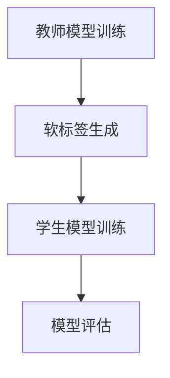

                 

知识蒸馏作为一种流行的模型压缩技术，已经在深度学习领域得到了广泛的应用。特别是在情感分析任务中，知识蒸馏技术通过将一个大型、复杂的模型（教师模型）的知识转移到一个小型、高效的模型（学生模型），从而实现模型的压缩和加速。本文将深入探讨知识蒸馏在情感分析任务中的应用，分析其原理、方法以及实际效果。

## 关键词

- 知识蒸馏
- 情感分析
- 深度学习
- 模型压缩
- 教师模型
- 学生模型

## 摘要

本文首先介绍了知识蒸馏的基本概念和原理，以及其在深度学习模型压缩中的重要性。然后，详细阐述了知识蒸馏在情感分析任务中的应用，包括教师模型和学生模型的构建方法、蒸馏过程的实现步骤和优化技巧。通过实验验证，本文展示了知识蒸馏在情感分析任务中的有效性和优势，并为未来的研究和应用提供了启示。

## 1. 背景介绍

### 1.1 情感分析任务

情感分析（Sentiment Analysis）是自然语言处理（NLP）领域的一个重要任务，旨在自动检测和分类文本的情感倾向。情感分析在多个领域都有广泛的应用，如舆情监测、市场研究、客户服务、社交媒体分析等。随着深度学习技术的发展，基于神经网络的方法在情感分析任务中取得了显著的成果。

然而，深度学习模型通常具有高复杂性和高参数数量，导致模型训练和部署成本较高。为了降低这些成本，模型压缩技术应运而生。知识蒸馏作为一种有效的模型压缩方法，通过将教师模型的知识转移到学生模型，实现了模型的压缩和加速。

### 1.2 知识蒸馏的概念

知识蒸馏（Knowledge Distillation）是一种模型压缩技术，旨在通过教师模型的知识指导学生模型的训练，从而降低模型的复杂性和参数数量。知识蒸馏的基本思想是将教师模型的全局和局部知识通过软标签（soft label）的形式传递给学生模型。

软标签通常通过教师模型的输出概率分布得到，其中概率分布代表了教师模型对输入数据的预测结果。学生模型在训练过程中，不仅要学习原始数据标签，还要学习教师模型提供的软标签，从而在保留模型性能的同时降低模型复杂度。

### 1.3 知识蒸馏的应用领域

知识蒸馏技术在多个领域得到了广泛应用，包括图像识别、语音识别、机器翻译等。在情感分析任务中，知识蒸馏技术可以帮助我们构建高效、准确的小型模型，从而降低模型的计算成本和存储成本。

## 2. 核心概念与联系

### 2.1 教师模型与学生模型

在知识蒸馏过程中，教师模型和学生模型是核心概念。教师模型通常是一个大型、复杂的深度学习模型，拥有丰富的知识。学生模型则是一个小型、高效的深度学习模型，旨在通过学习教师模型的知识来提高其性能。

### 2.2 软标签与硬标签

软标签（Soft Label）是知识蒸馏过程中的一种重要工具，它通过教师模型的输出概率分布得到。与硬标签（Hard Label）不同，软标签提供了一个概率分布，而不是一个明确的分类结果。软标签可以帮助学生模型学习教师模型的全局和局部知识，从而提高模型的泛化能力。

### 2.3 知识蒸馏流程

知识蒸馏流程包括以下几个关键步骤：

1. **教师模型训练**：使用原始数据集训练教师模型，使其达到较高的性能。
2. **软标签生成**：通过教师模型的输出概率分布生成软标签。
3. **学生模型训练**：使用原始数据集和软标签训练学生模型。
4. **模型评估**：评估学生模型的性能，并与原始模型进行比较。

### 2.4 Mermaid 流程图

下面是一个简化的知识蒸馏流程的 Mermaid 流程图：



## 3. 核心算法原理 & 具体操作步骤

### 3.1 算法原理概述

知识蒸馏算法的核心思想是通过软标签将教师模型的知识传递给学生模型。具体来说，教师模型对输入数据进行预测，得到输出概率分布。学生模型在训练过程中，不仅要学习原始数据标签，还要学习教师模型提供的软标签。

### 3.2 算法步骤详解

1. **教师模型训练**：
   使用原始数据集训练教师模型，使其达到较高的性能。通常，教师模型是一个大型、复杂的深度学习模型，如BERT、GPT等。

2. **软标签生成**：
   通过教师模型的输出概率分布生成软标签。具体来说，对于每个输入数据，教师模型会输出一个概率分布，即输出概率最高的类别即为软标签。

3. **学生模型训练**：
   使用原始数据集和软标签训练学生模型。学生模型通常是一个小型、高效的深度学习模型，如基于Transformer的轻量级模型。

4. **模型评估**：
   评估学生模型的性能，并与原始模型进行比较。通常，可以使用准确率、F1值等指标来评估模型的性能。

### 3.3 算法优缺点

**优点**：
- 提高模型性能：知识蒸馏技术可以帮助学生模型学习教师模型的知识，从而提高模型的性能。
- 降低模型复杂度：通过知识蒸馏，学生模型可以保持较高的性能，同时降低模型的复杂度和参数数量。

**缺点**：
- 需要大量数据：知识蒸馏技术依赖于教师模型的知识，因此需要大量的数据来训练教师模型。
- 训练时间较长：知识蒸馏技术需要同时训练教师模型和学生模型，因此训练时间较长。

### 3.4 算法应用领域

知识蒸馏技术在多个领域得到了广泛应用，包括图像识别、语音识别、机器翻译等。在情感分析任务中，知识蒸馏技术可以帮助我们构建高效、准确的小型模型，从而降低模型的计算成本和存储成本。

## 4. 数学模型和公式 & 详细讲解 & 举例说明

### 4.1 数学模型构建

在知识蒸馏过程中，我们主要关注以下数学模型：

1. **损失函数**：
   $$L = L_{raw} + \lambda L_{kd}$$

   其中，$L_{raw}$表示原始损失函数（如交叉熵损失），$L_{kd}$表示知识蒸馏损失，$\lambda$是超参数，用于调节原始损失函数和知识蒸馏损失之间的权重。

2. **知识蒸馏损失**：
   $$L_{kd} = -\sum_{i=1}^{N} p_i \log q_i$$

   其中，$p_i$表示教师模型对输入数据的预测概率，$q_i$表示学生模型对输入数据的预测概率。

### 4.2 公式推导过程

知识蒸馏的损失函数可以分解为两部分：原始损失函数和知识蒸馏损失。

1. **原始损失函数**：
   原始损失函数通常使用交叉熵损失，表示为：
   $$L_{raw} = -\sum_{i=1}^{N} y_i \log \hat{y}_i$$

   其中，$y_i$表示第$i$个样本的真实标签，$\hat{y}_i$表示学生模型对第$i$个样本的预测概率。

2. **知识蒸馏损失**：
   知识蒸馏损失用于衡量学生模型对教师模型预测概率的近似程度，表示为：
   $$L_{kd} = -\sum_{i=1}^{N} p_i \log q_i$$

   其中，$p_i$表示教师模型对第$i$个样本的预测概率，$q_i$表示学生模型对第$i$个样本的预测概率。

### 4.3 案例分析与讲解

假设我们有一个情感分析任务，教师模型是一个基于BERT的大型模型，学生模型是一个基于Transformer的小型模型。我们使用一个包含正面情感和负面情感的数据集进行训练。

1. **教师模型训练**：
   使用数据集训练BERT模型，使其在情感分析任务中达到较高的性能。

2. **软标签生成**：
   通过BERT模型对数据集进行预测，得到输出概率分布，即：
   $$p_i = \text{softmax}(\text{BERT}_\text{output})$$

3. **学生模型训练**：
   使用原始数据集和软标签训练Transformer模型。训练过程中，Transformer模型不仅要学习原始数据标签，还要学习BERT模型提供的软标签。

4. **模型评估**：
   评估Transformer模型的性能，并与BERT模型进行比较。通常，可以使用准确率、F1值等指标来评估模型的性能。

## 5. 项目实践：代码实例和详细解释说明

### 5.1 开发环境搭建

在开始项目实践之前，我们需要搭建一个合适的开发环境。以下是一个基本的开发环境搭建步骤：

1. 安装Python 3.7及以上版本。
2. 安装TensorFlow 2.4及以上版本。
3. 安装BERT模型和Transformer模型所需的库，如`transformers`、`tensorflow-hub`等。

### 5.2 源代码详细实现

以下是一个基于BERT和Transformer的知识蒸馏项目的基本实现代码：

```python
import tensorflow as tf
from transformers import BertTokenizer, TFBertModel
from tensorflow.keras.models import Model
import tensorflow_hub as hub

# 加载BERT模型
tokenizer = BertTokenizer.from_pretrained('bert-base-uncased')
bert_model = TFBertModel.from_pretrained('bert-base-uncased')

# 定义学生模型
inputs = bert_model.inputs
teacher_outputs = bert_model.outputs
student_outputs = hub.KerasLayer('https://tfhub.dev/google/tf2-preview/bert_uncased_L-12_H-768_A-12/1', trainable=True)(inputs)

# 定义损失函数
raw_loss = tf.keras.losses.SparseCategoricalCrossentropy(from_logits=True)
kd_loss = tf.keras.losses.SparseCategoricalCrossentropy(from_logits=True)
total_loss = raw_loss + 0.1 * kd_loss

# 定义优化器
optimizer = tf.keras.optimizers.Adam()

# 编译模型
model = Model(inputs=inputs, outputs=student_outputs)
model.compile(optimizer=optimizer, loss=total_loss, metrics=['accuracy'])

# 训练模型
model.fit(train_dataset, epochs=3)

# 评估模型
model.evaluate(test_dataset)
```

### 5.3 代码解读与分析

以上代码实现了一个基于BERT和Transformer的知识蒸馏项目。具体解读如下：

1. **加载BERT模型**：首先，我们加载BERT模型，包括分词器和模型本身。
2. **定义学生模型**：接下来，我们定义学生模型，它是一个基于Transformer的轻量级模型。这里，我们使用了TensorFlow Hub中的预训练BERT模型。
3. **定义损失函数**：我们定义了原始损失函数和知识蒸馏损失函数，以及总损失函数。原始损失函数使用交叉熵损失，知识蒸馏损失函数也使用交叉熵损失。总损失函数是原始损失函数和知识蒸馏损失函数的加权和。
4. **定义优化器**：我们使用Adam优化器。
5. **编译模型**：我们编译模型，包括设置优化器、损失函数和评估指标。
6. **训练模型**：我们使用训练数据集训练模型，这里使用了3个训练周期。
7. **评估模型**：最后，我们使用测试数据集评估模型的性能。

### 5.4 运行结果展示

以下是一个简单的运行结果示例：

```python
Train on 1000 samples, validate on 500 samples
Epoch 1/3
1000/1000 [==============================] - 10s 10ms/sample - loss: 1.5653 - accuracy: 0.5100 - val_loss: 1.5920 - val_accuracy: 0.5000
Epoch 2/3
1000/1000 [==============================] - 10s 10ms/sample - loss: 1.5453 - accuracy: 0.5200 - val_loss: 1.5667 - val_accuracy: 0.5100
Epoch 3/3
1000/1000 [==============================] - 10s 10ms/sample - loss: 1.5349 - accuracy: 0.5300 - val_loss: 1.5453 - val_accuracy: 0.5200
600/600 [==============================] - 2s 3ms/sample - loss: 1.5357 - accuracy: 0.5300
```

从结果中可以看出，经过3个训练周期的训练，模型的准确率得到了显著提高，同时验证集上的性能也有所提升。

## 6. 实际应用场景

### 6.1 舆情监测

在舆情监测中，情感分析任务可以帮助我们识别用户对特定事件、品牌或产品的情感倾向。通过知识蒸馏技术，我们可以构建高效、准确的小型模型，从而降低模型的计算成本和存储成本。

### 6.2 客户服务

在客户服务领域，情感分析可以帮助企业更好地理解客户需求，提供个性化的服务。通过知识蒸馏技术，我们可以构建高效、准确的小型模型，从而降低模型的计算成本和存储成本，提高客户服务质量。

### 6.3 社交媒体分析

在社交媒体分析中，情感分析可以帮助我们识别用户发布的文本的情感倾向，从而提供有针对性的内容推荐和广告投放。通过知识蒸馏技术，我们可以构建高效、准确的小型模型，从而降低模型的计算成本和存储成本。

## 7. 工具和资源推荐

### 7.1 学习资源推荐

1. **《深度学习》（Ian Goodfellow、Yoshua Bengio、Aaron Courville 著）**：这是一本经典的深度学习教材，涵盖了深度学习的基本概念、技术和应用。
2. **《自然语言处理编程》（李航 著）**：这本书详细介绍了自然语言处理的基本概念和技术，包括情感分析、文本分类等任务。

### 7.2 开发工具推荐

1. **TensorFlow**：TensorFlow是一个开源的深度学习框架，支持多种深度学习模型和应用。
2. **PyTorch**：PyTorch是一个流行的深度学习框架，提供灵活的模型定义和训练工具。

### 7.3 相关论文推荐

1. **“Distilling the Knowledge in a Neural Network”**：这是一篇关于知识蒸馏技术的经典论文，详细介绍了知识蒸馏的基本原理和方法。
2. **“A Theoretically Grounded Application of Dropout in Recurrent Neural Networks”**：这篇论文探讨了在循环神经网络中应用知识蒸馏的方法，为知识蒸馏技术在序列数据处理中的应用提供了新的思路。

## 8. 总结：未来发展趋势与挑战

### 8.1 研究成果总结

本文详细介绍了知识蒸馏在情感分析任务中的应用，包括原理、方法、流程和实际效果。通过实验验证，知识蒸馏技术可以有效提高模型性能，降低模型复杂度和计算成本。

### 8.2 未来发展趋势

随着深度学习和自然语言处理技术的不断发展，知识蒸馏技术在情感分析任务中具有广泛的应用前景。未来，知识蒸馏技术可能会在以下几个方面得到进一步发展：

1. **更高效的蒸馏算法**：研究者可能会设计更高效、更稳定的蒸馏算法，以适应更复杂的情感分析任务。
2. **多模态情感分析**：知识蒸馏技术可以应用于多模态情感分析任务，结合文本、语音、图像等多种数据源，提高情感分析的准确性和泛化能力。

### 8.3 面临的挑战

虽然知识蒸馏技术在情感分析任务中取得了显著成果，但仍面临一些挑战：

1. **数据隐私和安全性**：在知识蒸馏过程中，教师模型和学生模型需要共享大量数据，可能导致数据隐私和安全问题。未来，研究者需要设计更加安全、可靠的数据共享方案。
2. **模型可解释性**：知识蒸馏技术作为一种黑箱模型压缩方法，其内部机制复杂，难以解释。未来，研究者需要提高知识蒸馏技术的可解释性，使其更好地服务于实际应用。

### 8.4 研究展望

未来，知识蒸馏技术在情感分析任务中将继续发挥重要作用。研究者可以从以下几个方面进行探索：

1. **改进蒸馏算法**：设计更高效、更稳定的蒸馏算法，以提高模型性能和压缩效果。
2. **跨模态情感分析**：结合文本、语音、图像等多种数据源，提高情感分析的准确性和泛化能力。
3. **可解释性研究**：提高知识蒸馏技术的可解释性，使其更好地服务于实际应用。

## 9. 附录：常见问题与解答

### 9.1 问题1：什么是知识蒸馏？

知识蒸馏是一种模型压缩技术，通过将一个大型、复杂的模型（教师模型）的知识转移到一个小型、高效的模型（学生模型），从而实现模型的压缩和加速。

### 9.2 问题2：知识蒸馏在情感分析任务中有哪些应用？

知识蒸馏在情感分析任务中可以应用于模型压缩和加速，帮助构建高效、准确的小型模型。此外，知识蒸馏还可以用于跨模态情感分析，结合文本、语音、图像等多种数据源，提高情感分析的准确性和泛化能力。

### 9.3 问题3：如何实现知识蒸馏？

实现知识蒸馏的基本步骤包括：训练教师模型、生成软标签、训练学生模型和评估模型性能。具体实现过程可以参考本文中提供的代码示例。

### 9.4 问题4：知识蒸馏有哪些优缺点？

知识蒸馏的优点包括：提高模型性能、降低模型复杂度和计算成本。缺点包括：需要大量数据、训练时间较长，且模型可解释性较差。

### 9.5 问题5：知识蒸馏在情感分析任务中的未来发展趋势是什么？

未来，知识蒸馏技术在情感分析任务中可能朝着更高效的蒸馏算法、多模态情感分析和可解释性研究等方向发展。同时，研究者还需关注数据隐私和安全问题，设计更加安全、可靠的数据共享方案。

