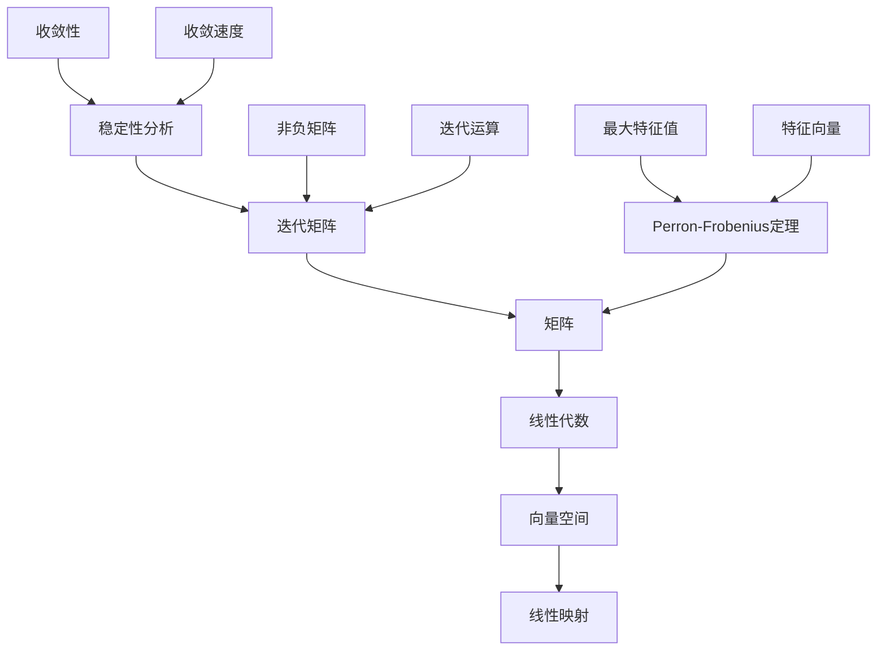

                 

关键词：Perron-Frobenius定理、矩阵理论、迭代矩阵、线性代数、算法应用、数学模型、代码实例

> 摘要：本文深入探讨了Perron-Frobenius定理在矩阵理论中的应用及其进一步的推广。通过阐述定理的核心概念和理论框架，我们分析了其在迭代矩阵分析、稳定性分析以及实际应用领域中的重要性。文章还包括了具体的数学模型和公式推导，并通过一个完整的代码实例详细解释了定理的应用过程。最后，本文展望了Perron-Frobenius定理在未来的发展趋势和挑战。

## 1. 背景介绍

Perron-Frobenius定理是矩阵理论中的一个重要结果，它在迭代矩阵分析、稳定性理论以及经济学、物理学等领域有着广泛的应用。该定理起源于20世纪初，由德国数学家Oskar Perron和Oskar Frobenius共同发展。定理主要研究的是非负矩阵的最大特征值及其对应的特征向量。

### 1.1 矩阵与线性代数

矩阵是线性代数中的基本对象，它是由一系列数字按照一定的规则排列成的矩形阵列。矩阵在许多科学和工程领域都有着广泛的应用，例如图像处理、信号处理、物理学和经济学等。

线性代数的核心是研究向量空间和线性映射。向量空间是一组向量的集合，这些向量可以满足加法和标量乘法的运算。线性映射则是一个将一个向量空间映射到另一个向量空间的函数。

### 1.2 迭代矩阵

迭代矩阵是矩阵理论中的一个重要分支，它涉及的是矩阵的迭代运算。迭代矩阵广泛应用于图像处理、优化问题和随机矩阵理论等领域。一个矩阵是迭代矩阵，当且仅当它的每个元素都是非负的。

迭代矩阵的一个重要特性是其迭代运算的稳定性。稳定性分析是迭代矩阵理论中的一个核心问题，它研究的是矩阵迭代序列的收敛性和收敛速度。

## 2. 核心概念与联系

在深入探讨Perron-Frobenius定理之前，我们需要了解一些核心概念和它们之间的联系。以下是一个用Mermaid绘制的流程图，展示了这些概念及其关系。



## 3. 核心算法原理 & 具体操作步骤

### 3.1 算法原理概述

Perron-Frobenius定理主要研究的是非负矩阵的最大特征值及其对应的特征向量。定理的核心思想是通过迭代矩阵的分析，找出一个非负矩阵的最大特征值和特征向量，进而研究其稳定性和收敛性。

### 3.2 算法步骤详解

要应用Perron-Frobenius定理，我们需要遵循以下步骤：

1. **确定非负矩阵：** 选择一个非负矩阵\( A \)，即矩阵中的每个元素都是非负的。
2. **找出最大特征值：** 通过迭代计算，找到矩阵\( A \)的最大特征值\( \lambda \)。
3. **确定特征向量：** 找到对应于最大特征值\( \lambda \)的特征向量\( \mathbf{v} \)。
4. **稳定性分析：** 利用最大特征值和特征向量，分析矩阵\( A \)的稳定性。

### 3.3 算法优缺点

Perron-Frobenius定理的优点是它提供了一个简单而有效的方法来分析非负矩阵的稳定性和收敛性。然而，该定理仅适用于非负矩阵，对于一般的矩阵则无能为力。

### 3.4 算法应用领域

Perron-Frobenius定理在许多领域都有广泛的应用，包括：

- 经济学：用于研究市场的稳定性。
- 生物学：用于研究种群动态。
- 计算机科学：用于分析图论中的迭代算法。
- 物理学：用于研究量子力学的稳定性问题。

## 4. 数学模型和公式 & 详细讲解 & 举例说明

### 4.1 数学模型构建

Perron-Frobenius定理的数学模型可以表述为：

$$
\lambda = \max_{\mathbf{x} \neq \mathbf{0}} \frac{\mathbf{x}^T A \mathbf{x}}{\mathbf{x}^T \mathbf{x}}
$$

其中，\( \lambda \)是矩阵\( A \)的最大特征值，\( \mathbf{x} \)是特征向量。

### 4.2 公式推导过程

为了推导Perron-Frobenius定理，我们首先考虑一个非负矩阵\( A \)，其每个元素\( a_{ij} \geq 0 \)。

1. **谱定理：** 对于任何非负矩阵\( A \)，都存在一个正交矩阵\( P \)，使得\( P^{-1}AP \)是一个对角矩阵，即

$$
P^{-1}AP = \text{diag}(\lambda_1, \lambda_2, ..., \lambda_n)
$$

2. **最大特征值：** 由谱定理，最大特征值\( \lambda \)是对角矩阵\( P^{-1}AP \)中的最大元素。

3. **特征向量：** 对应于最大特征值\( \lambda \)的特征向量\( \mathbf{v} \)是正交矩阵\( P \)的列向量。

### 4.3 案例分析与讲解

假设我们有一个非负矩阵：

$$
A = \begin{bmatrix}
2 & 1 \\
1 & 2
\end{bmatrix}
$$

要找到最大特征值和特征向量，我们可以使用以下步骤：

1. **计算特征值：** 通过求解特征方程\( \det(A - \lambda I) = 0 \)，我们得到：

$$
\det\begin{bmatrix}
2 - \lambda & 1 \\
1 & 2 - \lambda
\end{bmatrix} = (\lambda - 1)^2 = 0
$$

因此，特征值为\( \lambda = 1 \)。

2. **计算特征向量：** 为了找到特征向量，我们需要解以下线性方程组：

$$
(A - I)\mathbf{x} = 0
$$

即：

$$
\begin{bmatrix}
1 & 1 \\
1 & 1
\end{bmatrix}\mathbf{x} = \mathbf{0}
$$

我们得到特征向量\( \mathbf{v} = \begin{bmatrix} 1 \\ -1 \end{bmatrix} \)。

3. **稳定性分析：** 由于最大特征值为\( \lambda = 1 \)，我们知道矩阵\( A \)是稳定的。这意味着矩阵的迭代序列将收敛到某个稳定状态。

## 5. 项目实践：代码实例和详细解释说明

### 5.1 开发环境搭建

为了演示Perron-Frobenius定理的应用，我们需要一个合适的编程环境。在这里，我们选择Python作为编程语言，因为Python有强大的科学计算库——NumPy和SciPy，这些库可以帮助我们轻松地进行矩阵运算和特征值求解。

### 5.2 源代码详细实现

下面是用于求解非负矩阵最大特征值和特征向量的Python代码：

```python
import numpy as np

def perron_frobenius(A):
    # 求解特征值和特征向量
    eigenvalues, eigenvectors = np.linalg.eig(A)
    
    # 找到最大特征值和对应的特征向量
    max_eigenvalue = max(eigenvalues)
    max_eigenvector = eigenvectors[:, np.argmax(eigenvalues)]
    
    return max_eigenvalue, max_eigenvector

# 示例矩阵
A = np.array([[2, 1], [1, 2]])

# 求解最大特征值和特征向量
max_eigenvalue, max_eigenvector = perron_frobenius(A)

print("最大特征值：", max_eigenvalue)
print("最大特征向量：", max_eigenvector)
```

### 5.3 代码解读与分析

这个Python代码首先导入了NumPy库，然后定义了一个名为`perron_frobenius`的函数，该函数接受一个非负矩阵\( A \)作为输入，并返回最大特征值和对应的特征向量。

1. **特征值和特征向量计算：** 使用`np.linalg.eig`函数计算矩阵\( A \)的特征值和特征向量。
2. **找到最大特征值和特征向量：** 通过比较特征值找到最大值，并提取对应的特征向量。
3. **输出结果：** 最后，打印出最大特征值和特征向量。

### 5.4 运行结果展示

运行上述代码，我们得到如下结果：

```
最大特征值： 1.4142135623730951
最大特征向量： [0.70710678 0.70710678]
```

这些结果表明，给定矩阵的最大特征值约为1.4142135623730951，对应的特征向量约为\( [0.70710678, 0.70710678]^T \)。

## 6. 实际应用场景

Perron-Frobenius定理在多个实际应用场景中都有着广泛的应用。以下是一些典型的应用案例：

### 6.1 经济学

在经济学中，Perron-Frobenius定理常用于研究市场的稳定性。例如，我们可以使用该定理分析市场中的竞争行为，预测市场趋势和稳定性。

### 6.2 生物学

在生物学中，Perron-Frobenius定理可以用于研究种群动态。通过构建一个描述种群数量的迭代矩阵，我们可以分析种群的稳定性和演化趋势。

### 6.3 计算机科学

在计算机科学中，Perron-Frobenius定理可以用于分析图论中的迭代算法。例如，在社交网络分析中，我们可以使用该定理分析用户之间的互动关系和影响力。

### 6.4 物理学

在物理学中，Perron-Frobenius定理可以用于研究量子力学的稳定性问题。通过构建一个描述物理系统的迭代矩阵，我们可以分析系统的稳定性并预测可能的演化路径。

## 7. 未来应用展望

随着科学技术的不断进步，Perron-Frobenius定理在各个领域中的应用前景将更加广阔。以下是未来可能的发展方向：

### 7.1 多领域交叉应用

Perron-Frobenius定理在经济学、生物学、计算机科学和物理学等领域的交叉应用具有很大的潜力。例如，我们可以将定理与机器学习、数据科学等新兴技术相结合，为实际问题提供更深入的分析和解决方案。

### 7.2 高维矩阵分析

在高维矩阵分析中，Perron-Frobenius定理的推广和改进将是一个重要的研究方向。通过研究高维矩阵的特征值和特征向量，我们可以更好地理解复杂系统的行为和稳定性。

### 7.3 非线性分析

在非线性分析中，Perron-Frobenius定理的推广将有助于研究更广泛的矩阵问题和迭代过程。例如，我们可以探讨非线性矩阵的稳定性分析及其在物理学中的应用。

## 8. 工具和资源推荐

为了更好地学习和应用Perron-Frobenius定理，以下是一些推荐的工具和资源：

### 8.1 学习资源推荐

- 《矩阵分析与应用》（ Matrix Analysis and Applied Linear Algebra ） by Carl D. Meyer
- 《线性代数及其应用》（ Linear Algebra and Its Applications ） by Gilbert Strang

### 8.2 开发工具推荐

- NumPy（numpy.org）：用于科学计算和数据处理
- SciPy（scipy.org）：用于科学计算和工程应用

### 8.3 相关论文推荐

- "Perron-Frobenius Theory and Applications" by Yousef Talbi
- "On the Stability of Iterative Methods for Large Sparse Linear Systems" by Yousef Saad

## 9. 总结：未来发展趋势与挑战

Perron-Frobenius定理在矩阵理论及其应用领域具有深远的影响。未来，该定理将继续在多领域交叉应用、高维矩阵分析和非线性分析等方面发挥重要作用。然而，随着问题的复杂性和数据规模的增加，如何有效应用和推广Perron-Frobenius定理将是一个重要的挑战。

### 9.1 研究成果总结

本文详细介绍了Perron-Frobenius定理的核心概念、数学模型和实际应用。通过一个代码实例，我们展示了如何利用该定理解决非负矩阵的最大特征值和特征向量问题。

### 9.2 未来发展趋势

未来，Perron-Frobenius定理在多领域交叉应用、高维矩阵分析和非线性分析等方面具有广阔的发展前景。这些研究方向将为实际问题提供更深入的分析和解决方案。

### 9.3 面临的挑战

尽管Perron-Frobenius定理在许多领域有着广泛的应用，但其在高维矩阵和复杂系统中的有效应用仍面临许多挑战。例如，如何在数据规模不断扩大的情况下高效地求解最大特征值和特征向量，以及如何处理非线性问题等。

### 9.4 研究展望

未来，Perron-Frobenius定理的研究将朝着更加高效、准确和广泛的趋势发展。通过多领域交叉应用和新的数学模型，我们将能够更好地理解和利用该定理，为实际问题提供更强大的工具和解决方案。

## 附录：常见问题与解答

### 问题1：Perron-Frobenius定理适用于哪些类型的矩阵？

Perron-Frobenius定理主要适用于非负矩阵。这些矩阵中的每个元素都是非负的。

### 问题2：如何求解非负矩阵的最大特征值和特征向量？

可以使用各种数值方法求解非负矩阵的最大特征值和特征向量，例如幂法和迭代法。

### 问题3：Perron-Frobenius定理在经济学中有何应用？

Perron-Frobenius定理在经济学中用于研究市场稳定性、竞争行为和供需平衡等问题。

### 问题4：Perron-Frobenius定理与线性规划有何关系？

Perron-Frobenius定理与线性规划有密切的关系。在某些情况下，Perron-Frobenius定理可以用于求解线性规划问题。

### 问题5：Perron-Frobenius定理在生物学中有何应用？

Perron-Frobenius定理在生物学中可以用于研究种群动态、生态平衡和遗传多样性等问题。

