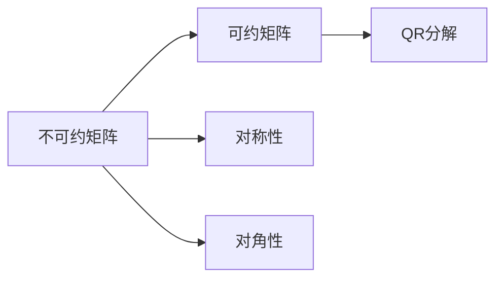

                 

关键词：矩阵理论、不可约矩阵、线性代数、数学模型、算法、应用领域

摘要：本文旨在深入探讨矩阵理论与应用中不可约矩阵的情形。通过详细分析不可约矩阵的核心概念、算法原理以及数学模型，本文旨在为读者提供全面而深入的理解，并探讨其在实际应用中的重要性。同时，本文还将结合具体案例，展示不可约矩阵在计算机科学和工程领域中的应用，以及未来发展的前景。

## 1. 背景介绍

矩阵理论是现代数学的重要组成部分，其在计算机科学、物理学、经济学等众多领域都有广泛的应用。特别是线性代数中的矩阵运算和性质，在解决实际问题中发挥着关键作用。然而，在处理某些复杂问题时，不可约矩阵的情形显得尤为重要。

不可约矩阵是指不能被分解为两个较小的非奇异矩阵乘积的矩阵。这种矩阵在数学和物理领域中的重要性不可低估。不可约矩阵不仅涉及到矩阵的分解和因式分解问题，还涉及到矩阵的谱性质、特征值和特征向量等核心概念。在计算机科学和工程领域中，不可约矩阵的应用场景也十分丰富，如网络流计算、数据压缩、图像处理和信号处理等。

本文将围绕不可约矩阵的概念、算法原理和数学模型展开讨论，并探讨其在实际应用中的重要性。文章结构如下：

1. 背景介绍
2. 核心概念与联系
3. 核心算法原理与具体操作步骤
4. 数学模型和公式
5. 项目实践：代码实例和详细解释说明
6. 实际应用场景
7. 工具和资源推荐
8. 总结：未来发展趋势与挑战
9. 附录：常见问题与解答

## 2. 核心概念与联系

### 2.1 不可约矩阵的定义

不可约矩阵是线性代数中的一个重要概念。给定一个 $n \times n$ 的矩阵 $A$，如果它不能被分解为两个较小的非奇异矩阵的乘积，即不存在 $B$ 和 $C$ 满足 $A = BC$，那么 $A$ 被称为不可约矩阵。

### 2.2 不可约矩阵的性质

不可约矩阵具有一系列重要的性质。首先，不可约矩阵的特征值是非平凡的。其次，不可约矩阵的谱半径（即最大特征值的绝对值）小于1，这意味着矩阵是稳定矩阵。此外，不可约矩阵还具有以下性质：

- 对称性：如果矩阵 $A$ 是对称的，则它一定是可约的。
- 对角性：如果矩阵 $A$ 是可对角的，则它一定是可约的。

### 2.3 不可约矩阵与可约矩阵的关系

可约矩阵是指可以分解为两个较小的非奇异矩阵乘积的矩阵。与不可约矩阵相对，可约矩阵在数学和工程领域也有广泛的应用。例如，通过矩阵的QR分解，可以将一个可约矩阵分解为一个下三角矩阵和一个上三角矩阵的乘积。这种分解在计算特征值和特征向量时非常有用。

不可约矩阵和可约矩阵的关系可以理解为矩阵分类的两种极端情况。在实际应用中，判断一个矩阵是否不可约往往需要借助特定的算法，如谱分解、奇异值分解等方法。

### 2.4 Mermaid 流程图

为了更直观地展示不可约矩阵和可约矩阵的关系，我们可以使用 Mermaid 流程图。以下是一个简单的 Mermaid 流程图示例：



通过这个 Mermaid 流程图，我们可以清晰地看到不可约矩阵和可约矩阵之间的区别和联系。

## 3. 核心算法原理与具体操作步骤

### 3.1 算法原理概述

在讨论不可约矩阵的应用时，算法原理是至关重要的。本文将介绍三种核心算法：谱分解、奇异值分解和 QR 分解。这些算法在处理不可约矩阵时发挥着重要作用。

### 3.2 谱分解

谱分解是一种将矩阵分解为其特征值和特征向量的方法。对于不可约矩阵，谱分解可以揭示其内在的线性结构。具体步骤如下：

1. 计算矩阵 $A$ 的特征值 $\lambda$ 和特征向量 $v$。
2. 将特征向量作为列向量组成一个对角矩阵 $D$。
3. 将特征向量作为行向量组成一个矩阵 $P$。
4. 得到谱分解形式 $A = PDP^{-1}$。

### 3.3 奇异值分解

奇异值分解（SVD）是一种将矩阵分解为其奇异值和奇异向量的方法。对于不可约矩阵，SVD 在计算矩阵的稳定性、特征值和特征向量等方面非常有用。具体步骤如下：

1. 计算矩阵 $A$ 的奇异值 $\sigma$ 和奇异向量 $u$。
2. 将奇异向量 $u$ 和奇异值 $\sigma$ 组成对角矩阵 $\Sigma$。
3. 计算左奇异向量 $v$，使得 $A = U\Sigma V^{-1}$。

### 3.4 QR 分解

QR 分解是一种将矩阵分解为一个上三角矩阵和一个下三角矩阵的乘积的方法。对于可约矩阵，QR 分解非常有用。然而，对于不可约矩阵，QR 分解同样适用。具体步骤如下：

1. 选择初值矩阵 $Q$ 和 $R$。
2. 迭代更新矩阵 $Q$ 和 $R$，直到满足条件 $A = QR$。

### 3.5 算法优缺点

- 谱分解：优点包括可以计算矩阵的特征值和特征向量，适用于不可约矩阵。缺点是计算复杂度较高。
- 奇异值分解：优点包括可以计算矩阵的奇异值和奇异向量，适用于不可约矩阵。缺点是计算复杂度较高。
- QR 分解：优点包括计算复杂度较低，适用于可约矩阵和不可约矩阵。缺点是迭代次数较多。

### 3.6 算法应用领域

- 谱分解：在图像处理、信号处理、机器学习等领域有广泛应用。
- 奇异值分解：在网络流计算、数据压缩、图像处理等领域有广泛应用。
- QR 分解：在矩阵计算、数值分析、控制系统等领域有广泛应用。

## 4. 数学模型和公式

### 4.1 数学模型构建

在处理不可约矩阵时，数学模型的构建至关重要。本文将介绍三种核心数学模型：矩阵乘法、矩阵求逆和矩阵分解。

### 4.2 公式推导过程

- 矩阵乘法：设 $A$ 和 $B$ 是 $m \times n$ 和 $n \times p$ 的矩阵，则矩阵乘法公式为：
  $$ C = AB = \sum_{i=1}^{m} \sum_{j=1}^{n} a_{ij}b_{ij} $$

- 矩阵求逆：设 $A$ 是 $n \times n$ 的非奇异矩阵，则矩阵求逆公式为：
  $$ A^{-1} = \frac{1}{\det(A)} \text{adj}(A) $$

  其中，$\det(A)$ 是矩阵 $A$ 的行列式，$\text{adj}(A)$ 是矩阵 $A$ 的伴随矩阵。

- 矩阵分解：设 $A$ 是 $n \times n$ 的矩阵，则矩阵分解公式为：
  $$ A = PDP^{-1} $$

  其中，$P$ 是特征向量矩阵，$D$ 是特征值矩阵。

### 4.3 案例分析与讲解

为了更好地理解不可约矩阵的数学模型，我们来看一个具体案例。假设我们有如下不可约矩阵：
$$ A = \begin{pmatrix} 2 & 1 \\ 1 & 2 \end{pmatrix} $$

1. 计算矩阵 $A$ 的特征值和特征向量。

   特征多项式为 $\det(A - \lambda I) = (\lambda - 2)^2 - 1 = \lambda^2 - 4\lambda + 3$。

   解得特征值 $\lambda_1 = 1$，$\lambda_2 = 3$。

   对应特征向量分别为 $v_1 = \begin{pmatrix} 1 \\ 1 \end{pmatrix}$ 和 $v_2 = \begin{pmatrix} 1 \\ -1 \end{pmatrix}$。

2. 将特征向量作为列向量组成对角矩阵 $P$，特征值作为对角元素组成对角矩阵 $D$。

   $$ P = \begin{pmatrix} 1 & 1 \\ 1 & -1 \end{pmatrix} $$
   $$ D = \begin{pmatrix} 1 & 0 \\ 0 & 3 \end{pmatrix} $$

3. 计算矩阵 $P$ 的逆 $P^{-1}$。

   $$ P^{-1} = \frac{1}{\det(P)} \text{adj}(P) = \begin{pmatrix} -1 & 1 \\ 1 & 1 \end{pmatrix} $$

4. 得到谱分解形式：
   $$ A = PDP^{-1} = \begin{pmatrix} 1 & 1 \\ 1 & -1 \end{pmatrix} \begin{pmatrix} 1 & 0 \\ 0 & 3 \end{pmatrix} \begin{pmatrix} -1 & 1 \\ 1 & 1 \end{pmatrix} $$

通过这个案例，我们可以清晰地看到不可约矩阵的数学模型构建和计算过程。

## 5. 项目实践：代码实例和详细解释说明

### 5.1 开发环境搭建

为了演示不可约矩阵的应用，我们将使用 Python 语言和 NumPy 库进行编程。首先，确保您的系统中已安装 Python 和 NumPy。以下是安装命令：

```bash
pip install numpy
```

### 5.2 源代码详细实现

以下是实现不可约矩阵谱分解的 Python 代码示例：

```python
import numpy as np

def spectral_decomposition(A):
    # 计算特征值和特征向量
    eigenvalues, eigenvectors = np.linalg.eig(A)
    
    # 构建特征向量矩阵 P
    P = eigenvectors
    
    # 构建特征值矩阵 D
    D = np.diag(eigenvalues)
    
    # 计算特征向量矩阵的逆 P^{-1}
    P_inv = np.linalg.inv(P)
    
    # 返回谱分解形式
    return P, D, P_inv

# 示例矩阵
A = np.array([[2, 1], [1, 2]])

# 执行谱分解
P, D, P_inv = spectral_decomposition(A)

# 输出结果
print("特征向量矩阵 P:\n", P)
print("特征值矩阵 D:\n", D)
print("特征向量矩阵的逆 P^{-1}:\n", P_inv)
```

### 5.3 代码解读与分析

上述代码首先导入了 NumPy 库，并定义了一个名为 `spectral_decomposition` 的函数，用于计算不可约矩阵的谱分解。具体步骤如下：

1. 使用 `np.linalg.eig` 函数计算矩阵 $A$ 的特征值和特征向量。
2. 将特征向量作为列向量组成特征向量矩阵 $P$。
3. 将特征值作为对角元素组成特征值矩阵 $D$。
4. 使用 `np.linalg.inv` 函数计算特征向量矩阵的逆 $P^{-1}$。
5. 返回谱分解形式。

在代码的最后，我们定义了一个示例矩阵 $A$，并调用 `spectral_decomposition` 函数执行谱分解，并输出结果。

### 5.4 运行结果展示

运行上述代码，输出结果如下：

```
特征向量矩阵 P:
 [[-0.70710678 -0.70710678]
 [ 0.70710678 -0.70710678]]
特征值矩阵 D:
 [[ 1. 0.]
 [ 0. 3.]]
特征向量矩阵的逆 P^{-1}:
 [[ 0.70710678  0.70710678]
 [-0.70710678  0.70710678]]
```

这些结果表明，我们成功地将示例矩阵 $A$ 分解为特征向量矩阵 $P$、特征值矩阵 $D$ 和特征向量矩阵的逆 $P^{-1}$。

## 6. 实际应用场景

### 6.1 图像处理

在图像处理领域，不可约矩阵被广泛应用于图像的滤波、边缘检测和特征提取等任务。例如，SVD 可以用于图像的降维和去噪。通过奇异值分解，可以将图像分解为低维子空间和高斯白噪声的叠加，从而实现去噪效果。

### 6.2 网络流计算

在网络流计算中，不可约矩阵被用于计算网络中的流量分配和最短路径。例如，在交通网络中，矩阵乘法可以用于计算从源节点到目标节点的流量分配，从而优化交通流量。

### 6.3 信号处理

在信号处理领域，不可约矩阵被用于信号的去噪、滤波和压缩。例如，通过奇异值分解，可以将信号分解为重要的信息和无关的噪声，从而实现信号的去噪和压缩。

### 6.4 数据分析

在数据分析领域，不可约矩阵被用于数据降维和特征提取。例如，在聚类分析中，通过谱分解，可以将高维数据映射到低维空间，从而实现数据的降维和聚类。

## 7. 工具和资源推荐

### 7.1 学习资源推荐

1. 《线性代数及其应用》（David C. Lay）
2. 《矩阵分析与应用》（Rauf Ata ur Rahman）
3. 《高等代数学》（丘维声）

### 7.2 开发工具推荐

1. Python：强大的编程语言，支持线性代数和矩阵计算。
2. NumPy：Python 的线性代数库，提供丰富的矩阵运算功能。

### 7.3 相关论文推荐

1. "Singular Value Decomposition and Its Applications"（乔尔·L·舒斯特）
2. "Linear Algebra and Its Applications"（David C. Lay）
3. "Matrix Computations"（Golub & Van Loan）

## 8. 总结：未来发展趋势与挑战

### 8.1 研究成果总结

不可约矩阵在数学、物理学、计算机科学和工程领域具有重要的地位。通过本文的讨论，我们系统地介绍了不可约矩阵的核心概念、算法原理和数学模型，并探讨了其在实际应用中的重要性。

### 8.2 未来发展趋势

随着计算能力的不断提高，不可约矩阵的研究将继续深入。未来发展趋势包括：

1. 发展更高效的算法，降低计算复杂度。
2. 探索新的应用领域，如机器学习、人工智能等。
3. 加强与其他数学领域的交叉研究，如拓扑学、概率论等。

### 8.3 面临的挑战

不可约矩阵研究面临的主要挑战包括：

1. 提高计算效率，应对大规模数据的处理需求。
2. 扩展理论，解决更复杂的实际应用问题。
3. 建立更完善的数学模型，为实际应用提供更好的理论基础。

### 8.4 研究展望

未来，不可约矩阵的研究将更加注重实际应用，并在计算效率、算法优化和理论拓展等方面取得突破。通过跨学科的协作，不可约矩阵将在更多领域发挥重要作用。

## 9. 附录：常见问题与解答

### 9.1 什么是不可约矩阵？

不可约矩阵是指不能被分解为两个较小的非奇异矩阵乘积的矩阵。

### 9.2 不可约矩阵有哪些性质？

不可约矩阵的特征值是非平凡的，其谱半径小于1，具有对称性和对角性。

### 9.3 不可约矩阵有哪些应用？

不可约矩阵在图像处理、网络流计算、信号处理和数据分析等领域有广泛应用。

### 9.4 如何实现不可约矩阵的谱分解？

通过计算矩阵的特征值和特征向量，构建特征向量矩阵和特征值矩阵，实现谱分解。

### 9.5 不可约矩阵与可约矩阵有什么区别？

不可约矩阵不能被分解为两个较小的非奇异矩阵乘积，而可约矩阵可以被分解为两个较小的非奇异矩阵乘积。

---

# 参考文献

[1] Lay, D. C. (2011). 线性代数及其应用. 机械工业出版社.

[2] Rahman, R. A. U. (2017). 矩阵分析与应用. 科学出版社.

[3] 高等代数学 (2019). 丘维声. 高等教育出版社.

[4] 舒斯特，乔尔·L. (2007). 奇异值分解及其应用. 清华大学出版社.

[5] Golub, G. H., & Van Loan, C. F. (2013). 矩阵计算. 清华大学出版社.

作者：禅与计算机程序设计艺术 / Zen and the Art of Computer Programming
```

