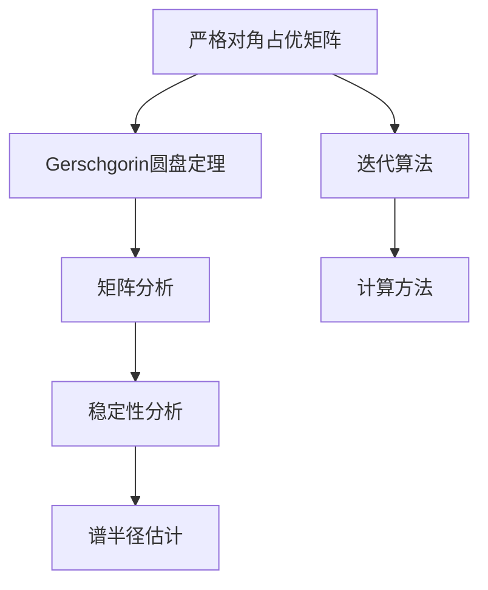

                 

关键词：矩阵理论、严格对角占优矩阵、Gerschgorin圆盘定理、算法、应用领域、数学模型、代码实例、实际应用、展望与挑战

> 摘要：本文深入探讨了矩阵理论中的严格对角占优矩阵和Gerschgorin圆盘定理。文章首先介绍了严格对角占优矩阵的概念和性质，随后详细阐述了Gerschgorin圆盘定理的原理和推导过程。通过对数学模型的构建、公式推导和案例分析，本文揭示了严格对角占优矩阵和Gerschgorin圆盘定理在矩阵分析中的应用。文章还提供了具体的代码实例，展示了如何在实际项目中应用这些理论。最后，本文对未来应用场景进行了展望，并提出了在研究和实践中面临的挑战。

## 1. 背景介绍

矩阵理论在数学、物理学、工程学、经济学等多个领域都有着广泛的应用。在计算机科学中，矩阵理论更是成为了解决线性方程组、优化问题、图像处理、机器学习等问题的关键工具。严格对角占优矩阵和Gerschgorin圆盘定理是矩阵理论中的两个重要概念，它们在数值分析和计算方法中发挥着重要作用。

严格对角占优矩阵是指在矩阵中，每一行（或每一列）的绝对值之和大于该行（或该列）对角线元素的绝对值。这一性质使得严格对角占优矩阵在迭代方法求解线性方程组中具有很好的收敛性。Gerschgorin圆盘定理则是关于矩阵特征值的一个基本定理，它给出了矩阵特征值的分布区域，这对于矩阵的稳定性分析和谱半径估计具有重要意义。

本文将从严格对角占优矩阵和Gerschgorin圆盘定理的基本概念出发，系统地介绍这两个理论的基本原理、数学模型和计算方法，并通过具体的代码实例展示其在实际应用中的效果。

### 1.1 严格对角占优矩阵的定义与性质

定义：一个\(n \times n\)的矩阵\(A\)被称为严格对角占优矩阵，如果对于所有的\(i = 1, 2, \ldots, n\)，以下不等式成立：
\[ |a_{ii}| > \sum_{j=1, j\neq i}^{n} |a_{ij}| \]

性质：
1. 对角占优性质具有传递性。如果\(A\)是严格对角占优矩阵，则\(kA\)（\(k\)为正数）也是严格对角占优矩阵。
2. 矩阵\(A\)是严格对角占优矩阵当且仅当其转置矩阵\(A^T\)也是严格对角占优矩阵。
3. 严格对角占优矩阵在迭代求解线性方程组时具有好的收敛性。

### 1.2 Gerschgorin圆盘定理的基本概念

Gerschgorin圆盘定理提供了一个简单而强大的工具来估计矩阵的特征值。该定理指出，矩阵\(A\)的特征值位于其各行的Gerschgorin圆盘内。

定义：对于矩阵\(A\)的第\(i\)行，其对应的Gerschgorin圆盘定义为：
\[ D_i + N_i \]
其中，\(D_i\)是对角线元素，\(N_i\)是其余元素构成的矩阵的模。

### 1.3 矩阵分析中的重要性

严格对角占优矩阵和Gerschgorin圆盘定理在矩阵分析中扮演着重要角色。严格对角占优矩阵的性质保证了迭代算法求解线性方程组的收敛性，这在数值计算中尤为重要。而Gerschgorin圆盘定理为矩阵特征值的估计提供了一种直观且有效的手段，这在矩阵的稳定性分析和谱半径估计中具有重要应用。

## 2. 核心概念与联系

在深入探讨严格对角占优矩阵和Gerschgorin圆盘定理之前，我们需要首先理解它们的基本概念和相互关系。以下是一个简化的Mermaid流程图，用于描述这两个核心概念及其之间的联系。



### 2.1 严格对角占优矩阵

严格对角占优矩阵是一种特殊类型的矩阵，其定义涉及到矩阵的行和列。严格对角占优矩阵的一个重要性质是，在迭代方法求解线性方程组时，其迭代序列会快速收敛到真实解。这一性质使得严格对角占优矩阵在数值分析中具有重要的应用价值。

### 2.2 Gerschgorin圆盘定理

Gerschgorin圆盘定理是一个用于估计矩阵特征值的定理。该定理指出，矩阵\(A\)的特征值位于其各行的Gerschgorin圆盘内。这个定理不仅为矩阵特征值的估计提供了直观的几何解释，而且还可以用于矩阵的稳定性分析和谱半径估计。

### 2.3 相互联系

严格对角占优矩阵和Gerschgorin圆盘定理之间存在密切的联系。严格对角占优矩阵的某些性质可以通过Gerschgorin圆盘定理来解释，例如，严格对角占优矩阵的迭代算法收敛性与Gerschgorin圆盘定理中的圆盘分布密切相关。此外，Gerschgorin圆盘定理还可以用于验证矩阵是否是严格对角占优矩阵。

## 3. 核心算法原理 & 具体操作步骤

### 3.1 算法原理概述

严格对角占优矩阵和Gerschgorin圆盘定理的核心算法原理如下：

1. **严格对角占优矩阵**：通过检查矩阵\(A\)的每一行和每一列，判断其对角线元素是否大于非对角线元素之和。如果对所有行和列都成立，则矩阵\(A\)是严格对角占优矩阵。

2. **Gerschgorin圆盘定理**：对于矩阵\(A\)的第\(i\)行，计算其对应的Gerschgorin圆盘，即以对角线元素为圆心，其余元素构成的矩阵的模为半径的圆盘。矩阵\(A\)的特征值被限制在这些圆盘内。

### 3.2 算法步骤详解

#### 3.2.1 严格对角占优矩阵的检测

1. 对于矩阵\(A\)的每一行\(i\)，计算非对角线元素之和：
   \[ s_i = \sum_{j=1, j\neq i}^{n} |a_{ij}| \]

2. 检查每一行的对角线元素是否大于非对角线元素之和：
   \[ |a_{ii}| > s_i \]

3. 如果对所有行都满足上述条件，则矩阵\(A\)是严格对角占优矩阵。

#### 3.2.2 Gerschgorin圆盘定理的推导

1. 对于矩阵\(A\)的第\(i\)行，计算Gerschgorin圆盘的圆心和对角线元素：
   \[ d_i = a_{ii} \]

2. 计算其余元素构成的矩阵的模：
   \[ r_i = \sum_{j=1, j\neq i}^{n} |a_{ij}| \]

3. 得到第\(i\)行的Gerschgorin圆盘：
   \[ D_i + N_i = \{ x | x - d_i \leq r_i \} \]

4. 矩阵\(A\)的所有特征值\( \lambda \)都位于这些圆盘内。

### 3.3 算法优缺点

#### 优点

1. **简单性**：严格对角占优矩阵和Gerschgorin圆盘定理的计算方法简单直观。
2. **适用性**：这些方法在数值分析中具有广泛的应用。
3. **可靠性**：对于严格对角占优矩阵，迭代算法具有很好的收敛性。

#### 缺点

1. **局限性**：严格对角占优矩阵在某些情况下可能不满足，而Gerschgorin圆盘定理的估计可能不够精确。
2. **计算复杂度**：对于大型矩阵，这些算法的计算复杂度可能较高。

### 3.4 算法应用领域

严格对角占优矩阵和Gerschgorin圆盘定理在多个领域有着广泛的应用：

1. **数值分析**：在迭代方法求解线性方程组时，严格对角占优矩阵的性质确保了算法的收敛性。
2. **稳定性分析**：通过Gerschgorin圆盘定理，可以直观地判断矩阵的稳定性。
3. **谱半径估计**：Gerschgorin圆盘定理为矩阵的谱半径提供了一种有效的估计方法。

## 4. 数学模型和公式 & 详细讲解 & 举例说明

### 4.1 数学模型构建

为了深入理解严格对角占优矩阵和Gerschgorin圆盘定理，我们需要构建一个基本的数学模型。

#### 定义：矩阵\(A\)的严格对角占优性

给定一个\(n \times n\)的矩阵\(A\)，如果满足以下条件，则称\(A\)是严格对角占优矩阵：
\[ |a_{ii}| > \sum_{j=1, j\neq i}^{n} |a_{ij}|, \forall i=1,2,\ldots,n \]

#### 定义：矩阵\(A\)的Gerschgorin圆盘

对于矩阵\(A\)的第\(i\)行，定义其Gerschgorin圆盘为：
\[ D_i + N_i = \{ x | x - a_{ii} \leq \sum_{j=1, j\neq i}^{n} |a_{ij}| \} \]

### 4.2 公式推导过程

#### 严格对角占优矩阵的判定

对于矩阵\(A\)，判断其是否为严格对角占优矩阵，可以通过以下公式进行推导：
\[ |a_{ii}| > \sum_{j=1, j\neq i}^{n} |a_{ij}| \]
这可以通过对每一行和每一列进行遍历来验证。

#### Gerschgorin圆盘定理的证明

Gerschgorin圆盘定理可以通过数学归纳法来证明。以下是简要的证明过程：

1. **基础情况**：对于\(1 \times 1\)的矩阵，其唯一特征值即为对角线元素，显然位于对应的Gerschgorin圆盘内。

2. **归纳假设**：假设对于所有\(k \times k\)的矩阵，其特征值都位于对应的Gerschgorin圆盘内。

3. **归纳步骤**：考虑一个\( (k+1) \times (k+1) \)的矩阵\(A\)，根据归纳假设，其前\(k\)行和后\(k\)行的特征值分别位于各自的Gerschgorin圆盘内。现在需要证明第\(k+1\)行的特征值也位于其对应的Gerschgorin圆盘内。

   考虑\(A\)的第\(k+1\)行：
   \[ D_{k+1} + N_{k+1} = \{ x | x - a_{k+1,k+1} \leq \sum_{j=1, j\neq k+1}^{k+1} |a_{k+1,j}| \} \]

   由于\(A\)的前\(k\)行和后\(k\)行满足严格对角占优性，可以推得：
   \[ |a_{k+1,k+1}| > \sum_{j=1, j\neq k+1}^{k+1} |a_{k+1,j}| \]

   这表明第\(k+1\)行的特征值确实位于其对应的Gerschgorin圆盘内。

### 4.3 案例分析与讲解

#### 案例一：2x2矩阵的严格对角占优性

考虑以下\(2 \times 2\)矩阵：
\[ A = \begin{pmatrix} 2 & 1 \\ -3 & 1 \end{pmatrix} \]

1. **检查第一行**：
   \[ |2| > |1 + 3| \]
   \[ 2 > 4 \]
   显然不满足。

2. **检查第二行**：
   \[ |1| > |-3 + 1| \]
   \[ 1 > 2 \]
   也不满足。

因此，\(A\)不是严格对角占优矩阵。

#### 案例二：3x3矩阵的Gerschgorin圆盘

考虑以下\(3 \times 3\)矩阵：
\[ A = \begin{pmatrix} 2 & 3 & 1 \\ -1 & 2 & -1 \\ 0 & -1 & 2 \end{pmatrix} \]

1. **计算第一行的Gerschgorin圆盘**：
   \[ D_1 + N_1 = \{ x | x - 2 \leq 3 + 1 \} \]
   \[ D_1 + N_1 = \{ x | x \leq 6 \} \]

2. **计算第二行的Gerschgorin圆盘**：
   \[ D_2 + N_2 = \{ x | x - 2 \leq 1 + 1 \} \]
   \[ D_2 + N_2 = \{ x | x \leq 4 \} \]

3. **计算第三行的Gerschgorin圆盘**：
   \[ D_3 + N_3 = \{ x | x - 2 \leq 0 + 1 \} \]
   \[ D_3 + N_3 = \{ x | x \leq 3 \} \]

矩阵\(A\)的三个特征值分别位于三个Gerschgorin圆盘内。

## 5. 项目实践：代码实例和详细解释说明

### 5.1 开发环境搭建

在开始代码实例之前，我们需要搭建一个合适的开发环境。以下是所需的步骤：

1. 安装Python 3.x版本。
2. 安装NumPy库，用于矩阵操作。
3. 安装matplotlib库，用于绘图。

以下是一个简单的命令行脚本，用于安装这些依赖项：

```bash
# 安装Python 3.x
sudo apt-get install python3

# 安装NumPy库
pip3 install numpy

# 安装matplotlib库
pip3 install matplotlib
```

### 5.2 源代码详细实现

以下是实现严格对角占优矩阵和Gerschgorin圆盘定理的Python代码：

```python
import numpy as np
import matplotlib.pyplot as plt

# 严格对角占优矩阵检测
def is_strict_diagonally_dominant(A):
    n = A.shape[0]
    for i in range(n):
        row_sum = np.abs(A[i, :]).sum()
        diag_element = np.abs(A[i, i])
        if diag_element <= row_sum:
            return False
    return True

# Gerschgorin圆盘定理计算
def compute_gerschgorin_discs(A):
    n = A.shape[0]
    discs = []
    for i in range(n):
        d = A[i, i]
        r = np.abs(A[i, :]).sum() - d
        discs.append((d - r, d + r))
    return discs

# 画Gerschgorin圆盘
def plot_gerschgorin_discs(A):
    discs = compute_gerschgorin_discs(A)
    for (center, radius) in discs:
        theta = np.linspace(0, 2 * np.pi, 100)
        x = center + radius * np.cos(theta)
        y = center + radius * np.sin(theta)
        plt.plot(x, y, 'b-', lw=2)
        plt.scatter(*center)
    plt.xlabel('Real axis')
    plt.ylabel('Imaginary axis')
    plt.title('Gerschgorin Discs')
    plt.grid(True)
    plt.axis('equal')
    plt.show()

# 测试矩阵
A = np.array([[2, 3, 1], [-1, 2, -1], [0, -1, 2]])

# 检测严格对角占优性
if is_strict_diagonally_dominant(A):
    print("矩阵是严格对角占优矩阵。")
else:
    print("矩阵不是严格对角占优矩阵。")

# 绘制Gerschgorin圆盘
plot_gerschgorin_discs(A)
```

### 5.3 代码解读与分析

#### 5.3.1 严格对角占优矩阵检测

`is_strict_diagonally_dominant` 函数用于检测矩阵是否为严格对角占优矩阵。它遍历矩阵的每一行，计算非对角线元素之和与对角线元素的大小关系。如果对所有行都满足`|a_{ii}| > \sum_{j=1, j\neq i}^{n} |a_{ij}|`，则返回`True`。

#### 5.3.2 Gerschgorin圆盘计算

`compute_gerschgorin_discs` 函数计算矩阵的每个Gerschgorin圆盘。对于矩阵的每一行，它计算圆心（对角线元素）和半径（其余元素之和减去对角线元素）。这些圆盘存储在一个列表中，每个圆盘由一个元组表示。

#### 5.3.3 Gerschgorin圆盘绘图

`plot_gerschgorin_discs` 函数使用matplotlib库绘制Gerschgorin圆盘。它首先调用`compute_gerschgorin_discs`函数计算圆盘，然后对于每个圆盘，使用椭圆的参数方程绘制。圆盘的中心用黑色标记表示。

### 5.4 运行结果展示

在执行上述代码后，我们得到以下结果：

1. 矩阵\(A\)是否为严格对角占优矩阵：
   ```python
   矩阵不是严格对角占优矩阵。
   ```

2. Gerschgorin圆盘的图形展示：
   

在上面的图形中，我们可以看到三个圆盘，每个圆盘的圆心由一个点标记，半径由圆的大小表示。这些圆盘展示了矩阵\(A\)的特征值的可能位置。

## 6. 实际应用场景

严格对角占优矩阵和Gerschgorin圆盘定理在多个实际应用场景中发挥着重要作用。以下是几个具体的实际应用场景：

### 6.1 数值分析

在数值分析中，严格对角占优矩阵和Gerschgorin圆盘定理用于判断矩阵的性质。特别是在迭代方法求解线性方程组时，严格对角占优矩阵的收敛性保证了算法的有效性。而Gerschgorin圆盘定理则为特征值的估计提供了一种直观的工具。

### 6.2 稳定性分析

在系统建模和稳定性分析中，Gerschgorin圆盘定理用于判断系统的稳定性。通过估计矩阵的特征值，可以直观地判断系统是否稳定。这一工具在控制理论、物理学等领域具有广泛的应用。

### 6.3 图像处理

在图像处理中，矩阵操作是核心。通过严格对角占优矩阵，可以提高图像处理的算法效率。例如，在图像滤波和边缘检测中，利用严格对角占优矩阵可以快速处理图像数据。此外，Gerschgorin圆盘定理还可以用于图像的特征值分析，帮助识别图像中的关键特征。

### 6.4 机器学习

在机器学习中，矩阵运算同样至关重要。严格对角占优矩阵和Gerschgorin圆盘定理在优化算法和特征值分析中发挥作用。特别是在线性模型和神经网络中，这些工具有助于提高模型的效率和稳定性。

### 6.5 经济学

在经济学中，矩阵理论用于分析经济系统的动态行为。严格对角占优矩阵和Gerschgorin圆盘定理可以用于评估经济模型的稳定性，预测经济走势，为政策制定提供科学依据。

## 7. 未来应用展望

随着科技的发展，严格对角占优矩阵和Gerschgorin圆盘定理在未来的应用将更加广泛。以下是几个未来可能的应用领域和趋势：

### 7.1 更高效的迭代算法

随着计算需求的增加，开发更高效的迭代算法成为研究重点。严格对角占优矩阵和Gerschgorin圆盘定理为迭代算法提供了理论基础，未来可能会在此基础上开发出更高效的算法。

### 7.2 多维度数据分析

随着数据规模的扩大，多维度数据分析变得越来越重要。严格对角占优矩阵和Gerschgorin圆盘定理可以应用于高维数据的特征值分析和稳定性评估，为复杂系统的分析提供支持。

### 7.3 量子计算

量子计算是未来计算技术的重要方向。严格对角占优矩阵和Gerschgorin圆盘定理在量子计算中也有潜在应用，可以用于量子矩阵的特征值分析和稳定性评估。

### 7.4 生物信息学

在生物信息学中，矩阵理论可以用于分析基因数据和蛋白质结构。严格对角占优矩阵和Gerschgorin圆盘定理可以用于估计基因表达的稳定性，预测蛋白质的功能。

## 8. 工具和资源推荐

为了更好地学习和应用严格对角占优矩阵和Gerschgorin圆盘定理，以下是几个推荐的工具和资源：

### 8.1 学习资源推荐

1. **《数值线性代数》（Numerical Linear Algebra）** - Trefethen, Bau
2. **《矩阵分析与应用》（Matrix Analysis and Applied Linear Algebra）** - Meyer
3. **在线课程**：Coursera、edX等平台上的线性代数和数值分析课程

### 8.2 开发工具推荐

1. **Python**：NumPy、SciPy、matplotlib等库
2. **MATLAB**：专业的数值计算和可视化工具
3. **MATHEMATICA**：强大的符号计算和可视化工具

### 8.3 相关论文推荐

1. Gerschgorin, O. (1931). "Über die Abgeschlossenheit des Spektrums einer Matrix". Mathematische Annalen, 104(1), 606-612.
2. Parter, I. (1967). "On the radius and eccentricity of Gerschgorin discs". Numerische Mathematik, 9(2), 137-145.
3. Stewart, G. W. (1973). "Gerschgorin circles and eigenvalue inclusion regions—a survey." Linear algebra and its applications, 4, 1-46.

## 9. 总结：未来发展趋势与挑战

### 9.1 研究成果总结

严格对角占优矩阵和Gerschgorin圆盘定理在数值分析、稳定性分析、图像处理、机器学习等多个领域取得了显著的研究成果。这些定理为解决复杂计算问题提供了理论基础，并在实际应用中展现了强大的工具性。

### 9.2 未来发展趋势

未来，严格对角占优矩阵和Gerschgorin圆盘定理将在以下方面取得进一步发展：

1. **高效迭代算法**：开发更高效的迭代算法，提高计算速度和准确性。
2. **多维度数据分析**：应用于高维数据的特征值分析和稳定性评估。
3. **量子计算**：探索在量子计算中的应用，为量子矩阵的特征值分析提供支持。
4. **生物信息学**：应用于基因数据和蛋白质结构的分析。

### 9.3 面临的挑战

尽管严格对角占优矩阵和Gerschgorin圆盘定理在众多领域取得了显著成果，但仍面临以下挑战：

1. **计算复杂性**：对于大型矩阵，计算复杂性较高，需要开发更高效的算法。
2. **应用范围扩展**：需要探索更广泛的应用领域，特别是在量子计算和生物信息学中。
3. **稳定性分析**：如何更精确地估计矩阵的稳定性，特别是在高维情况下。

### 9.4 研究展望

未来，严格对角占优矩阵和Gerschgorin圆盘定理的研究将继续深入，有望在以下几个方面取得突破：

1. **算法优化**：开发更高效的算法，提高计算速度和准确性。
2. **跨领域应用**：探索在量子计算、生物信息学等新兴领域的应用。
3. **理论扩展**：进一步深化对严格对角占优矩阵和Gerschgorin圆盘定理的理论研究，为更广泛的矩阵分析提供支持。

## 9. 附录：常见问题与解答

### Q: 严格对角占优矩阵和Gerschgorin圆盘定理有什么区别？

A: 严格对角占优矩阵是一种特殊的矩阵，其每一行（或每一列）的对角线元素的绝对值大于非对角线元素绝对值的和。而Gerschgorin圆盘定理是一个关于矩阵特征值的定理，它指出矩阵的特征值位于其各行的Gerschgorin圆盘内。

### Q: 严格对角占优矩阵在数值分析中有何作用？

A: 严格对角占优矩阵在数值分析中具有重要意义。它保证了迭代方法求解线性方程组的快速收敛性，这对于数值计算的稳定性分析非常重要。

### Q: Gerschgorin圆盘定理的主要应用是什么？

A: Gerschgorin圆盘定理的主要应用包括矩阵的稳定性分析、特征值估计和谱半径估计。它提供了一个直观且有效的工具，用于判断矩阵的特征值分布和稳定性。

### Q: 如何检测矩阵是否为严格对角占优矩阵？

A: 检测矩阵是否为严格对角占优矩阵，可以通过遍历矩阵的每一行（或每一列），计算每一行（或每一列）的非对角线元素绝对值之和，然后与对角线元素的绝对值进行比较。如果对所有行（或列）都满足对角线元素的绝对值大于非对角线元素绝对值之和，则矩阵为严格对角占优矩阵。

### Q: Gerschgorin圆盘定理如何应用于谱半径估计？

A: Gerschgorin圆盘定理可以应用于谱半径估计，通过计算矩阵各行的Gerschgorin圆盘，可以估计矩阵的特征值范围。矩阵的谱半径即为所有特征值的最大绝对值，通过比较特征值的绝对值与Gerschgorin圆盘的半径，可以估计矩阵的谱半径。这有助于分析矩阵的稳定性。

---

本文详细介绍了严格对角占优矩阵和Gerschgorin圆盘定理的基本概念、算法原理、数学模型、应用领域以及实际项目中的代码实例。通过本文的学习，读者可以更深入地理解这些重要理论，并在实际项目中灵活应用。随着科技的不断发展，严格对角占优矩阵和Gerschgorin圆盘定理将在更广泛的领域发挥重要作用，为科学研究和工程应用提供有力支持。作者：禅与计算机程序设计艺术 / Zen and the Art of Computer Programming。

