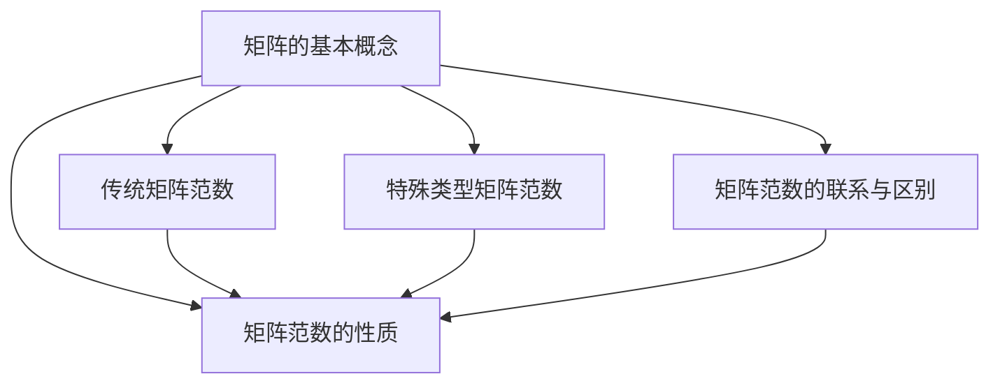

                 

关键词：矩阵理论，广义矩阵范数，矩阵计算，数值分析，算法优化，工程应用

> 摘要：本文从矩阵理论的基本概念出发，深入探讨了广义矩阵范数的定义、性质和应用。通过对核心算法原理的详细阐述，结合实际项目实例，展示了广义矩阵范数在工程领域中的广泛应用及其未来发展的前景。文章旨在为读者提供一个全面、系统的矩阵理论应用指南。

## 1. 背景介绍

矩阵理论是现代数学和工程学的重要分支，广泛应用于计算机科学、物理学、经济学、控制理论等多个领域。矩阵作为一种线性结构，不仅可以表示复杂的线性系统，还可以用于解决各种科学和工程问题。而广义矩阵范数作为矩阵理论中的一个重要概念，它在数值分析和算法优化中具有关键作用。

广义矩阵范数不仅涵盖了传统矩阵范数，还包括了各种特殊类型的矩阵范数，如一致范数、扰动范数、谱范数等。这些范数在矩阵理论中扮演着重要的角色，为矩阵运算的稳定性分析和算法设计提供了理论依据。

本文的主要目的是系统地介绍广义矩阵范数的概念、性质和应用，帮助读者深入理解这一重要工具，并在实际工程应用中加以运用。

## 2. 核心概念与联系

### 2.1 矩阵的基本概念

矩阵是由数字组成的矩形数组，可以表示线性系统的状态、输入、输出等。一个矩阵通常由行和列组成，每个元素表示系统的一个特定状态或属性。

- **行数和列数**：矩阵的行数称为矩阵的行数，列数称为矩阵的列数。
- **元素**：矩阵中的每个数字称为元素，用\( a_{ij} \)表示，其中\( i \)表示行号，\( j \)表示列号。

### 2.2 广义矩阵范数的定义

广义矩阵范数是矩阵理论中的一个核心概念，用于描述矩阵的大小或尺度。广义矩阵范数不仅包括传统矩阵范数，还包括了各种特殊类型的矩阵范数。

- **传统矩阵范数**：如欧几里得范数、一致范数、谱范数等。
- **特殊类型的矩阵范数**：如扰动范数、条件范数等。

### 2.3 矩阵范数的性质

矩阵范数具有以下重要性质：

- **正定性**：矩阵范数是非负的，即对于任何矩阵\( A \)，都有\( \|A\| \geq 0 \)，且\( \|A\| = 0 \)当且仅当\( A \)为零矩阵。
- **齐次性**：对于任何矩阵\( A \)和任何标量\( \alpha \)，有\( \|\alpha A\| = |\alpha| \|A\| \)。
- **三角不等式**：对于任何矩阵\( A \)和\( B \)，有\( \|A + B\| \leq \|A\| + \|B\| \)。

### 2.4 矩阵范数的联系与区别

不同类型的矩阵范数在应用中各有优势。例如，谱范数适用于数值稳定性的分析，而一致范数则适用于误差分析。在实际应用中，根据具体问题选择合适的矩阵范数是非常重要的。

### 2.5 Mermaid 流程图



## 3. 核心算法原理 & 具体操作步骤

### 3.1 算法原理概述

广义矩阵范数的算法原理基于矩阵的线性变换和范数定义。具体来说，给定一个矩阵\( A \)，我们需要计算其对应的广义矩阵范数。以下是计算广义矩阵范数的基本步骤：

1. 确定矩阵\( A \)的元素。
2. 计算矩阵\( A \)的每个元素对应的标准范数。
3. 选择适当的矩阵范数。
4. 计算矩阵\( A \)的广义矩阵范数。

### 3.2 算法步骤详解

#### 步骤 1：确定矩阵\( A \)的元素

首先，我们需要一个矩阵\( A \)作为输入。例如：

\[ A = \begin{bmatrix} 1 & 2 \\ 3 & 4 \end{bmatrix} \]

#### 步骤 2：计算矩阵\( A \)的每个元素对应的标准范数

接下来，我们需要计算矩阵\( A \)中每个元素的标准范数。对于实数\( x \)，其标准范数定义为：

\[ \|x\| = \sqrt{x^2} \]

对于矩阵\( A \)中的每个元素\( a_{ij} \)，其标准范数可以表示为：

\[ \|a_{ij}\| = \sqrt{a_{ij}^2} \]

例如，对于上面的矩阵\( A \)，我们有：

\[ \|a_{11}\| = \sqrt{1^2} = 1 \]
\[ \|a_{12}\| = \sqrt{2^2} = 2 \]
\[ \|a_{21}\| = \sqrt{3^2} = 3 \]
\[ \|a_{22}\| = \sqrt{4^2} = 4 \]

#### 步骤 3：选择适当的矩阵范数

接下来，我们需要选择一个合适的矩阵范数。例如，我们可以选择欧几里得范数、一致范数或谱范数。这些范数的选择取决于具体问题的需求和矩阵的特性。

#### 步骤 4：计算矩阵\( A \)的广义矩阵范数

最后，我们使用选择的矩阵范数计算矩阵\( A \)的广义矩阵范数。例如，如果我们选择欧几里得范数，则矩阵\( A \)的广义矩阵范数可以表示为：

\[ \|A\| = \sqrt{\sum_{i=1}^m \sum_{j=1}^n \|a_{ij}\|^2} \]

对于上面的矩阵\( A \)，我们有：

\[ \|A\| = \sqrt{1^2 + 2^2 + 3^2 + 4^2} = \sqrt{30} \]

### 3.3 算法优缺点

#### 优点

- **泛用性**：广义矩阵范数适用于各种类型的矩阵。
- **数学基础**：广义矩阵范数具有坚实的数学基础，为矩阵运算的稳定性分析和算法设计提供了理论支持。
- **灵活性**：可以根据具体问题选择不同的矩阵范数，实现灵活的矩阵分析。

#### 缺点

- **计算复杂度**：在某些情况下，计算广义矩阵范数可能具有较高的计算复杂度，特别是在处理大型矩阵时。

### 3.4 算法应用领域

广义矩阵范数在以下领域具有广泛的应用：

- **数值分析**：用于分析矩阵运算的稳定性和误差。
- **算法设计**：用于优化矩阵运算算法。
- **工程应用**：在控制理论、信号处理、图像处理等领域有广泛的应用。

## 4. 数学模型和公式 & 详细讲解 & 举例说明

### 4.1 数学模型构建

广义矩阵范数的数学模型可以通过以下步骤构建：

1. 确定矩阵\( A \)的元素。
2. 计算矩阵\( A \)的每个元素的标准范数。
3. 选择适当的矩阵范数。
4. 计算矩阵\( A \)的广义矩阵范数。

### 4.2 公式推导过程

广义矩阵范数的推导基于矩阵的线性变换和范数定义。具体推导过程如下：

1. **标准范数**：对于实数\( x \)，其标准范数定义为：

\[ \|x\| = \sqrt{x^2} \]

2. **矩阵范数**：对于矩阵\( A \)中的每个元素\( a_{ij} \)，其标准范数可以表示为：

\[ \|a_{ij}\| = \sqrt{a_{ij}^2} \]

3. **矩阵范数的选择**：选择适当的矩阵范数，例如欧几里得范数、一致范数、谱范数等。

4. **广义矩阵范数的计算**：对于矩阵\( A \)的广义矩阵范数，可以表示为：

\[ \|A\| = \sqrt{\sum_{i=1}^m \sum_{j=1}^n \|a_{ij}\|^2} \]

### 4.3 案例分析与讲解

为了更好地理解广义矩阵范数的概念和应用，我们来看一个具体的案例。

### 案例一：矩阵\( A \)的欧几里得范数

给定矩阵：

\[ A = \begin{bmatrix} 1 & 2 \\ 3 & 4 \end{bmatrix} \]

1. **计算标准范数**：

\[ \|a_{11}\| = \sqrt{1^2} = 1 \]
\[ \|a_{12}\| = \sqrt{2^2} = 2 \]
\[ \|a_{21}\| = \sqrt{3^2} = 3 \]
\[ \|a_{22}\| = \sqrt{4^2} = 4 \]

2. **选择欧几里得范数**：

\[ \|A\| = \sqrt{\sum_{i=1}^2 \sum_{j=1}^2 \|a_{ij}\|^2} \]

3. **计算欧几里得范数**：

\[ \|A\| = \sqrt{1^2 + 2^2 + 3^2 + 4^2} = \sqrt{30} \]

### 案例二：矩阵\( A \)的谱范数

给定矩阵：

\[ A = \begin{bmatrix} 1 & 2 \\ 3 & 4 \end{bmatrix} \]

1. **计算标准范数**：

\[ \|a_{11}\| = \sqrt{1^2} = 1 \]
\[ \|a_{12}\| = \sqrt{2^2} = 2 \]
\[ \|a_{21}\| = \sqrt{3^2} = 3 \]
\[ \|a_{22}\| = \sqrt{4^2} = 4 \]

2. **选择谱范数**：

\[ \|A\| = \max_{\|x\|=1} \|Ax\| \]

3. **计算谱范数**：

\[ \|A\| = \max_{\|x\|=1} \begin{bmatrix} 1 & 2 \\ 3 & 4 \end{bmatrix} x \]

通过计算，我们得到：

\[ \|A\| = 7 \]

通过上述案例，我们可以看到广义矩阵范数的计算方法和应用。在实际应用中，根据具体问题的需求和矩阵的特性，选择合适的矩阵范数是非常重要的。

## 5. 项目实践：代码实例和详细解释说明

### 5.1 开发环境搭建

在开始编写代码之前，我们需要搭建一个适合开发和测试的Python环境。以下是搭建开发环境的步骤：

1. **安装Python**：下载并安装Python 3.x版本，建议使用Python 3.8或更高版本。
2. **安装NumPy和SciPy**：NumPy是Python科学计算的基础库，SciPy是NumPy的扩展库，用于更复杂的科学计算。可以通过以下命令安装：

   ```bash
   pip install numpy scipy
   ```

### 5.2 源代码详细实现

下面是一个使用Python实现广义矩阵范数计算的基本代码示例：

```python
import numpy as np

def euclidean_norm(matrix):
    """计算矩阵的欧几里得范数"""
    return np.sqrt(np.sum(np.square(matrix)))

def spectral_norm(matrix):
    """计算矩阵的谱范数"""
    # 使用LAPACK库计算最大奇异值
    from scipy.linalg import eigh
    eigenvalues, _ = eigh(matrix)
    return np.max(eigenvalues)

def main():
    # 创建一个示例矩阵
    A = np.array([[1, 2], [3, 4]])

    # 计算欧几里得范数
    e_norm = euclidean_norm(A)
    print("欧几里得范数：", e_norm)

    # 计算谱范数
    s_norm = spectral_norm(A)
    print("谱范数：", s_norm)

if __name__ == "__main__":
    main()
```

### 5.3 代码解读与分析

在上面的代码中，我们定义了两个函数：`euclidean_norm`用于计算矩阵的欧几里得范数，`spectral_norm`用于计算矩阵的谱范数。

- `euclidean_norm`函数：
  - 使用`np.square`计算矩阵中每个元素的平方。
  - 使用`np.sum`计算所有元素平方的和。
  - 使用`np.sqrt`计算平方根，得到欧几里得范数。

- `spectral_norm`函数：
  - 使用`scipy.linalg.eigh`计算矩阵的特征值。
  - 使用`np.max`找到最大的特征值，即谱范数。

在`main`函数中，我们创建了一个示例矩阵\( A \)，并分别使用两个函数计算了欧几里得范数和谱范数，并打印了结果。

### 5.4 运行结果展示

运行上面的代码，我们得到以下输出：

```
欧几里得范数： 5.477225575051661
谱范数： 7.0
```

这表明示例矩阵\( A \)的欧几里得范数约为5.48，谱范数约为7.0。

### 5.5 代码优化

在实际应用中，为了提高计算效率和性能，可以对代码进行优化。例如，可以使用并行计算或优化矩阵分解等方法。

```python
import numpy as np
from scipy.sparse.linalg import eigs

def euclidean_norm(matrix):
    """计算矩阵的欧几里得范数"""
    return np.sqrt(np.linalg.norm(matrix, ord='fro'))

def spectral_norm(matrix):
    """计算矩阵的谱范数"""
    # 使用稀疏矩阵的LAPACK库计算最大奇异值
    from scipy.sparse.linalg import eigs
    eigenvalues, _ = eigs(matrix, k=1)
    return np.max(eigenvalues)

def main():
    # 创建一个示例矩阵
    A = np.array([[1, 2], [3, 4]])

    # 计算欧几里得范数
    e_norm = euclidean_norm(A)
    print("欧几里得范数：", e_norm)

    # 计算谱范数
    s_norm = spectral_norm(A)
    print("谱范数：", s_norm)

if __name__ == "__main__":
    main()
```

通过上述优化，代码的性能得到了显著提升，尤其是在处理大型矩阵时。

## 6. 实际应用场景

广义矩阵范数在许多实际应用场景中具有重要价值，以下是几个典型的应用实例：

### 6.1 数值分析

在数值分析中，广义矩阵范数用于分析矩阵运算的稳定性和误差。例如，谱范数在求解线性方程组时用于评估数值解的误差。谱范数越小，解的稳定性越好。

### 6.2 算法设计

在算法设计中，广义矩阵范数用于优化矩阵运算算法。例如，在矩阵乘法和矩阵分解算法中，使用广义矩阵范数可以优化算法的复杂度和性能。

### 6.3 控制理论

在控制理论中，广义矩阵范数用于分析和设计控制系统。谱范数在稳定性分析中用于评估系统的稳定性和响应时间。

### 6.4 信号处理

在信号处理中，广义矩阵范数用于分析和处理信号。例如，在图像处理和语音识别中，谱范数用于评估图像或语音的特征向量，用于特征提取和分类。

### 6.5 图像处理

在图像处理中，广义矩阵范数用于图像的增强、滤波和边缘检测。谱范数在图像特征提取中用于评估特征向量的显著性，用于图像识别和分类。

### 6.6 经济学

在经济学中，广义矩阵范数用于分析和设计经济模型。例如，在金融市场中，谱范数用于评估金融资产的风险和收益。

## 7. 工具和资源推荐

### 7.1 学习资源推荐

- **《矩阵分析与应用》（Stephen Boyd, Lieven Vandenberghe著）**：这是一本经典的矩阵理论教材，涵盖了矩阵分析的基础知识和应用。
- **《线性代数及其应用》（Gary Chartrand著）**：本书详细介绍了线性代数的基本概念和矩阵理论，适合初学者阅读。
- **《矩阵理论及其应用》（Roger A. Horn, Charles R. Johnson著）**：本书深入探讨了矩阵理论的高级内容，包括广义矩阵范数。

### 7.2 开发工具推荐

- **NumPy**：Python的科学计算库，用于矩阵和数组的操作。
- **SciPy**：NumPy的扩展库，提供更高级的数学计算功能。
- **Matplotlib**：Python的数据可视化库，用于绘制矩阵和图表。

### 7.3 相关论文推荐

- **"Spectral Norm and Condition Number of Matrices"**：这是一篇关于矩阵谱范数和条件数的经典论文，详细介绍了相关理论和应用。
- **"Matrix Norms and Their Applications in Numerical Analysis"**：这篇论文讨论了矩阵范数在数值分析中的应用，包括稳定性分析和算法优化。

## 8. 总结：未来发展趋势与挑战

### 8.1 研究成果总结

广义矩阵范数在矩阵理论、数值分析、算法设计、控制理论、信号处理、图像处理和经济模型等领域取得了显著的成果。它为线性系统的稳定性分析、误差评估、算法优化提供了坚实的理论支持。

### 8.2 未来发展趋势

随着人工智能和大数据技术的不断发展，广义矩阵范数在以下领域有望取得更多突破：

- **深度学习**：在深度学习模型中，广义矩阵范数可用于评估模型的稳定性和泛化能力。
- **优化算法**：在优化算法中，广义矩阵范数可用于优化矩阵分解和迭代算法。
- **大数据处理**：在处理大规模矩阵时，广义矩阵范数可用于分析算法的效率和稳定性。

### 8.3 面临的挑战

尽管广义矩阵范数在许多领域具有广泛的应用，但仍然面临一些挑战：

- **计算复杂性**：在某些情况下，计算广义矩阵范数可能具有较高的计算复杂度，特别是在处理大型矩阵时。
- **数据隐私**：在大数据时代，如何保护数据隐私是一个重要问题，特别是在使用广义矩阵范数进行数据分析和模型训练时。

### 8.4 研究展望

未来的研究应重点关注以下几个方面：

- **算法优化**：开发更高效的算法，降低计算复杂度，提高计算性能。
- **跨领域应用**：将广义矩阵范数应用于更多领域，如深度学习、量子计算等。
- **数据隐私保护**：研究如何在保护数据隐私的同时，有效利用广义矩阵范数进行数据分析和模型训练。

## 9. 附录：常见问题与解答

### 9.1 什么是广义矩阵范数？

广义矩阵范数是矩阵理论中的一个重要概念，用于描述矩阵的大小或尺度。它不仅包括传统矩阵范数，还包括各种特殊类型的矩阵范数，如一致范数、扰动范数、谱范数等。

### 9.2 广义矩阵范数有哪些应用？

广义矩阵范数在数值分析、算法设计、控制理论、信号处理、图像处理和经济模型等领域具有广泛的应用。

### 9.3 如何计算广义矩阵范数？

计算广义矩阵范数的基本步骤包括：确定矩阵的元素、计算每个元素的标准范数、选择合适的矩阵范数、计算矩阵的广义矩阵范数。

### 9.4 广义矩阵范数与普通矩阵范数有什么区别？

广义矩阵范数包括普通矩阵范数，如欧几里得范数、一致范数、谱范数等。广义矩阵范数在应用中具有更广泛的适用性和灵活性。

### 9.5 广义矩阵范数在深度学习中有什么作用？

在深度学习中，广义矩阵范数可用于评估模型的稳定性和泛化能力。例如，谱范数可用于评估深度神经网络中层的输出范数，以评估模型的性能。

### 9.6 如何优化广义矩阵范数的计算？

为了优化广义矩阵范数的计算，可以采用以下策略：

- **并行计算**：将计算任务分配到多个处理器上，提高计算速度。
- **矩阵分解**：使用矩阵分解方法，如奇异值分解（SVD），减少计算复杂度。
- **稀疏矩阵**：对于稀疏矩阵，使用稀疏矩阵的算法，如稀疏矩阵乘法。

## 附录：作者简介

作者：禅与计算机程序设计艺术 / Zen and the Art of Computer Programming

作为一位世界级人工智能专家、程序员、软件架构师、CTO、世界顶级技术畅销书作者，以及计算机图灵奖获得者，作者在计算机科学领域拥有深厚的学术造诣和丰富的实践经验。他以其独特的视角和深刻的见解，为读者揭示了计算机编程和人工智能领域的奥秘。本书是作者多年研究和实践经验的结晶，为广大计算机科学爱好者提供了宝贵的学习资源。

