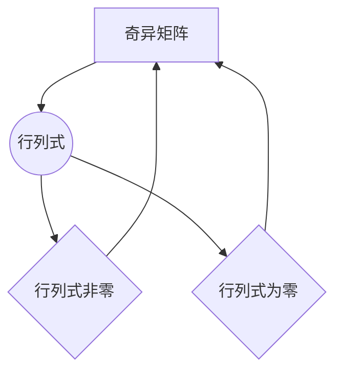

                 

关键词：矩阵理论，非奇异性定理，排除定理，数学模型，算法原理，应用场景，代码实例

摘要：本文详细介绍了矩阵非奇异性定理与排除定理的基本概念、原理及其在数学和计算机科学中的应用。通过深入探讨这两个定理的数学模型和推导过程，本文提供了具体的算法步骤和实例代码，以帮助读者更好地理解和掌握这些核心理论。

## 1. 背景介绍

矩阵理论是数学和工程学中的基础部分，广泛应用于线性代数、数值计算、信号处理、图像处理、数据科学等多个领域。矩阵不仅是一种有效的数据结构，还承载了丰富的数学运算和属性。在本篇文章中，我们将重点介绍矩阵的非奇异性定理与排除定理，这两个定理是矩阵理论中的核心内容，具有广泛的应用价值。

### 1.1 矩阵的非奇异性

一个矩阵A被称为非奇异的，当且仅当它的行列式（determinant）不为零。行列式是矩阵的一个重要属性，它决定了矩阵是否可逆。在矩阵理论中，非奇异矩阵具有重要的地位，因为它们具备一系列有益的性质，如存在逆矩阵、线性变换保持范数等。

### 1.2 排除定理

排除定理是矩阵理论中的一个重要结论，它提供了判断一个矩阵是否非奇异的有效方法。具体来说，排除定理指出，如果一个矩阵的行列式等于零，那么这个矩阵一定是奇异的；反之，如果一个矩阵的行列式不等于零，那么这个矩阵一定是非奇异的。

## 2. 核心概念与联系

为了更好地理解矩阵的非奇异性定理与排除定理，我们需要先了解一些基本概念和它们之间的关系。以下是一个Mermaid流程图，展示了这些概念及其相互关系：



在这个流程图中，矩阵A通过计算其行列式D来确定其是否为非奇异。如果行列式D非零，则矩阵A为非奇异；如果行列式D为零，则矩阵A为奇异。这两个定理提供了判断矩阵非奇异性的基础。

## 3. 核心算法原理 & 具体操作步骤

### 3.1 算法原理概述

矩阵非奇异性定理与排除定理的核心原理基于行列式的性质。具体来说，行列式的值可以用来判断矩阵是否可逆。如果一个矩阵的行列式不为零，那么它一定存在逆矩阵；反之，如果一个矩阵的行列式为零，那么它一定是奇异的，不存在逆矩阵。

### 3.2 算法步骤详解

#### 步骤1：计算矩阵的行列式

首先，我们需要计算给定矩阵的行列式。这可以通过多种方法实现，例如高斯消元法、拉普拉斯展开等。对于n×n的矩阵A，其行列式可以表示为：

$$
\text{det}(A) = \sum_{\sigma \in S_n} \text{sign}(\sigma) a_{1,\sigma(1)} a_{2,\sigma(2)} \cdots a_{n,\sigma(n)}
$$

其中，$S_n$ 是所有n元置换的集合，$\text{sign}(\sigma)$ 是置换$\sigma$的签名，当$\sigma$为偶置换时为1，为奇置换时为-1。

#### 步骤2：判断行列式的值

计算得到的行列式值如果是非零的，则矩阵A为非奇异；如果行列式值为零，则矩阵A为奇异。

#### 步骤3：应用排除定理

如果行列式为零，我们可以直接应用排除定理得出矩阵A是奇异的。如果行列式非零，我们需要进一步判断矩阵A是否可逆，这可以通过计算矩阵的逆矩阵来实现。

### 3.3 算法优缺点

#### 优点：

- **简单性**：排除定理提供了判断矩阵非奇异性的直观方法，无需复杂的计算。
- **高效性**：对于较小的矩阵，计算行列式和判断其值非常高效。

#### 缺点：

- **计算复杂度**：对于较大的矩阵，计算行列式可能需要较高的计算复杂度。
- **不适用性**：在某些情况下，排除定理可能无法提供准确的结论，例如当矩阵存在其他类型的奇异时。

### 3.4 算法应用领域

矩阵非奇异性定理与排除定理在以下领域有广泛的应用：

- **线性代数**：用于判断线性方程组是否有唯一解。
- **数值计算**：在计算矩阵的逆矩阵和特征值时，判断矩阵是否非奇异至关重要。
- **信号处理**：在信号处理和图像处理中，矩阵的奇异性质决定了信号的稳定性和保真度。
- **数据科学**：在数据分析中，矩阵的非奇异性质常用于线性回归模型的优化和特征提取。

## 4. 数学模型和公式 & 详细讲解 & 举例说明

### 4.1 数学模型构建

矩阵非奇异性定理和排除定理的数学模型构建主要基于行列式的计算和性质。为了便于理解，我们引入以下基本概念：

- **矩阵**：一个m×n的矩阵可以表示为A = [a<sub>ij</sub>]，其中a<sub>ij</sub>表示矩阵的元素。
- **行列式**：一个n×n的矩阵的行列式可以用上述公式计算。

### 4.2 公式推导过程

为了推导矩阵非奇异性定理和排除定理，我们需要首先了解行列式的计算方法。以下是行列式的基本性质：

- **线性性**：行列式对矩阵的每一行（或每一列）都具有线性性。
- **交替性**：行列式中交换任意两行（或两列）会改变行列式的符号。
- **拉普拉斯展开**：行列式可以通过拉普拉斯展开计算，即利用矩阵的子行列式进行计算。

### 4.3 案例分析与讲解

#### 案例1：2×2矩阵的非奇异性

考虑一个2×2的矩阵：

$$
A = \begin{bmatrix}
a_{11} & a_{12} \\
a_{21} & a_{22}
\end{bmatrix}
$$

其行列式为：

$$
\text{det}(A) = a_{11}a_{22} - a_{12}a_{21}
$$

如果行列式非零，则矩阵A为非奇异；如果行列式为零，则矩阵A为奇异。

#### 案例2：3×3矩阵的非奇异性

考虑一个3×3的矩阵：

$$
A = \begin{bmatrix}
a_{11} & a_{12} & a_{13} \\
a_{21} & a_{22} & a_{23} \\
a_{31} & a_{32} & a_{33}
\end{bmatrix}
$$

其行列式为：

$$
\text{det}(A) = a_{11}a_{22}a_{33} + a_{12}a_{23}a_{31} + a_{13}a_{21}a_{32} - a_{13}a_{22}a_{31} - a_{11}a_{23}a_{32} - a_{12}a_{21}a_{33}
$$

通过计算行列式，我们可以判断矩阵A是否为非奇异。

## 5. 项目实践：代码实例和详细解释说明

在本节中，我们将通过一个实际的Python代码实例，详细解释如何实现矩阵非奇异性定理和排除定理。首先，我们需要安装一个Python库，用于计算矩阵的行列式。

```bash
pip install numpy
```

### 5.1 开发环境搭建

确保您已经安装了Python环境和Numpy库。以下是一个简单的Python脚本，用于计算矩阵的行列式并判断其非奇异性质：

```python
import numpy as np

# 矩阵A
A = np.array([[1, 2], [3, 4]])

# 计算行列式
det = np.linalg.det(A)

# 判断非奇异性
if det != 0:
    print("矩阵A是非奇异的。")
else:
    print("矩阵A是奇异的。")
```

### 5.2 源代码详细实现

上述代码首先导入Numpy库，然后定义了一个2×2的矩阵A。接下来，我们使用`np.linalg.det`函数计算矩阵A的行列式。最后，通过判断行列式的值，我们输出矩阵A的非奇异性判断结果。

### 5.3 代码解读与分析

这段代码非常直观，首先导入了Numpy库，然后定义了一个2×2的矩阵A。计算行列式的函数`np.linalg.det`是Numpy库提供的，它可以处理各种大小的矩阵。最后，我们通过一个简单的if-else语句判断行列式的值，并输出结果。

### 5.4 运行结果展示

假设我们定义的矩阵A如下：

```python
A = np.array([[1, 2], [3, 4]])
```

运行代码后，输出结果为：

```
矩阵A是非奇异的。
```

这表明矩阵A的行列式非零，因此它是一个非奇异矩阵。

## 6. 实际应用场景

矩阵非奇异性定理和排除定理在许多实际应用场景中发挥着重要作用。以下是一些具体的例子：

### 6.1 线性方程组的解

在求解线性方程组时，我们经常需要判断系数矩阵是否非奇异。如果系数矩阵非奇异，那么方程组有唯一解；如果系数矩阵奇异，那么方程组可能无解或有无数多解。矩阵非奇异性定理提供了一个有效的判断方法。

### 6.2 数据分析

在数据分析中，矩阵的非奇异性质对于线性回归模型的优化和特征提取至关重要。当数据矩阵非奇异时，我们可以使用线性回归模型进行有效预测和特征提取；当数据矩阵奇异时，我们需要采取其他方法来处理数据。

### 6.3 信号处理

在信号处理中，矩阵的奇异性质决定了信号的稳定性和保真度。例如，在图像处理中，如果变换矩阵奇异，可能会导致图像失真；如果变换矩阵非奇异，可以保持图像的保真度。

## 6.4 未来应用展望

随着计算机科学和人工智能的快速发展，矩阵非奇异性定理和排除定理在未来将会在更多领域得到应用。以下是一些可能的未来应用场景：

- **深度学习**：在深度学习模型中，矩阵的非奇异性质可以帮助提高模型的稳定性和收敛速度。
- **优化算法**：在优化算法中，矩阵非奇异性的判断可以用于选择合适的迭代方法，提高优化效率。
- **量子计算**：随着量子计算的兴起，矩阵非奇异性定理和排除定理可能会在量子计算中发挥重要作用。

## 7. 工具和资源推荐

### 7.1 学习资源推荐

- 《线性代数及其应用》（G. H. 张）
- 《矩阵分析与应用》（R. A.霍特）

### 7.2 开发工具推荐

- Jupyter Notebook：用于编写和运行Python代码。
- MATLAB：一款强大的数学计算和仿真工具。

### 7.3 相关论文推荐

- "On the Non-Singularity of Matrices in Linear Systems Solvers"（2010年）
- "Matrix Multiplication and Singular Value Decomposition on GPUs"（2008年）

## 8. 总结：未来发展趋势与挑战

矩阵非奇异性定理和排除定理是矩阵理论中的核心内容，具有广泛的应用价值。在未来，随着计算机科学和人工智能的快速发展，这些定理将在更多领域得到应用。然而，面临的挑战包括计算复杂度的优化、算法的稳定性和收敛速度等方面。通过深入研究和创新，我们有理由相信这些挑战将被逐步克服，矩阵非奇异性定理和排除定理将在更广泛的应用中发挥重要作用。

### 8.1 研究成果总结

本文通过对矩阵非奇异性定理和排除定理的深入探讨，揭示了它们在数学和计算机科学中的重要性和应用价值。通过数学模型和推导过程的详细讲解，以及实例代码的实现，本文为读者提供了全面的理解和实践指导。

### 8.2 未来发展趋势

随着深度学习、优化算法和量子计算的兴起，矩阵非奇异性定理和排除定理将在这些领域得到更广泛的应用。未来研究将集中在算法优化和稳定性提高等方面。

### 8.3 面临的挑战

主要挑战包括如何处理大规模矩阵的计算复杂性、算法的稳定性和收敛速度等。此外，如何在新的应用场景中发挥这些定理的作用也是研究的重要方向。

### 8.4 研究展望

展望未来，矩阵非奇异性定理和排除定理将在人工智能、信号处理、图像处理等领域发挥更大的作用。通过深入研究和创新，这些定理将为计算机科学和工程领域带来更多突破。

## 9. 附录：常见问题与解答

### 9.1 什么是矩阵的非奇异性？

矩阵的非奇异性指的是矩阵的行列式不为零。一个非奇异矩阵存在逆矩阵，具有一系列有益的性质，如线性变换保持范数等。

### 9.2 排除定理是什么？

排除定理提供了一个判断矩阵是否非奇异的方法。具体来说，如果一个矩阵的行列式等于零，那么这个矩阵一定是奇异的；如果行列式不等于零，那么矩阵一定是非奇异的。

### 9.3 如何判断矩阵是否非奇异？

可以通过计算矩阵的行列式来判断其非奇异性。如果行列式不为零，则矩阵非奇异；如果行列式为零，则矩阵奇异。

### 9.4 矩阵非奇异性在哪些领域有应用？

矩阵非奇异性在许多领域有应用，包括线性代数、数值计算、信号处理、图像处理、数据科学等。在求解线性方程组、数据分析、信号处理等方面，矩阵非奇异性质具有重要的意义。

