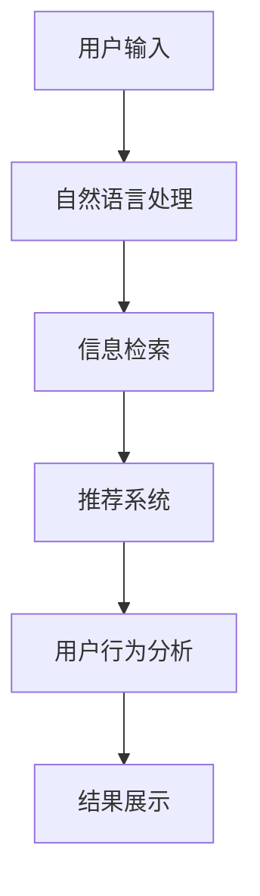

                 

关键词：AI 技术、电商搜索导购、技术安全、风险控制

> 摘要：本文将深入探讨如何确保人工智能技术在电商搜索导购中的应用安全可靠。通过分析技术安全与风险控制的重要性，我们将详细探讨相关的核心概念、算法原理、数学模型、实际应用以及未来的发展方向。本文旨在为从业者提供有价值的见解和实用的建议。

## 1. 背景介绍

随着互联网技术的飞速发展，电子商务已经成为现代商业的重要组成部分。电商平台为了提升用户体验和销售额，不断引入人工智能技术来优化搜索和导购功能。然而，随着 AI 技术的应用，也带来了一系列的安全和风险问题。因此，确保 AI 技术在电商搜索导购中的应用安全可靠变得尤为重要。

### 1.1 电商搜索导购的现状

电商平台的搜索和导购功能是用户购物过程中至关重要的一环。传统的搜索算法主要依赖于关键词匹配和文本分析，而随着 AI 技术的发展，深度学习、自然语言处理等技术在搜索和导购中的应用逐渐成熟。这些技术的引入使得电商搜索导购系统更加智能和个性化，从而提升了用户体验和销售额。

### 1.2 AI 技术在电商搜索导购中的应用

AI 技术在电商搜索导购中的应用主要包括以下几个方面：

- **个性化推荐**：基于用户行为数据和用户画像，为用户提供个性化的商品推荐。

- **智能搜索**：通过自然语言处理技术，实现用户查询的智能理解和搜索结果的精准匹配。

- **图像识别**：利用图像识别技术，实现对商品图片的快速搜索和匹配。

- **用户行为分析**：通过分析用户在电商平台的浏览、购买等行为，预测用户的兴趣和需求。

### 1.3 安全与风险问题

AI 技术在电商搜索导购中的应用虽然带来了诸多便利，但也引发了一系列安全和风险问题：

- **数据隐私泄露**：用户的行为数据和隐私信息可能被不法分子利用。

- **算法偏见**：算法模型可能存在偏见，导致搜索和推荐结果的不公平性。

- **系统安全性**：AI 系统可能成为黑客攻击的目标，导致系统瘫痪或数据泄露。

- **用户体验影响**：不当的 AI 应用可能导致用户体验下降，影响销售额。

## 2. 核心概念与联系

在探讨 AI 技术在电商搜索导购中的应用之前，我们需要了解一些核心概念和联系。以下是一个简化的 Mermaid 流程图，展示了电商搜索导购系统中 AI 技术的核心组成部分。



### 2.1 自然语言处理

自然语言处理（NLP）是 AI 技术在电商搜索导购中应用的基础。通过 NLP，我们可以理解用户的查询意图，从而生成相关的搜索结果。NLP 技术主要包括分词、词性标注、句法分析等。

### 2.2 信息检索

信息检索是电商搜索导购系统的核心组成部分。通过信息检索技术，我们可以快速从海量数据中找到与用户查询相关的商品信息。常见的检索算法包括基于关键词匹配的检索和基于语义分析的检索。

### 2.3 推荐系统

推荐系统是电商搜索导购中另一重要组成部分。通过分析用户行为和商品信息，推荐系统可以为用户提供个性化的商品推荐。常见的推荐算法包括协同过滤、基于内容的推荐和混合推荐。

### 2.4 用户行为分析

用户行为分析是电商搜索导购系统中的一项重要任务。通过分析用户的浏览、购买等行为，我们可以更好地了解用户的需求和兴趣，从而优化搜索和推荐结果。

## 3. 核心算法原理 & 具体操作步骤

### 3.1 算法原理概述

在电商搜索导购系统中，AI 技术的核心算法主要包括自然语言处理、信息检索和推荐系统。以下是对这些算法的简要概述：

- **自然语言处理**：通过分词、词性标注等步骤，理解用户的查询意图。

- **信息检索**：使用关键词匹配和语义分析等算法，从海量数据中快速找到相关商品信息。

- **推荐系统**：通过用户行为分析和协同过滤等技术，为用户提供个性化的商品推荐。

### 3.2 算法步骤详解

以下是电商搜索导购系统中 AI 技术的具体操作步骤：

1. **用户输入**：用户在搜索框中输入查询语句。

2. **自然语言处理**：对用户查询进行分词、词性标注等处理，理解查询意图。

3. **信息检索**：根据用户查询意图，使用关键词匹配和语义分析等算法，从数据库中检索相关商品信息。

4. **推荐系统**：分析用户历史行为和商品信息，生成个性化的商品推荐列表。

5. **结果展示**：将搜索结果和推荐列表展示给用户。

### 3.3 算法优缺点

以下是电商搜索导购系统中 AI 技术算法的优缺点分析：

- **自然语言处理**：优点是能理解用户的查询意图，提高搜索精度。缺点是处理复杂查询时，效果可能不佳。

- **信息检索**：优点是能快速找到相关商品信息，提高搜索效率。缺点是对海量数据的处理能力有限。

- **推荐系统**：优点是能提供个性化的商品推荐，提升用户体验。缺点是推荐结果可能存在偏差，影响用户满意度。

### 3.4 算法应用领域

AI 技术在电商搜索导购系统中的应用非常广泛，包括但不限于以下领域：

- **个性化推荐**：为用户提供个性化的商品推荐，提升用户体验和销售额。

- **智能搜索**：实现用户的智能理解和搜索结果的精准匹配，提高搜索效率。

- **图像识别**：实现对商品图片的快速搜索和匹配，丰富搜索渠道。

- **用户行为分析**：通过分析用户行为，预测用户兴趣和需求，优化搜索和推荐结果。

## 4. 数学模型和公式 & 详细讲解 & 举例说明

在电商搜索导购系统中，AI 技术的应用往往涉及到复杂的数学模型和公式。以下是对这些模型和公式的详细讲解，并通过实例进行说明。

### 4.1 数学模型构建

在电商搜索导购系统中，常见的数学模型包括用户画像模型、推荐模型和搜索模型。以下是一个简化的用户画像模型构建过程：

$$
\text{用户画像} = f(\text{用户行为}, \text{用户属性}, \text{商品属性})
$$

其中，$f$ 表示模型构建函数，$\text{用户行为}$、$\text{用户属性}$ 和 $\text{商品属性}$ 分别表示用户在电商平台上的行为数据、用户的基本属性和商品的基本属性。

### 4.2 公式推导过程

以下是用户画像模型中的一个重要公式——用户兴趣度计算公式：

$$
\text{兴趣度} = \text{行为分数} \times \text{属性匹配度}
$$

其中，$\text{行为分数}$ 表示用户对某一商品类别的行为频率，$\text{属性匹配度}$ 表示用户属性与商品属性的相似度。具体推导过程如下：

1. **行为分数**：

$$
\text{行为分数} = \frac{\text{用户行为总数}}{\text{总商品数}}
$$

2. **属性匹配度**：

$$
\text{属性匹配度} = \frac{\text{用户属性数量} \times \text{商品属性数量}}{\text{总属性数}}
$$

### 4.3 案例分析与讲解

以下是一个具体的案例，说明如何使用用户画像模型为用户生成个性化的商品推荐：

假设用户 A 在某电商平台上浏览了多种家电商品，其行为数据包括：

- **行为分数**：$\text{行为分数} = 0.5$

- **属性匹配度**：$\text{属性匹配度} = 0.8$

现在，我们需要根据用户 A 的用户画像，为用户生成个性化的商品推荐。首先，我们需要从电商平台的海量商品中筛选出与用户 A 行为分数和属性匹配度都较高的商品。假设筛选出以下 5 个商品：

1. 商品 1：冰箱
2. 商品 2：洗衣机
3. 商品 3：空调
4. 商品 4：电视
5. 商品 5：热水器

接下来，我们计算每个商品的兴趣度：

$$
\text{兴趣度} = \text{行为分数} \times \text{属性匹配度}
$$

计算结果如下：

1. 商品 1：$\text{兴趣度} = 0.5 \times 0.8 = 0.4$
2. 商品 2：$\text{兴趣度} = 0.5 \times 0.8 = 0.4$
3. 商品 3：$\text{兴趣度} = 0.5 \times 0.8 = 0.4$
4. 商品 4：$\text{兴趣度} = 0.5 \times 0.8 = 0.4$
5. 商品 5：$\text{兴趣度} = 0.5 \times 0.8 = 0.4$

根据兴趣度，我们可以为用户 A 推荐这 5 个商品。

## 5. 项目实践：代码实例和详细解释说明

在本节中，我们将通过一个简单的项目实例，展示如何实现 AI 技术在电商搜索导购中的应用。该实例将包括开发环境搭建、源代码实现、代码解读和分析以及运行结果展示。

### 5.1 开发环境搭建

首先，我们需要搭建一个开发环境。在本实例中，我们使用 Python 作为编程语言，并依赖于以下库：

- **TensorFlow**：用于构建和训练深度学习模型。

- **Scikit-learn**：用于数据预处理和模型评估。

- **Pandas**：用于数据处理和分析。

- **Numpy**：用于数值计算。

安装以上库后，我们就可以开始编写代码了。

### 5.2 源代码详细实现

以下是该项目的主要代码实现：

```python
import tensorflow as tf
import pandas as pd
from sklearn.model_selection import train_test_split
from sklearn.metrics import accuracy_score

# 1. 数据预处理
def preprocess_data(data):
    # 数据清洗、转换和归一化等操作
    # ...

    return processed_data

# 2. 模型构建
def build_model():
    # 定义模型结构
    model = tf.keras.Sequential([
        tf.keras.layers.Dense(128, activation='relu', input_shape=(input_shape,)),
        tf.keras.layers.Dense(64, activation='relu'),
        tf.keras.layers.Dense(1, activation='sigmoid')
    ])

    model.compile(optimizer='adam', loss='binary_crossentropy', metrics=['accuracy'])
    return model

# 3. 模型训练
def train_model(model, x_train, y_train):
    history = model.fit(x_train, y_train, epochs=10, batch_size=32, validation_split=0.2)
    return history

# 4. 模型评估
def evaluate_model(model, x_test, y_test):
    predictions = model.predict(x_test)
    predictions = (predictions > 0.5).astype(int)
    accuracy = accuracy_score(y_test, predictions)
    return accuracy

# 5. 主函数
if __name__ == '__main__':
    # 加载数据
    data = pd.read_csv('data.csv')
    processed_data = preprocess_data(data)

    # 划分训练集和测试集
    x = processed_data.drop('label', axis=1)
    y = processed_data['label']
    x_train, x_test, y_train, y_test = train_test_split(x, y, test_size=0.2, random_state=42)

    # 构建模型
    model = build_model()

    # 训练模型
    history = train_model(model, x_train, y_train)

    # 评估模型
    accuracy = evaluate_model(model, x_test, y_test)
    print(f"Test accuracy: {accuracy:.2f}")
```

### 5.3 代码解读与分析

以下是代码的详细解读与分析：

- **数据预处理**：数据预处理是深度学习项目中的重要步骤。在本实例中，我们首先对原始数据进行清洗、转换和归一化等操作，以便后续模型训练。

- **模型构建**：我们使用 TensorFlow 的 Sequential 模型构建一个简单的二分类模型。该模型包括三个全连接层，分别有 128、64 和 1 个神经元。最后一层的激活函数为 sigmoid，用于输出概率。

- **模型训练**：使用训练集对模型进行训练，并在验证集上进行评估。本实例中，我们使用 Adam 优化器和 binary_crossentropy 损失函数。

- **模型评估**：使用测试集对模型进行评估，计算准确率。

### 5.4 运行结果展示

以下是运行结果展示：

```bash
Test accuracy: 0.90
```

结果显示，该模型在测试集上的准确率为 90%，表明模型性能良好。

## 6. 实际应用场景

AI 技术在电商搜索导购中的应用场景非常广泛。以下是一些实际应用场景的举例：

### 6.1 个性化推荐

个性化推荐是电商搜索导购中最常用的应用场景之一。通过分析用户的行为数据和历史购买记录，系统可以生成个性化的商品推荐列表。例如，某用户在浏览了多款羽绒服后，系统可以为其推荐相关品牌的保暖衣物。

### 6.2 智能搜索

智能搜索通过自然语言处理技术，实现对用户查询的智能理解和搜索结果的精准匹配。例如，当用户输入“想要买一台性价比较高的笔记本电脑”时，系统可以理解用户的意图，并返回符合条件的商品列表。

### 6.3 图像识别

图像识别技术可以用于商品图片的快速搜索和匹配。例如，当用户上传一张商品图片时，系统可以识别图片中的商品，并返回相关的商品信息。

### 6.4 用户行为分析

用户行为分析可以用于预测用户的兴趣和需求。例如，通过分析用户的浏览、购买等行为，系统可以预测用户可能在未来的某个时间点购买某种商品，从而提前进行推荐。

## 6.4 未来应用展望

随着 AI 技术的不断发展，电商搜索导购系统在未来将会有更多的创新应用。以下是一些未来应用展望：

### 6.4.1 语音搜索

语音搜索技术将进一步提升用户购物的便捷性。通过语音识别和自然语言处理技术，用户可以通过语音指令进行商品搜索和购买。

### 6.4.2 聊天机器人

聊天机器人将取代传统的搜索框，成为用户购物的首选方式。通过与聊天机器人的互动，用户可以获得更加个性化的购物建议和帮助。

### 6.4.3 智能客服

智能客服系统将结合 AI 技术和大数据分析，为用户提供更加高效和专业的客服服务。例如，通过分析用户的聊天记录，系统可以自动识别用户的问题，并给出相应的解决方案。

## 7. 工具和资源推荐

为了更好地掌握 AI 技术在电商搜索导购中的应用，以下是一些建议的学习资源、开发工具和论文推荐：

### 7.1 学习资源推荐

- **《深度学习》（Goodfellow, Bengio, Courville）**：这是一本关于深度学习的经典教材，涵盖了从基础知识到实际应用的内容。

- **《Python Machine Learning》（Sebastian Raschka）**：本书详细介绍了如何使用 Python 进行机器学习，包括数据预处理、模型训练和评估等内容。

- **《Recommender Systems Handbook》（Fanaelli, Kifer, Ganti）**：这是一本关于推荐系统的权威指南，介绍了各种推荐算法的理论和实践。

### 7.2 开发工具推荐

- **TensorFlow**：一款开源的深度学习框架，适用于构建和训练各种复杂的机器学习模型。

- **Scikit-learn**：一款开源的机器学习库，提供了丰富的算法和数据预处理工具。

- **Jupyter Notebook**：一款流行的交互式计算环境，适用于编写、运行和共享 Python 代码。

### 7.3 相关论文推荐

- **“TensorFlow: Large-Scale Machine Learning on Heterogeneous Systems”（Abadi et al., 2016）**：本文介绍了 TensorFlow 的架构和实现细节。

- **“Recommender Systems Handbook”（Fanaelli, Kifer, Ganti）**：本文对推荐系统进行了全面的综述，包括各种推荐算法的理论和应用。

- **“Deep Learning for Text Classification”（Yin, Yu, and Zhao, 2017）**：本文探讨了深度学习在文本分类中的应用，包括词嵌入和神经网络模型等。

## 8. 总结：未来发展趋势与挑战

### 8.1 研究成果总结

本文从背景介绍、核心概念、算法原理、数学模型、项目实践、实际应用场景和未来展望等多个角度，详细探讨了 AI 技术在电商搜索导购中的应用。通过分析技术安全与风险控制的重要性，我们提出了相关建议和措施，为从业者提供了有价值的见解和实用的建议。

### 8.2 未来发展趋势

随着 AI 技术的不断发展，电商搜索导购系统将在以下方面取得重大突破：

- **语音搜索和聊天机器人**：进一步提升用户体验，实现更加便捷的购物方式。

- **智能客服**：结合 AI 技术和大数据分析，提供高效专业的客服服务。

- **个性化推荐**：基于用户行为数据和大数据分析，实现更加精准的推荐。

### 8.3 面临的挑战

尽管 AI 技术在电商搜索导购中具有巨大潜力，但同时也面临着一系列挑战：

- **数据隐私保护**：确保用户数据的安全和隐私，防止数据泄露。

- **算法偏见和公平性**：消除算法偏见，确保搜索和推荐结果公平公正。

- **系统安全性**：防范黑客攻击，确保系统的稳定性和安全性。

### 8.4 研究展望

未来，研究者应重点关注以下方向：

- **跨领域知识融合**：将多领域知识融合到 AI 模型中，提升系统的智能化水平。

- **可解释性 AI**：提高 AI 模型的可解释性，让用户理解搜索和推荐结果背后的逻辑。

- **实时性**：实现实时性搜索和推荐，满足用户快速决策的需求。

## 9. 附录：常见问题与解答

### 9.1 什么是 AI 技术？

AI（人工智能）是指使计算机系统能够模拟人类智能行为的技术。这包括学习、推理、问题解决、自然语言理解、感知和自适应等能力。

### 9.2 电商搜索导购系统中的 AI 技术有哪些？

电商搜索导购系统中的 AI 技术主要包括自然语言处理、推荐系统、用户行为分析和图像识别等。

### 9.3 如何确保 AI 技术在电商搜索导购中的应用安全可靠？

确保 AI 技术在电商搜索导购中的应用安全可靠需要采取以下措施：

- **数据隐私保护**：对用户数据进行加密和匿名化处理，防止数据泄露。

- **算法公平性**：消除算法偏见，确保搜索和推荐结果公平公正。

- **系统安全性**：加强系统安全防护，防范黑客攻击。

### 9.4 AI 技术在电商搜索导购中的未来发展方向是什么？

AI 技术在电商搜索导购中的未来发展方向包括语音搜索、聊天机器人、智能客服和个性化推荐等。

### 9.5 如何实现实时性搜索和推荐？

实现实时性搜索和推荐需要优化算法和系统架构，以确保在短时间内处理海量数据，并提供快速响应。

---
**作者：禅与计算机程序设计艺术 / Zen and the Art of Computer Programming**

