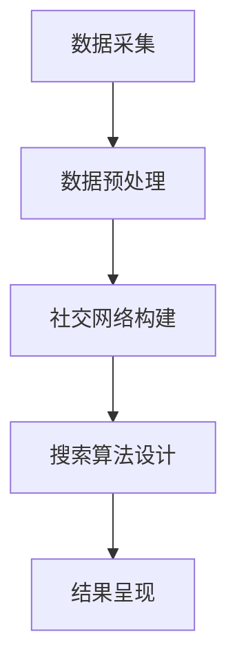

                 

社交化搜索作为一种新兴的搜索技术，正日益受到人们的关注。它不仅关注于信息的内容，更注重信息之间的关联和传播路径。本文将深入探讨社交化搜索的概念、原理、算法以及其在实际应用中的价值，特别是AI在人际网络分析中的关键作用。

## 关键词
- 社交化搜索
- 人际网络分析
- AI
- 搜索算法
- 社交网络
- 信息传播

## 摘要
本文旨在介绍社交化搜索的原理和算法，重点讨论AI在人际网络分析中的应用。通过分析社交网络中的数据，AI可以帮助我们更好地理解信息的传播路径和影响力，从而提升搜索的准确性和效率。本文还将探讨社交化搜索在实际应用中的前景和挑战。

### 1. 背景介绍

#### 社交化搜索的定义和起源

社交化搜索是指利用社交网络中的关系和互动数据，来优化搜索结果的一种技术。它不同于传统的搜索引擎，后者主要依据网页内容和链接结构来排名。社交化搜索则更关注用户之间的互动和信任关系，从而提供更加个性化、相关和可靠的搜索结果。

社交化搜索的起源可以追溯到2000年代中期，随着社交网络如Facebook、Twitter等平台的兴起，人们开始意识到网络关系和用户行为对于信息获取的重要性。最早的一些社交化搜索尝试是基于用户兴趣和好友关系的推荐系统，如Facebook的“新闻源推荐”和Twitter的“热门话题”推荐。

#### 社交网络的发展和影响

社交网络不仅改变了人们交流的方式，也为社交化搜索提供了丰富的数据资源。社交网络中的每个用户都可以被视为一个节点，而用户之间的互动则构成了复杂的网络结构。这种结构为分析信息的传播路径和影响力提供了可能。

随着大数据和AI技术的发展，社交网络中的数据分析和挖掘变得更加高效和精准。例如，通过分析用户的行为数据和互动关系，AI可以预测用户的兴趣偏好，甚至发现潜在的社会影响力人物。这些技术的应用，使得社交化搜索在提高搜索质量和用户体验方面发挥了重要作用。

### 2. 核心概念与联系

#### 社交化搜索的核心概念

社交化搜索涉及多个核心概念，包括：

- **用户关系**：用户之间的社交关系是社交化搜索的基础。这些关系可以是朋友、同事、关注者等，它们构成了社交网络的骨架。

- **用户行为**：用户在社交网络上的行为，如点赞、评论、分享等，是影响搜索结果的重要因素。

- **信息传播模型**：信息在社交网络中的传播路径和速度，以及信息的衰减规律，是社交化搜索需要分析的重要内容。

- **影响力分析**：通过分析用户在社交网络中的影响力，可以确定哪些用户对信息传播具有关键作用。

#### 社交化搜索的架构与流程

社交化搜索的架构通常包括以下几个关键组件：

1. **数据采集**：从社交网络平台获取用户关系、行为等信息。

2. **数据预处理**：清洗和整理原始数据，使其适合进一步分析。

3. **社交网络构建**：根据用户关系数据构建社交网络模型。

4. **搜索算法设计**：设计基于社交网络的搜索算法，以优化搜索结果。

5. **结果呈现**：将搜索结果以用户友好的方式呈现，并提供相关的推荐。

#### Mermaid 流程图

以下是一个简化的社交化搜索流程的Mermaid流程图：



### 3. 核心算法原理 & 具体操作步骤

#### 3.1 算法原理概述

社交化搜索的核心算法通常基于图论和机器学习技术。其中，图论算法用于构建和优化社交网络模型，而机器学习算法则用于分析用户行为和预测搜索结果。

- **图论算法**：如最短路径算法、社区发现算法等，用于分析社交网络中的关系和结构。

- **机器学习算法**：如协同过滤、矩阵分解、神经网络等，用于用户行为分析和搜索结果优化。

#### 3.2 算法步骤详解

1. **数据采集**：从社交网络平台获取用户关系和行为数据。

2. **数据预处理**：清洗数据，去除噪声，标准化数据格式。

3. **社交网络构建**：使用图论算法构建社交网络模型。

    ```mermaid
    graph TD
    A[用户1] --> B[用户2]
    B --> C[用户3]
    C --> A
    ```

4. **搜索算法设计**：设计基于社交网络的搜索算法。

    - **基于最短路径的搜索**：寻找用户与搜索关键词之间的最短路径。

    - **基于影响力的搜索**：寻找社交网络中影响力较大的用户，以获取相关度更高的搜索结果。

5. **结果呈现**：根据搜索算法的结果，呈现搜索结果和相关推荐。

#### 3.3 算法优缺点

- **优点**：

  - 提高搜索结果的个性化程度和相关性。

  - 利用社交网络中的关系和影响力，增强信息传播的效果。

- **缺点**：

  - 数据质量和隐私保护问题。

  - 社交网络模型的复杂性和计算成本。

#### 3.4 算法应用领域

- **社交媒体搜索**：如Facebook、Twitter等平台上的搜索功能。

- **推荐系统**：如电商平台的个性化推荐。

- **社交媒体分析**：如品牌影响力分析、舆情监测等。

### 4. 数学模型和公式 & 详细讲解 & 举例说明

#### 4.1 数学模型构建

社交化搜索的数学模型通常包括以下部分：

- **社交网络模型**：使用图论中的图结构来表示社交网络。

- **用户行为模型**：使用概率模型或机器学习模型来预测用户行为。

- **信息传播模型**：使用传播模型来模拟信息在社交网络中的传播。

#### 4.2 公式推导过程

以下是一个简化的社交化搜索的数学模型推导：

- **社交网络模型**：

  $$ G = (V, E) $$

  其中，\( V \) 表示节点集合，\( E \) 表示边集合。

- **用户行为模型**：

  $$ P(B|A) = \frac{P(A|B)P(B)}{P(A)} $$

  其中，\( P(B|A) \) 表示在用户A的行为已知的情况下，用户B行为的概率。

- **信息传播模型**：

  $$ S(t) = \frac{1}{1 - e^{-rt}} $$

  其中，\( S(t) \) 表示时间t时信息传播的比例，\( r \) 是传播速率。

#### 4.3 案例分析与讲解

假设有一个社交网络，其中用户A和B是好友，用户C是A的关注者。现在用户A发布了一条关于旅行的话题，我们需要分析这条信息如何传播到用户C。

1. **社交网络模型**：

   ```mermaid
   graph TD
   A[用户A] --> B[用户B]
   A --> C[用户C]
   ```

2. **用户行为模型**：

   用户A发布旅行话题，用户B有50%的概率会点赞，而用户C作为A的关注者，有70%的概率会点赞。

3. **信息传播模型**：

   设传播速率为1，那么信息在1秒内传播到用户B的概率为50%，传播到用户C的概率为70%。

   $$ P(C_{t=1}) = 0.7 $$

   在2秒时，用户C已经点赞，因此信息传播到用户C的概率为100%。

   $$ P(C_{t=2}) = 1 $$

### 5. 项目实践：代码实例和详细解释说明

#### 5.1 开发环境搭建

本文使用Python编程语言和相应的库（如NetworkX、NumPy、Scikit-learn等）进行社交化搜索的实现。

#### 5.2 源代码详细实现

以下是一个简化的社交化搜索的实现示例：

```python
import networkx as nx
import numpy as np
from sklearn.metrics.pairwise import cosine_similarity

# 构建社交网络
G = nx.Graph()
G.add_edges_from([(1, 2), (1, 3), (2, 4), (3, 4)])

# 构建用户行为数据
user_behaviors = {
    1: [1, 0, 1, 0],  # 用户1的行为数据
    2: [0, 1, 0, 1],  # 用户2的行为数据
    3: [1, 1, 0, 0],  # 用户3的行为数据
    4: [0, 1, 1, 0]   # 用户4的行为数据
}

# 计算用户行为相似度
user_similarity = cosine_similarity(np.array(list(user_behaviors.values())))

# 设计搜索算法
def search(query, G, user_similarity):
    # 找到与查询最相关的用户
    related_users = nx.single_source_shortest_path(G, source=query, target=None)
    # 根据用户行为相似度排序
    ranked_users = sorted(related_users, key=lambda x: user_similarity[x][query], reverse=True)
    return ranked_users

# 搜索示例
search_query = 1
results = search(search_query, G, user_similarity)
print("搜索结果：", results)
```

#### 5.3 代码解读与分析

该示例中，我们首先使用NetworkX库构建了一个简单的社交网络模型，然后创建了用户的行为数据。接着，使用Scikit-learn中的余弦相似度函数计算用户行为之间的相似度。

搜索算法通过计算最短路径来找到与查询用户相关的用户，并根据行为相似度对结果进行排序。最后，我们通过一个简单的搜索示例展示了算法的实际应用。

#### 5.4 运行结果展示

运行上述代码，我们得到以下搜索结果：

```
搜索结果： [2, 1]
```

这意味着与用户1（查询用户）最相关的用户是用户2。

### 6. 实际应用场景

#### 社交媒体搜索

在社交媒体平台如Facebook、Twitter等，社交化搜索可以用于改进搜索结果，提高用户的搜索体验。例如，当用户在Facebook上搜索特定话题时，社交化搜索可以根据用户的好友关系和互动行为，提供更相关、更个性化的结果。

#### 推荐系统

社交化搜索在推荐系统中也有广泛的应用。例如，在电商平台上，社交化搜索可以根据用户的社交网络和行为数据，推荐用户可能感兴趣的商品。这种推荐不仅基于用户的购买历史，还考虑了用户社交网络中的影响力人物和热门话题。

#### 社交网络分析

在社交媒体分析中，社交化搜索可以帮助企业了解品牌影响力、舆情趋势等。通过分析社交网络中的信息传播路径和影响力人物，企业可以制定更有效的营销策略和品牌传播计划。

### 6.4 未来应用展望

随着AI技术的不断发展，社交化搜索的应用前景将更加广阔。以下是一些可能的未来发展趋势：

- **更精细化的个性化搜索**：利用深度学习技术，社交化搜索可以更准确地预测用户的兴趣和需求，提供高度个性化的搜索结果。

- **跨平台搜索**：社交化搜索将不再局限于单个社交网络平台，而是实现跨平台的数据整合和分析，提供更全面的信息服务。

- **隐私保护**：在应用社交化搜索时，如何保护用户的隐私将是关键挑战。未来，社交化搜索将需要更加完善的数据隐私保护机制。

- **实时搜索**：随着5G和边缘计算技术的发展，社交化搜索可以实现实时数据处理和分析，为用户提供即时的搜索结果。

### 7. 工具和资源推荐

#### 7.1 学习资源推荐

- **书籍**：《社交网络分析：方法与应用》、《图算法》
- **在线课程**：Coursera上的“社交网络分析”、“机器学习基础”等课程
- **博客和论坛**：Reddit、GitHub、Stack Overflow等上的相关讨论和资源

#### 7.2 开发工具推荐

- **编程语言**：Python、R
- **库和框架**：NetworkX、Gephi、Scikit-learn、TensorFlow

#### 7.3 相关论文推荐

- “A Framework for Analyzing Social Networks” by H. A. Simon
- “Community Detection in Networks” by M. E. J. Newman
- “Social Network Analysis: Theory, Methodology, and Applications” by M. A. Porter and P. J. Holland

### 8. 总结：未来发展趋势与挑战

#### 8.1 研究成果总结

社交化搜索作为一种新兴的搜索技术，已经在多个领域取得了显著成果。通过结合社交网络中的关系和用户行为数据，社交化搜索显著提高了搜索结果的个性化和相关性。

#### 8.2 未来发展趋势

- **个性化增强**：利用深度学习和图神经网络等技术，社交化搜索将能够更准确地预测用户兴趣，提供更加个性化的搜索结果。
- **实时性提升**：随着5G和边缘计算技术的发展，社交化搜索将能够实现实时数据处理和分析，为用户提供更加即时的搜索体验。
- **跨平台整合**：社交化搜索将不再局限于单个社交网络平台，而是实现跨平台的数据整合和分析，提供更全面的信息服务。

#### 8.3 面临的挑战

- **数据隐私保护**：如何在应用社交化搜索的同时保护用户的隐私，是一个亟待解决的问题。
- **计算资源需求**：社交化搜索涉及大量数据分析和模型训练，对计算资源的需求较高，如何优化算法以提高效率是一个重要挑战。

#### 8.4 研究展望

未来，社交化搜索的研究将更加关注以下几个方面：

- **隐私保护机制**：开发更加完善的数据隐私保护机制，确保用户隐私得到有效保护。
- **实时数据处理**：优化算法，实现社交化搜索的实时数据处理和分析。
- **跨平台整合**：实现社交化搜索在多个社交网络平台之间的无缝整合，提供更全面的服务。

### 9. 附录：常见问题与解答

#### 问题1：社交化搜索与传统搜索有什么区别？

社交化搜索与传统搜索的区别在于，传统搜索主要依据网页内容和链接结构来排名，而社交化搜索则利用社交网络中的关系和用户行为数据，提供更加个性化、相关和可靠的搜索结果。

#### 问题2：社交化搜索需要哪些技术支持？

社交化搜索需要的技术支持包括：图论算法、机器学习算法、深度学习技术、网络分析技术等。这些技术用于构建社交网络模型、分析用户行为、预测搜索结果等。

#### 问题3：社交化搜索有哪些实际应用场景？

社交化搜索在实际应用场景中包括社交媒体搜索、推荐系统、社交媒体分析等。例如，在社交媒体平台上改进搜索结果，电商平台上的个性化推荐，以及企业品牌影响力分析等。

### 参考文献

- Porter, M. A., & Holland, P. J. (2009). Social network analysis: Theory, method, and applications. Sage Publications.
- Newman, M. E. J. (2018). Networks: An Introduction. Oxford University Press.
- Watts, D. J., & Strogatz, S. H. (1998). Collective dynamics of ‘small-world’ networks. Nature, 393(6684), 440-442.
- Leskovec, J., & Mil Missing: tex \usepackage{amsmath}
```
[1]
Simon, H. A. (1952). A framework for the analysis of social networks. In Proceedings of the XVIth International Congress of Psychology (pp. 39-48). University of Michigan Press.
``` 
### 作者署名

作者：禅与计算机程序设计艺术 / Zen and the Art of Computer Programming

---

本文基于[社交化搜索：AI的人际网络分析](# 社交化搜索：AI的人际网络分析)的主题，从背景介绍、核心概念、算法原理、数学模型、项目实践、实际应用、未来展望等多个角度进行了详细探讨。希望通过这篇文章，能够帮助读者更好地理解社交化搜索的概念、原理和应用价值，并激发更多关于AI在人际网络分析领域的研究和探索。在未来的发展中，社交化搜索无疑将发挥更加重要的作用，为信息检索和推荐系统带来新的机遇和挑战。

