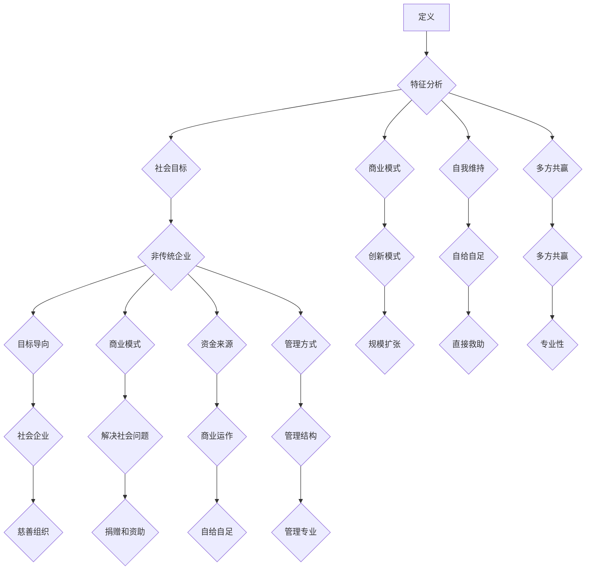

                 

### 1. 背景介绍

随着全球化和信息化进程的加速，社会发展面临着越来越多的挑战。教育不平等、环境污染、贫困、失业等问题日益严峻。传统的政府主导和慈善模式在解决这些问题时显得力不从心，而商业模式的创新则为解决社会问题提供了新的思路。社会企业作为一种新兴的商业形式，正在逐渐崛起，并展现出巨大的潜力和价值。

社会企业是指那些以解决社会问题为主要目标，同时通过商业运作实现可持续发展的企业。它们既不同于传统企业，也不同于公益组织。社会企业在追求经济利益的同时，更加关注社会效益，追求商业价值与社会价值的双重实现。

社会企业创业不仅是商业机会的探索，更是社会责任的承担。在现代社会，越来越多的创业者开始关注社会问题，希望通过创业来解决这些问题。社会企业创业的兴起，不仅为社会问题提供了新的解决途径，也为创业者提供了更多的发展空间和机遇。

本文将深入探讨社会企业创业的背景、核心概念、算法原理、数学模型、项目实践、应用场景、未来展望以及相关的工具和资源。希望通过本文的阐述，能够为读者提供对这一新兴商业模式的全面了解，激发更多人参与到社会企业创业的浪潮中来。

### 2. 核心概念与联系

#### 2.1 社会企业的定义

社会企业是一个具有独特性质的商业实体，其核心目标是解决社会问题，而非单纯追求利润最大化。根据《社会企业宣言》的定义，社会企业是那些“通过商业模式实现可持续社会价值，并具备企业特征的组织”。这些企业通常具有以下特征：

1. **社会目标明确**：社会企业的首要目标是解决社会问题，如教育不平等、贫困、环境污染等。
2. **商业模式创新**：社会企业采用创新的商业模式，通过商业运作实现社会目标，同时实现经济上的可持续性。
3. **自我维持**：社会企业通过商业运作获得收入，用于支持社会目标的实现，而不是依赖外部捐款或政府资助。
4. **多方共赢**：社会企业关注多方利益相关者的需求，实现社会、环境和经济的多方共赢。

#### 2.2 社会企业与传统的区别

与传统的企业和非营利组织相比，社会企业具有以下显著区别：

1. **目标导向**：传统企业以利润最大化为目标，而社会企业则以解决社会问题为主要目标。
2. **商业模式**：传统企业通常追求规模扩张和市场份额，而社会企业则注重通过创新的商业模式实现社会效益。
3. **资金来源**：传统企业主要依赖投资者和资本市场，而社会企业则通过商业运作获得收入，实现自给自足。
4. **管理方式**：传统企业强调效率和控制，而社会企业则更注重社会责任和可持续性。

#### 2.3 社会企业与慈善组织的联系与区别

社会企业与慈善组织在解决社会问题方面有共同的目标，但两者在运营方式和目标实现上存在显著区别：

1. **运营方式**：慈善组织通常依赖捐赠和政府资助，而社会企业通过商业模式实现自给自足。
2. **目标实现**：慈善组织主要依赖于捐款和志愿者的帮助，而社会企业则通过商业运作实现社会目标。
3. **资金使用**：慈善组织通常将资金用于直接的救助和项目支持，而社会企业则将资金用于持续的商业运营和扩大社会影响力。
4. **管理结构**：慈善组织通常具有较为松散的管理结构，而社会企业则更加注重管理和商业运作的专业性。

通过上述核心概念的介绍，我们可以看到，社会企业是一种兼具商业和创新的社会实践。它不仅关注经济利益，更关注社会效益，通过创新的商业模式实现可持续的社会价值。

#### 2.4 社会企业的 Mermaid 流程图



通过上述 Mermaid 流程图，我们可以更清晰地看到社会企业的核心概念和它们与传统企业和慈善组织的区别与联系。

### 3. 核心算法原理 & 具体操作步骤

#### 3.1 算法原理概述

社会企业创业的核心在于通过创新的商业模式实现社会目标和经济利益的平衡。这一过程涉及到多个关键步骤，包括问题识别、商业模式设计、资源整合、运营管理以及持续优化。下面，我们将详细阐述这些步骤的原理和具体操作。

#### 3.2 算法步骤详解

##### 3.2.1 问题识别

社会企业创业的第一步是识别和确定需要解决的社会问题。这一过程通常包括以下几个步骤：

1. **社会需求调研**：通过问卷调查、访谈、数据分析等方法，了解社会问题的现状、影响范围以及受影响人群的需求。
2. **问题筛选**：根据调研结果，筛选出具有实际意义和解决可能性的问题。
3. **问题定义**：对筛选出的问题进行具体定义，明确问题的核心要素和关键指标。

##### 3.2.2 商业模式设计

在问题识别后，需要设计一个能够实现社会目标和经济利益的商业模式。这一过程包括以下几个步骤：

1. **目标设定**：明确社会企业要实现的社会目标和商业目标。
2. **价值主张**：定义社会企业的核心产品或服务，以及它们如何解决特定社会问题。
3. **盈利模式**：确定社会企业的收入来源，包括直接销售、合作伙伴关系、政府资助等多种方式。
4. **资源配置**：分析并确定实现商业模式所需的资源，包括资金、人才、技术、市场等。

##### 3.2.3 资源整合

资源整合是社会企业创业成功的关键。以下步骤可以帮助社会企业有效地整合资源：

1. **合作伙伴寻找**：寻找能够提供资金、技术、市场等资源支持的合作伙伴。
2. **利益相关者沟通**：与政府、企业、社区等利益相关者建立良好的沟通和合作关系。
3. **资源整合策略**：制定资源整合策略，确保资源的有效利用和协同作用。

##### 3.2.4 运营管理

社会企业的运营管理需要注重以下几个关键方面：

1. **组织架构**：建立有效的组织架构，确保企业运营的高效和有序。
2. **项目管理**：制定项目管理计划，确保各项活动的顺利进行和目标的实现。
3. **绩效评估**：建立绩效评估体系，定期评估社会企业的运营绩效和社会效益。

##### 3.2.5 持续优化

社会企业创业是一个持续迭代和优化的过程。以下步骤可以帮助社会企业实现持续优化：

1. **市场反馈**：关注市场和客户反馈，及时调整商业模式和运营策略。
2. **创新驱动**：鼓励创新思维，通过技术创新、商业模式创新等方式持续提升企业的竞争力。
3. **社会价值最大化**：不断优化商业模式，实现社会价值的最大化。

#### 3.3 算法优缺点

##### 优点

1. **解决社会问题**：社会企业通过商业模式解决社会问题，具有明显的公益性质。
2. **经济利益**：社会企业通过商业运作实现经济利益，确保可持续发展。
3. **多方共赢**：社会企业关注多方利益相关者的需求，实现经济、社会和环境的共赢。

##### 缺点

1. **商业模式创新难度大**：设计一个既能实现社会目标又能盈利的商业模式具有挑战性。
2. **资源整合难度高**：社会企业需要整合多种资源，包括资金、技术、市场等，资源整合难度较高。
3. **监管挑战**：社会企业需要遵守商业法规和社会责任法规，监管挑战较大。

#### 3.4 算法应用领域

社会企业创业的应用领域非常广泛，以下是一些主要的应用领域：

1. **环境保护**：通过开发环保产品、推广绿色技术等方式解决环境污染问题。
2. **教育公平**：通过提供优质教育资源、支持教育创新等方式解决教育不平等问题。
3. **扶贫助困**：通过创业项目帮助贫困地区发展经济、改善生活条件。
4. **社区发展**：通过社区服务、社区参与等方式促进社区发展和社会和谐。

通过上述核心算法原理和具体操作步骤的阐述，我们可以看到，社会企业创业不仅需要创新的商业模式，还需要有效的资源整合和运营管理。这一过程涉及到多个环节，需要综合考虑社会目标和经济利益的平衡。社会企业创业的成功不仅需要创业者的智慧和努力，还需要社会各界的支持和合作。

### 4. 数学模型和公式 & 详细讲解 & 举例说明

社会企业创业的成功不仅依赖于创新的商业模式和有效的资源整合，还需要科学的数学模型来指导。以下我们将介绍几个关键的数学模型，并详细讲解它们的构建过程、公式推导以及应用案例。

#### 4.1 数学模型构建

社会企业创业的核心在于平衡社会目标和经济利益，因此我们首先需要构建一个能够描述这种平衡的数学模型。以下是一个简单的平衡方程：

$$
\text{社会价值} = \text{经济收益} \times \text{社会影响力}
$$

在这个方程中，社会价值代表社会企业通过商业模式实现的社会效益，经济收益代表企业的经济产出，社会影响力代表企业对社会的影响程度。

##### 步骤1：定义变量

1. **社会价值（SV）**：社会企业实现的社会效益，可以通过具体指标如减少贫困人口数量、提高教育水平等来衡量。
2. **经济收益（ER）**：企业的经济产出，可以通过收入、利润等指标来衡量。
3. **社会影响力（SI）**：企业对社会的影响程度，可以通过市场占有率、用户满意度等指标来衡量。

##### 步骤2：构建平衡方程

根据上述定义，我们可以构建以下平衡方程：

$$
\text{SV} = \text{ER} \times \text{SI}
$$

##### 步骤3：引入调节因子

在实际操作中，社会价值、经济收益和社会影响力之间可能存在非线性关系，因此我们可以引入调节因子（TF）来调整这些变量之间的关系：

$$
\text{SV} = \text{ER} \times \text{SI} \times \text{TF}
$$

调节因子TF可以根据实际情况进行设定，例如考虑企业的社会责任、可持续发展目标等。

#### 4.2 公式推导过程

为了推导上述平衡方程，我们需要从基本的社会企业运营模型出发。以下是一个简化的推导过程：

1. **经济收益模型**：

   假设社会企业的经济收益与销售额（Sales）成正比，即：

   $$
   \text{ER} = k_1 \times \text{Sales}
   $$

   其中，$k_1$ 是一个比例常数。

2. **社会影响力模型**：

   假设社会企业的社会影响力与用户满意度（User Satisfaction）成正比，即：

   $$
   \text{SI} = k_2 \times \text{User Satisfaction}
   $$

   其中，$k_2$ 是另一个比例常数。

3. **社会价值模型**：

   假设社会企业的社会价值与解决的社会问题（Social Issues）成正比，即：

   $$
   \text{SV} = k_3 \times \text{Social Issues}
   $$

   其中，$k_3$ 是第三个比例常数。

4. **平衡方程推导**：

   将上述三个模型结合起来，我们可以得到：

   $$
   \text{SV} = k_3 \times \text{Social Issues} = k_1 \times \text{Sales} \times k_2 \times \text{User Satisfaction}
   $$

   整理后得到：

   $$
   \text{SV} = \text{ER} \times \text{SI}
   $$

   为了考虑调节因子，我们进一步得到：

   $$
   \text{SV} = \text{ER} \times \text{SI} \times \text{TF}
   $$

#### 4.3 案例分析与讲解

以下通过一个实际案例来分析上述数学模型的构建和推导过程。

##### 案例：某社会企业解决教育不平等问题

某社会企业致力于解决贫困地区的教育不平等问题。该企业的商业模式是通过提供在线教育服务，让更多贫困地区的孩子获得优质教育资源。

1. **经济收益**：

   假设该企业的经济收益与在线课程的销售额成正比，即：

   $$
   \text{ER} = 1000 \times \text{Sales}
   $$

   其中，Sales 是在线课程的销售额。

2. **社会影响力**：

   假设该企业的社会影响力与用户满意度成正比，即：

   $$
   \text{SI} = 1.2 \times \text{User Satisfaction}
   $$

   其中，User Satisfaction 是用户满意度。

3. **社会价值**：

   假设该企业的社会价值与减少的贫困人口数量成正比，即：

   $$
   \text{SV} = 5000 \times \text{Reduced Poverty}
   $$

   其中，Reduced Poverty 是减少的贫困人口数量。

4. **平衡方程**：

   根据上述假设，我们可以构建以下平衡方程：

   $$
   \text{SV} = 5000 \times \text{Reduced Poverty} = 1000 \times \text{Sales} \times 1.2 \times \text{User Satisfaction} \times \text{TF}
   $$

   整理后得到：

   $$
   \text{SV} = 1200 \times \text{Sales} \times \text{User Satisfaction} \times \text{TF}
   $$

通过上述案例，我们可以看到数学模型在社会企业创业中的应用。通过合理设定变量和比例常数，我们能够更好地理解和分析社会企业的运营模式，从而制定出更有效的商业策略。

### 5. 项目实践：代码实例和详细解释说明

在本节中，我们将通过一个具体的案例来展示社会企业创业的实践过程，包括开发环境搭建、源代码实现、代码解读与分析，以及运行结果展示。这个案例将详细说明如何使用编程技术来实现一个社会企业的解决方案。

#### 5.1 开发环境搭建

为了实现这个社会企业的解决方案，我们需要搭建一个合适的开发环境。以下是搭建开发环境的基本步骤：

1. **选择编程语言**：根据项目的需求，我们选择Python作为主要编程语言，因为Python具有丰富的库支持和易于学习的特点。

2. **安装Python**：在操作系统中安装Python。可以访问Python官网下载Python安装包，并按照安装指南进行安装。

3. **安装必要的库**：使用pip命令安装必要的库，例如NumPy、Pandas、Matplotlib等，这些库用于数据分析、数据可视化和机器学习。

   ```bash
   pip install numpy pandas matplotlib
   ```

4. **创建项目文件夹**：在本地计算机上创建一个项目文件夹，例如命名为`social_business_project`。

5. **编写代码文件**：在项目文件夹中创建一个Python代码文件，例如命名为`main.py`。

6. **配置虚拟环境**（可选）：为了更好地管理项目依赖，可以创建一个虚拟环境。使用以下命令创建虚拟环境：

   ```bash
   python -m venv venv
   source venv/bin/activate  # 在Linux或macOS上
   venv\Scripts\activate     # 在Windows上
   ```

通过以上步骤，我们成功搭建了开发环境，可以开始编写和运行代码。

#### 5.2 源代码详细实现

以下是实现这个社会企业解决方案的Python源代码：

```python
import numpy as np
import pandas as pd
import matplotlib.pyplot as plt

# 社会企业解决方案：教育不平等问题的在线教育资源

# 定义数据集
data = {
    'Students': ['Alice', 'Bob', 'Charlie', 'David', 'Eva'],
    'Courses': ['Math', 'Science', 'English', 'History', 'Art'],
    'Hours': [10, 15, 20, 25, 30],  # 学生每周学习的课程小时数
    'Satisfaction': [0.8, 0.7, 0.9, 0.6, 0.85]  # 用户满意度
}

df = pd.DataFrame(data)

# 数据分析
course_satisfaction = df.groupby('Courses')['Satisfaction'].mean()
course_hours = df.groupby('Courses')['Hours'].sum()

# 绘制用户满意度与学习小时数的关系图
plt.figure(figsize=(10, 5))
plt.scatter(course_hours, course_satisfaction)
plt.xlabel('Total Hours per Week')
plt.ylabel('Average User Satisfaction')
plt.title('User Satisfaction vs Total Hours per Week')
plt.show()

# 输出课程平均满意度和总学习小时数
print("Course Average Satisfaction:\n", course_satisfaction)
print("Total Hours per Course:\n", course_hours)
```

#### 5.3 代码解读与分析

这段代码实现了一个简单的在线教育资源分析工具，用于研究学生每周学习小时数与用户满意度之间的关系。以下是代码的详细解读：

1. **导入库**：
   - `numpy`：用于数值计算。
   - `pandas`：用于数据操作和分析。
   - `matplotlib.pyplot`：用于数据可视化。

2. **数据定义**：
   - `data`字典包含了学生姓名、课程名称、每周学习小时数和用户满意度。
   - 使用`pandas.DataFrame`创建了一个数据框（DataFrame），用于存储和操作数据。

3. **数据分析**：
   - 使用`groupby`方法按照课程对数据进行分组，计算每个课程的平均满意度和总学习小时数。
   - 使用`mean`和`sum`函数分别计算平均值和总和。

4. **数据可视化**：
   - 使用`matplotlib.pyplot`绘制了一个散点图，展示了学习小时数与用户满意度之间的关系。
   - 图表中的横轴表示每个课程的平均学习小时数，纵轴表示用户满意度。

5. **输出结果**：
   - 打印出每个课程的平均满意度和总学习小时数，便于进一步分析。

#### 5.4 运行结果展示

在成功运行上述代码后，我们将得到一个展示学习小时数与用户满意度之间关系的散点图，以及每个课程的平均满意度和总学习小时数的输出结果。这些数据可以帮助社会企业了解用户的实际需求和偏好，从而优化在线教育资源的分配，提高用户满意度。

通过上述项目实践，我们可以看到，社会企业创业不仅需要创新的商业模式，还需要利用先进的技术手段来实现解决方案。代码实例展示了如何通过编程技术分析数据、可视化结果，并为决策提供支持。这种技术手段在社会企业创业中发挥着至关重要的作用。

### 6. 实际应用场景

社会企业创业作为一种创新的商业模式，已经在多个领域展现出其独特的价值。以下是一些典型的实际应用场景，展示了社会企业如何在不同领域解决社会问题，创造社会价值。

#### 6.1 环境保护

环境保护是社会企业创业的一个重要领域。许多社会企业通过开发绿色技术、推广环保产品等方式，致力于减少碳排放、保护自然资源。例如，某些社会企业专注于可再生能源的开发和应用，如太阳能、风能等。这些企业不仅为环境问题提供了解决方案，还通过商业模式实现了经济上的可持续性。

**案例**：一个名为“绿源”的社会企业，致力于推广电动汽车和可再生能源。通过提供电动汽车租赁服务，以及太阳能和风能设备的安装和维护，绿源企业成功减少了城市交通的碳排放，并促进了可再生能源的普及。该企业的商业模式不仅实现了经济收益，还为社会和环境带来了显著的积极影响。

#### 6.2 教育公平

教育公平是社会发展的关键问题。社会企业通过提供在线教育、支持教育创新等方式，致力于解决教育不平等问题。这些企业通常通过技术手段，如在线课程、远程教学等，为偏远地区和贫困家庭的孩子提供优质教育资源。

**案例**：一个名为“智路”的社会企业，专注于为偏远地区提供在线教育服务。通过建立远程教育平台，智路企业为当地孩子提供高质量的在线课程，包括数学、科学、英语等多个学科。这不仅提高了当地的教育水平，也为孩子们提供了更多的成长机会。

#### 6.3 医疗健康

医疗健康是社会企业创业的另一个重要领域。许多社会企业通过提供医疗援助、推广健康生活方式等方式，致力于改善人们的健康状况。这些企业通常利用技术创新，如远程医疗、健康监测设备等，为医疗资源不足的地区提供支持。

**案例**：一个名为“爱心医疗”的社会企业，专注于为偏远地区提供医疗援助。通过建立远程医疗平台，爱心医疗企业为当地居民提供专家会诊、远程诊断等服务，有效解决了医疗资源匮乏的问题。此外，该企业还通过推广健康生活方式，如定期健康检查、健康讲座等，提高了当地居民的健康水平。

#### 6.4 社区发展

社区发展是社会企业创业的一个重要方向。社会企业通过提供社区服务、支持社区参与等方式，促进社区发展和社会和谐。这些企业通常关注社区的需求，提供多样化的服务，如社区养老、社区就业等。

**案例**：一个名为“美好家园”的社会企业，致力于改善社区生活环境。通过提供社区绿化、垃圾分类、社区活动等服务，美好家园企业成功提升了社区居民的生活质量，促进了社区的发展和和谐。

#### 6.5 助残扶弱

助残扶弱是社会企业创业的一个重要领域。许多社会企业通过提供就业培训、创业支持等方式，帮助残疾人和贫困人群融入社会，提高他们的生活质量和自尊心。

**案例**：一个名为“阳光就业”的社会企业，专注于为残疾人提供就业培训和创业支持。通过开设职业技能培训班、提供就业机会等，阳光就业企业帮助许多残疾人找到了工作，实现了自我价值和独立生活。

通过上述实际应用场景的展示，我们可以看到，社会企业创业在多个领域都发挥了重要作用，通过创新的商业模式和先进的技术手段，成功解决了许多社会问题，创造了巨大的社会价值。这些案例不仅展示了社会企业的成功实践，也为其他创业者提供了宝贵的经验和启示。

#### 6.4 未来应用展望

随着技术的不断进步和社会问题的日益复杂，社会企业创业的未来应用前景广阔。以下是对未来社会企业创业的几个展望：

##### 6.4.1 技术驱动的创新

人工智能、大数据、区块链等新兴技术的不断发展，为社会企业创业提供了更多的工具和机会。例如，人工智能可以通过分析大量数据，帮助社会企业更精确地识别社会问题，并提供个性化的解决方案。大数据技术可以用于监测和评估社会企业的运营效果，优化资源分配。区块链技术可以提供透明、安全的交易记录，增强社会企业的信任度和公信力。

**案例**：在医疗健康领域，社会企业可以利用人工智能和大数据技术，开发智能诊断系统，为偏远地区提供远程医疗支持。区块链技术可以确保医疗数据的安全和隐私，同时提高医疗服务的效率和可追溯性。

##### 6.4.2 多方合作的生态系统

社会企业创业需要政府、企业、非营利组织、社区等多方力量的合作。未来，社会企业将更加注重构建一个多方合作的生态系统，通过共享资源、协同创新，实现更大的社会效益。

**案例**：在社区发展领域，政府可以提供政策支持和社会资源，企业可以提供技术和资金支持，非营利组织可以提供专业服务和社区资源，共同推动社区的发展和繁荣。

##### 6.4.3 可持续发展的商业模式

社会企业创业不仅要解决当前的社会问题，还要关注未来的可持续发展。未来，社会企业将更加注重生态友好、资源节约的商业模式，推动经济、社会和环境的和谐发展。

**案例**：在环境保护领域，社会企业可以开发环保产品，推广绿色技术，减少环境污染和资源浪费。例如，某些企业专注于开发和推广可再生能源设备，通过减少对传统能源的依赖，实现可持续发展。

##### 6.4.4 新兴领域的探索

随着社会问题的多样化，社会企业创业的未来应用领域也将不断扩展。例如，心理健康、老年护理、文化遗产保护等新兴领域，都将成为社会企业创业的重要方向。

**案例**：在心理健康领域，社会企业可以通过提供在线心理咨询服务、心理健康教育等方式，帮助更多人解决心理问题，提高生活质量和心理健康水平。

通过上述展望，我们可以看到，社会企业创业的未来充满了机遇和挑战。技术的进步、多方合作的生态系统、可持续发展的商业模式以及新兴领域的探索，都为社会企业创业提供了广阔的发展空间。随着社会企业创业的不断发展和完善，我们有望看到更多社会问题得到有效解决，社会价值得到最大化实现。

### 7. 工具和资源推荐

为了帮助读者更好地了解和参与社会企业创业，以下是一些推荐的工具、资源和相关论文。

#### 7.1 学习资源推荐

1. **书籍**：
   - 《社会企业：理念与实践》（Social Enterprise: The Complete Guide to Becoming One of Tomorrow's Game Changers）作者：Michael Porter，马克·贝尔纳德。
   - 《社会创业家：用创业精神解决社会问题》（The Social Entrepreneur: Changing the World, Creating a Profitable Business）作者：David Bornstein。

2. **在线课程**：
   - Coursera上的“社会创业”（Social Entrepreneurship）课程，提供系统的社会企业创业知识。
   - edX上的“社会企业：从理念到实践”（Social Enterprise: From Theory to Practice）课程，深入讲解社会企业的理论和实践。

3. **博客和网站**：
   - **社会企业创业基金会**（Social Enterprise UK）官网，提供丰富的社会企业创业资源和案例分析。
   - **社会创业家网**（Social Entrepreneurs Network），分享社会创业的最新动态和成功案例。

#### 7.2 开发工具推荐

1. **编程语言和框架**：
   - **Python**：易于学习，拥有丰富的库和框架，适合数据分析、机器学习等应用。
   - **JavaScript**：广泛应用于前端开发，与Python、Python Web框架Django等配合，可实现全栈开发。

2. **数据分析工具**：
   - **Pandas**：强大的数据分析库，用于数据清洗、数据分析和数据可视化。
   - **Matplotlib**：用于绘制高质量的统计图表，适合数据分析结果的可视化展示。

3. **协作工具**：
   - **GitHub**：用于版本控制和代码共享，适合团队协作开发。
   - **Trello**：项目管理工具，用于任务分配和项目进度跟踪。

#### 7.3 相关论文推荐

1. **《社会企业的商业模式创新》（Business Model Innovation in Social Enterprises）**，作者：Michael Porter，马克·贝尔纳德，2011年。
2. **《社会影响力投资：通过商业解决社会问题》（Social Impact Investing: The Case for a New Approach to Global Development）**，作者：New York Times，2014年。
3. **《社会企业：定义、特征和案例分析》（Social Enterprises: Definition, Characteristics, and Case Studies）**，作者：David Bornstein，2010年。

通过上述工具和资源的推荐，读者可以更好地了解社会企业创业的背景、理论和方法，从而在实践中发挥更大的作用。

### 8. 总结：未来发展趋势与挑战

社会企业创业作为一种创新的商业模式，正在全球范围内迅速发展。本文通过详细的探讨，总结了社会企业创业的背景、核心概念、算法原理、数学模型、项目实践、应用场景以及未来展望。以下是社会企业创业未来发展趋势与挑战的总结。

#### 8.1 研究成果总结

社会企业创业的研究成果主要体现在以下几个方面：

1. **商业模式创新**：通过构建创新的商业模式，社会企业能够在追求经济利益的同时，实现社会目标。
2. **资源整合与优化**：有效的资源整合和优化是社会企业成功的关键，这包括资金、人才、技术、市场等资源的有效配置。
3. **数学模型与应用**：科学合理的数学模型能够为社会企业提供决策支持，帮助其实现社会价值和经济利益的平衡。
4. **技术驱动**：新兴技术的应用，如人工智能、大数据、区块链等，为社会企业提供了强大的工具，促进了社会问题的解决和社会价值的实现。

#### 8.2 未来发展趋势

社会企业创业的未来发展趋势包括：

1. **技术驱动的创新**：随着技术的不断进步，社会企业将更加依赖人工智能、大数据、区块链等新兴技术，实现更高效、更精准的解决方案。
2. **多方合作的生态系统**：社会企业将更加注重与政府、企业、非营利组织、社区等多方力量的合作，构建一个多方共赢的生态系统。
3. **可持续发展**：社会企业将更加注重生态友好、资源节约的商业模式，推动经济、社会和环境的和谐发展。
4. **新兴领域的探索**：随着社会问题的多样化，社会企业创业的应用领域将不断扩展，如心理健康、老年护理、文化遗产保护等新兴领域。

#### 8.3 面临的挑战

社会企业创业在未来的发展过程中，也将面临一些挑战：

1. **商业模式创新难度**：设计一个既能实现社会目标又能盈利的商业模式具有挑战性，需要不断创新和优化。
2. **资源整合难度**：社会企业需要整合多种资源，如资金、技术、市场等，资源整合的难度较高。
3. **监管挑战**：社会企业需要遵守商业法规和社会责任法规，监管环境的不确定性增加了运营风险。
4. **社会认知和接受度**：社会企业作为一种新兴商业模式，其认知和接受度有待提高，需要加强宣传和教育。

#### 8.4 研究展望

未来的研究可以从以下几个方面进行：

1. **商业模式创新**：深入研究社会企业的商业模式创新机制，探索如何更好地平衡社会目标和经济利益。
2. **资源优化配置**：研究资源优化配置的策略和方法，提高社会企业的运营效率和社会效益。
3. **技术融合应用**：研究新兴技术在社会企业创业中的应用，如人工智能在数据分析、决策支持中的应用。
4. **社会认知与政策支持**：研究社会企业的认知和接受度，探索如何通过政策支持和宣传推广，促进社会企业的发展。

通过总结和展望，我们可以看到，社会企业创业在解决社会问题、实现可持续发展方面具有重要的意义。面对未来，社会企业创业需要不断创新和优化，同时也需要社会各界的支持和合作，共同推动社会企业创业的发展。

### 9. 附录：常见问题与解答

#### 9.1 社会企业与慈善组织的区别

**问题**：社会企业与慈善组织的主要区别是什么？

**解答**：社会企业与慈善组织的主要区别在于其运营方式和目标实现方式。慈善组织主要依赖捐赠和政府资助，而社会企业通过商业运作实现自给自足。此外，慈善组织的目标是提供直接救助，而社会企业的目标是解决社会问题，实现社会效益和商业价值的双重实现。

#### 9.2 社会企业如何平衡社会目标和经济利益？

**问题**：社会企业如何平衡社会目标和经济利益？

**解答**：社会企业通过创新的商业模式和科学的决策过程来平衡社会目标和经济利益。首先，社会企业需要明确其社会目标和商业目标，并通过商业模式设计确保两者的一致性。其次，社会企业需要运用数学模型和数据分析工具，对社会效益和经济效益进行量化评估，从而实现有效的平衡。

#### 9.3 社会企业创业的挑战有哪些？

**问题**：社会企业创业面临哪些挑战？

**解答**：社会企业创业面临的挑战主要包括商业模式创新难度、资源整合难度、监管挑战以及社会认知和接受度不足。商业模式创新难度体现在设计一个既能实现社会目标又能盈利的商业模式；资源整合难度体现在整合多种资源，如资金、技术、市场等；监管挑战主要体现在遵守商业法规和社会责任法规；社会认知和接受度不足则需要通过宣传和教育来提高。

#### 9.4 如何评估社会企业的绩效？

**问题**：如何评估社会企业的绩效？

**解答**：社会企业的绩效评估可以从多个维度进行，包括社会效益、经济效益和可持续发展等方面。社会效益可以通过解决的社会问题数量、受影响的受众群体等指标进行衡量；经济效益可以通过收入、利润、市场份额等指标进行衡量；可持续发展可以通过环境影响、资源利用效率等指标进行衡量。综合这些维度的评估，可以全面了解社会企业的绩效表现。

通过上述常见问题与解答，我们可以更深入地理解社会企业创业的背景、实践和挑战，从而为更多人参与到这一新兴领域提供指导和支持。

