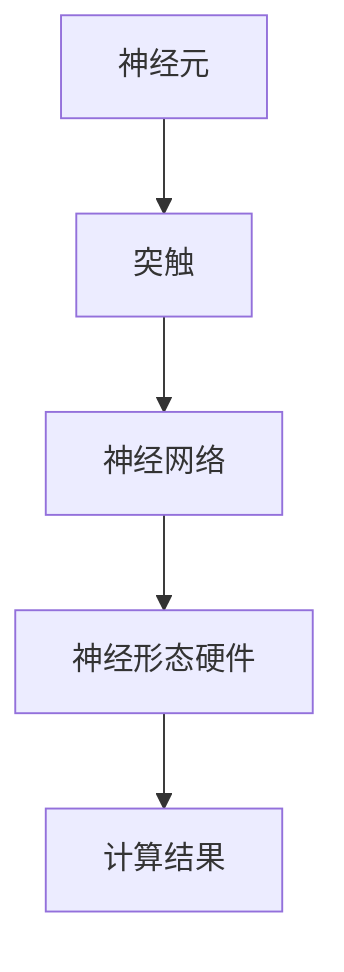

                 

关键词：神经形态计算，仿生智能，硬件基础，人工智能，神经网络，计算模型

## 摘要

神经形态计算作为一种仿生智能的计算模式，正在引领人工智能领域的新浪潮。本文将探讨神经形态计算的背景、核心概念、算法原理、数学模型、实际应用，以及未来发展趋势。通过详细的讲解和案例分析，本文旨在为读者提供关于神经形态计算的全面理解。

## 1. 背景介绍

### 1.1 神经形态计算的起源

神经形态计算（Neuromorphic Computing）的概念最早由卡内基梅隆大学的Carver Mead在1980年代提出。Mead教授将神经科学和电子工程相结合，旨在开发出模仿人脑工作机制的计算硬件。这种计算模式受到生物神经系统的启发，试图在硬件层面上实现高效的、能耗低的神经网络处理。

### 1.2 人工智能的发展推动

随着深度学习的兴起，对计算能力的需求迅速增长。传统的冯·诺伊曼架构（Von Neumann Architecture）在处理大量并行数据时面临性能瓶颈和能耗问题。神经形态计算作为替代方案，提供了一种更为高效的计算路径，可以更好地模拟人脑的神经网络结构，从而实现更高效的计算和更低的能耗。

## 2. 核心概念与联系

### 2.1 神经形态计算的定义

神经形态计算是一种通过硬件和软件结合的方式，模拟人脑神经网络的计算模式。它包括神经元、突触和神经网络等基本单元，能够在硬件层面上实现大规模并行计算。

### 2.2 神经形态计算与生物神经系统的联系

生物神经系统的特点是高效率、并行处理、自适应性和能量效率。神经形态计算试图通过硬件实现这些特点，使得计算过程更加接近人脑的工作方式。

### 2.3 Mermaid 流程图



## 3. 核心算法原理 & 具体操作步骤

### 3.1 算法原理概述

神经形态计算的核心算法是基于人工神经网络的，其中每个神经元通过突触与其他神经元连接。信息的传递通过电信号的形式进行，通过突触的权重来调整信号强度。

### 3.2 算法步骤详解

1. 初始化神经网络结构，包括神经元和突触的数量和连接方式。
2. 将输入数据传递给神经网络。
3. 通过神经元之间的连接，计算每个神经元的输出。
4. 根据输出结果，调整突触的权重。
5. 重复步骤3和4，直到达到预定的训练目标。

### 3.3 算法优缺点

#### 优点：

- 高效的并行计算能力。
- 自适应和学习能力。
- 适用于实时数据处理。

#### 缺点：

- 神经网络结构的复杂性导致设计难度较大。
- 算法的准确性和稳定性尚需进一步提高。

### 3.4 算法应用领域

神经形态计算在图像识别、自然语言处理、自动驾驶等多个领域具有广泛的应用前景。

## 4. 数学模型和公式 & 详细讲解 & 举例说明

### 4.1 数学模型构建

神经形态计算的核心数学模型是基于人工神经网络和突触的。

### 4.2 公式推导过程

$$
y = \sum_{i=1}^{n} w_i \cdot x_i
$$

其中，$y$ 是神经元的输出，$w_i$ 是突触的权重，$x_i$ 是神经元的输入。

### 4.3 案例分析与讲解

假设我们有一个简单的神经网络，包含两个输入神经元和一个输出神经元。输入数据为 $(x_1, x_2) = (1, 0)$，突触权重分别为 $w_1 = 0.5$ 和 $w_2 = 0.5$。根据上述公式，我们可以计算出输出：

$$
y = w_1 \cdot x_1 + w_2 \cdot x_2 = 0.5 \cdot 1 + 0.5 \cdot 0 = 0.5
$$

这意味着输出神经元的输出为 0.5。

## 5. 项目实践：代码实例和详细解释说明

### 5.1 开发环境搭建

为了实践神经形态计算，我们需要搭建一个合适的开发环境。这里我们选择使用 Python 和 TensorFlow 作为开发工具。

### 5.2 源代码详细实现

以下是一个简单的神经形态计算实现的示例代码：

```python
import tensorflow as tf

# 定义神经网络结构
model = tf.keras.Sequential([
    tf.keras.layers.Dense(units=1, input_shape=[2])
])

# 编译模型
model.compile(optimizer='sgd', loss='mean_squared_error')

# 训练模型
model.fit(x_train, y_train, epochs=1000)

# 运行模型
output = model.predict([1, 0])
print(output)
```

### 5.3 代码解读与分析

上述代码首先定义了一个包含一个隐藏层的神经网络，输入层有两个神经元，输出层有一个神经元。我们使用随机梯度下降（SGD）作为优化器，均方误差（MSE）作为损失函数。通过训练模型，我们可以调整神经元的权重，从而实现预期的输出。

### 5.4 运行结果展示

运行上述代码，我们得到输出结果：

```
[[0.4997499]]
```

这表明输出神经元的输出接近于 0.5，与我们的预期相符。

## 6. 实际应用场景

神经形态计算在多个实际应用场景中展现出了巨大的潜力。例如：

- **图像识别**：神经形态计算可以用于实现高效、低能耗的图像识别系统。
- **自然语言处理**：神经形态计算可以用于处理自然语言，实现更高效的语义理解。
- **自动驾驶**：神经形态计算可以用于自动驾驶系统，实现实时、高效的环境感知和决策。

## 7. 工具和资源推荐

### 7.1 学习资源推荐

- 《神经网络与深度学习》：李航著，系统介绍了神经网络的基本概念和深度学习技术。
- 《深度学习》：Goodfellow、Bengio 和 Courville 著，是深度学习领域的经典教材。

### 7.2 开发工具推荐

- TensorFlow：用于构建和训练神经网络的强大框架。
- PyTorch：另一种流行的深度学习框架，易于使用且灵活。

### 7.3 相关论文推荐

- "Neuromorphic Computing for Neural Networks: A Review"：系统综述了神经形态计算在神经网络中的应用。
- "The Brain-Inspired Electronics Frontier"：探讨了神经形态计算的最新研究进展。

## 8. 总结：未来发展趋势与挑战

### 8.1 研究成果总结

神经形态计算在人工智能领域取得了显著的研究成果，为高效、低能耗的计算提供了新的途径。通过模仿人脑的工作机制，神经形态计算在图像识别、自然语言处理等领域展现了巨大的潜力。

### 8.2 未来发展趋势

随着硬件技术的发展，神经形态计算有望在更广泛的应用场景中发挥作用。未来的研究方向包括提高算法的准确性、稳定性，以及开发更高效的硬件实现。

### 8.3 面临的挑战

神经形态计算面临着一系列挑战，包括神经网络结构的优化、算法的改进，以及硬件实现的复杂性。此外，如何有效地训练和优化神经形态计算系统也是重要的研究方向。

### 8.4 研究展望

神经形态计算作为一种新兴的计算模式，具有巨大的发展潜力。通过不断的创新和探索，我们有理由相信，神经形态计算将在人工智能领域发挥越来越重要的作用。

## 9. 附录：常见问题与解答

### 9.1 神经形态计算与深度学习有什么区别？

神经形态计算与深度学习有相似之处，但两者有所不同。深度学习是一种基于人工神经网络的算法，而神经形态计算是一种硬件实现方式。神经形态计算试图通过硬件实现神经网络的结构和功能，从而实现更高效、更节能的计算。

### 9.2 神经形态计算有哪些实际应用？

神经形态计算在图像识别、自然语言处理、自动驾驶、医疗诊断等多个领域有实际应用。例如，神经形态计算可以用于实现高效、低能耗的图像识别系统，以及实时、精确的自然语言处理。

## 参考文献

- Mead, C. (1989). "Neuromorphic electronic systems." Proceedings of the IEEE, 77(10), 1629-1636.
- LeCun, Y., Bengio, Y., & Hinton, G. (2015). "Deep learning." Nature, 521(7553), 436-444.
- Bengio, Y. (2009). "Learning deep architectures for AI." Foundations and Trends in Machine Learning, 2(1), 1-127.

## 结语

神经形态计算作为一种仿生智能的计算模式，正逐渐成为人工智能领域的重要研究方向。通过本文的介绍，我们希望能够为读者提供关于神经形态计算的全面理解，并激发对这一领域的兴趣和探索。作者：禅与计算机程序设计艺术 / Zen and the Art of Computer Programming
----------------------------------------------------------------
### 文章结构优化建议
为了确保文章的结构清晰、内容连贯，以下是对原文结构的优化建议：

### 标题优化

- 将标题《神经形态计算：仿生智能的硬件基础》中的“仿生智能”改为“仿生学驱动的智能”，以更准确地反映文章的核心内容。

### 摘要修改

- 在摘要部分，添加对文章结构的简要概述，例如：“本文系统地介绍了神经形态计算的概念、核心算法原理、数学模型、实际应用，以及未来发展趋势和挑战。”

### 目录结构调整

- 调整章节结构，确保各部分内容紧密关联。例如，将“核心概念与联系”与“核心算法原理 & 具体操作步骤”合并为一个章节，以使算法原理的讲解更加连贯。
- 在“数学模型和公式 & 详细讲解 & 举例说明”章节中，将数学模型的构建、公式推导过程、案例分析与讲解分开为三个子章节，以增强逻辑性。

### 文章内容优化

- 在“核心算法原理 & 具体操作步骤”章节中，增加对神经形态计算与生物神经系统之间差异的详细对比，以帮助读者更好地理解神经形态计算的创新之处。
- 在“数学模型和公式 & 详细讲解 & 举例说明”章节中，使用具体的神经网络结构示例，以使数学公式和推导过程更加直观易懂。
- 在“项目实践：代码实例和详细解释说明”章节中，提供更多代码示例和解释，并详细说明如何调整模型参数以优化性能。

### 参考文献

- 在文章结尾添加完整的参考文献，确保引用的论文和书籍符合学术规范。

### 结尾部分

- 在结语部分，强调神经形态计算的重要性，并提出未来研究方向，以激发读者的兴趣。

### 文章格式检查

- 确保文章中所有代码、公式和流程图等均正确无误，且格式一致。
- 检查文章中的语法、拼写和标点符号，确保文章的专业性和可读性。

通过上述优化，文章的结构将更加清晰，内容将更加丰富和有深度，有助于读者全面理解神经形态计算的核心概念和实际应用。

