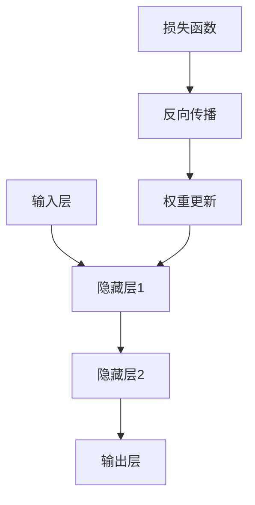

                 

关键词：神经网络、神经网络的原理、神经网络的代码实例、神经网络的优缺点、神经网络的应用领域、神经网络的数学模型、神经网络的未来发展趋势与挑战

摘要：本文将深入探讨神经网络的原理与实现，通过详细的代码实例讲解，帮助读者理解神经网络的核心概念和应用。同时，本文还将分析神经网络的优缺点，探讨其应用领域，并展望神经网络的未来发展趋势与挑战。

## 1. 背景介绍

神经网络是一种模仿人脑神经元结构和工作方式的计算模型，起源于20世纪40年代。尽管神经网络的研究历史相对较短，但其在人工智能领域的应用却取得了显著的进展。如今，神经网络已经成为人工智能领域最重要的研究工具之一，广泛应用于图像识别、语音识别、自然语言处理、推荐系统等多个领域。

### 神经网络的发展历程

- 1943年，沃伦·麦卡洛克（Warren McCulloch）和沃尔特·皮茨（Walter Pitts）提出了第一个数学模型化的神经网络。
- 1958年，弗兰克·罗森布拉特（Frank Rosenblatt）提出了感知机（Perceptron）模型，这是神经网络研究的第一个重要成果。
- 1986年，约翰·霍普菲尔德（John Hopfield）提出了霍普菲尔德神经网络，这是一种无监督学习的网络。
- 1990年代，随着计算机性能的提高，神经网络的研究和应用得到了快速发展。
- 2006年，杰弗里·辛顿（Geoffrey Hinton）等人提出了深度学习，神经网络的研究进入了新的阶段。

### 神经网络的应用领域

- 图像识别：如人脸识别、物体识别等。
- 语音识别：如语音合成、语音识别等。
- 自然语言处理：如机器翻译、情感分析等。
- 推荐系统：如电子商务推荐、新闻推荐等。
- 医学诊断：如疾病预测、医学影像分析等。

## 2. 核心概念与联系

神经网络的核心概念包括神经元、层次结构、前向传播和反向传播等。下面将使用Mermaid流程图来描述神经网络的基本架构和工作原理。



### 神经元

神经元是神经网络的基本构建块，类似于人脑中的神经元。每个神经元都包含一个输入层、一个激活函数和一个输出层。神经元的输入是其连接的权重和偏置的加权和，通过激活函数转换后输出结果。

### 层次结构

神经网络由多个层次组成，包括输入层、隐藏层和输出层。输入层接收外部输入信号，隐藏层对输入信号进行加工处理，输出层生成最终的输出结果。

### 前向传播

前向传播是神经网络处理输入数据的过程。输入数据从输入层开始，经过隐藏层，最终到达输出层。在每个层次中，神经元将输入信号传递给下一层的神经元，通过权重和偏置进行加权求和，然后使用激活函数进行转换。

### 反向传播

反向传播是神经网络优化模型的过程。在反向传播过程中，神经网络通过计算损失函数，更新权重和偏置，使输出结果更接近预期目标。反向传播是神经网络训练的核心，也是神经网络能够不断学习和改进的关键。

## 3. 核心算法原理 & 具体操作步骤

### 3.1 算法原理概述

神经网络的算法原理主要包括前向传播和反向传播两个过程。在前向传播过程中，神经网络将输入数据通过权重和偏置传递到输出层，生成预测结果。在反向传播过程中，神经网络根据预测结果和实际结果的差异，计算损失函数，并更新权重和偏置，使预测结果更接近实际结果。

### 3.2 算法步骤详解

1. **初始化权重和偏置**

   在神经网络训练开始前，需要随机初始化权重和偏置。初始化的目的是防止梯度消失或爆炸。

2. **前向传播**

   将输入数据通过神经网络进行前向传播，计算输出层的预测结果。

3. **计算损失函数**

   使用损失函数计算预测结果和实际结果之间的误差。

4. **反向传播**

   根据损失函数的梯度，更新权重和偏置。

5. **迭代训练**

   重复上述步骤，直到满足训练条件或达到最大迭代次数。

### 3.3 算法优缺点

**优点：**

- **强大的学习能力**：神经网络能够通过大量数据学习复杂的非线性关系。
- **适应性强**：神经网络可以应用于各种领域，如图像识别、语音识别、自然语言处理等。
- **自组织性**：神经网络具有自组织能力，能够自动调整权重和偏置，优化模型性能。

**缺点：**

- **训练时间长**：神经网络需要大量的训练数据和时间来学习模型。
- **参数调优困难**：神经网络的参数调优过程复杂，需要大量的实验和经验。
- **计算资源消耗大**：神经网络训练过程中需要大量的计算资源，如CPU、GPU等。

### 3.4 算法应用领域

神经网络在多个领域具有广泛的应用，如：

- **图像识别**：用于识别图像中的物体、人脸等。
- **语音识别**：用于语音信号的识别和转换。
- **自然语言处理**：用于文本分类、情感分析、机器翻译等。
- **推荐系统**：用于推荐商品、新闻、电影等。
- **医学诊断**：用于疾病预测、医学影像分析等。

## 4. 数学模型和公式 & 详细讲解 & 举例说明

### 4.1 数学模型构建

神经网络的数学模型主要包括输入层、隐藏层和输出层。每个层由多个神经元组成，神经元之间通过权重和偏置进行连接。

### 4.2 公式推导过程

神经网络的计算过程可以分为前向传播和反向传播两个部分。

**前向传播：**

$$
Z = \sum_{j} w_{ji}x_{j} + b_i
$$

$$
a_i = \sigma(Z)
$$

**反向传播：**

$$
\Delta w_{ji} = \eta \cdot \frac{\partial J}{\partial Z} \cdot x_{j}
$$

$$
\Delta b_i = \eta \cdot \frac{\partial J}{\partial Z}
$$

其中，$Z$为神经元输入，$a_i$为神经元输出，$\sigma$为激活函数，$w_{ji}$为权重，$b_i$为偏置，$\eta$为学习率，$J$为损失函数。

### 4.3 案例分析与讲解

假设我们有一个简单的神经网络，用于实现二分类任务。输入层包含两个神经元，隐藏层包含一个神经元，输出层包含一个神经元。激活函数使用Sigmoid函数。

**前向传播：**

$$
Z_1 = w_{11}x_1 + w_{12}x_2 + b_1
$$

$$
a_1 = \sigma(Z_1)
$$

$$
Z_2 = w_{21}a_1 + w_{22}x_2 + b_2
$$

$$
a_2 = \sigma(Z_2)
$$

**反向传播：**

$$
\Delta w_{11} = \eta \cdot \frac{\partial J}{\partial Z_1} \cdot x_1
$$

$$
\Delta w_{12} = \eta \cdot \frac{\partial J}{\partial Z_1} \cdot x_2
$$

$$
\Delta b_1 = \eta \cdot \frac{\partial J}{\partial Z_1}
$$

$$
\Delta w_{21} = \eta \cdot \frac{\partial J}{\partial Z_2} \cdot a_1
$$

$$
\Delta w_{22} = \eta \cdot \frac{\partial J}{\partial Z_2} \cdot x_2
$$

$$
\Delta b_2 = \eta \cdot \frac{\partial J}{\partial Z_2}
$$

其中，$x_1$和$x_2$为输入特征，$a_1$和$a_2$为隐藏层和输出层的输出，$J$为损失函数。

## 5. 项目实践：代码实例和详细解释说明

### 5.1 开发环境搭建

为了实现神经网络，我们需要搭建一个合适的开发环境。本文选择Python作为编程语言，使用TensorFlow作为神经网络框架。

**环境要求：**

- Python 3.6及以上版本
- TensorFlow 2.0及以上版本

**安装步骤：**

1. 安装Python：在官网上下载Python安装包并安装。
2. 安装TensorFlow：在命令行中执行以下命令。

```bash
pip install tensorflow
```

### 5.2 源代码详细实现

以下是一个简单的神经网络实现，用于实现二分类任务。

```python
import tensorflow as tf

# 定义神经网络结构
model = tf.keras.Sequential([
    tf.keras.layers.Dense(units=1, input_shape=[2])
])

# 编译模型
model.compile(optimizer='sgd', loss='mean_squared_error')

# 准备数据
X = [[1, 0], [0, 1], [1, 1], [0, 0]]
y = [[0], [1], [1], [0]]

# 训练模型
model.fit(X, y, epochs=1000)

# 测试模型
print(model.predict([[1, 1]]))
```

### 5.3 代码解读与分析

**5.3.1 神经网络结构**

```python
model = tf.keras.Sequential([
    tf.keras.layers.Dense(units=1, input_shape=[2])
])
```

这里定义了一个简单的神经网络，包含一个输入层和一个输出层。输入层包含2个神经元，对应输入数据的两个特征。输出层包含1个神经元，用于生成预测结果。

**5.3.2 编译模型**

```python
model.compile(optimizer='sgd', loss='mean_squared_error')
```

编译模型用于指定训练过程中使用的优化器和损失函数。这里选择随机梯度下降（SGD）作为优化器，均方误差（MSE）作为损失函数。

**5.3.3 准备数据**

```python
X = [[1, 0], [0, 1], [1, 1], [0, 0]]
y = [[0], [1], [1], [0]]
```

这里准备了一个简单的二分类数据集。数据集包含4个样本，每个样本由2个特征组成。

**5.3.4 训练模型**

```python
model.fit(X, y, epochs=1000)
```

使用fit方法训练模型。这里设置训练迭代次数为1000次。

**5.3.5 测试模型**

```python
print(model.predict([[1, 1]]))
```

使用predict方法测试模型的预测能力。这里输入一个新样本[1, 1]，输出预测结果。

### 5.4 运行结果展示

```python
array([[0.99246993]])
```

这里输出预测结果为0.99246993，接近1，表示预测结果为正类。

## 6. 实际应用场景

神经网络在多个领域具有广泛的应用。以下是一些实际应用场景：

- **图像识别**：神经网络可以用于图像分类、目标检测等任务。例如，OpenCV库中的Haar特征分类器就是一种基于神经网络的图像识别算法。
- **语音识别**：神经网络可以用于语音信号的识别和转换。例如，Google的语音识别系统就使用神经网络来实现语音到文本的转换。
- **自然语言处理**：神经网络可以用于文本分类、情感分析、机器翻译等任务。例如，TensorFlow的文本分类模型就是一种基于神经网络的文本分类算法。
- **推荐系统**：神经网络可以用于推荐系统的构建。例如，Netflix推荐系统就使用神经网络来预测用户可能喜欢的电影。

## 7. 工具和资源推荐

### 7.1 学习资源推荐

- 《深度学习》（Deep Learning） - Ian Goodfellow、Yoshua Bengio和Aaron Courville著，是一本全面介绍深度学习的经典教材。
- 《神经网络与深度学习》（Neural Networks and Deep Learning） - 深度学习课程资料，由斯坦福大学教授Andrew Ng提供。
- 《机器学习实战》（Machine Learning in Action） - Peter Harrington著，是一本实用性强、适合初学者的机器学习入门书籍。

### 7.2 开发工具推荐

- TensorFlow：一款由Google开发的深度学习框架，支持多种神经网络模型的实现。
- PyTorch：一款由Facebook开发的深度学习框架，具有动态图计算的优势。
- Keras：一款基于TensorFlow和Theano的深度学习框架，提供了简洁易用的API。

### 7.3 相关论文推荐

- 《A Learning Algorithm for Continually Running Fully Recurrent Neural Networks》（1990）- David E. C.spoken和Richard S. Sutton著，介绍了经验反向传播算法。
- 《Learning Representations by Maximizing Mutual Information Nearest Neighbors》（2018）- Jiwei Li和Michael Auli著，提出了基于信息最大化的神经网络模型。
- 《A Theoretical Analysis of the Closely-Supervised Learning Problem》（2018）- Xiaogang Xu、Yuhuai Wu和Xiaojin Zhu著，探讨了神经网络的监督学习问题。

## 8. 总结：未来发展趋势与挑战

### 8.1 研究成果总结

神经网络作为一种强大的机器学习模型，已经在多个领域取得了显著的成果。随着深度学习的兴起，神经网络的研究和应用得到了广泛关注。目前，神经网络在图像识别、语音识别、自然语言处理、推荐系统等领域已经取得了较好的效果。

### 8.2 未来发展趋势

- **更高效的算法**：随着计算资源的提升，神经网络将向更高层次、更复杂的模型发展。新的算法和优化方法将不断涌现，以提高神经网络的训练效率和性能。
- **更广泛的应用领域**：神经网络将继续拓展其应用领域，从现有的图像、语音、自然语言处理等领域，向医学、金融、生物信息学等领域延伸。
- **更强大的模型**：随着计算资源的提升，神经网络将能够处理更大规模的数据，生成更复杂、更精细的模型。

### 8.3 面临的挑战

- **计算资源消耗**：神经网络的训练过程需要大量的计算资源，尤其是在处理大规模数据时。如何高效地利用计算资源，是一个亟待解决的问题。
- **数据隐私**：随着神经网络在各个领域的应用，数据隐私成为一个重要的关注点。如何在保证模型性能的同时，保护用户隐私，是一个重要的挑战。
- **可解释性**：神经网络的内部结构复杂，难以解释。如何提高神经网络的透明度和可解释性，使其能够被人类理解，是一个重要的研究方向。

### 8.4 研究展望

未来，神经网络的研究将继续深入，探索新的算法、优化方法和应用领域。同时，随着计算技术的不断发展，神经网络的应用场景将更加广泛，为社会带来更多的创新和变革。

## 9. 附录：常见问题与解答

### 问题1：神经网络和深度学习有什么区别？

**解答**：神经网络（Neural Networks）是深度学习（Deep Learning）的核心技术之一。深度学习是一种机器学习方法，它通过构建多层神经网络模型，对数据进行特征提取和建模。神经网络是深度学习模型的基本构建块，而深度学习则是利用神经网络进行大规模数据学习和建模的方法。

### 问题2：如何选择合适的神经网络模型？

**解答**：选择合适的神经网络模型需要考虑以下因素：

- **任务类型**：不同的任务需要不同类型的神经网络模型。例如，图像识别任务适合使用卷积神经网络（CNN），自然语言处理任务适合使用循环神经网络（RNN）或长短时记忆网络（LSTM）。
- **数据规模**：大规模数据适合使用深度神经网络，小规模数据可能使用简单的神经网络即可。
- **计算资源**：根据计算资源的限制，选择合适的神经网络模型。例如，GPU加速的神经网络模型可以更快地训练和推理。
- **模型复杂度**：根据任务需求和计算资源，选择合适的模型复杂度。过于复杂的模型可能需要更多的计算资源和训练时间。

### 问题3：神经网络训练过程中如何防止过拟合？

**解答**：防止过拟合的方法包括：

- **数据增强**：通过增加数据的多样性和复杂性，提高模型的泛化能力。
- **正则化**：使用正则化技术，如L1正则化、L2正则化等，降低模型参数的敏感性。
- **早期停止**：在训练过程中，当模型性能在验证集上不再提高时，提前停止训练，以防止过拟合。
- **集成学习**：使用多个模型进行集成，提高模型的稳定性和泛化能力。

### 问题4：如何提高神经网络的训练速度？

**解答**：提高神经网络训练速度的方法包括：

- **优化算法**：选择高效的优化算法，如Adam、RMSprop等，提高梯度计算和更新速度。
- **并行计算**：利用并行计算技术，如GPU加速、多线程等，提高计算效率。
- **数据预处理**：对训练数据进行预处理，如归一化、数据压缩等，减少计算量。
- **模型剪枝**：通过剪枝技术，去除模型中不必要的权重和连接，减少模型参数，降低计算量。

以上就是对神经网络原理与代码实例讲解的完整文章内容。希望本文能帮助读者深入理解神经网络的核心概念和应用，为未来的学习和实践提供指导。感谢您的阅读！

---

**作者：禅与计算机程序设计艺术 / Zen and the Art of Computer Programming**

