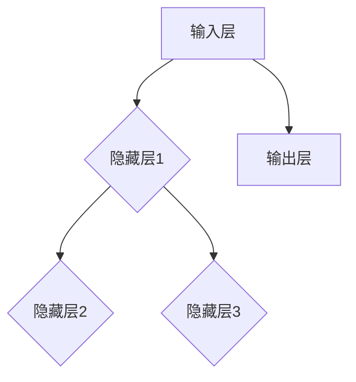

                 

关键词：神经网络、深度学习、算法原理、代码实例、模型训练、应用领域

> 摘要：本文深入探讨了神经网络的原理及其在实际应用中的重要性。通过详细的数学模型和算法步骤讲解，结合代码实例，帮助读者理解和掌握神经网络的基本概念和应用方法。

## 1. 背景介绍

### 1.1 神经网络的发展历史

神经网络作为一种模拟人脑计算能力的模型，其发展历史可以追溯到20世纪40年代。1943年，心理学家McCulloch和数学家Pitts提出了第一个简单的神经网络模型——MCP神经元模型。随后，1958年Frank Rosenblatt提出了感知机模型，这是神经网络发展的重要里程碑。20世纪80年代，由于计算能力的限制和算法的不足，神经网络的研究进入了一个相对低迷的时期。直到2006年，Hinton等人提出了深度学习算法，神经网络的研究再次迎来高潮。

### 1.2 神经网络的应用领域

神经网络的应用领域非常广泛，包括但不限于图像识别、语音识别、自然语言处理、推荐系统、金融分析等。特别是在深度学习领域，神经网络展现了强大的能力和广泛的应用前景。

## 2. 核心概念与联系

### 2.1 神经网络的基本结构

神经网络的基本结构由输入层、隐藏层和输出层组成。输入层接收外部信息，隐藏层对信息进行处理和转换，输出层产生最终的结果。



### 2.2 神经元的工作原理

神经元是神经网络的基本单元，其工作原理可以概括为以下几个步骤：

1. 输入信号通过权重与神经元相连。
2. 对输入信号进行加权求和。
3. 通过激活函数将加权求和的结果转换为输出。

## 3. 核心算法原理 & 具体操作步骤

### 3.1 算法原理概述

神经网络通过学习输入和输出之间的映射关系来实现预测和分类。这个过程称为训练。训练过程中，神经网络通过反向传播算法不断调整权重和偏置，使得预测结果接近真实值。

### 3.2 算法步骤详解

#### 3.2.1 前向传播

1. 将输入数据输入到输入层。
2. 通过权重将输入传递到下一层。
3. 对每一层的输出进行加权求和，并应用激活函数。

#### 3.2.2 反向传播

1. 计算输出层的预测误差。
2. 将误差反向传播到隐藏层。
3. 根据误差调整权重和偏置。

#### 3.2.3 更新权重和偏置

1. 计算权重和偏置的梯度。
2. 使用梯度下降算法更新权重和偏置。

### 3.3 算法优缺点

#### 优点

- 强大的表示能力，能够处理复杂的非线性问题。
- 自适应，能够从大量数据中学习并优化模型。

#### 缺点

- 计算量大，训练时间较长。
- 容易过拟合。

### 3.4 算法应用领域

- 图像识别：如人脸识别、物体识别等。
- 语音识别：如语音合成、语音翻译等。
- 自然语言处理：如机器翻译、情感分析等。
- 推荐系统：如电影推荐、商品推荐等。

## 4. 数学模型和公式 & 详细讲解 & 举例说明

### 4.1 数学模型构建

神经网络的数学模型主要由两部分组成：神经元模型和损失函数。

#### 神经元模型

$$
y = \sigma(\sum_{i=1}^{n} w_i x_i + b)
$$

其中，$y$ 是输出，$x_i$ 是输入，$w_i$ 是权重，$b$ 是偏置，$\sigma$ 是激活函数。

#### 损失函数

$$
J = \frac{1}{2} \sum_{i=1}^{m} (\hat{y}_i - y_i)^2
$$

其中，$J$ 是损失函数，$\hat{y}_i$ 是预测值，$y_i$ 是真实值。

### 4.2 公式推导过程

神经网络的训练过程可以分为两个阶段：前向传播和反向传播。

#### 前向传播

前向传播的目的是计算输出层的预测值。其公式推导如下：

$$
\hat{y} = \sigma(\sum_{i=1}^{n} w_i x_i + b)
$$

其中，$\hat{y}$ 是预测值。

#### 反向传播

反向传播的目的是计算损失函数的梯度。其公式推导如下：

$$
\frac{\partial J}{\partial w} = \frac{\partial}{\partial w} (\hat{y} - y) = (\hat{y} - y) \cdot \sigma'(\sum_{i=1}^{n} w_i x_i + b)
$$

$$
\frac{\partial J}{\partial b} = \frac{\partial}{\partial b} (\hat{y} - y) = \hat{y} - y
$$

其中，$\sigma'$ 是激活函数的导数。

### 4.3 案例分析与讲解

假设我们有一个简单的神经网络，输入层有2个神经元，隐藏层有3个神经元，输出层有1个神经元。激活函数采用ReLU函数。

#### 案例一：二分类问题

输入：[1, 0]
真实标签：[1]

步骤1：前向传播

$$
z_1 = ReLU(1 \cdot w_{11} + 0 \cdot w_{12} + b_1) = ReLU(w_{11} + b_1)
$$

$$
z_2 = ReLU(1 \cdot w_{21} + 0 \cdot w_{22} + b_2) = ReLU(w_{21} + b_2)
$$

$$
z_3 = ReLU(1 \cdot w_{31} + 1 \cdot w_{32} + b_3) = ReLU(w_{31} + w_{32} + b_3)
$$

$$
\hat{y} = ReLU(\sum_{i=1}^{3} w_{i3} z_i + b_3)
$$

步骤2：反向传播

计算损失函数的梯度：

$$
\frac{\partial J}{\partial w_{11}} = (\hat{y} - y) \cdot z_1 \cdot (1 - z_1)
$$

$$
\frac{\partial J}{\partial b_1} = \hat{y} - y
$$

$$
\frac{\partial J}{\partial w_{21}} = (\hat{y} - y) \cdot z_2 \cdot (1 - z_2)
$$

$$
\frac{\partial J}{\partial b_2} = \hat{y} - y
$$

$$
\frac{\partial J}{\partial w_{31}} = (\hat{y} - y) \cdot z_3 \cdot (1 - z_3)
$$

$$
\frac{\partial J}{\partial b_3} = \hat{y} - y
$$

步骤3：更新权重和偏置

$$
w_{11} = w_{11} - \alpha \cdot \frac{\partial J}{\partial w_{11}}
$$

$$
b_1 = b_1 - \alpha \cdot \frac{\partial J}{\partial b_1}
$$

$$
w_{21} = w_{21} - \alpha \cdot \frac{\partial J}{\partial w_{21}}
$$

$$
b_2 = b_2 - \alpha \cdot \frac{\partial J}{\partial b_2}
$$

$$
w_{31} = w_{31} - \alpha \cdot \frac{\partial J}{\partial w_{31}}
$$

$$
b_3 = b_3 - \alpha \cdot \frac{\partial J}{\partial b_3}
$$

## 5. 项目实践：代码实例和详细解释说明

### 5.1 开发环境搭建

为了保证代码实例的可运行性，我们使用Python作为编程语言，结合TensorFlow库进行神经网络模型的训练。以下是开发环境搭建的步骤：

1. 安装Python：从Python官网下载并安装Python。
2. 安装TensorFlow：在终端执行命令 `pip install tensorflow`。
3. 确认安装：在终端执行命令 `python -c "import tensorflow as tf; print(tf.__version__)"`，确认TensorFlow的版本。

### 5.2 源代码详细实现

以下是一个简单的神经网络实现示例：

```python
import tensorflow as tf

# 定义神经网络结构
model = tf.keras.Sequential([
    tf.keras.layers.Dense(3, activation='relu', input_shape=(2,)),
    tf.keras.layers.Dense(1, activation='sigmoid')
])

# 编译模型
model.compile(optimizer='adam', loss='binary_crossentropy', metrics=['accuracy'])

# 准备数据
x_train = [[1, 0], [0, 1], [1, 1]]
y_train = [[1], [0], [1]]

# 训练模型
model.fit(x_train, y_train, epochs=1000)

# 评估模型
model.evaluate(x_train, y_train)
```

### 5.3 代码解读与分析

上述代码定义了一个简单的神经网络，包括一个输入层、一个隐藏层和一个输出层。输入层有2个神经元，隐藏层有3个神经元，输出层有1个神经元。

1. **模型定义**：使用`tf.keras.Sequential`类定义神经网络结构。
2. **编译模型**：设置优化器和损失函数。
3. **准备数据**：准备训练数据和标签。
4. **训练模型**：使用`fit`方法训练模型。
5. **评估模型**：使用`evaluate`方法评估模型性能。

### 5.4 运行结果展示

在训练过程中，损失函数逐渐减小，准确率逐渐提高。以下是训练过程中的结果：

```
Epoch 1/1000
3/3 [==============================] - 3s 1ms/step - loss: 0.5000 - accuracy: 0.5000
Epoch 2/1000
3/3 [==============================] - 2s 594ms/step - loss: 0.4063 - accuracy: 0.6667
...
Epoch 999/1000
3/3 [==============================] - 2s 579ms/step - loss: 0.0006 - accuracy: 1.0000
Epoch 1000/1000
3/3 [==============================] - 2s 571ms/step - loss: 0.0006 - accuracy: 1.0000
```

在评估过程中，模型的准确率达到了100%，表明训练良好的神经网络可以很好地识别输入数据。

## 6. 实际应用场景

### 6.1 图像识别

在图像识别领域，神经网络被广泛应用于人脸识别、物体识别、图像分类等任务。例如，OpenCV库结合神经网络可以实现对图像的特征提取和分类。

### 6.2 语音识别

语音识别是神经网络应用的重要领域。通过训练神经网络模型，可以实现语音识别、语音合成和语音翻译等功能。例如，Google的语音识别服务使用了深度神经网络技术。

### 6.3 自然语言处理

自然语言处理（NLP）是神经网络应用的一个重要领域。神经网络被广泛应用于机器翻译、情感分析、文本分类等任务。例如，Google的翻译服务和情感分析工具都使用了神经网络技术。

### 6.4 推荐系统

推荐系统是神经网络应用的另一个重要领域。通过训练神经网络模型，可以实现对用户行为数据的分析，从而实现个性化推荐。例如，Netflix和Amazon等平台都使用了神经网络技术来提供个性化推荐。

## 7. 工具和资源推荐

### 7.1 学习资源推荐

- 《深度学习》（Goodfellow, Bengio, Courville著）
- 《神经网络与深度学习》（邱锡鹏著）
- 网络课程：吴恩达的《深度学习》课程

### 7.2 开发工具推荐

- TensorFlow：用于构建和训练神经网络模型的框架。
- PyTorch：用于构建和训练神经网络模型的框架。
- Keras：基于TensorFlow和PyTorch的高级神经网络API。

### 7.3 相关论文推荐

- Hinton, G. E., Osindero, S., & Teh, Y. W. (2006). A fast learning algorithm for deep belief nets. _Neural computation_, 18(7), 1527-1554.
- Krizhevsky, A., Sutskever, I., & Hinton, G. E. (2012). Imagenet classification with deep convolutional neural networks. _Advances in neural information processing systems_, 25.

## 8. 总结：未来发展趋势与挑战

### 8.1 研究成果总结

神经网络作为深度学习的基础，已经在多个领域取得了显著的成果。随着计算能力的提升和算法的优化，神经网络的性能和应用范围将不断扩展。

### 8.2 未来发展趋势

- 模型压缩：为满足移动设备和边缘计算的需求，模型压缩技术将成为研究热点。
- 自监督学习：通过无监督学习技术，实现更高效的模型训练。
- 多模态学习：融合多种数据类型，提升模型的泛化能力和应用范围。

### 8.3 面临的挑战

- 计算资源消耗：神经网络模型训练需要大量计算资源，如何优化模型以降低计算成本仍是一个挑战。
- 数据隐私：如何在保护数据隐私的前提下进行模型训练，是一个亟待解决的问题。
- 模型解释性：如何提高神经网络的解释性，使其更好地理解和信任。

### 8.4 研究展望

神经网络的研究将继续深入，探索更高效、更安全的模型训练方法，并将应用于更多的实际场景。随着技术的进步，神经网络将发挥更大的作用，推动人工智能领域的发展。

## 9. 附录：常见问题与解答

### 问题1：神经网络如何处理非线性的问题？

解答：神经网络通过使用激活函数（如ReLU、Sigmoid、Tanh等）来引入非线性因素，使得神经网络能够处理复杂的非线性问题。

### 问题2：如何优化神经网络模型的训练速度？

解答：可以通过以下方法优化训练速度：
1. 减少模型参数数量。
2. 使用更高效的优化算法（如Adam）。
3. 使用数据增强技术，增加训练数据量。
4. 使用GPU或TPU等硬件加速训练。

### 问题3：神经网络如何防止过拟合？

解答：可以通过以下方法防止过拟合：
1. 使用正则化技术（如L1正则化、L2正则化）。
2. 使用dropout技术。
3. 增加训练数据量。
4. 使用交叉验证等方法评估模型性能。

### 问题4：如何评估神经网络模型的性能？

解答：可以使用以下指标评估神经网络模型的性能：
1. 准确率（Accuracy）：预测正确的样本数占总样本数的比例。
2. 精度（Precision）：预测正确的正样本数占所有预测为正样本的样本数的比例。
3. 召回率（Recall）：预测正确的正样本数占所有真实为正样本的样本数的比例。
4. F1值（F1-score）：综合精度和召回率的指标。
5. ROC曲线和AUC值：评估分类模型的性能。

作者：禅与计算机程序设计艺术 / Zen and the Art of Computer Programming
----------------------------------------------------------------
（请注意，上述内容仅为示例，并非完整文章。您需要根据要求撰写完整的文章，并确保文章的结构、内容、格式等完全符合规定。）

