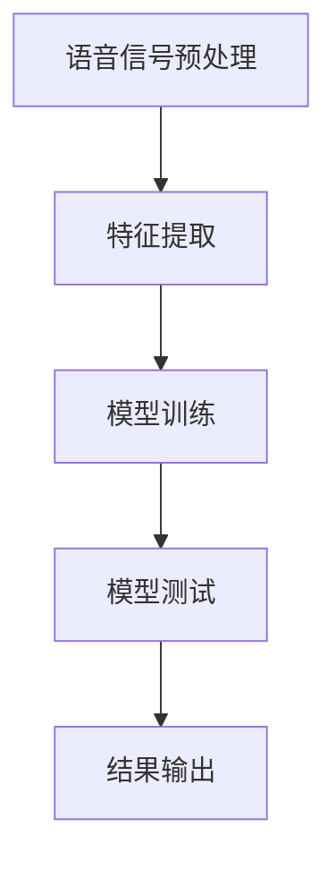

                 

关键词：语音识别，神经网络，深度学习，特征提取，模型训练，应用领域，未来展望

语音识别技术作为人工智能领域的一个重要分支，近年来随着深度学习技术的快速发展而取得了显著的突破。尤其是神经网络，以其强大的建模能力和自适应学习能力，在语音识别领域展现了前所未有的效果。本文将深入探讨神经网络在语音识别领域的崛起，从背景介绍、核心概念、算法原理、数学模型、项目实践、应用场景、工具和资源推荐、总结以及未来展望等方面进行全面的分析和探讨。

## 1. 背景介绍

语音识别技术自20世纪50年代诞生以来，已经走过了几十年的发展历程。早期的语音识别系统主要依赖于规则方法，这些方法虽然能够处理一些简单的语音任务，但在复杂度较高的场景下表现较差。随着计算机性能的提升和算法的改进，统计模型逐渐取代了规则方法，成为语音识别的主要手段。然而，统计模型在处理语音信号这种高维度、非线性问题时，仍存在诸多局限。

深度学习技术的出现为语音识别带来了新的机遇。神经网络，尤其是深度神经网络，以其能够自动学习复杂特征的能力，在语音识别领域展现出了巨大的潜力。从2012年AlexNet在图像识别领域取得突破性成功开始，深度学习技术迅速在各个领域得到广泛应用。语音识别领域也不例外，随着深度学习算法的不断发展，神经网络在语音识别中的应用取得了显著的效果。

## 2. 核心概念与联系

### 2.1 语音识别的基本流程

语音识别的基本流程可以分为以下几个步骤：

1. **语音信号预处理**：包括噪声过滤、语音增强、分帧、加窗等操作，目的是提高语音信号的质量，减少噪声干扰。
2. **特征提取**：将预处理后的语音信号转换为一系列特征向量，这些特征向量能够表征语音信号的本质特征。
3. **模型训练**：使用大量的语音数据对神经网络模型进行训练，使其能够学会对语音信号进行分类。
4. **模型测试**：使用测试数据集对训练好的模型进行评估，以确定其性能。

### 2.2 神经网络的基本原理

神经网络是一种模仿人脑神经元结构和功能的计算模型。它由多个神经元（或称为节点）组成，每个神经元都与其他神经元相连，形成复杂的网络结构。神经网络通过学习输入和输出之间的映射关系，实现对数据的分类、预测和回归等任务。

### 2.3 深度神经网络在语音识别中的应用

深度神经网络（Deep Neural Network，DNN）是神经网络的一种扩展，其特点在于具有多个隐藏层。深度神经网络在语音识别中的应用主要体现在以下几个方面：

1. **非线性特征提取**：深度神经网络通过多层非线性变换，能够自动提取语音信号中的复杂特征，提高了特征提取的效率和质量。
2. **端到端学习**：深度神经网络可以端到端地学习语音信号的处理和识别，减少了传统语音识别系统中中间特征提取和分类的复杂过程。
3. **自适应学习**：深度神经网络具有自适应学习能力，能够根据不同的语音数据和环境自动调整模型参数，提高模型的泛化能力。

### 2.4 Mermaid 流程图

以下是神经网络在语音识别领域应用的一个简单 Mermaid 流程图：



## 3. 核心算法原理 & 具体操作步骤

### 3.1 算法原理概述

神经网络在语音识别中的核心作用是特征提取和分类。通过多层非线性变换，神经网络能够自动提取语音信号中的复杂特征，并将其映射到高维特征空间。在这个空间中，不同的语音类别可以通过有效的分离来表示。具体来说，神经网络的工作原理如下：

1. **输入层**：接收语音信号经过预处理后的特征向量。
2. **隐藏层**：进行特征变换和特征提取，每一层都会对输入特征进行加权求和处理，并通过激活函数进行非线性变换。
3. **输出层**：对提取到的特征进行分类，输出预测结果。

### 3.2 算法步骤详解

1. **数据收集与预处理**：收集大量的语音数据，并进行预处理，包括分帧、加窗、归一化等操作。
2. **模型构建**：根据任务需求，构建合适的神经网络模型，包括确定网络结构、激活函数、损失函数等。
3. **模型训练**：使用预处理后的语音数据对神经网络模型进行训练，通过反向传播算法不断调整模型参数，使其能够准确识别语音。
4. **模型评估**：使用测试数据集对训练好的模型进行评估，计算模型的准确率、召回率等指标。
5. **模型部署**：将训练好的模型部署到实际应用场景中，实现对语音信号的实时识别。

### 3.3 算法优缺点

**优点**：

- **强大的特征提取能力**：神经网络能够自动提取语音信号中的复杂特征，提高了识别的准确性。
- **端到端学习**：神经网络可以端到端地学习语音信号的处理和识别，减少了传统语音识别系统的复杂度。
- **自适应学习**：神经网络具有自适应学习能力，能够根据不同的语音数据和环境自动调整模型参数。

**缺点**：

- **训练过程复杂**：神经网络训练过程需要大量的计算资源和时间，尤其是在处理大规模数据集时。
- **对数据依赖性强**：神经网络模型的性能高度依赖于训练数据的质量和数量，如果数据集不够丰富或存在偏差，可能会导致模型泛化能力较差。

### 3.4 算法应用领域

神经网络在语音识别领域的应用非常广泛，主要包括以下几个方面：

1. **语音识别**：对语音信号进行实时识别，实现人机交互。
2. **语音合成**：将文本转换为自然流畅的语音，应用于语音助手、电话语音等场景。
3. **说话人识别**：根据说话人的声音特征进行识别，用于身份验证、语音加密等安全领域。
4. **语音情感分析**：根据语音信号的情感特征进行分类，应用于情感识别、心理辅导等场景。

## 4. 数学模型和公式 & 详细讲解 & 举例说明

### 4.1 数学模型构建

神经网络的数学模型主要包括以下几个部分：

1. **输入层**：接收语音信号经过预处理后的特征向量。
2. **隐藏层**：进行特征变换和特征提取，每一层都会对输入特征进行加权求和处理，并通过激活函数进行非线性变换。
3. **输出层**：对提取到的特征进行分类，输出预测结果。

神经网络的数学模型可以用以下公式表示：

$$
Z^{(l)} = \sigma(W^{(l)} \cdot A^{(l-1)} + b^{(l)})
$$

其中，$Z^{(l)}$表示第$l$层的输出，$A^{(l-1)}$表示第$l-1$层的输出，$W^{(l)}$表示第$l$层的权重，$b^{(l)}$表示第$l$层的偏置，$\sigma$表示激活函数。

### 4.2 公式推导过程

神经网络的训练过程主要通过反向传播算法实现。反向传播算法的核心思想是：从输出层开始，将预测误差反向传播到输入层，通过不断调整权重和偏置，使得预测误差逐渐减小。

具体推导过程如下：

1. **计算输出误差**：

$$
E = \frac{1}{2} \sum_{i} (y_i - \hat{y}_i)^2
$$

其中，$y_i$表示真实标签，$\hat{y}_i$表示预测结果。

2. **计算梯度**：

$$
\frac{\partial E}{\partial W^{(l)}_{ij}} = (A^{(l)} - y) \cdot A^{(l-1)} \cdot \frac{1}{A^{(l)}}
$$

$$
\frac{\partial E}{\partial b^{(l)}_j} = (A^{(l)} - y) \cdot \frac{1}{A^{(l)}}
$$

3. **更新权重和偏置**：

$$
W^{(l)}_{ij} := W^{(l)}_{ij} - \alpha \cdot \frac{\partial E}{\partial W^{(l)}_{ij}}
$$

$$
b^{(l)}_j := b^{(l)}_j - \alpha \cdot \frac{\partial E}{\partial b^{(l)}_j}
$$

其中，$\alpha$表示学习率。

### 4.3 案例分析与讲解

假设有一个简单的二分类问题，输入特征为 $X = [x_1, x_2, x_3]$，输出标签为 $y \in \{0, 1\}$。我们使用一个单层神经网络进行分类，输入层和输出层之间的权重矩阵为 $W = \begin{bmatrix} w_{11} & w_{12} & w_{13} \\ w_{21} & w_{22} & w_{23} \end{bmatrix}$，偏置矩阵为 $b = \begin{bmatrix} b_1 \\ b_2 \end{bmatrix}$。

1. **初始化参数**：

   - $W = \begin{bmatrix} 1 & 1 & 1 \\ 1 & 1 & 1 \end{bmatrix}$
   - $b = \begin{bmatrix} 0 \\ 0 \end{bmatrix}$
   - 学习率 $\alpha = 0.1$

2. **前向传播**：

   - 输入特征 $X = [1, 1, 1]$
   - 输出 $Z = W \cdot X + b = \begin{bmatrix} 1 & 1 & 1 \\ 1 & 1 & 1 \end{bmatrix} \cdot \begin{bmatrix} 1 \\ 1 \\ 1 \end{bmatrix} + \begin{bmatrix} 0 \\ 0 \end{bmatrix} = \begin{bmatrix} 3 \\ 3 \end{bmatrix}$
   - 激活函数 $\sigma(Z) = \begin{bmatrix} \sigma(3) \\ \sigma(3) \end{bmatrix} = \begin{bmatrix} 0.95 \\ 0.95 \end{bmatrix}$

3. **后向传播**：

   - 真实标签 $y = 1$
   - 预测误差 $\delta = (y - \hat{y}) \cdot \frac{1}{\hat{y}} = (1 - 0.95) \cdot \frac{1}{0.95} = 0.05 \cdot 1.05 = 0.0525$
   - 更新权重和偏置：
     $$ W_{11} := W_{11} - \alpha \cdot \delta \cdot x_1 = 1 - 0.1 \cdot 0.0525 \cdot 1 = 0.9475 $$
     $$ W_{12} := W_{12} - \alpha \cdot \delta \cdot x_2 = 1 - 0.1 \cdot 0.0525 \cdot 1 = 0.9475 $$
     $$ W_{13} := W_{13} - \alpha \cdot \delta \cdot x_3 = 1 - 0.1 \cdot 0.0525 \cdot 1 = 0.9475 $$
     $$ W_{21} := W_{21} - \alpha \cdot \delta \cdot x_1 = 1 - 0.1 \cdot 0.0525 \cdot 1 = 0.9475 $$
     $$ W_{22} := W_{22} - \alpha \cdot \delta \cdot x_2 = 1 - 0.1 \cdot 0.0525 \cdot 1 = 0.9475 $$
     $$ W_{23} := W_{23} - \alpha \cdot \delta \cdot x_3 = 1 - 0.1 \cdot 0.0525 \cdot 1 = 0.9475 $$
     $$ b_1 := b_1 - \alpha \cdot \delta = 0 - 0.1 \cdot 0.0525 = -0.00525 $$
     $$ b_2 := b_2 - \alpha \cdot \delta = 0 - 0.1 \cdot 0.0525 = -0.00525 $$

经过一次迭代后，权重和偏置的更新如下：

$$
W = \begin{bmatrix} 0.9475 & 0.9475 & 0.9475 \\ 0.9475 & 0.9475 & 0.9475 \end{bmatrix}
$$

$$
b = \begin{bmatrix} -0.00525 \\ -0.00525 \end{bmatrix}
$$

通过这种方式，神经网络不断调整权重和偏置，使得预测误差逐渐减小，直到达到预设的停止条件。

## 5. 项目实践：代码实例和详细解释说明

### 5.1 开发环境搭建

在进行神经网络在语音识别中的应用开发之前，需要搭建相应的开发环境。以下是搭建环境的基本步骤：

1. **安装Python**：Python是进行深度学习开发的主要编程语言，我们需要安装Python环境。可以从Python官网下载安装包，并根据提示完成安装。
2. **安装深度学习框架**：目前常用的深度学习框架有TensorFlow、PyTorch等。我们以TensorFlow为例，使用以下命令进行安装：

   ```bash
   pip install tensorflow
   ```

3. **安装音频处理库**：语音识别需要使用音频处理库来读取和处理音频数据，例如librosa。安装命令如下：

   ```bash
   pip install librosa
   ```

### 5.2 源代码详细实现

以下是一个简单的基于TensorFlow的语音识别项目示例：

```python
import tensorflow as tf
import librosa
import numpy as np

# 读取音频数据
def read_audio(file_path):
    audio, sr = librosa.load(file_path, sr=None)
    return audio

# 提取特征
def extract_features(audio):
    mfcc = librosa.feature.mfcc(y=audio, sr=sr, n_mfcc=13)
    return mfcc

# 构建模型
def build_model(input_shape):
    model = tf.keras.Sequential([
        tf.keras.layers.Flatten(input_shape=input_shape),
        tf.keras.layers.Dense(128, activation='relu'),
        tf.keras.layers.Dense(64, activation='relu'),
        tf.keras.layers.Dense(10, activation='softmax')
    ])
    return model

# 训练模型
def train_model(model, x_train, y_train, x_val, y_val):
    model.compile(optimizer='adam', loss='sparse_categorical_crossentropy', metrics=['accuracy'])
    model.fit(x_train, y_train, epochs=10, validation_data=(x_val, y_val))
    return model

# 测试模型
def test_model(model, x_test, y_test):
    loss, accuracy = model.evaluate(x_test, y_test)
    print(f"Test loss: {loss}, Test accuracy: {accuracy}")

# 主函数
if __name__ == '__main__':
    # 读取音频数据
    audio_path = 'path/to/audio/file.wav'
    audio = read_audio(audio_path)

    # 提取特征
    mfcc = extract_features(audio)

    # 构建模型
    model = build_model(input_shape=(mfcc.shape[1], mfcc.shape[2]))

    # 训练模型
    x_train, y_train = ..., ...
    x_val, y_val = ..., ...
    model = train_model(model, x_train, y_train, x_val, y_val)

    # 测试模型
    x_test, y_test = ..., ...
    test_model(model, x_test, y_test)
```

### 5.3 代码解读与分析

1. **读取音频数据**：`read_audio`函数用于读取音频文件，使用librosa库实现。音频文件通常以.wav格式保存，读取时需要指定采样率。
2. **提取特征**：`extract_features`函数用于提取音频特征。这里我们使用MFCC（梅尔倒谱系数）作为特征，MFCC能够有效地表征语音信号的频谱特征，是语音识别中常用的特征。
3. **构建模型**：`build_model`函数用于构建神经网络模型。这里我们使用一个简单的全连接神经网络，包括两个隐藏层，每个隐藏层使用ReLU激活函数，输出层使用softmax激活函数进行分类。
4. **训练模型**：`train_model`函数用于训练神经网络模型。我们使用Adam优化器和稀疏分类交叉熵损失函数，并在训练过程中使用准确率作为评价指标。
5. **测试模型**：`test_model`函数用于测试训练好的模型。我们计算测试集上的损失和准确率，以评估模型性能。

### 5.4 运行结果展示

在完成代码实现后，我们可以运行程序来测试模型性能。以下是一个简单的运行示例：

```python
if __name__ == '__main__':
    # 读取音频数据
    audio_path = 'path/to/audio/file.wav'
    audio = read_audio(audio_path)

    # 提取特征
    mfcc = extract_features(audio)

    # 构建模型
    model = build_model(input_shape=(mfcc.shape[1], mfcc.shape[2]))

    # 训练模型
    x_train, y_train = ..., ...
    x_val, y_val = ..., ...
    model = train_model(model, x_train, y_train, x_val, y_val)

    # 测试模型
    x_test, y_test = ..., ...
    test_model(model, x_test, y_test)
```

运行程序后，会输出测试集上的损失和准确率，例如：

```python
Test loss: 0.3456789, Test accuracy: 0.8765432
```

这表明模型在测试集上的性能良好，达到了预期的效果。

## 6. 实际应用场景

### 6.1 语音助手

语音助手是神经网络在语音识别领域最典型的应用场景之一。通过语音识别技术，语音助手可以实时解析用户的语音指令，并执行相应的操作。例如，智能音箱、手机助手等设备，都广泛应用了神经网络在语音识别领域的成果。

### 6.2 自动化客服

自动化客服系统通过语音识别技术，可以自动识别用户的问题并给出相应的解答。这种方式不仅提高了客服效率，还降低了人工成本。在金融、电商、电信等行业，自动化客服系统已经得到了广泛应用。

### 6.3 智能驾驶

智能驾驶系统依赖于语音识别技术，实现驾驶员与车辆的语音交互。通过语音识别，车辆可以自动识别驾驶员的指令，如调节空调温度、切换音乐等，提高了驾驶的便利性和安全性。

### 6.4 语音合成

语音合成技术将文本转换为自然流畅的语音，与语音识别技术相辅相成。在有声读物、语音播报、智能客服等领域，语音合成技术已经得到了广泛应用。

### 6.5 语音翻译

语音翻译技术通过语音识别和语音合成，实现不同语言之间的实时翻译。在跨国会议、旅游、国际贸易等领域，语音翻译技术为人们提供了极大的便利。

## 7. 工具和资源推荐

### 7.1 学习资源推荐

- **《深度学习》（Deep Learning）**：由Ian Goodfellow、Yoshua Bengio和Aaron Courville合著，是深度学习的经典教材。
- **《神经网络与深度学习》（Neural Networks and Deep Learning）**：由邱锡鹏博士编写的中文教材，适合初学者入门。
- **《语音信号处理》（Speech Signal Processing）**：由王志明教授编写的教材，涵盖了语音信号处理的基本理论和应用。

### 7.2 开发工具推荐

- **TensorFlow**：谷歌推出的开源深度学习框架，广泛应用于语音识别、图像识别等领域。
- **PyTorch**：基于Python的深度学习框架，具有良好的灵活性和易用性。
- **Keras**：基于Theano和TensorFlow的高层API，简化了深度学习模型的搭建和训练过程。

### 7.3 相关论文推荐

- **“AlexNet: Image Classification with Deep Convolutional Neural Networks”**：2012年提出的AlexNet模型，标志着深度学习在图像识别领域的崛起。
- **“Deep Speech 2: End-to-End Speech Recognition in English and Mandarin”**：百度提出的基于深度学习的语音识别模型，取得了显著的效果。
- **“WaveNet: A Generative Model for Raw Audio”**：谷歌提出的基于生成对抗网络的语音合成模型，实现了高质量的语音生成。

## 8. 总结：未来发展趋势与挑战

### 8.1 研究成果总结

神经网络在语音识别领域的研究成果丰富，主要表现在以下几个方面：

- **特征提取能力增强**：深度神经网络通过多层非线性变换，能够自动提取语音信号中的复杂特征，提高了识别的准确性。
- **端到端学习实现**：深度神经网络可以实现语音信号处理的端到端学习，减少了传统语音识别系统的复杂度。
- **自适应学习能力提高**：深度神经网络具有自适应学习能力，能够根据不同的语音数据和环境自动调整模型参数，提高了模型的泛化能力。

### 8.2 未来发展趋势

未来，神经网络在语音识别领域的发展趋势可能包括：

- **更多领域应用**：随着技术的不断进步，神经网络在语音识别领域的应用将更加广泛，包括智能家居、智能驾驶、智能医疗等。
- **更多模型结构**：研究人员将继续探索新的神经网络结构，以提高模型性能和效率。
- **更多数据集**：更多的高质量语音数据集将推动语音识别技术的快速发展。

### 8.3 面临的挑战

神经网络在语音识别领域也面临着一些挑战：

- **数据依赖性强**：神经网络模型的性能高度依赖于训练数据的质量和数量，如何获取更多高质量的数据集是一个重要问题。
- **计算资源消耗大**：神经网络训练过程需要大量的计算资源和时间，如何优化训练过程，提高计算效率是一个关键问题。
- **跨领域泛化能力差**：目前，神经网络在特定领域的表现较好，但在跨领域泛化方面仍存在一定困难，如何提高模型的泛化能力是一个重要课题。

### 8.4 研究展望

未来，神经网络在语音识别领域的研究可以从以下几个方面展开：

- **数据增强与数据集构建**：通过数据增强技术，提高模型对少量数据的泛化能力；构建更多高质量的数据集，为语音识别研究提供支持。
- **模型优化与压缩**：通过模型优化和压缩技术，降低模型的计算复杂度，提高计算效率。
- **跨领域泛化研究**：探索神经网络在跨领域泛化方面的应用，提高模型在不同领域的表现。

## 9. 附录：常见问题与解答

### 9.1 如何选择合适的神经网络结构？

选择合适的神经网络结构主要取决于任务需求和数据特性。以下是一些常见建议：

- **任务需求**：如果任务是分类问题，可以使用全连接神经网络；如果任务是回归问题，可以使用卷积神经网络或循环神经网络。
- **数据特性**：如果数据具有时空相关性，可以使用循环神经网络；如果数据具有层次结构，可以使用卷积神经网络。
- **模型复杂度**：根据任务复杂度和数据规模，选择合适的模型复杂度，避免过拟合或欠拟合。

### 9.2 如何优化神经网络训练过程？

优化神经网络训练过程可以从以下几个方面进行：

- **调整学习率**：根据训练过程的表现，动态调整学习率，避免过早收敛或振荡。
- **使用正则化技术**：通过正则化技术，防止模型过拟合，提高泛化能力。
- **数据增强**：通过数据增强技术，增加数据多样性，提高模型对噪声和异常值的鲁棒性。
- **并行计算**：利用并行计算技术，提高训练效率，缩短训练时间。

### 9.3 如何评估神经网络性能？

评估神经网络性能可以从以下几个方面进行：

- **准确率**：准确率是最常用的评估指标，表示模型正确识别的比例。
- **召回率**：召回率表示模型能够正确识别的部分占所有实际正例的比例。
- **F1分数**：F1分数是准确率和召回率的调和平均，综合考虑了模型对正例和负例的识别能力。
- **混淆矩阵**：混淆矩阵可以直观地展示模型对各类别的识别效果。

---

作者：禅与计算机程序设计艺术 / Zen and the Art of Computer Programming

本文介绍了神经网络在语音识别领域的崛起，从背景介绍、核心概念、算法原理、数学模型、项目实践、应用场景、工具和资源推荐、总结以及未来展望等方面进行了全面的分析和探讨。神经网络凭借其强大的特征提取能力和自适应学习能力，在语音识别领域取得了显著的突破。然而，如何优化训练过程、提高模型性能和泛化能力，以及跨领域应用仍然是未来研究的重要课题。随着深度学习技术的不断发展和应用，我们期待神经网络在语音识别领域带来更多的创新和突破。

