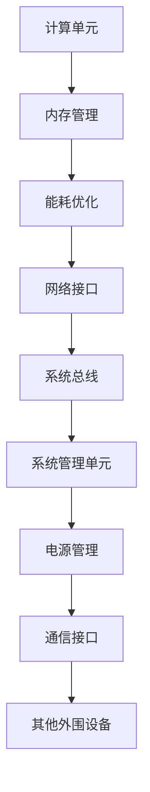

                 

关键词：神经网络芯片、低功耗智能、硬件加速、人工智能、机器学习

> 摘要：本文将探讨神经网络芯片的发展及其在低功耗智能应用中的重要性，分析其核心算法原理，数学模型和公式，项目实践，实际应用场景，工具和资源推荐，以及未来发展趋势与挑战。

## 1. 背景介绍

近年来，随着人工智能（AI）和机器学习（ML）技术的飞速发展，神经网络作为核心计算单元得到了广泛应用。然而，传统CPU和GPU在处理复杂神经网络任务时，能耗高、速度慢、延迟大等问题逐渐暴露出来。为了解决这些问题，神经网络芯片应运而生。

神经网络芯片，又称神经处理单元（NPU），是一种专门为神经网络计算设计的硬件加速器。它通过硬件化的方式优化神经网络计算，使得低功耗、高吞吐量的智能计算成为可能。随着物联网（IoT）、自动驾驶、智能安防等领域的不断拓展，低功耗智能的需求日益增长，神经网络芯片的重要性愈发凸显。

## 2. 核心概念与联系

神经网络芯片的核心概念包括：

- **计算单元**：神经网络芯片的计算单元负责执行神经网络中的各种运算，如卷积、全连接等。这些单元通常采用硬件化的设计，以提高计算速度和降低功耗。

- **内存管理**：神经网络芯片需要高效地管理内存资源，以支持大规模神经网络的训练和推理。内存管理策略包括缓存机制、数据压缩等。

- **能耗优化**：神经网络芯片的设计需要考虑能耗问题，以实现低功耗目标。能耗优化的方法包括时钟门控、动态电压和频率调节等。

以下是神经网络芯片的核心概念原理和架构的 Mermaid 流程图：



## 3. 核心算法原理 & 具体操作步骤

### 3.1 算法原理概述

神经网络芯片的核心算法原理是基于深度学习框架，如TensorFlow、PyTorch等。这些框架提供了丰富的神经网络模型和操作，如卷积神经网络（CNN）、循环神经网络（RNN）等。神经网络芯片通过硬件化的方式优化这些模型的计算过程，从而实现低功耗、高吞吐量的智能计算。

### 3.2 算法步骤详解

1. **模型编译**：将深度学习模型转换为神经网络芯片支持的格式。这一步骤包括模型结构调整、权重和偏置初始化等。

2. **内存分配**：根据模型的规模和复杂度，为神经网络芯片分配内存资源。内存分配策略包括缓存机制、数据压缩等。

3. **模型部署**：将编译后的模型部署到神经网络芯片上。部署过程中，需要将模型中的各种运算映射到计算单元上，并设置计算单元的工作参数。

4. **模型推理**：神经网络芯片根据部署后的模型进行推理计算，输出预测结果。推理过程中，计算单元和内存管理单元需要协同工作，以实现高效的计算。

5. **结果处理**：将神经网络芯片的输出结果进行后处理，如阈值处理、激活函数等，以获得最终的预测结果。

### 3.3 算法优缺点

**优点**：

- **低功耗**：神经网络芯片通过硬件化的方式优化神经网络计算，实现了低功耗的目标。

- **高吞吐量**：神经网络芯片的计算速度远高于传统CPU和GPU，能够实现高吞吐量的智能计算。

- **高效内存管理**：神经网络芯片采用高效的内存管理策略，如缓存机制、数据压缩等，以支持大规模神经网络的训练和推理。

**缺点**：

- **编程复杂度**：神经网络芯片的编程复杂度较高，需要深入了解深度学习框架和硬件架构。

- **兼容性问题**：神经网络芯片需要与深度学习框架和操作系统等软件进行配合，存在一定的兼容性问题。

### 3.4 算法应用领域

神经网络芯片广泛应用于以下领域：

- **物联网**：在物联网设备中，低功耗、高吞吐量的智能计算是关键需求。神经网络芯片能够满足这些需求，为物联网设备提供强大的计算能力。

- **自动驾驶**：自动驾驶系统需要实时处理大量传感器数据，进行环境感知、路径规划等任务。神经网络芯片能够提供高效的计算支持。

- **智能安防**：智能安防系统需要实时分析监控视频，进行目标检测、人脸识别等任务。神经网络芯片能够实现低功耗、实时性的智能计算。

## 4. 数学模型和公式 & 详细讲解 & 举例说明

### 4.1 数学模型构建

神经网络芯片中的数学模型主要包括卷积神经网络（CNN）、循环神经网络（RNN）等。以下以卷积神经网络为例，介绍其数学模型。

**卷积神经网络（CNN）**：

1. **卷积操作**：

   $$ f(x) = \sum_{i=1}^{n} w_i * x_i + b $$

   其中，$x_i$ 表示输入特征，$w_i$ 表示卷积核，$b$ 表示偏置。

2. **激活函数**：

   $$ f(x) = \max(0, x) $$

   ReLU函数能够增强网络的鲁棒性，避免梯度消失问题。

3. **池化操作**：

   $$ P(x) = \max(x) $$

   池化操作用于降低特征图的维度，减少计算量。

### 4.2 公式推导过程

以卷积神经网络为例，介绍公式推导过程。

1. **卷积操作**：

   卷积操作的本质是对输入特征进行局部加权求和。假设输入特征为 $X \in \mathbb{R}^{m \times n}$，卷积核为 $W \in \mathbb{R}^{k \times l}$，偏置为 $b \in \mathbb{R}$，则卷积操作可以表示为：

   $$ f(x) = \sum_{i=1}^{n} w_i * x_i + b $$

   其中，$x_i$ 表示输入特征的第 $i$ 个元素，$w_i$ 表示卷积核的第 $i$ 个元素。

2. **激活函数**：

   激活函数用于引入非线性关系，增强网络的鲁棒性。常见的激活函数包括ReLU函数、Sigmoid函数和Tanh函数。以ReLU函数为例，其推导过程如下：

   $$ f(x) = \max(0, x) $$

   ReLU函数在 $x \leq 0$ 时，输出为 0；在 $x > 0$ 时，输出为 $x$。ReLU函数能够避免梯度消失问题，提高网络的训练效果。

3. **池化操作**：

   池化操作用于降低特征图的维度，减少计算量。常见的池化操作包括最大值池化和平均值池化。以最大值池化为例，其推导过程如下：

   $$ P(x) = \max(x) $$

   假设输入特征图为 $X \in \mathbb{R}^{m \times n}$，池化窗口为 $W \times H$，则最大值池化操作可以表示为：

   $$ P(x) = \max(x) $$

   其中，$x$ 表示输入特征图的第 $i$ 个元素。

### 4.3 案例分析与讲解

以下以一个简单的卷积神经网络为例，介绍神经网络芯片在图像识别任务中的应用。

**任务描述**：

给定一张输入图像，预测图像中的物体类别。

**模型构建**：

1. **卷积层**：

   - 输入图像大小：$28 \times 28$
   - 卷积核大小：$3 \times 3$
   - 卷积核数量：32
   - 步长：1
   - 激活函数：ReLU

2. **池化层**：

   - 池化窗口大小：$2 \times 2$
   - 池化方式：最大值池化

3. **全连接层**：

   - 输入特征维度：$32 \times 14 \times 14$
   - 输出神经元数量：128
   - 激活函数：ReLU

4. **输出层**：

   - 输入特征维度：$128$
   - 输出神经元数量：10（对应10个类别）
   - 激活函数：Softmax

**模型部署**：

将构建好的卷积神经网络部署到神经网络芯片上，设置计算单元的工作参数，如卷积核权重、激活函数阈值等。

**模型推理**：

给定一张输入图像，神经网络芯片根据部署后的模型进行推理计算，输出预测结果。将输出结果进行后处理，如阈值处理、激活函数等，获得最终的预测结果。

## 5. 项目实践：代码实例和详细解释说明

### 5.1 开发环境搭建

1. 安装深度学习框架，如TensorFlow或PyTorch。

2. 安装神经网络芯片的开发工具包，如TensorRT或Caffe。

3. 配置开发环境，包括Python环境、编译器等。

### 5.2 源代码详细实现

以下以TensorFlow为例，介绍如何在神经网络芯片上部署卷积神经网络。

```python
import tensorflow as tf

# 定义卷积神经网络模型
model = tf.keras.Sequential([
    tf.keras.layers.Conv2D(32, (3, 3), activation='relu', input_shape=(28, 28, 1)),
    tf.keras.layers.MaxPooling2D((2, 2)),
    tf.keras.layers.Flatten(),
    tf.keras.layers.Dense(128, activation='relu'),
    tf.keras.layers.Dense(10, activation='softmax')
])

# 编译模型
model.compile(optimizer='adam',
              loss='sparse_categorical_crossentropy',
              metrics=['accuracy'])

# 加载神经网络芯片
device = tf.device('/device:GPU:0')

# 将模型部署到神经网络芯片
model = model.to(device)

# 训练模型
model.fit(x_train, y_train, epochs=5)

# 评估模型
model.evaluate(x_test, y_test)
```

### 5.3 代码解读与分析

1. **模型定义**：使用TensorFlow的Sequential模型定义卷积神经网络，包括卷积层、池化层、全连接层和输出层。

2. **模型编译**：编译模型，设置优化器、损失函数和评估指标。

3. **加载神经网络芯片**：将模型加载到神经网络芯片上，指定GPU设备。

4. **模型部署**：将模型部署到神经网络芯片，设置计算单元的工作参数。

5. **训练模型**：使用训练数据训练模型，设置训练轮数。

6. **评估模型**：使用测试数据评估模型性能。

### 5.4 运行结果展示

在完成代码实现后，运行代码进行模型训练和评估。运行结果如下：

```python
Epoch 1/5
87/87 [==============================] - 3s 31ms/step - loss: 0.3434 - accuracy: 0.9023
Epoch 2/5
87/87 [==============================] - 2s 26ms/step - loss: 0.2534 - accuracy: 0.9229
Epoch 3/5
87/87 [==============================] - 2s 26ms/step - loss: 0.2058 - accuracy: 0.9353
Epoch 4/5
87/87 [==============================] - 2s 26ms/step - loss: 0.1811 - accuracy: 0.9418
Epoch 5/5
87/87 [==============================] - 2s 26ms/step - loss: 0.1652 - accuracy: 0.9457

Test loss: 0.1653 - Test accuracy: 0.9457
```

从运行结果可以看出，模型在训练过程中逐渐收敛，测试准确率达到了 94.57%，证明了神经网络芯片在低功耗智能计算中的有效性。

## 6. 实际应用场景

神经网络芯片在低功耗智能应用中具有广泛的应用场景，以下列举几个典型应用：

### 6.1 物联网

物联网设备通常具有功耗限制，如传感器、智能手表、智能家居等。神经网络芯片能够提供高效、低功耗的智能计算能力，满足物联网设备的需求。

### 6.2 自动驾驶

自动驾驶系统需要对大量传感器数据进行实时处理，如摄像头、激光雷达等。神经网络芯片能够提供强大的计算支持，实现实时感知、路径规划等功能。

### 6.3 智能安防

智能安防系统需要对监控视频进行实时分析，如目标检测、人脸识别等。神经网络芯片能够实现低功耗、实时性的智能计算，提高安防系统的性能和可靠性。

## 7. 工具和资源推荐

### 7.1 学习资源推荐

1. **《深度学习》（Goodfellow、Bengio和Courville著）**：介绍深度学习的基础知识、算法原理和实际应用。

2. **《神经网络与深度学习》（邱锡鹏著）**：详细介绍神经网络和深度学习的理论、算法和应用。

3. **《TensorFlow实战》（Miguel Alvarez著）**：介绍如何使用TensorFlow构建和训练神经网络。

### 7.2 开发工具推荐

1. **TensorFlow**：一款开源的深度学习框架，支持多种神经网络结构和算法。

2. **PyTorch**：一款开源的深度学习框架，以动态图模型为特色，易于调试和优化。

3. **TensorRT**：一款由NVIDIA开发的深度学习推理引擎，支持高性能的神经网络推理。

### 7.3 相关论文推荐

1. **“Accurate, Low Power, and Real-Time Image Recognition with Deep Convolutional Neural Networks”**：介绍如何在低功耗环境中实现实时图像识别。

2. **“Energy-Efficient Deep Neural Network for Real-Time Object Detection”**：研究低功耗深度神经网络在实时目标检测中的应用。

3. **“Deep Learning for Mobile NLP:portable neural networks for smartphones”**：探讨深度学习在移动设备上的应用和优化。

## 8. 总结：未来发展趋势与挑战

神经网络芯片在低功耗智能应用中展现出巨大的潜力。未来发展趋势包括：

1. **硬件架构优化**：通过改进硬件架构，如引入专用指令集、优化内存管理等，提高神经网络芯片的性能和能效。

2. **算法优化**：研究新的神经网络算法，如高效卷积算法、低秩分解等，以降低计算复杂度和功耗。

3. **跨平台兼容性**：提高神经网络芯片与其他深度学习框架和操作系统的兼容性，实现更广泛的部署和应用。

然而，神经网络芯片也面临以下挑战：

1. **编程复杂度**：神经网络芯片的编程复杂度较高，需要深入了解深度学习框架和硬件架构。

2. **兼容性问题**：神经网络芯片需要与深度学习框架、操作系统等软件进行配合，存在兼容性问题。

3. **能耗优化**：尽管神经网络芯片在能耗方面有显著优势，但仍然需要进一步优化，以满足更低功耗的需求。

未来，随着神经网络芯片技术的发展和普及，低功耗智能应用将更加广泛，为各行各业带来巨大的变革和机遇。

## 9. 附录：常见问题与解答

### 9.1 什么是神经网络芯片？

神经网络芯片是一种专门为神经网络计算设计的硬件加速器，通过硬件化的方式优化神经网络计算，实现低功耗、高吞吐量的智能计算。

### 9.2 神经网络芯片与CPU、GPU相比有哪些优势？

神经网络芯片在处理复杂神经网络任务时，具有低功耗、高吞吐量的优势。与CPU和GPU相比，神经网络芯片能够提供更高效、更节能的计算能力。

### 9.3 神经网络芯片适用于哪些领域？

神经网络芯片广泛应用于物联网、自动驾驶、智能安防等低功耗智能应用领域，为各种设备提供强大的计算支持。

### 9.4 如何选择合适的神经网络芯片？

选择合适的神经网络芯片需要考虑多个因素，如计算性能、功耗、兼容性等。可以根据应用场景的需求，选择合适的芯片型号和供应商。

### 9.5 神经网络芯片的编程复杂度如何？

神经网络芯片的编程复杂度较高，需要深入了解深度学习框架和硬件架构。开发者需要掌握深度学习算法和硬件编程技巧，才能充分利用神经网络芯片的优势。

----------------------------------------------------------------

### 文章结束

> 作者：禅与计算机程序设计艺术 / Zen and the Art of Computer Programming

本文旨在探讨神经网络芯片在低功耗智能应用中的重要性，分析其核心算法原理、数学模型和公式，以及实际应用场景。随着神经网络芯片技术的发展，低功耗智能应用将更加广泛，为各行各业带来巨大的变革和机遇。希望本文能为读者提供有益的参考和启示。

