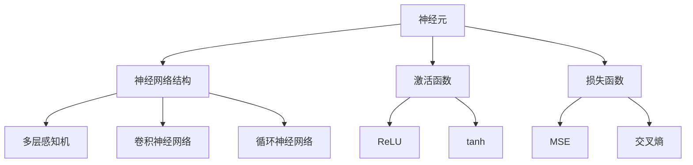

                 

关键词：神经网络、机器学习、人工智能、深度学习、人机交互

摘要：本文探讨了神经网络技术在人工智能领域的重要性，以及如何实现人类与机器的共存。通过分析神经网络的原理、核心算法、数学模型、项目实践以及实际应用场景，本文旨在为读者提供一幅全面的神经网络技术全景图。

## 1. 背景介绍

神经网络，作为一种模仿人脑结构和功能的计算模型，自20世纪80年代以来，一直在人工智能领域发挥着重要作用。随着计算能力的提升和大数据的涌现，深度学习逐渐成为机器学习中的明星技术，而神经网络是其核心技术之一。深度学习通过多层神经网络的结构，能够自动从大量数据中提取特征，从而实现诸如图像识别、语音识别、自然语言处理等复杂任务。

### 1.1 神经网络的发展历程

- **1986年**：Rumelhart, Hinton和Williams提出了反向传播算法（Backpropagation Algorithm），这一算法使多层神经网络的训练成为可能。
- **1990年代**：支持向量机（SVM）和决策树等传统机器学习方法崛起，神经网络的应用场景受到了一定限制。
- **2006年**：Hinton提出了深度信念网络（Deep Belief Network），深度学习开始复苏。
- **2012年**：AlexNet在ImageNet竞赛中取得突破性成绩，深度学习再次引起广泛关注。
- **至今**：深度学习在各种领域取得了显著成果，神经网络已经成为人工智能的核心技术之一。

### 1.2 神经网络的重要性

神经网络作为人工智能的重要组成部分，其重要性体现在以下几个方面：

- **自主学习能力**：神经网络能够从大量数据中自动提取特征，无需人为干预。
- **泛化能力**：神经网络能够将学到的知识应用于新的场景，提高任务的解决能力。
- **并行计算能力**：神经网络可以利用GPU等硬件加速计算，提高处理速度。
- **人机交互**：神经网络能够理解人类的语言和行为，实现更加自然的人机交互。

## 2. 核心概念与联系

神经网络的核心概念包括神经元、神经网络结构、激活函数、损失函数等。下面我们将通过Mermaid流程图来展示这些概念之间的关系。



### 2.1 神经元

神经元是神经网络的基本组成单元，类似于生物神经元的结构和功能。一个简单的神经元可以表示为：

$$
z = w_1 \cdot x_1 + w_2 \cdot x_2 + \ldots + w_n \cdot x_n + b
$$

其中，$w_i$是权重，$x_i$是输入，$b$是偏置。通过激活函数$f$，神经元输出一个实数值：

$$
y = f(z)
$$

### 2.2 神经网络结构

神经网络结构决定了网络的层次和连接方式。常见的神经网络结构包括：

- **多层感知机（MLP）**：包含输入层、隐藏层和输出层。
- **卷积神经网络（CNN）**：特别适用于图像处理，通过卷积层、池化层等结构提取图像特征。
- **循环神经网络（RNN）**：适用于序列数据，通过循环结构保持长期依赖。

### 2.3 激活函数

激活函数用于引入非线性，使得神经网络能够模拟人脑的复杂处理能力。常见的激活函数包括ReLU（Rectified Linear Unit）、tanh（双曲正切函数）等。

### 2.4 损失函数

损失函数用于衡量预测值和真实值之间的差异，是神经网络训练过程中的重要指标。常见的损失函数包括均方误差（MSE）和交叉熵（Cross-Entropy）。

## 3. 核心算法原理 & 具体操作步骤

### 3.1 算法原理概述

神经网络的训练过程实际上是一个优化问题，目标是调整网络的权重和偏置，使得网络的输出尽可能接近真实值。这个过程通常通过反向传播算法（Backpropagation Algorithm）实现。

### 3.2 算法步骤详解

- **初始化权重和偏置**：随机初始化网络的权重和偏置。
- **前向传播**：计算网络输出值，并与真实值进行比较。
- **计算损失**：使用损失函数计算预测值和真实值之间的差异。
- **反向传播**：根据损失函数的梯度，更新网络的权重和偏置。
- **迭代训练**：重复上述步骤，直到满足停止条件（如达到预定准确率或迭代次数）。

### 3.3 算法优缺点

**优点**：

- **自适应能力**：神经网络能够自动从数据中提取特征，无需人为设计特征。
- **泛化能力**：神经网络能够将学到的知识应用于新的场景，具有较好的泛化能力。
- **并行计算**：神经网络可以利用GPU等硬件加速计算，提高训练速度。

**缺点**：

- **过拟合风险**：神经网络可能在新数据上表现不佳，尤其是当网络过于复杂时。
- **计算资源消耗**：深度学习模型的训练需要大量的计算资源和数据。

### 3.4 算法应用领域

神经网络在各个领域都有广泛应用，包括：

- **图像识别**：通过卷积神经网络实现，如人脸识别、物体检测等。
- **语音识别**：通过循环神经网络实现，如语音识别、语音合成等。
- **自然语言处理**：通过循环神经网络和注意力机制实现，如机器翻译、文本分类等。

## 4. 数学模型和公式 & 详细讲解 & 举例说明

### 4.1 数学模型构建

神经网络的基本数学模型可以表示为：

$$
\begin{aligned}
    z^{(l)} &= \sum_{i=1}^{n} w^{(l)}_{ij} \cdot a^{(l-1)}_{i} + b^{(l)} \\
    a^{(l)}_{j} &= f(z^{(l)}_{j})
\end{aligned}
$$

其中，$a^{(l)}$是第$l$层的输出，$w^{(l)}$是第$l$层的权重，$b^{(l)}$是第$l$层的偏置，$f$是激活函数。

### 4.2 公式推导过程

假设我们有一个三层神经网络，其中输入层有$n_1$个神经元，隐藏层有$n_2$个神经元，输出层有$n_3$个神经元。我们要计算输出层的预测值$y$。

首先，计算隐藏层的输出：

$$
z^{(2)}_{j} = \sum_{i=1}^{n_1} w^{(2)}_{ij} \cdot x_{i} + b^{(2)}_{j}
$$

然后，应用激活函数得到隐藏层的输出：

$$
a^{(2)}_{j} = f(z^{(2)}_{j})
$$

接着，计算输出层的输出：

$$
z^{(3)}_{k} = \sum_{j=1}^{n_2} w^{(3)}_{kj} \cdot a^{(2)}_{j} + b^{(3)}_{k}
$$

最后，应用激活函数得到输出层的输出：

$$
y_{k} = f(z^{(3)}_{k})
$$

### 4.3 案例分析与讲解

假设我们要训练一个简单的神经网络，用于分类一个包含100个特征的数据集。网络结构为：输入层（100个神经元）- 隐藏层（50个神经元）- 输出层（10个神经元）。使用ReLU作为激活函数，交叉熵作为损失函数。

首先，初始化网络的权重和偏置，然后进行前向传播，计算输出层的预测值。接着，使用交叉熵计算损失：

$$
J = -\frac{1}{m} \sum_{i=1}^{m} \sum_{k=1}^{10} y_k^{(i)} \cdot \log(y_k^{(i)})
$$

其中，$m$是样本数量，$y_k^{(i)}$是第$i$个样本在第$k$个类别的预测概率。

然后，使用反向传播算法更新网络的权重和偏置：

$$
\begin{aligned}
    \frac{\partial J}{\partial w^{(3)}_{kj}} &= \frac{\partial J}{\partial y_k^{(i)}} \cdot \frac{\partial y_k^{(i)}}{\partial z^{(3)}_{k}} \cdot \frac{\partial z^{(3)}_{k}}{\partial w^{(3)}_{kj}} \\
    \frac{\partial J}{\partial b^{(3)}_{k}} &= \frac{\partial J}{\partial y_k^{(i)}} \cdot \frac{\partial y_k^{(i)}}{\partial z^{(3)}_{k}} \\
    \frac{\partial J}{\partial w^{(2)}_{ij}} &= \frac{\partial J}{\partial a^{(2)}_{j}} \cdot \frac{\partial a^{(2)}_{j}}{\partial z^{(2)}_{j}} \cdot \frac{\partial z^{(2)}_{j}}{\partial w^{(2)}_{ij}} \\
    \frac{\partial J}{\partial b^{(2)}_{j}} &= \frac{\partial J}{\partial a^{(2)}_{j}} \cdot \frac{\partial a^{(2)}_{j}}{\partial z^{(2)}_{j}} \\
\end{aligned}
$$

最后，根据梯度更新网络的权重和偏置：

$$
\begin{aligned}
    w^{(3)}_{kj} &= w^{(3)}_{kj} - \alpha \cdot \frac{\partial J}{\partial w^{(3)}_{kj}} \\
    b^{(3)}_{k} &= b^{(3)}_{k} - \alpha \cdot \frac{\partial J}{\partial b^{(3)}_{k}} \\
    w^{(2)}_{ij} &= w^{(2)}_{ij} - \alpha \cdot \frac{\partial J}{\partial w^{(2)}_{ij}} \\
    b^{(2)}_{j} &= b^{(2)}_{j} - \alpha \cdot \frac{\partial J}{\partial b^{(2)}_{j}} \\
\end{aligned}
$$

其中，$\alpha$是学习率。

## 5. 项目实践：代码实例和详细解释说明

### 5.1 开发环境搭建

我们使用Python语言和TensorFlow框架来实现神经网络。首先，安装Python和TensorFlow：

```
pip install python tensorflow
```

### 5.2 源代码详细实现

下面是一个简单的神经网络实现，用于分类一个二分类问题。

```python
import tensorflow as tf

# 定义神经网络结构
model = tf.keras.Sequential([
    tf.keras.layers.Dense(10, activation='relu', input_shape=(100,)),
    tf.keras.layers.Dense(5, activation='relu'),
    tf.keras.layers.Dense(1, activation='sigmoid')
])

# 编译模型
model.compile(optimizer='adam', loss='binary_crossentropy', metrics=['accuracy'])

# 训练模型
model.fit(x_train, y_train, epochs=10, batch_size=32, validation_data=(x_val, y_val))
```

### 5.3 代码解读与分析

- **定义神经网络结构**：使用`tf.keras.Sequential`创建一个顺序模型，添加了三个全连接层，第一个层有10个神经元，第二个层有5个神经元，最后一个层有1个神经元（用于输出概率）。
- **编译模型**：使用`compile`方法配置模型的优化器、损失函数和评估指标。
- **训练模型**：使用`fit`方法训练模型，其中`x_train`和`y_train`是训练数据，`epochs`是训练迭代次数，`batch_size`是每次训练的数据量。

### 5.4 运行结果展示

训练完成后，可以使用以下代码评估模型在测试集上的表现：

```python
test_loss, test_acc = model.evaluate(x_test, y_test)
print(f"Test accuracy: {test_acc}")
```

## 6. 实际应用场景

神经网络在各个领域都有广泛应用，下面列举几个典型的应用场景：

### 6.1 图像识别

神经网络，特别是卷积神经网络（CNN），在图像识别领域取得了显著成果。例如，Google的Inception网络在ImageNet竞赛中连续多次获得第一名，实现了高精度的图像分类。

### 6.2 语音识别

语音识别是神经网络的另一个重要应用领域。通过循环神经网络（RNN）和卷积神经网络（CNN）的结合，可以实现对语音信号的实时识别和转换。

### 6.3 自然语言处理

神经网络在自然语言处理（NLP）领域也有着广泛的应用。通过循环神经网络（RNN）和Transformer等模型，可以实现机器翻译、文本分类、情感分析等任务。

## 7. 工具和资源推荐

### 7.1 学习资源推荐

- **《深度学习》（Goodfellow, Bengio, Courville著）**：深度学习的经典教材，适合初学者和进阶者。
- **《神经网络与深度学习》（邱锡鹏著）**：系统地介绍了神经网络和深度学习的基本概念和技术。
- **Udacity的《深度学习纳米学位》**：提供了一系列深度学习相关的课程和实践项目。

### 7.2 开发工具推荐

- **TensorFlow**：Google开发的开源深度学习框架，支持多种神经网络结构。
- **PyTorch**：Facebook开发的开源深度学习框架，具有灵活的动态图功能。
- **Keras**：一个基于TensorFlow和Theano的开源深度学习库，提供了简化的神经网络构建和训练接口。

### 7.3 相关论文推荐

- **《A Learning Algorithm for Continually Running Fully Recurrent Neural Networks》（Hochreiter, Schmidhuber，1997）**：介绍了长短期记忆网络（LSTM）。
- **《Deep Learning with Neural Networks: A Textbook》（Goodfellow, Bengio, Courville，2016）**：涵盖了深度学习的各个方面，包括神经网络的基础理论和实践应用。
- **《Convolutional Neural Networks for Visual Recognition》（Krizhevsky, Sutskever, Hinton，2012）**：介绍了卷积神经网络在图像识别中的应用。

## 8. 总结：未来发展趋势与挑战

### 8.1 研究成果总结

神经网络和深度学习在过去几十年取得了显著的成果，推动了人工智能的快速发展。特别是在图像识别、语音识别、自然语言处理等领域，深度学习技术已经超越了传统机器学习方法。

### 8.2 未来发展趋势

- **算法优化**：随着硬件性能的提升和算法的改进，神经网络的训练速度和模型效果将进一步提高。
- **多模态学习**：神经网络将能够同时处理多种类型的数据，如文本、图像、语音等，实现更复杂的人机交互。
- **迁移学习**：通过迁移学习，神经网络将能够利用已有的模型知识，快速适应新的任务，减少训练数据的需求。

### 8.3 面临的挑战

- **计算资源消耗**：深度学习模型通常需要大量的计算资源和数据，这对硬件和存储提出了较高的要求。
- **过拟合风险**：神经网络模型在训练过程中容易过拟合，导致在新数据上表现不佳。
- **数据隐私**：随着神经网络技术的应用，数据隐私保护成为一个重要的问题，需要制定相应的隐私保护策略。

### 8.4 研究展望

未来，神经网络技术将在更多领域得到应用，如医学、金融、智能制造等。同时，随着神经科学的发展，神经网络的理论和模型将不断改进，实现更高层次的人工智能。

## 9. 附录：常见问题与解答

### 9.1 什么是神经网络？

神经网络是一种由大量简单神经元互联而成的计算模型，模仿人脑的结构和功能，用于解决复杂的问题。

### 9.2 深度学习和神经网络有什么区别？

深度学习是一种基于神经网络的机器学习方法，通过多层神经网络的结构，能够自动从大量数据中提取特征。

### 9.3 神经网络如何训练？

神经网络通过反向传播算法训练，目标是最小化损失函数，调整网络的权重和偏置。

### 9.4 神经网络有哪些应用领域？

神经网络广泛应用于图像识别、语音识别、自然语言处理、医学诊断等领域。

### 9.5 如何优化神经网络训练速度？

可以通过使用GPU加速训练、数据预处理、优化算法等方式来提高神经网络训练速度。

---

作者：禅与计算机程序设计艺术 / Zen and the Art of Computer Programming
----------------------------------------------------------------


