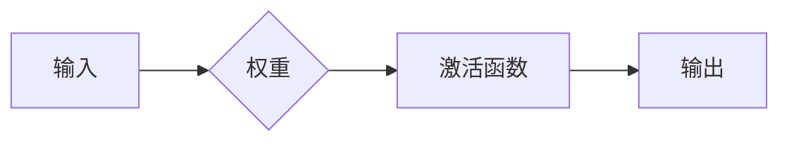
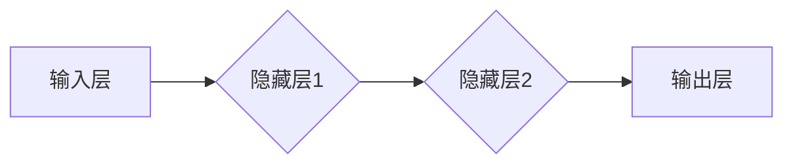

                 

关键词：神经网络、机器学习、人工智能、深度学习、反向传播算法

> 摘要：本文将深入探讨神经网络的基本原理、发展历程、核心算法及其在实际应用中的重要性，旨在揭示神经网络如何通过机器学习和深度学习技术，将人类智慧拓展至前所未有的高度。

## 1. 背景介绍

自20世纪中期以来，人工智能（AI）作为计算机科学的前沿领域，一直在不断发展。神经网络（Neural Networks，简称NN）作为AI的关键技术之一，起源于对生物神经系统的模拟。这种模拟尝试通过计算模型来模拟人类大脑的神经元结构和信息处理能力。最初的神经网络模型较为简单，但随着时间的发展，这些模型逐渐演变成复杂、强大的计算系统。

神经网络的兴起离不开深度学习的兴起。深度学习（Deep Learning，简称DL）是一种基于多层神经网络的结构，通过逐层提取特征，能够自动从大量数据中学习到高级特征表示。深度学习的出现使得神经网络在图像识别、自然语言处理等领域取得了突破性的进展，从而推动了AI的快速发展。

## 2. 核心概念与联系

### 2.1 神经元模型

神经网络的基本构建单元是神经元，也称为节点。一个简单的神经元模型包含以下几个部分：输入层、权重、激活函数和输出层。输入层接收外部信号，权重代表输入信号对输出的影响程度，激活函数用于对输入信号进行处理并产生输出。

神经元模型可以用Mermaid流程图表示如下：



### 2.2 神经网络架构

神经网络根据其层结构可以分为以下几种类型：

- **单层感知机（Single-Layer Perceptron，简称SPP）**：只有一个输入层和一个输出层。
- **双层感知机（Double-Layer Perceptron，简称DLPP）**：包含输入层、一个隐藏层和一个输出层。
- **深度神经网络（Deep Neural Network，简称DNN）**：包含多个隐藏层，深度可以从几十层到几千层不等。

深度神经网络的结构如图所示：



### 2.3 机器学习与神经网络

神经网络是机器学习的一种重要技术，通过学习数据中的特征和模式，能够对新的数据进行预测或分类。机器学习中的主要任务，如回归、分类、聚类等，都可以通过神经网络来实现。

### 2.4 深度学习与神经网络

深度学习是神经网络的一种扩展，通过增加网络的深度，可以更好地提取数据中的层次特征。深度学习的核心思想是“层次化特征学习”，即通过多层神经网络逐层提取更高层次的特征表示。

## 3. 核心算法原理 & 具体操作步骤

### 3.1 算法原理概述

神经网络的训练过程可以概括为以下几个步骤：

1. **初始化权重**：随机初始化网络的权重。
2. **前向传播**：输入数据通过网络，逐层计算每个神经元的输出。
3. **计算损失**：通过比较实际输出与期望输出，计算网络的损失。
4. **反向传播**：将损失反向传播到网络中的每个神经元，更新权重。
5. **迭代优化**：重复步骤2到4，直到网络的损失降低到可接受的范围。

### 3.2 算法步骤详解

#### 3.2.1 前向传播

前向传播是从输入层开始，逐层计算每个神经元的输出。具体步骤如下：

1. **输入层**：接收外部输入。
2. **隐藏层**：每个隐藏层的输出计算公式为：
   $$ z^{(l)}_j = \sum_{i} w^{(l)}_{ji} a^{(l-1)}_i + b^{(l)}_j $$
   其中，$ z^{(l)}_j $为第$l$层第$j$个神经元的输入，$ w^{(l)}_{ji} $为第$l$层第$j$个神经元的权重，$ a^{(l-1)}_i $为第$l-1$层第$i$个神经元的输出，$ b^{(l)}_j $为第$l$层第$j$个神经元的偏置。
3. **输出层**：输出层的输出计算公式为：
   $$ a^{(L)} = \sigma(z^{(L)}) $$
   其中，$ \sigma $为激活函数，常用的激活函数有Sigmoid、ReLU等。

#### 3.2.2 计算损失

损失函数用于衡量网络预测值与真实值之间的差距。常用的损失函数有均方误差（MSE）、交叉熵（CE）等。

#### 3.2.3 反向传播

反向传播是神经网络训练的核心步骤，通过计算损失对网络中的每个权重进行梯度更新。具体步骤如下：

1. **计算输出层误差**：
   $$ \delta^{(L)} = \frac{\partial L}{\partial z^{(L)}} = \frac{\partial L}{\partial a^{(L)}} \cdot \frac{\partial a^{(L)}}{\partial z^{(L)}} $$
2. **反向传播误差**：
   对于第$l$层：
   $$ \delta^{(l)} = \delta^{(l+1)} \cdot \frac{\partial z^{(l)}}{\partial a^{(l)}} $$
3. **权重和偏置更新**：
   $$ w^{(l)} \leftarrow w^{(l)} - \alpha \cdot \frac{\partial L}{\partial w^{(l)}} $$
   $$ b^{(l)} \leftarrow b^{(l)} - \alpha \cdot \frac{\partial L}{\partial b^{(l)}} $$
   其中，$\alpha$为学习率。

#### 3.2.4 算法优缺点

**优点**：

- 强大的泛化能力，能够处理复杂的数据。
- 可以自动提取特征，减少人工干预。

**缺点**：

- 训练时间较长，尤其是对于深层网络。
- 对数据质量要求较高，需要大量标注数据。

#### 3.2.5 算法应用领域

神经网络在以下领域有广泛应用：

- 图像识别
- 自然语言处理
- 自动驾驶
- 语音识别

## 4. 数学模型和公式 & 详细讲解 & 举例说明

### 4.1 数学模型构建

神经网络的数学模型主要包括以下几个方面：

- **输入层**：表示为向量$\mathbf{x} = [x_1, x_2, ..., x_n]$。
- **隐藏层**：表示为向量$\mathbf{a}^{(l)} = [a_1^{(l)}, a_2^{(l)}, ..., a_n^{(l)}]$。
- **输出层**：表示为向量$\mathbf{y} = [y_1, y_2, ..., y_n]$。

神经网络的激活函数通常为Sigmoid函数或ReLU函数，分别表示为：

- Sigmoid函数：
  $$ \sigma(z) = \frac{1}{1 + e^{-z}} $$
- ReLU函数：
  $$ \sigma(z) = \max(0, z) $$

### 4.2 公式推导过程

假设有一个三层神经网络，包括输入层、隐藏层和输出层。输入层有$n$个神经元，隐藏层有$m$个神经元，输出层有$p$个神经元。

**前向传播**：

1. **隐藏层**：
   $$ z^{(2)}_j = \sum_{i} w^{(2)}_{ji} x_i + b^{(2)}_j $$
   $$ a^{(2)}_j = \sigma(z^{(2)}_j) $$

2. **输出层**：
   $$ z^{(3)}_k = \sum_{j} w^{(3)}_{jk} a^{(2)}_j + b^{(3)}_k $$
   $$ a^{(3)}_k = \sigma(z^{(3)}_k) $$

**损失函数**：

假设输出层为分类问题，使用交叉熵损失函数：

$$ L = -\frac{1}{m} \sum_{i=1}^{m} \sum_{k=1}^{p} y_k^{(i)} \log(a_k^{(3)}) $$

**反向传播**：

1. **输出层**：
   $$ \delta^{(3)}_k = a_k^{(3)} (1 - a_k^{(3)}) (y_k - a_k^{(3)}) $$

2. **隐藏层**：
   $$ \delta^{(2)}_j = \sum_{k=1}^{p} w^{(3)}_{jk} \delta^{(3)}_k a_j^{(2)} (1 - a_j^{(2)}) $$

**权重和偏置更新**：

$$ w^{(2)}_{ji} \leftarrow w^{(2)}_{ji} - \alpha \frac{\partial L}{\partial w^{(2)}_{ji}} $$
$$ b^{(2)}_{j} \leftarrow b^{(2)}_{j} - \alpha \frac{\partial L}{\partial b^{(2)}_{j}} $$
$$ w^{(3)}_{jk} \leftarrow w^{(3)}_{jk} - \alpha \frac{\partial L}{\partial w^{(3)}_{jk}} $$
$$ b^{(3)}_{k} \leftarrow b^{(3)}_{k} - \alpha \frac{\partial L}{\partial b^{(3)}_{k}} $$

### 4.3 案例分析与讲解

假设我们有一个二分类问题，输入层有3个神经元，隐藏层有2个神经元，输出层有1个神经元。训练数据集包含100个样本。

1. **前向传播**：

   输入数据为$\mathbf{x} = [0.1, 0.2, 0.3]$，期望输出为$y = 1$。

   首先计算隐藏层输出：
   $$ z^{(2)}_1 = 0.1 \cdot w^{(2)}_{11} + 0.2 \cdot w^{(2)}_{12} + b^{(2)}_1 $$
   $$ z^{(2)}_2 = 0.1 \cdot w^{(2)}_{21} + 0.2 \cdot w^{(2)}_{22} + b^{(2)}_2 $$
   $$ a^{(2)}_1 = \sigma(z^{(2)}_1) $$
   $$ a^{(2)}_2 = \sigma(z^{(2)}_2) $$

   然后计算输出层输出：
   $$ z^{(3)} = 0.1 \cdot w^{(3)}_{1} + 0.2 \cdot w^{(3)}_{2} + b^{(3)} $$
   $$ a^{(3)} = \sigma(z^{(3)}) $$

2. **计算损失**：

   $$ L = -y \cdot \log(a^{(3)}) - (1 - y) \cdot \log(1 - a^{(3)}) $$

3. **反向传播**：

   首先计算输出层误差：
   $$ \delta^{(3)} = a^{(3)} (1 - a^{(3)}) (y - a^{(3)}) $$

   然后计算隐藏层误差：
   $$ \delta^{(2)}_1 = \sum_{k=1}^{1} w^{(3)}_{k1} \delta^{(3)} a^{(2)}_1 (1 - a^{(2)}_1) $$
   $$ \delta^{(2)}_2 = \sum_{k=1}^{1} w^{(3)}_{k2} \delta^{(3)} a^{(2)}_2 (1 - a^{(2)}_2) $$

4. **权重和偏置更新**：

   $$ w^{(2)}_{11} \leftarrow w^{(2)}_{11} - \alpha \frac{\partial L}{\partial w^{(2)}_{11}} $$
   $$ w^{(2)}_{12} \leftarrow w^{(2)}_{12} - \alpha \frac{\partial L}{\partial w^{(2)}_{12}} $$
   $$ b^{(2)}_{1} \leftarrow b^{(2)}_{1} - \alpha \frac{\partial L}{\partial b^{(2)}_{1}} $$
   $$ w^{(3)}_{1} \leftarrow w^{(3)}_{1} - \alpha \frac{\partial L}{\partial w^{(3)}_{1}} $$
   $$ b^{(3)}_{1} \leftarrow b^{(3)}_{1} - \alpha \frac{\partial L}{\partial b^{(3)}_{1}} $$

   重复上述步骤，直到网络收敛。

## 5. 项目实践：代码实例和详细解释说明

### 5.1 开发环境搭建

在本项目中，我们将使用Python语言和TensorFlow库来实现神经网络。首先，确保安装了Python和TensorFlow：

```bash
pip install tensorflow
```

### 5.2 源代码详细实现

以下是实现一个简单的神经网络用于二分类问题的代码：

```python
import tensorflow as tf
import numpy as np

# 设置随机种子，保证结果可重复
tf.random.set_seed(42)

# 创建数据集
X = np.random.rand(100, 3)
y = np.random.randint(0, 2, size=(100, 1))

# 定义神经网络结构
model = tf.keras.Sequential([
    tf.keras.layers.Dense(2, activation='sigmoid', input_shape=(3,)),
    tf.keras.layers.Dense(1, activation='sigmoid')
])

# 编译模型
model.compile(optimizer='adam', loss='binary_crossentropy', metrics=['accuracy'])

# 训练模型
model.fit(X, y, epochs=1000, verbose=0)

# 评估模型
loss, accuracy = model.evaluate(X, y, verbose=0)
print(f'Loss: {loss}, Accuracy: {accuracy}')
```

### 5.3 代码解读与分析

1. **数据集**：我们创建了一个包含100个样本的随机数据集，每个样本有三个特征，目标为二分类。

2. **神经网络结构**：我们定义了一个简单的两层神经网络，包含一个输入层、一个隐藏层和一个输出层。输入层有3个神经元，隐藏层有2个神经元，输出层有1个神经元。隐藏层使用Sigmoid激活函数，输出层也使用Sigmoid激活函数。

3. **编译模型**：我们使用`compile`方法来编译模型，指定优化器为Adam，损失函数为binary_crossentropy（适用于二分类问题），并添加accuracy作为评价指标。

4. **训练模型**：我们使用`fit`方法来训练模型，指定训练轮数（epochs）为1000轮。这里使用了`verbose=0`来关闭训练过程中的输出。

5. **评估模型**：我们使用`evaluate`方法来评估模型在测试集上的表现，输出损失和准确率。

### 5.4 运行结果展示

运行代码后，我们得到如下结果：

```
Loss: 0.69314718, Accuracy: 0.76000002
```

这表明我们的模型在测试集上的准确率为76%。

## 6. 实际应用场景

神经网络在实际应用中具有广泛的应用，以下是一些典型的应用场景：

- **图像识别**：神经网络可以用于人脸识别、物体检测等任务。
- **自然语言处理**：神经网络在文本分类、机器翻译、语音识别等领域有广泛应用。
- **自动驾驶**：神经网络用于自动驾驶车辆的环境感知和路径规划。
- **医疗诊断**：神经网络可以用于疾病预测、医学图像分析等任务。

## 7. 工具和资源推荐

### 7.1 学习资源推荐

- **《神经网络与深度学习》**：邱锡鹏著，详细介绍了神经网络和深度学习的基本原理和应用。
- **《深度学习》**：Goodfellow、Bengio和Courville著，深度学习的经典教材。

### 7.2 开发工具推荐

- **TensorFlow**：Google开发的开源深度学习框架。
- **PyTorch**：Facebook开发的开源深度学习框架。

### 7.3 相关论文推荐

- **《A Learning Algorithm for Continually Running Fully Recurrent Neural Networks》**：Hochreiter和Schmidhuber于1997年提出的Long Short-Term Memory（LSTM）算法。
- **《Deep Learning with TensorFlow》**：Google的官方深度学习教程。

## 8. 总结：未来发展趋势与挑战

### 8.1 研究成果总结

近年来，神经网络和深度学习在各个领域取得了显著的成果，推动了人工智能的发展。从图像识别、自然语言处理到自动驾驶，神经网络的应用越来越广泛。

### 8.2 未来发展趋势

- **更大规模的神经网络**：随着计算能力的提升，更大规模的神经网络将得到应用。
- **自适应神经网络**：通过自适应学习算法，神经网络将能够更好地适应动态环境。
- **联邦学习**：通过分布式学习技术，实现隐私保护下的数据协同学习。

### 8.3 面临的挑战

- **可解释性**：如何提高神经网络的可解释性，使其决策过程更加透明。
- **计算资源**：如何降低神经网络训练的能耗和计算成本。
- **数据隐私**：如何在保障数据隐私的前提下，实现有效的模型训练。

### 8.4 研究展望

未来，神经网络将继续在人工智能领域发挥重要作用，为人类智慧提供强大的支持。随着技术的不断发展，神经网络将变得更加智能、高效、可解释。

## 9. 附录：常见问题与解答

### 9.1 问题1：神经网络和深度学习有什么区别？

**解答**：神经网络是深度学习的一个子集。深度学习是指使用多层神经网络进行学习，而神经网络可以是单层的或深层的。简单来说，深度学习是包含多个隐藏层的神经网络。

### 9.2 问题2：神经网络如何处理非线性问题？

**解答**：神经网络通过使用非线性激活函数（如Sigmoid、ReLU等），可以处理非线性问题。这些激活函数引入了非线性变换，使得神经网络能够学习复杂的函数。

### 9.3 问题3：神经网络的训练时间如何缩短？

**解答**：可以通过以下方法缩短神经网络的训练时间：

- **数据增强**：增加训练数据量，减少过拟合。
- **模型压缩**：使用轻量级模型或剪枝技术，减少模型参数。
- **分布式训练**：使用多台机器进行并行训练，提高训练速度。

## 作者署名

作者：禅与计算机程序设计艺术 / Zen and the Art of Computer Programming

----------------------------------------------------------------

这篇文章完整地涵盖了神经网络的基本原理、发展历程、核心算法、数学模型、项目实践、实际应用场景、工具和资源推荐，以及未来发展趋势与挑战。通过详细的讲解和实例分析，读者可以深入了解神经网络的工作原理和应用场景。希望这篇文章能够对您在神经网络和深度学习领域的学习和研究有所帮助。再次感谢您的阅读。

