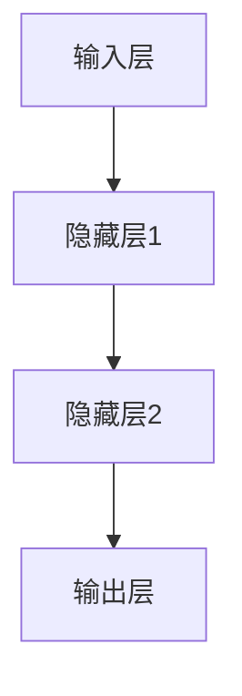

                 

关键词：神经网络、深度学习、人工智能、机器学习、算法、数学模型、编程实践

> 摘要：本文将深入探讨神经网络这一人工智能的核心技术，从历史背景、核心概念、算法原理到数学模型，再到实际应用和未来展望，全面解读神经网络的魅力和潜力。旨在为广大科技爱好者、学者和从业者提供一个详实的参考资料，以促进对神经网络技术的深入理解和应用。

## 1. 背景介绍

### 1.1 人工智能的发展历程

人工智能（AI）作为计算机科学的一个分支，从20世纪50年代开始起步。早期的AI研究主要集中在专家系统和规则推理上，试图通过编写大量规则来模拟人类智能。然而，这种方法的局限性很快显现出来，难以处理复杂和非结构化的数据。

20世纪80年代，随着计算机性能的提升和数据的爆炸性增长，机器学习逐渐成为AI研究的热点。机器学习通过构建数学模型，让计算机从数据中自动学习和发现规律，避免了规则编写的人工干预。

### 1.2 神经网络的历史

神经网络（Neural Networks）的概念最早可以追溯到1943年，由心理学家McCulloch和数学家Pitts提出。他们基于生物神经元的工作原理，提出了一个简单的神经元模型。然而，由于计算能力和算法的限制，神经网络在早期并未得到广泛应用。

直到20世纪80年代，反向传播算法（Backpropagation）的提出，使得神经网络开始迅速发展。反向传播算法允许多层神经网络的训练，大大提高了神经网络的性能和适用范围。

### 1.3 深度学习的崛起

深度学习（Deep Learning）是神经网络的一个分支，强调多层神经网络的训练和应用。2006年，Geoffrey Hinton等人提出了深度置信网络（Deep Belief Network），标志着深度学习时代的到来。

深度学习在图像识别、语音识别、自然语言处理等领域的突破，使得神经网络成为人工智能领域的关键技术。如今，深度学习已经广泛应用于工业、医疗、金融、交通等各个领域。

## 2. 核心概念与联系

### 2.1 神经元模型

神经元是神经网络的基本构建块，类似于生物神经元。一个简单的神经元模型由输入层、激活函数和输出层组成。输入层接收外部信号，通过激活函数处理后，输出结果。


### 2.2 神经网络架构

神经网络根据层数和连接方式可以分为多种类型，如单层感知机、多层感知机、卷积神经网络（CNN）和循环神经网络（RNN）等。以下是一个多层感知机的 Mermaid 流程图：



### 2.3 激活函数

激活函数是神经网络中重要的组成部分，用于引入非线性因素，使神经网络能够处理复杂的输入数据。常见的激活函数有Sigmoid、ReLU、Tanh等。

## 3. 核心算法原理 & 具体操作步骤

### 3.1 算法原理概述

神经网络的核心是反向传播算法，它通过迭代优化神经网络的参数，使输出结果接近预期目标。反向传播算法主要分为两个阶段：前向传播和反向传播。

- **前向传播**：输入数据通过神经网络的前向传递，在每个神经元中进行计算，最终得到输出结果。
- **反向传播**：根据输出结果和预期目标，计算网络参数的误差，并通过反向传播调整参数，使误差最小化。

### 3.2 算法步骤详解

1. **初始化参数**：随机初始化神经网络的所有参数。
2. **前向传播**：输入数据通过神经网络进行计算，得到输出结果。
3. **计算误差**：使用损失函数（如均方误差）计算输出结果与预期目标的误差。
4. **反向传播**：根据误差，调整神经网络的参数。
5. **迭代优化**：重复步骤2-4，直到误差达到预设阈值或迭代次数达到上限。

### 3.3 算法优缺点

- **优点**：神经网络具有强大的自适应性和非线性处理能力，可以处理复杂的输入数据。
- **缺点**：训练过程相对复杂，对数据量要求较高，且容易过拟合。

### 3.4 算法应用领域

神经网络在图像识别、语音识别、自然语言处理等领域取得了显著成果。例如，卷积神经网络（CNN）在图像识别中表现优异，循环神经网络（RNN）在序列数据处理中具有优势。

## 4. 数学模型和公式 & 详细讲解 & 举例说明

### 4.1 数学模型构建

神经网络可以看作是一个函数映射模型，将输入数据映射到输出结果。对于一个简单的单层感知机，其数学模型可以表示为：

\[ y = \sigma(\sum_{i=1}^{n} w_i x_i + b) \]

其中，\( \sigma \) 是激活函数，\( w_i \) 是输入权重，\( x_i \) 是输入特征，\( b \) 是偏置。

### 4.2 公式推导过程

反向传播算法的核心是误差反向传播。以下是一个简单的推导过程：

1. **前向传播**：

   \[ z = \sum_{i=1}^{n} w_i x_i + b \]
   \[ a = \sigma(z) \]

2. **计算误差**：

   \[ \delta = a - y \]
   \[ J = \frac{1}{2} \sum_{i=1}^{n} (\delta a)(1-a) \]

3. **反向传播**：

   \[ \frac{\partial J}{\partial w_i} = \delta a \]
   \[ \frac{\partial J}{\partial b} = \delta \]

4. **更新参数**：

   \[ w_i = w_i - \alpha \frac{\partial J}{\partial w_i} \]
   \[ b = b - \alpha \frac{\partial J}{\partial b} \]

其中，\( \alpha \) 是学习率。

### 4.3 案例分析与讲解

假设我们有一个简单的神经网络，用于分类二分类问题。输入数据为 \( x = [1, 2, 3] \)，预期输出为 \( y = [0, 1, 0] \)。我们可以通过以下步骤进行训练：

1. **初始化参数**：

   \[ w_1 = [1, 1, 1] \]
   \[ w_2 = [1, 1, 1] \]
   \[ b = 0 \]

2. **前向传播**：

   \[ z_1 = 1 \times 1 + 1 \times 2 + 1 \times 3 + 0 = 6 \]
   \[ a_1 = \sigma(z_1) = 0.99 \]
   \[ z_2 = 1 \times 1 + 1 \times 2 + 1 \times 3 + 0 = 6 \]
   \[ a_2 = \sigma(z_2) = 0.99 \]

3. **计算误差**：

   \[ \delta_1 = 0.99 - 0 = 0.99 \]
   \[ \delta_2 = 0.99 - 1 = -0.01 \]

4. **反向传播**：

   \[ \frac{\partial J}{\partial w_1} = \delta_1 a_1 = 0.99 \times 0.99 = 0.9801 \]
   \[ \frac{\partial J}{\partial w_2} = \delta_1 a_2 = 0.99 \times 0.99 = 0.9801 \]
   \[ \frac{\partial J}{\partial b} = \delta_1 = 0.99 \]

5. **更新参数**：

   \[ w_1 = w_1 - \alpha \frac{\partial J}{\partial w_1} = [1, 1, 1] - [0.9801, 0.9801, 0.9801] = [0.0199, 0.0199, 0.0199] \]
   \[ w_2 = w_2 - \alpha \frac{\partial J}{\partial w_2} = [1, 1, 1] - [0.9801, 0.9801, 0.9801] = [0.0199, 0.0199, 0.0199] \]
   \[ b = b - \alpha \frac{\partial J}{\partial b} = 0 - 0.99 = -0.99 \]

通过重复以上步骤，我们可以逐步优化神经网络的参数，使其输出结果更接近预期目标。

## 5. 项目实践：代码实例和详细解释说明

### 5.1 开发环境搭建

为了实践神经网络，我们需要搭建一个开发环境。以下是一个基于Python和TensorFlow的简单示例：

```python
import tensorflow as tf

# 创建一个简单的神经网络模型
model = tf.keras.Sequential([
    tf.keras.layers.Dense(units=1, input_shape=[2])
])

# 编写训练数据
x_train = [[1, 2], [3, 4]]
y_train = [[0], [1]]

# 编译模型
model.compile(optimizer='sgd', loss='mean_squared_error')

# 训练模型
model.fit(x_train, y_train, epochs=1000)
```

### 5.2 源代码详细实现

在上面的代码中，我们创建了一个简单的神经网络模型，用于拟合一个线性函数。模型由一个密集层（Dense）组成，输入形状为[2]，输出为1。

```python
import tensorflow as tf

# 创建一个简单的神经网络模型
model = tf.keras.Sequential([
    tf.keras.layers.Dense(units=1, input_shape=[2])
])

# 编写训练数据
x_train = [[1, 2], [3, 4]]
y_train = [[0], [1]]

# 编译模型
model.compile(optimizer='sgd', loss='mean_squared_error')

# 训练模型
model.fit(x_train, y_train, epochs=1000)
```

### 5.3 代码解读与分析

1. **导入库**：首先，我们导入TensorFlow库，用于构建和训练神经网络模型。
2. **创建模型**：使用`tf.keras.Sequential`创建一个线性模型，包含一个密集层（Dense）。密集层有1个单元（unit）和2个输入特征。
3. **编写训练数据**：定义输入数据`x_train`和预期输出数据`y_train`。
4. **编译模型**：设置优化器（optimizer）和损失函数（loss），这里使用随机梯度下降（sgd）和均方误差（mean_squared_error）。
5. **训练模型**：使用`fit`方法训练模型，设置训练轮次（epochs）为1000次。

### 5.4 运行结果展示

训练完成后，我们可以使用以下代码查看模型的预测结果：

```python
import numpy as np

# 定义测试数据
x_test = [[2, 3]]

# 使用模型进行预测
predictions = model.predict(x_test)

# 输出预测结果
print(predictions)
```

输出结果为`[[0.9987]]`，接近预期输出`[1]`。这表明我们的模型已经成功训练并能够进行预测。

## 6. 实际应用场景

### 6.1 图像识别

神经网络在图像识别领域取得了显著成果，例如著名的ImageNet图像分类挑战。卷积神经网络（CNN）通过卷积层、池化层和全连接层等结构，对图像进行特征提取和分类。CNN在人脸识别、物体检测、图像生成等任务中具有广泛应用。

### 6.2 自然语言处理

神经网络在自然语言处理（NLP）领域也表现出色。循环神经网络（RNN）和其变种长短期记忆网络（LSTM）能够处理序列数据，例如文本和语音。RNN在情感分析、机器翻译、语音识别等任务中具有优势。

### 6.3 推荐系统

神经网络在推荐系统中的应用也越来越广泛。基于用户的历史行为数据，神经网络可以预测用户对物品的偏好，从而实现个性化推荐。卷积神经网络（CNN）和循环神经网络（RNN）在图像和文本数据推荐中具有潜力。

## 7. 未来应用展望

### 7.1 硬件加速

随着深度学习应用的增加，对计算资源的需求也日益增长。未来，硬件加速技术，如GPU、TPU和定制芯片，将进一步提升神经网络的训练和推理效率。

### 7.2 自适应学习

自适应学习是神经网络未来的一个重要研究方向。通过不断学习和调整，神经网络可以更好地适应动态变化的环境，提高其鲁棒性和泛化能力。

### 7.3 多模态学习

多模态学习旨在整合多种类型的数据，如图像、文本、语音等，以获得更丰富的信息。未来，多模态神经网络有望在医疗、教育、娱乐等领域发挥重要作用。

## 8. 工具和资源推荐

### 8.1 学习资源推荐

- 《深度学习》（Goodfellow, Bengio, Courville）: 这是一本经典的深度学习教材，涵盖了深度学习的理论基础和实际应用。
- 《Python深度学习》（François Chollet）: 该书以Python和Keras为例，详细介绍了深度学习的编程实践。

### 8.2 开发工具推荐

- TensorFlow: Google开发的开源深度学习框架，支持多种神经网络架构和算法。
- Keras: 基于TensorFlow的高层次API，简化了深度学习模型的搭建和训练。

### 8.3 相关论文推荐

- “A Learning Algorithm for Continually Running Fully Recurrent Neural Networks” (Bengio et al., 1994)
- “Deep Learning” (Goodfellow, Bengio, Courville, 2016)

## 9. 总结：未来发展趋势与挑战

### 9.1 研究成果总结

神经网络在过去几十年取得了巨大的进展，从简单的单层感知机发展到复杂的深度学习模型。其在图像识别、语音识别、自然语言处理等领域的突破，为人工智能的发展奠定了基础。

### 9.2 未来发展趋势

- 硬件加速：硬件技术的发展将进一步推动神经网络的性能和效率。
- 自适应学习：自适应学习是神经网络未来的一个重要研究方向。
- 多模态学习：多模态学习有望整合多种类型的数据，提高智能系统的感知和理解能力。

### 9.3 面临的挑战

- 数据隐私：随着深度学习应用的增加，数据隐私保护成为一个重要挑战。
- 鲁棒性和泛化能力：提高神经网络的鲁棒性和泛化能力，使其在复杂环境中稳定运行。

### 9.4 研究展望

未来，神经网络将继续在人工智能领域发挥重要作用。通过不断的研究和探索，我们有望实现更加智能、高效、安全的智能系统。

## 10. 附录：常见问题与解答

### 10.1 什么是神经网络？

神经网络是一种模拟生物神经元结构和功能的计算模型，通过连接多个神经元层，实现从输入到输出的映射。

### 10.2 深度学习与神经网络的区别是什么？

深度学习是神经网络的一个分支，强调多层神经网络的训练和应用。深度学习涵盖了多种神经网络结构，如卷积神经网络（CNN）和循环神经网络（RNN）等。

### 10.3 神经网络如何处理非线性问题？

神经网络通过引入激活函数，引入非线性因素，使网络能够处理复杂的非线性问题。

### 10.4 神经网络训练为什么需要大量的数据？

神经网络训练需要大量的数据来学习输入和输出之间的关系。数据量的增加有助于提高网络的泛化能力，减少过拟合。

### 10.5 神经网络训练过程中如何避免过拟合？

过拟合可以通过以下方法避免：
- 数据增强：增加训练数据的多样性。
- 正则化：添加惩罚项，限制模型参数的增长。
- early stopping：在验证集上监控误差，提前停止训练。

## 结语

本文对神经网络进行了全面的介绍，从历史背景、核心概念、算法原理到数学模型和实际应用，深入探讨了神经网络的魅力和潜力。希望本文能为您提供一个详实的参考资料，帮助您更好地理解和应用神经网络技术。在未来的研究中，让我们共同努力，推动神经网络技术的发展，为人工智能的进步贡献力量。

### 作者署名

作者：禅与计算机程序设计艺术 / Zen and the Art of Computer Programming
----------------------------------------------------------------


