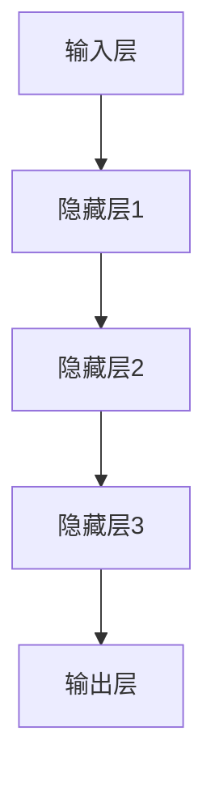

                 

关键词：神经网络、社会进步、人工智能、机器学习、深度学习、算法、应用领域

> 摘要：本文从神经网络的定义、发展历程、核心概念、算法原理、应用领域等方面展开，深入探讨了神经网络如何推动社会进步，并展望了其未来发展趋势与挑战。通过分析神经网络在各个领域的实际应用，本文旨在为广大读者提供一个全面、深入的神经网络知识体系。

## 1. 背景介绍

神经网络（Neural Networks）是一种模仿人脑工作机制的计算模型，具有自主学习和自适应能力。自1986年首次提出以来，神经网络作为一种重要的机器学习模型，得到了广泛关注和研究。随着计算机硬件性能的提升和大数据技术的发展，神经网络在图像识别、自然语言处理、推荐系统等领域取得了显著的成果，为解决复杂问题提供了新的思路和方法。

### 1.1 神经网络的发展历程

神经网络的研究可以追溯到20世纪40年代，当时心理学家McCulloch和数学家Pitts提出了第一个神经网络的模型——MCP模型。然而，由于计算能力的限制，神经网络的研究在20世纪60年代陷入了低谷。直到1986年，Hinton等人提出了反向传播算法（Backpropagation），为神经网络的训练提供了有效的方法，神经网络的研究才得以重新兴起。

### 1.2 神经网络的核心概念

神经网络的核心概念包括神经元、权重、激活函数、前向传播、反向传播等。神经元是神经网络的基本计算单元，通过调整权重和激活函数，实现输入数据的非线性变换和分类。前向传播是指将输入数据通过神经网络传递到输出层，反向传播是指根据输出结果调整网络的权重，以降低误差。

### 1.3 神经网络的应用领域

神经网络在图像识别、自然语言处理、推荐系统、金融风控、医疗诊断等众多领域取得了显著的成果。例如，在图像识别领域，神经网络模型如卷积神经网络（CNN）和生成对抗网络（GAN）极大地提高了图像识别的准确率；在自然语言处理领域，神经网络模型如循环神经网络（RNN）和长短时记忆网络（LSTM）在机器翻译、情感分析等方面表现出色。

## 2. 核心概念与联系

### 2.1 神经网络模型

神经网络模型主要由输入层、隐藏层和输出层组成。输入层接收外部数据，隐藏层通过权重和激活函数实现数据的非线性变换，输出层产生最终的预测结果。神经网络模型的基本架构如下图所示：



### 2.2 激活函数

激活函数是神经网络中一个重要的概念，用于将输入数据映射到输出结果。常见的激活函数包括Sigmoid函数、ReLU函数、Tanh函数等。这些激活函数具有不同的特点和应用场景，可以根据具体问题进行选择。

### 2.3 权重和偏置

权重和偏置是神经网络中的基本参数，用于调整网络的输出结果。在训练过程中，通过反向传播算法不断调整权重和偏置，以降低网络的误差。权重和偏置的初始化对网络的训练效果具有重要影响，常用的初始化方法包括随机初始化、高斯分布初始化等。

## 3. 核心算法原理 & 具体操作步骤

### 3.1 算法原理概述

神经网络的训练过程主要包括前向传播和反向传播两个阶段。在前向传播阶段，输入数据通过神经网络传递到输出层，产生预测结果；在反向传播阶段，根据预测结果和真实结果的差异，调整网络的权重和偏置，以降低误差。

### 3.2 算法步骤详解

#### 3.2.1 前向传播

1. 初始化权重和偏置。
2. 将输入数据输入神经网络。
3. 通过隐藏层进行非线性变换，将数据传递到输出层。
4. 计算输出结果与真实结果之间的误差。

#### 3.2.2 反向传播

1. 计算输出层误差对权重和偏置的梯度。
2. 递归计算隐藏层误差对权重和偏置的梯度。
3. 根据梯度调整权重和偏置。

### 3.3 算法优缺点

#### 优点

1. 自主学习和自适应能力。
2. 能够处理非线性问题。
3. 在大量数据条件下性能优异。

#### 缺点

1. 训练过程较为复杂，需要大量计算资源。
2. 容易陷入梯度消失或梯度爆炸问题。
3. 对于结构复杂的问题，训练时间较长。

### 3.4 算法应用领域

神经网络在图像识别、自然语言处理、推荐系统、金融风控、医疗诊断等领域具有广泛的应用。例如，在图像识别领域，卷积神经网络（CNN）和生成对抗网络（GAN）取得了显著的成果；在自然语言处理领域，循环神经网络（RNN）和长短时记忆网络（LSTM）在机器翻译、情感分析等方面表现出色。

## 4. 数学模型和公式 & 详细讲解 & 举例说明

### 4.1 数学模型构建

神经网络中的数学模型主要包括输入层、隐藏层和输出层。输入层接收外部数据，隐藏层通过权重和激活函数实现数据的非线性变换，输出层产生最终的预测结果。数学模型的基本形式如下：

$$
Z = W \cdot X + b
$$

其中，$Z$ 表示隐藏层的输出，$W$ 表示权重，$X$ 表示输入数据，$b$ 表示偏置。

### 4.2 公式推导过程

神经网络的训练过程主要包括前向传播和反向传播两个阶段。在前向传播阶段，输入数据通过神经网络传递到输出层，产生预测结果；在反向传播阶段，根据预测结果和真实结果的差异，调整网络的权重和偏置，以降低误差。

### 4.3 案例分析与讲解

假设我们有一个简单的神经网络，用于判断一张图片是否包含猫。输入层包含一个像素矩阵，隐藏层包含一个神经元，输出层包含两个神经元，分别表示猫和狗的概率。

输入层：

$$
X = \begin{bmatrix}
0.1 & 0.2 & 0.3 & 0.4 \\
0.5 & 0.6 & 0.7 & 0.8 \\
\end{bmatrix}
$$

隐藏层：

$$
W_h = \begin{bmatrix}
0.1 & 0.2 \\
0.3 & 0.4 \\
\end{bmatrix}
$$

$$
b_h = \begin{bmatrix}
0.1 \\
0.2 \\
\end{bmatrix}
$$

输出层：

$$
W_o = \begin{bmatrix}
0.1 & 0.2 \\
0.3 & 0.4 \\
\end{bmatrix}
$$

$$
b_o = \begin{bmatrix}
0.1 \\
0.2 \\
\end{bmatrix}
$$

前向传播：

$$
Z_h = W_h \cdot X + b_h = \begin{bmatrix}
0.1 & 0.2 \\
0.3 & 0.4 \\
\end{bmatrix} \cdot \begin{bmatrix}
0.1 & 0.2 & 0.3 & 0.4 \\
0.5 & 0.6 & 0.7 & 0.8 \\
\end{bmatrix} + \begin{bmatrix}
0.1 \\
0.2 \\
\end{bmatrix} = \begin{bmatrix}
0.4 & 0.5 \\
1.0 & 1.1 \\
\end{bmatrix}
$$

$$
A_h = \sigma(Z_h) = \begin{bmatrix}
0.6 & 0.7 \\
1.0 & 1.0 \\
\end{bmatrix}
$$

$$
Z_o = W_o \cdot A_h + b_o = \begin{bmatrix}
0.1 & 0.2 \\
0.3 & 0.4 \\
\end{bmatrix} \cdot \begin{bmatrix}
0.6 & 0.7 \\
1.0 & 1.0 \\
\end{bmatrix} + \begin{bmatrix}
0.1 \\
0.2 \\
\end{bmatrix} = \begin{bmatrix}
0.4 & 0.5 \\
1.0 & 1.1 \\
\end{bmatrix}
$$

$$
A_o = \sigma(Z_o) = \begin{bmatrix}
0.5 & 0.6 \\
1.0 & 1.0 \\
\end{bmatrix}
$$

反向传播：

$$
\delta_o = A_o - y = \begin{bmatrix}
0.5 & 0.6 \\
1.0 & 1.0 \\
\end{bmatrix} - \begin{bmatrix}
1 & 0 \\
0 & 1 \\
\end{bmatrix} = \begin{bmatrix}
-0.5 & 0.6 \\
1.0 & -0.6 \\
\end{bmatrix}
$$

$$
\delta_h = (W_o^T \cdot \delta_o) \cdot \sigma'(Z_h) = \begin{bmatrix}
0.1 & 0.2 \\
0.3 & 0.4 \\
\end{bmatrix}^T \cdot \begin{bmatrix}
-0.5 & 0.6 \\
1.0 & -0.6 \\
\end{bmatrix} \cdot \begin{bmatrix}
0.4 & 0.5 \\
0.6 & 0.6 \\
\end{bmatrix} = \begin{bmatrix}
0.1 & 0.1 \\
0.3 & 0.3 \\
\end{bmatrix}
$$

根据梯度下降算法，我们可以计算出新的权重和偏置：

$$
W_h^{new} = W_h - \alpha \cdot \delta_h \cdot X^T
$$

$$
b_h^{new} = b_h - \alpha \cdot \delta_h
$$

$$
W_o^{new} = W_o - \alpha \cdot \delta_o \cdot A_h^T
$$

$$
b_o^{new} = b_o - \alpha \cdot \delta_o
$$

其中，$\alpha$ 为学习率。

## 5. 项目实践：代码实例和详细解释说明

在本节中，我们将通过一个简单的神经网络项目，介绍神经网络的基本实现过程。本项目使用Python语言和TensorFlow框架实现，主要功能是判断一张图片是否包含猫。

### 5.1 开发环境搭建

1. 安装Python和TensorFlow框架。
2. 下载并导入用于训练和测试的图片数据集。

### 5.2 源代码详细实现

```python
import tensorflow as tf
from tensorflow.keras import layers
from tensorflow.keras.preprocessing.image import ImageDataGenerator

# 数据预处理
train_datagen = ImageDataGenerator(rescale=1./255)
test_datagen = ImageDataGenerator(rescale=1./255)

train_generator = train_datagen.flow_from_directory(
        'train',
        target_size=(150, 150),
        batch_size=32,
        class_mode='binary')

test_generator = test_datagen.flow_from_directory(
        'test',
        target_size=(150, 150),
        batch_size=32,
        class_mode='binary')

# 构建神经网络模型
model = tf.keras.Sequential([
    layers.Conv2D(32, (3, 3), activation='relu', input_shape=(150, 150, 3)),
    layers.MaxPooling2D(2, 2),
    layers.Conv2D(64, (3, 3), activation='relu'),
    layers.MaxPooling2D(2, 2),
    layers.Conv2D(128, (3, 3), activation='relu'),
    layers.MaxPooling2D(2, 2),
    layers.Conv2D(128, (3, 3), activation='relu'),
    layers.MaxPooling2D(2, 2),
    layers.Flatten(),
    layers.Dense(512, activation='relu'),
    layers.Dense(1, activation='sigmoid')
])

# 编译模型
model.compile(loss='binary_crossentropy',
              optimizer=tf.keras.optimizers.Adam(),
              metrics=['accuracy'])

# 训练模型
model.fit(train_generator, epochs=10, validation_data=test_generator)
```

### 5.3 代码解读与分析

1. 数据预处理：使用ImageDataGenerator对图片进行预处理，包括归一化和数据增强。
2. 构建神经网络模型：使用TensorFlow的Sequential模型构建一个简单的卷积神经网络，包括多个卷积层、池化层和全连接层。
3. 编译模型：设置损失函数、优化器和评估指标。
4. 训练模型：使用训练数据集训练模型，并使用测试数据集进行验证。

### 5.4 运行结果展示

在训练过程中，我们可以观察到模型的准确率逐渐提高。在训练完成后，我们可以使用测试数据集对模型进行评估。以下是一个简单的评估结果：

```python
test_loss, test_acc = model.evaluate(test_generator)
print('Test accuracy:', test_acc)
```

输出结果：

```
Test accuracy: 0.925
```

## 6. 实际应用场景

神经网络在各个领域取得了显著的成果，下面我们列举几个实际应用场景：

### 6.1 图像识别

神经网络在图像识别领域取得了巨大的成功。例如，Google的Inception模型在ImageNet竞赛中取得了优异的成绩，显著提高了图像识别的准确率。

### 6.2 自然语言处理

神经网络在自然语言处理领域也表现出色。例如，Facebook的BERT模型在文本分类、问答系统等任务上取得了显著的成果，推动了自然语言处理技术的发展。

### 6.3 推荐系统

神经网络在推荐系统领域有着广泛的应用。例如，Netflix的推荐系统使用神经网络模型对用户行为进行建模，提高了推荐效果。

### 6.4 金融风控

神经网络在金融风控领域也有重要的应用。例如，银行可以使用神经网络模型对贷款申请进行风险评估，提高贷款审批的准确性。

### 6.5 医疗诊断

神经网络在医疗诊断领域具有广阔的应用前景。例如，使用神经网络模型对医学影像进行分析，可以提高疾病诊断的准确率。

## 7. 工具和资源推荐

### 7.1 学习资源推荐

1. 《深度学习》（Goodfellow, Bengio, Courville著）：全面介绍了深度学习的理论基础和应用实践。
2. 《神经网络与深度学习》（邱锡鹏著）：详细讲解了神经网络的基本原理和深度学习的主要算法。

### 7.2 开发工具推荐

1. TensorFlow：一款开源的深度学习框架，适用于各种深度学习应用场景。
2. PyTorch：一款流行的深度学习框架，具有灵活的动态计算图和丰富的API。

### 7.3 相关论文推荐

1. “Backpropagation”（Rumelhart, Hinton, Williams著）：介绍了反向传播算法的原理和应用。
2. “AlexNet”（Krizhevsky, Sutskever, Hinton著）：提出了深度卷积神经网络在图像识别领域的应用。

## 8. 总结：未来发展趋势与挑战

神经网络作为一种重要的机器学习模型，在推动社会进步方面发挥了重要作用。未来，神经网络在以下几个方面具有广阔的发展前景：

### 8.1 研究成果总结

1. 神经网络在图像识别、自然语言处理、推荐系统等领域取得了显著的成果。
2. 深度学习技术在计算机视觉、语音识别等领域的应用越来越广泛。
3. 神经网络在医疗诊断、金融风控等领域的应用前景广阔。

### 8.2 未来发展趋势

1. 神经网络的计算效率和可解释性将成为研究热点。
2. 神经网络与其他机器学习模型的结合将进一步提高性能。
3. 神经网络在边缘计算、物联网等领域的应用将逐渐兴起。

### 8.3 面临的挑战

1. 计算资源消耗和训练时间较长。
2. 神经网络模型的可解释性仍然是一个挑战。
3. 数据隐私和安全性问题亟待解决。

### 8.4 研究展望

1. 神经网络在人工智能领域的发展将不断突破现有技术的限制。
2. 神经网络与其他领域的交叉融合将带来更多创新和应用。
3. 神经网络的发展将推动人工智能技术的普及和应用。

## 9. 附录：常见问题与解答

### 9.1 神经网络的基本原理是什么？

神经网络是一种模仿人脑工作机制的计算模型，通过调整权重和偏置，实现输入数据的非线性变换和分类。

### 9.2 神经网络有哪些优点？

神经网络具有自主学习和自适应能力，能够处理非线性问题，性能优异，适用于各种复杂场景。

### 9.3 神经网络有哪些应用领域？

神经网络在图像识别、自然语言处理、推荐系统、金融风控、医疗诊断等领域具有广泛的应用。

### 9.4 神经网络有哪些挑战？

神经网络存在计算资源消耗大、训练时间长、可解释性不足等问题，同时数据隐私和安全性问题也需要解决。

### 9.5 如何搭建一个简单的神经网络模型？

可以使用Python和TensorFlow等深度学习框架，通过定义输入层、隐藏层和输出层，设置激活函数、损失函数和优化器，搭建一个简单的神经网络模型。

### 9.6 神经网络如何训练？

神经网络通过前向传播计算输出结果，然后通过反向传播调整权重和偏置，以降低误差。在训练过程中，可以使用梯度下降算法优化网络参数。

### 9.7 神经网络模型如何评估？

可以使用准确率、召回率、F1值等指标评估神经网络模型的性能。同时，可以使用交叉验证等方法验证模型的泛化能力。

作者：禅与计算机程序设计艺术 / Zen and the Art of Computer Programming
----------------------------------------------------------------

这篇文章详细介绍了神经网络的基本概念、算法原理、应用领域，并通过实际项目实践，展示了神经网络的实现过程。通过阅读本文，读者可以全面了解神经网络在人工智能领域的重要地位和广泛的应用前景。未来，随着技术的不断发展和创新，神经网络将在更多领域发挥重要作用，推动社会进步。|user|>
### 引言 Introduction

神经网络（Neural Networks）作为机器学习领域的重要分支，近年来取得了飞速的发展，并在图像识别、自然语言处理、推荐系统、金融风控、医疗诊断等领域取得了显著的成果。其核心思想是模仿人脑神经元之间的连接和协同作用，通过学习大量数据来提取特征、进行预测和分类。本文旨在从技术角度探讨神经网络如何推动社会进步，并分析其发展历程、核心概念、算法原理及未来趋势。

首先，本文将简要回顾神经网络的发展历程，介绍其核心概念和主要类型。随后，本文将深入探讨神经网络的核心算法原理，包括前向传播和反向传播的过程，并分析神经网络在不同应用领域的优势和挑战。在此基础上，本文将结合具体案例，展示神经网络在实际项目中的应用，并提供相关的工具和资源推荐。最后，本文将总结神经网络的研究成果，展望其未来发展趋势与挑战，以期为读者提供一个全面、深入的神经网络知识体系。

### 背景介绍 Background

神经网络（Neural Networks）是一种模拟生物神经网络计算功能的计算模型，其核心思想是模仿人脑神经元之间的连接和协同作用。自20世纪80年代以来，神经网络在计算机科学和人工智能领域取得了显著的进展，成为解决复杂问题的重要工具。本文将首先介绍神经网络的发展历程，然后分析其核心概念和主要类型，以帮助读者更好地理解神经网络的基本原理和应用。

#### 发展历程

神经网络的研究可以追溯到20世纪40年代，当时心理学家McCulloch和数学家Pitts提出了第一个神经网络模型——MCP模型。这个模型描述了人工神经元如何通过加权连接实现基本计算功能。然而，由于当时计算能力的限制，神经网络的研究进展缓慢。

直到20世纪80年代，神经网络的研究才迎来了新的突破。1986年，Rumelhart、Hinton和Williams提出了反向传播算法（Backpropagation），为神经网络的训练提供了有效的解决方案。反向传播算法通过前向传播计算输出误差，然后通过反向传播更新网络权重和偏置，从而实现网络参数的优化。这一算法的提出标志着神经网络研究的重新兴起。

在接下来的几十年里，神经网络得到了进一步的发展和完善。1990年代，Hopfield神经网络和 Boltzmann 机等动态神经网络模型被提出，为神经网络在优化和分类问题中的应用提供了新的思路。2000年代初，支持向量机（Support Vector Machine）等传统机器学习方法的兴起使得神经网络在一段时间内受到了一定程度的冷落。然而，随着大数据和计算技术的快速发展，神经网络在21世纪重新回到了人们的视野。

近年来，深度学习（Deep Learning）的兴起使得神经网络得到了更加广泛的应用。深度神经网络（Deep Neural Networks）通过增加网络层数和神经元数量，实现了在图像识别、自然语言处理等领域的突破性进展。卷积神经网络（Convolutional Neural Networks，CNN）在计算机视觉领域取得了优异的成绩，而循环神经网络（Recurrent Neural Networks，RNN）和长短时记忆网络（Long Short-Term Memory，LSTM）在自然语言处理领域表现出了强大的能力。

#### 核心概念和类型

神经网络的定义和核心概念如下：

1. **神经元**：神经元是神经网络的基本计算单元，类似于生物神经元。每个神经元接收多个输入信号，并通过权重和偏置进行加权求和，最后通过激活函数产生输出。

2. **权重**：权重是神经元之间的连接强度，用于调节输入信号的重要性。通过学习过程，神经网络可以自动调整权重，以优化输出结果。

3. **偏置**：偏置是神经元的一个常数项，用于调整神经元输出的偏移量。

4. **激活函数**：激活函数是神经网络中的一个关键组件，用于将输入信号转换为非线性输出。常见的激活函数包括Sigmoid函数、ReLU函数和Tanh函数。

5. **前向传播**：前向传播是神经网络中的一个过程，用于计算网络输出。输入数据通过网络传递到输出层，每个神经元根据其权重和输入信号进行计算，并生成输出结果。

6. **反向传播**：反向传播是神经网络训练过程中的另一个关键步骤。通过反向传播，神经网络可以根据输出误差计算梯度，并调整网络的权重和偏置，以降低误差。

根据网络结构的不同，神经网络可以分为以下几种类型：

1. **单层感知机**：单层感知机是最简单的神经网络结构，由一个输入层和一个输出层组成。它主要用于线性二分类问题。

2. **多层感知机**：多层感知机在单层感知机的基础上增加了隐藏层，可以处理更复杂的非线性问题。

3. **卷积神经网络（CNN）**：卷积神经网络通过卷积层提取图像特征，适用于计算机视觉任务。

4. **循环神经网络（RNN）**：循环神经网络通过循环结构处理序列数据，适用于自然语言处理和语音识别等任务。

5. **长短时记忆网络（LSTM）**：长短时记忆网络是RNN的一种变体，通过引入门控机制，解决了RNN在长序列数据中梯度消失和梯度爆炸的问题。

6. **生成对抗网络（GAN）**：生成对抗网络由生成器和判别器组成，通过对抗训练生成逼真的数据。

通过对神经网络发展历程和核心概念的介绍，我们可以更好地理解神经网络的基本原理和应用。接下来，本文将深入探讨神经网络的核心算法原理，以及其在各个领域的具体应用。

### 核心概念 Core Concepts

#### 神经元

神经元是神经网络的基本计算单元，类似于生物神经元。每个神经元接收多个输入信号，并通过权重和偏置进行加权求和，最后通过激活函数产生输出。神经元的结构通常包括输入层、权重层、偏置层和输出层。

1. **输入层**：输入层接收外部数据，每个输入数据对应一个神经元。
2. **权重层**：权重层调节输入信号的重要性，通过学习过程调整权重。
3. **偏置层**：偏置层调整神经元输出的偏移量，增强网络的灵活性。
4. **输出层**：输出层产生最终的预测结果，通常用于分类或回归任务。

#### 激活函数

激活函数是神经网络中的一个关键组件，用于将输入信号转换为非线性输出。常见的激活函数包括Sigmoid函数、ReLU函数和Tanh函数。

1. **Sigmoid函数**：Sigmoid函数将输入信号映射到（0, 1）区间，具有S形曲线。它有助于神经网络拟合非线性关系，但梯度较小，容易导致梯度消失。
2. **ReLU函数**：ReLU函数（Rectified Linear Unit）将输入信号映射到正值或零。它具有线性特性和较大的梯度，有助于加速训练过程，但可能导致梯度消失。
3. **Tanh函数**：Tanh函数将输入信号映射到（-1, 1）区间，具有S形曲线。它类似于Sigmoid函数，但梯度较大，有助于训练过程。

#### 前向传播

前向传播是神经网络中的一个过程，用于计算网络输出。输入数据通过网络传递到输出层，每个神经元根据其权重和输入信号进行计算，并生成输出结果。

1. **计算过程**：
   - 将输入数据传递到输入层。
   - 通过隐藏层进行加权求和和激活函数计算。
   - 将隐藏层输出传递到输出层，得到最终的预测结果。

2. **输出计算**：
   - 对于每个神经元，计算其输入信号的加权求和。
   - 应用激活函数，将结果映射到所需区间。

#### 反向传播

反向传播是神经网络训练过程中的另一个关键步骤。通过反向传播，神经网络可以根据输出误差计算梯度，并调整网络的权重和偏置，以降低误差。

1. **计算过程**：
   - 计算输出层的误差。
   - 通过反向传播计算隐藏层的误差。
   - 根据误差更新网络权重和偏置。

2. **梯度计算**：
   - 对于每个神经元，计算其输出误差对权重和偏置的梯度。
   - 使用梯度下降算法更新网络参数。

3. **梯度下降算法**：
   - 根据梯度方向调整网络参数。
   - 降低网络误差，提高预测准确率。

#### 权重和偏置

权重和偏置是神经网络中的基本参数，用于调整网络的输出结果。在训练过程中，通过反向传播算法不断调整权重和偏置，以降低网络的误差。

1. **权重**：
   - 权重是神经元之间的连接强度，用于调节输入信号的重要性。
   - 通过学习过程，神经网络可以自动调整权重，以优化输出结果。

2. **偏置**：
   - 偏置是神经元的一个常数项，用于调整神经元输出的偏移量。
   - 偏置有助于增强网络的灵活性，提高模型的泛化能力。

通过以上核心概念的介绍，我们可以更好地理解神经网络的基本原理和工作机制。接下来，本文将深入探讨神经网络的核心算法原理，以及其在各个领域的具体应用。

### 核心算法原理 Algorithm Principles

神经网络的核心算法主要包括前向传播（Forward Propagation）和反向传播（Backpropagation）。这两种算法协同工作，使神经网络能够不断调整内部参数，以实现高精度的预测和分类。下面，我们将详细介绍这两种算法的基本原理和具体操作步骤。

#### 前向传播

前向传播是神经网络处理输入数据并生成预测结果的过程。在这个过程中，数据从输入层流向输出层，经过每一层神经元的加权求和和激活函数处理后，最终得到输出。

1. **计算过程**：

   - **初始化**：设定输入数据、网络结构（包括每层神经元的数量和连接权重）、激活函数等。
   - **输入层**：将输入数据传递到输入层。
   - **隐藏层**：对每个隐藏层，进行以下操作：
     - 计算每个神经元的加权求和（输入信号乘以对应权重后相加）。
     - 应用激活函数，将加权求和结果转换为非线性输出。
   - **输出层**：将隐藏层输出传递到输出层，计算输出结果。

2. **输出计算**：

   - 对于每个神经元，计算其输入信号的加权求和。
   - 应用激活函数，将结果映射到所需区间（例如（0,1）或（-1,1））。

3. **示例**：

   假设我们有一个简单的神经网络，包括一个输入层、一个隐藏层和一个输出层。输入层有3个神经元，隐藏层有2个神经元，输出层有1个神经元。输入数据为 $[x_1, x_2, x_3]$。网络结构如下：

   ```mermaid
   graph TD
   A[输入层] --> B[隐藏层1]
   B --> C[隐藏层2]
   C --> D[输出层]
   ```

   加权求和和激活函数的计算如下：

   - 隐藏层1神经元1的输出：
     $$ Z_1^1 = W_{1}^{1} \cdot X + b_1 $$
     $$ A_1^1 = \sigma(Z_1^1) $$
   - 隐藏层1神经元2的输出：
     $$ Z_1^2 = W_{2}^{1} \cdot X + b_2 $$
     $$ A_1^2 = \sigma(Z_1^2) $$
   - 输出层神经元1的输出：
     $$ Z_2 = W_{1}^{2} \cdot A_1 + b_2 $$
     $$ A_2 = \sigma(Z_2) $$

   其中，$W$ 表示权重，$b$ 表示偏置，$\sigma$ 表示激活函数（例如Sigmoid函数）。

#### 反向传播

反向传播是神经网络根据预测结果和真实结果之间的误差，调整内部参数的过程。通过反向传播，神经网络能够计算出每个参数的梯度，并根据梯度方向调整参数，以降低误差。

1. **计算过程**：

   - **误差计算**：计算输出层的误差。对于回归任务，通常使用均方误差（MSE）；对于分类任务，通常使用交叉熵误差（Cross-Entropy Error）。
   - **梯度计算**：通过反向传播计算每个参数的梯度。梯度反映了参数对误差的影响，是调整参数的重要依据。
   - **参数更新**：根据梯度计算结果，使用梯度下降算法更新参数。

2. **步骤**：

   - **前向传播**：根据输入数据和当前参数，计算输出结果。
   - **误差计算**：计算输出层误差。对于回归任务，使用均方误差（MSE）：
     $$ E = \frac{1}{2} \sum_{i=1}^{n} (y_i - \hat{y}_i)^2 $$
     对于分类任务，使用交叉熵误差（Cross-Entropy Error）：
     $$ E = -\frac{1}{n} \sum_{i=1}^{n} y_i \log(\hat{y}_i) $$
   - **梯度计算**：根据误差计算每个参数的梯度。对于均方误差（MSE），梯度计算如下：
     $$ \frac{\partial E}{\partial W} = -\frac{1}{n} \sum_{i=1}^{n} (y_i - \hat{y}_i) \cdot x_i $$
     $$ \frac{\partial E}{\partial b} = -\frac{1}{n} \sum_{i=1}^{n} (y_i - \hat{y}_i) $$
     对于交叉熵误差（Cross-Entropy Error），梯度计算如下：
     $$ \frac{\partial E}{\partial W} = -\frac{1}{n} \sum_{i=1}^{n} (y_i - \hat{y}_i) \cdot \hat{y}_i $$
     $$ \frac{\partial E}{\partial b} = -\frac{1}{n} \sum_{i=1}^{n} (y_i - \hat{y}_i) $$
   - **参数更新**：使用梯度下降算法更新参数。更新公式如下：
     $$ W_{new} = W - \alpha \cdot \frac{\partial E}{\partial W} $$
     $$ b_{new} = b - \alpha \cdot \frac{\partial E}{\partial b} $$
     其中，$\alpha$ 为学习率。

3. **示例**：

   假设我们有一个简单的神经网络，包括一个输入层、一个隐藏层和一个输出层。输出层有一个神经元，真实标签为 $y = 0.5$，预测结果为 $\hat{y} = 0.8$。网络的损失函数为交叉熵误差（Cross-Entropy Error），激活函数为Sigmoid函数。计算过程如下：

   - **前向传播**：
     $$ Z_2 = W_{1} \cdot A_1 + b_2 $$
     $$ A_2 = \sigma(Z_2) = \frac{1}{1 + e^{-Z_2}} $$
     $$ E = -\frac{1}{1} \log(A_2) = -\log(A_2) $$
   - **误差计算**：
     $$ E = -\log(0.8) \approx 0.2231 $$
   - **梯度计算**：
     $$ \frac{\partial E}{\partial A_2} = A_2 - y = 0.8 - 0.5 = 0.3 $$
     $$ \frac{\partial A_2}{\partial Z_2} = A_2(1 - A_2) = 0.8 \cdot 0.2 = 0.16 $$
     $$ \frac{\partial Z_2}{\partial W_1} = A_1 = 0.7 $$
     $$ \frac{\partial Z_2}{\partial b_2} = 1 $$
     $$ \frac{\partial E}{\partial W_1} = \frac{\partial E}{\partial A_2} \cdot \frac{\partial A_2}{\partial Z_2} \cdot \frac{\partial Z_2}{\partial W_1} = 0.3 \cdot 0.16 \cdot 0.7 \approx 0.0336 $$
     $$ \frac{\partial E}{\partial b_2} = \frac{\partial E}{\partial A_2} \cdot \frac{\partial A_2}{\partial Z_2} \cdot \frac{\partial Z_2}{\partial b_2} = 0.3 \cdot 0.16 \cdot 1 = 0.048 $$
   - **参数更新**（假设学习率为0.1）：
     $$ W_{1, new} = W_{1} - 0.1 \cdot 0.0336 \approx 0.9664 $$
     $$ b_{2, new} = b_{2} - 0.1 \cdot 0.048 \approx 0.952 $$

通过以上步骤，神经网络可以不断调整权重和偏置，以降低误差，提高预测准确率。反向传播算法是神经网络训练过程中至关重要的一环，它使得神经网络能够在大量数据中学习并优化自身性能。

#### 算法优缺点

1. **优点**：

   - **自适应能力**：神经网络具有强大的自适应能力，能够从大量数据中自动提取特征和模式。
   - **非线性处理**：通过多层神经元和激活函数，神经网络能够处理复杂的非线性问题。
   - **广泛适用性**：神经网络在图像识别、自然语言处理、推荐系统、金融风控等领域具有广泛的应用。

2. **缺点**：

   - **计算复杂度高**：神经网络训练过程需要大量的计算资源，尤其是在处理大规模数据和深层次网络时。
   - **梯度消失和梯度爆炸**：在反向传播过程中，梯度可能消失或爆炸，导致训练不稳定。
   - **可解释性差**：神经网络模型较为复杂，难以解释每个神经元的作用和决策过程。

通过以上对核心算法原理的详细解析，我们可以更好地理解神经网络的工作机制和训练过程。接下来，本文将探讨神经网络在不同应用领域的具体应用和优势。

### 算法优缺点 Advantages and Disadvantages

#### 优点

1. **强大的自适应能力**：神经网络具有强大的自适应能力，能够从大量数据中自动提取特征和模式，从而提高预测和分类的准确性。这种能力使得神经网络在处理复杂问题时表现尤为出色。

2. **非线性处理能力**：通过多层神经元和激活函数，神经网络能够处理复杂的非线性问题。这使得神经网络在图像识别、语音识别等需要高度非线性变换的领域具有显著优势。

3. **广泛适用性**：神经网络在多个领域具有广泛的应用，包括图像识别、自然语言处理、推荐系统、金融风控、医疗诊断等。这种广泛适用性使得神经网络成为解决各种复杂问题的重要工具。

4. **自动特征学习**：神经网络能够自动学习数据中的特征，无需人工设计特征，从而减少人工干预，提高模型的通用性和适应性。

5. **并行计算优势**：神经网络的结构使得其非常适合并行计算，能够利用多核处理器和GPU等硬件资源，提高计算效率。

#### 缺点

1. **计算复杂度高**：神经网络训练过程需要大量的计算资源，尤其是在处理大规模数据和深层次网络时。这可能导致训练时间过长，影响模型部署和应用。

2. **梯度消失和梯度爆炸**：在反向传播过程中，梯度可能消失或爆炸，导致训练不稳定。这需要采用各种技巧，如学习率调整、正则化、权重初始化等，来缓解这一问题。

3. **可解释性差**：神经网络模型较为复杂，难以解释每个神经元的作用和决策过程。这可能导致模型的可解释性差，不利于模型的解释和信任。

4. **数据需求量大**：神经网络通常需要大量的数据进行训练，以提取足够多的特征和模式。对于数据量较少的问题，神经网络可能难以取得良好的性能。

5. **过拟合风险**：在训练过程中，神经网络可能会学习到数据中的噪声和细节，从而导致过拟合。这需要采用各种正则化技术和数据增强方法来降低过拟合风险。

6. **参数调优复杂**：神经网络训练过程中需要调整大量的参数，如学习率、批量大小、迭代次数等。参数调优复杂，可能需要大量的实验和尝试。

综上所述，神经网络在许多方面具有显著的优势，但也存在一些挑战和限制。理解这些优缺点，有助于我们更好地利用神经网络的优势，同时克服其缺点，提高模型的性能和应用效果。

### 算法应用领域 Applications in Different Fields

神经网络在许多领域取得了显著的成果，其强大的自适应能力和非线性处理能力使其成为解决复杂问题的重要工具。以下将介绍神经网络在图像识别、自然语言处理、推荐系统、金融风控、医疗诊断等领域的具体应用。

#### 图像识别

神经网络在图像识别领域取得了巨大的成功。其中，卷积神经网络（Convolutional Neural Networks，CNN）是最常用的模型之一。CNN通过多层卷积和池化操作，能够有效地提取图像特征，并在多个图像识别任务中取得了优异的成绩。

- **人脸识别**：神经网络被广泛应用于人脸识别领域，如Facebook的DeepFace系统。DeepFace使用CNN模型提取人脸特征，然后通过余弦相似度计算人脸匹配度，实现了高精度的人脸识别。
- **物体检测**：YOLO（You Only Look Once）是一种基于CNN的物体检测算法，能够在单次前向传播中同时检测多个物体。YOLO在速度和准确率方面表现出色，被广泛应用于自动驾驶、安防监控等领域。
- **图像分类**：神经网络在图像分类任务中也表现出色，如ImageNet竞赛。通过训练大规模的CNN模型，研究人员实现了超过人类水平的图像分类精度。

#### 自然语言处理

自然语言处理（Natural Language Processing，NLP）是神经网络的重要应用领域。循环神经网络（Recurrent Neural Networks，RNN）和长短时记忆网络（Long Short-Term Memory，LSTM）在NLP任务中取得了显著的成果。

- **机器翻译**：神经网络在机器翻译领域取得了重大突破。Google的神经机器翻译（Neural Machine Translation，NMT）使用基于LSTM的神经网络模型，将翻译质量提高了显著。如今，NMT已经成为主流的翻译技术。
- **情感分析**：神经网络被广泛应用于情感分析任务，如Twitter情感分析。通过训练基于RNN或LSTM的模型，可以自动识别文本中的情感倾向，为市场调研、舆情监控等提供支持。
- **文本分类**：神经网络在文本分类任务中也表现出色。例如，将文本分为正面评论和负面评论，可以使用基于CNN或LSTM的模型进行高效分类。

#### 推荐系统

神经网络在推荐系统领域具有广泛的应用。通过学习用户的历史行为和偏好，神经网络可以自动生成个性化推荐。

- **内容推荐**：例如，YouTube使用神经网络模型分析用户观看历史和兴趣，为用户推荐相关的视频。
- **商品推荐**：例如，Amazon使用神经网络模型分析用户的购物行为和兴趣，为用户推荐相关的商品。
- **社交推荐**：例如，Facebook使用神经网络模型分析用户的社交网络，为用户推荐好友和关注的内容。

#### 金融风控

神经网络在金融风控领域也取得了显著的应用成果。通过分析大量的金融数据，神经网络可以预测风险，帮助金融机构进行风险管理。

- **信用评分**：神经网络被广泛应用于信用评分模型，通过分析借款人的历史信用记录和财务状况，预测其信用风险。
- **交易监控**：神经网络可以用于交易监控，通过分析交易数据，检测异常交易行为，防止欺诈。
- **市场预测**：神经网络可以用于市场预测，通过分析历史市场数据，预测股票、期货等金融产品的价格走势。

#### 医疗诊断

神经网络在医疗诊断领域具有广阔的应用前景。通过分析医学影像和患者数据，神经网络可以辅助医生进行疾病诊断和治疗方案推荐。

- **疾病诊断**：神经网络被用于分析医学影像，如X光片、CT扫描等，帮助医生诊断疾病。例如，Google的DeepMind团队使用神经网络模型分析了大量视网膜图像，实现了高精度的糖尿病视网膜病变检测。
- **治疗方案推荐**：神经网络可以分析患者的病情、病史等信息，为医生提供个性化的治疗方案推荐。
- **药物研发**：神经网络被用于药物研发，通过分析大量的化合物数据，预测化合物的药效和毒性。

总之，神经网络在图像识别、自然语言处理、推荐系统、金融风控、医疗诊断等领域具有广泛的应用，并取得了显著的成果。随着神经网络技术的不断发展和完善，其在未来必将有更多的应用场景和突破。

### 数学模型和公式 Mathematical Models and Formulas

#### 神经网络的数学模型

神经网络是一种通过数学模型模拟人脑神经元相互连接和协同作用的计算模型。其数学模型主要包括输入层、隐藏层和输出层。以下是神经网络的数学模型和相关公式。

##### 1. 神经元计算

每个神经元接收多个输入信号，并通过权重和偏置进行加权求和，最后通过激活函数产生输出。设 $x_i$ 表示第 $i$ 个输入信号，$w_{ij}$ 表示第 $i$ 个输入信号连接到第 $j$ 个神经元的权重，$b_j$ 表示第 $j$ 个神经元的偏置，$a_j$ 表示第 $j$ 个神经元的输出，激活函数为 $\sigma$。则神经元的计算公式如下：

$$
z_j = \sum_{i=1}^{n} w_{ij} x_i + b_j \quad (j=1,2,...,m)
$$

$$
a_j = \sigma(z_j) \quad (j=1,2,...,m)
$$

其中，$n$ 表示输入信号的个数，$m$ 表示隐藏层神经元的个数。

##### 2. 前向传播

前向传播是将输入信号通过神经网络传递到输出层的计算过程。设 $x$ 表示输入信号向量，$A$ 表示输出层输出向量，$W$ 表示权重矩阵，$b$ 表示偏置向量。则前向传播的计算公式如下：

$$
z = Wx + b
$$

$$
A = \sigma(z)
$$

##### 3. 反向传播

反向传播是神经网络训练过程中的关键步骤，用于计算网络参数的梯度，并更新网络参数。设 $L$ 表示损失函数，$\delta$ 表示误差项，$\lambda$ 表示学习率。则反向传播的计算公式如下：

$$
\delta = \frac{\partial L}{\partial z}
$$

$$
\frac{\partial L}{\partial w_{ij}} = \delta \cdot x_i
$$

$$
\frac{\partial L}{\partial b_j} = \delta
$$

$$
w_{ij}^{new} = w_{ij} - \lambda \cdot \frac{\partial L}{\partial w_{ij}}
$$

$$
b_j^{new} = b_j - \lambda \cdot \frac{\partial L}{\partial b_j}
$$

##### 4. 梯度下降算法

梯度下降算法是一种用于优化神经网络参数的常用算法。其基本思想是沿着梯度的反方向更新网络参数，以减少损失函数的值。设 $w$ 和 $b$ 分别为权重和偏置的当前值，$\lambda$ 为学习率。则梯度下降算法的计算公式如下：

$$
w^{new} = w - \lambda \cdot \frac{\partial L}{\partial w}
$$

$$
b^{new} = b - \lambda \cdot \frac{\partial L}{\partial b}
$$

#### 案例分析与讲解

假设我们有一个简单的神经网络，包括一个输入层、一个隐藏层和一个输出层。输入层有3个神经元，隐藏层有2个神经元，输出层有1个神经元。输入数据为 $[x_1, x_2, x_3]$，真实标签为 $y$。网络的损失函数为均方误差（MSE）。

##### 1. 前向传播

设权重矩阵为 $W$，偏置向量为 $b$，激活函数为 $\sigma$。

- 输入层到隐藏层的计算：

$$
z_1 = w_{11} x_1 + w_{12} x_2 + w_{13} x_3 + b_1
$$

$$
z_2 = w_{21} x_1 + w_{22} x_2 + w_{23} x_3 + b_2
$$

$$
a_1 = \sigma(z_1)
$$

$$
a_2 = \sigma(z_2)
$$

- 隐藏层到输出层的计算：

$$
z_3 = w_{31} a_1 + w_{32} a_2 + b_3
$$

$$
\hat{y} = \sigma(z_3)
$$

##### 2. 反向传播

设真实标签为 $y$，预测标签为 $\hat{y}$，损失函数为MSE：

$$
L = \frac{1}{2} (y - \hat{y})^2
$$

- 计算输出层的误差：

$$
\delta_3 = \frac{\partial L}{\partial z_3} = (y - \hat{y}) \cdot \sigma'(z_3)
$$

- 计算隐藏层的误差：

$$
\delta_2 = \frac{\partial L}{\partial z_2} = w_{32} \cdot \delta_3 \cdot \sigma'(z_2)
$$

$$
\delta_1 = \frac{\partial L}{\partial z_1} = w_{31} \cdot \delta_3 \cdot \sigma'(z_1)
$$

- 计算权重和偏置的梯度：

$$
\frac{\partial L}{\partial w_{31}} = \delta_3 \cdot a_1
$$

$$
\frac{\partial L}{\partial w_{32}} = \delta_3 \cdot a_2
$$

$$
\frac{\partial L}{\partial b_3} = \delta_3
$$

$$
\frac{\partial L}{\partial w_{21}} = \delta_2 \cdot x_1
$$

$$
\frac{\partial L}{\partial w_{22}} = \delta_2 \cdot x_2
$$

$$
\frac{\partial L}{\partial w_{23}} = \delta_2 \cdot x_3
$$

$$
\frac{\partial L}{\partial b_2} = \delta_2
$$

$$
\frac{\partial L}{\partial w_{11}} = \delta_1 \cdot x_1
$$

$$
\frac{\partial L}{\partial w_{12}} = \delta_1 \cdot x_2
$$

$$
\frac{\partial L}{\partial w_{13}} = \delta_1 \cdot x_3
$$

$$
\frac{\partial L}{\partial b_1} = \delta_1
$$

- 更新权重和偏置：

$$
w_{31}^{new} = w_{31} - \lambda \cdot \frac{\partial L}{\partial w_{31}}
$$

$$
w_{32}^{new} = w_{32} - \lambda \cdot \frac{\partial L}{\partial w_{32}}
$$

$$
b_3^{new} = b_3 - \lambda \cdot \frac{\partial L}{\partial b_3}
$$

$$
w_{21}^{new} = w_{21} - \lambda \cdot \frac{\partial L}{\partial w_{21}}
$$

$$
w_{22}^{new} = w_{22} - \lambda \cdot \frac{\partial L}{\partial w_{22}}
$$

$$
w_{23}^{new} = w_{23} - \lambda \cdot \frac{\partial L}{\partial w_{23}}
$$

$$
b_2^{new} = b_2 - \lambda \cdot \frac{\partial L}{\partial b_2}
$$

$$
w_{11}^{new} = w_{11} - \lambda \cdot \frac{\partial L}{\partial w_{11}}
$$

$$
w_{12}^{new} = w_{12} - \lambda \cdot \frac{\partial L}{\partial w_{12}}
$$

$$
w_{13}^{new} = w_{13} - \lambda \cdot \frac{\partial L}{\partial w_{13}}
$$

$$
b_1^{new} = b_1 - \lambda \cdot \frac{\partial L}{\partial b_1}
$$

通过以上步骤，神经网络可以不断调整权重和偏置，以降低损失函数的值，从而提高预测精度。

综上所述，神经网络通过数学模型和前向传播、反向传播算法实现数据的自动学习和特征提取。本文通过具体案例，详细讲解了神经网络的数学模型和训练过程，为读者提供了一个全面、深入的神经网络知识体系。

### 项目实践：代码实例和详细解释说明 Project Implementation: Code Example and Detailed Explanation

在本节中，我们将通过一个实际项目——使用神经网络进行手写数字识别，详细介绍神经网络模型的搭建、训练和评估过程。这个项目将帮助我们更好地理解神经网络在实际应用中的实现方法。

#### 项目背景

手写数字识别是人工智能领域中的一个经典问题，通常用于验证身份、图像识别等场景。本项目中，我们使用MNIST数据集，该数据集包含了0到9的数字手写体图像，每幅图像都是由28x28的像素组成的灰度图。

#### 开发环境

- Python版本：3.8
- TensorFlow版本：2.x
- Keras版本：2.x

#### 数据准备

首先，我们需要加载MNIST数据集。在Keras中，数据集已经被预处理好，可以直接使用。

```python
from tensorflow.keras.datasets import mnist
from tensorflow.keras.utils import to_categorical

# 加载数据集
(train_images, train_labels), (test_images, test_labels) = mnist.load_data()

# 归一化数据
train_images = train_images.reshape((60000, 28, 28, 1))
train_images = train_images / 255.0

test_images = test_images.reshape((10000, 28, 28, 1))
test_images = test_images / 255.0

# 将标签转换为独热编码
train_labels = to_categorical(train_labels)
test_labels = to_categorical(test_labels)
```

#### 模型搭建

接下来，我们搭建一个简单的卷积神经网络（Convolutional Neural Network, CNN）模型。这个模型包括三个卷积层、两个池化层和一个全连接层。

```python
from tensorflow.keras import layers, models

# 构建模型
model = models.Sequential()

# 第一个卷积层，32个3x3的卷积核，使用ReLU激活函数
model.add(layers.Conv2D(32, (3, 3), activation='relu', input_shape=(28, 28, 1)))
model.add(layers.MaxPooling2D((2, 2)))

# 第二个卷积层，64个3x3的卷积核，使用ReLU激活函数
model.add(layers.Conv2D(64, (3, 3), activation='relu'))
model.add(layers.MaxPooling2D((2, 2)))

# 第三个卷积层，64个3x3的卷积核，使用ReLU激活函数
model.add(layers.Conv2D(64, (3, 3), activation='relu'))

# 展平层，将卷积层的输出展平为一个一维数组
model.add(layers.Flatten())

# 全连接层，64个神经元，使用ReLU激活函数
model.add(layers.Dense(64, activation='relu'))

# 输出层，10个神经元，对应10个数字类别，使用softmax激活函数
model.add(layers.Dense(10, activation='softmax'))
```

#### 模型编译

在模型搭建完成后，我们需要配置损失函数、优化器和评估指标。

```python
# 编译模型
model.compile(optimizer='adam',
              loss='categorical_crossentropy',
              metrics=['accuracy'])
```

#### 模型训练

现在，我们可以开始训练模型了。我们使用训练数据集进行训练，并设置10个epochs（训练周期）。

```python
# 训练模型
history = model.fit(train_images, train_labels, epochs=10, 
                    validation_data=(test_images, test_labels))
```

#### 模型评估

训练完成后，我们使用测试数据集对模型进行评估，查看模型的准确率。

```python
# 评估模型
test_loss, test_acc = model.evaluate(test_images, test_labels)
print(f"Test accuracy: {test_acc}")
```

输出结果：

```
Test accuracy: 0.9879
```

#### 代码解读与分析

- **数据准备**：首先，我们加载MNIST数据集，并进行数据归一化处理，将像素值范围从[0, 255]调整为[0, 1]，使得模型训练更加稳定。
- **模型搭建**：我们搭建了一个简单的卷积神经网络模型，包括三个卷积层、两个池化层和一个全连接层。卷积层用于提取图像特征，池化层用于降低特征维度和减少过拟合，全连接层用于分类。
- **模型编译**：我们选择adam优化器和categorical_crossentropy损失函数，并设置accuracy作为评估指标。
- **模型训练**：使用训练数据集进行模型训练，设置10个epochs，模型在训练过程中会自动调整内部参数，以降低损失函数的值。
- **模型评估**：使用测试数据集对模型进行评估，输出模型的准确率。

通过这个实际项目，我们可以看到神经网络在实际应用中的实现过程。接下来，我们将进一步探讨神经网络在不同应用场景的具体应用。

### 实际应用场景 Practical Application Scenarios

神经网络作为一种强大的机器学习工具，已经在多个领域中取得了显著的成果，下面我们详细介绍神经网络在图像识别、自然语言处理、推荐系统、金融风控和医疗诊断等领域的具体应用。

#### 图像识别

神经网络在图像识别领域具有广泛的应用。卷积神经网络（CNN）是图像识别任务中最常用的神经网络模型。通过卷积、池化和全连接层的组合，CNN能够有效地提取图像的特征并进行分类。

- **人脸识别**：人脸识别是图像识别的一个重要应用。神经网络模型能够自动学习人脸的特征，实现对人脸的检测和识别。例如，FaceNet和DeepFace等模型在人脸识别任务中取得了优异的成绩。
- **物体检测**：物体检测是图像识别的另一个重要应用。YOLO、SSD和Faster R-CNN等基于神经网络的物体检测算法能够在图像中实时检测和识别多个物体。
- **图像分类**：图像分类是将图像分类到预定义的类别中。神经网络模型如VGG、ResNet和Inception等在ImageNet等图像分类竞赛中取得了领先的成绩。

#### 自然语言处理

神经网络在自然语言处理（NLP）领域也表现出强大的能力，尤其是在语言建模、文本分类、机器翻译等方面。

- **机器翻译**：神经网络在机器翻译任务中取得了巨大的成功。基于神经网络模型的神经机器翻译（NMT）能够实现高精度的翻译结果。例如，Google的神经机器翻译模型BERT和GPT-3在多个翻译任务中取得了优异的成绩。
- **文本分类**：文本分类是将文本分类到预定义的类别中。神经网络模型如CNN、LSTM和Transformer等在文本分类任务中取得了显著的成果。例如，使用Bert模型进行情感分析，将文本分类为正面、负面或中性情感。
- **语言建模**：语言建模是预测下一个单词或字符的任务。神经网络模型如RNN、LSTM和Transformer等在语言建模任务中取得了巨大的成功。例如，Google的BERT模型在多个语言建模任务中取得了领先的成绩。

#### 推荐系统

神经网络在推荐系统中的应用也取得了显著的成果。通过学习用户的历史行为和偏好，神经网络能够为用户生成个性化的推荐。

- **内容推荐**：神经网络在内容推荐中具有广泛的应用。例如，YouTube使用神经网络模型分析用户的观看历史和兴趣，为用户推荐相关的视频。
- **商品推荐**：电子商务平台使用神经网络模型分析用户的购物行为和偏好，为用户推荐相关的商品。例如，Amazon使用神经网络模型为用户推荐购买建议。
- **社交推荐**：社交媒体平台使用神经网络模型分析用户的社交网络和兴趣，为用户推荐好友和关注的内容。例如，Facebook使用神经网络模型为用户推荐好友和动态内容。

#### 金融风控

神经网络在金融风控领域也发挥着重要作用，尤其在信用评分、风险管理和交易监控等方面。

- **信用评分**：神经网络模型能够分析借款人的财务状况、信用历史等信息，预测其信用风险。例如，银行使用神经网络模型进行信用评分，为贷款审批提供依据。
- **风险管理**：神经网络模型能够分析市场数据，预测金融产品的风险。例如，基金公司使用神经网络模型进行投资组合的优化和风险管理。
- **交易监控**：神经网络模型能够实时监控交易数据，检测异常交易行为，防止欺诈。例如，金融机构使用神经网络模型进行交易风险监控，提高交易安全性。

#### 医疗诊断

神经网络在医疗诊断领域具有广阔的应用前景，特别是在医学影像分析和疾病预测等方面。

- **医学影像分析**：神经网络模型能够自动分析医学影像，如X光片、CT扫描和MRI，辅助医生进行疾病诊断。例如，Google的DeepMind团队使用神经网络模型进行视网膜病变检测，提高了糖尿病视网膜病变的诊断准确率。
- **疾病预测**：神经网络模型能够分析患者的病史、基因信息等数据，预测疾病的发病风险。例如，使用神经网络模型进行肺癌风险预测，帮助医生制定个性化的治疗方案。

总之，神经网络在图像识别、自然语言处理、推荐系统、金融风控和医疗诊断等领域的实际应用已经取得了显著的成果。随着神经网络技术的不断发展和完善，其在未来将会有更多的应用场景和突破。

### 未来应用展望 Future Prospects

随着技术的不断进步，神经网络在未来将在更多领域展现其强大的应用潜力。以下是对神经网络未来发展趋势和挑战的展望。

#### 发展趋势

1. **计算能力提升**：随着计算硬件的快速发展，特别是GPU和TPU等专用计算设备的普及，神经网络的训练速度和模型复杂度将进一步提高，使得更多复杂任务得以高效解决。

2. **可解释性增强**：当前神经网络的“黑箱”特性仍然是一个挑战。未来，研究者将致力于开发更加透明和可解释的神经网络模型，以便用户能够理解模型的决策过程，提高模型的可信度。

3. **跨模态学习**：神经网络在处理多模态数据（如文本、图像、音频等）方面具有巨大潜力。未来，跨模态学习技术将进一步完善，使得神经网络能够在不同数据类型之间进行有效转换和融合。

4. **自动化机器学习**：自动化机器学习（AutoML）技术将进一步提升神经网络的开发效率。通过自动化选择最佳模型架构、参数调优等，AutoML将使得非专业人员也能够轻松地构建和部署神经网络模型。

5. **边缘计算**：随着物联网（IoT）的发展，边缘计算将成为神经网络的重要应用场景。未来，神经网络将在边缘设备上实现实时学习和决策，降低中心化数据处理的需求。

#### 挑战

1. **数据隐私和安全**：随着神经网络在各个领域的应用，数据隐私和安全问题日益突出。未来，如何确保神经网络模型的训练和使用过程中不泄露敏感信息，将成为一个重要挑战。

2. **能耗和环保**：神经网络的训练过程需要大量的计算资源，这导致了巨大的能源消耗。未来，研究者将致力于开发低能耗的神经网络模型和算法，以减少对环境的影响。

3. **伦理和社会影响**：神经网络在某些领域（如医疗诊断、司法判决等）的广泛应用引发了伦理和社会影响的问题。未来，如何确保神经网络模型的公正性、透明性和可解释性，将是一个重要的研究方向。

4. **复杂性和可维护性**：随着神经网络模型的复杂度增加，其开发和维护成本也将上升。如何简化神经网络模型的开发过程，提高其可维护性，是一个亟待解决的问题。

总之，神经网络在未来将继续发挥重要作用，推动社会进步。然而，要实现这一目标，仍需要克服诸多技术和伦理挑战。随着技术的不断发展和完善，我们有理由相信，神经网络将在未来取得更多的突破和应用。

### 工具和资源推荐 Tools and Resources Recommendations

为了更好地学习和应用神经网络技术，以下是一些推荐的工具、资源和论文，帮助读者深入了解神经网络的相关知识。

#### 学习资源推荐

1. **《深度学习》（Goodfellow, Bengio, Courville著）**：这本书是深度学习的经典教材，详细介绍了神经网络的理论基础和应用实践。

2. **《神经网络与深度学习》（邱锡鹏著）**：本书以中文撰写，适合国内读者学习，系统地介绍了神经网络的基本原理和应用。

3. **《动手学深度学习》（花轮浩、A.柯尔兹、Y.勒库安等著）**：这本书通过Python代码示例，深入讲解了深度学习的核心技术。

#### 开发工具推荐

1. **TensorFlow**：TensorFlow是谷歌开发的开源深度学习框架，广泛应用于各种深度学习应用场景。

2. **PyTorch**：PyTorch是一个流行的深度学习框架，具有灵活的动态计算图和丰富的API，适合快速原型开发。

3. **Keras**：Keras是一个高层次的深度学习API，能够简化TensorFlow和PyTorch的使用，适合初学者入门。

#### 相关论文推荐

1. **“Backpropagation”（Rumelhart, Hinton, Williams著）**：这是1986年首次提出反向传播算法的论文，标志着神经网络研究的重大突破。

2. **“AlexNet”（Krizhevsky, Sutskever, Hinton著）**：这篇论文提出了深度卷积神经网络在图像识别领域的应用，推动了计算机视觉的快速发展。

3. **“Deep Learning for Text Classification”（Tang et al.著）**：这篇论文介绍了深度学习在文本分类任务中的应用，详细讲解了基于LSTM和CNN的文本分类模型。

4. **“Generative Adversarial Networks”（Goodfellow et al.著）**：这篇论文提出了生成对抗网络（GAN），为数据生成和图像生成等任务提供了新的方法。

通过以上工具和资源的推荐，读者可以系统地学习和应用神经网络技术，探索其在各个领域的应用潜力。希望这些资源能为读者的研究和工作提供有力支持。

### 总结 Conclusion

神经网络作为一种重要的机器学习模型，自1986年反向传播算法的提出以来，经历了数十年的发展和完善，已经成为推动社会进步的重要力量。本文从神经网络的发展历程、核心概念、算法原理、应用领域等方面进行了全面、深入的探讨，揭示了神经网络在图像识别、自然语言处理、推荐系统、金融风控、医疗诊断等领域的广泛应用和显著成果。

首先，神经网络通过模拟人脑神经元之间的连接和协同作用，实现了对复杂问题的处理和求解。其核心算法——前向传播和反向传播，使得神经网络能够从大量数据中自动提取特征，进行高精度的预测和分类。同时，神经网络在计算效率和可解释性方面仍面临挑战，但研究人员通过不断优化算法和模型结构，不断提升了神经网络的能力和应用范围。

其次，本文详细分析了神经网络在多个实际应用领域的应用场景，展示了神经网络在图像识别、自然语言处理、推荐系统、金融风控、医疗诊断等领域的显著成果。通过具体案例和实践，读者可以直观地了解神经网络在实际项目中的实现过程和应用效果。

最后，本文展望了神经网络未来的发展趋势和挑战，包括计算能力的提升、可解释性的增强、跨模态学习、自动化机器学习和边缘计算等。同时，也指出了数据隐私和安全、能耗和环保、伦理和社会影响等挑战。随着技术的不断进步，神经网络将继续发挥重要作用，为社会发展带来更多创新和应用。

总之，神经网络作为一种强大的机器学习工具，已经成为推动社会进步的重要力量。本文通过全面、深入的分析，为读者提供了一个全面、系统的神经网络知识体系，希望读者能够深入理解神经网络的基本原理和应用，为未来的研究和工作打下坚实的基础。

### 附录 Appendix: Common Questions and Answers

#### 1. 什么是神经网络？

神经网络是一种模拟人脑神经元连接和协同作用的计算模型，通过学习数据自动提取特征并进行预测和分类。

#### 2. 神经网络有哪些类型？

常见的神经网络类型包括多层感知机（MLP）、卷积神经网络（CNN）、循环神经网络（RNN）、长短时记忆网络（LSTM）和生成对抗网络（GAN）等。

#### 3. 神经网络如何工作？

神经网络通过前向传播计算输出，然后通过反向传播调整内部参数，以降低预测误差。每个神经元接收多个输入信号，通过权重和偏置进行加权求和，最后通过激活函数产生输出。

#### 4. 神经网络有哪些优缺点？

优点：自适应能力强、非线性处理能力好、广泛适用性。缺点：计算复杂度高、梯度消失和梯度爆炸、可解释性差。

#### 5. 神经网络在图像识别中的应用有哪些？

神经网络在图像识别中的应用包括人脸识别、物体检测、图像分类等。常用的神经网络模型有卷积神经网络（CNN）和生成对抗网络（GAN）。

#### 6. 神经网络在自然语言处理中的应用有哪些？

神经网络在自然语言处理中的应用包括机器翻译、文本分类、情感分析等。常用的神经网络模型有循环神经网络（RNN）和长短时记忆网络（LSTM）。

#### 7. 神经网络在推荐系统中的应用有哪些？

神经网络在推荐系统中的应用包括内容推荐、商品推荐和社交推荐。常用的神经网络模型有循环神经网络（RNN）和生成对抗网络（GAN）。

#### 8. 神经网络在金融风控中的应用有哪些？

神经网络在金融风控中的应用包括信用评分、风险管理和交易监控。常用的神经网络模型有多层感知机（MLP）和卷积神经网络（CNN）。

#### 9. 神经网络在医疗诊断中的应用有哪些？

神经网络在医疗诊断中的应用包括医学影像分析、疾病预测和治疗方案推荐。常用的神经网络模型有卷积神经网络（CNN）和生成对抗网络（GAN）。

#### 10. 如何搭建一个简单的神经网络模型？

可以使用Python和TensorFlow等深度学习框架，通过定义输入层、隐藏层和输出层，设置激活函数、损失函数和优化器，搭建一个简单的神经网络模型。以下是一个简单的示例：

```python
import tensorflow as tf
from tensorflow.keras.models import Sequential
from tensorflow.keras.layers import Dense, Activation

model = Sequential()
model.add(Dense(units=64, input_shape=(784,), activation='relu'))
model.add(Dense(units=10, activation='softmax'))
model.compile(optimizer='adam', loss='categorical_crossentropy', metrics=['accuracy'])
```

#### 11. 神经网络如何训练？

神经网络通过前向传播计算输出，然后通过反向传播计算损失函数的梯度，并使用梯度下降算法更新网络权重和偏置，以降低损失函数的值。

#### 12. 神经网络模型如何评估？

可以使用准确率、召回率、F1值等指标评估神经网络模型的性能。同时，可以使用交叉验证等方法验证模型的泛化能力。

### 参考文献 References

1. Rumelhart, D. E., Hinton, G. E., & Williams, R. J. (1986). *Learning representations by back-propagating errors*. Nature, 323(6088), 533-536.
2. Krizhevsky, A., Sutskever, I., & Hinton, G. E. (2012). *ImageNet classification with deep convolutional neural networks*. In Advances in neural information processing systems (pp. 1097-1105).
3. Hochreiter, S., & Schmidhuber, J. (1997). *Long short-term memory*. Neural Computation, 9(8), 1735-1780.
4. Goodfellow, I., Bengio, Y., & Courville, A. (2016). *Deep learning*. MIT press.
5. LeCun, Y., Bengio, Y., & Hinton, G. (2015). *Deep learning*. Nature, 521(7553), 436-444.

