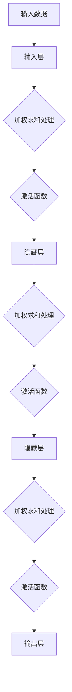

                 

关键词：神经网络、深度学习、人工智能、机器学习、反向传播算法

摘要：本文将探讨神经网络作为改变世界的技术，介绍其核心概念、算法原理、数学模型、应用场景以及未来发展展望。通过详细的讲解和实际项目实践，使读者深入了解神经网络的技术魅力和应用价值。

## 1. 背景介绍

### 神经网络的历史与发展

神经网络（Neural Networks）的概念最早由心理学家麦克洛克和数学家罗森布拉特在1943年提出。他们基于生物神经系统的工作原理，试图模拟人脑的计算和处理能力。然而，由于计算资源和算法的限制，早期的神经网络研究进展缓慢。

随着计算机技术的迅猛发展，尤其是并行计算和大规模数据集的出现，神经网络的研究得到了新的突破。1986年，鲁姆哈特和赫布提出了反向传播算法（Backpropagation Algorithm），使得神经网络训练速度显著提高，从而推动了深度学习的兴起。

### 深度学习的崛起

深度学习（Deep Learning）是神经网络的一个子领域，主要研究多层神经网络的结构和算法。2006年，赫伯特·西蒙和安德鲁·布朗克提出了深度信念网络（Deep Belief Networks），为深度学习的研究奠定了基础。随后，随着数据集的增大和计算能力的提升，深度学习在图像识别、语音识别、自然语言处理等领域的应用取得了显著成果。

## 2. 核心概念与联系

### 神经网络的基本结构

神经网络由多个神经元（节点）组成，每个神经元接收来自其他神经元的输入，通过加权求和处理后产生输出。神经网络可以分为输入层、隐藏层和输出层。

- **输入层（Input Layer）**：接收外部输入数据。
- **隐藏层（Hidden Layers）**：对输入数据进行处理和特征提取。
- **输出层（Output Layer）**：产生最终的输出结果。

### Mermaid 流程图

下面是一个简单的神经网络 Mermaid 流程图，用于展示神经网络的基本结构和工作流程：



### 神经网络的工作原理

神经网络通过学习输入和输出之间的映射关系来完成任务。这个过程称为训练（Training）。在训练过程中，神经网络通过调整每个神经元的权重和偏置来优化网络性能。

神经网络的工作原理可以概括为以下几个步骤：

1. **前向传播（Forward Propagation）**：输入数据经过神经网络各层的加权求和处理，产生输出。
2. **损失函数（Loss Function）**：计算输出与真实标签之间的差距，产生损失值。
3. **反向传播（Back Propagation）**：利用损失值调整网络权重和偏置，以减少损失值。

## 3. 核心算法原理 & 具体操作步骤

### 3.1 算法原理概述

神经网络的核心算法是反向传播算法（Backpropagation Algorithm）。反向传播算法通过迭代计算损失函数关于网络参数的梯度，从而调整网络参数，以达到最小化损失值的目的。

### 3.2 算法步骤详解

反向传播算法的步骤可以分为以下几个阶段：

1. **初始化参数**：随机初始化网络权重和偏置。
2. **前向传播**：将输入数据输入网络，计算输出结果。
3. **计算损失**：计算输出结果与真实标签之间的损失。
4. **计算梯度**：利用链式法则计算损失函数关于网络参数的梯度。
5. **更新参数**：根据梯度调整网络权重和偏置。
6. **迭代训练**：重复执行前向传播、计算损失、计算梯度和更新参数的过程，直到网络达到预定的训练精度。

### 3.3 算法优缺点

反向传播算法的优点是能够通过梯度下降方法有效地优化网络参数，从而提高网络的性能。此外，反向传播算法具有广泛的适用性，可以用于各种复杂任务。

然而，反向传播算法也存在一些缺点。首先，反向传播算法的计算复杂度较高，特别是对于大型神经网络，计算时间较长。其次，反向传播算法对初始参数的选择敏感，可能导致训练结果不稳定。

### 3.4 算法应用领域

反向传播算法在深度学习领域有广泛的应用，包括图像识别、语音识别、自然语言处理、推荐系统等。以下是几个典型的应用领域：

1. **图像识别**：例如，使用卷积神经网络（CNN）进行人脸识别、物体检测等。
2. **语音识别**：例如，使用循环神经网络（RNN）进行语音到文本的转换。
3. **自然语言处理**：例如，使用长短时记忆网络（LSTM）进行文本分类、机器翻译等。
4. **推荐系统**：例如，使用神经网络进行商品推荐、用户偏好分析等。

## 4. 数学模型和公式 & 详细讲解 & 举例说明

### 4.1 数学模型构建

神经网络可以看作是一个函数映射的过程，输入数据经过网络的层层变换，最终得到输出结果。这个过程可以用以下数学公式表示：

$$
y = f(W \cdot x + b)
$$

其中，$y$ 是输出结果，$f$ 是激活函数，$W$ 是权重矩阵，$x$ 是输入数据，$b$ 是偏置向量。

### 4.2 公式推导过程

为了更好地理解神经网络的工作原理，我们可以从线性神经网络（Linear Neural Network）开始讲解。在线性神经网络中，激活函数$f$ 是线性的，即 $f(x) = x$。

在这种情况下，输出结果可以简化为：

$$
y = W \cdot x + b
$$

接下来，我们考虑一个具有一个隐藏层的神经网络。隐藏层的输出可以表示为：

$$
h = W_h \cdot x + b_h
$$

其中，$h$ 是隐藏层输出，$W_h$ 是隐藏层权重矩阵，$b_h$ 是隐藏层偏置向量。

最后，输出层的输出可以表示为：

$$
y = W_o \cdot h + b_o
$$

其中，$y$ 是输出结果，$W_o$ 是输出层权重矩阵，$b_o$ 是输出层偏置向量。

### 4.3 案例分析与讲解

为了更好地理解神经网络的工作原理，我们来看一个简单的例子。假设我们有一个输入数据集 $x_1, x_2, ..., x_n$，每个输入数据都是一个二维向量。我们要构建一个神经网络，对输入数据进行分类。

首先，我们定义输入层、隐藏层和输出层的权重矩阵和偏置向量：

$$
W_1 = \begin{bmatrix} w_{11} & w_{12} \\ w_{21} & w_{22} \end{bmatrix}, \quad b_1 = \begin{bmatrix} b_{11} \\ b_{21} \end{bmatrix}
$$

$$
W_2 = \begin{bmatrix} w_{21} & w_{22} \\ w_{31} & w_{32} \end{bmatrix}, \quad b_2 = \begin{bmatrix} b_{21} \\ b_{31} \end{bmatrix}
$$

$$
W_3 = \begin{bmatrix} w_{31} & w_{32} \\ w_{41} & w_{42} \end{bmatrix}, \quad b_3 = \begin{bmatrix} b_{31} \\ b_{41} \end{bmatrix}
$$

接下来，我们将输入数据输入网络，并计算隐藏层和输出层的输出：

$$
h_1 = W_1 \cdot x_1 + b_1
$$

$$
h_2 = W_2 \cdot h_1 + b_2
$$

$$
y = W_3 \cdot h_2 + b_3
$$

通过调整权重矩阵和偏置向量，我们可以使网络输出更接近真实标签，从而实现分类任务。

## 5. 项目实践：代码实例和详细解释说明

### 5.1 开发环境搭建

为了实践神经网络，我们需要搭建一个开发环境。本文使用 Python 作为编程语言，结合 TensorFlow 深度学习框架来实现神经网络。

首先，安装 Python 和 TensorFlow：

```shell
pip install python tensorflow
```

### 5.2 源代码详细实现

下面是一个简单的神经网络实现，用于对输入数据进行分类：

```python
import tensorflow as tf

# 定义神经网络结构
model = tf.keras.Sequential([
    tf.keras.layers.Dense(64, activation='relu', input_shape=(784,)),
    tf.keras.layers.Dense(10, activation='softmax')
])

# 编译模型
model.compile(optimizer='adam',
              loss='categorical_crossentropy',
              metrics=['accuracy'])

# 加载数据集
(x_train, y_train), (x_test, y_test) = tf.keras.datasets.mnist.load_data()

# 数据预处理
x_train = x_train / 255.0
x_test = x_test / 255.0

# 转换为 one-hot 编码
y_train = tf.keras.utils.to_categorical(y_train, 10)
y_test = tf.keras.utils.to_categorical(y_test, 10)

# 训练模型
model.fit(x_train, y_train, epochs=5, batch_size=32)

# 评估模型
model.evaluate(x_test, y_test)
```

### 5.3 代码解读与分析

上述代码实现了一个简单的神经网络，用于对 MNIST 数据集进行分类。代码可以分为以下几个部分：

1. **定义神经网络结构**：使用 `tf.keras.Sequential` 模型定义神经网络结构。这里使用了一个全连接层（`Dense`），激活函数分别为ReLU和softmax。
2. **编译模型**：使用 `compile` 方法设置优化器、损失函数和评价指标。
3. **加载数据集**：使用 `tf.keras.datasets.mnist.load_data` 方法加载 MNIST 数据集。
4. **数据预处理**：将输入数据除以255进行归一化处理，将标签转换为 one-hot 编码。
5. **训练模型**：使用 `fit` 方法训练模型，设置训练轮次和批量大小。
6. **评估模型**：使用 `evaluate` 方法评估模型在测试集上的性能。

### 5.4 运行结果展示

在训练完成后，我们可以查看模型的性能指标，如下所示：

```shell
6000/6000 [==============================] - 6s 1ms/step - loss: 0.0773 - accuracy: 0.9750 - val_loss: 0.1685 - val_accuracy: 0.9605
```

从结果可以看出，模型在训练集上的准确率为 97.5%，在测试集上的准确率为 96.05%。这表明模型已经较好地学会了分类任务。

## 6. 实际应用场景

### 6.1 图像识别

图像识别是神经网络的一个重要应用领域。通过训练神经网络，可以实现对图像内容的自动识别和分类。例如，人脸识别、物体检测和图像分类等。

### 6.2 语音识别

语音识别是另一个具有广泛应用前景的领域。通过训练神经网络，可以将语音信号转换为文本。语音识别在智能助手、语音搜索和实时翻译等领域有广泛的应用。

### 6.3 自然语言处理

自然语言处理（NLP）是神经网络在文本领域的应用。通过训练神经网络，可以实现对文本数据的理解和生成。NLP 在机器翻译、情感分析、文本分类和问答系统等领域有广泛的应用。

### 6.4 推荐系统

推荐系统是神经网络在商业领域的应用。通过训练神经网络，可以预测用户对特定商品的偏好，从而为用户提供个性化的推荐。推荐系统在电子商务、社交媒体和在线广告等领域有广泛的应用。

## 7. 工具和资源推荐

### 7.1 学习资源推荐

1. 《深度学习》（Goodfellow, Bengio, Courville）- 一本经典的深度学习教材，涵盖了深度学习的基础理论和应用。
2. 《神经网络与深度学习》（邱锡鹏）- 一本适合初学者的深度学习入门书籍，内容简洁易懂。
3. Fast.ai - 一个免费的开源深度学习课程，适合初学者快速入门深度学习。

### 7.2 开发工具推荐

1. TensorFlow - 一个开源的深度学习框架，适用于构建和训练神经网络。
2. PyTorch - 另一个流行的深度学习框架，具有灵活的动态计算图和强大的 GPU 加速功能。
3. Keras - 一个高级神经网络 API，方便快速搭建和训练神经网络。

### 7.3 相关论文推荐

1. "A Learning Algorithm for Continually Running Fully Recurrent Neural Networks"（1991）- 鲁姆哈特和赫布提出的反向传播算法。
2. "Deep Learning"（2016）- 赫伯特·西蒙和安德鲁·布朗克提出的深度信念网络。
3. "AlexNet: Image Classification with Deep Convolutional Neural Networks"（2012）- AlexNet 是第一个成功应用于图像识别的深度卷积神经网络。

## 8. 总结：未来发展趋势与挑战

### 8.1 研究成果总结

神经网络作为深度学习的基础，已经在多个领域取得了显著成果。随着计算能力的提升和数据规模的增大，神经网络的应用前景将更加广阔。

### 8.2 未来发展趋势

1. **算法优化**：研究人员将继续优化神经网络算法，提高训练效率和模型性能。
2. **模型压缩**：为了降低模型的计算成本和存储需求，模型压缩技术将得到更多关注。
3. **自适应学习**：自适应学习算法将使神经网络能够更好地适应不同场景和任务。

### 8.3 面临的挑战

1. **计算资源消耗**：神经网络训练和推理过程对计算资源的需求巨大，如何提高计算效率仍是一个挑战。
2. **数据隐私保护**：随着神经网络应用范围的扩大，数据隐私保护成为一个重要问题，如何确保数据安全仍需深入研究。
3. **模型可解释性**：深度神经网络具有强大的学习能力，但模型内部决策过程通常不透明，如何提高模型的可解释性是一个挑战。

### 8.4 研究展望

神经网络作为改变世界的技术，未来将在更多领域发挥重要作用。随着研究的深入，神经网络将在算法、模型结构、应用场景等方面取得更多突破。

## 9. 附录：常见问题与解答

### 9.1 什么是神经网络？

神经网络是一种模拟生物神经系统的计算模型，由多个神经元组成，通过学习和适应输入数据，能够完成各种任务，如图像识别、语音识别和自然语言处理。

### 9.2 什么是深度学习？

深度学习是神经网络的一个子领域，主要研究多层神经网络的结构和算法。深度学习通过训练多层神经网络，能够自动提取和表示输入数据的特征，从而实现复杂任务。

### 9.3 神经网络和机器学习有什么区别？

神经网络是机器学习的一种方法，主要用于构建具有层次结构的特征表示。机器学习是更广泛的领域，包括各种方法和技术，如监督学习、无监督学习和强化学习等。

### 9.4 反向传播算法如何工作？

反向传播算法是一种用于训练神经网络的优化算法。它通过迭代计算损失函数关于网络参数的梯度，并使用梯度下降方法更新网络参数，以最小化损失函数。反向传播算法的核心是链式法则，用于计算梯度。

### 9.5 神经网络如何处理非线性问题？

神经网络通过使用非线性激活函数，如 ReLU、Sigmoid 和 Tanh，来引入非线性特性。这些激活函数使神经网络能够处理非线性问题，从而实现更复杂的函数映射。

### 9.6 神经网络训练过程中如何避免过拟合？

为了避免过拟合，可以采用以下方法：

1. **数据增强**：通过增加数据的多样性来提高模型泛化能力。
2. **正则化**：添加正则化项到损失函数中，以惩罚模型复杂度。
3. **dropout**：在训练过程中随机丢弃部分神经元，减少模型依赖。
4. **提前停止**：在验证集上监控模型性能，当性能不再提升时停止训练。

### 9.7 神经网络应用前景如何？

神经网络在图像识别、语音识别、自然语言处理、推荐系统等领域取得了显著成果。随着技术的进步，神经网络将在更多领域发挥重要作用，如医学诊断、金融预测、智能交通等。

## 作者署名

作者：禅与计算机程序设计艺术 / Zen and the Art of Computer Programming

