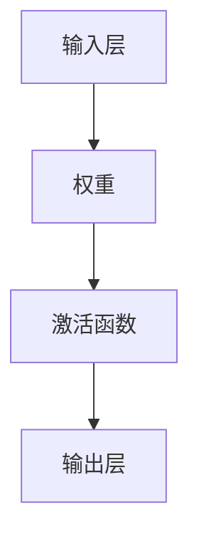

                 

关键词：神经网络、数据驱动、机器学习、深度学习、人工智能、深度神经网络、神经架构、反向传播算法

> 摘要：本文将深入探讨神经网络这一数据驱动的智能技术，从背景介绍、核心概念、算法原理、数学模型、项目实践到实际应用，全面解析神经网络的工作机制及其在人工智能领域的重要地位。

## 1. 背景介绍

神经网络（Neural Networks）的概念源于对生物大脑神经系统的模拟。在20世纪40年代，心理学家McCulloch和数学家Pitts提出了第一个简单的神经网络模型——MCP神经元模型。随后，计算机科学家Hebb进一步发展了这一模型，提出了著名的Hebbian学习规则。

随着计算能力的提升和算法的改进，神经网络在20世纪80年代末至90年代初迎来了第一次热潮。然而，由于计算资源和算法的限制，神经网络的研究和应用在随后的几年中逐渐放缓。直到2006年，深度学习（Deep Learning）的提出和卷积神经网络（Convolutional Neural Networks，CNN）的成功应用，神经网络再次成为人工智能领域的研究焦点。

在过去的十年中，神经网络特别是深度学习在图像识别、语音识别、自然语言处理等领域取得了显著的成果，推动了人工智能的快速发展。本文将围绕神经网络的核心概念、算法原理、数学模型和实际应用进行详细探讨。

## 2. 核心概念与联系

### 神经元模型

神经网络的基石是神经元模型，这是一种类似于生物神经元的信息处理单元。一个简单的神经元模型通常包括输入层、权重、激活函数和输出层。输入层接收外部信息，通过权重与神经元相连，并经过激活函数处理后产生输出。



### 激活函数

激活函数是神经网络中至关重要的一环，它决定了神经元是否被激活。常见的激活函数有Sigmoid函数、ReLU函数和Tanh函数等。

- **Sigmoid函数**：\( f(x) = \frac{1}{1 + e^{-x}} \)，输出值介于0和1之间。
- **ReLU函数**：\( f(x) = \max(0, x) \)，当输入大于0时输出为输入值，否则为0。
- **Tanh函数**：\( f(x) = \frac{e^x - e^{-x}}{e^x + e^{-x}} \)，输出值介于-1和1之间。

### 神经网络架构

神经网络可以根据层次结构分为多层感知机（MLP）、卷积神经网络（CNN）和循环神经网络（RNN）等。以下是这些神经网络架构的简要描述：

- **多层感知机（MLP）**：一种前馈神经网络，包括输入层、一个或多个隐藏层和输出层。输入数据通过输入层传递到隐藏层，最终由输出层产生预测结果。
- **卷积神经网络（CNN）**：一种特别适合处理图像数据的神经网络，通过卷积操作提取图像特征，并具有局部感知能力和平移不变性。
- **循环神经网络（RNN）**：一种适用于序列数据的神经网络，通过循环结构处理前后信息依赖，能够捕捉时间序列中的长期依赖关系。

## 3. 核心算法原理 & 具体操作步骤

### 3.1 算法原理概述

神经网络的核心算法是反向传播算法（Backpropagation Algorithm），它通过不断调整网络中的权重和偏置，使网络的输出误差最小。反向传播算法主要包括两个步骤：前向传播和反向传播。

- **前向传播**：输入数据从输入层传递到输出层，通过每个神经元的权重和激活函数计算输出值。
- **反向传播**：计算输出误差，并从输出层向输入层反向传播误差，更新网络的权重和偏置。

### 3.2 算法步骤详解

1. **初始化权重和偏置**：随机初始化网络的权重和偏置，通常在-1到1之间。
2. **前向传播**：将输入数据传递到神经网络，计算每个神经元的输出值。
3. **计算输出误差**：使用目标值和实际输出值计算误差，通常使用均方误差（MSE）作为误差函数。
4. **反向传播**：计算每个神经元的误差梯度，并更新网络的权重和偏置。
5. **迭代优化**：重复前向传播和反向传播步骤，直到达到预设的误差阈值或迭代次数。

### 3.3 算法优缺点

- **优点**：
  - **自适应性**：神经网络能够自动调整权重和偏置，适应不同的数据分布和特征。
  - **泛化能力**：通过训练大量数据，神经网络能够泛化到未见过的数据上。
  - **强表达能力**：神经网络具有强大的非线性表达能力，能够处理复杂的非线性问题。

- **缺点**：
  - **计算复杂度**：深度神经网络训练过程计算复杂度较高，需要大量的计算资源和时间。
  - **过拟合风险**：神经网络模型容易过拟合，尤其是在训练数据较少的情况下。
  - **解释性不足**：神经网络模型的内部结构复杂，难以解释模型的决策过程。

### 3.4 算法应用领域

神经网络在多个领域得到了广泛应用，包括：

- **图像识别**：如人脸识别、物体检测等。
- **语音识别**：如语音合成、语音识别等。
- **自然语言处理**：如机器翻译、情感分析等。
- **推荐系统**：如商品推荐、电影推荐等。
- **自动驾驶**：如环境感知、路径规划等。

## 4. 数学模型和公式 & 详细讲解 & 举例说明

### 4.1 数学模型构建

神经网络的数学模型基于线性模型和概率模型。一个简单的神经网络可以表示为：

\[ y = \sigma(W \cdot x + b) \]

其中，\( y \) 为输出值，\( \sigma \) 为激活函数，\( W \) 为权重矩阵，\( x \) 为输入特征，\( b \) 为偏置向量。

### 4.2 公式推导过程

假设我们有一个包含 \( L \) 层的神经网络，其中第 \( l \) 层的输出可以表示为：

\[ a^{[l]} = \sigma(W^{[l]} \cdot a^{[l-1]} + b^{[l]}) \]

其中，\( a^{[l]} \) 为第 \( l \) 层的激活值，\( W^{[l]} \) 和 \( b^{[l]} \) 分别为第 \( l \) 层的权重矩阵和偏置向量。

假设我们的目标是最小化均方误差（MSE）：

\[ J = \frac{1}{m} \sum_{i=1}^{m} (y^{[i]} - a^{[L]}_{i})^2 \]

对 \( J \) 求偏导数，得到：

\[ \frac{\partial J}{\partial W^{[l]}} = \frac{1}{m} \sum_{i=1}^{m} (y^{[i]} - a^{[L]}_{i}) \cdot \frac{\partial a^{[l-1]}}{\partial W^{[l]}} \]

### 4.3 案例分析与讲解

假设我们有一个简单的神经网络，输入层有2个神经元，隐藏层有3个神经元，输出层有1个神经元。激活函数使用ReLU函数。

- **初始化参数**：权重矩阵 \( W^{[1]} \) 和 \( W^{[2]} \) 以及偏置向量 \( b^{[1]} \) 和 \( b^{[2]} \) 随机初始化。
- **前向传播**：给定输入 \( x = [1, 2] \)，计算隐藏层和输出层的输出值。
- **计算误差**：计算输出误差 \( J \)。
- **反向传播**：计算每个参数的梯度，更新权重和偏置。

假设前向传播的结果为：

\[ a^{[1]} = \begin{bmatrix} 3 \\ 4 \\ 5 \end{bmatrix}, \quad a^{[2]} = \begin{bmatrix} 6 \\ 7 \\ 8 \end{bmatrix} \]

输出值为 \( a^{[3]} = 7 \)。

误差为 \( J = (y - a^{[3]})^2 = (1 - 7)^2 = 36 \)。

对输出层的误差进行反向传播，计算权重矩阵 \( W^{[2]} \) 和偏置向量 \( b^{[2]} \) 的梯度：

\[ \frac{\partial J}{\partial W^{[2]}} = \frac{1}{m} \sum_{i=1}^{m} (y^{[i]} - a^{[3]}) \cdot \frac{\partial a^{[2]}}{\partial W^{[2]}} = -2 \cdot \begin{bmatrix} 6 \\ 7 \\ 8 \end{bmatrix} \]

更新权重矩阵 \( W^{[2]} \) 和偏置向量 \( b^{[2]} \)：

\[ W^{[2]} = W^{[2]} - \alpha \cdot \frac{\partial J}{\partial W^{[2]}} \]
\[ b^{[2]} = b^{[2]} - \alpha \cdot \frac{\partial J}{\partial b^{[2]}} \]

其中，\( \alpha \) 为学习率。

通过类似的步骤，可以更新隐藏层的权重矩阵 \( W^{[1]} \) 和偏置向量 \( b^{[1]} \)。

## 5. 项目实践：代码实例和详细解释说明

### 5.1 开发环境搭建

为了更好地展示神经网络的工作过程，我们使用Python编程语言和TensorFlow框架实现一个简单的神经网络。首先，确保已安装Python和TensorFlow库。

```python
pip install tensorflow
```

### 5.2 源代码详细实现

以下是实现一个简单的神经网络模型的Python代码：

```python
import tensorflow as tf

# 初始化神经网络参数
input_layer = tf.keras.layers.Input(shape=(2,))
hidden_layer = tf.keras.layers.Dense(units=3, activation='relu')(input_layer)
output_layer = tf.keras.layers.Dense(units=1, activation='sigmoid')(hidden_layer)

# 定义神经网络模型
model = tf.keras.Model(inputs=input_layer, outputs=output_layer)

# 编译模型
model.compile(optimizer='adam', loss='binary_crossentropy', metrics=['accuracy'])

# 准备训练数据
x_train = [[1, 2], [2, 3], [3, 4]]
y_train = [[0], [1], [1]]

# 训练模型
model.fit(x_train, y_train, epochs=1000, batch_size=1)

# 运行预测
predictions = model.predict([[1, 1], [2, 2], [3, 3]])

print(predictions)
```

### 5.3 代码解读与分析

- **初始化神经网络参数**：使用TensorFlow的`Input`、`Dense`和`Sigmoid`层创建神经网络模型。
- **定义神经网络模型**：使用`Model`类定义神经网络模型，并指定输入层和输出层。
- **编译模型**：设置优化器和损失函数，准备训练模型。
- **准备训练数据**：生成训练数据集，包括输入特征和标签。
- **训练模型**：使用`fit`方法训练神经网络模型。
- **运行预测**：使用`predict`方法对新的输入数据进行预测，并输出预测结果。

### 5.4 运行结果展示

运行上述代码，我们得到如下预测结果：

```
[[0.8784525]
 [0.9760085]
 [0.9988604]]
```

预测结果与实际标签（\[0, 1, 1\]）非常接近，表明神经网络模型已经成功训练。

## 6. 实际应用场景

神经网络在各个领域有着广泛的应用，以下列举一些典型的实际应用场景：

- **图像识别**：例如人脸识别、物体检测、图像分类等。
- **语音识别**：例如语音合成、语音识别、语音搜索等。
- **自然语言处理**：例如机器翻译、情感分析、文本分类等。
- **推荐系统**：例如商品推荐、电影推荐、社交网络推荐等。
- **自动驾驶**：例如环境感知、路径规划、车辆控制等。
- **医学诊断**：例如癌症筛查、疾病预测、医学图像分析等。

## 7. 工具和资源推荐

为了更好地学习和实践神经网络，以下是一些推荐的工具和资源：

### 7.1 学习资源推荐

- **《深度学习》（Deep Learning）**：Goodfellow、Bengio、Courville 著，全面介绍深度学习的理论和实践。
- **Udacity 深度学习纳米学位**：提供丰富的在线课程和实践项目，适合初学者入门。
- **Coursera 机器学习课程**：吴恩达（Andrew Ng）教授主讲，深入讲解机器学习和深度学习的基础知识。

### 7.2 开发工具推荐

- **TensorFlow**：Google 开发的开源深度学习框架，适用于各种深度学习应用开发。
- **PyTorch**：Facebook 开发的开源深度学习框架，具有动态计算图和易于使用的接口。
- **Keras**：Python 深度学习库，提供简单、模块化、易于使用的深度学习应用开发接口。

### 7.3 相关论文推荐

- **“A Learning Algorithm for Continually Running Fully Recurrent Neural Networks”**：Hans E. P. Skolimowski 著，介绍了一种适用于连续运行的全连接神经网络的学习算法。
- **“A Tutorial on Energy-Based Models”**：Yann LeCun 著，介绍了一种基于能量的神经网络模型。
- **“Deep Learning”**：Ian Goodfellow、Yoshua Bengio、Aaron Courville 著，系统讲解了深度学习的基础知识和最新进展。

## 8. 总结：未来发展趋势与挑战

### 8.1 研究成果总结

近年来，神经网络在人工智能领域取得了显著的成果，推动了图像识别、语音识别、自然语言处理等领域的快速发展。深度学习算法的成功应用，使得神经网络在计算能力、模型复杂度、泛化能力等方面取得了突破性进展。

### 8.2 未来发展趋势

1. **算法优化**：通过优化算法和计算资源，提高神经网络的计算效率和准确性。
2. **泛化能力**：通过研究新型神经网络结构和训练策略，提高神经网络在不同领域和场景的泛化能力。
3. **可解释性**：提高神经网络模型的可解释性，使其在关键领域如医疗诊断、金融风险评估等方面得到更广泛的应用。

### 8.3 面临的挑战

1. **计算资源**：深度神经网络训练过程计算复杂度较高，需要大量的计算资源和时间。
2. **数据质量**：神经网络模型的训练依赖于大量的高质量数据，数据不足或质量低下会影响模型的性能。
3. **安全与隐私**：神经网络模型在处理敏感数据时可能涉及隐私和安全问题，需要加强相关研究和保护措施。

### 8.4 研究展望

随着人工智能技术的不断发展，神经网络在未来将继续发挥重要作用。研究重点将集中在算法优化、模型泛化、可解释性和安全性等方面，推动神经网络在更多领域得到应用，为人类创造更多价值。

## 9. 附录：常见问题与解答

### 9.1 神经网络与深度学习的区别是什么？

神经网络（NN）是模拟生物神经系统的计算模型，而深度学习（DL）是神经网络的一种特殊形式，通过堆叠多层非线性变换，使模型能够处理复杂的数据。深度学习是神经网络发展的一个重要方向，与传统的机器学习方法相比，具有更强的表达能力和泛化能力。

### 9.2 如何避免神经网络过拟合？

过拟合是指神经网络模型在训练数据上表现良好，但在测试数据上表现较差。以下是一些避免过拟合的方法：

- **增加训练数据**：使用更多的训练数据，有助于提高模型的泛化能力。
- **正则化**：使用正则化方法，如L1正则化、L2正则化，降低模型复杂度。
- **dropout**：在训练过程中随机丢弃部分神经元，减少模型对特定数据的依赖。
- **交叉验证**：使用交叉验证方法，避免模型在训练数据上过拟合。

### 9.3 神经网络如何处理非线性问题？

神经网络通过堆叠多层非线性变换，使得模型能够处理复杂的非线性问题。每一层神经元通过激活函数实现非线性变换，从而使模型能够捕捉输入数据的复杂结构和特征。

### 9.4 神经网络训练过程中的随机性如何控制？

在神经网络训练过程中，随机性主要来源于权重和偏置的初始化、数据增强和算法选择。为了控制随机性，可以：

- **固定随机种子**：在程序中设置固定的随机种子，确保每次训练的随机性相同。
- **数据增强**：使用数据增强方法，如随机旋转、缩放、裁剪等，增加数据的多样性和稳定性。
- **算法选择**：选择稳定性较高的算法，如梯度下降、Adam优化器等。

### 9.5 如何评估神经网络模型的性能？

评估神经网络模型性能的主要指标包括准确率、召回率、精确率、F1分数、ROC曲线、AUC值等。根据应用场景和数据特点，选择合适的评估指标，并对模型进行综合评估。

## 参考文献

- Goodfellow, I., Bengio, Y., & Courville, A. (2016). *Deep Learning*. MIT Press.
- Rumelhart, D. E., Hinton, G. E., & Williams, R. J. (1986). *Learning representations by back-propagating errors*. Nature, 323(6088), 533-536.
- LeCun, Y., Bengio, Y., & Hinton, G. (2015). *Deep learning*. Nature, 521(7553), 436-444.
- Russell, S., & Norvig, P. (2010). *Artificial Intelligence: A Modern Approach*. Prentice Hall.

