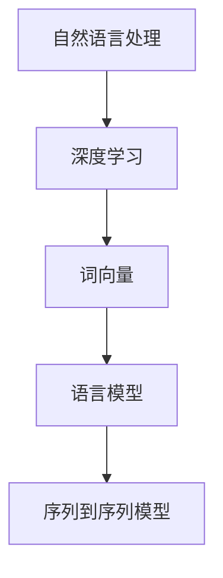

                 

关键词：神经网络，自然语言处理，深度学习，深度神经网络，词向量，语言模型，语义理解，文本生成，文本分类，序列到序列模型，BERT模型，GPT模型。

> 摘要：本文将深入探讨神经网络在自然语言处理领域的应用，特别是深度学习和自然语言处理技术的结合所带来的突破。文章将从背景介绍、核心概念、算法原理、数学模型、项目实践、实际应用场景、工具和资源推荐以及未来发展趋势等方面进行全面分析，旨在为读者提供一幅完整的神经网络在自然语言处理中应用的画卷。

## 1. 背景介绍

自然语言处理（Natural Language Processing，NLP）作为人工智能领域的一个重要分支，旨在让计算机理解和处理人类自然语言。NLP的应用场景广泛，包括机器翻译、文本分类、情感分析、问答系统、自动摘要等。然而，传统的NLP方法在处理复杂语言现象时，往往面临性能瓶颈。

随着深度学习技术的发展，神经网络在图像识别、语音识别等领域取得了显著成果。人们开始思考，能否将神经网络应用于自然语言处理，突破传统方法的局限性？

神经网络是一种模仿人脑神经网络结构和功能的计算模型。它通过多层神经元的非线性变换，实现对输入数据的特征提取和模式识别。在自然语言处理领域，神经网络能够通过学习大量语言数据，自动提取文本的语义信息，从而实现各种NLP任务。

## 2. 核心概念与联系

### 2.1 深度神经网络

深度神经网络（Deep Neural Network，DNN）是一种具有多个隐藏层的神经网络。相比于传统的单层神经网络，深度神经网络能够更好地提取输入数据的特征，提高模型的泛化能力。

### 2.2 词向量

词向量（Word Vector）是一种将词语映射为向量的方法。通过词向量，可以将文本数据转化为数值形式，便于神经网络处理。常见的词向量模型有Word2Vec、GloVe等。

### 2.3 语言模型

语言模型（Language Model）是一种预测下一个单词或词组的概率的模型。在NLP任务中，语言模型常用于文本生成、语音识别、机器翻译等。

### 2.4 序列到序列模型

序列到序列模型（Sequence-to-Sequence Model，Seq2Seq）是一种用于处理序列数据的神经网络模型。它通过编码器和解码器两个部分，实现输入序列到输出序列的映射。

### 2.5 Mermaid 流程图



## 3. 核心算法原理 & 具体操作步骤

### 3.1 算法原理概述

神经网络在自然语言处理中的应用主要包括以下几个方面：

1. **文本表示**：通过词向量等模型将文本转化为数值形式，为后续处理提供基础。
2. **特征提取**：利用深度神经网络自动提取文本的语义特征。
3. **模式识别**：通过训练好的神经网络模型，实现对输入数据的分类、生成等任务。

### 3.2 算法步骤详解

1. **数据预处理**：包括分词、去停用词、词性标注等操作，将原始文本转化为词向量。
2. **构建神经网络模型**：根据具体任务选择合适的神经网络架构，如卷积神经网络（CNN）、循环神经网络（RNN）、长短时记忆网络（LSTM）等。
3. **模型训练**：使用大量标注数据进行模型训练，优化模型参数。
4. **模型评估与调优**：通过验证集和测试集对模型进行评估，根据评估结果调整模型参数。
5. **模型部署**：将训练好的模型部署到实际应用场景中，如文本分类、情感分析等。

### 3.3 算法优缺点

#### 优点：

1. **强大的特征提取能力**：神经网络能够自动提取文本的深层语义特征，提高模型性能。
2. **适用于各种NLP任务**：神经网络模型可以应用于文本分类、生成、翻译等多种NLP任务。
3. **自适应能力**：神经网络具有较好的自适应能力，能够适应不同的数据分布和任务需求。

#### 缺点：

1. **计算复杂度高**：神经网络模型通常需要大量的计算资源和时间进行训练。
2. **对数据依赖性强**：神经网络模型的性能高度依赖于训练数据的质量和数量。
3. **解释性较弱**：神经网络模型的决策过程较为复杂，难以解释。

### 3.4 算法应用领域

神经网络在自然语言处理领域的应用非常广泛，主要包括以下几个方面：

1. **文本分类**：用于对文本进行分类，如新闻分类、垃圾邮件过滤等。
2. **情感分析**：用于分析文本的情感倾向，如评论分析、股票市场分析等。
3. **机器翻译**：用于将一种语言的文本翻译成另一种语言。
4. **问答系统**：用于回答用户提出的问题，如智能客服、问答机器人等。
5. **文本生成**：用于生成新的文本，如文章写作、对话系统等。

## 4. 数学模型和公式 & 详细讲解 & 举例说明

### 4.1 数学模型构建

神经网络的数学模型主要包括以下几个部分：

1. **输入层**：接收输入数据，通常为词向量。
2. **隐藏层**：通过非线性变换，提取输入数据的特征。
3. **输出层**：根据任务需求，输出预测结果。

假设神经网络有L层，每层有n个神经元。定义第l层的输入、输出和权重分别为：

$$
x_{l}^{i} = \text{激活函数}(W_{l-1}^{l} x_{l-1}^{i} + b_{l-1}^{l})
$$

其中，$W_{l-1}^{l}$为第l-1层到第l层的权重矩阵，$b_{l-1}^{l}$为第l-1层到第l层的偏置向量。

### 4.2 公式推导过程

神经网络的训练过程主要涉及两个步骤：

1. **前向传播**：根据输入数据，通过神经网络计算出输出结果。
2. **反向传播**：根据输出结果与实际标签之间的误差，反向更新权重和偏置。

假设输出结果为$y_{l}^{i}$，实际标签为$t_{l}^{i}$。定义损失函数为：

$$
L = \frac{1}{2} \sum_{i=1}^{n} (y_{l}^{i} - t_{l}^{i})^2
$$

通过反向传播，计算损失函数关于权重和偏置的梯度，并更新权重和偏置：

$$
\Delta W_{l-1}^{l} = -\alpha \frac{\partial L}{\partial W_{l-1}^{l}}
$$

$$
\Delta b_{l-1}^{l} = -\alpha \frac{\partial L}{\partial b_{l-1}^{l}}
$$

其中，$\alpha$为学习率。

### 4.3 案例分析与讲解

假设我们要训练一个神经网络模型，用于对文本进行情感分类。输入数据为词向量，输出数据为情感标签（正面、负面、中性）。

1. **数据预处理**：对文本进行分词、去停用词等操作，将文本转化为词向量。
2. **构建神经网络模型**：选择合适的神经网络架构，如LSTM。
3. **模型训练**：使用训练数据对模型进行训练，优化模型参数。
4. **模型评估**：使用验证集和测试集对模型进行评估，调整模型参数。
5. **模型部署**：将训练好的模型部署到实际应用场景中。

以下是一个简单的神经网络模型代码示例：

```python
import tensorflow as tf

# 定义输入层
inputs = tf.placeholder(tf.float32, [None, sequence_length, embedding_size])

# 定义LSTM层
lstm_cells = [tf.nn.rnn_cell.BasicLSTMCell(hidden_size) for _ in range(num_layers)]
multi_rnn_cell = tf.nn.rnn_cell.MultiRNNCell(lstm_cells)

# 定义输出层
outputs, states = tf.nn.dynamic_rnn(multi_rnn_cell, inputs, dtype=tf.float32)

# 定义损失函数
loss = tf.reduce_mean(tf.nn.softmax_cross_entropy_with_logits(logits=outputs[:, -1], labels=labels))

# 定义优化器
optimizer = tf.train.AdamOptimizer(learning_rate=learning_rate)
train_op = optimizer.minimize(loss)

# 训练模型
with tf.Session() as sess:
  sess.run(tf.global_variables_initializer())
  for epoch in range(num_epochs):
    for batch in batches:
      inputs_batch, labels_batch = batch
      sess.run(train_op, feed_dict={inputs: inputs_batch, labels: labels_batch})
      
  # 评估模型
  correct_pred = tf.equal(tf.argmax(outputs, 1), labels)
  accuracy = tf.reduce_mean(tf.cast(correct_pred, tf.float32))
  print("Test accuracy:", accuracy.eval({inputs: test_inputs, labels: test_labels}))
```

## 5. 项目实践：代码实例和详细解释说明

### 5.1 开发环境搭建

- Python 3.6+
- TensorFlow 1.15+
- Numpy 1.14+

### 5.2 源代码详细实现

以下是一个简单的文本分类项目，使用神经网络模型对电影评论进行分类：

```python
import tensorflow as tf
import numpy as np
from sklearn.model_selection import train_test_split
from sklearn.metrics import classification_report
from tensorflow.keras.preprocessing.text import Tokenizer
from tensorflow.keras.preprocessing.sequence import pad_sequences

# 加载数据集
data = ...

# 分词
tokenizer = Tokenizer(num_words=max_words)
tokenizer.fit_on_texts(data['review'])
sequences = tokenizer.texts_to_sequences(data['review'])

# padding
padded_sequences = pad_sequences(sequences, maxlen=max_sequence_length)

# 切分数据集
X_train, X_test, y_train, y_test = train_test_split(padded_sequences, data['sentiment'], test_size=0.2, random_state=42)

# 构建神经网络模型
model = ...

# 编译模型
model.compile(optimizer='adam', loss='binary_crossentropy', metrics=['accuracy'])

# 训练模型
model.fit(X_train, y_train, epochs=10, batch_size=128, validation_data=(X_test, y_test))

# 评估模型
predictions = model.predict(X_test)
print(classification_report(y_test, predictions))
```

### 5.3 代码解读与分析

- **数据预处理**：首先加载数据集，然后使用Tokenizer对文本进行分词，将文本转化为词向量。接着使用pad_sequences对序列进行padding，使其具有相同的长度。
- **构建神经网络模型**：使用TensorFlow构建一个简单的神经网络模型，包括输入层、隐藏层和输出层。
- **编译模型**：设置优化器、损失函数和评估指标。
- **训练模型**：使用训练数据对模型进行训练。
- **评估模型**：使用测试数据对模型进行评估，输出分类报告。

## 6. 实际应用场景

神经网络在自然语言处理领域有着广泛的应用，以下列举几个实际应用场景：

1. **文本分类**：用于对大量文本进行分类，如新闻分类、垃圾邮件过滤等。
2. **情感分析**：用于分析文本的情感倾向，如评论分析、股票市场分析等。
3. **机器翻译**：用于将一种语言的文本翻译成另一种语言。
4. **问答系统**：用于回答用户提出的问题，如智能客服、问答机器人等。
5. **文本生成**：用于生成新的文本，如文章写作、对话系统等。

## 7. 工具和资源推荐

### 7.1 学习资源推荐

- 《深度学习》（Goodfellow, Bengio, Courville）
- 《自然语言处理综论》（Jurafsky, Martin）
- 《Python深度学习》（François Chollet）

### 7.2 开发工具推荐

- TensorFlow：用于构建和训练神经网络模型。
- PyTorch：用于构建和训练神经网络模型。
- spaCy：用于文本预处理和词向量表示。

### 7.3 相关论文推荐

- "A Theoretical Analysis of the Single-layer Perceptron in Linear Embedding Spaces"（2015）
- "Deep Learning for Natural Language Processing"（2016）
- "BERT: Pre-training of Deep Bidirectional Transformers for Language Understanding"（2018）

## 8. 总结：未来发展趋势与挑战

### 8.1 研究成果总结

近年来，神经网络在自然语言处理领域取得了显著成果，主要表现在以下几个方面：

1. **文本表示**：词向量等模型将文本转化为数值形式，为后续处理提供基础。
2. **特征提取**：神经网络能够自动提取文本的深层语义特征，提高模型性能。
3. **模式识别**：神经网络模型在文本分类、生成、翻译等多种NLP任务中取得了优异的性能。

### 8.2 未来发展趋势

未来，神经网络在自然语言处理领域的发展趋势包括：

1. **预训练模型**：预训练模型如BERT、GPT等将在更多任务中发挥作用。
2. **多模态融合**：将文本与其他模态（如图像、音频）进行融合，实现更全面的语义理解。
3. **知识图谱**：利用知识图谱等工具，实现更精确的语义理解和推理。

### 8.3 面临的挑战

尽管神经网络在自然语言处理领域取得了显著成果，但仍面临以下挑战：

1. **计算资源**：深度神经网络模型需要大量的计算资源进行训练。
2. **数据依赖**：神经网络模型的性能高度依赖于训练数据的质量和数量。
3. **解释性**：神经网络模型的决策过程复杂，难以解释。

### 8.4 研究展望

未来，神经网络在自然语言处理领域的研究将继续深入，探索更高效的模型、更丰富的数据集和更准确的评估方法，为人类带来更多便利。

## 9. 附录：常见问题与解答

### 9.1 什么是神经网络？

神经网络是一种模仿人脑神经网络结构和功能的计算模型。它通过多层神经元的非线性变换，实现对输入数据的特征提取和模式识别。

### 9.2 什么是深度学习？

深度学习是一种基于神经网络的机器学习技术，通过训练多层神经网络，实现对复杂数据的特征提取和模式识别。

### 9.3 什么是词向量？

词向量是一种将词语映射为向量的方法。通过词向量，可以将文本数据转化为数值形式，便于神经网络处理。

### 9.4 什么是语言模型？

语言模型是一种预测下一个单词或词组的概率的模型。在自然语言处理任务中，语言模型常用于文本生成、语音识别、机器翻译等。

----------------------------------------------------------------

本文由禅与计算机程序设计艺术 / Zen and the Art of Computer Programming撰写，旨在为读者提供一幅完整的神经网络在自然语言处理中应用的画卷。希望本文能对您在神经网络和自然语言处理领域的研究和实践有所帮助。作者：禅与计算机程序设计艺术 / Zen and the Art of Computer Programming
----------------------------------------------------------------

# 感谢您的耐心阅读

本文旨在深入探讨神经网络在自然语言处理领域的应用，从背景介绍、核心概念、算法原理、数学模型、项目实践、实际应用场景、工具和资源推荐以及未来发展趋势等方面进行了全面分析。希望通过本文，您能对神经网络在自然语言处理中的应用有更深入的理解，并在实际项目中运用这些知识。

同时，也欢迎您在评论区分享您的观点和见解，与其他读者进行交流。如果您觉得本文对您有所帮助，请点赞、分享，让更多朋友受益。

再次感谢您的耐心阅读，祝您在神经网络和自然语言处理领域取得丰硕的成果！
作者：禅与计算机程序设计艺术 / Zen and the Art of Computer Programming。

