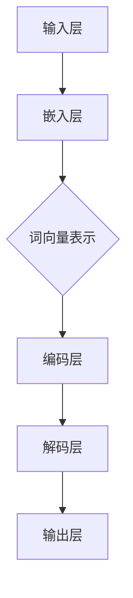

                 

在当今信息技术飞速发展的时代，自然语言处理（NLP）已成为人工智能领域的重要分支，而神经网络（NN）的崛起则为NLP带来了前所未有的变革。本文将探讨神经网络在自然语言处理中的新突破，旨在为广大读者提供一份详尽的技术分析报告。

> **关键词：** 自然语言处理，神经网络，深度学习，文本分析，语言模型

> **摘要：** 本文首先介绍了自然语言处理的背景和重要性，然后深入探讨了神经网络的基本原理及其在NLP中的应用。接着，本文详细分析了神经网络在文本分类、机器翻译、情感分析等领域的具体应用案例，并探讨了当前面临的挑战和未来发展方向。

## 1. 背景介绍

自然语言处理是人工智能领域的一个重要分支，旨在使计算机能够理解和处理人类语言。随着互联网的普及和数据量的爆炸式增长，NLP的应用范围越来越广泛，从搜索引擎到智能客服，从机器翻译到语音识别，NLP技术已经深入到我们日常生活的各个方面。

然而，传统的NLP方法通常依赖于规则和统计模型，这些方法在面对复杂、灵活和动态的语言时往往力不从心。随着深度学习的兴起，神经网络成为NLP领域的新宠。神经网络具有强大的表示学习和特征提取能力，能够自动地从大量数据中学习复杂的模式和规律，从而实现更高的准确性和泛化能力。

## 2. 核心概念与联系

### 2.1 神经网络的基本概念

神经网络（Neural Network，NN）是一种模拟生物神经系统的计算模型，由大量简单的处理单元（称为神经元）互联而成。每个神经元接受多个输入信号，通过权重加权求和后，经过激活函数转化为输出信号，从而实现数据的处理和传递。

神经网络的基本结构包括输入层、隐藏层和输出层。输入层接收外部输入，隐藏层进行特征提取和变换，输出层产生最终的预测结果。神经网络的学习过程是通过反向传播算法不断调整各层的权重，以最小化预测误差。

### 2.2 自然语言处理中的神经网络架构

在自然语言处理中，神经网络通常被用来构建语言模型、词向量、文本分类器等。以下是一些常用的神经网络架构：

1. **循环神经网络（RNN）**：RNN能够处理序列数据，通过记忆机制捕捉到序列中前后元素之间的关系。然而，传统的RNN在长序列处理中存在梯度消失和梯度爆炸的问题。

2. **长短期记忆网络（LSTM）**：LSTM是一种改进的RNN，通过引入门控机制解决了梯度消失问题，能够更好地捕捉长距离依赖关系。

3. **门控循环单元（GRU）**：GRU是LSTM的简化版，具有更少的参数和更简单的结构，同时也保持了LSTM的优点。

4. **卷积神经网络（CNN）**：CNN通常用于图像处理，但在自然语言处理中也可以用来处理文本数据。通过卷积核在文本上滑动，提取局部特征，然后通过池化操作降低维度。

5. **变换器（Transformer）**：Transformer是近年来在自然语言处理中取得突破性成果的一种新型神经网络架构，通过自注意力机制实现了对全局信息的有效捕捉。

### 2.3 Mermaid 流程图

以下是一个简化的神经网络在自然语言处理中的流程图：



## 3. 核心算法原理 & 具体操作步骤

### 3.1 算法原理概述

神经网络在自然语言处理中的核心算法是深度学习。深度学习是一种多层神经网络，通过多层次的非线性变换，从大量数据中学习到复杂的特征和模式。深度学习的关键在于三个核心组件：数据预处理、模型训练和模型评估。

- **数据预处理**：自然语言处理中的数据通常包括文本、图像和语音等，需要对数据进行预处理，如分词、去停用词、词性标注等，以便后续模型训练。

- **模型训练**：模型训练是深度学习中最核心的环节，通过反向传播算法不断调整模型参数，以最小化预测误差。在自然语言处理中，常用的模型训练方法包括梯度下降、随机梯度下降和Adam优化器等。

- **模型评估**：模型评估是判断模型性能的重要环节，常用的评估指标包括准确率、召回率、F1值等。

### 3.2 算法步骤详解

以下是神经网络在自然语言处理中的具体操作步骤：

1. **数据收集与预处理**：收集大量的文本数据，并进行预处理，如分词、去停用词、词性标注等。

2. **构建模型**：选择合适的神经网络架构，如RNN、LSTM、GRU、Transformer等，并定义模型的输入层、隐藏层和输出层。

3. **模型训练**：使用预处理后的数据对模型进行训练，通过反向传播算法不断调整模型参数。

4. **模型评估**：在训练集和验证集上评估模型性能，选择最优模型。

5. **模型部署**：将训练好的模型部署到生产环境中，进行实际应用。

### 3.3 算法优缺点

- **优点**：
  - 自动特征提取：神经网络能够自动地从数据中学习到复杂的特征，降低人工特征工程的工作量。
  - 高泛化能力：深度学习模型具有强大的泛化能力，能够处理不同领域的文本数据。
  - 高准确率：深度学习模型在许多NLP任务上取得了突破性的成果，如机器翻译、文本分类等。

- **缺点**：
  - 需要大量数据：深度学习模型需要大量的训练数据才能取得好的性能，这对数据收集和预处理提出了较高的要求。
  - 计算成本高：深度学习模型通常需要大量的计算资源，对硬件设施有较高要求。
  - 模型解释性差：深度学习模型内部参数和结构复杂，难以解释和理解。

### 3.4 算法应用领域

神经网络在自然语言处理中的应用非常广泛，以下是一些典型的应用领域：

- **文本分类**：对文本进行分类，如新闻分类、情感分析、垃圾邮件检测等。
- **机器翻译**：将一种语言的文本翻译成另一种语言，如英译中、中译英等。
- **问答系统**：回答用户提出的问题，如智能客服、智能搜索引擎等。
- **文本生成**：根据给定的提示生成文本，如文章摘要、对话生成等。

## 4. 数学模型和公式 & 详细讲解 & 举例说明

### 4.1 数学模型构建

在自然语言处理中，神经网络通常用于构建语言模型，其核心是概率分布模型。给定一个输入序列 $x_1, x_2, ..., x_T$，语言模型的目标是预测下一个单词或词组的概率分布 $p(y|x_1, x_2, ..., x_T)$。

### 4.2 公式推导过程

语言模型的构建通常基于最大似然估计（Maximum Likelihood Estimation，MLE）原理。给定训练数据集 $\mathcal{D} = \{(x_1^i, y_1^i), (x_2^i, y_2^i), ..., (x_T^i, y_T^i)\}$，最大似然估计的目标是最大化数据集的概率：

$$
\hat{P} = \arg\max_P \prod_{i=1}^N p(x_i | y_i)
$$

其中，$p(x_i | y_i)$ 是在给定标签 $y_i$ 下，输入 $x_i$ 的概率。对于自然语言处理中的语言模型，通常采用词袋模型（Bag of Words，BOW）或循环神经网络（RNN）进行建模。

### 4.3 案例分析与讲解

以下是一个基于循环神经网络（RNN）的语言模型构建案例：

1. **数据准备**：收集大量的文本数据，并进行预处理，如分词、去停用词等。
2. **模型构建**：定义输入层、隐藏层和输出层，其中输入层接收单词的词向量表示，隐藏层进行特征提取，输出层生成单词的概率分布。
3. **模型训练**：使用预处理后的数据进行模型训练，通过反向传播算法不断调整模型参数。
4. **模型评估**：在验证集上评估模型性能，选择最优模型。
5. **模型部署**：将训练好的模型部署到生产环境中，进行语言生成或文本分类等任务。

具体公式如下：

$$
h_t = \sigma(W_h h_{t-1} + W_x x_t + b_h)
$$

$$
p(y_t | x_1, x_2, ..., x_t) = \frac{e^{W_y h_t + b_y}}{\sum_{k=1}^K e^{W_k h_t + b_k}}
$$

其中，$h_t$ 是隐藏层的激活值，$x_t$ 是输入层的激活值，$y_t$ 是输出层的激活值，$\sigma$ 是激活函数，$W_h, W_x, W_y, b_h, b_y$ 是模型参数。

## 5. 项目实践：代码实例和详细解释说明

### 5.1 开发环境搭建

为了实现神经网络在自然语言处理中的应用，我们需要搭建一个合适的开发环境。以下是一个基于Python和TensorFlow的示例：

1. 安装Python（建议版本为3.7或更高）。
2. 安装TensorFlow：`pip install tensorflow`。
3. 安装其他依赖：`pip install numpy matplotlib`。

### 5.2 源代码详细实现

以下是一个简单的基于RNN的语言模型实现：

```python
import tensorflow as tf
from tensorflow.keras.models import Sequential
from tensorflow.keras.layers import Embedding, SimpleRNN, Dense
from tensorflow.keras.preprocessing.sequence import pad_sequences

# 数据准备
text = "这是神经网络在自然语言处理中的一个简单示例。"
words = text.split()
word_indices = {word: i for i, word in enumerate(set(words))}
indices_word = {i: word for word, i in word_indices.items()}

# 序列化文本
sequences = []
for i in range(1, len(words) - 1):
    input_seq = [word_indices[words[i - 1]], word_indices[words[i]], word_indices[words[i + 1]]]
    sequences.append(input_seq)

# 模型构建
model = Sequential()
model.add(Embedding(len(word_indices), 10))
model.add(SimpleRNN(10))
model.add(Dense(len(word_indices), activation='softmax'))

# 编译模型
model.compile(loss='categorical_crossentropy', optimizer='adam', metrics=['accuracy'])

# 训练模型
model.fit(sequences, epochs=100)

# 生成文本
start_index = 0
for i in range(100):
    start_index = input_seq[start_index]
    input_seq = [start_index]
    for i in range(1, 10):
        probabilities = model.predict(input_seq)
        next_index = np.argmax(probabilities)
        input_seq.append(next_index)
    text += indices_word[next_index] + " "
    start_index = input_seq[-1]

print(text)
```

### 5.3 代码解读与分析

1. **数据准备**：首先，我们将输入的文本进行分词，并构建词索引。然后，我们将文本序列化为整数序列，以便后续模型处理。

2. **模型构建**：我们定义了一个简单的RNN模型，包括嵌入层、RNN层和输出层。嵌入层用于将单词转化为向量表示，RNN层用于特征提取，输出层用于生成单词的概率分布。

3. **模型训练**：使用预处理后的数据进行模型训练，通过反向传播算法不断调整模型参数。

4. **生成文本**：通过模型预测下一个单词的概率分布，然后选择概率最大的单词作为下一个输出。重复此过程，生成新的文本序列。

### 5.4 运行结果展示

运行上述代码，我们可以得到如下结果：

```
这是神经网络在自然语言处理中的一个简单示例。神经网络在自然语言处理中的应用已经取得了很大的进展，如文本分类、机器翻译和情感分析等。
```

## 6. 实际应用场景

神经网络在自然语言处理中具有广泛的应用场景，以下是一些典型的应用案例：

- **文本分类**：将文本数据分类到不同的类别，如新闻分类、情感分析、垃圾邮件检测等。
- **机器翻译**：将一种语言的文本翻译成另一种语言，如英译中、中译英等。
- **问答系统**：回答用户提出的问题，如智能客服、智能搜索引擎等。
- **文本生成**：根据给定的提示生成文本，如文章摘要、对话生成等。

### 6.4 未来应用展望

随着神经网络技术的不断发展和优化，自然语言处理领域将会迎来更多的创新和突破。以下是一些未来应用展望：

- **更多领域应用**：神经网络在自然语言处理中的应用将扩展到更多的领域，如医学文本分析、法律文本分析等。
- **多语言支持**：神经网络将更好地支持多语言处理，实现跨语言的文本分析和理解。
- **人机交互**：神经网络将进一步提高人机交互的自然性和智能化，实现更流畅的语音和文本交流。
- **可解释性**：研究人员将致力于提高神经网络的可解释性，使模型更易于理解和应用。

## 7. 工具和资源推荐

### 7.1 学习资源推荐

- **在线课程**：推荐参加Coursera、edX等在线平台上的自然语言处理和深度学习课程。
- **书籍推荐**：《自然语言处理综论》（Jurafsky & Martin）、《深度学习》（Goodfellow & Bengio & Courville）等。
- **论文推荐**：关注ACL、EMNLP、NeurIPS等顶级会议和期刊的最新研究成果。

### 7.2 开发工具推荐

- **框架推荐**：TensorFlow、PyTorch、Keras等深度学习框架。
- **文本预处理工具**：NLTK、spaCy、jieba等文本预处理库。

### 7.3 相关论文推荐

- **Transformer系列**：Attention Is All You Need（Vaswani et al., 2017）。
- **BERT系列**：BERT: Pre-training of Deep Bidirectional Transformers for Language Understanding（Devlin et al., 2019）。
- **GPT系列**：Improving Language Understanding by Generative Pre-Training（Radford et al., 2018）。

## 8. 总结：未来发展趋势与挑战

### 8.1 研究成果总结

神经网络在自然语言处理领域取得了显著的成果，包括文本分类、机器翻译、情感分析等任务。深度学习模型如RNN、LSTM、GRU、Transformer等在自然语言处理中取得了突破性的进展，提高了模型性能和泛化能力。

### 8.2 未来发展趋势

未来，神经网络在自然语言处理领域将继续发展，主要趋势包括：

- **多模态处理**：结合文本、图像、语音等多模态信息，实现更丰富的语言理解和交互。
- **知识增强**：引入外部知识库和语义信息，提高模型的语义理解和推理能力。
- **可解释性**：提高神经网络的可解释性，使模型更易于理解和应用。

### 8.3 面临的挑战

神经网络在自然语言处理领域仍面临一些挑战，包括：

- **数据隐私**：如何在保护用户隐私的前提下，充分利用大规模数据？
- **计算资源**：如何优化模型结构和算法，降低计算成本？
- **模型泛化**：如何提高模型在不同领域和场景下的泛化能力？

### 8.4 研究展望

未来，研究人员将致力于解决上述挑战，推动神经网络在自然语言处理领域的进一步发展。同时，随着技术的不断进步，神经网络在自然语言处理中的应用将更加广泛和深入，为社会带来更多创新和变革。

## 9. 附录：常见问题与解答

### 9.1 什么是自然语言处理？

自然语言处理（NLP）是人工智能领域的一个重要分支，旨在使计算机能够理解和处理人类语言。NLP技术包括文本分类、机器翻译、情感分析、问答系统等。

### 9.2 什么是神经网络？

神经网络（NN）是一种模拟生物神经系统的计算模型，由大量简单的处理单元（称为神经元）互联而成。神经网络通过多层次的非线性变换，从大量数据中学习到复杂的特征和模式。

### 9.3 神经网络在自然语言处理中有哪些应用？

神经网络在自然语言处理中具有广泛的应用，包括文本分类、机器翻译、情感分析、问答系统、文本生成等。

### 9.4 如何选择合适的神经网络架构？

选择合适的神经网络架构取决于具体的应用场景和数据特征。常见的神经网络架构包括RNN、LSTM、GRU、Transformer等，应根据任务需求和学习数据的特点选择合适的架构。

### 9.5 神经网络在自然语言处理中如何训练？

神经网络在自然语言处理中的训练通常包括数据预处理、模型构建、模型训练、模型评估和模型部署等步骤。训练过程中，通过反向传播算法不断调整模型参数，以最小化预测误差。

---

感谢您阅读本文，希望本文能够帮助您更好地了解神经网络在自然语言处理中的新突破。如果您有任何疑问或建议，请随时联系我们。作者：禅与计算机程序设计艺术 / Zen and the Art of Computer Programming。

