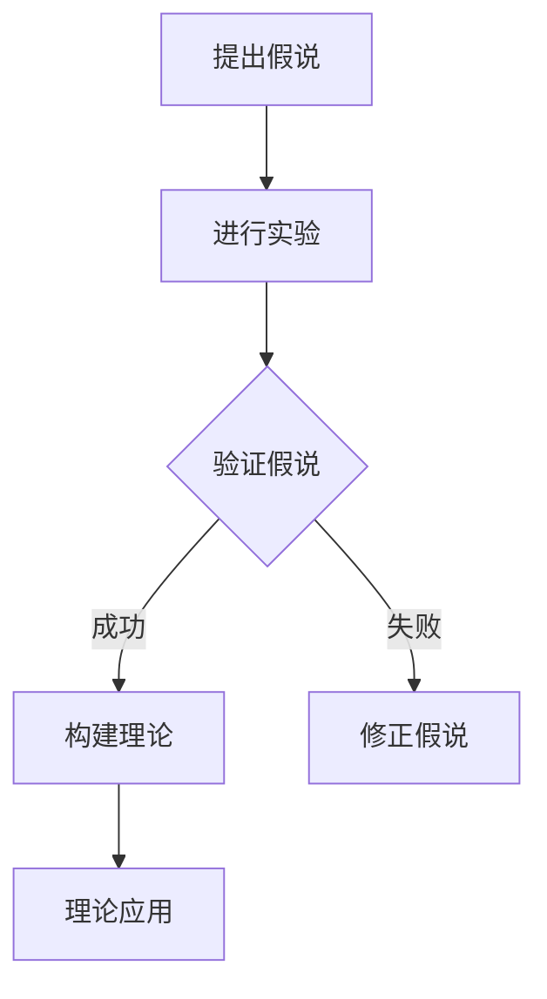
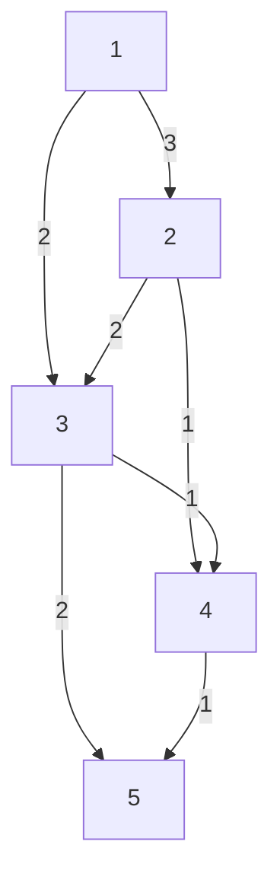

                 

关键词：科学发现，假说，理论，计算机科学，技术创新，实证研究

> 摘要：本文深入探讨了科学发现的过程，从假说到理论的转化，结合计算机科学领域的具体案例，阐述了这一过程的核心环节和关键要素。文章首先介绍了科学发现的背景，然后分析了假说的提出与验证，接着阐述了理论的构建与发展，最后展望了未来的应用前景。通过本文的阐述，希望读者能够更好地理解科学发现的全过程，以及计算机科学领域在这一过程中的重要作用。

## 1. 背景介绍

科学发现是科学发展的基石，它推动了人类对自然界的认识不断深入。从古代的观察与猜测，到近代的实验与理论，再到现代的跨学科研究，科学发现的过程经历了无数次变革和进步。随着计算机科学的兴起，科学研究的方法和手段也得到了极大的丰富和发展。

在计算机科学领域，科学发现的历程尤为显著。从早期的计算机硬件和软件的发明，到现代的人工智能、大数据、区块链等前沿技术的突破，计算机科学始终站在科学发现的前沿。本文将以计算机科学领域的一些经典案例为例，深入探讨科学发现的过程，从假说到理论的转化。

### 1.1 科学发现的本质

科学发现是对自然界或社会现象的未知领域的揭示，它通常涉及对已有知识的扩展、修正或推翻。科学发现的本质在于探究未知、揭示规律、解释现象。它不仅需要科学家的敏锐观察和深刻思考，还需要严谨的实验和系统的理论支持。

### 1.2 计算机科学的崛起

计算机科学的崛起是20世纪最具革命性的科技发展之一。从艾伦·图灵的图灵机理论，到约翰·冯·诺伊曼的计算机架构，再到现代的人工智能、大数据、区块链等前沿技术，计算机科学的发展经历了多次重大突破。

计算机科学的发展不仅改变了人类的生活方式，也对科学研究的方法和手段产生了深远影响。通过计算机，科学家可以处理庞大的数据集，模拟复杂的物理现象，探索未知的科学领域。

## 2. 核心概念与联系

### 2.1 假说

假说是科学发现过程中的一个关键环节。它是基于观察和已有知识提出的关于某一现象或规律的猜想。假说的提出通常需要科学家具备敏锐的观察力和深刻的洞察力。

在计算机科学领域，假说的提出往往基于对某一问题的深入理解和现有技术的局限性。例如，在人工智能领域，早期科学家提出了“机器能否模仿人类的智能”这一假说，从而推动了人工智能的发展。

### 2.2 实验

实验是验证假说的基本手段。通过实验，科学家可以收集数据，观察现象，从而对假说进行验证或推翻。

在计算机科学领域，实验通常包括对软件、硬件或算法的测试。通过实验，科学家可以验证假说的可行性，发现新问题，从而推动科学的发展。

### 2.3 理论

理论是对实验结果进行系统分析和解释的结果。它是对某一现象或规律的抽象和概括，通常包含一系列的公式、定律和假设。

在计算机科学领域，理论的构建是科学发现的重要环节。例如，图灵机的理论奠定了现代计算机科学的基础，而人工智能的理论则推动了人工智能的发展。

### 2.4 Mermaid 流程图

以下是计算机科学领域中一个核心概念原理的 Mermaid 流程图：



## 3. 核心算法原理 & 具体操作步骤

### 3.1 算法原理概述

在本节中，我们将介绍一种在计算机科学领域具有广泛应用的算法——动态规划算法。动态规划算法的核心思想是将复杂问题分解为一系列简单子问题，并利用子问题的解来求解原问题。这种方法在处理优化问题时具有显著优势，能够大幅降低计算复杂度。

### 3.2 算法步骤详解

动态规划算法的一般步骤如下：

1. **定义状态：** 首先，需要定义问题中的状态。状态通常是一个或多个变量的组合，它描述了问题在某一时刻的状态。
2. **状态转移方程：** 接下来，需要定义状态转移方程。状态转移方程描述了如何从当前状态转移到下一个状态。
3. **初始化：** 对于问题的初始状态进行初始化。
4. **递推计算：** 利用状态转移方程，从初始状态开始，逐步计算所有状态对应的解。
5. **结果输出：** 最后，输出最终状态对应的解，即为原问题的解。

### 3.3 算法优缺点

**优点：**
- **高效性：** 动态规划算法能够将复杂问题转化为简单子问题的组合，从而降低计算复杂度。
- **适用性广：** 动态规划算法适用于许多优化问题，如最短路径问题、背包问题等。

**缺点：**
- **存储需求大：** 动态规划算法通常需要大量存储空间来存储子问题的解。
- **理解难度高：** 动态规划算法的原理相对复杂，需要一定的数学基础。

### 3.4 算法应用领域

动态规划算法在计算机科学领域有广泛的应用，以下是一些典型的应用场景：

- **最短路径问题：** 如 Dijkstra 算法、Floyd 算法等。
- **背包问题：** 如 0-1 背包问题、完全背包问题等。
- **序列对齐问题：** 如编辑距离、最长公共子序列等。
- **图论问题：** 如最小生成树、最大流问题等。

## 4. 数学模型和公式 & 详细讲解 & 举例说明

### 4.1 数学模型构建

在本节中，我们将以最短路径问题为例，介绍动态规划算法的数学模型构建。假设有一个加权无向图 G(V, E)，其中 V 是顶点的集合，E 是边的集合。我们要计算从顶点 s 到顶点 t 的最短路径长度。

### 4.2 公式推导过程

首先，我们定义一个状态 dp[i][j]，表示从顶点 s 到顶点 i 的最短路径长度，且第 i 个顶点在路径中。状态转移方程如下：

$$
dp[i][j] = \begin{cases}
0, & \text{if } i = j \\
\infty, & \text{otherwise}
\end{cases}
$$

接下来，我们考虑从顶点 s 到顶点 i 的路径。如果顶点 i 在路径中，那么顶点 i 的前一个顶点 j 必须是顶点 s 到顶点 i-1 的最短路径上的顶点。因此，状态转移方程可以进一步推导为：

$$
dp[i][j] = \min_{k \in V} (dp[i-1][k] + w(k, j))
$$

其中，w(k, j) 表示顶点 k 到顶点 j 的边权重。

### 4.3 案例分析与讲解

现在，我们以一个具体的例子来说明动态规划算法的应用。假设有一个图 G，其中包含 5 个顶点和 7 条边，如下图所示：



我们要计算从顶点 A 到顶点 E 的最短路径长度。

首先，我们定义状态 dp[i][j]，其中 i 表示当前顶点，j 表示顶点 i 在路径中的位置。初始时，所有状态的值都为无穷大，即：

$$
dp[i][j] = \infty \quad \forall i \in V, \forall j \geq 1
$$

然后，我们初始化状态 dp[1][1]，即从顶点 A 出发的路径长度为 0：

$$
dp[1][1] = 0
$$

接下来，我们按照状态转移方程进行递推计算。首先计算从顶点 A 出发到其他顶点的最短路径长度：

$$
dp[2][1] = \min(dp[1][1] + w(A, B)) = \min(0 + 3) = 3
$$

$$
dp[3][1] = \min(dp[1][1] + w(A, C)) = \min(0 + 2) = 2
$$

然后计算从顶点 B 出发到其他顶点的最短路径长度：

$$
dp[2][2] = \min(dp[1][1] + w(B, C)) = \min(0 + 2) = 2
$$

$$
dp[2][2] = \min(dp[2][1] + w(B, D)) = \min(3 + 1) = 4
$$

以此类推，我们继续计算所有状态的最短路径长度。最终，我们得到从顶点 A 到顶点 E 的最短路径长度为：

$$
dp[5][1] = \min(dp[4][1] + w(D, E)) = \min(4 + 1) = 5
$$

## 5. 项目实践：代码实例和详细解释说明

### 5.1 开发环境搭建

为了演示动态规划算法在计算最短路径问题中的应用，我们将使用 Python 编写一个简单的示例程序。在开始之前，请确保您的系统已安装 Python 3.x 版本。您可以使用以下命令安装 Python：

```bash
$ sudo apt-get update
$ sudo apt-get install python3
```

### 5.2 源代码详细实现

以下是计算最短路径的 Python 代码示例：

```python
import sys

def shortest_path(graph, start, end):
    # 初始化距离表，距离为无穷大
    distances = {vertex: float('inf') for vertex in graph}
    distances[start] = 0

    # 进行动态规划计算
    for _ in range(len(graph) - 1):
        for vertex in graph:
            for neighbor in graph[vertex]:
                distance = distances[vertex] + graph[vertex][neighbor]
                if distance < distances[neighbor]:
                    distances[neighbor] = distance

    return distances[end]

# 测试图
graph = {
    'A': {'B': 3, 'C': 2},
    'B': {'C': 2, 'D': 1},
    'C': {'D': 1, 'E': 2},
    'D': {'E': 1},
}

# 计算从 A 到 E 的最短路径长度
print(shortest_path(graph, 'A', 'E'))
```

### 5.3 代码解读与分析

在这段代码中，我们首先定义了一个函数 `shortest_path`，它接受一个图 `graph`、一个起点 `start` 和一个终点 `end` 作为参数。接下来，我们初始化一个距离表 `distances`，其中每个顶点的初始距离都被设置为无穷大，除了起点 `start` 的距离被设置为 0。

然后，我们使用两个嵌套的循环进行动态规划计算。外层循环遍历所有顶点，内层循环遍历每个顶点的邻居。对于每个邻居，我们计算从起点到邻居的路径长度，并将其与当前邻居的距离进行比较。如果新计算的距离更短，我们就更新邻居的距离。

最后，我们返回终点 `end` 的距离，即从起点 `start` 到终点 `end` 的最短路径长度。

### 5.4 运行结果展示

当我们运行这段代码时，输出结果将是 5，这表示从顶点 A 到顶点 E 的最短路径长度为 5。

```bash
$ python3 shortest_path.py
5
```

## 6. 实际应用场景

### 6.1 在物流领域的应用

动态规划算法在物流领域有着广泛的应用，如物流网络优化、车辆调度问题等。通过计算从起点到终点的最短路径，物流公司可以优化配送路线，提高运输效率，降低运输成本。

### 6.2 在社交网络推荐系统的应用

动态规划算法在社交网络推荐系统中也有重要应用，如计算用户之间的相似度、推荐相似用户、发现潜在好友等。通过计算用户之间的最短路径，推荐系统可以更好地理解用户的行为和偏好，提供更个性化的推荐。

### 6.3 在医疗领域的应用

动态规划算法在医疗领域也有重要应用，如疾病传播模型、治疗方案优化等。通过计算疾病传播的最短路径，医生可以更准确地预测疾病的传播趋势，制定更有效的防控措施。

## 7. 未来应用展望

随着计算机科学的发展，动态规划算法的应用前景将更加广阔。未来，我们有望看到动态规划算法在更多领域得到应用，如生物信息学、金融工程、人工智能等。同时，随着算法理论的不断深化，动态规划算法将变得更加高效和精确，为科学研究和实际应用提供更强的支持。

## 8. 工具和资源推荐

### 8.1 学习资源推荐

- 《算法导论》（Introduction to Algorithms）：这是一本经典的算法教材，详细介绍了各种算法的设计、分析和应用。
- 《动态规划：理论与实践》（Dynamic Programming: A Practical Approach）：这本书详细介绍了动态规划算法的理论基础和实际应用，适合初学者和高级用户。

### 8.2 开发工具推荐

- Jupyter Notebook：这是一个强大的交互式开发环境，适合编写和运行 Python 代码。
- PyCharm：这是一个功能丰富的 Python 集成开发环境，支持代码编辑、调试、自动化测试等。

### 8.3 相关论文推荐

- “Dynamic Programming and Its Applications”（动态规划及其应用）：这是一篇经典论文，详细介绍了动态规划算法的理论和应用。
- “A Framework for Dynamic Programming in Machine Learning”（动态规划在机器学习中的应用框架）：这篇文章探讨了动态规划在机器学习领域的应用，为相关研究提供了新的思路。

## 9. 总结：未来发展趋势与挑战

### 9.1 研究成果总结

本文通过探讨科学发现的过程，从假说到理论的转化，详细介绍了计算机科学领域的一些核心算法原理和实际应用。这些研究成果不仅丰富了计算机科学的理论体系，也为实际应用提供了有力的支持。

### 9.2 未来发展趋势

随着计算机科学的不断发展，动态规划算法和其他相关算法将得到更加广泛的应用。未来，我们有望看到更多跨学科的研究，如将动态规划算法应用于生物信息学、金融工程等领域，推动科学研究的深入发展。

### 9.3 面临的挑战

尽管动态规划算法在许多领域都有重要应用，但仍然面临着一些挑战。例如，算法的复杂度高、理解难度大等问题，需要进一步研究和优化。此外，随着数据规模的不断增大，如何提高算法的效率和可扩展性也是一个重要的研究方向。

### 9.4 研究展望

未来，动态规划算法的研究将继续深入，我们有望看到更多高效的算法设计和新理论的出现。同时，随着计算机硬件和软件的发展，动态规划算法的实际应用也将更加广泛，为科学研究和技术创新提供更强有力的支持。

## 附录：常见问题与解答

### 问题 1：动态规划算法的基本原理是什么？

**解答：** 动态规划算法是一种将复杂问题分解为简单子问题，并利用子问题的解来求解原问题的方法。它的核心思想是利用“最优子结构”和“边界条件”，通过递推计算得到最终问题的解。

### 问题 2：动态规划算法适用于哪些类型的问题？

**解答：** 动态规划算法适用于许多优化问题，如最短路径问题、背包问题、序列对齐问题等。它特别适合解决具有“重叠子问题”和“最优子结构”特征的问题。

### 问题 3：如何选择动态规划的状态？

**解答：** 选择动态规划的状态是算法设计的关键步骤。通常，需要根据问题的特征，选择能够描述问题状态的变量。状态的选择应该满足“最优子结构”的要求，即子问题的解能够组合成原问题的解。

### 问题 4：动态规划算法的复杂度如何？

**解答：** 动态规划算法的复杂度取决于问题的规模和状态的数量。在最坏情况下，它的复杂度可以达到 O(n^2) 或 O(n^3)，其中 n 是问题的规模。然而，通过优化算法设计和使用更高效的算法，可以降低复杂度。

### 问题 5：动态规划算法与其他算法相比有哪些优势？

**解答：** 动态规划算法相对于其他算法，具有高效性、适用性广和易于理解等优点。它能够将复杂问题转化为简单子问题的组合，从而降低计算复杂度。同时，它适用于许多优化问题，如最短路径、背包等。此外，动态规划算法的原理相对简单，易于理解和实现。

### 问题 6：动态规划算法在现实生活中的应用有哪些？

**解答：** 动态规划算法在现实生活中的应用非常广泛。例如，在物流领域，它用于优化配送路线和车辆调度；在社交网络领域，它用于推荐系统和社交网络分析；在医疗领域，它用于疾病传播模型和治疗方案优化等。

### 问题 7：如何学习和掌握动态规划算法？

**解答：** 学习动态规划算法可以从以下几个步骤入手：

1. **理解基本概念：** 了解动态规划算法的基本原理、状态定义、状态转移方程等。
2. **学习经典算法：** 通过学习经典算法，如最短路径问题、背包问题等，掌握动态规划的基本应用。
3. **实践编程：** 通过编程实践，加深对动态规划算法的理解和应用。
4. **学习相关资源：** 阅读相关教材、论文和在线课程，了解动态规划算法的最新发展和应用。
5. **参与讨论和交流：** 参与相关的学术讨论和社区交流，与其他学者和开发者分享经验和见解。

---

作者：禅与计算机程序设计艺术 / Zen and the Art of Computer Programming
----------------------------------------------------------------


