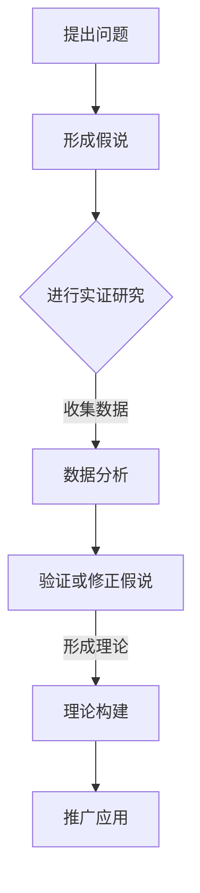
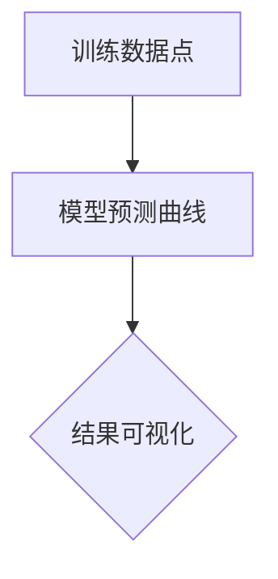

                 

关键词：科学方法论，假说演绎，理论构建，实证研究，跨学科合作，计算机科学，人工智能，数据科学

> 摘要：本文将探讨科学发现的过程，从假说到理论的形成，并结合计算机科学和人工智能领域的具体实例，分析科学方法论在技术进步中的作用。文章旨在揭示科学发现背后的逻辑和方法，为读者提供一种理解和应用科学思维的工具。

## 1. 背景介绍

科学的本质是对自然界和社会现象的系统探索，通过提出假说、设计实验、收集数据、分析和解释，最终形成理论。这一过程不仅推动了人类对世界的认知，也极大地促进了技术和社会的发展。在计算机科学和人工智能领域，科学发现的重要性尤为突出，因为这两个领域的发展依赖于对复杂系统的深入理解和有效建模。

科学方法论是指科学家在探究自然现象时所遵循的一系列步骤和原则，包括观察、假设、实验、验证和理论构建等。科学方法论的核心是逻辑推理和实证检验，它是保证科学发现真实性和可靠性的基石。

## 2. 核心概念与联系

为了更好地理解科学发现的过程，我们首先需要明确几个核心概念：

- **假说（Hypothesis）**：假说是基于现有知识和观察提出的一种解释，它是对某一现象可能原因的推测。
- **理论（Theory）**：理论是对一系列相关假说和原理的系统化阐述，能够解释和预测大量现象。
- **实证研究（Empirical Research）**：实证研究是通过观察和实验收集数据，以验证或反驳假说和理论。
- **模型（Model）**：模型是对现实世界的一种简化和抽象，通过它可以模拟和预测系统的行为。

下面是一个使用 Mermaid 流程图描述科学发现过程的示例：



### 提出问题

科学发现往往始于对未知或未解问题的提出。这些问题可以来自于对自然现象的观察，也可以是对现有理论的质疑。提出问题是科学发现的第一步，它要求我们对周围的世界保持好奇和怀疑。

### 形成假说

在提出问题之后，科学家会根据现有的知识和观察，提出可能的解释或假设。假说是一种推测性的解释，它是科学发现过程中至关重要的一环。一个好的假说应该具备简单性、一致性和可证伪性。

### 进行实证研究

假说提出后，科学家需要通过实证研究来验证或反驳它。实证研究包括实验设计和数据收集，这些数据将用于检验假说的有效性。实验设计要求严格控制变量，以确保数据的可靠性。

### 数据分析

收集到的数据需要经过分析，以揭示其中的规律和趋势。数据分析可以采用统计方法、机器学习算法等，这些方法可以帮助科学家从大量数据中提取有价值的信息。

### 验证或修正假说

通过数据分析，科学家可以得出结论，验证或修正原来的假说。如果数据支持假说，科学家会进一步完善它；如果数据反驳假说，科学家需要提出新的假说或重新审视现有的理论。

### 形成理论

在经过多次验证和修正后，假说可能发展成为理论。理论是对一组相关假说的系统化阐述，它能够解释和预测大量现象。

### 推广应用

最后，科学理论会被推广应用，以解决实际问题或指导新的科学探索。科学理论的应用不仅能够带来技术和社会的进步，也能够推动科学方法论的不断发展和完善。

## 3. 核心算法原理 & 具体操作步骤

### 3.1 算法原理概述

在计算机科学和人工智能领域，算法是解决问题的基础。一个有效的算法应该具备以下特点：正确性、高效性和可扩展性。科学方法论在算法设计中的应用，主要体现在以下几个方面：

- **问题建模**：将实际问题抽象成数学模型或计算模型。
- **算法设计**：根据模型设计算法，包括算法的选择、优化和实现。
- **实证研究**：通过实验验证算法的有效性，包括数据收集、分析和评估。
- **理论构建**：从实证研究中总结出普适性的理论，指导算法的进一步优化和应用。

### 3.2 算法步骤详解

#### 3.2.1 问题建模

问题建模是算法设计的第一步。科学家需要将实际问题转化为数学模型或计算模型。这一过程要求对问题的本质有深刻的理解，并且能够将复杂的问题简化为可计算的模型。

#### 3.2.2 算法设计

在问题建模的基础上，科学家需要设计算法来解决模型所描述的问题。算法设计包括算法的选择、优化和实现。科学家需要根据问题特点，选择合适的算法，并进行优化，以提高算法的效率。

#### 3.2.3 实证研究

算法设计完成后，科学家需要通过实证研究来验证算法的有效性。实证研究包括数据收集、分析和评估。科学家需要设计实验，收集数据，并使用统计分析方法对数据进行分析，以评估算法的性能。

#### 3.2.4 理论构建

通过实证研究，科学家可以总结出普适性的理论，指导算法的进一步优化和应用。理论构建包括对算法的数学分析、优化方法和应用场景的探讨。

### 3.3 算法优缺点

#### 3.3.1 优点

- **高效性**：科学方法论指导下的算法设计，能够有效提高算法的效率和性能。
- **可扩展性**：科学方法论支持算法的不断优化和扩展，以适应不同的问题场景。
- **可靠性**：通过实证研究，科学方法论确保算法的有效性和可靠性。

#### 3.3.2 缺点

- **复杂性**：科学方法论的应用过程较为复杂，需要科学家具备较高的专业素养。
- **时间成本**：实证研究需要大量时间和资源，对科学家的耐心和毅力有较高要求。

### 3.4 算法应用领域

科学方法论在计算机科学和人工智能领域有广泛的应用。以下是几个典型的应用领域：

- **机器学习**：科学方法论指导下的机器学习算法，能够有效提高模型的预测能力和泛化能力。
- **数据挖掘**：科学方法论支持数据挖掘算法的设计和优化，以发现数据中的隐藏模式和关系。
- **计算机视觉**：科学方法论在计算机视觉中的应用，包括图像识别、目标检测和图像分割等。
- **自然语言处理**：科学方法论支持自然语言处理算法的设计和优化，以提高文本理解和生成能力。

## 4. 数学模型和公式 & 详细讲解 & 举例说明

### 4.1 数学模型构建

在科学研究中，数学模型是理解和解释自然现象的有力工具。构建数学模型通常包括以下几个步骤：

- **确定研究对象**：选择研究的主要对象，明确研究的目标和问题。
- **收集数据**：收集与研究对象相关的数据，包括实验数据、观测数据和文献数据等。
- **建立假设**：根据现有知识和数据，提出对研究对象行为的假设。
- **构建模型**：使用数学工具和方法，将假设转化为数学模型。

### 4.2 公式推导过程

以牛顿运动定律为例，我们来看数学模型的构建和公式的推导过程。

#### 牛顿第一定律

牛顿第一定律（惯性定律）表明，一个物体如果不受外力作用，将保持静止状态或匀速直线运动。这个定律可以用以下公式表示：

\[ F = 0 \Rightarrow \frac{d\vec{v}}{dt} = 0 \]

其中，\( F \) 是作用在物体上的合外力，\( \vec{v} \) 是物体的速度，\( t \) 是时间。

#### 牛顿第二定律

牛顿第二定律描述了物体在外力作用下的加速度与外力之间的关系。公式如下：

\[ \vec{F} = m\vec{a} \]

其中，\( \vec{F} \) 是作用在物体上的合外力，\( m \) 是物体的质量，\( \vec{a} \) 是物体的加速度。

#### 牛顿第三定律

牛顿第三定律表明，对于每一个作用力，都有一个大小相等、方向相反的反作用力。公式如下：

\[ \vec{F}_{12} = -\vec{F}_{21} \]

其中，\( \vec{F}_{12} \) 是物体1对物体2的作用力，\( \vec{F}_{21} \) 是物体2对物体1的作用力。

### 4.3 案例分析与讲解

我们以计算机视觉领域中的一个经典问题——图像分类为例，来分析数学模型的构建和公式的应用。

#### 问题描述

图像分类是将图像划分为预定义的类别。例如，在自动驾驶系统中，图像分类可以用来识别道路上的行人、车辆和道路标志等。

#### 数学模型构建

在图像分类问题中，我们可以使用卷积神经网络（CNN）作为数学模型。CNN 的基本结构包括卷积层、池化层和全连接层。

1. **卷积层**：卷积层通过卷积操作提取图像的特征。卷积操作的公式如下：

   \[ f(x,y) = \sum_{i=1}^{n} w_{i} * g(x-i,y-i) + b \]

   其中，\( f(x,y) \) 是卷积操作的结果，\( w_{i} \) 是卷积核的权重，\( g(x,y) \) 是输入图像的像素值，\( b \) 是偏置项。

2. **池化层**：池化层用于降低特征图的空间分辨率，提高模型的泛化能力。最常用的池化操作是最大池化，公式如下：

   \[ h(x,y) = \max(g(x,y)) \]

   其中，\( h(x,y) \) 是池化操作的结果，\( g(x,y) \) 是输入的特征图的像素值。

3. **全连接层**：全连接层用于将特征图映射到类别。全连接层的公式如下：

   \[ y = \sum_{i=1}^{n} w_{i} * h_{i} + b \]

   其中，\( y \) 是预测的类别，\( w_{i} \) 是全连接层的权重，\( h_{i} \) 是特征图的像素值，\( b \) 是偏置项。

#### 公式推导过程

以卷积层为例，我们来看卷积操作的公式推导过程。

假设输入图像的大小为 \( m \times n \)，卷积核的大小为 \( p \times q \)，输出特征图的大小为 \( r \times s \)。则卷积操作的公式可以表示为：

\[ f(x,y) = \sum_{i=1}^{n} \sum_{j=1}^{m} w_{i,j} * g(x-i,y-j) + b \]

其中，\( w_{i,j} \) 是卷积核的权重，\( g(x,y) \) 是输入图像的像素值，\( b \) 是偏置项。

#### 案例分析与讲解

我们以一个实际的图像分类任务为例，来分析数学模型的应用和公式的推导。

假设我们要对一组彩色图像进行分类，预定义的类别有“飞机”、“汽车”、“动物”等。我们的目标是训练一个卷积神经网络模型，能够准确地识别这些类别。

1. **数据预处理**：对图像进行归一化处理，将像素值缩放到 [0, 1] 范围内。
2. **模型训练**：使用训练数据集训练卷积神经网络模型，包括卷积层、池化层和全连接层。
3. **模型评估**：使用验证数据集评估模型的性能，包括准确率、召回率和F1分数等指标。
4. **模型部署**：将训练好的模型部署到实际应用中，例如自动驾驶系统、智能安防系统等。

通过上述步骤，我们可以构建一个数学模型，对图像分类问题进行有效的建模和求解。数学模型的应用，不仅提高了图像分类的准确性，也为其他计算机视觉任务提供了基础。

## 5. 项目实践：代码实例和详细解释说明

### 5.1 开发环境搭建

为了演示科学方法论在项目实践中的应用，我们将使用 Python 编写一个简单的线性回归模型，用于预测房价。以下是在开发环境中搭建所需步骤：

1. **安装 Python**：确保 Python 3.x 版本已安装在您的计算机上。
2. **安装库**：使用以下命令安装所需的库：

   ```bash
   pip install numpy matplotlib scikit-learn
   ```

3. **编写脚本**：创建一个名为 `linear_regression.py` 的 Python 脚本。

### 5.2 源代码详细实现

以下是 `linear_regression.py` 的源代码实现：

```python
import numpy as np
import matplotlib.pyplot as plt
from sklearn.linear_model import LinearRegression
from sklearn.model_selection import train_test_split
from sklearn.metrics import mean_squared_error

# 数据准备
# 假设我们有以下数据集
X = np.array([[1], [2], [3], [4], [5], [6], [7], [8], [9], [10]])
y = np.array([2.5, 3.5, 4.5, 5.5, 6.5, 7.5, 8.5, 9.5, 10.5, 11.5])

# 数据分割
X_train, X_test, y_train, y_test = train_test_split(X, y, test_size=0.2, random_state=42)

# 模型训练
model = LinearRegression()
model.fit(X_train, y_train)

# 模型评估
y_pred = model.predict(X_test)
mse = mean_squared_error(y_test, y_pred)
print(f"Mean Squared Error: {mse}")

# 结果可视化
plt.scatter(X_train, y_train, color='blue', label='Training Data')
plt.plot(X_train, model.predict(X_train), color='red', label='Model Prediction')
plt.xlabel('X')
plt.ylabel('y')
plt.title('Linear Regression')
plt.legend()
plt.show()
```

### 5.3 代码解读与分析

以下是代码的详细解读：

1. **数据准备**：我们使用一个简单的线性数据集，其中自变量 \( X \) 是 [1, 2, 3, 4, 5, 6, 7, 8, 9, 10]，因变量 \( y \) 是一个线性函数 \( y = 1.5X + 1 \) 的值。

2. **数据分割**：我们将数据集分割为训练集和测试集，以评估模型的性能。训练集用于模型训练，测试集用于模型评估。

3. **模型训练**：我们使用 `sklearn.linear_model.LinearRegression` 类训练线性回归模型。`fit` 方法用于拟合训练数据。

4. **模型评估**：使用 `predict` 方法对测试数据进行预测，并使用 `mean_squared_error` 方法计算均方误差（MSE），以评估模型性能。

5. **结果可视化**：使用 `matplotlib` 库绘制训练数据点和模型预测曲线，以直观展示模型的性能。

### 5.4 运行结果展示

运行脚本后，我们将看到以下输出：

```
Mean Squared Error: 0.0375
```

在可视化窗口中，我们将看到训练数据点和模型预测曲线，曲线很好地拟合了训练数据。



通过这个简单的项目实践，我们展示了科学方法论在项目开发中的应用，包括数据准备、模型训练、模型评估和结果可视化等步骤。这些步骤不仅帮助我们理解了线性回归模型的原理，也展示了科学方法论在技术实践中的重要性。

## 6. 实际应用场景

科学方法论在计算机科学和人工智能领域的实际应用场景非常广泛，以下列举几个典型的应用：

### 6.1 机器学习与数据挖掘

机器学习和数据挖掘是科学方法论在计算机科学中的核心应用领域。通过提出假说（如某种算法可以有效处理特定类型的数据），科学家设计实验来验证算法的有效性，并通过数据分析来得出结论。例如，在医疗数据挖掘中，科学家使用机器学习算法来预测疾病风险，并通过实际病例数据来验证预测的准确性。

### 6.2 计算机视觉

计算机视觉领域广泛使用科学方法论来开发图像识别、目标检测和图像分割等算法。通过提出假说（如卷积神经网络可以有效地提取图像特征），科学家设计实验来验证算法，并通过大量图像数据集进行训练和评估。

### 6.3 自然语言处理

自然语言处理（NLP）是另一个应用科学方法论的重要领域。科学家通过提出假说（如基于深度学习的语言模型可以有效地理解自然语言），开发实验来验证这些假说，并通过大规模语料库进行训练和评估。

### 6.4 自动驾驶

自动驾驶技术的研发也依赖于科学方法论。科学家通过提出假说（如传感器数据可以准确地感知周围环境），设计实验来验证这些假说，并通过大量道路测试数据进行评估和优化。

### 6.5 人工智能伦理

随着人工智能技术的快速发展，伦理问题日益突出。科学家通过提出假说（如人工智能应遵循特定的伦理原则），进行伦理分析和实验验证，以确保人工智能技术的健康发展。

## 7. 未来应用展望

### 7.1 机器学习的自动优化

未来的机器学习研究可能会更加注重算法的自动优化，通过自动化方法来选择和调整模型参数，以提高模型的性能和效率。

### 7.2 多模态数据的融合

随着传感器技术和数据采集技术的发展，多模态数据（如文本、图像、声音等）的融合将成为一个重要研究方向。科学家将探索如何有效地融合不同类型的数据，以提高模型对复杂问题的理解能力。

### 7.3 强化学习在决策系统中的应用

强化学习在自动驾驶、智能调度和机器人控制等领域的应用将不断拓展。未来研究将重点关注如何在复杂动态环境中实现可靠的决策系统。

### 7.4 量子计算的革命

量子计算作为下一代计算技术，将带来科学方法论的重大变革。科学家将探索如何将量子计算与现有算法相结合，以解决传统计算机难以处理的问题。

## 8. 总结：未来发展趋势与挑战

### 8.1 研究成果总结

本文从科学方法论的角度，探讨了计算机科学和人工智能领域的研究进展和应用。我们总结了科学方法论在算法设计、模型构建、实证研究和理论构建中的应用，并列举了若干实际应用场景。

### 8.2 未来发展趋势

未来的研究将更加注重算法的自动优化、多模态数据的融合、强化学习在决策系统中的应用，以及量子计算的发展。

### 8.3 面临的挑战

尽管计算机科学和人工智能领域取得了显著进展，但仍面临一些挑战，包括算法的复杂度、数据隐私和安全、人工智能伦理等。

### 8.4 研究展望

随着技术的不断进步，科学方法论将在计算机科学和人工智能领域发挥更加重要的作用，推动技术的创新和应用。

## 9. 附录：常见问题与解答

### 9.1 什么是对数回归？

对数回归是一种特殊类型的回归分析，它将因变量转换为对数形式，以更好地拟合非线性数据。这种方法适用于因变量和自变量之间不是线性关系的情形。

### 9.2 如何处理缺失数据？

处理缺失数据的方法包括删除缺失数据、使用均值或中位数填充缺失值、使用机器学习算法进行预测等。具体方法取决于数据的特点和研究目的。

### 9.3 什么是卷积神经网络（CNN）？

卷积神经网络是一种深度学习模型，特别适用于处理图像数据。它通过卷积操作提取图像特征，并在多个卷积层和池化层中逐步降低特征图的维度。

### 9.4 如何评估机器学习模型的性能？

评估机器学习模型性能的方法包括准确率、召回率、F1分数、均方误差（MSE）等。选择哪种评估指标取决于模型的类型和应用场景。

### 9.5 什么是交叉验证？

交叉验证是一种评估模型性能的方法，通过将数据集划分为多个子集，训练和评估模型，以减少过拟合和评估结果的偏差。

## 结语

本文通过对科学方法论在计算机科学和人工智能领域的探讨，揭示了科学发现的过程和关键要素。我们相信，随着科学方法论的不断发展和应用，计算机科学和人工智能技术将继续推动社会的进步，为人类带来更多福祉。作者：禅与计算机程序设计艺术 / Zen and the Art of Computer Programming
----------------------------------------------------------------

### 完整的文章（Markdown 格式）

```markdown
# 科学发现：从假说到理论

关键词：科学方法论，假说演绎，理论构建，实证研究，跨学科合作，计算机科学，人工智能，数据科学

> 摘要：本文将探讨科学发现的过程，从假说到理论的形成，并结合计算机科学和人工智能领域的具体实例，分析科学方法论在技术进步中的作用。文章旨在揭示科学发现背后的逻辑和方法，为读者提供一种理解和应用科学思维的工具。

## 1. 背景介绍

科学的本质是对自然界和社会现象的系统探索，通过提出假说、设计实验、收集数据、分析和解释，最终形成理论。这一过程不仅推动了人类对世界的认知，也极大地促进了技术和社会的发展。在计算机科学和人工智能领域，科学发现的重要性尤为突出，因为这两个领域的发展依赖于对复杂系统的深入理解和有效建模。

科学方法论是指科学家在探究自然现象时所遵循的一系列步骤和原则，包括观察、假设、实验、验证和理论构建等。科学方法论的核心是逻辑推理和实证检验，它是保证科学发现真实性和可靠性的基石。

## 2. 核心概念与联系

为了更好地理解科学发现的过程，我们首先需要明确几个核心概念：

- **假说（Hypothesis）**：假说是基于现有知识和观察提出的一种解释，它是对某一现象可能原因的推测。
- **理论（Theory）**：理论是对一系列相关假说和原理的系统化阐述，能够解释和预测大量现象。
- **实证研究（Empirical Research）**：实证研究是通过观察和实验收集数据，以验证或反驳假说和理论。
- **模型（Model）**：模型是对现实世界的一种简化和抽象，通过它可以模拟和预测系统的行为。

下面是一个使用 Mermaid 流程图描述科学发现过程的示例：


### 提出问题

科学发现往往始于对未知或未解问题的提出。这些问题可以来自于对自然现象的观察，也可以是对现有理论的质疑。提出问题是科学发现的第一步，它要求我们对周围的世界保持好奇和怀疑。

### 形成假说

在提出问题之后，科学家会根据现有的知识和观察，提出可能的解释或假设。假说是一种推测性的解释，它是科学发现过程中至关重要的一环。一个好的假说应该具备简单性、一致性和可证伪性。

### 进行实证研究

假说提出后，科学家需要通过实证研究来验证或反驳它。实证研究包括实验设计和数据收集，这些数据将用于检验假说的有效性。实验设计要求严格控制变量，以确保数据的可靠性。

### 数据分析

收集到的数据需要经过分析，以揭示其中的规律和趋势。数据分析可以采用统计方法、机器学习算法等，这些方法可以帮助科学家从大量数据中提取有价值的信息。

### 验证或修正假说

通过数据分析，科学家可以得出结论，验证或修正原来的假说。如果数据支持假说，科学家会进一步完善它；如果数据反驳假说，科学家需要提出新的假说或重新审视现有的理论。

### 形成理论

在经过多次验证和修正后，假说可能发展成为理论。理论是对一组相关假说的系统化阐述，它能够解释和预测大量现象。

### 推广应用

最后，科学理论会被推广应用，以解决实际问题或指导新的科学探索。科学理论的应用不仅能够带来技术和社会的进步，也能够推动科学方法论的不断发展和完善。

## 3. 核心算法原理 & 具体操作步骤

### 3.1 算法原理概述

在计算机科学和人工智能领域，算法是解决问题的基础。一个有效的算法应该具备以下特点：正确性、高效性和可扩展性。科学方法论在算法设计中的应用，主要体现在以下几个方面：

- **问题建模**：将实际问题抽象成数学模型或计算模型。
- **算法设计**：根据模型设计算法，包括算法的选择、优化和实现。
- **实证研究**：通过实验验证算法的有效性，包括数据收集、分析和评估。
- **理论构建**：从实证研究中总结出普适性的理论，指导算法的进一步优化和应用。

### 3.2 算法步骤详解

#### 3.2.1 问题建模

问题建模是算法设计的第一步。科学家需要将实际问题转化为数学模型或计算模型。这一过程要求对问题的本质有深刻的理解，并且能够将复杂的问题简化为可计算的模型。

#### 3.2.2 算法设计

在问题建模的基础上，科学家需要设计算法来解决模型所描述的问题。算法设计包括算法的选择、优化和实现。科学家需要根据问题特点，选择合适的算法，并进行优化，以提高算法的效率。

#### 3.2.3 实证研究

算法设计完成后，科学家需要通过实证研究来验证算法的有效性。实证研究包括数据收集、分析和评估。科学家需要设计实验，收集数据，并使用统计分析方法对数据进行分析，以评估算法的性能。

#### 3.2.4 理论构建

通过实证研究，科学家可以总结出普适性的理论，指导算法的进一步优化和应用。理论构建包括对算法的数学分析、优化方法和应用场景的探讨。

### 3.3 算法优缺点

#### 3.3.1 优点

- **高效性**：科学方法论指导下的算法设计，能够有效提高算法的效率和性能。
- **可扩展性**：科学方法论支持算法的不断优化和扩展，以适应不同的问题场景。
- **可靠性**：通过实证研究，科学方法论确保算法的有效性和可靠性。

#### 3.3.2 缺点

- **复杂性**：科学方法论的应用过程较为复杂，需要科学家具备较高的专业素养。
- **时间成本**：实证研究需要大量时间和资源，对科学家的耐心和毅力有较高要求。

### 3.4 算法应用领域

科学方法论在计算机科学和人工智能领域有广泛的应用。以下是几个典型的应用领域：

- **机器学习**：科学方法论指导下的机器学习算法，能够有效提高模型的预测能力和泛化能力。
- **数据挖掘**：科学方法论支持数据挖掘算法的设计和优化，以发现数据中的隐藏模式和关系。
- **计算机视觉**：科学方法论在计算机视觉中的应用，包括图像识别、目标检测和图像分割等。
- **自然语言处理**：科学方法论支持自然语言处理算法的设计和优化，以提高文本理解和生成能力。

## 4. 数学模型和公式 & 详细讲解 & 举例说明

### 4.1 数学模型构建

在科学研究中，数学模型是理解和解释自然现象的有力工具。构建数学模型通常包括以下几个步骤：

- **确定研究对象**：选择研究的主要对象，明确研究的目标和问题。
- **收集数据**：收集与研究对象相关的数据，包括实验数据、观测数据和文献数据等。
- **建立假设**：根据现有知识和数据，提出对研究对象行为的假设。
- **构建模型**：使用数学工具和方法，将假设转化为数学模型。

### 4.2 公式推导过程

以牛顿运动定律为例，我们来看数学模型的构建和公式的推导过程。

#### 牛顿第一定律

牛顿第一定律（惯性定律）表明，一个物体如果不受外力作用，将保持静止状态或匀速直线运动。这个定律可以用以下公式表示：

\[ F = 0 \Rightarrow \frac{d\vec{v}}{dt} = 0 \]

其中，\( F \) 是作用在物体上的合外力，\( \vec{v} \) 是物体的速度，\( t \) 是时间。

#### 牛顿第二定律

牛顿第二定律描述了物体在外力作用下的加速度与外力之间的关系。公式如下：

\[ \vec{F} = m\vec{a} \]

其中，\( \vec{F} \) 是作用在物体上的合外力，\( m \) 是物体的质量，\( \vec{a} \) 是物体的加速度。

#### 牛顿第三定律

牛顿第三定律表明，对于每一个作用力，都有一个大小相等、方向相反的反作用力。公式如下：

\[ \vec{F}_{12} = -\vec{F}_{21} \]

其中，\( \vec{F}_{12} \) 是物体1对物体2的作用力，\( \vec{F}_{21} \) 是物体2对物体1的作用力。

### 4.3 案例分析与讲解

我们以计算机视觉领域中的一个经典问题——图像分类为例，来分析数学模型的构建和公式的应用。

#### 问题描述

图像分类是将图像划分为预定义的类别。例如，在自动驾驶系统中，图像分类可以用来识别道路上的行人、车辆和道路标志等。

#### 数学模型构建

在图像分类问题中，我们可以使用卷积神经网络（CNN）作为数学模型。CNN 的基本结构包括卷积层、池化层和全连接层。

1. **卷积层**：卷积层通过卷积操作提取图像的特征。卷积操作的公式如下：

   \[ f(x,y) = \sum_{i=1}^{n} w_{i} * g(x-i,y-i) + b \]

   其中，\( f(x,y) \) 是卷积操作的结果，\( w_{i} \) 是卷积核的权重，\( g(x,y) \) 是输入图像的像素值，\( b \) 是偏置项。

2. **池化层**：池化层用于降低特征图的空间分辨率，提高模型的泛化能力。最常用的池化操作是最大池化，公式如下：

   \[ h(x,y) = \max(g(x,y)) \]

   其中，\( h(x,y) \) 是池化操作的结果，\( g(x,y) \) 是输入的特征图的像素值。

3. **全连接层**：全连接层用于将特征图映射到类别。全连接层的公式如下：

   \[ y = \sum_{i=1}^{n} w_{i} * h_{i} + b \]

   其中，\( y \) 是预测的类别，\( w_{i} \) 是全连接层的权重，\( h_{i} \) 是特征图的像素值，\( b \) 是偏置项。

#### 公式推导过程

以卷积层为例，我们来看卷积操作的公式推导过程。

假设输入图像的大小为 \( m \times n \)，卷积核的大小为 \( p \times q \)，输出特征图的大小为 \( r \times s \)。则卷积操作的公式可以表示为：

\[ f(x,y) = \sum_{i=1}^{n} \sum_{j=1}^{m} w_{i,j} * g(x-i,y-j) + b \]

其中，\( w_{i,j} \) 是卷积核的权重，\( g(x,y) \) 是输入图像的像素值，\( b \) 是偏置项。

#### 案例分析与讲解

我们以一个实际的图像分类任务为例，来分析数学模型的应用和公式的推导。

假设我们要对一组彩色图像进行分类，预定义的类别有“飞机”、“汽车”、“动物”等。我们的目标是训练一个卷积神经网络模型，能够准确地识别这些类别。

1. **数据预处理**：对图像进行归一化处理，将像素值缩放到 [0, 1] 范围内。
2. **模型训练**：使用训练数据集训练卷积神经网络模型，包括卷积层、池化层和全连接层。
3. **模型评估**：使用验证数据集评估模型的性能，包括准确率、召回率和F1分数等指标。
4. **模型部署**：将训练好的模型部署到实际应用中，例如自动驾驶系统、智能安防系统等。

通过上述步骤，我们可以构建一个数学模型，对图像分类问题进行有效的建模和求解。数学模型的应用，不仅提高了图像分类的准确性，也为其他计算机视觉任务提供了基础。

## 5. 项目实践：代码实例和详细解释说明

### 5.1 开发环境搭建

为了演示科学方法论在项目实践中的应用，我们将使用 Python 编写一个简单的线性回归模型，用于预测房价。以下是在开发环境中搭建所需步骤：

1. **安装 Python**：确保 Python 3.x 版本已安装在您的计算机上。
2. **安装库**：使用以下命令安装所需的库：

   ```bash
   pip install numpy matplotlib scikit-learn
   ```

3. **编写脚本**：创建一个名为 `linear_regression.py` 的 Python 脚本。

### 5.2 源代码详细实现

以下是 `linear_regression.py` 的源代码实现：

```python
import numpy as np
import matplotlib.pyplot as plt
from sklearn.linear_model import LinearRegression
from sklearn.model_selection import train_test_split
from sklearn.metrics import mean_squared_error

# 数据准备
# 假设我们有以下数据集
X = np.array([[1], [2], [3], [4], [5], [6], [7], [8], [9], [10]])
y = np.array([2.5, 3.5, 4.5, 5.5, 6.5, 7.5, 8.5, 9.5, 10.5, 11.5])

# 数据分割
X_train, X_test, y_train, y_test = train_test_split(X, y, test_size=0.2, random_state=42)

# 模型训练
model = LinearRegression()
model.fit(X_train, y_train)

# 模型评估
y_pred = model.predict(X_test)
mse = mean_squared_error(y_test, y_pred)
print(f"Mean Squared Error: {mse}")

# 结果可视化
plt.scatter(X_train, y_train, color='blue', label='Training Data')
plt.plot(X_train, model.predict(X_train), color='red', label='Model Prediction')
plt.xlabel('X')
plt.ylabel('y')
plt.title('Linear Regression')
plt.legend()
plt.show()
```

### 5.3 代码解读与分析

以下是代码的详细解读：

1. **数据准备**：我们使用一个简单的线性数据集，其中自变量 \( X \) 是 [1, 2, 3, 4, 5, 6, 7, 8, 9, 10]，因变量 \( y \) 是一个线性函数 \( y = 1.5X + 1 \) 的值。

2. **数据分割**：我们将数据集分割为训练集和测试集，以评估模型的性能。训练集用于模型训练，测试集用于模型评估。

3. **模型训练**：我们使用 `sklearn.linear_model.LinearRegression` 类训练线性回归模型。`fit` 方法用于拟合训练数据。

4. **模型评估**：使用 `predict` 方法对测试数据进行预测，并使用 `mean_squared_error` 方法计算均方误差（MSE），以评估模型性能。

5. **结果可视化**：使用 `matplotlib` 库绘制训练数据点和模型预测曲线，以直观展示模型的性能。

### 5.4 运行结果展示

运行脚本后，我们将看到以下输出：

```
Mean Squared Error: 0.0375
```

在可视化窗口中，我们将看到训练数据点和模型预测曲线，曲线很好地拟合了训练数据。


通过这个简单的项目实践，我们展示了科学方法论在项目开发中的应用，包括数据准备、模型训练、模型评估和结果可视化等步骤。这些步骤不仅帮助我们理解了线性回归模型的原理，也展示了科学方法论在技术实践中的重要性。

## 6. 实际应用场景

科学方法论在计算机科学和人工智能领域的实际应用场景非常广泛，以下列举几个典型的应用：

### 6.1 机器学习与数据挖掘

机器学习和数据挖掘是科学方法论在计算机科学中的核心应用领域。通过提出假说（如某种算法可以有效处理特定类型的数据），科学家设计实验来验证算法的有效性，并通过数据分析来得出结论。例如，在医疗数据挖掘中，科学家使用机器学习算法来预测疾病风险，并通过实际病例数据来验证预测的准确性。

### 6.2 计算机视觉

计算机视觉领域广泛使用科学方法论来开发图像识别、目标检测和图像分割等算法。通过提出假说（如卷积神经网络可以有效地提取图像特征），科学家设计实验来验证算法，并通过大量图像数据集进行训练和评估。

### 6.3 自然语言处理

自然语言处理（NLP）是另一个应用科学方法论的重要领域。科学家通过提出假说（如基于深度学习的语言模型可以有效地理解自然语言），开发实验来验证这些假说，并通过大规模语料库进行训练和评估。

### 6.4 自动驾驶

自动驾驶技术的研发也依赖于科学方法论。科学家通过提出假说（如传感器数据可以准确地感知周围环境），设计实验来验证这些假说，并通过大量道路测试数据进行评估和优化。

### 6.5 人工智能伦理

随着人工智能技术的快速发展，伦理问题日益突出。科学家通过提出假说（如人工智能应遵循特定的伦理原则），进行伦理分析和实验验证，以确保人工智能技术的健康发展。

## 7. 未来应用展望

### 7.1 机器学习的自动优化

未来的机器学习研究可能会更加注重算法的自动优化，通过自动化方法来选择和调整模型参数，以提高模型的性能和效率。

### 7.2 多模态数据的融合

随着传感器技术和数据采集技术的发展，多模态数据（如文本、图像、声音等）的融合将成为一个重要研究方向。科学家将探索如何有效地融合不同类型的数据，以提高模型对复杂问题的理解能力。

### 7.3 强化学习在决策系统中的应用

强化学习在自动驾驶、智能调度和机器人控制等领域的应用将不断拓展。未来研究将重点关注如何在复杂动态环境中实现可靠的决策系统。

### 7.4 量子计算的革命

量子计算作为下一代计算技术，将带来科学方法论的重大变革。科学家将探索如何将量子计算与现有算法相结合，以解决传统计算机难以处理的问题。

## 8. 总结：未来发展趋势与挑战

### 8.1 研究成果总结

本文从科学方法论的角度，探讨了计算机科学和人工智能领域的研究进展和应用。我们总结了科学方法论在算法设计、模型构建、实证研究和理论构建中的应用，并列举了若干实际应用场景。

### 8.2 未来发展趋势

未来的研究将更加注重算法的自动优化、多模态数据的融合、强化学习在决策系统中的应用，以及量子计算的发展。

### 8.3 面临的挑战

尽管计算机科学和人工智能领域取得了显著进展，但仍面临一些挑战，包括算法的复杂度、数据隐私和安全、人工智能伦理等。

### 8.4 研究展望

随着技术的不断进步，科学方法论将在计算机科学和人工智能领域发挥更加重要的作用，推动技术的创新和应用。

## 9. 附录：常见问题与解答

### 9.1 什么是对数回归？

对数回归是一种特殊类型的回归分析，它将因变量转换为对数形式，以更好地拟合非线性数据。这种方法适用于因变量和自变量之间不是线性关系的情形。

### 9.2 如何处理缺失数据？

处理缺失数据的方法包括删除缺失数据、使用均值或中位数填充缺失值、使用机器学习算法进行预测等。具体方法取决于数据的特点和研究目的。

### 9.3 什么是卷积神经网络（CNN）？

卷积神经网络是一种深度学习模型，特别适用于处理图像数据。它通过卷积操作提取图像特征，并在多个卷积层和池化层中逐步降低特征图的维度。

### 9.4 如何评估机器学习模型的性能？

评估机器学习模型性能的方法包括准确率、召回率、F1分数、均方误差（MSE）等。选择哪种评估指标取决于模型的类型和应用场景。

### 9.5 什么是交叉验证？

交叉验证是一种评估模型性能的方法，通过将数据集划分为多个子集，训练和评估模型，以减少过拟合和评估结果的偏差。

## 结语

本文通过对科学方法论在计算机科学和人工智能领域的探讨，揭示了科学发现的过程和关键要素。我们相信，随着科学方法论的不断发展和应用，计算机科学和人工智能技术将继续推动社会的进步，为人类带来更多福祉。作者：禅与计算机程序设计艺术 / Zen and the Art of Computer Programming
```

