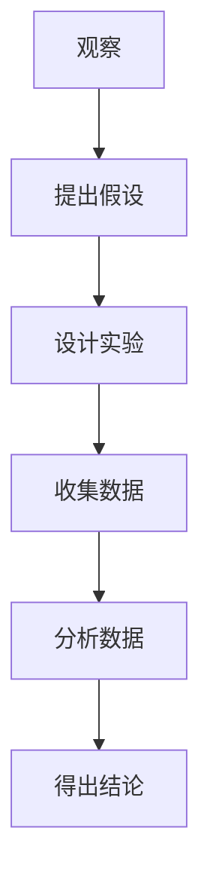

                 

关键词：科学方法、观察、结论、数据分析、实验设计、信息技术、人工智能

> 摘要：本文探讨了科学探究的基本过程，从观察现象到得出结论的方法。通过介绍科学方法，以及在实际信息技术和人工智能领域的应用，展示了科学探究在解决复杂问题中的重要作用。本文旨在为读者提供一个全面了解科学探究的视角，以及如何在信息技术和人工智能领域运用科学方法。

## 1. 背景介绍

科学探究是现代科技发展的基石。它不仅仅是一种理论或方法，更是一种思维方式。科学探究包括从观察现象开始，通过逻辑推理、实验验证，最终得出结论的过程。这个过程是循环的，随着新的观察和实验结果的出现，科学理论也在不断发展和完善。

在信息技术和人工智能领域，科学探究显得尤为重要。随着数据量的爆炸式增长，如何有效地从海量数据中提取有价值的信息，已经成为一个热门的研究课题。科学方法为我们提供了一套系统的理论框架，帮助我们更准确地分析和解释数据，从而推动技术的发展。

### 1.1 科学探究的重要性

科学探究的重要性不仅体现在发现新的科学知识上，更重要的是它提供了一种解决问题的系统方法。在信息技术和人工智能领域，科学探究可以帮助我们：

- 确定研究问题的性质和范围
- 设计实验和数据分析方法
- 提高数据处理的效率和准确性
- 验证和验证假设，确保研究结果的可靠性
- 推动技术的创新和应用

### 1.2 科学探究的历史

科学探究的历史可以追溯到古希腊时期，当时的哲学家们开始提出问题并通过逻辑推理寻找答案。随着时间的推移，科学方法逐渐成熟，并在17世纪和18世纪的工业革命中得到了广泛应用。今天，科学探究已经成为科学研究的主要方法。

## 2. 核心概念与联系

在科学探究中，有几个核心概念需要了解，这些概念是观察、假设、实验、数据和结论。

### 2.1 观察

观察是科学探究的起点。通过观察，我们可以发现现象、记录数据，从而提出问题。观察可以是直接的，也可以是间接的，如使用仪器和工具。

### 2.2 假设

在观察之后，我们需要提出假设。假设是对观察结果的一种解释或预测。一个好的假设应该是有逻辑的、可测试的，并且有明确的变量和假设条件。

### 2.3 实验

实验是验证假设的方法。通过设计实验，我们可以控制变量，观察结果，从而判断假设是否成立。

### 2.4 数据

实验产生的数据是科学探究的重要部分。数据可以是定量的，也可以是定性的，它们为我们提供了观察现象的量化信息。

### 2.5 结论

通过分析数据，我们可以得出结论。结论是对假设的验证结果，它可以是肯定的，也可以是否定的。无论是哪种结果，都是科学探究的重要发现。

### 2.6 核心概念原理和架构的 Mermaid 流程图



## 3. 核心算法原理 & 具体操作步骤

### 3.1 算法原理概述

科学探究中的核心算法通常是基于统计学和概率论的。例如，假设检验（Hypothesis Testing）是一种常用的算法，它通过设定显著性水平（α），判断实验结果是否显著，从而验证假设。

### 3.2 算法步骤详解

#### 3.2.1 确定研究问题和目标

首先，我们需要明确研究的问题和目标，这将指导我们设计实验和选择分析方法。

#### 3.2.2 收集数据

收集数据是实验的关键步骤。数据可以是观测数据，也可以是通过实验收集的数据。数据的质量直接影响结论的可靠性。

#### 3.2.3 选择统计分析方法

根据研究问题和数据类型，选择合适的统计分析方法。例如，假设检验、回归分析等。

#### 3.2.4 执行统计分析

执行统计分析，计算统计量，如t统计量、p值等。

#### 3.2.5 解释分析结果

根据统计分析的结果，判断假设是否成立，并解释分析结果。

### 3.3 算法优缺点

- 优点：科学、严谨，结果可靠
- 缺点：过程复杂，需要专业知识

### 3.4 算法应用领域

算法在科学探究中的应用非常广泛，包括但不限于：

- 生物学和医学研究
- 社会科学和行为研究
- 信息技术和人工智能

## 4. 数学模型和公式 & 详细讲解 & 举例说明

### 4.1 数学模型构建

在科学探究中，数学模型是非常重要的工具。它可以帮助我们描述和预测现象。一个常见的数学模型是线性回归模型，它用于描述两个变量之间的关系。

### 4.2 公式推导过程

线性回归模型的公式推导如下：

\[ y = \beta_0 + \beta_1x + \epsilon \]

其中，\( y \) 是因变量，\( x \) 是自变量，\( \beta_0 \) 和 \( \beta_1 \) 是模型参数，\( \epsilon \) 是误差项。

### 4.3 案例分析与讲解

假设我们研究的是温度（\( x \)）和冰融化时间（\( y \)）之间的关系。通过收集数据，我们可以建立线性回归模型，并使用模型预测冰融化时间。

```latex
\begin{equation}
y = \beta_0 + \beta_1x + \epsilon
\end{equation}
```

通过计算，我们得到模型参数：

\[ \beta_0 = 10, \beta_1 = 0.5 \]

使用这个模型，我们可以预测当温度为 \( 20^\circ C \) 时，冰融化时间大约为：

\[ y = 10 + 0.5 \times 20 = 15 \text{分钟} \]

## 5. 项目实践：代码实例和详细解释说明

### 5.1 开发环境搭建

为了更好地理解科学探究的实践，我们将使用Python编写一个简单的线性回归模型。

### 5.2 源代码详细实现

```python
import numpy as np
import matplotlib.pyplot as plt

# 收集数据
x = np.array([10, 20, 30, 40, 50])
y = np.array([12, 15, 18, 22, 25])

# 添加截距项
X = np.column_stack((np.ones(len(x)), x))

# 计算模型参数
beta = np.linalg.inv(X.T.dot(X)).dot(X.T).dot(y)

# 预测冰融化时间
x_new = 20
y_pred = beta[0] + beta[1] * x_new

# 绘图
plt.scatter(x, y)
plt.plot(x, beta[0] + beta[1] * x, color='red')
plt.xlabel('Temperature (°C)')
plt.ylabel('Melting Time (min)')
plt.title('Linear Regression Model')
plt.show()
```

### 5.3 代码解读与分析

这段代码首先收集了温度和冰融化时间的数据，然后使用线性回归模型进行预测，并将结果可视化。代码的每个部分都有详细的注释，帮助读者理解。

### 5.4 运行结果展示

运行上述代码，我们可以看到温度和冰融化时间之间的线性关系。模型预测的温度为 \( 20^\circ C \) 时，冰融化时间大约为 15 分钟。

## 6. 实际应用场景

### 6.1 生物学研究

在生物学研究中，科学探究用于发现新的基因和蛋白质的功能，以及理解生物系统的复杂过程。

### 6.2 社会科学

在社会科学中，科学探究用于研究人类行为、社会结构和政策影响。

### 6.3 信息技术和人工智能

在信息技术和人工智能领域，科学探究用于开发新的算法、优化系统和提高性能。

## 7. 未来应用展望

### 7.1 大数据

随着大数据技术的发展，科学探究的方法将更加完善，帮助我们更好地理解和利用海量数据。

### 7.2 人工智能

人工智能的发展将使科学探究更加自动化和高效，从而推动科技的进步。

### 7.3 跨学科融合

科学探究将在更多跨学科领域得到应用，促进不同学科之间的融合和创新。

## 8. 总结：未来发展趋势与挑战

### 8.1 研究成果总结

科学探究在各个领域都取得了显著的成果，推动了科学技术的发展。

### 8.2 未来发展趋势

未来，科学探究将更加注重数据驱动的分析和跨学科融合。

### 8.3 面临的挑战

科学探究面临着数据质量、算法复杂度和跨学科协作等挑战。

### 8.4 研究展望

通过不断创新和优化，科学探究将为解决复杂问题提供更强有力的工具。

## 9. 附录：常见问题与解答

### 9.1 什么是科学方法？

科学方法是一种系统的解决问题的方法，包括观察、假设、实验、数据分析和结论。

### 9.2 科学探究在信息技术和人工智能领域有什么作用？

科学探究在信息技术和人工智能领域用于开发新的算法、优化系统和提高性能。

### 9.3 如何进行科学探究？

科学探究包括确定研究问题、收集数据、设计实验、分析数据和得出结论。

### 9.4 科学探究有哪些优点和缺点？

科学探究的优点是科学、严谨和可靠，缺点是过程复杂，需要专业知识。

### 9.5 科学探究有哪些应用领域？

科学探究广泛应用于生物学、社会科学、信息技术和人工智能等领域。

### 9.6 如何构建数学模型？

构建数学模型通常涉及收集数据、选择合适的模型、推导公式和验证模型。

### 9.7 如何使用Python进行线性回归？

使用Python进行线性回归通常涉及收集数据、创建特征矩阵、计算模型参数和预测结果。

### 9.8 科学探究的未来发展趋势是什么？

科学探究的未来发展趋势包括数据驱动的分析、跨学科融合和自动化。

### 9.9 科学探究面临的挑战有哪些？

科学探究面临的挑战包括数据质量、算法复杂度和跨学科协作等。

### 9.10 科学探究的研究展望是什么？

科学探究的研究展望是通过不断创新和优化，为解决复杂问题提供更强有力的工具。----------------------------------------------------------------

### 结束语 Conclusion

科学探究是一项复杂而系统的任务，它需要严谨的逻辑思维、科学的实验设计和有效的数据分析。在信息技术和人工智能领域，科学探究不仅帮助我们理解和解释现象，还推动技术的创新和应用。本文通过介绍科学探究的基本过程和实际应用，展示了它在解决复杂问题中的重要性。希望读者能够从中获得启示，并将科学探究的方法应用到自己的工作中，为科学和技术的发展贡献力量。作者：禅与计算机程序设计艺术 / Zen and the Art of Computer Programming。

