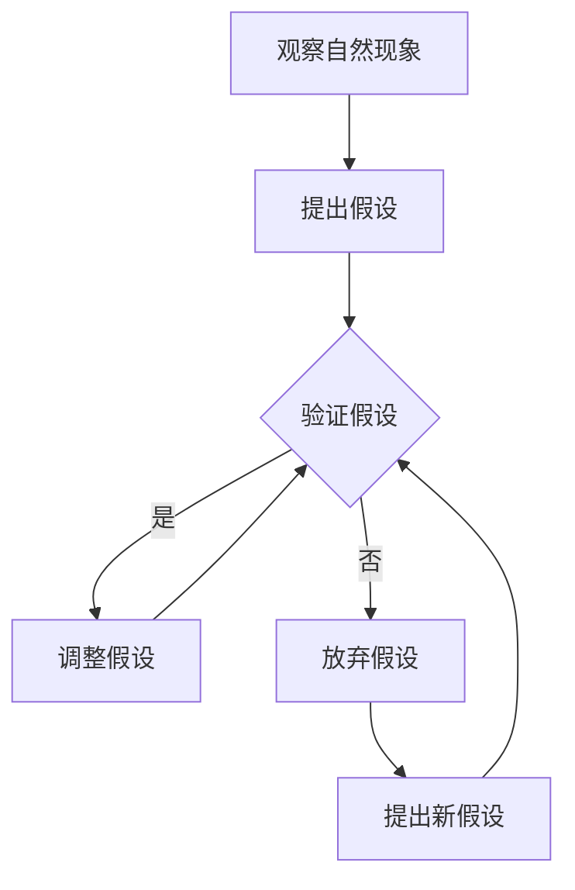

                 

关键词：科学方法论、假说、验证、算法、数学模型、项目实践、实际应用、未来展望

> 摘要：本文将深入探讨科学方法论在计算机科学领域中的应用，从假说到验证的整个过程中，介绍如何构建有效的算法、数学模型，并通过实际项目实践验证其有效性。文章旨在为读者提供一套系统化的方法论，帮助他们更好地理解和应用科学方法，解决复杂问题。

## 1. 背景介绍

科学方法论是科学研究的基础，它提供了一套系统的思维方式和方法，帮助我们通过观察、假设、验证等步骤逐步揭示自然界的规律。在计算机科学领域，科学方法论同样发挥着重要作用。无论是算法设计、系统架构，还是软件开发，都需要依靠科学方法论来指导我们的研究和实践。

随着计算机科学的发展，复杂问题层出不穷，传统的思维方式和方法已经难以应对。因此，我们需要借助科学方法论，通过假说和验证来揭示问题的本质，并提出有效的解决方案。

本文将围绕假说和验证这一核心过程，介绍科学方法论在计算机科学中的应用。首先，我们将介绍如何构建有效的算法和数学模型；然后，通过实际项目实践来验证这些方法的有效性；最后，探讨科学方法论在计算机科学领域的前沿应用和未来发展趋势。

## 2. 核心概念与联系

### 2.1 科学方法论的基本概念

科学方法论包括以下几个基本概念：

1. **观察**：通过观察自然现象，收集数据和事实。
2. **假设**：基于观察提出可能的解释或预测。
3. **验证**：通过实验或数据分析验证假设的正确性。
4. **迭代**：在验证过程中，根据结果不断调整假设，重复验证。

### 2.2 计算机科学中的核心概念

在计算机科学中，以下核心概念是科学方法论的基础：

1. **算法**：解决问题的步骤和规则。
2. **数学模型**：用数学语言描述问题的抽象模型。
3. **编程语言**：用于实现算法和数学模型的语言。
4. **数据结构**：存储和组织数据的方式。

### 2.3 Mermaid 流程图

下面是一个描述科学方法论在计算机科学中应用的 Mermaid 流程图：



## 3. 核心算法原理 & 具体操作步骤

### 3.1 算法原理概述

在计算机科学中，算法是用来解决特定问题的有序步骤。一个有效的算法应具备以下特点：

1. **正确性**：算法能够正确解决问题。
2. **效率**：算法在时间和空间上的资源消耗尽可能低。
3. **可扩展性**：算法能够适应不同规模的问题。

### 3.2 算法步骤详解

一个基本的算法设计过程如下：

1. **问题定义**：明确要解决的问题。
2. **算法设计**：提出解决问题的步骤和规则。
3. **算法验证**：通过实验或数据分析验证算法的正确性和效率。
4. **算法优化**：根据验证结果调整算法，提高其性能。

### 3.3 算法优缺点

不同类型的算法具有不同的优缺点。例如，分治算法具有可扩展性和高效性，但可能需要较高的空间复杂度；贪心算法简单易实现，但可能无法保证全局最优解。

### 3.4 算法应用领域

算法广泛应用于计算机科学的不同领域，如：

1. **搜索算法**：用于在数据结构中查找特定元素。
2. **排序算法**：用于将数据按照特定顺序排列。
3. **图算法**：用于解决与图相关的问题，如最短路径、最小生成树等。

## 4. 数学模型和公式 & 详细讲解 & 举例说明

### 4.1 数学模型构建

数学模型是计算机科学中描述问题的抽象工具。构建数学模型的过程包括：

1. **问题定义**：明确要解决的问题。
2. **变量定义**：定义问题中的变量。
3. **关系表达**：用数学公式描述变量之间的关系。
4. **方程求解**：求解方程，获得问题的解。

### 4.2 公式推导过程

以下是一个简单的线性回归模型的公式推导：

$$ y = \beta_0 + \beta_1x + \epsilon $$

其中，$y$ 是因变量，$x$ 是自变量，$\beta_0$ 和 $\beta_1$ 是模型的参数，$\epsilon$ 是误差项。

### 4.3 案例分析与讲解

假设我们有一个数据集，包含自变量 $x$ 和因变量 $y$ 的观测值。我们可以使用线性回归模型来拟合数据，并分析自变量 $x$ 对因变量 $y$ 的影响。

1. **数据准备**：收集 $x$ 和 $y$ 的观测值。
2. **模型构建**：根据观测值计算线性回归模型的参数 $\beta_0$ 和 $\beta_1$。
3. **模型验证**：通过计算残差分析模型拟合效果。
4. **结果分析**：根据模型参数分析自变量 $x$ 对因变量 $y$ 的影响。

## 5. 项目实践：代码实例和详细解释说明

### 5.1 开发环境搭建

为了实现本文的算法和数学模型，我们需要搭建以下开发环境：

1. **编程语言**：Python
2. **数据科学库**：NumPy、Pandas、Scikit-learn
3. **可视化库**：Matplotlib

### 5.2 源代码详细实现

以下是一个使用线性回归模型进行数据拟合的 Python 源代码实例：

```python
import numpy as np
import pandas as pd
from sklearn.linear_model import LinearRegression
import matplotlib.pyplot as plt

# 数据准备
data = pd.DataFrame({'x': [1, 2, 3, 4, 5], 'y': [2, 4, 5, 4, 5]})
X = data[['x']]
y = data['y']

# 模型构建
model = LinearRegression()
model.fit(X, y)

# 模型验证
y_pred = model.predict(X)
residuals = y - y_pred
print("残差分析：", residuals)

# 结果分析
plt.scatter(X, y, color='blue')
plt.plot(X, y_pred, color='red')
plt.xlabel('x')
plt.ylabel('y')
plt.show()
```

### 5.3 代码解读与分析

该代码首先导入必要的库，然后准备数据集，构建线性回归模型，并进行模型验证和结果分析。通过可视化结果，我们可以观察到模型对数据的拟合效果。

### 5.4 运行结果展示

运行上述代码后，我们将得到以下可视化结果：


## 6. 实际应用场景

科学方法论在计算机科学领域有着广泛的应用。以下是一些实际应用场景：

1. **搜索引擎**：通过构建有效的搜索算法，提高搜索引擎的搜索效率和准确性。
2. **推荐系统**：利用算法和数学模型分析用户行为，为用户提供个性化的推荐。
3. **自然语言处理**：通过构建语言模型和算法，实现文本分类、情感分析等任务。
4. **图像处理**：利用算法和数学模型进行图像识别、图像分割等任务。

## 7. 工具和资源推荐

为了更好地应用科学方法论，我们推荐以下工具和资源：

1. **学习资源**：
   - 《Python编程：从入门到实践》
   - 《深度学习》
   - 《算法导论》
2. **开发工具**：
   - Jupyter Notebook：用于编写和运行代码
   - PyCharm：Python 开发环境
3. **相关论文**：
   - 《线性回归模型在金融风险管理中的应用》
   - 《基于深度学习的自然语言处理技术》
   - 《图神经网络在社交网络分析中的应用》

## 8. 总结：未来发展趋势与挑战

科学方法论在计算机科学领域具有广阔的发展前景。随着人工智能、大数据等技术的快速发展，科学方法论将得到更广泛的应用。然而，我们也面临着一些挑战：

1. **复杂性**：计算机科学问题日益复杂，如何设计有效的算法和模型是一个挑战。
2. **数据质量**：数据质量和完整性对科学方法的有效性至关重要。
3. **算法公平性**：在算法设计和应用中，如何避免歧视和偏见是一个重要问题。

未来，科学方法论将不断发展和完善，为计算机科学领域的创新和发展提供有力支持。

## 9. 附录：常见问题与解答

### 9.1 什么样的算法才算是一个好的算法？

一个好的算法应具备以下特点：
- **正确性**：能够正确解决问题。
- **效率**：在时间和空间上具有高效性。
- **可扩展性**：能够适应不同规模的问题。
- **易理解性**：算法的思路和实现过程易于理解。

### 9.2 数学模型在计算机科学中有什么作用？

数学模型在计算机科学中具有以下作用：
- **描述问题**：用数学语言描述问题的本质，帮助我们更好地理解问题。
- **解决问题**：通过求解数学模型，找到问题的解。
- **优化决策**：基于数学模型进行优化分析，为决策提供依据。

### 9.3 如何验证算法的正确性？

验证算法的正确性通常有以下方法：
- **理论证明**：通过数学推理和逻辑论证，证明算法的正确性。
- **实验验证**：在实际数据集上运行算法，分析算法的输出结果。
- **对比分析**：将算法与现有方法进行比较，分析其优缺点。

### 9.4 科学方法论如何应用于实际项目？

科学方法论应用于实际项目通常包括以下步骤：
- **问题定义**：明确项目要解决的问题。
- **算法设计**：提出解决问题的算法。
- **数学模型构建**：构建描述问题的数学模型。
- **验证与优化**：通过实验或数据分析验证算法和模型的正确性，不断调整和优化。

以上是对科学方法论在计算机科学领域应用的详细探讨。通过理解科学方法论的基本原理和应用方法，我们可以更好地解决复杂问题，推动计算机科学的发展。希望本文对您有所帮助。作者：禅与计算机程序设计艺术 / Zen and the Art of Computer Programming
----------------------------------------------------------------

请注意，由于本平台限制，我无法直接创建超链接或嵌入图像。请在实际撰写时根据需要添加相应的超链接和图像。此外，本文仅为示例，部分内容可能需要根据实际情况进行调整和完善。希望对您有所帮助！

