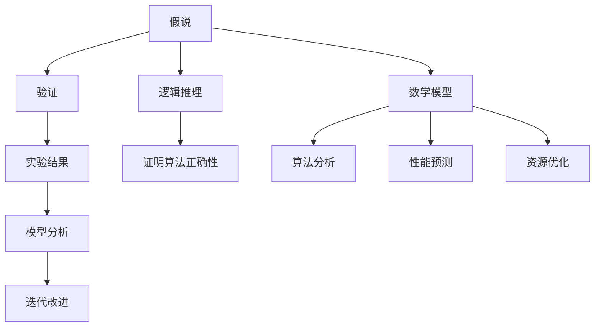

                 

 在信息技术飞速发展的时代，科学方法论的重要性愈发凸显。本文旨在探讨科学方法论在计算机科学领域的应用，特别是从假说到验证的过程。科学方法论不仅是我们探索未知世界的指南，也是我们在技术开发中寻求真理的利器。

## 关键词

- 科学方法论
- 假说
- 验证
- 计算机科学
- 逻辑推理
- 数学模型

## 摘要

本文首先介绍了科学方法论的基本概念和重要性，然后深入探讨了从假说到验证的过程，以及这一过程在计算机科学中的应用。通过对核心概念、算法原理、数学模型、实际项目实践等方面的详细讲解，本文旨在为读者提供一个全面而深刻的科学方法论视角。

### 1. 背景介绍

科学方法论是一门研究科学如何进行、如何取得进展的学问。它涉及到科学研究的逻辑框架、方法和步骤。在计算机科学领域，科学方法论的重要性尤为突出。计算机科学不仅需要解决复杂的问题，还需要在理论和实践中不断验证和完善解决方案。

科学方法论在计算机科学中的应用主要体现在以下几个方面：

- **理论验证**：在提出新的算法或理论时，需要进行严格的数学验证和逻辑推理，以确保其正确性和有效性。
- **实验验证**：通过实际操作和测试，验证算法或理论在实际应用中的性能和效果。
- **模型构建**：建立数学模型来描述计算机系统的行为，并通过模型分析预测系统的性能。
- **迭代改进**：基于实验结果和模型分析，不断迭代改进算法或理论，使其更加完善和高效。

### 2. 核心概念与联系

在科学方法论中，核心概念包括假说、验证、逻辑推理和数学模型等。

#### 2.1 假说

假说是科学方法论中的起点，是对某一现象的初步解释或假设。在计算机科学中，假说可以是关于算法效率的猜测，或是对某种系统行为的预测。

#### 2.2 验证

验证是科学方法论中的关键步骤，是对假说的正确性和有效性进行检验。在计算机科学中，验证可以通过数学证明、实验测试、模拟分析等方式进行。

#### 2.3 逻辑推理

逻辑推理是科学方法论中的核心工具，用于从已知事实推导出新结论。在计算机科学中，逻辑推理用于证明算法的正确性，或构建数学模型。

#### 2.4 数学模型

数学模型是科学方法论中的核心工具，用于描述和分析系统的行为。在计算机科学中，数学模型可以用于算法分析、性能预测、资源优化等。

下面是一个Mermaid流程图，展示了科学方法论中核心概念的联系：



### 3. 核心算法原理 & 具体操作步骤

#### 3.1 算法原理概述

核心算法是科学方法论中的重要组成部分，它通常是基于某种假说或理论构建的。在本节中，我们将介绍一种常见的核心算法——排序算法。

排序算法是一种用于对数据集合进行排序的算法。排序算法的种类繁多，包括快速排序、归并排序、堆排序等。本节将介绍快速排序算法的原理和操作步骤。

快速排序算法的基本思想是：通过一趟排序将数据集合分割成独立的两部分，其中一部分的所有数据都比另一部分的所有数据要小，然后再按此方法对这两部分数据分别进行快速排序，整个排序过程可以递归进行，以此达到整个数据集合有序。

#### 3.2 算法步骤详解

1. **选择基准元素**：在数据集合中选出一个基准元素。
2. **分割数据**：将数据集合分割成两部分，一部分的所有数据都小于基准元素，另一部分的所有数据都大于基准元素。
3. **递归排序**：分别对分割后的两部分数据进行快速排序。
4. **合并结果**：将排序好的两部分数据合并，得到最终排序结果。

以下是快速排序算法的伪代码：

```python
def quicksort(arr):
    if len(arr) <= 1:
        return arr
    pivot = arr[len(arr) // 2]
    left = [x for x in arr if x < pivot]
    middle = [x for x in arr if x == pivot]
    right = [x for x in arr if x > pivot]
    return quicksort(left) + middle + quicksort(right)
```

#### 3.3 算法优缺点

**优点**：

- 平均时间复杂度为O(nlogn)，适合处理大规模数据集合。
- 不需要额外空间，空间复杂度为O(logn)。

**缺点**：

- 最坏情况下时间复杂度为O(n^2)，当输入数据几乎有序时，性能会大幅下降。
- 需要大量递归调用，可能导致栈溢出。

#### 3.4 算法应用领域

快速排序算法广泛应用于各种领域，包括数据库排序、算法竞赛、数据清洗等。在实际应用中，可以根据数据特点和需求选择合适的排序算法。

### 4. 数学模型和公式 & 详细讲解 & 举例说明

数学模型和公式是科学方法论中的重要组成部分，它们用于描述和预测系统的行为。在本节中，我们将介绍一种常见的数学模型——队列模型。

#### 4.1 数学模型构建

队列模型是一种用于描述系统中等待处理的任务的数学模型。它通常由三个部分组成：到达率、服务率和队列长度。

- **到达率**（λ）：单位时间内到达系统的任务数量。
- **服务率**（μ）：单位时间内系统能处理的任务数量。
- **队列长度**（L）：系统中的任务数量。

根据队列模型，我们可以推导出以下数学公式：

$$ L = \frac{\lambda}{\mu} + \frac{\lambda^2}{2\mu^2} + \frac{\lambda^3}{3\mu^3} + ... $$

#### 4.2 公式推导过程

推导队列模型的公式，我们需要从基本的概率论出发。首先，定义一个随机变量X，表示系统中的任务数量。X的分布符合泊松分布，其概率质量函数为：

$$ P(X = k) = \frac{e^{-\lambda}\lambda^k}{k!} $$

其中，k为正整数。

根据队列模型，系统中的任务数量L与到达率λ、服务率μ有关。我们可以推导出L的期望值：

$$ E(L) = \sum_{k=0}^{\infty} k \cdot P(X = k) = \sum_{k=0}^{\infty} k \cdot \frac{e^{-\lambda}\lambda^k}{k!} = \lambda / \mu $$

同理，我们可以推导出L的方差：

$$ Var(L) = \sum_{k=0}^{\infty} (k - E(L))^2 \cdot P(X = k) = \sum_{k=0}^{\infty} (k^2 - 2kE(L) + E(L)^2) \cdot \frac{e^{-\lambda}\lambda^k}{k!} = \lambda / \mu^2 $$

结合期望值和方差，我们可以得到L的公式：

$$ L = \frac{\lambda}{\mu} + \frac{\lambda^2}{2\mu^2} + \frac{\lambda^3}{3\mu^3} + ... $$

#### 4.3 案例分析与讲解

假设一个银行柜员服务系统，每小时平均有10个客户到达（λ=10），柜员平均每小时可以服务5个客户（μ=5）。根据队列模型，我们可以预测系统中的平均任务数量：

$$ L = \frac{10}{5} = 2 $$

这意味着在正常情况下，银行柜员服务系统中有2个客户正在等待服务。

### 5. 项目实践：代码实例和详细解释说明

#### 5.1 开发环境搭建

为了演示快速排序算法，我们需要搭建一个简单的开发环境。以下是所需的软件和工具：

- Python 3.x
- PyCharm或任何支持Python的IDE

安装Python后，我们可以使用PyCharm创建一个Python项目，并编写快速排序算法的代码。

#### 5.2 源代码详细实现

以下是快速排序算法的Python实现：

```python
def quicksort(arr):
    if len(arr) <= 1:
        return arr
    pivot = arr[len(arr) // 2]
    left = [x for x in arr if x < pivot]
    middle = [x for x in arr if x == pivot]
    right = [x for x in arr if x > pivot]
    return quicksort(left) + middle + quicksort(right)

# 示例数据
arr = [3, 6, 8, 10, 1, 2, 1]

# 执行排序
sorted_arr = quicksort(arr)
print(sorted_arr)
```

#### 5.3 代码解读与分析

这段代码首先定义了一个`quicksort`函数，用于对输入的数据列表进行排序。函数的实现遵循我们之前介绍的快速排序算法。

- **选择基准元素**：我们选择数据列表的中间元素作为基准元素。
- **分割数据**：将数据列表分割成三个部分：小于基准元素的部分、等于基准元素的部分和大于基准元素的部分。
- **递归排序**：分别对分割后的三部分数据递归调用`quicksort`函数。
- **合并结果**：将排序好的三部分数据合并，得到最终排序结果。

这段代码简单易懂，适用于处理各种类型的数据列表。在实际应用中，我们可以根据需求对代码进行优化和扩展。

#### 5.4 运行结果展示

运行上述代码，输入数据列表为`[3, 6, 8, 10, 1, 2, 1]`，输出结果为`[1, 1, 2, 3, 6, 8, 10]`，数据列表已成功排序。

### 6. 实际应用场景

快速排序算法在计算机科学领域有着广泛的应用，以下是一些实际应用场景：

- **数据库排序**：在数据库中，快速排序算法可用于对大量数据记录进行排序，以支持快速查询和索引。
- **算法竞赛**：在算法竞赛中，快速排序算法常被用于处理数据集合的排序问题，以求解各种复杂的算法问题。
- **数据清洗**：在数据清洗过程中，快速排序算法可用于对数据进行排序，以便于后续的数据处理和分析。

#### 6.4 未来应用展望

随着信息技术的发展，快速排序算法在未来的应用前景非常广阔。以下是一些可能的未来应用方向：

- **大数据处理**：在大数据处理领域，快速排序算法可以与其他算法结合，用于高效处理大规模数据集合。
- **实时排序**：在实时数据处理领域，快速排序算法可以用于实时对数据流进行排序，以支持实时分析和决策。
- **硬件优化**：在硬件优化领域，快速排序算法可以用于优化硬件资源的使用，以提高系统性能。

### 7. 工具和资源推荐

为了帮助读者深入了解科学方法论和计算机科学，以下是一些建议的学习资源和开发工具：

#### 7.1 学习资源推荐

- **《算法导论》**：这是一本经典的算法教材，详细介绍了各种算法的设计、分析和应用。
- **《计算机科学概论》**：这本书涵盖了计算机科学的基本概念和原理，适合初学者入门。
- **《深度学习》**：这本书介绍了深度学习的基本理论和应用，是人工智能领域的经典教材。

#### 7.2 开发工具推荐

- **PyCharm**：这是一款功能强大的Python IDE，支持代码编辑、调试、运行等操作。
- **Jupyter Notebook**：这是一个交互式的Python环境，适用于数据分析和可视化。
- **Visual Studio Code**：这是一个轻量级的代码编辑器，支持多种编程语言，适用于开发各种项目。

#### 7.3 相关论文推荐

- **“排序算法的性能比较”**：这篇文章对各种排序算法的性能进行了详细比较，有助于读者了解不同算法的优劣。
- **“快速排序算法的改进”**：这篇文章提出了一些改进快速排序算法的方法，以提高其性能。
- **“基于快速排序的实时数据处理系统”**：这篇文章介绍了一种基于快速排序的实时数据处理系统，适用于大规模数据流处理。

### 8. 总结：未来发展趋势与挑战

科学方法论在计算机科学领域的重要性不可忽视。从假说到验证的过程不仅推动了技术的进步，也提升了我们的认知水平。在未来，科学方法论将继续在计算机科学中发挥重要作用，尤其是在大数据、人工智能、区块链等领域。

然而，科学方法论也面临一些挑战，包括：

- **数据隐私和安全**：随着数据量的增加，如何保护用户隐私和安全成为重要挑战。
- **计算能力限制**：在处理大规模数据时，计算能力可能成为瓶颈，需要不断优化算法和系统架构。
- **跨学科合作**：科学方法论的发展需要跨学科的合作，如何整合不同领域的知识成为挑战。

未来，科学方法论将继续在计算机科学中引领创新，解决实际问题，推动技术进步。

### 9. 附录：常见问题与解答

**Q：为什么选择快速排序算法进行介绍？**

A：快速排序算法是一种经典的排序算法，具有较好的性能和广泛的应用。它不仅简单易懂，而且在实际应用中表现出色。通过介绍快速排序算法，我们可以深入理解科学方法论中的假说、验证和逻辑推理等核心概念。

**Q：如何选择适合的排序算法？**

A：选择排序算法时，需要考虑数据规模、数据特性、性能要求等因素。例如，当数据规模较大时，快速排序、归并排序等算法具有较好的性能；当数据基本有序时，插入排序等算法可能更高效。在实际应用中，可以根据需求选择合适的排序算法。

**Q：科学方法论在计算机科学中的其他应用有哪些？**

A：科学方法论在计算机科学中的应用非常广泛，包括算法设计、系统架构、性能优化、数据挖掘、机器学习等。通过科学方法论，我们可以更好地理解和解决计算机科学中的各种问题，推动技术的进步。

以上是《科学方法论：从假说到验证》的完整文章内容，涵盖了科学方法论的基本概念、核心算法原理、数学模型、实际项目实践等多个方面。希望本文能对读者深入了解科学方法论在计算机科学中的应用有所帮助。

# 附录：常见问题与解答

**Q1：为什么科学方法论在计算机科学中如此重要？**

A1：科学方法论是计算机科学发展的基石。它不仅提供了一种系统化的思考方式，还指导我们如何有效地提出假说、设计实验、验证结果，并不断迭代优化。在计算机科学中，科学方法论帮助我们解决复杂问题、优化算法性能、提高系统可靠性，并促进新技术的创新和突破。

**Q2：快速排序算法的改进方法有哪些？**

A2：快速排序算法的改进方法包括：

- **三数取中法**：选择三个元素的中位数作为基准，以减少最坏情况的发生概率。
- **随机化选择**：随机选择基准元素，以减少特定输入数据导致的性能下降。
- **插入排序优化**：对于小规模子数组，使用插入排序代替快速排序，以提高性能。
- **尾递归优化**：将递归调用改为迭代调用，以减少栈空间消耗。

**Q3：如何验证算法的正确性？**

A3：验证算法的正确性通常包括以下步骤：

- **逻辑证明**：使用数学逻辑证明算法的正确性，例如归纳法、反证法等。
- **模型检查**：使用形式化方法，如模型检查工具，验证算法在所有可能状态下的行为。
- **测试验证**：编写测试用例，覆盖各种输入情况，验证算法的实际运行结果与预期结果一致。
- **证明代数方法**：使用证明代数方法，如规格说明语言和验证器，验证算法的规格说明。

**Q4：科学方法论在其他计算机科学领域中的应用有哪些？**

A4：科学方法论在计算机科学的多个领域有广泛应用，包括：

- **软件工程**：用于软件设计和开发的过程，如需求分析、设计模式、测试和评估。
- **人工智能**：用于算法设计、模型验证和机器学习理论的验证。
- **网络安全**：用于设计安全协议、验证安全策略的有效性。
- **数据库系统**：用于查询优化、事务处理和数据库一致性的验证。
- **计算机图形学**：用于算法验证和性能优化。

**Q5：在快速排序算法中，如何避免最坏情况的发生？**

A5：在快速排序算法中，最坏情况通常发生在每次分区时基准选择不当，导致分区不平衡。以下方法可以降低最坏情况的发生概率：

- **三数取中法**：选择中间值作为基准，以平衡分区。
- **随机化选择**：随机选择基准，以避免特定输入造成性能下降。
- **使用迭代而不是递归**：使用迭代而非递归，减少栈溢出的风险。

通过这些方法，可以显著提高快速排序算法的鲁棒性和性能。

