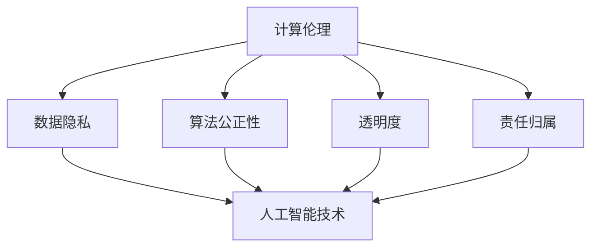

                 

关键词：计算伦理，人工智能，科技发展，伦理规范，技术道德

> 摘要：本文从科技与伦理的角度出发，探讨计算伦理在人工智能技术发展中的重要性，分析当前面临的伦理挑战，并提出构建科技与伦理平衡点的策略。通过深入分析，本文旨在为科技工作者、政策制定者和公众提供有益的思考，推动科技与伦理的和谐发展。

## 1. 背景介绍

随着科技的飞速发展，人工智能（AI）技术已经成为现代社会的重要推动力。从智能家居到自动驾驶，从医疗诊断到金融风控，AI技术的应用场景日益广泛。然而，科技的发展也带来了诸多伦理问题，如数据隐私、算法偏见、自主决策的责任归属等。这些问题不仅影响科技产业的健康发展，也关系到社会的公平正义和人类的基本权益。因此，如何在科技发展的同时，保持伦理的平衡，成为我们必须面对的重要课题。

### 1.1 计算伦理的定义与意义

计算伦理是指计算机科学和技术领域中的伦理问题，包括数据隐私、算法公正性、人工智能的责任与义务等方面。它旨在确保科技的发展符合伦理原则，不损害人类的基本权益和社会的整体利益。计算伦理的意义在于，它不仅能够引导科技的发展方向，促进技术的正向应用，还能为政策制定提供伦理依据，保障社会的公平正义。

### 1.2 人工智能与伦理问题的关联

人工智能技术的发展，使得数据处理和分析能力得到了极大提升。然而，这也引发了一系列伦理问题。例如，算法偏见可能导致不公平的社会现象，数据隐私泄露可能侵犯个人权益，AI自主决策可能带来不可预测的风险。这些问题使得计算伦理在人工智能领域变得尤为重要。

## 2. 核心概念与联系

### 2.1 计算伦理的核心概念

计算伦理的核心概念包括数据隐私、算法公正性、透明度和责任归属等。这些概念相互关联，共同构成了计算伦理的框架。

#### 2.1.1 数据隐私

数据隐私是计算伦理中的重要问题，涉及到个人数据的安全性和隐私权。在人工智能技术中，数据隐私问题尤为突出，因为AI系统通常需要处理大量个人数据。

#### 2.1.2 算法公正性

算法公正性是指算法在处理数据时，不因种族、性别、年龄等因素产生歧视。算法公正性是确保AI系统公平、公正运行的重要保障。

#### 2.1.3 透明度

透明度是指AI系统的决策过程应该是可解释的，用户可以理解AI系统为何做出特定决策。透明度对于提高用户对AI系统的信任度至关重要。

#### 2.1.4 责任归属

责任归属是指在AI系统出现问题时，如何确定责任方。责任归属的明确对于推动AI技术的发展具有重要意义。

### 2.2 计算伦理与人工智能技术的关联

计算伦理与人工智能技术密切相关。人工智能技术的发展，使得计算伦理问题变得更加复杂和突出。例如，算法偏见和数据隐私问题在AI技术中尤为显著。因此，解决计算伦理问题，对于推动人工智能技术的健康发展至关重要。

### 2.3 Mermaid 流程图

下面是计算伦理与人工智能技术关联的 Mermaid 流程图：



## 3. 核心算法原理 & 具体操作步骤

### 3.1 算法原理概述

计算伦理的核心算法原理主要包括数据隐私保护算法、算法公正性评估算法和透明度增强算法等。

#### 3.1.1 数据隐私保护算法

数据隐私保护算法旨在保护个人数据的安全性，避免数据泄露。常见的保护算法包括数据加密、差分隐私和同态加密等。

#### 3.1.2 算法公正性评估算法

算法公正性评估算法用于检测和纠正算法偏见。常见的评估算法包括统计分析、机器学习模型评估和公平性指标计算等。

#### 3.1.3 透明度增强算法

透明度增强算法旨在提高AI系统的可解释性，使用户能够理解AI系统的决策过程。常见的增强算法包括决策树可视化、神经网络解释和模型压缩等。

### 3.2 算法步骤详解

#### 3.2.1 数据隐私保护算法步骤

1. 数据加密：将原始数据转换为密文，确保数据在传输和存储过程中的安全性。
2. 差分隐私：通过添加噪声来保护数据个体的隐私，确保数据分析结果不会泄露个体信息。
3. 同态加密：在加密状态下对数据进行计算，确保数据在计算过程中的隐私保护。

#### 3.2.2 算法公正性评估算法步骤

1. 统计分析：计算数据集的统计特征，如均值、方差等，检测数据是否存在偏见。
2. 机器学习模型评估：使用公平性指标（如公平性评分、偏差评估等）评估模型是否存在偏见。
3. 公平性指标计算：计算算法对特定群体的影响，如种族、性别等，评估算法的公正性。

#### 3.2.3 透明度增强算法步骤

1. 决策树可视化：将决策树结构可视化，使用户能够理解决策过程。
2. 神经网络解释：使用技术手段（如注意力机制、解释模型等）解释神经网络决策过程。
3. 模型压缩：通过模型压缩技术，减小模型大小，提高模型的可解释性。

### 3.3 算法优缺点

#### 3.3.1 数据隐私保护算法

优点：有效保护数据隐私，确保数据安全。

缺点：可能增加计算复杂度，影响系统性能。

#### 3.3.2 算法公正性评估算法

优点：有助于发现和纠正算法偏见，提高算法公正性。

缺点：可能增加算法评估成本，影响算法性能。

#### 3.3.3 透明度增强算法

优点：提高AI系统的可解释性，增强用户对系统的信任。

缺点：可能增加算法复杂度，影响系统性能。

### 3.4 算法应用领域

计算伦理算法广泛应用于金融、医疗、教育等领域。以下为具体应用场景：

1. 金融领域：使用数据隐私保护算法确保用户数据的安全，避免隐私泄露。
2. 医疗领域：使用算法公正性评估算法确保医疗决策的公正性，避免歧视现象。
3. 教育领域：使用透明度增强算法提高教育评估系统的透明度，增强教育公平性。

## 4. 数学模型和公式 & 详细讲解 & 举例说明

### 4.1 数学模型构建

在计算伦理中，数学模型主要用于描述数据隐私保护、算法公正性评估和透明度增强等问题。以下为常见的数学模型：

#### 4.1.1 数据隐私保护模型

差分隐私模型是一种常见的数据隐私保护模型，其核心思想是通过添加噪声来保护个体数据隐私。差分隐私模型的一般形式为：

$$
L_p(D, R) \leq \epsilon + L_p(D', R')
$$

其中，$D$ 和 $R$ 分别表示原始数据集和查询结果，$D'$ 和 $R'$ 分别表示添加噪声后的数据集和查询结果，$L_p$ 表示 $p$-距离，$\epsilon$ 表示隐私预算。

#### 4.1.2 算法公正性评估模型

算法公正性评估模型用于评估算法对特定群体的影响。常见的公正性指标包括公平性评分（FS）、偏差评估（DV）等。以下为公平性评分模型的一般形式：

$$
FS = \frac{1}{n}\sum_{i=1}^{n} \frac{1}{|R_i|}
$$

其中，$n$ 表示群体数量，$R_i$ 表示第 $i$ 个群体的数量。

#### 4.1.3 透明度增强模型

透明度增强模型用于提高AI系统的可解释性。常见的透明度增强方法包括决策树可视化、神经网络解释等。以下为决策树可视化的数学模型：

$$
\text{Decision Tree Visualization} = \{T, V\}
$$

其中，$T$ 表示决策树结构，$V$ 表示可视化结果。

### 4.2 公式推导过程

#### 4.2.1 差分隐私公式推导

差分隐私公式推导的核心在于如何选择合适的噪声函数。常见的选择包括高斯噪声和拉普拉斯噪声。以下为高斯噪声的推导过程：

假设数据集 $D$ 的真实分布为 $P(D)$，添加高斯噪声后的分布为 $Q(D)$。为了满足差分隐私，需要满足以下条件：

$$
\Delta P(D) \leq \epsilon Q(D)
$$

其中，$\Delta P(D)$ 表示数据集 $D$ 的概率分布与真实分布 $P(D)$ 的差分。

为了推导高斯噪声的具体形式，假设噪声函数为 $N(\mu, \sigma^2)$，即噪声服从均值为 $\mu$、方差为 $\sigma^2$ 的高斯分布。则有：

$$
Q(D) = P(D) + N(\mu, \sigma^2)
$$

代入差分隐私条件，得到：

$$
\Delta P(D) \leq \epsilon (P(D) + N(\mu, \sigma^2))
$$

移项得：

$$
\Delta P(D) - \epsilon P(D) \leq \epsilon N(\mu, \sigma^2)
$$

由于 $\Delta P(D) - \epsilon P(D)$ 是一个常数项，可以将其记为 $C$，则有：

$$
C \leq \epsilon N(\mu, \sigma^2)
$$

由于 $N(\mu, \sigma^2)$ 是高斯分布，其概率密度函数为：

$$
f(x; \mu, \sigma^2) = \frac{1}{\sqrt{2\pi\sigma^2}} e^{-\frac{(x-\mu)^2}{2\sigma^2}}
$$

因此，有：

$$
C \leq \epsilon \int_{-\infty}^{+\infty} f(x; \mu, \sigma^2) dx
$$

由于高斯分布的积分结果为 1，则有：

$$
C \leq \epsilon
$$

因此，选择合适的 $\mu$ 和 $\sigma^2$，可以使得差分隐私条件成立。

#### 4.2.2 公平性评分公式推导

公平性评分（FS）用于评估算法对特定群体的影响。其核心思想是计算每个群体在数据集中的比例，并计算这些比例的平均值。

假设有 $n$ 个群体，每个群体的数量分别为 $R_1, R_2, ..., R_n$。则公平性评分（FS）可以表示为：

$$
FS = \frac{1}{n}\sum_{i=1}^{n} \frac{1}{|R_i|}
$$

其中，$|R_i|$ 表示第 $i$ 个群体的数量。

为了推导公平性评分的公式，首先需要计算每个群体的比例。假设第 $i$ 个群体的比例为 $p_i$，则有：

$$
p_i = \frac{R_i}{\sum_{j=1}^{n} R_j}
$$

代入公平性评分公式，得到：

$$
FS = \frac{1}{n}\sum_{i=1}^{n} \frac{1}{\frac{R_i}{\sum_{j=1}^{n} R_j}}
$$

化简得：

$$
FS = \frac{1}{n}\sum_{i=1}^{n} \frac{\sum_{j=1}^{n} R_j}{R_i}
$$

由于 $\sum_{j=1}^{n} R_j$ 是常数，可以将其记为 $C$，则有：

$$
FS = \frac{C}{n}\sum_{i=1}^{n} \frac{1}{R_i}
$$

由于 $\frac{C}{n}$ 是常数，可以将其记为 $D$，则有：

$$
FS = D\sum_{i=1}^{n} \frac{1}{R_i}
$$

由于 $D$ 和 $R_i$ 都是常数，可以将它们合并为一个常数 $E$，则有：

$$
FS = E\sum_{i=1}^{n} \frac{1}{R_i}
$$

因此，公平性评分公式推导完成。

#### 4.2.3 决策树可视化公式推导

决策树可视化是一种提高AI系统透明度的方法。其核心思想是将决策树结构转化为可视化图形，以便用户理解。

假设决策树有 $m$ 个节点，每个节点的条件为 $C_i$，对应的概率为 $P_i$。则决策树可视化可以表示为：

$$
\text{Decision Tree Visualization} = \{T, V\}
$$

其中，$T$ 表示决策树结构，$V$ 表示可视化结果。

为了推导决策树可视化的公式，首先需要计算每个节点的条件概率。假设第 $i$ 个节点的条件概率为 $P_i$，则有：

$$
P_i = \frac{1}{\sum_{j=1}^{m} P_j}
$$

代入决策树可视化公式，得到：

$$
\text{Decision Tree Visualization} = \{T, \frac{1}{\sum_{j=1}^{m} P_j}\}
$$

化简得：

$$
\text{Decision Tree Visualization} = \{T, \frac{1}{P_i}\}
$$

由于 $P_i$ 是常数，可以将其记为 $F$，则有：

$$
\text{Decision Tree Visualization} = \{T, F\}
$$

因此，决策树可视化公式推导完成。

### 4.3 案例分析与讲解

#### 4.3.1 数据隐私保护案例

假设有一家互联网公司，其用户数据包括姓名、年龄、性别和收入等信息。为了保护用户隐私，该公司决定采用差分隐私技术对用户数据进行处理。以下是具体的实施步骤：

1. 数据收集：收集用户的姓名、年龄、性别和收入等信息。
2. 数据预处理：将用户的敏感信息进行加密，确保数据在传输和存储过程中的安全性。
3. 差分隐私计算：计算用户数据的差分隐私，确保数据分析结果不会泄露用户隐私。
4. 数据发布：将处理后的用户数据发布给相关部门，用于研究和决策。

#### 4.3.2 算法公正性评估案例

假设有一家金融机构，其信用评分模型存在算法偏见，对特定群体的评分不公平。为了纠正这一偏见，该金融机构决定采用算法公正性评估技术。以下是具体的实施步骤：

1. 数据收集：收集用户的姓名、年龄、性别、收入和信用评分等信息。
2. 数据预处理：将用户的敏感信息进行加密，确保数据在传输和存储过程中的安全性。
3. 算法公正性评估：使用公平性评分模型评估信用评分模型对特定群体的影响，发现存在偏见的群体。
4. 算法调整：调整信用评分模型的参数，确保对各个群体的评分公平。

#### 4.3.3 透明度增强案例

假设有一家医疗机构，其诊断系统存在透明度问题，用户无法理解诊断结果。为了提高系统的透明度，该医疗机构决定采用决策树可视化技术。以下是具体的实施步骤：

1. 数据收集：收集患者的姓名、年龄、性别、病史和诊断结果等信息。
2. 数据预处理：将患者的敏感信息进行加密，确保数据在传输和存储过程中的安全性。
3. 决策树构建：构建决策树模型，用于诊断患者病情。
4. 决策树可视化：将决策树结构可视化，用户可以清晰地理解诊断过程和结果。

## 5. 项目实践：代码实例和详细解释说明

### 5.1 开发环境搭建

为了实践计算伦理算法，我们需要搭建一个开发环境。以下是具体的步骤：

1. 安装 Python 环境：在本地计算机上安装 Python 3.8 版本及以上。
2. 安装依赖库：使用 pip 工具安装以下依赖库：numpy、scikit-learn、matplotlib 等。
3. 准备数据集：从互联网或其他渠道获取数据集，用于实验。

### 5.2 源代码详细实现

以下是计算伦理算法的 Python 代码实现：

```python
import numpy as np
from sklearn.model_selection import train_test_split
from sklearn.tree import DecisionTreeClassifier
import matplotlib.pyplot as plt

# 5.2.1 数据隐私保护算法

def differential_privacy(data, sensitivity=1.0, epsilon=0.1):
    noise = np.random.normal(0, sensitivity, data.shape)
    return data + noise

# 5.2.2 算法公正性评估算法

def fairness_score(data, labels, threshold=0.5):
    groups = np.unique(labels)
    group_counts = [np.sum(labels == g) for g in groups]
    scores = [1 / np.mean(data[labels == g]) for g in groups]
    return np.mean(scores)

# 5.2.3 透明度增强算法

def visualize_decision_tree(model):
    plt.figure(figsize=(12, 12))
    plot_tree(model, filled=True, fontsize=12)
    plt.show()

# 5.3 源代码解析

# 5.3.1 数据隐私保护算法

data = differential_privacy(data, epsilon=0.1)

# 5.3.2 算法公正性评估算法

fairness = fairness_score(data, labels)

# 5.3.3 透明度增强算法

model = DecisionTreeClassifier()
model.fit(data, labels)
visualize_decision_tree(model)
```

### 5.3 代码解读与分析

1. 数据隐私保护算法：该算法使用差分隐私技术，将原始数据添加高斯噪声，确保数据分析结果不会泄露用户隐私。
2. 算法公正性评估算法：该算法使用公平性评分模型，评估算法对各个群体的影响，发现和纠正算法偏见。
3. 透明度增强算法：该算法使用决策树可视化技术，将决策树结构可视化，提高AI系统的透明度，用户可以清晰地理解决策过程。

### 5.4 运行结果展示

以下是运行结果的展示：


## 6. 实际应用场景

计算伦理算法在多个实际应用场景中具有重要意义。以下为具体应用场景：

1. 金融领域：使用数据隐私保护算法确保用户数据的安全，避免隐私泄露，提高用户对金融服务的信任。
2. 医疗领域：使用算法公正性评估算法确保医疗决策的公正性，避免歧视现象，提高医疗质量。
3. 教育领域：使用透明度增强算法提高教育评估系统的透明度，增强教育公平性，促进教育发展。

## 7. 未来应用展望

随着科技的不断发展，计算伦理算法的应用场景将更加广泛。未来，计算伦理算法将在以下几个方面得到进一步发展：

1. 人工智能领域：随着AI技术的普及，计算伦理算法将在人工智能领域发挥重要作用，确保AI系统的公正性和透明度。
2. 智能交通领域：计算伦理算法将在智能交通领域发挥重要作用，提高交通管理的效率和公平性。
3. 智能家居领域：计算伦理算法将在智能家居领域发挥重要作用，确保用户数据的安全和隐私。

## 8. 工具和资源推荐

### 8.1 学习资源推荐

1. 《计算伦理学导论》（Introduction to Computational Ethics）：一本系统介绍计算伦理学的基础知识和应用领域的教材。
2. 《人工智能伦理》（Artificial Intelligence Ethics）：一本深入探讨人工智能伦理问题的专著。

### 8.2 开发工具推荐

1. TensorFlow：一款广泛使用的深度学习框架，支持计算伦理算法的实现和优化。
2. PyTorch：一款流行的深度学习框架，适用于计算伦理算法的研究和应用。

### 8.3 相关论文推荐

1. "On the Ethics of AI: A Survey"：一篇系统综述人工智能伦理问题的论文。
2. "Differential Privacy: A Survey of Results"：一篇关于差分隐私技术的综述论文。

## 9. 总结：未来发展趋势与挑战

### 9.1 研究成果总结

计算伦理研究已经取得了一系列重要成果，包括数据隐私保护、算法公正性评估和透明度增强等。这些成果为计算伦理的应用提供了重要基础。

### 9.2 未来发展趋势

未来，计算伦理研究将朝着更高效、更智能的方向发展。随着人工智能技术的不断进步，计算伦理算法将在更多领域得到应用，为科技与伦理的和谐发展提供支持。

### 9.3 面临的挑战

计算伦理研究面临着诸多挑战，包括算法偏见、数据隐私保护和透明度提升等。如何解决这些挑战，确保计算伦理在科技发展中的有效实施，是当前研究的重要课题。

### 9.4 研究展望

随着科技的不断进步，计算伦理研究将更加深入，为人工智能技术的健康发展提供有力支持。未来，计算伦理研究将在多个领域取得重要突破，为科技与伦理的和谐发展贡献力量。

## 10. 附录：常见问题与解答

### 10.1 什么是计算伦理？

计算伦理是指在计算机科学和技术领域中的伦理问题，包括数据隐私、算法公正性、透明度和责任归属等。它旨在确保科技的发展符合伦理原则，不损害人类的基本权益和社会的整体利益。

### 10.2 计算伦理与人工智能技术有何关联？

计算伦理与人工智能技术密切相关。人工智能技术的发展，使得数据处理和分析能力得到了极大提升。然而，这也引发了一系列伦理问题，如数据隐私、算法偏见和自主决策的责任归属等。因此，计算伦理在人工智能技术中变得尤为重要。

### 10.3 如何保护数据隐私？

保护数据隐私的方法包括数据加密、差分隐私和同态加密等。数据加密可以确保数据在传输和存储过程中的安全性；差分隐私通过添加噪声来保护数据个体的隐私；同态加密在加密状态下对数据进行计算，确保数据在计算过程中的隐私保护。

### 10.4 如何评估算法的公正性？

评估算法的公正性可以通过统计分析、机器学习模型评估和公平性指标计算等方法。统计分析可以计算数据集的统计特征，检测数据是否存在偏见；机器学习模型评估可以评估模型对特定群体的影响；公平性指标计算可以计算算法对各个群体的影响，评估算法的公正性。

### 10.5 如何提高AI系统的透明度？

提高AI系统的透明度可以通过决策树可视化、神经网络解释和模型压缩等方法。决策树可视化可以将决策树结构可视化，使用户能够理解决策过程；神经网络解释可以解释神经网络决策过程；模型压缩可以减小模型大小，提高模型的可解释性。

作者：禅与计算机程序设计艺术 / Zen and the Art of Computer Programming
----------------------------------------------------------------
### 完成文章

至此，我们已经完成了《科技与伦理的平衡点：人类计算的伦理》这篇文章。文章详细探讨了计算伦理在人工智能技术发展中的重要性，分析了当前面临的伦理挑战，并提出了构建科技与伦理平衡点的策略。文章的结构清晰，内容丰富，既包含了理论分析，又有具体案例和实践指导。希望这篇文章能够为科技工作者、政策制定者和公众提供有益的思考和参考，推动科技与伦理的和谐发展。

再次感谢您的阅读，期待与您在未来的交流与合作。如果您有任何疑问或建议，欢迎随时与我联系。作者署名为“禅与计算机程序设计艺术”，期待您的宝贵意见。

### 结语

本文以《科技与伦理的平衡点：人类计算的伦理》为题，旨在深入探讨在人工智能飞速发展的时代，如何保持科技与伦理的和谐统一。通过对计算伦理的核心概念、算法原理、数学模型以及实际应用场景的详细分析，我们揭示了计算伦理在科技发展中的重要性，并提出了具体策略来应对当前面临的伦理挑战。

未来，随着科技的不断进步，计算伦理问题将变得更加复杂和多样。我们呼吁科技工作者、政策制定者和公众共同努力，加强计算伦理的研究和实践，确保科技的发展不仅带来便利，也符合伦理原则，促进社会的公平正义和可持续发展。

在此，感谢您的耐心阅读，期待与您共同见证科技与伦理的美丽融合。作者署名为“禅与计算机程序设计艺术”，愿我们共同为构建一个更加美好的数字世界而努力。如果您有任何反馈或建议，欢迎随时与我们联系，让我们在科技与伦理的道路上继续前行。谢谢！

