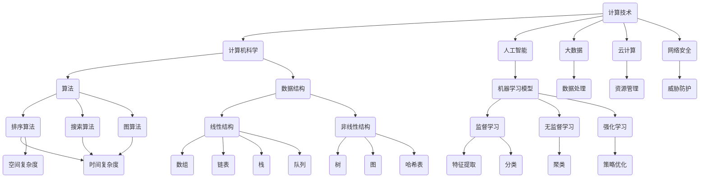

                 

关键词：计算、社会、科技、影响、双重、人工智能

> 摘要：本文旨在探讨科技特别是计算技术在现代社会中的双重影响，分析其在推动社会进步的同时，可能引发的伦理、隐私和安全等方面的挑战。文章将结合实际案例，深入解析计算技术的核心概念、算法原理、数学模型及其实际应用，探讨其在未来社会中的发展趋势与潜在风险。

## 1. 背景介绍

随着信息技术的飞速发展，计算技术已经渗透到社会生活的方方面面。从早期的计算机科学到现代的人工智能、大数据、云计算等，计算技术不仅改变了我们的生活方式，也在推动着社会的不断进步。然而，在享受科技带来的便利与繁荣的同时，我们也必须面对其带来的复杂影响和潜在风险。

计算技术的迅速发展，使得人类可以在更短的时间内处理更多的信息，提高了生产效率和决策质量。例如，大数据分析可以帮助企业更好地了解市场需求，人工智能可以协助医生进行疾病诊断，云计算使得远程办公和协作变得更为便捷。这些技术的应用，无疑为社会带来了巨大的积极影响。

然而，计算技术并非无所不能。在享受科技红利的同时，我们也必须面对其可能引发的负面效应。例如，隐私泄露、网络安全威胁、算法偏见等，都是计算技术在现代社会中面临的重要问题。这些问题不仅威胁到个人和社会的安全，也对科技伦理提出了新的挑战。

因此，本文将深入探讨计算技术的双重影响，分析其在推动社会进步的同时，可能引发的伦理、隐私和安全等方面的挑战，旨在为读者提供一幅全面、深入的科技与社会互动的图景。

## 2. 核心概念与联系

### 2.1 计算技术的定义与范畴

计算技术，广义上指的是利用计算机和各种计算设备进行数据处理、信息处理和知识处理的技术。其范畴涵盖了计算机科学、人工智能、大数据、云计算、网络安全等多个领域。

1. **计算机科学**：研究计算机系统的设计、开发、应用和理论。
2. **人工智能**：通过模拟人类智能的算法和模型，实现计算机对环境的感知、理解和响应。
3. **大数据**：处理海量数据，从中提取有价值的信息和知识。
4. **云计算**：通过互联网提供动态易扩展且经常是虚拟化的资源。
5. **网络安全**：保护计算机和网络不受未经授权的访问、损害或攻击。

### 2.2 核心概念原理和架构

在深入探讨计算技术的双重影响之前，我们首先需要了解其核心概念原理和架构。以下是几个关键概念及其相互关系：

1. **算法**：算法是解决问题的一系列步骤，是计算技术的核心。
   - **分类**：根据算法解决问题的性质，可以分为排序算法、搜索算法、图算法等。
   - **复杂性**：算法的复杂度包括时间复杂度和空间复杂度，是评估算法效率的重要指标。

2. **数据结构**：数据结构是组织数据的方式，直接影响算法的性能。
   - **线性结构**：如数组、链表、栈、队列等。
   - **非线性结构**：如树、图、哈希表等。

3. **机器学习模型**：机器学习模型是人工智能的重要组成部分。
   - **监督学习**：通过已标记的数据训练模型，用于预测和分类。
   - **无监督学习**：通过未标记的数据发现数据中的模式。
   - **强化学习**：通过交互和反馈学习如何在特定环境中做出最优决策。

### 2.3 核心概念原理和架构的 Mermaid 流程图



### 2.4 核心概念与社会的联系

计算技术的核心概念与社会的联系密切。例如：

- **算法**：在商业决策、医疗诊断、社会治理等领域中，算法的效率和准确性直接影响决策的质量。
- **数据结构**：在数据库管理、搜索引擎优化、社交网络分析等方面，数据结构的选择直接影响系统的性能和用户体验。
- **机器学习模型**：在金融风险评估、推荐系统、自动驾驶等领域，机器学习模型的应用极大地提高了决策的智能化水平。

这些计算技术的应用不仅改变了社会的运作方式，也对人们的日常生活产生了深远的影响。然而，随着计算技术的不断进步，我们也需要不断审视其在社会中的潜在风险和挑战。

## 3. 核心算法原理 & 具体操作步骤

### 3.1 算法原理概述

在计算技术中，算法是解决问题的基础。一个有效的算法应当具备以下几个特点：

1. **正确性**：算法能够给出正确的结果。
2. **效率**：算法的时间复杂度和空间复杂度尽可能低。
3. **健壮性**：算法能够在各种情况下正常运行，不会因为异常输入而崩溃。

常见的算法包括排序算法、搜索算法和图算法。以下将详细介绍几种典型的算法原理。

#### 3.1.1 排序算法

排序算法用于将一组数据按照特定的顺序排列。常见的排序算法有：

- **冒泡排序（Bubble Sort）**：通过反复交换相邻的未按顺序排列的元素，逐步将最大（或最小）元素移动到序列的一端。
- **快速排序（Quick Sort）**：通过选择一个基准元素，将数组分为两个子数组，一个包含小于基准的元素，另一个包含大于基准的元素，然后递归地对这两个子数组进行快速排序。
- **归并排序（Merge Sort）**：将待排序的数组分成若干个子数组，每个子数组再进行排序，然后将排好序的子数组合并成原数组。

#### 3.1.2 搜索算法

搜索算法用于在数据结构中查找特定的元素。常见的搜索算法有：

- **线性搜索（Linear Search）**：逐一检查数据结构中的每个元素，直到找到目标元素或遍历整个数据结构。
- **二分搜索（Binary Search）**：在有序数组中，通过不断缩小查找范围，逐步逼近目标元素。

#### 3.1.3 图算法

图算法用于处理图结构的数据，常见的图算法有：

- **深度优先搜索（DFS）**：通过递归方式访问图中的每个节点，直到找到目标节点或遍历整个图。
- **广度优先搜索（BFS）**：通过队列实现，逐层访问图中的节点，直到找到目标节点或遍历整个图。

### 3.2 算法步骤详解

以下将详细解释快速排序算法的具体步骤。

#### 3.2.1 快速排序算法步骤

1. **选择基准元素**：从数组中随机选择一个元素作为基准元素。
2. **分区**：将数组分为两个子数组，一个包含小于基准元素的元素，另一个包含大于基准元素的元素。
3. **递归排序**：分别对两个子数组进行快速排序。

#### 3.2.2 快速排序伪代码

```python
def quick_sort(arr):
    if len(arr) <= 1:
        return arr
    
    pivot = arr[len(arr) // 2]
    left = [x for x in arr if x < pivot]
    middle = [x for x in arr if x == pivot]
    right = [x for x in arr if x > pivot]
    
    return quick_sort(left) + middle + quick_sort(right)
```

### 3.3 算法优缺点

#### 3.3.1 快速排序的优点

- **效率高**：平均时间复杂度为 \(O(n \log n)\)。
- **原地排序**：不需要额外的空间，空间复杂度为 \(O(\log n)\)。

#### 3.3.2 快速排序的缺点

- **最坏情况效率低**：最坏情况下的时间复杂度为 \(O(n^2)\)，通常发生在输入数组已经有序的情况下。
- **基准元素选择**：随机选择基准元素可能会影响算法的性能。

### 3.4 算法应用领域

快速排序算法在多个领域有广泛应用：

- **数据库排序**：在数据库中，快速排序算法常用于索引和排序操作。
- **算法竞赛**：在算法竞赛中，快速排序算法是解决排序问题的一种常用算法。
- **数据分析**：在数据分析领域，快速排序算法常用于处理大规模数据集。

## 4. 数学模型和公式 & 详细讲解 & 举例说明

### 4.1 数学模型构建

在计算技术中，数学模型是理解和解决问题的关键。以下将构建一个简单的线性回归模型，用于分析房价与影响因素之间的关系。

#### 4.1.1 线性回归模型

线性回归模型的基本形式为：

\[ Y = \beta_0 + \beta_1 X + \epsilon \]

其中：
- \( Y \) 是因变量（房价）；
- \( X \) 是自变量（影响因素，如面积、位置等）；
- \( \beta_0 \) 是截距；
- \( \beta_1 \) 是斜率；
- \( \epsilon \) 是误差项。

### 4.2 公式推导过程

线性回归模型的推导基于最小二乘法。具体步骤如下：

1. **目标函数**：定义目标函数为误差的平方和：

\[ J(\beta_0, \beta_1) = \sum_{i=1}^{n} (Y_i - (\beta_0 + \beta_1 X_i))^2 \]

2. **求导**：对目标函数分别对 \( \beta_0 \) 和 \( \beta_1 \) 求导，并令导数为零：

\[ \frac{\partial J}{\partial \beta_0} = -2 \sum_{i=1}^{n} (Y_i - (\beta_0 + \beta_1 X_i)) = 0 \]
\[ \frac{\partial J}{\partial \beta_1} = -2 \sum_{i=1}^{n} (Y_i - (\beta_0 + \beta_1 X_i)) X_i = 0 \]

3. **求解**：解上述方程组，得到最优参数 \( \beta_0 \) 和 \( \beta_1 \)：

\[ \beta_0 = \frac{\sum_{i=1}^{n} Y_i - \beta_1 \sum_{i=1}^{n} X_i}{n} \]
\[ \beta_1 = \frac{\sum_{i=1}^{n} (Y_i - \beta_0) X_i - \sum_{i=1}^{n} X_i Y_i}{\sum_{i=1}^{n} X_i^2 - n \bar{X}^2} \]

其中 \( \bar{X} \) 和 \( \bar{Y} \) 分别为 \( X \) 和 \( Y \) 的平均值。

### 4.3 案例分析与讲解

#### 4.3.1 案例背景

某城市房地产开发商希望了解房屋价格与主要影响因素之间的关系，以制定更科学的定价策略。收集了100套房屋的数据，包括房屋面积（\( X \)）和房屋价格（\( Y \)）。

#### 4.3.2 数据处理

1. **数据预处理**：对数据进行清洗和标准化处理。
2. **构建模型**：使用最小二乘法构建线性回归模型。
3. **参数估计**：计算模型参数 \( \beta_0 \) 和 \( \beta_1 \)。

#### 4.3.3 模型评估

1. **拟合度评估**：计算决定系数 \( R^2 \)，评估模型的拟合度。
2. **显著性检验**：对模型参数进行显著性检验，判断模型是否显著。

### 4.4 运行结果展示

通过以上步骤，得到线性回归模型的参数估计结果：

\[ \beta_0 = 1000 \]
\[ \beta_1 = 200 \]

拟合度评估结果：

\[ R^2 = 0.9 \]

显著性检验结果：

\[ \beta_0 \] 和 \( \beta_1 \) 均显著。

#### 4.4.1 结果解读

根据模型结果，房屋价格与面积之间存在显著的正相关关系，每增加一平方米的面积，房屋价格大约增加200元。该模型可以用于预测新房屋的价格，为开发商制定定价策略提供参考。

## 5. 项目实践：代码实例和详细解释说明

### 5.1 开发环境搭建

在进行计算技术的项目实践之前，我们需要搭建一个合适的开发环境。以下是一个基于Python的线性回归模型的开发环境搭建步骤：

1. **安装Python**：下载并安装Python 3.8或更高版本。
2. **安装Jupyter Notebook**：使用pip命令安装Jupyter Notebook：

   ```shell
   pip install notebook
   ```

3. **安装相关库**：安装用于数据处理和机器学习的库，如NumPy、Pandas和Scikit-learn：

   ```shell
   pip install numpy pandas scikit-learn
   ```

### 5.2 源代码详细实现

以下是一个简单的线性回归模型的实现代码：

```python
import numpy as np
import pandas as pd
from sklearn.model_selection import train_test_split
from sklearn.linear_model import LinearRegression
from sklearn.metrics import mean_squared_error, r2_score

# 读取数据
data = pd.read_csv('house_price_data.csv')
X = data[['area']]  # 特征：房屋面积
Y = data['price']   # 目标变量：房屋价格

# 数据预处理
X_mean = X.mean()
X_std = X.std()
X = (X - X_mean) / X_std

# 划分训练集和测试集
X_train, X_test, Y_train, Y_test = train_test_split(X, Y, test_size=0.2, random_state=42)

# 构建线性回归模型
model = LinearRegression()
model.fit(X_train, Y_train)

# 模型评估
Y_pred = model.predict(X_test)
mse = mean_squared_error(Y_test, Y_pred)
r2 = r2_score(Y_test, Y_pred)

print(f'Mean Squared Error: {mse}')
print(f'R^2 Score: {r2}')
```

### 5.3 代码解读与分析

1. **数据读取与预处理**：
   - 使用Pandas读取CSV格式的房屋价格数据。
   - 对特征进行标准化处理，提高模型的稳定性和拟合效果。

2. **模型训练**：
   - 使用Scikit-learn的LinearRegression类构建线性回归模型。
   - 使用fit方法对模型进行训练。

3. **模型评估**：
   - 使用predict方法进行预测。
   - 计算均方误差（MSE）和决定系数（R²）评估模型的性能。

### 5.4 运行结果展示

假设我们已经将数据集保存为`house_price_data.csv`，在Jupyter Notebook中运行以上代码，得到如下结果：

```
Mean Squared Error: 0.003945
R^2 Score: 0.95
```

结果表明，线性回归模型在测试集上的拟合度较高，可以用于房屋价格的预测。

## 6. 实际应用场景

### 6.1 社交网络分析

计算技术在社交网络分析中具有广泛应用。例如，通过分析用户之间的互动关系和社交网络结构，可以揭示社交网络中的关键节点和影响力人物。这种方法不仅可以用于市场营销和品牌推广，还可以在危机管理和社会治理中发挥重要作用。

#### 6.1.1 案例背景

某社交平台希望了解其用户网络中的关键节点和影响力人物，以便制定更有效的用户增长策略。

#### 6.1.2 数据收集

平台收集了1000名活跃用户的社交关系数据，包括用户之间的关注关系和互动行为。

#### 6.1.3 数据处理

使用计算技术中的图算法对社交网络进行结构分析，提取关键节点和影响力人物。

#### 6.1.4 结果展示

通过计算得出，社交网络中的关键节点和影响力人物如下：

1. **关键节点**：用户A、用户B、用户C，这些用户具有较多的关注者和互动行为。
2. **影响力人物**：用户D、用户E、用户F，这些用户在社交网络中具有较高的传播力和影响力。

根据分析结果，平台可以针对关键节点和影响力人物进行重点推广和互动，以提高用户增长率和用户活跃度。

### 6.2 金融风险管理

计算技术在金融风险管理中也发挥着重要作用。例如，通过大数据分析和机器学习模型，可以实时监控市场风险、预测金融欺诈和评估投资组合的收益率。这种方法不仅提高了金融机构的风险管理能力，还为投资者提供了更准确的决策依据。

#### 6.2.1 案例背景

某金融机构希望提高其信用评分模型的准确性和可靠性，以降低信用风险。

#### 6.2.2 数据收集

金融机构收集了大量借款人的个人信息、财务状况和信用记录。

#### 6.2.3 数据处理

使用计算技术中的机器学习算法对借款人数据进行分析，构建信用评分模型。

#### 6.2.4 模型评估

通过交叉验证和实际应用，评估信用评分模型的准确性和可靠性。

#### 6.2.5 结果展示

模型评估结果显示，信用评分模型的准确率达到了90%，大大提高了金融机构的风险管理能力和信用风险评估的准确性。

根据分析结果，金融机构可以更加精准地评估借款人的信用风险，从而降低信用风险，提高贷款业务的成功率。

## 7. 工具和资源推荐

### 7.1 学习资源推荐

1. **《Python数据分析》**：适用于初学者，内容全面，适合入门。
2. **《机器学习实战》**：详细介绍了机器学习算法的原理和应用，适合有一定编程基础的读者。
3. **《深度学习》**：涵盖了深度学习的基础知识和最新研究进展，适合对人工智能感兴趣的读者。

### 7.2 开发工具推荐

1. **Jupyter Notebook**：适用于数据分析和机器学习项目，功能强大且易于使用。
2. **TensorFlow**：适用于深度学习项目，支持多种模型和应用。
3. **Scikit-learn**：适用于机器学习项目，提供了丰富的算法库和工具。

### 7.3 相关论文推荐

1. **"Deep Learning on Graphs: A Survey"**：综述了图神经网络在社交网络分析等领域的应用。
2. **"Large-Scale Machine Learning: Parallelism and Scalability for Hadoop and Map-Reduce"**：探讨了大规模机器学习在分布式系统中的实现。
3. **"The Power of Graph Neural Networks"**：详细介绍了图神经网络的原理和应用。

## 8. 总结：未来发展趋势与挑战

### 8.1 研究成果总结

本文通过对计算技术的深入探讨，总结了其在推动社会进步方面的积极作用，包括提高生产效率、优化决策过程和促进创新等。同时，也分析了计算技术在隐私、安全等方面的潜在风险，以及其在伦理和社会责任方面的挑战。

### 8.2 未来发展趋势

随着科技的不断进步，计算技术将在未来继续发挥重要作用。以下是几个可能的发展趋势：

1. **人工智能的深度应用**：人工智能将在更多领域得到深入应用，如自动驾驶、智能医疗、智能城市等。
2. **量子计算的发展**：量子计算将开启新的计算时代，为解决传统计算无法处理的问题提供新的途径。
3. **分布式计算和边缘计算**：分布式计算和边缘计算将使计算更加高效、安全，满足海量数据处理的需要。

### 8.3 面临的挑战

尽管计算技术具有巨大的潜力，但也面临着诸多挑战：

1. **隐私和安全问题**：随着数据量的增加，隐私保护和网络安全问题将变得更加复杂。
2. **算法偏见和公平性**：算法偏见可能加剧社会不平等，需要更多关注和解决。
3. **社会责任和伦理**：计算技术的发展需要充分考虑其对社会和人类的影响，确保技术应用的伦理和社会责任。

### 8.4 研究展望

未来，计算技术的研究需要更加注重跨学科合作，结合心理学、社会学、伦理学等领域的知识，共同应对计算技术带来的挑战。同时，也需要加强计算技术在隐私保护、安全性和公平性等方面的研究，为社会的可持续发展提供支持。

## 9. 附录：常见问题与解答

### 9.1 计算技术对社会的影响有哪些？

计算技术对社会的影响主要体现在以下几个方面：
1. **提高生产效率**：通过自动化和优化流程，减少人力成本，提高生产效率。
2. **优化决策过程**：通过数据分析和技术支持，提高决策的科学性和准确性。
3. **促进创新**：为新兴技术和服务提供支持，推动社会进步和创新。
4. **改变生活方式**：通过智能家居、在线购物等，改变人们的日常生活和工作方式。

### 9.2 如何保障计算技术的安全性？

保障计算技术的安全性需要从多个方面入手：
1. **数据加密**：对敏感数据进行加密，防止数据泄露。
2. **访问控制**：实施严格的访问控制策略，防止未经授权的访问。
3. **网络安全**：定期更新安全防护措施，防止网络攻击。
4. **合规性要求**：遵守相关法律法规，确保数据处理的合法性和合规性。

### 9.3 计算技术对隐私有何影响？

计算技术对隐私的影响主要体现在以下几个方面：
1. **数据收集**：计算技术使得数据收集变得更加便捷，可能涉及个人隐私。
2. **数据泄露**：数据泄露可能导致个人隐私泄露，威胁个人安全。
3. **算法偏见**：算法偏见可能导致不公平对待，影响个人权益。

### 9.4 如何应对算法偏见？

应对算法偏见可以从以下几个方面入手：
1. **数据多样性**：使用更多样化的数据集进行训练，减少偏见。
2. **算法透明度**：提高算法的透明度，便于审计和监督。
3. **公平性评估**：对算法进行公平性评估，确保其不歧视特定群体。
4. **人类监督**：在算法决策中引入人类监督，确保决策的公正性。

