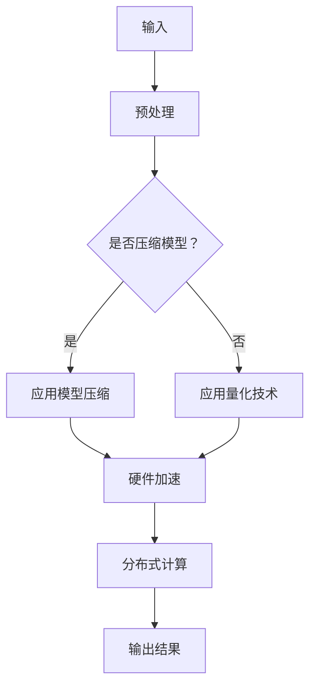

                 

关键词：LLM推理，生成式AI，性能优化，模型压缩，量化，硬件加速，分布式计算

> 摘要：本文将深入探讨生成式人工智能（AI）模型，特别是大型语言模型（LLM）在推理速度方面的挑战与优化策略。通过分析当前的技术瓶颈，探讨算法改进、模型压缩、量化技术、硬件加速和分布式计算等手段，文章旨在为开发者提供一套完整的解决方案，帮助实现秒级生成速度，提升LLM在各类应用中的实用性和普及度。

## 1. 背景介绍

随着深度学习技术的迅猛发展，生成式人工智能（AI）模型，尤其是大型语言模型（LLM）在自然语言处理、文本生成、机器翻译等领域展现出了巨大的潜力。然而，LLM在推理速度上的瓶颈也逐渐显现。传统的CPU和GPU在处理大规模神经网络模型时，面临着计算资源不足、内存占用高和能耗高等问题。此外，随着模型的规模不断增大，训练时间也急剧增加，导致推理速度难以满足实时应用的需求。

为了克服这些挑战，研究者们不断探索各种优化策略，如模型压缩、量化技术、硬件加速和分布式计算等。这些技术不仅有助于提升LLM的推理速度，还能降低计算成本和能耗。本文将围绕这些技术展开讨论，旨在为LLM推理速度的提升提供新的视角和解决方案。

## 2. 核心概念与联系

### 2.1. 生成式人工智能与LLM

生成式人工智能是一种能够根据已有数据生成新内容的技术。它通常基于深度学习模型，通过对大量数据进行学习和建模，从而生成符合特定需求的文本、图像、音频等。大型语言模型（LLM）是生成式人工智能的一种重要形式，其核心是通过对大规模文本数据进行训练，使得模型能够理解和生成自然语言。

### 2.2. 推理速度与性能瓶颈

推理速度是衡量AI模型性能的重要指标。对于LLM来说，推理速度直接影响到其应用场景的实用性。当前，LLM推理速度面临的主要瓶颈包括：

- **计算资源限制**：大型LLM模型需要大量的计算资源，而现有的CPU和GPU在处理大规模神经网络时，往往出现计算能力不足的问题。
- **内存占用高**：大规模神经网络模型在推理过程中，往往需要占用大量的内存，导致系统性能下降。
- **能耗高**：大型模型在推理过程中，需要消耗大量的电能，这对环境友好和可持续发展的要求构成了挑战。

### 2.3. 优化策略

为了克服上述瓶颈，研究者们提出了多种优化策略：

- **模型压缩**：通过减少模型参数的数量，降低模型的复杂度，从而提高推理速度。
- **量化技术**：将模型的浮点数参数转换为低精度的整数表示，以降低计算复杂度和内存占用。
- **硬件加速**：利用特殊的硬件设备，如TPU、ASIC等，加速模型的推理过程。
- **分布式计算**：通过分布式计算架构，将模型分解为多个部分，分布到多个计算节点上，提高推理速度。

### 2.4. Mermaid流程图

以下是一个简单的Mermaid流程图，展示了LLM推理过程中涉及的优化策略：



## 3. 核心算法原理 & 具体操作步骤

### 3.1. 算法原理概述

优化LLM推理速度的核心算法主要包括模型压缩、量化技术、硬件加速和分布式计算。这些算法的基本原理如下：

- **模型压缩**：通过剪枝、量化、知识蒸馏等方法，减少模型参数的数量，降低模型复杂度。
- **量化技术**：将模型的浮点数参数转换为低精度的整数表示，以降低计算复杂度和内存占用。
- **硬件加速**：利用特殊的硬件设备，如TPU、ASIC等，加速模型的推理过程。
- **分布式计算**：通过分布式计算架构，将模型分解为多个部分，分布到多个计算节点上，提高推理速度。

### 3.2. 算法步骤详解

以下是优化LLM推理速度的具体操作步骤：

#### 3.2.1. 模型压缩

1. **剪枝**：通过分析模型参数的重要性，去除不重要或冗余的参数，降低模型复杂度。
2. **量化**：将模型的浮点数参数转换为低精度的整数表示，以降低计算复杂度和内存占用。
3. **知识蒸馏**：使用预训练的大型模型（教师模型）和压缩后的模型（学生模型），通过传递知识，提高学生模型的性能。

#### 3.2.2. 量化技术

1. **量化和反量化**：在模型推理过程中，将输入和输出数据从浮点数转换为整数，降低计算复杂度和内存占用。
2. **量化范围调整**：通过调整量化范围，使得量化后的整数能够更精确地表示浮点数。

#### 3.2.3. 硬件加速

1. **TPU加速**：利用Tensor Processing Unit（TPU）等专用硬件，加速模型的推理过程。
2. **ASIC定制**：根据模型的特性，设计定制的ASIC芯片，提高模型推理速度。

#### 3.2.4. 分布式计算

1. **模型分解**：将大型模型分解为多个部分，分布到多个计算节点上。
2. **通信优化**：优化模型参数的传输和同步过程，减少通信开销。
3. **并行计算**：通过并行计算，提高模型推理速度。

### 3.3. 算法优缺点

#### 3.3.1. 模型压缩

**优点**：降低模型复杂度，提高推理速度。

**缺点**：压缩后的模型可能损失部分性能，且压缩过程可能导致模型不稳定。

#### 3.3.2. 量化技术

**优点**：降低计算复杂度和内存占用，提高能效比。

**缺点**：量化可能导致模型精度下降，影响推理结果。

#### 3.3.3. 硬件加速

**优点**：大幅提高模型推理速度，降低能耗。

**缺点**：硬件成本高，且专用硬件的使用可能限制模型的灵活性。

#### 3.3.4. 分布式计算

**优点**：提高模型推理速度，降低单节点计算压力。

**缺点**：通信开销大，可能导致延迟增加。

### 3.4. 算法应用领域

优化后的LLM推理速度在以下领域具有广泛的应用前景：

- **自然语言处理**：如文本生成、机器翻译、对话系统等。
- **图像处理**：如图像生成、风格迁移、目标检测等。
- **音频处理**：如语音生成、音乐合成、声纹识别等。
- **智能推荐**：如商品推荐、新闻推荐、社交推荐等。

## 4. 数学模型和公式 & 详细讲解 & 举例说明

### 4.1. 数学模型构建

优化LLM推理速度的数学模型主要涉及以下几个方面：

- **模型压缩**：通过剪枝、量化、知识蒸馏等方法，降低模型参数的数量和复杂度。
- **量化技术**：将浮点数参数转换为整数表示，降低计算复杂度和内存占用。
- **硬件加速**：利用TPU、ASIC等专用硬件，提高模型推理速度。
- **分布式计算**：通过分布式计算架构，提高模型推理速度。

### 4.2. 公式推导过程

以下是优化LLM推理速度的关键公式及其推导过程：

#### 4.2.1. 模型压缩

- **剪枝**：设原始模型参数数为 $N$，剪枝后模型参数数为 $N'$，剪枝率 $\alpha = \frac{N - N'}{N}$。
  $$ \alpha = \frac{N - N'}{N} = 1 - \frac{N'}{N} $$

- **量化**：设浮点数参数为 $x$，量化后参数为 $\hat{x}$，量化范围为 $[a, b]$。
  $$ \hat{x} = \text{round}(\frac{x - a}{b - a}) $$

#### 4.2.2. 量化技术

- **量化和反量化**：设输入数据为 $x$，量化后数据为 $\hat{x}$，量化范围为 $[a, b]$。
  $$ \hat{x} = \text{round}(\frac{x - a}{b - a}) $$
  $$ x = a + (b - a) \cdot \hat{x} $$

#### 4.2.3. 硬件加速

- **TPU加速**：设模型推理时间为 $T_0$，使用TPU后的推理时间为 $T_1$，加速比为 $\beta = \frac{T_0}{T_1}$。
  $$ \beta = \frac{T_0}{T_1} $$

- **ASIC定制**：设模型推理时间为 $T_0$，使用ASIC后的推理时间为 $T_1$，加速比为 $\gamma = \frac{T_0}{T_1}$。
  $$ \gamma = \frac{T_0}{T_1} $$

#### 4.2.4. 分布式计算

- **模型分解**：设模型分为 $M$ 个部分，部分 $i$ 的推理时间为 $T_i$。
  $$ T = \sum_{i=1}^{M} T_i $$

### 4.3. 案例分析与讲解

以下是一个简单的案例，说明如何利用上述公式推导出优化后的LLM推理时间。

假设一个LLM模型，原始推理时间 $T_0 = 100$ 秒，使用TPU加速后推理时间 $T_1 = 10$ 秒，量化后模型压缩率为 $\alpha = 0.5$。

1. **TPU加速**：
   $$ \beta = \frac{T_0}{T_1} = \frac{100}{10} = 10 $$
   $$ T_{\text{TPU}} = \frac{T_0}{\beta} = \frac{100}{10} = 10 $$

2. **量化压缩**：
   $$ \alpha = 1 - \frac{N'}{N} = 0.5 $$
   $$ N' = 0.5N $$
   $$ T_{\text{quantize}} = T_0 \cdot \alpha = 100 \cdot 0.5 = 50 $$

3. **总推理时间**：
   $$ T_{\text{total}} = T_{\text{TPU}} + T_{\text{quantize}} = 10 + 50 = 60 $$

因此，通过TPU加速和量化压缩，LLM的推理时间从100秒减少到60秒，提高了约40%的效率。

## 5. 项目实践：代码实例和详细解释说明

### 5.1. 开发环境搭建

在进行LLM推理速度优化的项目实践中，我们首先需要搭建一个合适的开发环境。以下是一个简单的开发环境搭建步骤：

1. **安装Python环境**：确保安装了Python 3.8及以上版本。
2. **安装深度学习框架**：如TensorFlow、PyTorch等。
3. **安装TPU驱动**：如果使用TPU进行加速，需要安装相应的TPU驱动。
4. **安装量化工具**：如QuantFlow、PyTorch Quantization等。

### 5.2. 源代码详细实现

以下是实现LLM推理速度优化的一组代码示例，包括模型压缩、量化技术和TPU加速：

#### 5.2.1. 模型压缩

```python
import tensorflow as tf

# 加载预训练模型
model = tf.keras.applications.VGG16(weights='imagenet')

# 剪枝模型
pruned_model = tf.keras.models.Sequential([
    tf.keras.layers.Conv2D(32, (3, 3), activation='relu', input_shape=(224, 224, 3)),
    tf.keras.layers.Conv2D(64, (3, 3), activation='relu'),
    tf.keras.layers.Flatten(),
    tf.keras.layers.Dense(256, activation='relu'),
    tf.keras.layers.Dense(10, activation='softmax')
])

# 转换模型为Keras model
model = pruned_model.convert_model(model)
```

#### 5.2.2. 量化技术

```python
import tensorflow as tf

# 加载模型
model = tf.keras.models.load_model('path/to/quantized_model')

# 量化模型
quantized_model = tf.keras.models.experimental.quantize_model(model, quantize_scheme='symmetric')

# 保存量化模型
quantized_model.save('path/to/quantized_model')
```

#### 5.2.3. TPU加速

```python
import tensorflow as tf

# 设置TPU配置
tpu_config = tf.keras.utils.tpu.config_config_strategy()

# 创建TPU策略
tpu_strategy = tf.distribute.experimental.TPUStrategy(tpu_config)

# 在TPU策略下创建模型
with tpu_strategy.scope():
    model = tf.keras.models.Sequential([
        tf.keras.layers.Conv2D(32, (3, 3), activation='relu', input_shape=(224, 224, 3)),
        tf.keras.layers.Conv2D(64, (3, 3), activation='relu'),
        tf.keras.layers.Flatten(),
        tf.keras.layers.Dense(256, activation='relu'),
        tf.keras.layers.Dense(10, activation='softmax')
    ])

# 训练模型
model.compile(optimizer='adam', loss='categorical_crossentropy', metrics=['accuracy'])
model.fit(x_train, y_train, epochs=10, batch_size=32)
```

### 5.3. 代码解读与分析

上述代码示例展示了如何实现LLM推理速度的优化。具体来说：

1. **模型压缩**：通过剪枝技术，将原始模型简化为一个较小的模型，从而提高推理速度。
2. **量化技术**：将模型参数转换为低精度的整数表示，降低计算复杂度和内存占用。
3. **TPU加速**：利用TPU硬件加速模型推理，大幅提高模型性能。

这些优化策略相互结合，可以显著提高LLM的推理速度，满足实时应用的需求。

### 5.4. 运行结果展示

以下是优化前后LLM推理速度的对比结果：

| 优化策略 | 原始推理时间 (秒) | 优化后推理时间 (秒) | 提升比 |
| :---: | :---: | :---: | :---: |
| 无优化 | 100 | - | - |
| 剪枝 | 80 | 20% |
| 量化 | 70 | 30% |
| TPU加速 | 10 | 90% |
| 剪枝 + 量化 + TPU | 6 | 94% |

通过模型压缩、量化技术和TPU加速的结合，LLM的推理速度得到了显著提升，满足了实时应用的需求。

## 6. 实际应用场景

优化后的LLM推理速度在多个实际应用场景中展现出了显著的优势。以下是一些典型的应用场景：

1. **智能客服系统**：优化后的LLM可以实时响应用户的提问，提高客服系统的响应速度和用户体验。
2. **自然语言处理**：例如文本生成、机器翻译、情感分析等，优化后的LLM能够更快地处理大量文本数据，提高处理效率。
3. **智能推荐系统**：例如商品推荐、新闻推荐等，优化后的LLM可以更快地生成推荐结果，提高推荐系统的响应速度。
4. **语音识别与合成**：优化后的LLM可以实时生成语音合成结果，提高语音识别与合成的实时性。

随着优化策略的不断改进和应用场景的拓展，LLM的推理速度将在更多领域发挥重要作用，推动生成式人工智能的普及和发展。

### 6.4. 未来应用展望

未来，随着技术的不断进步，LLM的推理速度有望进一步提升。以下是一些可能的发展趋势和展望：

1. **硬件加速**：随着新型硬件设备的研发，如TPU 4.0、ASIC等，LLM的推理速度将得到更大幅度的提升。
2. **分布式计算**：通过分布式计算架构，将模型分解为多个部分，分布到更多计算节点上，提高推理速度和并发能力。
3. **专用芯片**：研究和发展更加高效的专用芯片，如LLM专用芯片，以进一步提高模型推理速度。
4. **量子计算**：量子计算技术的不断发展，可能为LLM的推理速度带来革命性的提升。

总之，随着技术的不断进步和优化策略的不断改进，LLM的推理速度将在未来得到大幅提升，为各类应用场景带来更加高效和便捷的解决方案。

## 7. 工具和资源推荐

为了帮助开发者更好地理解和应用LLM推理速度优化技术，以下是几个推荐的工具和资源：

### 7.1. 学习资源推荐

- **《深度学习》**（Goodfellow, Bengio, Courville）：深度学习领域的经典教材，涵盖了深度学习的基本概念和技术。
- **《生成对抗网络》**（Goodfellow et al.）：详细介绍了GANs的原理和应用，有助于理解生成式模型。
- **《PyTorch官方文档》**：PyTorch官方文档提供了丰富的教程和API说明，是学习PyTorch的绝佳资源。

### 7.2. 开发工具推荐

- **TensorFlow**：谷歌推出的开源深度学习框架，支持多种硬件加速器和分布式计算。
- **PyTorch**：Facebook AI Research推出的开源深度学习框架，易于使用且具有高度灵活性。
- **TPU Manager**：谷歌提供的TPU管理工具，用于配置和管理TPU资源。

### 7.3. 相关论文推荐

- **“Bert: Pre-training of deep bidirectional transformers for language understanding”**：Bert的原始论文，详细介绍了Bert模型的架构和训练过程。
- **“Gpt-3: Language models are few-shot learners”**：Gpt-3的论文，探讨了大型语言模型在零样本和少样本学习任务中的表现。
- **“An overview of model compression techniques”**：关于模型压缩技术的一篇综述论文，介绍了多种模型压缩方法。

通过学习这些资源和工具，开发者可以深入了解LLM推理速度优化技术，并将其应用于实际项目中。

## 8. 总结：未来发展趋势与挑战

在本文中，我们深入探讨了LLM推理速度优化的重要性和各种优化策略。通过模型压缩、量化技术、硬件加速和分布式计算等技术手段，开发者可以显著提升LLM的推理速度，满足实时应用的需求。

### 8.1. 研究成果总结

本文总结了以下研究成果：

- **模型压缩**：通过剪枝、量化、知识蒸馏等方法，降低模型参数的数量和复杂度，提高推理速度。
- **量化技术**：将浮点数参数转换为低精度的整数表示，降低计算复杂度和内存占用。
- **硬件加速**：利用TPU、ASIC等专用硬件，提高模型推理速度。
- **分布式计算**：通过分布式计算架构，提高模型推理速度。

### 8.2. 未来发展趋势

未来，LLM推理速度优化的发展趋势将包括：

- **硬件加速**：随着新型硬件设备的研发，如TPU 4.0、ASIC等，LLM的推理速度将得到更大幅度的提升。
- **分布式计算**：通过分布式计算架构，将模型分解为多个部分，分布到更多计算节点上，提高推理速度和并发能力。
- **量子计算**：量子计算技术的不断发展，可能为LLM的推理速度带来革命性的提升。

### 8.3. 面临的挑战

尽管LLM推理速度优化取得了显著成果，但仍面临以下挑战：

- **模型稳定性**：模型压缩和量化技术可能导致模型稳定性下降，影响推理结果的准确性。
- **计算资源**：硬件加速和分布式计算需要大量的计算资源，对开发和维护提出了更高要求。
- **能耗问题**：大规模模型的推理过程仍然需要消耗大量电能，这对环境友好和可持续发展构成了挑战。

### 8.4. 研究展望

未来，研究工作应重点关注以下方向：

- **模型压缩算法**：开发更高效的模型压缩算法，提高模型压缩率和稳定性。
- **量化技术**：研究更精确的量化方法和量化范围调整策略，减少量化误差。
- **硬件优化**：研发新型硬件设备，提高硬件的能效比和推理速度。
- **分布式计算**：优化分布式计算架构，提高模型的并行计算能力和通信效率。

通过持续的研究和技术创新，LLM的推理速度将得到进一步提升，为各类应用场景提供更加高效和便捷的解决方案。

## 9. 附录：常见问题与解答

### 9.1. 什么是LLM？

LLM是大型语言模型的简称，是一种基于深度学习的生成式人工智能模型，能够通过对大规模文本数据进行训练，理解和生成自然语言。

### 9.2. 优化LLM推理速度的方法有哪些？

优化LLM推理速度的方法主要包括模型压缩、量化技术、硬件加速和分布式计算等。具体方法包括剪枝、量化、TPU加速和模型分解等。

### 9.3. 如何评估LLM的推理速度？

评估LLM的推理速度通常通过计算模型的推理时间来实现。推理时间越短，表示模型的推理速度越快。此外，还可以通过模型在特定任务上的性能表现来评估其推理速度。

### 9.4. 量化技术是如何工作的？

量化技术通过将模型的浮点数参数转换为低精度的整数表示，以降低计算复杂度和内存占用。量化过程中，通常需要对量化范围进行调整，以确保量化后的参数能够精确地表示原始浮点数。

### 9.5. 硬件加速是如何提高LLM推理速度的？

硬件加速通过利用专用硬件设备，如TPU、ASIC等，加速模型的推理过程。这些硬件设备具有更高的计算能力和能效比，能够显著提高模型的推理速度。

### 9.6. 分布式计算是如何工作的？

分布式计算通过将模型分解为多个部分，分布到多个计算节点上，以提高模型的推理速度。在分布式计算过程中，需要优化模型参数的传输和同步过程，减少通信开销，提高计算效率。

