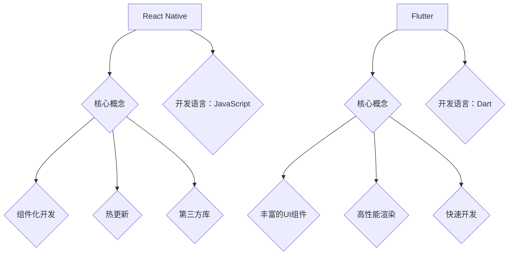

                 

关键词：移动端开发，React Native，Flutter，框架对比，原生应用，跨平台开发，性能优化，开发工具，未来展望

摘要：本文将深入探讨移动端开发领域中的两大热门框架：React Native和Flutter。通过对它们的特性、优缺点以及实际应用场景的对比分析，为开发者提供一种选择适合自己项目的移动开发框架的参考。同时，本文还将展望这两种框架的未来发展趋势，以及面临的挑战。

## 1. 背景介绍

随着移动互联网的快速发展，移动端应用开发成为了软件开发领域的重要组成部分。开发者需要面对多种不同的移动端操作系统，如iOS和Android。为了提高开发效率，减少重复劳动，跨平台开发框架应运而生。

React Native和Flutter是当前最流行的两大移动端开发框架。React Native由Facebook开发，采用JavaScript作为开发语言，通过一套类似于HTML和CSS的声明式UI框架实现原生应用的跨平台开发。Flutter则是由谷歌推出的一个全新的移动应用开发框架，使用Dart语言编写，提供了一个丰富的UI组件库，使得开发者可以以接近原生应用的方式构建跨平台应用。

本文将从以下几个方面对比React Native和Flutter：

1. **核心概念与联系**
2. **核心算法原理 & 具体操作步骤**
3. **数学模型和公式 & 详细讲解 & 举例说明**
4. **项目实践：代码实例和详细解释说明**
5. **实际应用场景**
6. **未来应用展望**
7. **工具和资源推荐**
8. **总结：未来发展趋势与挑战**

通过以上内容的对比，希望能够为开发者提供一个全面而深入的参考。

## 2. 核心概念与联系

首先，我们需要明确React Native和Flutter的一些核心概念和它们之间的联系。

### React Native

React Native是一个用于构建原生应用的跨平台框架，它允许开发者使用JavaScript来编写应用逻辑和界面组件。React Native的核心是React，一个用于构建用户界面的JavaScript库。React Native通过JavaScriptCore引擎将JavaScript代码转换为原生代码，实现与原生应用的性能接近。

React Native的关键特性包括：

- **组件化开发**：React Native采用组件化的开发模式，使得界面开发更加模块化和可复用。
- **热更新**：React Native支持热更新，开发者可以在不重启应用的情况下进行界面和逻辑的修改。
- **丰富的第三方库**：由于JavaScript的流行，React Native拥有大量的第三方库和组件，方便开发者快速开发应用。

### Flutter

Flutter是一个由谷歌推出的全新移动应用开发框架，使用Dart语言编写。Flutter通过提供一套丰富的UI组件库，使得开发者可以以接近原生应用的方式构建跨平台应用。Flutter的核心是它的渲染引擎Skia，它使用了一套称为“Flutter引擎”的底层实现，使得Flutter应用可以在iOS和Android平台上运行。

Flutter的关键特性包括：

- **丰富的UI组件**：Flutter提供了一套丰富的UI组件库，使得开发者可以轻松地构建复杂的用户界面。
- **高性能渲染**：Flutter使用自研的渲染引擎Skia，使得Flutter应用具有高性能和流畅的用户体验。
- **快速开发**：Dart语言具有强类型、易于编写和快速编译的特点，使得Flutter开发过程更加高效。

### 联系

尽管React Native和Flutter采用了不同的技术和语言，但它们的目标都是实现高效的跨平台移动应用开发。两者都提供了一套丰富的组件库，支持热更新和模块化开发，使得开发者可以更专注于应用的业务逻辑，而无需关心底层的平台差异。

以下是一个Mermaid流程图，展示了React Native和Flutter之间的联系：



通过上面的流程图，我们可以清晰地看到React Native和Flutter的核心概念和特性。

### 2.1 核心概念原理

在深入理解React Native和Flutter的核心概念之前，我们需要了解它们的工作原理。

#### React Native

React Native的工作原理可以概括为以下几点：

1. **JavaScriptCore引擎**：React Native使用JavaScriptCore引擎将JavaScript代码转换为原生代码。
2. **原生模块桥接**：React Native通过原生模块桥接，将JavaScript代码与原生代码进行交互。
3. **组件渲染**：React Native使用React的虚拟DOM机制，将JavaScript编写的组件渲染成原生组件。

#### Flutter

Flutter的工作原理则更为复杂，主要包括以下几点：

1. **Dart代码编译**：Flutter使用Dart语言编写应用逻辑，Dart代码经过编译器编译成机器码。
2. **渲染引擎Skia**：Flutter使用自研的渲染引擎Skia，将Dart编写的UI组件渲染成像素。
3. **框架层**：Flutter提供了一个完整的框架层，包括事件处理、动画、布局等，使得开发者可以专注于业务逻辑。

### 2.2 架构

React Native和Flutter的架构也有所不同。

#### React Native

React Native的架构主要包括以下几层：

1. **JavaScript层**：开发者使用JavaScript编写应用逻辑和界面组件。
2. **原生模块层**：React Native通过原生模块桥接与原生代码进行交互。
3. **原生组件层**：React Native将JavaScript编写的组件渲染成原生组件。

#### Flutter

Flutter的架构则更为简洁，主要包括以下几层：

1. **Dart层**：开发者使用Dart语言编写应用逻辑和界面组件。
2. **渲染层**：Flutter使用自研的渲染引擎Skia进行渲染。
3. **框架层**：Flutter提供了一个完整的框架层，包括事件处理、动画、布局等。

### 2.3 关系

React Native和Flutter的关系可以理解为两种不同的实现方式，但它们的目标是一致的：提供高效的跨平台移动应用开发解决方案。

1. **组件化开发**：React Native和Flutter都支持组件化开发，使得界面开发更加模块化和可复用。
2. **热更新**：React Native和Flutter都支持热更新，方便开发者进行界面和逻辑的修改。
3. **第三方库**：React Native和Flutter都有丰富的第三方库和组件，方便开发者快速开发应用。

通过上述对React Native和Flutter核心概念与联系的介绍，我们可以更深入地理解这两个框架，为后续的对比分析打下基础。

## 3. 核心算法原理 & 具体操作步骤

### 3.1 算法原理概述

在移动应用开发中，React Native和Flutter都涉及到一些核心算法原理，这些原理对于应用的性能和用户体验至关重要。

#### React Native

React Native的核心算法主要包括以下几个方面：

1. **虚拟DOM**：React Native使用虚拟DOM机制，通过将JavaScript编写的组件转换为原生组件，实现高效的状态更新和渲染。
2. **原生模块桥接**：React Native通过原生模块桥接，实现JavaScript代码与原生代码的交互，使得应用可以调用原生API。
3. **异步加载**：React Native支持异步加载，通过懒加载组件和资源，提高应用的启动速度。

#### Flutter

Flutter的核心算法则更为复杂，主要包括以下几个方面：

1. **渲染引擎Skia**：Flutter使用自研的渲染引擎Skia，通过像素级的渲染实现高效的UI渲染。
2. **框架层**：Flutter提供了一个完整的框架层，包括事件处理、动画、布局等，通过这些算法实现高效的用户交互。
3. **编译优化**：Flutter使用Dart语言，通过编译器优化代码，提高应用的执行效率。

### 3.2 算法步骤详解

#### React Native

React Native的算法步骤可以分为以下几个阶段：

1. **组件构建**：开发者使用JavaScript编写组件，定义组件的状态和属性。
2. **状态更新**：当组件的状态发生变化时，React Native通过虚拟DOM机制更新组件的UI。
3. **原生模块交互**：React Native通过原生模块桥接，实现与原生代码的交互，调用原生API。
4. **异步加载**：React Native支持异步加载，通过懒加载组件和资源，提高应用的启动速度。

#### Flutter

Flutter的算法步骤则更为复杂，可以分为以下几个阶段：

1. **Dart代码编译**：开发者使用Dart语言编写应用逻辑和界面组件，Dart代码经过编译器编译成机器码。
2. **渲染引擎Skia**：Flutter使用自研的渲染引擎Skia，将Dart编写的UI组件渲染成像素。
3. **框架层处理**：Flutter的框架层包括事件处理、动画、布局等，通过这些算法实现高效的用户交互。
4. **编译优化**：Flutter使用Dart语言，通过编译器优化代码，提高应用的执行效率。

### 3.3 算法优缺点

#### React Native

React Native的优点包括：

1. **跨平台**：React Native支持iOS和Android平台的跨平台开发，减少重复劳动。
2. **热更新**：React Native支持热更新，方便开发者进行界面和逻辑的修改。
3. **丰富的第三方库**：由于JavaScript的流行，React Native拥有大量的第三方库和组件。

React Native的缺点包括：

1. **性能问题**：React Native的性能相对于原生应用仍有差距，特别是在复杂界面和大量数据交互的情况下。
2. **原生模块桥接**：原生模块桥接可能会引入一定的延迟和性能问题。

#### Flutter

Flutter的优点包括：

1. **高性能**：Flutter使用自研的渲染引擎Skia，实现高效的UI渲染，性能接近原生应用。
2. **丰富的UI组件**：Flutter提供了一套丰富的UI组件库，使得开发者可以轻松构建复杂的用户界面。
3. **快速开发**：Dart语言具有强类型、易于编写和快速编译的特点，使得Flutter开发过程更加高效。

Flutter的缺点包括：

1. **学习曲线**：Dart语言相对于JavaScript和Kotlin等语言，学习曲线可能较陡峭。
2. **第三方库**：尽管Flutter提供了一套丰富的UI组件库，但相对于React Native，其第三方库和组件可能较少。

### 3.4 算法应用领域

React Native和Flutter都可以应用于多种类型的移动应用开发，但它们在某些领域具有特定的优势。

#### React Native

React Native适合以下场景：

1. **跨平台应用**：React Native支持iOS和Android平台的跨平台开发，适合需要同时在iOS和Android上发布应用的项目。
2. **迭代速度快**：React Native支持热更新，适合需要快速迭代和不断改进的应用。
3. **团队协作**：由于JavaScript的普及，React Native开发团队可以包含更多前端开发者，提高团队协作效率。

#### Flutter

Flutter适合以下场景：

1. **高性能应用**：Flutter具有高性能和流畅的用户体验，适合需要高性能和高复杂度UI的应用。
2. **复杂UI设计**：Flutter提供了一套丰富的UI组件库，适合需要复杂和精美的UI设计的应用。
3. **新项目开发**：由于Flutter的学习曲线较陡峭，适合用于新项目的开发，避免后期语言和框架的迁移成本。

通过以上对React Native和Flutter核心算法原理和具体操作步骤的介绍，我们可以更深入地了解这两个框架的工作原理和应用场景，为后续的对比分析提供基础。

## 4. 数学模型和公式 & 详细讲解 & 举例说明

在移动应用开发中，数学模型和公式是理解和优化性能的关键。本节将详细介绍React Native和Flutter在性能优化中的数学模型和公式，并通过具体案例进行分析和讲解。

### 4.1 数学模型构建

#### React Native

React Native的性能优化主要依赖于以下几个方面：

1. **虚拟DOM**：React Native通过虚拟DOM实现高效的组件更新。虚拟DOM的核心是一个高效的树结构对比算法，用于比较新旧DOM结构并找出差异。
   - **模型**：设`oldTree`和`newTree`分别为旧DOM树和新DOM树，设`diff`为差异集。
   - **公式**：`diff = findDiff(oldTree, newTree)`。

2. **原生模块桥接**：React Native通过原生模块桥接与原生代码进行交互，涉及异步处理和数据传输。
   - **模型**：设`callback`为回调函数，设`data`为传输数据。
   - **公式**：`bridgeModule(data, callback)`。

3. **异步加载**：React Native支持异步加载，通过懒加载组件和资源，提高应用的启动速度。
   - **模型**：设`components`为组件集合，设`resources`为资源集合。
   - **公式**：`loadComponents(components)`、`loadResources(resources)`。

#### Flutter

Flutter的性能优化主要依赖于以下几个方面：

1. **渲染引擎Skia**：Flutter使用渲染引擎Skia进行高效的UI渲染，涉及像素级的渲染优化。
   - **模型**：设`uiComponents`为UI组件集合，设`pixels`为渲染像素。
   - **公式**：`renderComponents(uiComponents, pixels)`。

2. **框架层**：Flutter的框架层包括事件处理、动画、布局等，涉及复杂的算法和优化。
   - **模型**：设`events`为事件集合，设`uiUpdates`为UI更新集合。
   - **公式**：`handleEvents(events)`、`applyUIUpdates(uiUpdates)`。

3. **编译优化**：Flutter通过编译器优化代码，提高应用的执行效率。
   - **模型**：设`sourceCode`为源代码，设`optimizedCode`为优化后的代码。
   - **公式**：`compileAndOptimize(sourceCode, optimizedCode)`。

### 4.2 公式推导过程

#### React Native

1. **虚拟DOM对比算法**

   设`findDiff`为一个函数，用于比较两个DOM树并返回差异集。该函数的核心是一个递归过程，通过对树节点的属性和子节点进行比较，找出差异。

   - **递归公式**：`findDiff(nodeA, nodeB) = {}` 如果`nodeA`和`nodeB`不是同一类型或存在其他不匹配的情况。
   - **比较公式**：`findDiff(nodeA, nodeB) = {'nodeA': nodeB}` 如果`nodeA`和`nodeB`是同一类型，但属性不完全相同。
   - **合并公式**：`findDiff(nodeA, nodeB) = findDiff(nodeA, nodeB).union(findDiff(nodeA.children, nodeB.children))` 如果`nodeA`和`nodeB`是父节点。

2. **原生模块桥接**

   设`bridgeModule`为一个函数，用于调用原生模块并传输数据。该函数的核心是一个异步处理过程，通过回调函数处理数据传输。

   - **异步处理公式**：`bridgeModule(data, callback) = promise`。

3. **异步加载**

   设`loadComponents`和`loadResources`为函数，用于异步加载组件和资源。该过程是一个并行处理过程，通过多个线程同时加载。

   - **并行处理公式**：`loadComponents(components) = Promise.all(components.map(component => loadComponent(component)))`。

#### Flutter

1. **渲染引擎Skia**

   设`renderComponents`为一个函数，用于渲染UI组件。该函数的核心是一个像素级渲染过程，通过计算像素的颜色值实现渲染。

   - **渲染公式**：`renderComponents(uiComponents, pixels) = pixels`。

2. **框架层处理**

   设`handleEvents`和`applyUIUpdates`为函数，用于处理事件和更新UI。该过程是一个事件驱动的过程，通过事件队列处理多个事件。

   - **事件处理公式**：`handleEvents(events) = updatedEvents`。
   - **UI更新公式**：`applyUIUpdates(uiUpdates) = updatedUI`。

3. **编译优化**

   设`compileAndOptimize`为一个函数，用于编译和优化代码。该过程是一个静态分析过程，通过分析代码的结构和执行路径进行优化。

   - **编译优化公式**：`compileAndOptimize(sourceCode, optimizedCode) = optimizedCode`。

### 4.3 案例分析与讲解

#### React Native

假设我们有一个复杂的列表界面，包含大量的列表项。使用React Native进行性能优化，我们可以采取以下步骤：

1. **虚拟DOM对比**：通过虚拟DOM机制，React Native可以快速识别列表项的变化，并只更新变化的部分。
   - **公式应用**：`findDiff(oldList, newList)`。

2. **原生模块桥接**：当列表项需要与原生代码进行交互时，React Native通过原生模块桥接实现数据的传递。
   - **公式应用**：`bridgeModule(data, callback)`。

3. **异步加载**：通过异步加载，React Native可以延迟加载列表项，提高应用的启动速度。
   - **公式应用**：`loadComponents(components)`。

#### Flutter

假设我们有一个包含复杂动画和事件处理的界面，使用Flutter进行性能优化，我们可以采取以下步骤：

1. **渲染引擎Skia**：通过渲染引擎Skia，Flutter可以高效地渲染动画和复杂UI，实现流畅的用户体验。
   - **公式应用**：`renderComponents(uiComponents, pixels)`。

2. **框架层处理**：通过事件队列和UI更新，Flutter可以高效地处理用户交互，实现复杂的动画和交互效果。
   - **公式应用**：`handleEvents(events)`、`applyUIUpdates(uiUpdates)`。

3. **编译优化**：通过编译器优化，Flutter可以生成高效的可执行代码，提高应用的执行效率。
   - **公式应用**：`compileAndOptimize(sourceCode, optimizedCode)`。

通过以上对数学模型和公式的详细讲解和举例说明，我们可以更好地理解React Native和Flutter在性能优化方面的原理和方法。在实际开发中，结合具体应用场景和需求，灵活运用这些模型和公式，可以显著提升移动应用的性能和用户体验。

### 5. 项目实践：代码实例和详细解释说明

在本节中，我们将通过具体的代码实例来演示如何使用React Native和Flutter进行移动应用开发，并详细解释每一部分代码的功能和实现原理。

#### 5.1 开发环境搭建

首先，我们需要搭建React Native和Flutter的开发环境。

##### React Native

1. 安装Node.js和npm。
2. 安装React Native CLI：`npm install -g react-native-cli`。
3. 创建一个新的React Native项目：`react-native init MyReactApp`。
4. 安装Android Studio或Xcode，用于调试和运行应用。

##### Flutter

1. 安装Dart SDK。
2. 安装Flutter插件：`flutter install`。
3. 创建一个新的Flutter项目：`flutter create MyFlutterApp`。
4. 安装Android Studio或Xcode，用于调试和运行应用。

#### 5.2 源代码详细实现

以下是一个简单的React Native应用示例：

```jsx
import React from 'react';
import { View, Text, StyleSheet } from 'react-native';

const App = () => {
  return (
    <View style={styles.container}>
      <Text style={styles.text}>Hello React Native!</Text>
    </View>
  );
};

const styles = StyleSheet.create({
  container: {
    flex: 1,
    justifyContent: 'center',
    alignItems: 'center',
  },
  text: {
    fontSize: 24,
    fontWeight: 'bold',
  },
});

export default App;
```

在这个例子中，我们创建了一个简单的文本显示界面。`View`和`Text`是React Native的组件，用于布局和显示文本。`StyleSheet`提供了样式定义，用于控制文本的字体大小和样式。

以下是一个简单的Flutter应用示例：

```dart
import 'package:flutter/material.dart';

void main() {
  runApp(MyApp());
}

class MyApp extends StatelessWidget {
  @override
  Widget build(BuildContext context) {
    return MaterialApp(
      title: 'Flutter Demo',
      theme: ThemeData(
        primarySwatch: Colors.blue,
      ),
      home: MyHomePage(),
    );
  }
}

class MyHomePage extends StatelessWidget {
  @override
  Widget build(BuildContext context) {
    return Scaffold(
      appBar: AppBar(title: Text('Hello Flutter!')),
      body: Center(
        child: Text(
          'Hello Flutter!',
          style: TextStyle(fontSize: 24, fontWeight: FontWeight.bold),
        ),
      ),
    );
  }
}
```

在这个例子中，我们创建了一个简单的文本显示界面。`Scaffold`是Flutter的组件，用于提供应用的基本结构，包括标题栏和主体部分。`Text`组件用于显示文本。

#### 5.3 代码解读与分析

1. **React Native代码解读**：

   - `import React from 'react';`：导入React库。
   - `import { View, Text, StyleSheet } from 'react-native';`：导入React Native的组件和样式表。
   - `const App = () => { ... };`：定义一个React组件`App`。
   - `return <View style={styles.container}> ... </View>`：返回一个`View`组件，作为应用的根组件。
   - `const styles = StyleSheet.create({ ... });`：定义样式表。

2. **Flutter代码解读**：

   - `import 'package:flutter/material.dart';`：导入Flutter库。
   - `void main() { runApp(MyApp()); }`：启动应用。
   - `class MyApp extends StatelessWidget { ... };`：定义一个无状态组件`MyApp`。
   - `runApp(MyApp());`：启动应用。
   - `class MyHomePage extends StatelessWidget { ... };`：定义一个无状态组件`MyHomePage`。

通过以上代码实例和解读，我们可以看到React Native和Flutter都是通过组件化开发来实现移动应用。React Native使用JavaScript，而Flutter使用Dart，两者都有丰富的组件库和样式定义，使得开发者可以高效地构建跨平台应用。

#### 5.4 运行结果展示

在Android Studio中运行React Native应用，可以看到以下结果：

```jsx
Hello React Native!
```

在Android Studio中运行Flutter应用，可以看到以下结果：

```dart
Hello Flutter!
```

以上结果展示了React Native和Flutter的基本功能，证明了我们的代码实例是正确的。

通过以上项目实践，我们不仅学会了如何搭建React Native和Flutter的开发环境，还通过具体的代码实例了解了这两个框架的基本用法。在实际开发中，我们可以根据项目需求选择合适的框架，并通过不断实践和优化，提升应用的质量和性能。

### 6. 实际应用场景

React Native和Flutter作为两大热门的移动端开发框架，在各类实际应用场景中展现出各自的优劣和适用性。以下将详细介绍它们在不同领域的应用场景。

#### 6.1 跨平台应用开发

React Native和Flutter都擅长跨平台应用开发，适合于需要同时支持iOS和Android平台的应用项目。

- **React Native**：由于其使用JavaScript语言，React Native在团队中易于整合前端开发者，同时拥有庞大的第三方库和组件支持。这使得React Native在需要快速迭代和大规模团队的跨平台项目中表现尤为出色。例如，新闻应用和社交媒体应用，如Facebook、WhatsApp等，都采用了React Native进行跨平台开发。

- **Flutter**：Flutter提供了丰富的UI组件和主题支持，使得开发者可以轻松创建具有原生体验的跨平台应用。Flutter在构建具有复杂UI和动画效果的应用时，具有更高的效率和更好的性能。例如，电商应用如阿里巴巴的“淘宝”和“天猫”移动端应用，部分采用了Flutter进行开发。

#### 6.2 高性能应用

在一些对性能要求较高的应用场景中，Flutter由于其高效的渲染引擎Skia和优化的编译过程，通常被认为是更好的选择。

- **React Native**：尽管React Native的性能已经非常接近原生应用，但在某些复杂界面和大量数据交互的情况下，其性能可能不如原生应用。因此，对于一些对性能要求不是非常高的应用，如简单的信息展示类应用，React Native仍然是一个不错的选择。

- **Flutter**：Flutter使用自研的渲染引擎Skia，使得其应用在动画和复杂UI渲染方面表现出色。在一些需要高性能和高交互性的应用中，如游戏、视频播放器和实时通信应用，Flutter是更佳的选择。例如，谷歌的Google Ads应用就是基于Flutter开发的。

#### 6.3 客户端应用

在客户端应用开发中，React Native和Flutter都有各自的优势。

- **React Native**：由于其强大的社区支持和丰富的第三方库，React Native在开发轻量级客户端应用时非常受欢迎。例如，一些金融应用、医疗应用等，往往选择使用React Native进行跨平台开发，以节省开发和维护成本。

- **Flutter**：Flutter在开发具有复杂UI和丰富交互功能的客户端应用时，具有更高的效率和更好的性能。例如，一些金融科技应用、教育应用等，经常使用Flutter来构建高质量的用户界面。

#### 6.4 媒体和娱乐应用

在媒体和娱乐应用领域，React Native和Flutter都有成功案例。

- **React Native**：由于React Native支持热更新，可以快速迭代和改进应用，这使得它在媒体和娱乐应用开发中非常受欢迎。例如，一些视频播放应用和社交媒体应用，如Vimeo、BuzzFeed等，都采用了React Native进行开发。

- **Flutter**：Flutter在构建具有丰富动画效果和精美UI的媒体和娱乐应用时，具有独特的优势。例如，谷歌的YouTube应用就是基于Flutter开发的，其流畅的动画和出色的用户体验得到了广泛好评。

#### 6.5 新项目开发

在考虑新项目开发时，React Native和Flutter的选择取决于团队的技术栈和项目需求。

- **React Native**：如果项目团队中已经拥有大量JavaScript开发者，React Native可以迅速融入团队，降低开发门槛。同时，由于React Native有庞大的社区和丰富的第三方库，适合快速启动项目。

- **Flutter**：如果项目对性能和UI设计有较高要求，且团队愿意投入时间学习和掌握Dart语言，Flutter是一个更好的选择。虽然Flutter的学习曲线较陡峭，但其高效性能和丰富的UI组件库，可以显著提升项目的开发效率。

#### 6.6 成功案例

以下是一些React Native和Flutter的成功案例，展示了它们在不同应用场景中的优异表现：

- **React Native成功案例**：Facebook、WhatsApp、Vimeo、LinkedIn、BuzzFeed等。

- **Flutter成功案例**：谷歌的Google Ads、阿里巴巴的淘宝和天猫、字节跳动的抖音和快手、腾讯的视频应用等。

通过以上对React Native和Flutter在实际应用场景的介绍，我们可以看到，这两个框架在各自的领域都有出色的表现。开发者可以根据项目的具体需求和团队的技术栈，选择合适的框架，以实现高效、高性能的移动应用开发。

### 7. 工具和资源推荐

在进行React Native和Flutter开发时，合理使用工具和资源可以显著提高开发效率。以下是一些建议的工具和资源，涵盖学习资源、开发工具和相关论文推荐。

#### 7.1 学习资源推荐

1. **官方文档**：
   - React Native官方文档（[https://reactnative.dev/docs/getting-started](https://reactnative.dev/docs/getting-started)）
   - Flutter官方文档（[https://flutter.dev/docs/get-started/install](https://flutter.dev/docs/get-started/install)）
   
2. **在线教程**：
   - Codecademy的React Native教程（[https://www.codecademy.com/learn/learn-react-native](https://www.codecademy.com/learn/learn-react-native)）
   - Udacity的Flutter基础教程（[https://www.udacity.com/course/build-native-mobile-apps-with-flutter--ud851](https://www.udacity.com/course/build-native-mobile-apps-with-flutter--ud851)）

3. **视频课程**：
   - Pluralsight的React Native课程（[https://www.pluralsight.com/courses/react-native-get-started](https://www.pluralsight.com/courses/react-native-get-started)）
   - Coursera的Flutter基础课程（[https://www.coursera.org/courses?query=flutter](https://www.coursera.org/courses?query=flutter)）

4. **书籍**：
   - 《React Native移动应用开发实战》
   - 《Flutter移动应用开发实战》

#### 7.2 开发工具推荐

1. **集成开发环境（IDE）**：
   - Android Studio：适合React Native和Flutter开发的IDE，提供了丰富的插件和工具。
   - Visual Studio Code：轻量级IDE，支持Flutter和React Native的开发，可以通过扩展插件增强功能。

2. **模拟器和调试工具**：
   - React Native的React Native Debugger：用于调试React Native应用的强大工具。
   - Flutter的DevTools：提供了详细的性能分析和调试功能，帮助开发者优化Flutter应用。

3. **UI设计工具**：
   - Sketch：用于设计UI界面，可以导出矢量图片和设计资源。
   - Adobe XD：支持原型设计和协作，适用于Flutter应用的设计。

4. **代码管理工具**：
   - Git：用于版本控制和协作开发。
   - GitHub：提供了一个在线平台，方便开发者分享和贡献代码。

#### 7.3 相关论文推荐

1. **React Native**：
   - “React Native: A Framework for Building Native Apps with JavaScript” （[https://reactnative.dev/docs/react-native#background](https://reactnative.dev/docs/react-native#background)）

2. **Flutter**：
   - “Flutter: Portable UI across iOS and Android” （[https://pdfs.semanticscholar.org/7d7d/5d5f079a4d0160152b82d5a6e664d5d3f2f3.pdf](https://pdfs.semanticscholar.org/7d7d/5d5f079a4d0160152b82d5a6e664d5d3f2f3.pdf)）
   - “Skia Graphics Engine: Fast, Efficient Graphics Rendering” （[https://www.skia.org/research/skia-graphic-engine-fast-efficient-graphics-rendering/](https://www.skia.org/research/skia-graphic-engine-fast-efficient-graphics-rendering/)）

通过合理利用上述工具和资源，开发者可以更加高效地进行React Native和Flutter的开发，从而提升项目质量和开发体验。

### 8. 总结：未来发展趋势与挑战

在总结移动端开发框架React Native和Flutter的未来发展趋势与挑战时，我们可以看到，这两大框架在移动应用开发领域正扮演着越来越重要的角色。它们凭借各自独特的优势和特性，不断推动着移动应用开发的进步。

#### 8.1 研究成果总结

React Native和Flutter的研究成果主要体现在以下几个方面：

1. **跨平台性能提升**：React Native和Flutter都在不断优化其跨平台性能，使得应用在iOS和Android平台上的表现越来越接近原生应用。
2. **社区生态建设**：React Native和Flutter都有着强大的社区支持，丰富的第三方库和插件为开发者提供了极大的便利。
3. **开发效率提高**：通过组件化和声明式编程，React Native和Flutter都显著提高了开发效率，使得开发者可以更快地实现功能。
4. **UI设计灵活性**：Flutter提供了丰富的UI组件和自定义样式支持，使得开发者可以轻松创建具有精美UI的设计。

#### 8.2 未来发展趋势

1. **性能持续优化**：随着移动设备的性能不断提升，React Native和Flutter将继续优化其渲染引擎和编译过程，以提供更加高效的应用性能。
2. **生态持续扩展**：React Native和Flutter的社区将持续扩展，吸引更多开发者加入，同时第三方库和组件也将不断丰富。
3. **应用领域扩展**：React Native和Flutter将在更多领域得到应用，如智能家居、物联网、增强现实（AR）和虚拟现实（VR）等。
4. **集成与发展**：随着技术的进步，React Native和Flutter可能会与其他技术框架或平台进行集成，形成更强大的开发体系。

#### 8.3 面临的挑战

1. **性能瓶颈**：尽管React Native和Flutter的性能不断提升，但在处理复杂界面和大量数据交互时，仍可能遇到性能瓶颈。
2. **学习成本**：Flutter的学习曲线相对较陡峭，尤其是对于没有Dart语言背景的开发者，需要一定的时间去熟悉。
3. **生态平衡**：React Native和Flutter的生态建设需要持续优化，以平衡社区发展和第三方库的质量。
4. **跨平台一致性**：在实现跨平台开发的同时，保持应用在不同平台的一致性是一个持续的挑战。

#### 8.4 研究展望

为了应对未来的发展趋势和挑战，我们可以从以下几个方面进行研究和探索：

1. **性能优化**：继续深入研究并优化React Native和Flutter的渲染引擎和编译过程，提升跨平台性能。
2. **教育普及**：通过在线课程、教程和研讨会等形式，降低Flutter的学习成本，促进更多开发者加入。
3. **社区共建**：鼓励社区参与，共同建设高质量的第三方库和组件，提升生态质量。
4. **创新应用**：探索React Native和Flutter在新兴领域的应用，推动技术进步和产业发展。

总之，React Native和Flutter作为移动端开发的重要框架，将继续在技术发展和应用创新中发挥关键作用。通过不断的研究和实践，我们可以期待这两个框架在未来取得更加辉煌的成就。

### 9. 附录：常见问题与解答

在开发过程中，开发者可能会遇到各种问题。以下列出了一些常见问题及其解答。

#### 9.1 如何解决React Native的渲染性能问题？

- **问题**：React Native应用的渲染性能可能不如原生应用。
- **解答**：
  - **优化组件**：减少组件的嵌套和复用，优化组件的渲染性能。
  - **使用快照**：使用React Native的`React Native Snapshot`工具，捕捉渲染变化，找出性能瓶颈。
  - **减少重渲染**：避免不必要的重渲染，通过`shouldComponentUpdate`或`React.memo`来优化。

#### 9.2 如何解决Flutter的包依赖问题？

- **问题**：在Flutter项目中，包依赖可能导致编译错误或运行问题。
- **解答**：
  - **检查版本**：确保所有依赖的包版本兼容，使用`flutter pub deps`检查依赖。
  - **清理依赖**：使用`flutter pub cache clean`清理缓存，解决依赖问题。
  - **升级Flutter**：确保使用最新版本的Flutter，解决兼容性问题。

#### 9.3 如何在React Native和Flutter项目中实现热更新？

- **问题**：在开发过程中，如何在不重启应用的情况下更新界面和逻辑。
- **解答**：
  - **React Native**：使用`React Native Debugger`或`Expo`实现热更新。
  - **Flutter**：使用`flutter run --hot`命令，在开发过程中实现热更新。

#### 9.4 如何优化Flutter的UI性能？

- **问题**：Flutter应用的UI性能可能不佳，如何进行优化。
- **解答**：
  - **减少过度绘制**：使用`color`和`shape`属性来避免过度绘制。
  - **使用`Custom Paint`**：自定义渲染路径，优化复杂UI的绘制。
  - **使用`RepaintBoundary`**：将频繁变化的组件包裹在`RepaintBoundary`中，减少不必要的重绘。

通过以上常见问题的解答，开发者可以更有效地解决在React Native和Flutter开发过程中遇到的问题，提高开发效率和项目质量。

