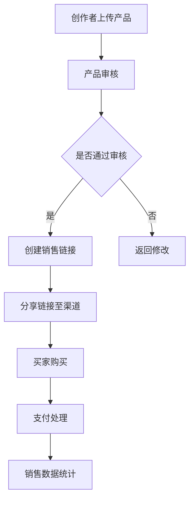

                 

关键词：Gumroad、数字产品销售、程序员、电子商务、在线支付、营销策略

> 摘要：本文旨在探讨程序员如何利用Gumroad这一在线平台销售自己的数字产品。通过深入了解Gumroad的功能、优势以及实际操作步骤，程序员可以更有效地将技术知识变现，拓展个人品牌和商业价值。

## 1. 背景介绍

随着互联网技术的发展，数字产品的需求日益增长。程序员不仅可以编写代码，还可以通过创作软件、电子书、教程视频等形式，将自己的知识和技能转化为数字产品，实现变现。Gumroad正是这样一个专门为创作者提供销售平台的服务。

Gumroad是一个便捷的电子商务平台，专为数字产品创作者设计。它支持多种支付方式，包括信用卡、PayPal等，允许创作者轻松地设置产品价格，创建销售链接，并进行跟踪和管理。通过Gumroad，程序员可以专注于开发高质量的产品，而无需担心销售和支付流程。

## 2. 核心概念与联系

### 2.1 Gumroad的核心功能

- **产品发布**：创作者可以上传数字产品，如电子书、软件、教程等。
- **灵活定价**：创作者可以根据需求设置产品价格，包括一次性购买、订阅、按使用次数付费等。
- **支付方式**：支持多种支付方式，如信用卡、PayPal、比特币等。
- **分销渠道**：创作者可以将Gumroad链接分享到社交媒体、个人网站、邮件列表等。
- **数据跟踪**：Gumroad提供销售数据统计，帮助创作者了解产品表现。

### 2.2 Gumroad与创作者的关系

Gumroad为创作者提供了一个独立平台，使他们能够直接与买家互动，无需依赖大型电商平台。这有助于创作者建立自己的品牌和粉丝群体。

### 2.3 Mermaid流程图



## 3. 核心算法原理 & 具体操作步骤

### 3.1 算法原理概述

Gumroad的成功依赖于其简单易用的界面和强大的后台算法。后台算法主要包括以下几个方面：

- **支付处理算法**：确保支付过程的安全和高效。
- **销售统计算法**：分析销售数据，提供决策支持。
- **推荐算法**：根据买家行为推荐相关产品。

### 3.2 算法步骤详解

#### 3.2.1 产品发布

1. 访问Gumroad官网，注册账户。
2. 进入创作者中心，点击“上传产品”按钮。
3. 选择产品类型（如电子书、软件等），并填写相关信息。
4. 上传产品文件，设置价格和描述。

#### 3.2.2 支付处理

1. 买家点击购买按钮。
2. Gumroad引导买家进行支付。
3. 支付成功后，买家获得产品访问权限。

#### 3.2.3 销售统计

1. Gumroad后台收集销售数据。
2. 创作者可以查看销售报告，了解产品表现。

### 3.3 算法优缺点

**优点**：

- **简单易用**：Gumroad界面简洁，易于上手。
- **安全可靠**：Gumroad采用加密技术，保障支付安全。
- **灵活定价**：创作者可以根据市场需求灵活调整价格。

**缺点**：

- **佣金较高**：Gumroad收取一定的佣金。
- **营销支持有限**：Gumroad主要提供平台服务，营销策略需要创作者自行制定。

### 3.4 算法应用领域

Gumroad适用于各类数字产品的销售，包括但不限于以下领域：

- **教育培训**：编程教程、在线课程等。
- **软件开发**：开源项目、商业软件等。
- **设计资源**：模板、图标等。

## 4. 数学模型和公式 & 详细讲解 & 举例说明

### 4.1 数学模型构建

在Gumroad平台上，销售利润可以表示为：

$$\text{利润} = (\text{产品售价} - \text{平台佣金}) \times \text{销售量}$$

### 4.2 公式推导过程

- 设定产品售价为 $P$。
- 设定平台佣金比例为 $C$（通常为销售额的5%至12%）。
- 销售量为 $Q$。

则利润为：

$$\text{利润} = (P - CP) \times Q = (1 - C)PQ$$

### 4.3 案例分析与讲解

假设某程序员开发的编程教程售价为 $50$ 美元，平台佣金比例为 $10\%$。如果他每月能卖出 $100$ 套教程，那么他的月利润为：

$$\text{月利润} = (1 - 0.1) \times 50 \times 100 = 4500 \text{美元}$$

如果他的销量提高一倍，利润将翻倍。这表明，销量是影响利润的关键因素。

## 5. 项目实践：代码实例和详细解释说明

### 5.1 开发环境搭建

为了使用Gumroad，程序员需要具备以下开发环境：

- **编程语言**：熟悉至少一种编程语言，如Python、Java等。
- **文本编辑器**：如Visual Studio Code、Sublime Text等。
- **Gumroad API密钥**：在Gumroad账户中生成。

### 5.2 源代码详细实现

以下是一个简单的Python脚本，用于在Gumroad上发布电子书：

```python
import requests
import json

api_key = 'your_gumroad_api_key'
headers = {
    'Authorization': f'Bearer {api_key}',
    'Content-Type': 'application/json',
}

product_data = {
    'title': 'My Programming Book',
    'description': 'An in-depth guide to programming',
    'price': 50,
    'file_url': 'https://example.com/my_book.pdf',
}

response = requests.post('https://api.gumroad.com/v1/products', headers=headers, data=json.dumps(product_data))
if response.status_code == 200:
    print('Product published successfully!')
else:
    print('Failed to publish product:', response.text)
```

### 5.3 代码解读与分析

- **请求头设置**：设置API密钥和内容类型。
- **产品数据结构**：包括标题、描述、价格和文件URL。
- **发送POST请求**：将产品数据发送到Gumroad API。

### 5.4 运行结果展示

当运行上述脚本后，Gumroad将接受产品发布请求，并在审核通过后显示在平台上。

## 6. 实际应用场景

### 6.1 个人博客

程序员可以将自己的博客文章整理成电子书，通过Gumroad销售，实现内容变现。

### 6.2 在线课程

Gumroad适用于销售在线课程的视频教程，包括编程、设计等领域的课程。

### 6.3 开源项目

程序员可以将开源项目打包成收费版本，提供更完整的文档和支持服务。

## 7. 工具和资源推荐

### 7.1 学习资源推荐

- **Gumroad官方文档**：深入了解Gumroad API和使用方法。
- **编程教程**：学习如何使用Python、Java等编程语言进行开发。

### 7.2 开发工具推荐

- **Visual Studio Code**：强大的代码编辑器，支持多种编程语言。
- **Postman**：用于API调试和测试的工具。

### 7.3 相关论文推荐

- **"The Economics of Digital Goods and Services"**：探讨数字产品经济的论文。
- **"Online Commerce Platforms: An Analysis of Gumroad"**：对Gumroad的深入分析。

## 8. 总结：未来发展趋势与挑战

### 8.1 研究成果总结

本文介绍了Gumroad平台的特点和应用，探讨了程序员如何利用Gumroad销售数字产品，并分析了其优缺点。

### 8.2 未来发展趋势

随着互联网技术的发展，数字产品的需求将持续增长。Gumroad等平台将不断优化服务，提高创作者的变现能力。

### 8.3 面临的挑战

Gumroad需要提高市场竞争力，降低佣金比例，以吸引更多创作者。同时，确保支付安全和数据隐私也是重要挑战。

### 8.4 研究展望

未来的研究可以探讨更多数字产品销售平台，比较其优缺点，为程序员提供更全面的选择。

## 9. 附录：常见问题与解答

### 9.1 如何获取Gumroad API密钥？

在Gumroad账户设置中，点击“API密钥”生成新的密钥。

### 9.2 产品发布后多久可以上线？

通常情况下，产品发布后需要经过Gumroad审核，审核通过后即可上线。

### 9.3 如何设置产品价格？

在产品发布页面，填写“价格”字段即可设置产品价格。

---

作者：禅与计算机程序设计艺术 / Zen and the Art of Computer Programming
-------------------------------------------------------------------

