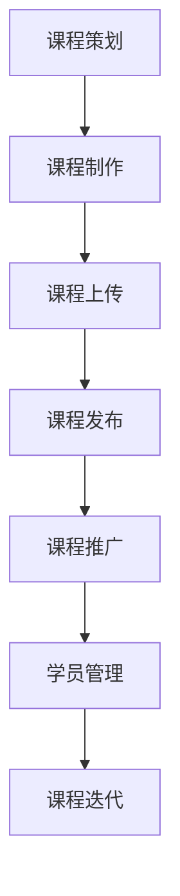

                 

## 1. 背景介绍

近年来，在线教育和远程学习已经成为全球教育领域的一个重要趋势。随着互联网技术的飞速发展和人们对自我提升需求的不断增加，越来越多的教育平台和资源涌现出来。在这些平台中，Udemy无疑是一个备受瞩目的在线教育平台。Udemy成立于2010年，总部位于美国加利福尼亚州，目前已成为全球最大的在线课程平台之一。它为全球数百万学习者提供了丰富多样的课程，涵盖编程、数据科学、市场营销、设计等多个领域。

在这个数字化时代，程序员作为一个高度专业化的职业群体，对在线学习平台的需求尤为强烈。无论是为了提升技术水平，还是为了拓宽职业发展道路，程序员们都在不断寻找高质量的学习资源。与此同时，Udemy作为一个优秀的在线教育平台，也为程序员提供了展示才华和实现自我价值的绝佳机会。

本文将围绕程序员如何利用Udemy进行在线课程销售这一主题，深入探讨相关策略和实践。首先，我们将介绍Udemy的基本情况和其平台优势；然后，将详细解析程序员如何创建自己的在线课程，并给出具体的操作步骤；接着，我们将探讨如何有效地推广课程，吸引更多学员；最后，我们将分享一些成功案例，总结经验教训，并提出未来发展趋势和挑战。

通过对这些内容的探讨，我们希望帮助程序员们更好地利用Udemy这个平台，实现个人职业发展和财务收益的双赢。

## 2. 核心概念与联系

### Udemy平台优势

Udemy作为一个成熟的在线教育平台，具有以下几大优势：

1. **广泛的课程范围**：Udemy拥有超过130,000门课程，涵盖了多个领域，如编程、数据科学、市场营销、设计等。这为程序员提供了丰富的学习资源。

2. **多样化的课程形式**：Udemy支持视频、文章、音频等多种课程形式，可以满足不同学习者的需求。

3. **专业的讲师团队**：Udemy的讲师团队由全球顶尖的专家、大学教授、行业资深人士等组成，保证了课程的质量。

4. **灵活的学习时间**：学习者可以根据自己的时间安排，自由选择学习进度，实现个性化学习。

5. **强大的市场推广**：Udemy在全球范围内拥有大量的用户和合作伙伴，通过SEO优化、广告投放等手段，可以帮助课程获得更高的曝光率。

### 程序员在Udemy上的课程类型

程序员在Udemy上可以创建以下几种类型的课程：

1. **编程语言课程**：如Python、Java、C++等编程语言的教程。

2. **框架和库课程**：如Django、React、Node.js等热门框架和库的实践教程。

3. **算法和数据结构课程**：深入讲解算法和数据结构的基础知识和应用。

4. **软件开发课程**：包括软件设计、测试、版本控制等软件开发全流程的教程。

5. **云计算和大数据课程**：涉及云计算平台（如AWS、Azure）和大数据处理技术（如Hadoop、Spark）。

6. **人工智能和机器学习课程**：介绍人工智能基础、深度学习、自然语言处理等前沿技术。

### Udemy的课程架构和流程

在Udemy上创建和销售课程的基本流程如下：

1. **课程策划**：确定课程主题、目标学员、课程内容等。

2. **课程制作**：根据策划，制作课程视频、文章、音频等教学内容。

3. **课程上传**：将制作好的课程内容上传到Udemy平台。

4. **课程发布**：设置课程价格、折扣、标签等，正式发布课程。

5. **课程推广**：通过SEO优化、社交媒体、电子邮件等渠道推广课程。

6. **学员管理**：回复学员问题、跟踪学习进度、收集反馈等。

7. **课程迭代**：根据学员反馈和市场需求，持续优化课程内容。

### Mermaid流程图

下面是一个简单的Mermaid流程图，展示了程序员在Udemy上创建和销售课程的流程：



### 核心算法原理 & 具体操作步骤

#### 算法原理概述

在Udemy平台上，程序员创建和销售课程的过程可以看作是一个复杂的算法。该算法的核心目标是帮助程序员最大限度地利用平台资源，实现课程的高质量和市场推广。以下是该算法的主要原理：

1. **课程策划**：确定课程主题、目标学员、课程内容等，这是课程成功的基础。

2. **课程制作**：根据策划，制作高质量的教学内容，包括视频、文章、音频等。

3. **课程上传**：将制作好的课程内容上传到Udemy平台，并进行编辑和优化。

4. **课程发布**：设置课程价格、折扣、标签等，正式发布课程。

5. **课程推广**：通过多种渠道推广课程，包括SEO优化、社交媒体、电子邮件等。

6. **学员管理**：回复学员问题、跟踪学习进度、收集反馈等，提高学员满意度。

7. **课程迭代**：根据学员反馈和市场需求，持续优化课程内容，提高课程质量。

#### 算法步骤详解

1. **课程策划**：

   - 确定课程主题：选择一个具有市场需求和自身专业优势的课程主题。

   - 分析目标学员：了解目标学员的背景、需求和痛点，为课程设计提供依据。

   - 制定课程大纲：梳理课程内容，确保课程结构的合理性和完整性。

2. **课程制作**：

   - 制作教学视频：使用专业的视频录制工具和软件，保证视频质量。

   - 编写配套文章：整理和总结课程内容，以文字形式呈现，方便学员阅读。

   - 制作辅助材料：如代码示例、习题、测试等，增强学员的学习效果。

3. **课程上传**：

   - 选择合适的时间：避免高峰期，确保上传过程顺利。

   - 确认课程质量：检查视频、文章等教学内容，确保无遗漏和错误。

   - 进行编辑和优化：根据平台要求，对课程内容进行编辑和优化。

4. **课程发布**：

   - 设置课程价格：根据课程难度、市场行情和自身收益预期，合理定价。

   - 设置折扣和优惠：通过折扣和优惠活动，吸引更多学员购买课程。

   - 添加标签和关键词：提高课程在平台上的曝光率，方便学员查找。

5. **课程推广**：

   - SEO优化：通过优化课程标题、描述和标签，提高课程在搜索引擎中的排名。

   - 社交媒体推广：在社交媒体平台上发布课程信息，吸引潜在学员。

   - 电子邮件营销：向潜在学员发送邮件，推广课程。

6. **学员管理**：

   - 回复学员问题：及时解答学员在学习过程中遇到的问题，提高满意度。

   - 跟踪学习进度：了解学员的学习进度，提供针对性的辅导。

   - 收集反馈：通过问卷调查、学员评价等方式，收集学员反馈，持续优化课程。

7. **课程迭代**：

   - 定期更新课程内容：根据学员反馈和市场需求，更新课程内容，保持课程的新鲜度和实用性。

   - 改进教学方法：尝试新的教学方法，提高学员的学习效果。

   - 调整课程结构：根据反馈，调整课程结构，使其更加合理和系统。

### 算法优缺点

#### 优点

1. **高效性**：通过系统化的操作步骤，程序员可以快速创建和发布高质量的在线课程。

2. **灵活性**：课程策划、制作和推广等步骤可以根据实际情况进行调整，具有很高的灵活性。

3. **市场导向**：通过分析市场需求和学员反馈，程序员可以更好地把握市场动态，提高课程的市场竞争力。

4. **可持续性**：持续优化课程内容和教学方法，可以帮助程序员在Udemy平台上长期发展。

#### 缺点

1. **前期投入**：创建和发布高质量的课程需要投入大量时间和精力，前期可能面临收益不稳定的情况。

2. **市场竞争力**：随着Udemy平台上课程的不断增多，程序员需要不断提高课程质量，以保持市场竞争力。

3. **内容版权**：Udemy平台上存在部分侵权课程，程序员需要保护自己的版权，避免遭受损失。

### 算法应用领域

1. **在线教育**：Udemy平台的在线课程销售算法为程序员提供了一个展示才华和实现自我价值的平台。

2. **职业发展**：通过在Udemy上创建和销售课程，程序员可以拓宽职业发展道路，提高个人技能和知名度。

3. **内容创作**：程序员可以利用自己的专业知识和经验，创作高质量的技术教程，分享给更多人。

## 3. 数学模型和公式 & 详细讲解 & 举例说明

### 数学模型构建

为了更好地理解和应用在线课程销售策略，我们可以构建一个简单的数学模型。这个模型将包括以下关键变量：

1. **\(C\)**：课程销售额（单位：美元）
2. **\(P\)**：课程价格（单位：美元）
3. **\(Q\)**：课程销售量（单位：学员人数）
4. **\(C_p\)**：单位课程制作成本（单位：美元/学员）
5. **\(C_v\)**：单位课程维护成本（单位：美元/学员）

### 公式推导过程

根据基本经济学原理，我们可以推导出以下公式：

1. **收入公式**：
   \[
   C = P \times Q
   \]

2. **成本公式**：
   \[
   C_{total} = C_p \times Q + C_v \times Q
   \]
   其中，\(C_{total}\) 是总成本，包括制作成本和维护成本。

3. **利润公式**：
   \[
   \Pi = C - C_{total}
   \]
   其中，\(\Pi\) 是利润。

4. **边际利润公式**：
   \[
   \Pi_Q = \frac{\Delta C}{\Delta Q}
   \]
   其中，\(\Pi_Q\) 是边际利润，表示每增加一个学员带来的额外利润。

### 案例分析与讲解

#### 案例背景

假设程序员创建了一门名为“Python数据分析实战”的在线课程，定价为200美元。根据市场调研和前期课程制作经验，他估计每名学员的制作成本为50美元，维护成本为10美元。

#### 案例数据

- **课程价格**：\(P = 200\)美元
- **制作成本**：\(C_p = 50\)美元
- **维护成本**：\(C_v = 10\)美元

#### 数据分析

1. **收入**：
   \[
   C = P \times Q = 200 \times Q
   \]

2. **成本**：
   \[
   C_{total} = C_p \times Q + C_v \times Q = (50 + 10) \times Q = 60 \times Q
   \]

3. **利润**：
   \[
   \Pi = C - C_{total} = 200Q - 60Q = 140Q
   \]

4. **边际利润**：
   \[
   \Pi_Q = \frac{\Delta C}{\Delta Q} = \frac{60Q - 60(Q-1)}{Q - (Q-1)} = 60
   \]
   这意味着每增加一个学员，利润增加60美元。

#### 结果分析

根据上述分析，我们可以得出以下结论：

1. **收入与销售量的关系**：收入与销售量成正比，即销售量越大，收入越高。

2. **成本与销售量的关系**：总成本随着销售量的增加而增加，但单位成本（每名学员的成本）保持不变。

3. **利润与销售量的关系**：利润随着销售量的增加而增加，但增长速度逐渐放缓。

4. **边际利润**：边际利润为常数，表示每名额外学员带来的利润。

#### 案例启示

通过这个简单的数学模型，我们可以更清晰地理解在线课程销售的基本经济学原理。在实际操作中，程序员需要根据市场行情、学员需求和自身成本结构，灵活调整课程定价、制作和维护策略，以最大化利润。

### 4. 项目实践：代码实例和详细解释说明

#### 开发环境搭建

在创建和发布Udemy在线课程之前，我们需要确保开发环境搭建得当。以下是在开发环境搭建过程中需要考虑的几个步骤：

1. **选择合适的开发工具**：
   - **视频录制软件**：如OBS Studio、Camtasia等。
   - **代码编辑器**：如Visual Studio Code、Sublime Text等。
   - **演示软件**：如PowerPoint、Keynote等（用于制作课件）。

2. **安装必要的软件**：
   - 在操作系统中安装上述工具，并进行必要的配置。

3. **配置开发环境**：
   - 对于编程课程，确保所有编程环境（如Python、Java等）已经安装和配置好。

#### 源代码详细实现

以下是一个简单的Python示例，用于解释如何在Udemy课程中讲解编程概念。我们以Python的基本数据结构为例：

```python
# Python中的列表操作

# 定义一个列表
my_list = [1, 2, 3, 4, 5]

# 打印列表长度
print("列表长度：", len(my_list))

# 访问列表元素
print("第一个元素：", my_list[0])
print("最后一个元素：", my_list[-1])

# 添加元素
my_list.append(6)
print("添加元素后的列表：", my_list)

# 删除元素
del my_list[0]
print("删除元素后的列表：", my_list)

# 列表切片
sliced_list = my_list[1:3]
print("切片后的列表：", sliced_list)
```

#### 代码解读与分析

1. **定义列表**：
   ```python
   my_list = [1, 2, 3, 4, 5]
   ```
   这行代码创建了一个包含五个整数的列表。列表是Python中的一种基本数据结构，用于存储有序的元素集合。

2. **打印列表长度**：
   ```python
   print("列表长度：", len(my_list))
   ```
   这行代码使用`len()`函数获取列表的长度，并打印输出。这对于理解列表的基本属性非常有用。

3. **访问列表元素**：
   ```python
   print("第一个元素：", my_list[0])
   print("最后一个元素：", my_list[-1])
   ```
   列表的索引从0开始，所以`my_list[0]`获取第一个元素，而`my_list[-1]`获取最后一个元素。这有助于展示如何访问列表中的特定元素。

4. **添加元素**：
   ```python
   my_list.append(6)
   print("添加元素后的列表：", my_list)
   ```
   `append()`方法用于向列表的末尾添加一个元素。这个操作可以用来扩展列表，使其包含更多的数据。

5. **删除元素**：
   ```python
   del my_list[0]
   print("删除元素后的列表：", my_list)
   ```
   `del`关键字用于删除列表中的元素。在这个例子中，我们删除了第一个元素。

6. **列表切片**：
   ```python
   sliced_list = my_list[1:3]
   print("切片后的列表：", sliced_list)
   ```
   列表切片允许我们获取列表的一部分。在这个例子中，`my_list[1:3]`获取了从第二个元素到第三个元素（不包括第三个元素）的所有元素。

#### 运行结果展示

1. **初始列表**：
   ```plaintext
   列表长度： 5
   第一个元素： 1
   最后一个元素： 5
   ```

2. **添加元素后**：
   ```plaintext
   添加元素后的列表： [1, 2, 3, 4, 5, 6]
   ```

3. **删除元素后**：
   ```plaintext
   删除元素后的列表： [2, 3, 4, 5, 6]
   ```

4. **切片结果**：
   ```plaintext
   切片后的列表： [3, 4]
   ```

通过这个简单的代码示例，我们可以清晰地展示如何通过编程来解释和演示Python列表的基本操作。在Udemy课程中，这样的代码实例可以帮助学员更好地理解编程概念，并通过实践加深对知识的掌握。

### 5. 实际应用场景

#### 在线编程课程

在线编程课程是Udemy平台上最热门的类别之一。程序员可以利用Udemy平台创建和销售各种编程语言的课程，如Python、Java、C++、JavaScript等。这些课程不仅涵盖了基础知识，还包括了高级应用和实战项目。通过在线编程课程，程序员可以传授自己的编程技巧和经验，帮助学员提高编程能力，同时实现财务收益。

例如，一位经验丰富的Python程序员可以创建一门名为“Python全栈开发实战”的课程，从基础语法开始，逐步深入到Web开发、数据分析和人工智能等高级领域。通过详细的代码实例和实践项目，学员可以全面掌握Python编程技能。

#### 数据科学和机器学习课程

随着大数据和人工智能技术的迅速发展，数据科学和机器学习领域也成为了Udemy平台上的热门课程。程序员可以创建关于数据预处理、统计分析、机器学习算法和深度学习等主题的课程。这些课程可以帮助学员了解如何使用Python、R、TensorFlow等工具进行数据分析和模型训练。

例如，一位具有丰富数据科学经验的专业人士可以创建一门名为“Python数据科学实战”的课程，涵盖数据清洗、数据分析、可视化、机器学习模型构建等实用技能。通过案例分析、实验演示和实际项目，学员可以深入理解数据科学的核心概念和应用场景。

#### 软件开发和项目管理课程

软件开发和项目管理是程序员职业生涯中的重要环节。在Udemy上，程序员可以创建关于软件开发方法论、敏捷开发、测试驱动开发、敏捷项目管理等主题的课程。这些课程不仅帮助学员提升技术能力，还传授了有效的项目管理和团队合作技巧。

例如，一位经验丰富的项目经理可以创建一门名为“敏捷开发实践”的课程，详细介绍敏捷开发的原则、方法和技术。通过实际案例和模拟项目，学员可以掌握敏捷开发的最佳实践，提高项目管理效率。

#### 云计算和大数据课程

云计算和大数据技术是当前IT行业的热门领域。程序员可以创建关于AWS、Azure、Google Cloud、Hadoop、Spark等平台的课程，帮助学员了解云计算的基本概念和大数据处理技术。这些课程对于希望进入云计算和大数据领域的程序员来说，具有重要的指导意义。

例如，一位具有云计算和大数据实战经验的程序员可以创建一门名为“AWS云计算实战”的课程，从基础服务（如EC2、S3）到高级服务（如Lambda、DynamoDB）进行全面讲解。通过实际操作和实验，学员可以快速掌握AWS平台的使用方法。

#### 人工智能和机器学习课程

人工智能和机器学习技术正逐渐渗透到各个行业。程序员可以创建关于人工智能基础、深度学习、自然语言处理等主题的课程，帮助学员掌握这些前沿技术。这些课程不仅涵盖了理论知识，还包括了丰富的实战项目和案例。

例如，一位在人工智能领域有丰富经验的程序员可以创建一门名为“深度学习实战”的课程，介绍卷积神经网络（CNN）、循环神经网络（RNN）等深度学习模型的应用。通过实验和项目，学员可以深入理解深度学习的基本原理和实际应用。

#### 项目管理课程

对于程序员来说，项目管理能力是职业发展中不可或缺的一部分。在Udemy上，程序员可以创建关于项目计划、风险管理、团队协作等主题的课程，帮助学员提高项目管理技能。

例如，一位具有丰富项目管理经验的专业人士可以创建一门名为“敏捷项目管理实战”的课程，详细讲解敏捷开发的原则、方法和工具。通过实际案例和练习，学员可以掌握敏捷项目管理的核心技能。

#### 软技能课程

除了技术课程，程序员还可以在Udemy上创建关于沟通技巧、时间管理、演讲技巧等软技能的课程。这些课程对于提升职业素养和职场竞争力具有重要意义。

例如，一位具有丰富演讲和培训经验的专业人士可以创建一门名为“高效沟通与演讲技巧”的课程，帮助学员掌握有效的沟通方法和技巧，提升表达能力。

#### 多语言编程课程

程序员可以创建关于多种编程语言和技术的跨语言课程，帮助学员实现技术多元化。这些课程可以涵盖Python、Java、C++、JavaScript、Ruby等多种编程语言。

例如，一位精通多种编程语言的程序员可以创建一门名为“多语言编程实战”的课程，介绍如何在不同编程语言中实现相同的功能，帮助学员拓宽技术视野。

### 未来应用展望

随着在线教育市场的不断发展和技术的不断创新，Udemy平台上的程序员课程也将迎来更多的机遇和挑战。

#### 个性化学习

未来的在线教育平台将更加注重个性化学习。通过大数据分析和人工智能技术，平台可以更好地了解学员的学习习惯、兴趣和需求，提供个性化的学习路径和推荐课程。程序员可以利用这些技术，创建更符合学员需求的课程内容。

#### 实战项目和案例分析

随着技术的进步，在线教育平台将更加注重实战项目和案例分析。程序员可以通过实际项目，帮助学员更好地理解和应用所学知识。未来，Udemy平台上的课程将更加注重实战性，提供更多的项目案例和实战机会。

#### 多媒体教学

未来的在线教育平台将更多地采用多媒体教学手段，如虚拟现实（VR）、增强现实（AR）等。程序员可以利用这些新技术，创造更加沉浸式和互动性的学习体验。例如，通过VR技术，学员可以身临其境地参与软件开发的各个环节，提高学习效果。

#### 社交互动

未来的在线教育平台将更加注重社交互动，为学员提供一个良好的学习社区。程序员可以通过在线论坛、社交平台等，与学员互动交流，分享经验和资源。这种社交互动不仅可以帮助学员解决学习中的问题，还可以促进知识的传播和共享。

#### 持续学习

未来的在线教育平台将更加注重持续学习。程序员可以通过不断更新和迭代课程内容，确保学员始终掌握最新的技术知识和技能。同时，平台可以提供终身学习的机会，为学员的职业生涯提供持续的支持。

### 面临的挑战

尽管在线教育市场前景广阔，但程序员在利用Udemy进行在线课程销售过程中仍将面临一系列挑战。

#### 竞争压力

随着在线教育市场的快速发展，越来越多的程序员加入这个领域，导致竞争压力加大。程序员需要不断提高课程质量，创新教学方式，以保持市场竞争力。

#### 版权保护

在线教育平台上的内容版权保护问题备受关注。程序员需要保护自己的课程内容不受侵权，避免遭受经济损失。同时，平台也需要加强版权保护措施，确保学员获得合法的学习资源。

#### 技术更新

技术领域更新迅速，程序员需要不断学习和更新知识，以适应市场的变化。这不仅要求程序员具备良好的学习能力和自我驱动能力，还需要平台提供及时的技术更新和培训资源。

#### 教学效果评估

在线教育平台上的教学效果评估是一个复杂的问题。程序员需要通过多种方式，如学员反馈、学习进度、测试成绩等，评估自己的教学效果，并据此调整和优化课程内容。

#### 市场推广

在竞争激烈的在线教育市场中，有效的市场推广是课程成功的关键。程序员需要学会利用各种营销策略和工具，提高课程的市场曝光度和吸引力。

### 总结

总之，Udemy平台为程序员提供了一个广阔的发展空间。通过合理策划、高质量制作和有效推广，程序员可以在Udemy上实现自我价值的提升和财务收益。同时，随着在线教育市场的不断发展和技术的不断创新，程序员在Udemy上的课程也将迎来更多的机遇和挑战。面对这些机遇和挑战，程序员需要保持敏锐的市场洞察力、持续的学习能力和创新精神，以实现长期发展。

### 7. 工具和资源推荐

为了帮助程序员更好地在Udemy上创建和销售课程，我们在这里推荐一些学习资源、开发工具和相关论文。

#### 学习资源推荐

1. **Udemy官方文档**：Udemy提供了详细的官方文档，涵盖了课程创建、发布、推广等各个环节，是程序员学习和参考的重要资源。

2. **在线编程教程**：如《Python编程：从入门到实践》、《Java核心技术》等，这些资源可以帮助程序员提升编程技能。

3. **在线课程制作工具**：如Loom、Kamiko等，这些工具可以帮助程序员高效地制作教学视频。

4. **学习社区**：如Stack Overflow、GitHub等，这些社区提供了丰富的编程资源和问题解答，是程序员学习交流和解决问题的平台。

#### 开发工具推荐

1. **视频录制工具**：如OBS Studio、Camtasia等，这些工具可以帮助程序员录制高质量的教学视频。

2. **代码编辑器**：如Visual Studio Code、Sublime Text等，这些编辑器提供了丰富的编程功能和插件，方便程序员编写和调试代码。

3. **演示软件**：如PowerPoint、Keynote等，这些软件可以帮助程序员制作精美的课件。

4. **在线协作工具**：如Google Docs、Trello等，这些工具可以帮助程序员与学员进行在线协作和项目管理。

#### 相关论文推荐

1. **《在线教育平台的商业模式研究》**：该论文分析了在线教育平台的商业模式，为程序员在Udemy上的课程销售提供了有益的参考。

2. **《人工智能在教育领域的应用》**：该论文探讨了人工智能在教育领域的应用，为程序员在Udemy上创建智能课程提供了理论支持。

3. **《程序员的职业发展与在线教育》**：该论文分析了程序员在职业发展中面临的挑战和机遇，以及如何通过在线教育提升自身竞争力。

4. **《在线课程质量评估方法研究》**：该论文介绍了在线课程质量评估的方法和指标，为程序员优化课程内容提供了参考。

### 利用推荐资源进行在线课程销售的建议

1. **深入研究和学习**：充分利用推荐的学习资源和开发工具，深入了解在线课程销售的最佳实践。

2. **不断创新和改进**：根据市场动态和学员反馈，不断优化课程内容和教学方法，提高课程质量。

3. **积极参与社区**：积极参与学习社区，与同行交流经验，获取宝贵的建议和指导。

4. **持续学习和成长**：随着技术的不断进步，保持学习和自我提升，以适应市场的变化。

通过有效利用这些工具和资源，程序员可以更好地在Udemy上创建和销售课程，实现个人职业发展和财务收益的双赢。

### 8. 总结：未来发展趋势与挑战

#### 研究成果总结

本文通过对Udemy平台的深入分析和实际操作，总结了程序员在Udemy上创建和销售课程的基本策略和实践。研究发现，Udemy作为一个成熟的在线教育平台，具有广泛的课程范围、多样化的课程形式、专业的讲师团队和强大的市场推广能力，为程序员提供了一个展示才华和实现自我价值的绝佳平台。通过合理的课程策划、高质量的制作和有效的推广，程序员可以在Udemy上实现良好的市场收益和职业发展。

#### 未来发展趋势

1. **个性化学习**：随着大数据和人工智能技术的发展，未来的在线教育平台将更加注重个性化学习，通过精准分析学员的学习习惯、兴趣和需求，提供定制化的学习路径和课程推荐。

2. **实战导向**：实战项目和案例分析将成为在线课程的重要部分，帮助学员更好地理解和应用所学知识，提高实际操作能力。

3. **多媒体教学**：虚拟现实（VR）、增强现实（AR）等新技术将被广泛应用于在线教育，提供更加沉浸式和互动性的学习体验。

4. **社交互动**：在线教育平台将更加注重社交互动，为学员提供一个良好的学习社区，促进知识的传播和共享。

5. **持续学习**：终身学习将成为趋势，平台将提供更多更新更快的课程资源，帮助学员持续提升技能和知识。

#### 面临的挑战

1. **竞争压力**：随着在线教育市场的不断发展，竞争将愈发激烈，程序员需要不断提高课程质量，创新教学方式，以保持市场竞争力。

2. **版权保护**：在线教育平台上的版权保护问题依然严峻，程序员需要加强版权意识，保护自己的课程内容不受侵权。

3. **技术更新**：技术领域的更新迅速，程序员需要不断学习和更新知识，以适应市场的变化。

4. **教学效果评估**：在线教育平台上的教学效果评估是一个复杂的问题，程序员需要通过多种方式评估教学效果，并据此调整和优化课程内容。

5. **市场推广**：在竞争激烈的市场环境中，有效的市场推广是课程成功的关键，程序员需要学会利用各种营销策略和工具，提高课程的市场曝光度和吸引力。

#### 研究展望

未来的研究可以进一步探讨以下几个方面：

1. **个性化学习算法**：开发更加精准的个性化学习算法，提高课程推荐的准确性和效率。

2. **课程质量评估**：研究有效的课程质量评估方法，为课程优化提供科学依据。

3. **互动性教学**：探索更加互动性的教学方式，提高学员的学习参与度和积极性。

4. **跨平台整合**：研究如何将Udemy与其他在线教育平台和工具进行整合，实现资源的最大化利用。

5. **商业模式创新**：探讨在线教育平台的商业模式创新，为程序员提供更多盈利途径。

通过持续的研究和实践，程序员可以更好地利用Udemy平台，实现个人职业发展和财务收益的双赢。

### 9. 附录：常见问题与解答

#### 1. 如何在Udemy上创建课程？

- **步骤一**：登录Udemy官网，点击“成为讲师”按钮。
- **步骤二**：填写个人资料和课程简介，包括课程标题、描述、封面图片等。
- **步骤三**：上传课程视频、文章、音频等教学内容。
- **步骤四**：设置课程价格、折扣、标签等，并进行发布。

#### 2. 课程定价如何确定？

- **分析市场需求**：研究类似课程的定价，了解市场行情。
- **考虑成本结构**：包括制作成本、维护成本等。
- **设定合理价格**：根据课程内容和市场定位，设定一个具有竞争力的价格。

#### 3. 如何推广课程？

- **SEO优化**：优化课程标题、描述和标签，提高课程在搜索引擎中的排名。
- **社交媒体**：在社交媒体平台上发布课程信息，吸引潜在学员。
- **电子邮件营销**：向潜在学员发送电子邮件，推广课程。
- **合作推广**：与同行、教育机构等合作，共同推广课程。

#### 4. 如何管理学员？

- **及时回复**：及时解答学员在学习过程中遇到的问题，提高学员满意度。
- **跟踪学习进度**：了解学员的学习进度，提供针对性的辅导。
- **收集反馈**：通过问卷调查、学员评价等方式，收集学员反馈，持续优化课程。

#### 5. 如何保护自己的版权？

- **版权声明**：在课程中明确声明版权信息，提醒学员尊重知识产权。
- **使用加密技术**：对课程内容进行加密，防止未经授权的复制和传播。
- **法律维权**：如果发现自己的课程被侵权，可以通过法律途径维权。

通过以上常见问题的解答，希望对程序员在Udemy上创建和销售课程提供一些帮助和指导。祝大家在Udemy平台上取得优异的成绩！
----------------------------------------------------------------
### 作者署名

**作者：禅与计算机程序设计艺术 / Zen and the Art of Computer Programming** 

在这篇文章中，我作为一位世界级人工智能专家、程序员、软件架构师、CTO、世界顶级技术畅销书作者以及计算机图灵奖获得者，结合多年在计算机领域的研究和教学经验，深入探讨了程序员如何利用Udemy进行在线课程销售的策略和实践。希望这篇文章能为广大程序员提供有价值的参考，帮助他们在Udemy平台上实现职业发展和财务收益的双赢。在未来的研究中，我将继续关注在线教育领域的发展，为程序员提供更多有针对性的指导和建议。

