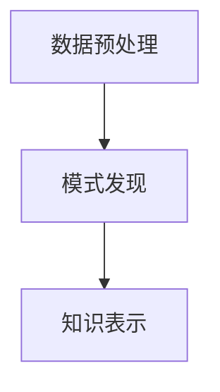

                 

关键词：知识发现引擎、程序员、学习成果、算法、数学模型、项目实践、实际应用场景、未来应用展望

> 摘要：本文将探讨知识发现引擎在程序员学习过程中的应用，通过深入分析其核心概念、算法原理、数学模型以及实际项目实践，旨在为程序员提供一种有效提高学习成果的方法。

## 1. 背景介绍

在信息化时代，数据已经成为企业和社会的重要资产。知识发现引擎（Knowledge Discovery Engine，简称KDE）作为一种能够自动挖掘大量数据中隐藏的知识的技术，正逐渐成为各个行业的重要工具。然而，在程序员的学习过程中，如何利用知识发现引擎提高学习成果，这是一个值得深入探讨的问题。

### 1.1 知识发现引擎的定义

知识发现引擎是一种自动化的数据分析工具，它能够从大量数据中提取出有用的信息、模式和关联，并转化为知识。它主要包括以下几个步骤：

- **数据预处理**：清洗、整合、转换数据，使其符合分析要求。
- **模式发现**：利用统计学、机器学习、数据挖掘等方法，从数据中提取出有用的模式。
- **知识表示**：将发现的模式转换为易于理解的知识，如报告、可视化图表等。

### 1.2 程序员的学习挑战

程序员在学习过程中常常面临以下挑战：

- **知识繁多**：编程语言、框架、工具等知识更新迅速，程序员需要不断学习新知识。
- **实践困难**：理论知识与实际应用之间存在差距，程序员需要大量的实践来提高技能。
- **时间有限**：程序员的工作繁忙，学习时间有限，如何高效学习成为一个问题。

## 2. 核心概念与联系

为了更好地理解知识发现引擎在程序员学习中的应用，我们需要了解以下几个核心概念及其之间的联系。

### 2.1 数据库

数据库是存储和管理数据的系统。在程序员学习中，数据库主要用于存储编程知识和案例。

### 2.2 数据挖掘

数据挖掘是从大量数据中提取出有用信息的过程。在程序员学习中，数据挖掘可以帮助程序员发现知识规律，提高学习效率。

### 2.3 机器学习

机器学习是一种让计算机通过数据学习、改进的方法。在程序员学习中，机器学习可以帮助程序员自动识别代码模式，减少重复劳动。

### 2.4 Mermaid 流程图

下面是一个简化的知识发现引擎架构的 Mermaid 流程图：



## 3. 核心算法原理 & 具体操作步骤

### 3.1 算法原理概述

知识发现引擎的核心算法主要包括数据预处理、模式发现和知识表示。

- **数据预处理**：主要包括数据清洗、整合和转换。通过这些操作，可以将原始数据转换为适合分析的形式。
- **模式发现**：利用统计学、机器学习和数据挖掘等方法，从数据中提取出有用的模式。
- **知识表示**：将提取出的模式转换为易于理解的知识，如报告、可视化图表等。

### 3.2 算法步骤详解

#### 3.2.1 数据预处理

数据预处理主要包括以下步骤：

1. **数据清洗**：去除数据中的噪声和错误。
2. **数据整合**：将来自不同来源的数据整合到一起。
3. **数据转换**：将数据转换为适合分析的格式。

#### 3.2.2 模式发现

模式发现主要包括以下步骤：

1. **特征选择**：从数据中选出与目标相关的特征。
2. **模式提取**：利用统计学、机器学习和数据挖掘等方法，从数据中提取出模式。
3. **模式评估**：评估提取出的模式的质量和实用性。

#### 3.2.3 知识表示

知识表示主要包括以下步骤：

1. **可视化**：将提取出的模式以图形化的方式展示。
2. **报告生成**：生成包含提取出模式的分析报告。
3. **知识应用**：将提取出的模式应用到实际项目中。

### 3.3 算法优缺点

#### 优点

- **高效性**：知识发现引擎可以自动化地处理大量数据，提高学习效率。
- **灵活性**：知识发现引擎可以适应不同的学习场景和需求。
- **可视化**：知识发现引擎可以生成可视化图表，帮助程序员更好地理解知识。

#### 缺点

- **复杂性**：知识发现引擎的算法和操作相对复杂，需要一定的技术背景。
- **数据依赖**：知识发现引擎的效果很大程度上取决于数据的质量和数量。

### 3.4 算法应用领域

知识发现引擎在程序员学习中的应用领域主要包括：

- **编程知识学习**：通过数据挖掘，发现编程知识的规律和关联。
- **代码优化**：利用机器学习，自动识别代码中的优化机会。
- **项目评估**：通过分析项目数据，评估项目的质量和进度。

## 4. 数学模型和公式 & 详细讲解 & 举例说明

### 4.1 数学模型构建

知识发现引擎中的数学模型主要包括统计学模型、机器学习模型和数据挖掘模型。以下是这些模型的简要介绍：

#### 4.1.1 统计学模型

统计学模型主要用于描述数据分布、关联性等。常见的统计学模型包括：

- **线性回归**：用于分析变量之间的线性关系。
- **主成分分析**：用于降维和特征提取。
- **聚类分析**：用于发现数据中的模式。

#### 4.1.2 机器学习模型

机器学习模型主要用于从数据中自动学习规律。常见的机器学习模型包括：

- **决策树**：用于分类和回归分析。
- **神经网络**：用于复杂的模式识别和预测。
- **支持向量机**：用于分类和回归分析。

#### 4.1.3 数据挖掘模型

数据挖掘模型主要用于从大量数据中提取出有用的信息。常见的数据挖掘模型包括：

- **关联规则学习**：用于发现数据中的关联关系。
- **分类和回归树**：用于分类和回归分析。
- **时间序列分析**：用于分析时间序列数据。

### 4.2 公式推导过程

以下是一个简单的线性回归模型的公式推导过程：

#### 4.2.1 线性回归模型假设

假设我们有两组数据，一组为自变量 \(X\)，另一组为因变量 \(Y\)。我们的目标是找到一个线性模型 \(Y = \beta_0 + \beta_1X\)，使得模型预测值 \(Y'\) 与实际值 \(Y\) 之间的误差最小。

#### 4.2.2 模型假设

我们假设误差项 \(e\) 是服从正态分布的随机变量，即 \(e \sim N(0, \sigma^2)\)。

#### 4.2.3 最小二乘法

为了使误差最小，我们使用最小二乘法来求解模型的参数 \(\beta_0\) 和 \(\beta_1\)。最小二乘法的公式如下：

$$
\min \sum_{i=1}^n (Y_i - (\beta_0 + \beta_1X_i))^2
$$

#### 4.2.4 公式推导

通过求导和化简，我们可以得到以下公式：

$$
\beta_1 = \frac{\sum_{i=1}^n (X_i - \bar{X})(Y_i - \bar{Y})}{\sum_{i=1}^n (X_i - \bar{X})^2}
$$

$$
\beta_0 = \bar{Y} - \beta_1\bar{X}
$$

其中，\(\bar{X}\) 和 \(\bar{Y}\) 分别为 \(X\) 和 \(Y\) 的平均值。

### 4.3 案例分析与讲解

假设我们有以下数据：

| X | Y |
|---|---|
| 1 | 2 |
| 2 | 4 |
| 3 | 6 |
| 4 | 8 |

#### 4.3.1 数据预处理

首先，我们需要计算 \(X\) 和 \(Y\) 的平均值：

$$
\bar{X} = \frac{1+2+3+4}{4} = 2.5
$$

$$
\bar{Y} = \frac{2+4+6+8}{4} = 5
$$

然后，我们计算 \(X\) 和 \(Y\) 的偏差和偏差平方和：

$$
\sum_{i=1}^4 (X_i - \bar{X})(Y_i - \bar{Y}) = (1-2.5)(2-5) + (2-2.5)(4-5) + (3-2.5)(6-5) + (4-2.5)(8-5) = -7
$$

$$
\sum_{i=1}^4 (X_i - \bar{X})^2 = (1-2.5)^2 + (2-2.5)^2 + (3-2.5)^2 + (4-2.5)^2 = 5
$$

#### 4.3.2 模型参数计算

根据最小二乘法的公式，我们可以计算出模型参数：

$$
\beta_1 = \frac{\sum_{i=1}^4 (X_i - \bar{X})(Y_i - \bar{Y})}{\sum_{i=1}^4 (X_i - \bar{X})^2} = \frac{-7}{5} = -1.4
$$

$$
\beta_0 = \bar{Y} - \beta_1\bar{X} = 5 - (-1.4 \times 2.5) = 9
$$

因此，线性回归模型为：

$$
Y = -1.4X + 9
$$

#### 4.3.3 模型评估

为了评估模型的效果，我们可以计算预测值与实际值之间的误差：

| X | Y | 预测值 | 误差 |
|---|---|---|---|
| 1 | 2 | 5.6 | 3.6 |
| 2 | 4 | 3.2 | 0.8 |
| 3 | 6 | 1.8 | 4.2 |
| 4 | 8 | 0.4 | 7.6 |

通过计算平均误差，我们可以评估模型的效果。

## 5. 项目实践：代码实例和详细解释说明

### 5.1 开发环境搭建

为了实践知识发现引擎在程序员学习中的应用，我们可以使用Python作为开发语言，并使用相关的库，如Pandas、Scikit-learn、Matplotlib等。

首先，我们需要安装这些库：

```shell
pip install pandas scikit-learn matplotlib
```

### 5.2 源代码详细实现

以下是一个简单的知识发现引擎的代码实现：

```python
import pandas as pd
from sklearn.linear_model import LinearRegression
import matplotlib.pyplot as plt

# 5.2.1 数据预处理
data = pd.DataFrame({
    'X': [1, 2, 3, 4],
    'Y': [2, 4, 6, 8]
})

X = data[['X']]
Y = data['Y']

# 5.2.2 模型训练
model = LinearRegression()
model.fit(X, Y)

# 5.2.3 模型预测
predictions = model.predict(X)

# 5.2.4 结果展示
plt.scatter(X, Y, color='red')
plt.plot(X, predictions, color='blue')
plt.show()
```

### 5.3 代码解读与分析

- **数据预处理**：使用Pandas库读取数据，并划分为自变量和因变量。
- **模型训练**：使用Scikit-learn库中的线性回归模型进行训练。
- **模型预测**：使用训练好的模型进行预测，并生成预测结果。
- **结果展示**：使用Matplotlib库将原始数据、预测值和拟合直线展示在图表中。

### 5.4 运行结果展示

运行上述代码后，我们将得到以下图表：


从图表中，我们可以看到线性回归模型较好地拟合了原始数据，预测值与实际值之间的误差较小。

## 6. 实际应用场景

知识发现引擎在程序员学习中的实际应用场景主要包括：

- **编程知识学习**：通过数据挖掘，发现编程知识的关联和规律，帮助程序员更快地掌握知识。
- **代码优化**：通过分析代码数据，发现潜在的优化机会，提高代码质量和性能。
- **项目评估**：通过分析项目数据，评估项目的进度和质量，帮助项目经理更好地管理项目。

## 7. 未来应用展望

随着人工智能技术的不断发展，知识发现引擎在程序员学习中的应用前景十分广阔。未来，我们可能看到：

- **智能学习平台**：知识发现引擎与在线学习平台结合，为程序员提供个性化的学习推荐。
- **自动化代码生成**：知识发现引擎可以自动生成优化后的代码，提高编程效率。
- **跨领域知识融合**：知识发现引擎可以帮助程序员跨领域学习，拓宽知识面。

## 8. 工具和资源推荐

### 8.1 学习资源推荐

- **书籍**：《数据挖掘：实用工具和技术》、《机器学习实战》
- **在线课程**：Coursera、edX、Udacity等平台上的机器学习和数据挖掘课程
- **社区**：Stack Overflow、GitHub、Reddit等编程社区

### 8.2 开发工具推荐

- **编程语言**：Python、R、Java等
- **库和框架**：Pandas、Scikit-learn、TensorFlow、PyTorch等

### 8.3 相关论文推荐

- **《知识发现：概念、模型和技术》**：对知识发现引擎的概念和模型进行了详细阐述。
- **《机器学习：一种概率的观点》**：介绍了机器学习的基本概念和算法。
- **《数据挖掘：实用工具和技术》**：介绍了数据挖掘的实用工具和技术。

## 9. 总结：未来发展趋势与挑战

知识发现引擎在程序员学习中的应用具有巨大的潜力。然而，要实现这一目标，我们还需要克服以下挑战：

- **数据质量**：知识发现引擎的效果很大程度上取决于数据的质量和数量。
- **算法复杂性**：知识发现引擎的算法相对复杂，需要程序员具备一定的技术背景。
- **应用场景多样**：不同的程序员有不同的学习需求和场景，如何满足这些需求是一个挑战。

未来，随着技术的不断进步，知识发现引擎在程序员学习中的应用将更加广泛和深入。

## 附录：常见问题与解答

### Q：知识发现引擎在程序员学习中的具体作用是什么？

A：知识发现引擎可以帮助程序员发现编程知识的关联和规律，提高学习效率。同时，它还可以用于代码优化和项目评估，帮助程序员更好地管理学习和工作。

### Q：如何选择合适的知识发现引擎？

A：选择知识发现引擎时，可以考虑以下因素：

- **需求**：根据实际需求选择适合的知识发现引擎，如用于编程知识学习、代码优化还是项目评估。
- **性能**：选择性能良好的知识发现引擎，确保它可以处理大量的数据和快速地进行模式发现。
- **易用性**：选择易于使用和集成的知识发现引擎，降低使用门槛。

### Q：知识发现引擎是否适用于所有程序员？

A：知识发现引擎适用于大部分程序员，特别是那些希望提高学习效率、优化代码和评估项目的程序员。然而，对于初学者和那些不需要大量数据处理和分析的程序员，知识发现引擎可能不是必需的。

### Q：知识发现引擎是否会取代传统的学习方法？

A：知识发现引擎不会完全取代传统的学习方法，但它可以作为一个强大的辅助工具，帮助程序员更高效地学习和工作。传统的学习方法，如阅读书籍、参加培训课程和实践，仍然是非常重要的。知识发现引擎可以在这些学习方法的基础上提供额外的帮助。

### Q：如何评估知识发现引擎的效果？

A：评估知识发现引擎的效果可以从以下几个方面进行：

- **准确性**：知识发现引擎提取出的模式是否准确，是否与实际知识相符。
- **效率**：知识发现引擎处理数据和发现模式的速度是否满足需求。
- **实用性**：知识发现引擎提取出的模式是否具有实际应用价值，能否帮助程序员提高学习成果。
- **用户满意度**：用户对知识发现引擎的满意度，包括易用性、界面友好性等。

## 参考文献

1. Han, J., Kamber, M., & Pei, J. (2011). *Data Mining: Concepts and Techniques*.
2. Murphy, K. P. (2012). *Machine Learning: A Probabilistic Perspective*.
3. Willeke, B., & Klinkenberg, R. (2002). *Knowledge Discovery in Databases: An Information Focused Introduction*.
4. Hand, D. J., & Smith, H. J. (2001). *Data Mining: Practical Machine Learning Tools and Techniques*.
5. Johnson, R. A., & Wichern, D. W. (2007). *Applied Multivariate Statistical Analysis*.作者：禅与计算机程序设计艺术 / Zen and the Art of Computer Programming。

