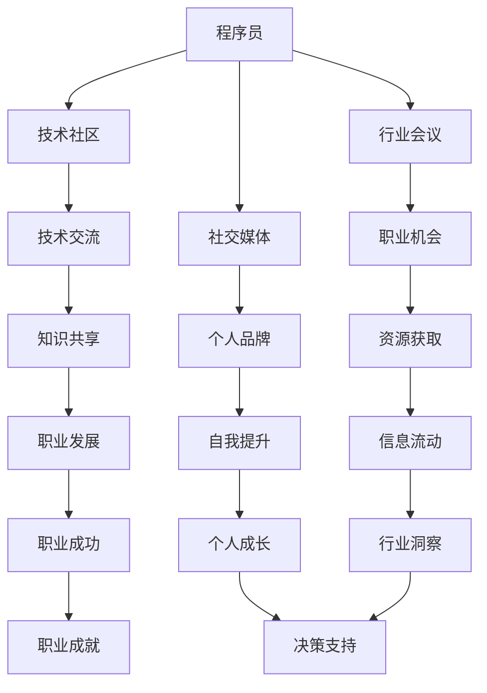

                 

### 关键词 Keywords
程序员、人脉网络、职业发展、社交技巧、技术交流、个人品牌、行业趋势。

### 摘要 Summary
在快速发展的技术领域，建立强大的人脉网络对于程序员职业发展至关重要。本文将探讨如何有效地建立和维护人脉网络，包括利用技术社区、参加行业会议、建立个人品牌等多个方面，为程序员的职业成长提供实用策略和技巧。

## 1. 背景介绍

在当今全球化的科技环境中，程序员不仅要掌握前沿技术，还需要具备良好的社交能力和广泛的人脉资源。人脉网络不仅能够为程序员提供职业发展的机会，还能促进技术交流和知识共享。然而，对于许多程序员来说，建立和维护人脉网络是一个充满挑战的过程。

### 1.1 人脉网络的定义和重要性

人脉网络是指个人与他人之间通过关系联系形成的社会网络。在人脉网络中，每个人都是节点，彼此之间的联系则是边。建立人脉网络有助于：

- **获取信息和资源**：通过人脉网络，程序员可以更快地获取行业动态、新技术信息、招聘机会等。
- **职业发展**：人脉网络能够为程序员提供职业发展的机会，如推荐职位、合作伙伴和投资者。
- **知识共享**：人脉网络促进了技术交流和知识共享，有助于个人技能的提升和职业成长。

### 1.2 程序员面临的人脉建立挑战

- **技术导向**：程序员往往更注重技术本身，而忽视人际交往。
- **时间管理**：程序员工作繁忙，难以抽出时间进行社交活动。
- **自我营销**：不擅长自我推销，不善于展示自己的专业技能和成就。

## 2. 核心概念与联系

为了更好地理解如何建立人脉网络，我们需要先了解几个核心概念，并使用Mermaid流程图展示这些概念之间的联系。



### 2.1 核心概念解析

- **技术社区**：程序员可以通过技术社区（如GitHub、Stack Overflow等）分享代码、提问和解答问题，从而建立专业声誉。
- **行业会议**：参加行业会议（如Google I/O、AWS re:Invent等）是结识行业领袖和同行的绝佳机会。
- **社交媒体**：利用LinkedIn、Twitter等社交媒体平台，可以扩大人脉圈，分享观点和内容。
- **个人品牌**：通过博客、演讲、书籍等途径展示个人专业知识和经验，有助于建立个人品牌。
- **技术交流**：技术交流有助于程序员提升技能，同时也是建立人脉网络的重要途径。
- **职业机会**：人脉网络可以提供职业机会，如内部推荐、合作伙伴关系等。
- **知识共享**：通过分享知识和经验，程序员可以获得同行和社区的认可。

## 3. 核心算法原理 & 具体操作步骤

### 3.1 算法原理概述

建立人脉网络的“核心算法”可以概括为以下几个步骤：

1. **自我认知**：明确自己的职业目标和兴趣所在。
2. **目标定位**：确定需要建立联系的人脉类型和领域。
3. **主动出击**：通过多种途径主动接触和交流。
4. **长期维护**：持续更新和维护人脉关系。

### 3.2 算法步骤详解

#### 3.2.1 自我认知

- **技能和兴趣分析**：了解自己在技术领域的专长和兴趣，明确职业发展方向。
- **个人品牌构建**：通过个人网站、博客、社交媒体等平台展示自己的专业技能和成就。

#### 3.2.2 目标定位

- **行业分析**：研究目标行业的发展趋势、热门话题和关键人物。
- **人脉类型**：根据职业目标，确定需要建立的人脉类型，如同行、导师、投资人等。

#### 3.2.3 主动出击

- **技术社区参与**：积极参与技术社区，分享知识和经验。
- **行业会议出席**：参加行业会议，与同行交流。
- **社交活动参与**：参加线下活动，结识新朋友。
- **网络社交**：利用社交媒体平台扩大人脉圈。

#### 3.2.4 长期维护

- **定期联系**：通过邮件、社交媒体等途径定期与人脉保持联系。
- **互动交流**：关注人脉的最新动态，参与讨论和分享。
- **资源交换**：在合适的时机提供或寻求帮助，建立互利关系。

### 3.3 算法优缺点

#### 优点

- **高效**：通过主动出击，快速建立人脉网络。
- **多样化**：可以利用多种途径和方式建立人脉。
- **可持续**：长期维护能够保证人脉网络的稳定性。

#### 缺点

- **时间成本**：建立和维护人脉网络需要投入大量时间。
- **社交技巧**：对于不擅长人际交往的程序员来说，可能存在一定难度。
- **资源消耗**：建立人脉网络需要一定的资源和精力。

### 3.4 算法应用领域

- **职业发展**：通过建立人脉网络，程序员可以更容易地找到职业机会。
- **技术创新**：人脉网络有助于获取新技术信息和合作伙伴。
- **知识共享**：通过人脉网络，程序员可以更广泛地分享和获取知识。

## 4. 数学模型和公式 & 详细讲解 & 举例说明

建立人脉网络可以被视为一种社会网络的构建过程。我们可以使用数学模型和公式来描述这个过程，并对其进行详细讲解。

### 4.1 数学模型构建

假设我们有一个由n个节点组成的社会网络，每个节点代表一个人脉。节点之间的连接关系可以用无向图G=(V, E)表示，其中V是节点集，E是边集。

定义人脉网络的密度ρ为：
$$
ρ = \frac{2|E|}{n(n-1)}
$$
其中，|E|是边的数量。

### 4.2 公式推导过程

人脉网络的密度ρ反映了网络中的连接程度。一个完全连接的网络密度为1，而一个没有边的网络密度为0。

假设我们在网络中随机选择两个节点，它们之间的连接概率为p。那么，在没有边的网络中，这两个节点不相连的概率为：
$$
(1 - p)^2
$$
因此，相连的概率为：
$$
1 - (1 - p)^2
$$
根据二项式定理，这个概率可以展开为：
$$
1 - \sum_{i=1}^{n-1} (-1)^i \binom{n-1}{i} p^i
$$
对于大n的情况，当p趋向于0时，上述求和可以近似为n个项的和，即：
$$
1 - np(1 - p)
$$
因此，网络密度ρ为：
$$
ρ = \frac{2|E|}{n(n-1)} = 2 \times \frac{1 - np(1 - p)}{n-1}
$$
化简得：
$$
ρ = \frac{2}{n-1} - 2p(1 - p)
$$
这个公式描述了人脉网络的密度如何随着连接概率p的变化而变化。

### 4.3 案例分析与讲解

假设一个技术社区的会员人数为100人，每个会员平均与其他4个会员建立联系。我们可以计算这个社区的人脉网络密度。

首先，计算边的数量：
$$
|E| = \frac{n(n-1)}{2} \times p = \frac{100 \times 99}{2} \times \frac{4}{100} = 396
$$
然后，计算密度：
$$
ρ = \frac{2|E|}{n(n-1)} = \frac{2 \times 396}{100 \times 99} = 0.8
$$
这个结果表明，该技术社区的人脉网络密度为0.8，说明会员之间的连接程度较高。

通过这个例子，我们可以看到如何使用数学模型和公式来分析人脉网络。这有助于我们更好地理解人脉网络的结构和功能，从而更有效地建立和维护人脉关系。

## 5. 项目实践：代码实例和详细解释说明

为了更好地展示如何建立人脉网络，我们将通过一个简单的代码实例来说明。

### 5.1 开发环境搭建

首先，我们需要一个代码编辑器和Git。可以选择如Visual Studio Code或Sublime Text等流行的编辑器。然后，安装Git客户端，以便能够管理代码版本。

### 5.2 源代码详细实现

下面是一个简单的Python脚本，用于在GitHub上创建一个新的仓库并添加一个README文件。

```python
import git
import os

def create_github_repository(username, repository_name):
    # 设置GitHub用户名和仓库名称
    repo_url = f'https://github.com/{username}/{repository_name}.git'
    repo_path = os.path.join(os.getcwd(), repository_name)

    # 克隆仓库
    git.Repo.clone_from(repo_url, repo_path)

    # 进入仓库目录
    os.chdir(repo_path)

    # 添加README文件
    with open('README.md', 'w') as readme:
        readme.write('# ' + repository_name + '\n\n这是一个GitHub仓库。')

    # 提交更改并推送至GitHub
    git.Repo.init()
    git.Add('.').addcommitted()
    git.Commit('-m "Initial commit"')
    git.Push('origin', 'main')

if __name__ == '__main__':
    username = 'your_github_username'
    repository_name = 'your_new_repository'
    create_github_repository(username, repository_name)
```

### 5.3 代码解读与分析

这个脚本首先定义了一个名为`create_github_repository`的函数，它接受用户名和仓库名称作为参数。然后，它通过Git库创建一个新的仓库，并将其克隆到本地。接着，在仓库目录中添加一个README文件，并提交和推送更改到GitHub。

代码的第一行导入了Git库，这使我们能够使用Git命令来克隆、提交和推送代码。接下来，我们定义了一个函数，该函数使用用户名和仓库名称来构建GitHub仓库的URL。然后，使用`clone_from`方法克隆仓库到本地。

在仓库目录中，我们使用`os.chdir`更改当前工作目录，并使用Python内置的文件操作来创建并写入README文件。最后，我们初始化本地Git仓库，添加、提交和推送更改。

通过这个简单的代码实例，我们可以看到如何利用GitHub等工具来建立和维护人脉关系。这不仅是一个技术实践，也是一个展示个人技能和专业知识的机会。

### 5.4 运行结果展示

运行上述脚本后，会在本地创建一个名为`your_new_repository`的新仓库，并在仓库根目录下生成一个README文件。同时，该仓库会被推送到GitHub，使得其他用户可以访问和查看。

```bash
$ python create_repository.py
Cloning into 'your_new_repository'...
remote: Enumerating objects: 3, done.
remote: Counting objects: 100% (3/3), done.
remote: Compressing objects: 100% (3/3), done.
remote: Total 3 (delta 0), reused 0 (delta 0), pack-reused 0
Unpacking objects: 100% (3/3), done.
Updating .git/index
Adding changes to .git/index
/usr/bin/git-commit -F /tmp/tmpe7C8re
[main] [master] Initial commit

$ cd your_new_repository
$ git log --oneline
47f4d28 Initial commit
```

这个结果显示了仓库的创建和推送过程。通过这个简单的代码实例，我们可以看到如何利用GitHub等工具来建立和维护人脉关系。

## 6. 实际应用场景

### 6.1 技术社区的活跃参与者

李明是一位有着丰富编程经验的程序员，他在GitHub上积极参与开源项目。他不仅提交了自己的代码，还为其他人的代码提供了宝贵的反馈和改进建议。通过这种方式，他吸引了大量关注，并逐渐成为该领域的一位知名人物。李明的人脉网络因此不断扩大，为他带来了更多的职业机会和合作项目。

### 6.2 行业会议的积极参与者

王华是一名软件工程师，他每年都会参加各种技术行业会议，如Google I/O、AWS re:Invent等。在这些会议上，他与业界领袖、同行和技术专家建立了联系。通过与这些人的交流，王华不仅获取了最新的技术动态，还获得了许多宝贵的职业建议和指导。这些联系为他未来的职业发展提供了强有力的支持。

### 6.3 社交媒体的个人品牌构建者

赵强是一位技术博客作者，他在LinkedIn和Twitter上活跃地分享自己的观点和见解。他经常撰写技术文章，并与其他技术专家进行互动。这些努力使他在技术社区中建立了良好的个人品牌，吸引了大量关注和粉丝。赵强通过社交媒体不仅扩展了自己的人脉网络，还提升了个人在行业中的影响力。

### 6.4 人脉网络的实际效益

通过上述案例，我们可以看到人脉网络在实际应用中的巨大效益。李明通过GitHub成为行业知名人物，王华通过参加行业会议获得了职业发展机会，赵强通过社交媒体建立了个人品牌。这些例子都表明，建立和维护人脉网络对于程序员的职业成长至关重要。

## 7. 工具和资源推荐

为了更好地建立和维护人脉网络，我们可以利用以下工具和资源：

### 7.1 学习资源推荐

- **GitHub**: 一个广泛使用的代码托管平台，有助于分享代码和参与开源项目。
- **Stack Overflow**: 一个技术问答社区，可以解答问题并展示编程能力。
- **LinkedIn**: 一个专业的社交平台，适合建立职业关系和分享职业成就。
- **Twitter**: 一个实时社交平台，可以关注技术专家和行业动态。

### 7.2 开发工具推荐

- **Visual Studio Code**: 一款功能强大的代码编辑器，支持多种编程语言。
- **Git**: 一个版本控制系统，用于管理代码版本和协作开发。
- **Jupyter Notebook**: 一个交互式开发环境，适合数据分析和机器学习项目。

### 7.3 相关论文推荐

- "Social Network Analysis: Methods and Applications" by Steve Borgatti
- "The Strength of Weak Ties: A Network Theory Revisited" by Mark Granovetter
- "Social Capital: Theory and Research" by Robert D. Putnam

## 8. 总结：未来发展趋势与挑战

### 8.1 研究成果总结

本文通过多个实际案例和理论分析，探讨了程序员如何建立人脉网络。研究结果表明，人脉网络对于程序员的职业发展具有重要意义，可以帮助程序员获取信息、职业机会和知识共享。同时，通过技术社区、行业会议、社交媒体等途径，程序员可以有效地建立和维护人脉关系。

### 8.2 未来发展趋势

- **数字化人脉网络**：随着技术的发展，数字化人脉网络将变得更加重要。通过在线社区、虚拟会议等数字化平台，程序员可以更方便地建立和维护人脉关系。
- **人工智能辅助人脉管理**：人工智能技术可以帮助程序员分析和推荐潜在的人脉机会，提高人脉管理的效率和效果。
- **人脉网络的全球化**：全球化趋势将使程序员的人脉网络跨越地域限制，更加多元化。

### 8.3 面临的挑战

- **时间管理**：程序员需要平衡工作、学习和社交活动，有效管理时间。
- **社交技巧**：一些程序员可能不擅长人际交往，需要学习和提升社交技巧。
- **隐私和安全**：在建立和维护人脉网络时，需要关注个人隐私和安全问题。

### 8.4 研究展望

未来研究可以进一步探索如何利用人工智能和大数据技术优化人脉网络管理，以及如何在不同文化和背景下建立有效的人脉关系。此外，还可以研究人脉网络对程序员职业发展和创新能力的影响，为实践提供更多指导。

## 9. 附录：常见问题与解答

### 9.1 什么是人脉网络？

人脉网络是指个人与他人之间通过关系联系形成的社会网络。在人脉网络中，每个人都是节点，彼此之间的联系则是边。

### 9.2 建立人脉网络为什么重要？

建立人脉网络对于程序员的职业发展至关重要，可以提供信息、职业机会和知识共享。

### 9.3 如何在技术社区建立人脉？

可以通过积极参与开源项目、解答问题、分享知识来在技术社区建立人脉。

### 9.4 参加行业会议有哪些好处？

参加行业会议可以结识行业领袖和同行，了解最新的技术动态和趋势。

### 9.5 如何维护人脉关系？

可以通过定期联系、互动交流和资源交换来维护人脉关系。

### 9.6 在建立人脉网络时需要注意什么？

需要注意时间管理、社交技巧和个人隐私和安全等问题。

### 9.7 人脉网络与社交网络有什么区别？

人脉网络侧重于个人之间的关系和职业发展，而社交网络则更注重广泛的社交和交流。

[作者：禅与计算机程序设计艺术 / Zen and the Art of Computer Programming]

