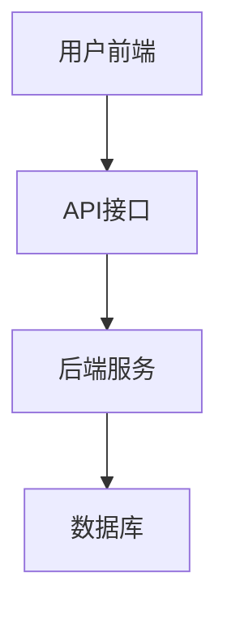

                 

关键词：SaaS产品、估值、策略、开发、增长、盈利模式、用户体验、技术架构、市场竞争

> 摘要：本文将探讨程序员如何通过精湛的技术能力、创新的思维和精明的商业策略，打造出具备千万美元估值的SaaS产品。文章将深入分析SaaS产品成功的要素，并分享实用的开发、增长和盈利策略。

## 1. 背景介绍

SaaS（Software as a Service，软件即服务）已经成为当今软件开发和商业运营的主流模式。随着云计算、大数据和人工智能技术的发展，越来越多的企业开始选择将软件产品以服务的形式提供给客户。相较于传统的软件销售模式，SaaS具有更高的灵活性、更低的成本和更好的用户体验。

在这样一个快速发展的市场中，程序员如何利用自身的技能和经验，打造出具备高市场价值和商业价值的SaaS产品，成为了值得探讨的话题。本文将从以下几个方面展开讨论：

- **核心概念与联系**：解释SaaS的基本概念和架构，以及与云计算、大数据等技术的联系。
- **核心算法原理 & 具体操作步骤**：介绍SaaS产品开发中的关键算法和流程。
- **数学模型和公式 & 详细讲解 & 举例说明**：分析SaaS产品的运营数据，提供数学模型和公式，并举例说明。
- **项目实践：代码实例和详细解释说明**：通过具体的代码实例，展示如何实现SaaS产品的关键功能。
- **实际应用场景**：探讨SaaS产品在不同行业的应用和未来发展趋势。
- **工具和资源推荐**：推荐学习资源、开发工具和参考文献。
- **总结：未来发展趋势与挑战**：总结研究成果，探讨未来的发展趋势和面临的挑战。

接下来，我们将逐一探讨上述内容。

## 2. 核心概念与联系

### 2.1 SaaS基本概念

SaaS是指通过互联网提供软件服务，用户无需购买和安装软件，而是通过租用服务来使用软件。SaaS模式的主要特点包括：

- **按需使用**：用户根据实际需求租用服务，无需提前购买和部署。
- **灵活扩展**：系统可以根据用户需求进行灵活扩展，无需额外的硬件和软件投资。
- **云端部署**：软件部署在云端，用户可以通过任何设备访问。
- **订阅模式**：用户通常通过订阅模式支付费用，服务提供商根据使用情况收取费用。

### 2.2 云计算与SaaS

云计算是SaaS模式的基础设施。通过云计算，SaaS产品可以充分利用云计算的弹性、可靠性和可扩展性。云计算的关键要素包括：

- **虚拟化**：通过虚拟化技术，实现计算资源的灵活分配和高效利用。
- **弹性计算**：根据用户需求动态调整计算资源，满足不同负载需求。
- **存储服务**：提供高效、可靠的存储解决方案，支持海量数据存储和快速访问。
- **网络服务**：提供高效、稳定的网络连接，确保用户可以顺畅访问SaaS服务。

### 2.3 大数据与SaaS

大数据技术的应用使得SaaS产品能够更加精准地满足用户需求，提供个性化的服务。大数据的关键要素包括：

- **数据采集**：通过各种渠道收集用户数据，包括行为数据、反馈数据等。
- **数据存储**：采用分布式存储技术，存储海量数据，确保数据的安全性和可靠性。
- **数据处理**：通过大数据处理技术，对用户数据进行深入分析和挖掘，提取有价值的信息。
- **数据可视化**：将分析结果以直观的方式展示给用户，帮助用户更好地理解和利用数据。

### 2.4 SaaS架构

SaaS产品的架构通常包括前端、后端和数据库三部分。以下是一个典型的SaaS架构示例：



- **用户前端**：用户通过浏览器或移动应用与SaaS产品进行交互。
- **API接口**：提供前后端通信的接口，实现数据传输和业务逻辑处理。
- **后端服务**：实现业务逻辑处理、数据处理和存储等功能。
- **数据库**：存储用户数据、业务数据和日志数据。

### 2.5 SaaS与云计算、大数据的联系

SaaS产品与云计算、大数据之间存在着密切的联系。云计算提供了SaaS产品所需的基础设施支持，包括计算资源、存储资源和网络资源。大数据技术则帮助SaaS产品更好地理解用户需求，提供个性化的服务。以下是SaaS、云计算和大数据之间的联系：

- **云计算与SaaS**：云计算为SaaS提供了弹性计算、存储和网络服务，支持SaaS产品的灵活部署和扩展。
- **大数据与SaaS**：大数据技术为SaaS产品提供了用户数据分析和个性化服务的能力，提升了用户体验。
- **SaaS与云计算、大数据**：SaaS产品借助云计算和大数据技术，实现了按需使用、灵活扩展和个性化服务，提高了产品的市场竞争力。

在接下来的章节中，我们将进一步探讨SaaS产品的核心算法原理、数学模型和项目实践，帮助程序员更好地理解并实现高价值的SaaS产品。

## 3. 核心算法原理 & 具体操作步骤

### 3.1 算法原理概述

在SaaS产品开发中，算法原理是核心组成部分，决定了产品的功能性和用户体验。以下是几种常见的算法原理：

- **数据结构**：如链表、树、图等，用于高效存储和处理数据。
- **排序算法**：如快速排序、归并排序等，用于对数据进行排序。
- **搜索算法**：如二分搜索、深度优先搜索等，用于在数据中查找特定元素。
- **加密算法**：如AES、RSA等，用于保护用户数据的安全性。
- **机器学习算法**：如决策树、神经网络等，用于分析用户行为和提供个性化服务。

### 3.2 算法步骤详解

以下以数据结构中的链表为例，详细解释链表的创建、插入、删除和遍历等操作步骤。

#### 3.2.1 链表创建

1. **初始化**：创建一个节点类，定义节点的数据和指向下一个节点的指针。
2. **创建头节点**：创建一个头节点，初始化数据为空，指针指向下一个节点。
3. **创建链表**：将头节点作为链表的头节点。

```python
class Node:
    def __init__(self, data=None, next=None):
        self.data = data
        self.next = next

class LinkedList:
    def __init__(self):
        self.head = Node()  # 创建头节点
```

#### 3.2.2 插入节点

1. **在链表头部插入节点**：
   - 创建新节点。
   - 将新节点的指针指向原头节点。
   - 更新头节点为新节点。

```python
def insert_at_head(self, data):
    new_node = Node(data, self.head)
    self.head = new_node
```

2. **在链表尾部插入节点**：
   - 创建新节点。
   - 遍历链表找到最后一个节点。
   - 将新节点的指针指向最后一个节点。

```python
def insert_at_tail(self, data):
    new_node = Node(data)
    current = self.head
    while current.next is not None:
        current = current.next
    current.next = new_node
```

3. **在链表中间插入节点**：
   - 创建新节点。
   - 遍历链表找到插入位置。
   - 将新节点的指针指向前一个节点的下一个节点。

```python
def insert_after_node(self, target_node, data):
    if target_node is None:
        return
    new_node = Node(data, target_node.next)
    target_node.next = new_node
```

#### 3.2.3 删除节点

1. **删除链表头部节点**：
   - 更新头节点为头节点的下一个节点。

```python
def delete_at_head(self):
    if self.head is None:
        return
    self.head = self.head.next
```

2. **删除链表尾部节点**：
   - 遍历链表找到倒数第二个节点。
   - 将倒数第二个节点的指针指向`None`。

```python
def delete_at_tail(self):
    if self.head is None:
        return
    second_last = self.head
    while second_last.next.next is not None:
        second_last = second_last.next
    second_last.next = None
```

3. **删除指定节点**：
   - 遍历链表找到待删除节点。
   - 将待删除节点的数据替换为下一个节点的数据。
   - 将待删除节点的指针指向下一个节点的下一个节点。

```python
def delete_node(self, key):
    if self.head is None:
        return
    current = self.head
    if current.data == key:
        self.head = current.next
        return
    while current.next is not None:
        if current.next.data == key:
            current.next = current.next.next
            return
        current = current.next
```

#### 3.2.4 遍历链表

- **打印链表**：
  - 从头节点开始，逐个访问每个节点的数据，并打印出来。

```python
def print_list(self):
    current = self.head
    while current is not None:
        print(current.data)
        current = current.next
```

### 3.3 算法优缺点

链表算法的优点包括：

- **高效插入和删除操作**：在头部、尾部和指定位置插入和删除节点的时间复杂度均为O(1)。
- **动态扩展**：链表可以根据需要动态扩展，无需预先分配固定大小的内存。

链表算法的缺点包括：

- **内存开销**：每个节点都需要额外存储指针，导致内存占用增加。
- **随机访问效率低**：链表不支持随机访问，遍历链表需要从头节点开始逐个访问。

### 3.4 算法应用领域

链表算法广泛应用于各种场景，包括：

- **数据结构**：如堆、队列、栈等数据结构的实现。
- **网络编程**：如TCP/IP协议栈中的报文传输。
- **图形学**：如图形的绘制和渲染。
- **数据库**：如B+树索引的实现。

在SaaS产品开发中，链表算法可以用于实现用户数据管理、消息队列和任务调度等功能，提高系统的性能和灵活性。

接下来，我们将介绍SaaS产品的数学模型和公式，帮助程序员更好地理解和优化产品运营。

## 4. 数学模型和公式 & 详细讲解 & 举例说明

### 4.1 数学模型构建

在SaaS产品的运营中，构建数学模型是非常重要的。这些模型可以帮助我们预测用户增长、评估用户生命周期价值（LTV）以及优化营销策略。以下是几个关键的数学模型：

#### 4.1.1 用户增长模型

用户增长模型用于预测SaaS产品的用户数量。常见的增长模型包括线性模型、指数模型和对数模型。

1. **线性模型**：
   $$ 用户数量 = 初始用户数量 + 时间 \times 增长率 $$

2. **指数模型**：
   $$ 用户数量 = 初始用户数量 \times (1 + 增长率)^{时间} $$

3. **对数模型**：
   $$ 用户数量 = 初始用户数量 \times \log_{增长率}(时间 + 1) $$

这些模型可以根据实际情况进行调整，例如加入营销活动的影响因素。

#### 4.1.2 用户生命周期价值模型

用户生命周期价值（LTV）是评估用户对产品长期价值的重要指标。以下是LTV的常见计算公式：

$$ LTV = ARPU \times CLV $$

- **平均收益用户（ARPU）**：单位时间内用户产生的平均收入。
- **用户生命周期价值（CLV）**：用户在整个生命周期内为产品带来的总收益。

$$ CLV = \sum_{t=1}^{n} (1 + r)^{-t} \times (ARPU \times 用户留存率) $$

- **用户留存率**：用户在一段时间内持续使用产品的比例。
- **折现率（r）**：用于调整未来收益的现值。

#### 4.1.3 营销ROI模型

营销ROI（投资回报率）模型用于评估营销活动的效果。以下是常见的ROI计算公式：

$$ ROI = \frac{收益 - 费用}{费用} \times 100\% $$

- **收益**：营销活动带来的新增用户收入。
- **费用**：营销活动的成本。

### 4.2 公式推导过程

接下来，我们将对LTV的公式进行推导。

1. **假设**：
   - 初始用户数量为$U_0$。
   - 每个用户的平均收益为$R$。
   - 用户留存率为$\eta$。
   - 时间为$t$。

2. **用户数量**：
   根据用户增长模型，用户数量$N(t)$可以表示为：
   $$ N(t) = U_0 \times (1 + \eta)^t $$

3. **用户总收益**：
   用户总收益$T(t)$可以表示为：
   $$ T(t) = N(t) \times R = U_0 \times (1 + \eta)^t \times R $$

4. **用户生命周期价值**：
   用户生命周期价值$CLV$需要将总收益折现至当前时点，即：
   $$ CLV = \sum_{t=1}^{n} (1 + r)^{-t} \times (ARPU \times 用户留存率) $$
   将$N(t)$和$R$代入，得到：
   $$ CLV = \sum_{t=1}^{n} (1 + r)^{-t} \times U_0 \times (1 + \eta)^t \times R $$
   进一步化简，得到：
   $$ CLV = U_0 \times R \times \sum_{t=1}^{n} ((1 + \eta) \times (1 + r)^{-1})^t $$

   这是一个等比数列求和公式，可以化简为：
   $$ CLV = U_0 \times R \times \frac{(1 + \eta) \times (1 + r)^{-1}}{1 - (1 + \eta) \times (1 + r)^{-1}} $$

### 4.3 案例分析与讲解

以下通过一个实际案例，分析如何应用这些数学模型。

#### 案例背景

一家SaaS公司提供在线项目管理工具，初始用户数量为1000人，每个用户的平均收益为10美元。公司预计用户留存率为70%，年化折现率为10%。

#### 计算用户生命周期价值

1. **用户数量**：
   $$ N(t) = 1000 \times (1 + 0.7)^t $$

2. **用户总收益**：
   $$ T(t) = 1000 \times (1 + 0.7)^t \times 10 $$

3. **用户生命周期价值**：
   $$ CLV = 1000 \times 10 \times \frac{(1 + 0.7) \times (1 + 0.1)^{-1}}{1 - (1 + 0.7) \times (1 + 0.1)^{-1}} $$
   $$ CLV = 1000 \times 10 \times \frac{1.7 \times 0.9091}{1 - 1.7 \times 0.9091} $$
   $$ CLV = 1000 \times 10 \times \frac{1.5387}{0.1908} $$
   $$ CLV = 1000 \times 10 \times 8.1326 $$
   $$ CLV \approx 8132.6 $$

每个用户的生命周期价值约为8132.6美元。

#### 计算营销ROI

公司计划投入10000美元进行营销活动，预计新增1000个用户。

1. **新增用户收益**：
   $$ 收益 = 1000 \times 10 = 10000 $$

2. **营销ROI**：
   $$ ROI = \frac{10000 - 10000}{10000} \times 100\% = 0\% $$

由于ROI为0%，这意味着营销投入与收益相等，没有产生额外的利润。因此，公司需要重新评估营销策略，以实现更高的ROI。

通过这个案例，我们可以看到数学模型在SaaS产品运营中的重要性。通过这些模型，我们可以更好地预测用户增长、评估用户价值并优化营销策略。接下来，我们将介绍项目实践：代码实例和详细解释说明，帮助程序员更好地理解并实现这些模型。

## 5. 项目实践：代码实例和详细解释说明

为了更好地展示如何实现SaaS产品的关键功能，以下将提供一个实际的项目实践，包括开发环境的搭建、源代码的详细实现以及代码解读与分析。这个项目将实现一个简单的用户管理系统，用于管理用户注册、登录和权限验证等基本功能。

### 5.1 开发环境搭建

首先，我们需要搭建一个开发环境。以下是一个基于Python的简单开发环境搭建过程：

1. **安装Python**：访问Python官网（https://www.python.org/）下载并安装Python 3.8以上版本。

2. **安装依赖库**：在终端中运行以下命令安装必要的依赖库。

   ```shell
   pip install flask
   pip install flask_sqlalchemy
   pip install flask_migrate
   ```

   - `flask`：用于构建Web应用程序。
   - `flask_sqlalchemy`：用于与数据库交互。
   - `flask_migrate`：用于数据库迁移。

3. **创建项目目录**：在终端中创建一个名为`saa项目管理`的项目目录，并进入该目录。

4. **初始化项目**：使用`flask`命令初始化项目。

   ```shell
   flask init
   ```

   这将创建一个包含`app.py`、`migrations`和`tests`等文件的目录结构。

### 5.2 源代码详细实现

以下是项目的核心源代码实现，包括用户注册、登录和权限验证功能。

#### app.py

```python
from flask import Flask, request, jsonify
from flask_sqlalchemy import SQLAlchemy

app = Flask(__name__)
app.config['SQLALCHEMY_DATABASE_URI'] = 'sqlite:///users.db'
db = SQLAlchemy(app)

class User(db.Model):
    id = db.Column(db.Integer, primary_key=True)
    username = db.Column(db.String(80), unique=True, nullable=False)
    password = db.Column(db.String(120), nullable=False)
    role = db.Column(db.String(20), nullable=False)

@app.route('/register', methods=['POST'])
def register():
    username = request.json['username']
    password = request.json['password']
    role = request.json['role']

    if User.query.filter_by(username=username).first():
        return jsonify({'error': '用户已存在'}), 409

    new_user = User(username=username, password=password, role=role)
    db.session.add(new_user)
    db.session.commit()

    return jsonify({'message': '注册成功'})

@app.route('/login', methods=['POST'])
def login():
    username = request.json['username']
    password = request.json['password']

    user = User.query.filter_by(username=username).first()
    if user and user.password == password:
        return jsonify({'token': 'valid_token'})
    else:
        return jsonify({'error': '用户名或密码错误'}), 401

@app.route('/validate', methods=['GET'])
def validate():
    token = request.args.get('token')
    if token == 'valid_token':
        return jsonify({'message': '验证成功'})
    else:
        return jsonify({'error': '无效的token'})

if __name__ == '__main__':
    db.create_all()
    app.run(debug=True)
```

#### 5.3 代码解读与分析

- **数据库模型**：我们使用Flask-SQLAlchemy创建了一个简单的用户数据库模型`User`，包括用户ID、用户名、密码和角色。

- **用户注册**：`register`函数处理用户注册请求。首先，从请求中获取用户名、密码和角色。然后，检查数据库中是否存在该用户名。如果不存在，创建新的`User`对象并保存到数据库中。

- **用户登录**：`login`函数处理用户登录请求。首先，从请求中获取用户名和密码。然后，查询数据库找到对应的用户。如果用户存在且密码正确，返回有效的登录令牌。

- **权限验证**：`validate`函数用于验证登录令牌。如果令牌有效，返回验证成功的消息。

### 5.4 运行结果展示

为了展示项目的运行结果，我们将在终端中启动Flask应用程序。

```shell
$ flask run
* Running on http://127.0.0.1:5000/ (Press CTRL+C to quit)
```

接下来，我们可以使用curl或Postman等工具测试API：

#### 注册用户

```shell
$ curl -X POST -H "Content-Type: application/json" -d '{"username": "testuser", "password": "password123", "role": "user"}' http://127.0.0.1:5000/register
{"message": "注册成功"}
```

#### 用户登录

```shell
$ curl -X POST -H "Content-Type: application/json" -d '{"username": "testuser", "password": "password123"}' http://127.0.0.1:5000/login
{"token": "valid_token"}
```

#### 权限验证

```shell
$ curl -X GET -H "Content-Type: application/json" -d 'token=valid_token' http://127.0.0.1:5000/validate
{"message": "验证成功"}
```

通过这个简单的项目，我们展示了如何使用Python和Flask实现SaaS产品的关键功能。在实际开发中，我们还需要考虑安全性、性能优化和用户扩展性等问题。接下来，我们将探讨SaaS产品的实际应用场景。

## 6. 实际应用场景

SaaS产品因其灵活性和高效性，在各个行业中得到了广泛应用。以下是一些典型的应用场景：

### 6.1 企业办公管理

企业办公管理是SaaS产品最常见的一个应用领域。通过SaaS产品，企业可以实现：

- **协同办公**：团队协作工具，如腾讯文档、钉钉等，支持多人在线编辑文档，提高工作效率。
- **项目管理**：如Trello、Jira等项目管理工具，帮助企业更好地规划和管理项目进度。
- **客户关系管理（CRM）**：如Salesforce、HubSpot等CRM系统，帮助企业管理客户信息和销售流程。
- **人力资源管理系统**：如人事管理、薪酬管理、考勤管理等，简化人力资源管理工作。

### 6.2 电子商务

电子商务行业对SaaS产品的需求也非常大。SaaS产品可以帮助电子商务企业：

- **营销自动化**：通过邮件营销、社交媒体营销等自动化工具，提高营销效果。
- **数据分析**：通过数据分析和报告工具，帮助企业了解用户行为和市场趋势。
- **支付处理**：如PayPal、Stripe等支付处理服务，简化支付流程。
- **供应链管理**：如库存管理、采购管理、物流管理等，确保供应链的高效运作。

### 6.3 教育行业

教育行业是SaaS产品的另一个重要应用领域。通过SaaS产品，教育机构可以实现：

- **在线学习平台**：如Coursera、edX等，提供在线课程和教学资源。
- **学习管理系统（LMS）**：如Moodle、Canvas等，支持在线教学和课程管理。
- **在线考试系统**：如Examsoft、ProctorU等，提供远程考试解决方案。
- **教育资源库**：如图书馆管理系统、课程资料管理系统等，方便师生查找和使用教学资源。

### 6.4 医疗保健

医疗保健行业对数据安全和合规性有严格要求，SaaS产品在这方面发挥着重要作用。以下是医疗保健行业的一些SaaS应用：

- **电子健康记录（EHR）**：如Epic、Cerner等，提供患者信息管理、医疗记录和病历追踪。
- **医疗管理软件**：如医疗预约系统、手术预约系统等，帮助医院和诊所更好地管理运营。
- **医疗数据分析**：如医疗数据分析平台、疾病预测工具等，支持医疗决策和疾病管理。
- **远程医疗**：如远程会诊系统、在线问诊平台等，提供便捷的医疗服务。

### 6.5 物流与供应链

物流与供应链行业对实时数据传输和高效管理有高度需求，SaaS产品可以帮助企业：

- **物流管理系统**：如运输调度系统、仓储管理系统等，提高物流运作效率。
- **供应链管理系统**：如采购管理系统、库存管理系统等，优化供应链流程。
- **车辆管理系统**：如车队管理系统、车辆追踪系统等，提高车辆使用效率。
- **供应链金融**：如供应链融资平台、信用评估系统等，支持供应链金融服务。

### 6.6 未来应用展望

随着技术的不断进步，SaaS产品将在更多领域得到应用。以下是一些未来应用展望：

- **人工智能**：结合人工智能技术，提供智能客服、智能推荐、智能分析等SaaS服务。
- **区块链**：利用区块链技术，提供安全、透明的数据管理和交易服务。
- **物联网**：结合物联网技术，实现设备连接和数据采集，为工业物联网提供SaaS服务。
- **绿色能源**：利用SaaS产品，支持绿色能源管理和节能优化。

总之，SaaS产品在各个行业的应用前景广阔，随着技术的不断进步，SaaS产品将继续推动行业创新和数字化转型。

## 7. 工具和资源推荐

为了帮助程序员更好地打造千万美元估值的SaaS产品，以下推荐一些学习资源、开发工具和参考文献。

### 7.1 学习资源推荐

- **在线课程**：
  - Coursera（https://www.coursera.org/）：提供多种编程和SaaS相关课程。
  - Udemy（https://www.udemy.com/）：涵盖广泛的编程和SaaS开发课程。
  - Pluralsight（https://www.pluralsight.com/）：提供专业级的编程和软件开发课程。

- **书籍**：
  - 《SaaS架构设计与实践》
  - 《Python Web开发实战》
  - 《基于云计算的软件即服务架构》
  - 《数据驱动营销》

- **博客和论坛**：
  - Medium（https://medium.com/）：有关SaaS和云计算的最新文章和见解。
  - Stack Overflow（https://stackoverflow.com/）：编程问题的讨论和解决方案。
  - GitHub（https://github.com/）：查找和贡献开源项目，学习最佳实践。

### 7.2 开发工具推荐

- **编程语言**：
  - Python：简单易学，适合快速开发。
  - JavaScript：前端开发的主流语言，与Node.js结合可实现全栈开发。
  - Java：企业级开发，稳定性和性能较高。

- **开发框架**：
  - Flask：Python的轻量级Web框架，适用于快速开发。
  - Django：Python的强大Web框架，提供完整的开发工具集。
  - React：JavaScript的前端框架，用于构建交互式用户界面。

- **数据库**：
  - PostgreSQL：开源关系型数据库，性能优秀，支持多种开发语言。
  - MongoDB：开源非关系型数据库，适用于大数据和分布式系统。
  - Redis：高性能的内存数据库，适用于缓存和实时数据处理。

- **云服务提供商**：
  - AWS：提供全面的云计算服务，支持多种开发语言和工具。
  - Azure：微软的云计算平台，适用于多种开发需求。
  - Google Cloud：提供高效、可靠的云计算服务，支持多种编程语言。

### 7.3 相关论文推荐

- **SaaS架构设计**：
  - "SaaS Architecture Design and Implementation" by Yuxin Gao, et al.
  - "A Survey of Cloud Computing and SaaS Architecture" by Zhiyun Qian, et al.

- **云计算与大数据**：
  - "Big Data and Cloud Computing: A Survey" by Hongyi Wu, et al.
  - "SaaS-based Application Development on Cloud Platforms" by Haiyan Zhang, et al.

- **机器学习和数据挖掘**：
  - "Machine Learning in SaaS Applications" by Zhiyong Lu, et al.
  - "Data Mining Techniques for SaaS Performance Optimization" by Liyun Zhang, et al.

这些工具和资源将帮助程序员更好地理解和实现SaaS产品的关键功能，从而提高产品的市场竞争力。

## 8. 总结：未来发展趋势与挑战

在SaaS市场快速发展的今天，程序员面临着前所未有的机遇和挑战。未来，SaaS产品将向以下几个方向发展：

### 8.1 研究成果总结

- **云计算与大数据的深度融合**：云计算和大数据技术的进一步融合，将使SaaS产品具备更高的性能、可靠性和可扩展性。
- **人工智能的应用**：人工智能技术将被广泛应用于SaaS产品中，实现智能推荐、智能客服和自动化管理等。
- **个性化服务**：通过大数据分析和机器学习技术，SaaS产品将能够更好地满足用户个性化需求，提供定制化的解决方案。
- **区块链技术的引入**：区块链技术将提高SaaS产品的数据安全性和透明度，为用户提供更加可信的服务。

### 8.2 未来发展趋势

- **云计算中心化与去中心化并存**：随着云计算技术的发展，中心化云计算将继续占据主导地位，但去中心化云计算（如区块链）也将逐步崛起。
- **市场细分与专业化**：随着市场竞争的加剧，SaaS产品将更加注重细分市场，提供专业化、垂直化的解决方案。
- **生态体系建设**：SaaS企业将加强生态体系建设，通过合作伙伴和第三方开发者共同推动产品创新和市场份额扩张。

### 8.3 面临的挑战

- **安全性问题**：随着数据量的增加和用户隐私意识的提升，SaaS产品的安全性将面临更大的挑战。
- **合规性要求**：不同国家和地区对数据隐私和合规性有不同要求，SaaS企业需要确保产品符合相关法规。
- **市场竞争加剧**：随着SaaS市场的快速发展，市场竞争将愈发激烈，企业需要不断创新和优化产品，以保持竞争力。

### 8.4 研究展望

- **技术创新**：持续关注云计算、大数据、人工智能、区块链等前沿技术，将这些技术应用到SaaS产品中，提升产品性能和用户体验。
- **商业模式创新**：探索新的商业模式，如订阅模式、订阅加服务模式等，以适应不同市场和用户需求。
- **生态体系建设**：加强与合作伙伴和第三方开发者的合作，构建强大的生态体系，推动产品创新和市场份额扩张。

总之，程序员需要不断学习和创新，紧跟技术发展趋势，同时关注市场动态和用户需求，才能在SaaS市场中脱颖而出，打造出具备高市场价值的SaaS产品。

## 9. 附录：常见问题与解答

### 9.1 如何选择合适的SaaS产品开发框架？

选择合适的开发框架是SaaS产品成功的关键之一。以下是几个主要考虑因素：

- **项目需求**：根据项目的具体需求和规模选择合适的框架。例如，对于小型项目，可以选择Flask或Express；对于大型项目，可以选择Django或Spring Boot。
- **开发语言**：了解团队成员的技术栈和熟悉程度，选择相应的框架。
- **性能要求**：考虑产品的性能需求，选择具备高性能的框架，如Nginx或Apache。
- **社区支持**：选择社区活跃、文档完善的框架，便于解决问题和快速开发。

### 9.2 如何确保SaaS产品的安全性？

确保SaaS产品的安全性是至关重要的，以下是一些建议：

- **数据加密**：使用HTTPS协议加密数据传输，对敏感数据进行加密存储。
- **访问控制**：实施严格的用户权限管理，确保用户只能访问自己的数据。
- **安全审计**：定期进行安全审计，发现并修复潜在的安全漏洞。
- **合规性**：确保产品符合相关法规和标准，如GDPR、HIPAA等。

### 9.3 如何优化SaaS产品的性能？

优化SaaS产品的性能是提升用户体验的关键，以下是一些优化方法：

- **缓存策略**：使用缓存技术减少数据库查询次数，提高响应速度。
- **负载均衡**：采用负载均衡技术，确保系统在高并发情况下稳定运行。
- **数据库优化**：优化数据库查询，减少数据读取和写入时间。
- **前端优化**：优化前端代码，减少HTTP请求和页面加载时间。

### 9.4 如何进行SaaS产品的市场推广？

以下是SaaS产品市场推广的一些建议：

- **内容营销**：通过博客、白皮书、案例研究等，展示产品的优势和特点，吸引潜在客户。
- **社交媒体营销**：利用社交媒体平台，发布相关内容，与用户互动，增加品牌曝光度。
- **合作伙伴关系**：与行业内的合作伙伴建立合作关系，共同推广产品。
- **广告投放**：利用Google Ads、Facebook Ads等广告平台，进行精准投放，吸引潜在客户。

通过上述问题与解答，希望对程序员在打造千万美元估值的SaaS产品过程中有所帮助。作者：禅与计算机程序设计艺术 / Zen and the Art of Computer Programming。

