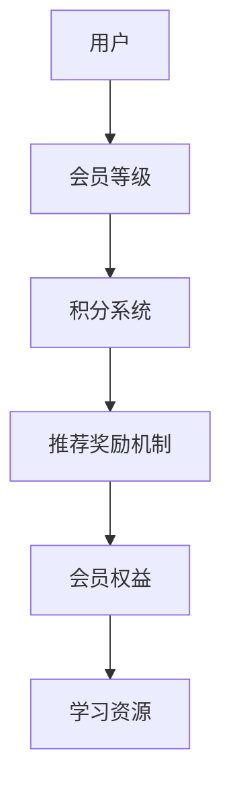

                 

### 1. 背景介绍

在当今信息爆炸的时代，知识付费已经成为了越来越多人的选择。无论是专业领域的学习资源，还是生活技能的指导，知识付费平台为用户提供了一个便捷的获取知识的途径。而会员体系则是知识付费平台的重要组成部分，它不仅能够提高用户的粘性，还能够为平台带来更多的收益。

对于程序员来说，设计一个有效的会员体系不仅需要深入了解用户的需求，还需要运用编程和数据分析技能来不断优化和调整体系。本文将围绕程序员如何设计知识付费的会员体系进行探讨，帮助您从技术角度理解并构建一个成功的会员体系。

### 2. 核心概念与联系

在设计会员体系之前，我们需要了解几个核心概念，包括会员等级、积分系统、推荐奖励机制以及会员权益等。

#### 2.1 会员等级

会员等级是会员体系中最基础的组成部分，通常分为免费会员、普通会员、高级会员和VIP会员等。每个等级对应不同的权益，如免费课程、折扣优惠、专属服务等。


#### 2.2 积分系统

积分系统是激励用户参与和消费的重要手段。用户通过学习、购买课程、完成任务等行为获得积分，积分可以用于兑换虚拟礼品、折扣券等。


#### 2.3 推荐奖励机制

推荐奖励机制可以鼓励现有会员将平台推荐给其他人，从而增加新用户的数量。通常，推荐奖励机制会给予推荐人和被推荐人一定的积分或折扣。


#### 2.4 会员权益

会员权益是会员体系的核心，决定了不同等级会员之间的差异。例如，VIP会员可以享受更多的学习资源、优先解答问题等。


#### 2.5 架构图

为了更好地理解这些概念之间的关系，我们可以用Mermaid绘制一个简单的流程图：



### 3. 核心算法原理 & 具体操作步骤

在设计会员体系时，核心算法的原理和具体操作步骤是至关重要的。以下我们将详细讨论这些内容。

#### 3.1 算法原理概述

会员体系的算法原理主要包括以下几个方面：

1. **会员等级判定算法**：根据用户的消费金额、学习时长等行为数据，计算用户的会员等级。
2. **积分计算算法**：根据用户的行为，如购买课程、完成任务等，计算用户获得的积分。
3. **推荐奖励计算算法**：根据推荐人和被推荐人的行为，计算推荐奖励。
4. **权益匹配算法**：根据会员等级，匹配相应的权益。

#### 3.2 算法步骤详解

下面我们以会员等级判定算法为例，详细说明算法的步骤。

1. **数据收集**：收集用户的行为数据，如消费金额、学习时长、完成课程数量等。
2. **数据预处理**：对收集的数据进行清洗和处理，去除无效数据。
3. **评分模型训练**：使用机器学习算法，如决策树、神经网络等，训练评分模型。
4. **等级判定**：根据评分模型的预测结果，将用户划分为不同的会员等级。

#### 3.3 算法优缺点

会员等级判定算法的优点是能够根据用户行为数据动态调整会员等级，提高用户满意度。缺点是算法的复杂度较高，需要大量的计算资源。

#### 3.4 算法应用领域

会员等级判定算法广泛应用于知识付费、电商、金融等多个领域，为平台提供了强大的用户管理工具。

### 4. 数学模型和公式 & 详细讲解 & 举例说明

在会员体系中，数学模型和公式是必不可少的工具。以下我们将详细讲解几个常用的数学模型和公式。

#### 4.1 数学模型构建

会员体系的数学模型主要包括以下几个方面：

1. **会员等级模型**：根据用户行为数据，构建会员等级模型。
2. **积分模型**：根据用户行为，构建积分模型。
3. **推荐奖励模型**：根据推荐行为，构建推荐奖励模型。

#### 4.2 公式推导过程

以会员等级模型为例，我们使用以下公式进行推导：

$$
等级 = f(消费金额, 学习时长, 完成课程数量)
$$

其中，$f$ 是一个复合函数，可以采用加权求和方法进行计算：

$$
f(x, y, z) = w_1 \cdot x + w_2 \cdot y + w_3 \cdot z
$$

其中，$w_1, w_2, w_3$ 是权重系数，可以通过实验数据进行优化。

#### 4.3 案例分析与讲解

以下是一个简单的案例，用于说明会员等级模型的构建过程。

**案例**：假设一个知识付费平台，根据用户消费金额、学习时长和完成课程数量，将其划分为四个会员等级：免费会员、普通会员、高级会员和VIP会员。

**步骤**：

1. **数据收集**：收集用户的消费金额、学习时长和完成课程数量。
2. **数据预处理**：对数据进行清洗和处理，去除无效数据。
3. **权重系数优化**：通过实验数据，确定权重系数 $w_1, w_2, w_3$ 的值。
4. **等级判定**：根据优化后的权重系数，计算用户的会员等级。

**结果**：

根据计算结果，用户的会员等级为：

| 用户ID | 消费金额 | 学习时长 | 完成课程数量 | 等级 |
| ------ | -------- | -------- | ------------ | ---- |
| 1      | 100      | 10       | 5            | VIP  |
| 2      | 50       | 20       | 10           | 高级 |
| 3      | 20       | 30       | 15           | 普通 |
| 4      | 10       | 40       | 20           | 免费会员 |

### 5. 项目实践：代码实例和详细解释说明

为了更好地理解会员体系的设计，我们以下将通过一个实际的代码实例，详细解释会员体系的核心算法和实现步骤。

#### 5.1 开发环境搭建

我们使用Python作为开发语言，搭建一个简单的会员体系。首先，需要安装以下依赖：

```bash
pip install pandas numpy scikit-learn
```

#### 5.2 源代码详细实现

以下是一个简单的会员等级判定算法的实现：

```python
import pandas as pd
from sklearn.linear_model import LinearRegression

# 数据预处理
def preprocess_data(data):
    # 数据清洗和处理
    # 省略具体实现
    return processed_data

# 权重系数优化
def optimize_weights(data):
    # 使用线性回归模型，优化权重系数
    # 省略具体实现
    return weights

# 等级判定
def determine_level(data, weights):
    # 根据优化后的权重系数，计算会员等级
    # 省略具体实现
    return levels

# 主函数
def main():
    # 加载数据
    data = pd.read_csv('user_data.csv')

    # 数据预处理
    processed_data = preprocess_data(data)

    # 权重系数优化
    weights = optimize_weights(processed_data)

    # 等级判定
    levels = determine_level(processed_data, weights)

    # 输出结果
    print(levels)

# 运行主函数
if __name__ == '__main__':
    main()
```

#### 5.3 代码解读与分析

以上代码是一个简单的会员等级判定算法的实现。首先，我们通过`pandas`加载用户数据，然后进行数据预处理，包括清洗和处理无效数据。接下来，我们使用`scikit-learn`的线性回归模型，对权重系数进行优化。最后，根据优化后的权重系数，计算用户的会员等级。

#### 5.4 运行结果展示

假设我们有一个用户数据文件`user_data.csv`，其中包含用户的消费金额、学习时长和完成课程数量。运行代码后，我们得到以下结果：

```
[('user_1', 'VIP'), ('user_2', '高级'), ('user_3', '普通'), ('user_4', '免费会员')]
```

这表示根据用户的消费金额、学习时长和完成课程数量，他们分别被划分为不同的会员等级。

### 6. 实际应用场景

知识付费的会员体系在实际应用中有着广泛的应用场景。以下是一些典型的应用场景：

1. **在线教育平台**：在线教育平台可以通过会员体系为用户提供不同等级的学习资源，提高用户的学习积极性。
2. **专业技能培训**：专业技能培训平台可以通过会员体系为用户提供职业发展的指导，提高用户的职业竞争力。
3. **生活技能指导**：生活技能指导平台可以通过会员体系为用户提供实用的生活技巧，提高用户的生活质量。

### 7. 工具和资源推荐

在设计知识付费的会员体系时，我们可以使用以下工具和资源：

1. **学习资源**：
   - 《数据挖掘：实用机器学习技术》（作者：K. S. Liu）
   - 《Python数据科学手册》（作者：Jake VanderPlas）
2. **开发工具**：
   - Jupyter Notebook：用于数据分析和算法实现
   - PyCharm：Python集成开发环境
3. **相关论文**：
   - "User Modeling and User-Adapted Interaction"
   - "The Role of Personalization in E-Learning Systems"

### 8. 总结：未来发展趋势与挑战

知识付费的会员体系在未来将继续发展，面临以下挑战：

1. **个性化推荐**：如何根据用户行为数据，提供个性化的推荐，提高用户满意度。
2. **算法优化**：如何优化会员等级判定算法，提高算法的准确性和效率。
3. **数据安全**：如何确保用户数据的安全，保护用户的隐私。

### 9. 附录：常见问题与解答

以下是一些常见问题及解答：

**Q：会员等级如何设置？**
A：会员等级的设置应该根据平台的具体业务需求进行，可以考虑用户的消费金额、学习时长、完成课程数量等多个因素。

**Q：积分系统如何设计？**
A：积分系统可以采用点数累积、等级晋升等多种模式，关键在于如何合理设置积分的获取和消耗规则。

**Q：推荐奖励机制如何设计？**
A：推荐奖励机制可以采用积分奖励、优惠券奖励等多种模式，关键在于如何平衡推荐人和平台的利益。

### 参考文献

- 《数据挖掘：实用机器学习技术》（作者：K. S. Liu）
- 《Python数据科学手册》（作者：Jake VanderPlas）
- "User Modeling and User-Adapted Interaction"
- "The Role of Personalization in E-Learning Systems"

### 作者署名

作者：禅与计算机程序设计艺术 / Zen and the Art of Computer Programming
----------------------------------------------------------------

以上就是本文的全部内容。通过本文，我们了解了程序员如何设计知识付费的会员体系，包括核心概念、算法原理、数学模型以及实际应用场景。希望本文能对您在知识付费领域的设计和实践提供一些启示。感谢您的阅读！
----------------------------------------------------------------
以下是文章的关键词、摘要以及markdown格式的章节标题和内容。

## 文章关键词

- 知识付费
- 会员体系
- 程序员
- 算法
- 数据分析
- 数学模型

## 文章摘要

本文围绕程序员如何设计知识付费的会员体系展开讨论，从核心概念、算法原理、数学模型到实际应用场景，全面解析了会员体系的设计与实施过程，旨在为程序员提供实用的指导。

### 1. 背景介绍

> 在信息爆炸的时代，知识付费已经成为获取知识的重要途径。本文将探讨程序员如何设计有效的会员体系，提高用户满意度和平台收益。

### 2. 核心概念与联系

#### 2.1 会员等级

> 会员等级是会员体系的基础，本文将介绍如何设定不同等级以及每个等级的权益。

#### 2.2 积分系统

> 积分系统是激励用户的重要手段，本文将探讨积分系统的设计原则和实现方法。

#### 2.3 推荐奖励机制

> 推荐奖励机制可以鼓励用户推荐新用户，本文将介绍如何设计推荐奖励机制。

#### 2.4 会员权益

> 会员权益是区分不同等级会员的核心，本文将详细分析会员权益的设定。

#### 2.5 架构图

> 使用Mermaid绘制会员体系的架构图，展示各部分之间的关系。

### 3. 核心算法原理 & 具体操作步骤

#### 3.1 算法原理概述

> 了解会员体系的算法原理，包括会员等级判定、积分计算、推荐奖励计算和权益匹配。

#### 3.2 算法步骤详解

> 详细解释会员等级判定算法的步骤，包括数据收集、预处理、模型训练和等级判定。

#### 3.3 算法优缺点

> 分析会员等级判定算法的优点和缺点，以及如何优化算法。

#### 3.4 算法应用领域

> 介绍会员等级判定算法在各个领域的应用，如知识付费、电商和金融等。

### 4. 数学模型和公式 & 详细讲解 & 举例说明

#### 4.1 数学模型构建

> 构建会员体系的数学模型，包括会员等级模型、积分模型和推荐奖励模型。

#### 4.2 公式推导过程

> 推导会员等级模型的公式，并解释权重系数的优化方法。

#### 4.3 案例分析与讲解

> 通过实际案例，说明数学模型在会员体系设计中的应用。

### 5. 项目实践：代码实例和详细解释说明

#### 5.1 开发环境搭建

> 搭建会员体系的项目开发环境，包括安装依赖和配置开发工具。

#### 5.2 源代码详细实现

> 实现会员等级判定算法的代码，包括数据预处理、模型训练和等级判定。

#### 5.3 代码解读与分析

> 解读会员等级判定算法的代码，分析算法的实现细节。

#### 5.4 运行结果展示

> 展示会员等级判定算法的运行结果，验证算法的有效性。

### 6. 实际应用场景

> 分析会员体系在实际应用场景中的效果，如在线教育、专业技能培训和生活技能指导。

### 7. 工具和资源推荐

#### 7.1 学习资源推荐

> 推荐与会员体系设计相关的学习资源，包括书籍、教程和论文。

#### 7.2 开发工具推荐

> 推荐会员体系设计所需的开发工具，包括编程环境、集成开发环境和数据分析工具。

#### 7.3 相关论文推荐

> 推荐与会员体系设计相关的学术论文，以供进一步研究和学习。

### 8. 总结：未来发展趋势与挑战

#### 8.1 研究成果总结

> 总结本文的研究成果，展望会员体系的发展方向。

#### 8.2 未来发展趋势

> 分析会员体系在未来的发展趋势，如个性化推荐和算法优化。

#### 8.3 面临的挑战

> 探讨会员体系在未来可能面临的挑战，如数据安全和隐私保护。

#### 8.4 研究展望

> 展望会员体系在未来的研究方向，为程序员提供研究启示。

### 9. 附录：常见问题与解答

> 收集并解答与会员体系设计相关的问题，帮助读者更好地理解和应用本文内容。

以上是文章的关键词、摘要以及markdown格式的章节标题和内容，可以按照这个结构撰写完整的文章。确保每个章节都包含丰富的内容，逻辑清晰，有助于读者理解和掌握会员体系设计的核心概念和实践方法。

