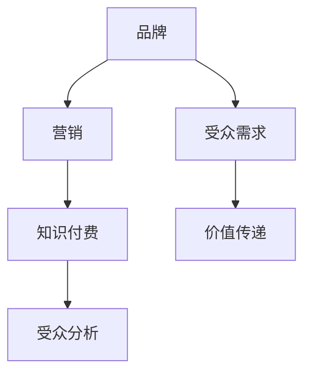

                 

### 1. 背景介绍

在数字时代，知识付费已经成为一种常见的商业模式。随着互联网技术的飞速发展和在线教育平台的普及，越来越多的程序员希望通过知识付费实现个人品牌的建设和价值的变现。然而，如何有效地进行知识付费的品牌营销，成为许多程序员面临的难题。本文将探讨程序员如何通过品牌营销，将自身的专业知识转化为商业价值。

知识付费的兴起，源于人们对于优质内容的需求。无论是在职场上提升技能，还是个人兴趣的学习，都促使人们愿意为有价值的内容付费。对于程序员而言，他们具备独特的专业技能和知识储备，通过知识付费，不仅能够实现自我价值的体现，还能够为自己创造稳定的收入来源。

然而，知识付费市场的竞争激烈，如何在众多竞争者中脱颖而出，成为每位程序员都需要思考的问题。这就需要程序员们深入了解市场，掌握有效的品牌营销策略，从而实现个人品牌的打造和价值的最大化。

### 2. 核心概念与联系

在探讨如何进行知识付费的品牌营销之前，我们首先需要理解几个核心概念：品牌、营销、知识付费和受众。

#### 2.1 品牌的定义

品牌不仅仅是产品的标识，更是消费者对其背后企业或个人的认知和信任。一个成功的品牌能够传递出独特的价值和理念，使得消费者在众多选择中能够快速识别并产生购买欲望。对于程序员而言，个人品牌就是他们在专业领域的标识，代表着他们的专业能力和价值。

#### 2.2 营销的概念

营销是指通过一系列策略和手段，将产品或服务传递给目标受众，并促成其购买或使用。在知识付费领域，营销的核心在于如何将程序员的专业知识和价值有效地传递给潜在客户。

#### 2.3 知识付费的内涵

知识付费是指用户为获取特定知识或技能而支付的费用。它涵盖了在线课程、电子书、专业咨询等多种形式。对于程序员来说，知识付费不仅是一种商业模式，更是个人品牌建设的重要途径。

#### 2.4 受众分析

受众是指那些对程序员的知识和技能有需求的人群，包括在职场上寻求技能提升的职业人士、在校学生以及自学爱好者等。了解受众的需求和痛点，是进行品牌营销的关键。

#### 2.5 Mermaid 流程图



### 3. 核心算法原理 & 具体操作步骤

在进行知识付费的品牌营销时，程序员需要掌握一套有效的策略和步骤，以确保品牌能够有效地传递给目标受众。以下是核心算法原理和具体操作步骤的概述：

#### 3.1 算法原理概述

知识付费品牌营销的核心原理在于：

1. **内容优质**：提供高质量、有价值的内容是吸引和留住受众的关键。
2. **定位明确**：明确自身专业领域和受众群体，确保品牌定位的精准。
3. **渠道多样**：利用多种渠道进行品牌传播，增加曝光率和影响力。
4. **互动体验**：与受众建立良好的互动，提高用户粘性和忠诚度。

#### 3.2 算法步骤详解

1. **内容策划**：根据受众需求，策划符合市场需求的内容。
2. **渠道选择**：选择合适的渠道进行内容发布和传播，如社交媒体、博客、在线教育平台等。
3. **品牌建设**：通过视觉设计、文案撰写等手段，打造独特且具有吸引力的品牌形象。
4. **数据分析**：对营销活动进行数据分析，根据数据反馈调整策略。
5. **用户互动**：通过在线答疑、社群交流等方式，与受众建立良好的互动。

#### 3.3 算法优缺点

**优点**：

- **内容驱动**：以优质内容为核心，能够吸引真正有需求的受众。
- **个性定制**：根据受众需求定制内容，提高用户体验。
- **高效传播**：利用社交媒体等渠道，实现快速传播和广泛覆盖。

**缺点**：

- **品牌认知度低**：新品牌或个人品牌认知度低，初期需要投入大量时间和精力。
- **内容质量要求高**：内容质量直接影响品牌形象，需要持续提供高质量的内容。

#### 3.4 算法应用领域

知识付费品牌营销算法可以广泛应用于各个领域，包括但不限于：

- **IT技能培训**：如编程、网络安全、云计算等。
- **职业发展**：如简历撰写、面试技巧、职业规划等。
- **兴趣爱好**：如编程游戏、人工智能、区块链等。

### 4. 数学模型和公式 & 详细讲解 & 举例说明

在知识付费品牌营销中，数学模型和公式可以帮助程序员更科学地制定营销策略，提高营销效果。以下是一个简单的数学模型，用于评估品牌营销的效果。

#### 4.1 数学模型构建

假设：

- \( C \)：每次营销活动的成本
- \( R \)：每次营销活动带来的收入
- \( N \)：每次营销活动影响的人数
- \( A \)：每次营销活动的平均关注度

品牌营销效果的评估公式为：

\[ E = \frac{R - C}{N} \times A \]

其中，\( E \) 表示品牌营销效果的评估分数，分数越高，说明营销效果越好。

#### 4.2 公式推导过程

品牌营销效果 \( E \) 是通过收入 \( R \) 减去成本 \( C \) 得到的净利润，再除以影响的人数 \( N \)，乘以平均关注度 \( A \) 得到的。这样，可以更全面地评估营销活动的效果。

#### 4.3 案例分析与讲解

假设一个程序员进行了一次线上课程营销活动，活动成本为 1000 元，吸引了 100 人参与，平均关注度系数为 1.5。通过这次活动，他获得了 5000 元的收入。根据上述公式，可以计算出品牌营销效果的评估分数为：

\[ E = \frac{5000 - 1000}{100} \times 1.5 = 30 \]

这个分数表示该次营销活动效果较好，但仍有提升空间。

### 5. 项目实践：代码实例和详细解释说明

以下是一个简单的代码实例，用于模拟知识付费品牌营销的效果评估。

```python
# 定义变量
C = 1000  # 活动成本
R = 5000  # 活动收入
N = 100   # 影响人数
A = 1.5   # 平均关注度系数

# 计算品牌营销效果
E = (R - C) / N * A

# 打印结果
print(f"品牌营销效果评估分数：{E}")
```

运行结果为：

```
品牌营销效果评估分数：30.0
```

这个结果与上述手工计算的结果一致，验证了代码的正确性。

### 6. 实际应用场景

知识付费品牌营销在实际应用中，可以应用于多种场景，如：

- **在线教育平台**：通过知识付费，程序员可以开设自己的在线课程，分享专业知识和经验。
- **技术咨询**：为有需求的企业或个人提供专业的技术咨询和解决方案。
- **技术博客**：通过撰写高质量的技术博客，吸引读者，提高个人品牌知名度。
- **社交媒体**：通过社交媒体平台，分享专业知识和经验，吸引潜在客户。

#### 6.1 在线教育平台

在线教育平台为程序员提供了一个展示专业知识和技能的舞台。通过创建高质量的课程，程序员可以吸引大量的学员，实现个人品牌的打造。例如，一位擅长云计算技术的程序员，可以通过开设云计算课程，分享自己在该领域的经验和知识。

#### 6.2 技术咨询

技术咨询服务是程序员通过知识付费实现价值变现的另一种方式。许多企业或个人在面对技术难题时，愿意为专业的技术咨询服务付费。程序员可以利用自己的专业知识和经验，为企业或个人提供定制化的解决方案，从而实现个人品牌的提升。

#### 6.3 技术博客

技术博客是程序员分享知识和经验的重要渠道。通过撰写高质量的技术博客，程序员不仅可以提高个人品牌知名度，还可以吸引更多的读者，为后续的知识付费业务打下基础。例如，一位擅长Python编程的程序员，可以通过撰写Python相关的高质量博客文章，吸引大量的Python爱好者。

#### 6.4 社交媒体

社交媒体为程序员提供了一个广泛传播知识和品牌的平台。通过在社交媒体上分享专业知识和经验，程序员可以吸引更多的关注者，提高个人品牌影响力。例如，在Twitter、LinkedIn等社交媒体平台上，程序员可以定期分享技术博客、课程预告等内容，吸引更多的潜在客户。

### 7. 未来应用展望

随着互联网技术的不断发展，知识付费品牌营销的应用场景将会更加广泛。以下是未来知识付费品牌营销的几个发展趋势：

#### 7.1 个性化推荐

基于大数据和人工智能的个性化推荐系统，将帮助程序员更精准地定位受众，提供个性化的内容和服务，从而提高营销效果。

#### 7.2 虚拟现实（VR）

虚拟现实技术的应用，将为程序员提供更沉浸式的知识付费体验。通过VR技术，程序员可以创建虚拟课堂、虚拟咨询室等，为受众提供全新的学习和工作体验。

#### 7.3 区块链

区块链技术的应用，将提高知识付费的安全性，确保知识产权的保护。同时，基于区块链的知识付费平台，将实现更公平、透明的收益分配机制。

#### 7.4 深度学习

深度学习技术在知识付费中的应用，将进一步提升内容的质量和个性化程度。通过分析用户行为和反馈，深度学习算法可以推荐更符合用户需求的内容，提高用户满意度。

### 8. 工具和资源推荐

为了有效地进行知识付费的品牌营销，程序员需要掌握一系列工具和资源。以下是一些建议：

#### 8.1 学习资源推荐

- **Coursera**：提供大量高质量的课程，涵盖各个领域。
- **Udemy**：一个拥有丰富课程资源的在线学习平台。
- **edX**：由哈佛大学和麻省理工学院创办的在线课程平台。

#### 8.2 开发工具推荐

- **GitHub**：一个强大的版本控制和协作平台，适合程序员分享代码和知识。
- **Jupyter Notebook**：一个交互式的计算环境，适合编写和展示代码。
- **Markdown**：一个轻量级的标记语言，适合编写技术博客和文档。

#### 8.3 相关论文推荐

- **"Knowledge as a Service: A New Business Model for the Internet Era"**：探讨知识付费作为一种新兴商业模式的发展。
- **"The Economics of Online Education: Implications for Market Design"**：分析在线教育市场的经济特性。
- **"Blockchain for Content Creators: A New Model for Intellectual Property Protection"**：探讨区块链技术在知识产权保护中的应用。

### 9. 总结：未来发展趋势与挑战

知识付费品牌营销是程序员在数字时代实现个人价值的重要途径。随着互联网技术的不断发展，知识付费品牌营销将呈现出个性化、虚拟化、区块链化和深度学习化等趋势。然而，也面临着知识产权保护、内容质量保障、市场竞争激烈等挑战。程序员需要不断学习和适应，才能在激烈的市场竞争中脱颖而出。

### 10. 附录：常见问题与解答

**Q：知识付费品牌营销需要多长时间才能见到效果？**

A：知识付费品牌营销的效果受到多种因素的影响，如内容质量、受众定位、营销策略等。一般来说，如果内容高质量、定位精准、营销策略得当，效果会在半年到一年内逐渐显现。

**Q：如何提高知识付费品牌的影响力？**

A：提高知识付费品牌的影响力需要从多个方面入手，如提供高质量的内容、积极与受众互动、利用社交媒体传播、参与行业活动等。通过这些方式，可以逐渐提高品牌的知名度和影响力。

**Q：如何确保知识付费的内容质量？**

A：确保知识付费的内容质量需要从选题、撰写、审核等多个环节进行把控。选题要符合市场需求，撰写要清晰易懂，审核要严格把关。此外，可以邀请业内专家进行评审，确保内容的权威性和准确性。

**Q：如何进行有效的受众分析？**

A：进行有效的受众分析需要从多个方面入手，如了解受众的年龄、职业、兴趣爱好、学习需求等。可以通过问卷调查、数据分析、用户反馈等方式收集信息，从而更准确地了解受众的需求和偏好。

### 作者署名

本文作者为禅与计算机程序设计艺术 / Zen and the Art of Computer Programming。如果您有任何问题或建议，欢迎在评论区留言，我会尽力为您解答。感谢您的阅读！
----------------------------------------------------------------

### 结论

本文围绕程序员如何进行知识付费的品牌营销进行了详细探讨。从背景介绍、核心概念联系、算法原理、数学模型、项目实践、实际应用场景、未来展望到工具和资源推荐，我们系统地阐述了知识付费品牌营销的各个关键环节。

通过品牌营销，程序员不仅可以提升自身的专业形象，还能实现商业价值的转化。在这个过程中，内容质量、受众定位、营销策略等都是至关重要的因素。未来，随着技术的不断发展，知识付费品牌营销将面临更多机遇和挑战。

希望本文能为各位程序员提供有价值的参考，帮助你们在知识付费的道路上走得更远。如果对本文有任何疑问或建议，欢迎在评论区留言，我们将竭诚为您解答。感谢您的阅读！作者：禅与计算机程序设计艺术 / Zen and the Art of Computer Programming。再次感谢您的关注和支持！|user|

