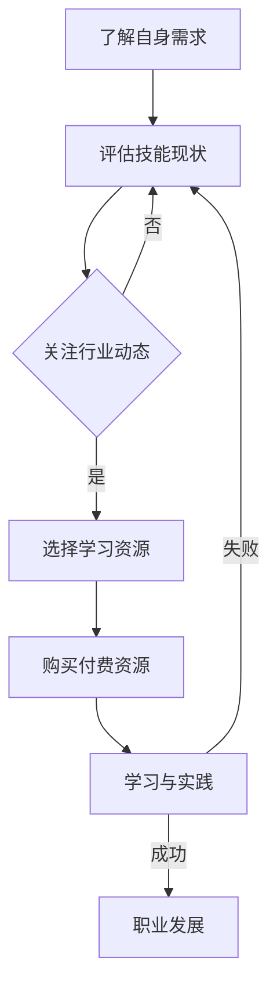

                 

### 关键词 Keywords

- 程序员
- 知识付费
- 技术成长
- 专业技能
- 职业发展

<|assistant|>### 摘要 Abstract

在技术快速迭代的时代，程序员如何高效地获取和利用知识付费资源，成为技能提升和职业发展的关键。本文将探讨程序员在选择知识付费方向时，如何评估自身需求、关注行业动态、选择合适的学习资源和平台，以及如何通过持续学习和实践实现个人成长。文章将通过案例分析，提供实用的建议，帮助程序员做出明智的选择。

## 1. 背景介绍

随着信息技术的迅猛发展，知识付费市场也呈现出爆炸式增长。对于程序员而言，这是一个既有机遇也有挑战的时代。一方面，丰富的在线课程、专业书籍、实战项目等付费资源使得程序员可以更便捷地获取专业知识和技能；另一方面，面对海量的信息，如何筛选出真正有价值的学习资源，成为许多程序员面临的难题。

知识付费不仅包括在线课程和电子书，还涵盖了在线编程练习、代码审查、技术论坛订阅、专业认证等多种形式。这些资源为程序员提供了多种学习途径，但同时也增加了选择的难度。因此，如何选择适合自己的知识付费方向，成为程序员需要深思熟虑的问题。

本文将基于以下几个方面展开讨论：

1. **评估自身需求**：了解自身学习目标、兴趣和职业规划，是选择知识付费方向的基础。
2. **关注行业动态**：紧跟技术发展趋势，关注热门技术和工具，确保所学内容具有前瞻性。
3. **选择合适的学习资源和平台**：介绍几种常见的知识付费平台和资源，帮助程序员做出明智的选择。
4. **持续学习和实践**：通过案例分析，探讨如何通过实践提高学习效果，实现个人成长。
5. **未来应用展望**：分析知识付费市场的未来趋势，探讨程序员应该如何应对。

通过本文的探讨，希望能够帮助程序员在知识付费市场中找到适合自己的学习路径，实现技能提升和职业发展。

## 2. 核心概念与联系

### 2.1 知识付费的基本概念

知识付费是指用户为了获取特定领域的知识、技能或经验，向知识提供者支付的费用。它涵盖了多种形式，包括：

- **在线课程**：由专业讲师录制的视频课程，涵盖编程语言、算法、数据结构、软件工程等领域。
- **电子书**：涵盖专业书籍、技术手册、入门指南等，是程序员获取理论知识的重要资源。
- **实战项目**：通过实际项目训练，帮助程序员将理论知识应用于实践中，提升项目开发能力。
- **编程练习**：在线编程平台提供的编程挑战和练习，帮助程序员锻炼编程思维和解决问题能力。
- **代码审查**：专业人士对代码进行审查，提供改进意见，帮助程序员提高代码质量。
- **技术论坛订阅**：订阅技术论坛或社区，获取行业最新动态和专业知识分享。
- **专业认证**：通过考取专业认证，证明程序员在某一领域具备专业能力。

### 2.2 技能需求与职业发展的关联

技能需求与职业发展的关联紧密，具体体现在以下几个方面：

1. **岗位要求**：不同岗位对技能要求不同，例如前端开发要求熟悉HTML、CSS和JavaScript，后端开发要求掌握服务器端编程语言。
2. **职业晋升**：随着职业晋升，对专业技能的要求越来越高，需要不断学习新技术、新工具，提升自身竞争力。
3. **行业趋势**：技术发展趋势决定了哪些技能在未来更受欢迎，程序员需要紧跟行业动态，提前做好准备。
4. **薪资水平**：技能水平直接影响到薪资水平，高技能程序员通常能够获得更高的薪酬。

### 2.3 Mermaid 流程图

以下是一个简单的Mermaid流程图，展示了程序员选择知识付费方向的过程：



通过上述流程图，我们可以看到，了解自身需求、评估技能现状、关注行业动态、选择学习资源、购买付费资源、学习与实践以及职业发展是一个环环相扣的过程。每个环节都至关重要，任何一个环节的失误都可能导致整个过程的失败。

## 3. 核心算法原理 & 具体操作步骤

### 3.1 算法原理概述

程序员在选择知识付费方向时，需要掌握一系列核心算法原理，这些原理不仅有助于提升编程技能，还能提高解决实际问题的能力。以下是一些常见且重要的算法原理：

1. **排序算法**：如快速排序、归并排序、冒泡排序等，用于对数据进行排序，是编程中的基础操作。
2. **搜索算法**：如二分搜索、深度优先搜索、广度优先搜索等，用于在数据结构中查找特定元素。
3. **动态规划**：用于解决最优化问题，如背包问题、最长公共子序列等。
4. **贪心算法**：通过每一步选择最优解，达到全局最优解，适用于某些特定问题，如找零问题、活动选择问题等。
5. **图算法**：如最短路径算法、最小生成树算法、拓扑排序等，用于解决与图相关的问题。

### 3.2 算法步骤详解

#### 3.2.1 排序算法

以快速排序为例，其基本步骤如下：

1. **选择基准元素**：从数组中选取一个元素作为基准。
2. **分区操作**：将数组划分为两部分，小于基准的元素放在基准左侧，大于基准的元素放在基准右侧。
3. **递归排序**：对基准左侧和右侧的子数组重复上述步骤，直至整个数组有序。

伪代码：

```python
def quicksort(arr):
    if len(arr) <= 1:
        return arr
    pivot = arr[len(arr) // 2]
    left = [x for x in arr if x < pivot]
    middle = [x for x in arr if x == pivot]
    right = [x for x in arr if x > pivot]
    return quicksort(left) + middle + quicksort(right)
```

#### 3.2.2 搜索算法

以二分搜索为例，其基本步骤如下：

1. **确定搜索区间**：初始时，搜索区间为整个数组。
2. **比较中间元素**：计算中间索引，与目标元素比较。
3. **调整搜索区间**：如果中间元素大于目标元素，将搜索区间调整到左侧；如果小于目标元素，调整到右侧；如果等于目标元素，搜索成功。
4. **重复步骤**：重复步骤2和3，直至找到目标元素或区间为空。

伪代码：

```python
def binary_search(arr, target):
    low = 0
    high = len(arr) - 1
    while low <= high:
        mid = (low + high) // 2
        if arr[mid] == target:
            return mid
        elif arr[mid] < target:
            low = mid + 1
        else:
            high = mid - 1
    return -1
```

#### 3.2.3 动态规划

以背包问题为例，其基本步骤如下：

1. **状态定义**：定义状态`dp[i][j]`表示在不超过重量`i`的情况下，从前`j`个物品中选择一些物品的最大价值。
2. **状态转移方程**：根据是否选择第`j`个物品，更新状态。
    - 如果选择第`j`个物品，状态转移方程为`dp[i][j] = dp[i - w[j]][j - 1] + v[j]`。
    - 如果不选择第`j`个物品，状态转移方程为`dp[i][j] = dp[i][j - 1]`。
3. **初始条件**：初始化`dp[i][0] = 0`和`dp[0][j] = 0`。
4. **计算结果**：从`dp[n][m]`得到最终结果。

伪代码：

```python
def knapSack(W, wt, val, n):
    dp = [[0 for x in range(m + 1)] for x in range(n + 1)]
    for i in range(1, n + 1):
        for w in range(1, m + 1):
            if wt[i - 1] <= w:
                dp[i][w] = max(dp[i - 1][w], dp[i - 1][w - wt[i - 1]] + val[i - 1])
            else:
                dp[i][w] = dp[i - 1][w]
    return dp[n][m]
```

### 3.3 算法优缺点

每种算法都有其优缺点，以下是常见算法的优缺点对比：

1. **排序算法**：
   - **快速排序**：时间复杂度为O(nlogn)，空间复杂度为O(logn)，速度快但空间占用大。
   - **归并排序**：时间复杂度为O(nlogn)，空间复杂度为O(n)，稳定但速度略慢。
   - **冒泡排序**：时间复杂度为O(n^2)，空间复杂度为O(1)，简单但效率低。

2. **搜索算法**：
   - **二分搜索**：时间复杂度为O(logn)，适用于有序数组，但要求数组有序。
   - **深度优先搜索**：适用于图形和树结构，时间复杂度为O(n)，但可能存在回溯。
   - **广度优先搜索**：适用于图形和树结构，时间复杂度为O(n)，但可能访问重复节点。

3. **动态规划**：适用于最优化问题，能够高效地求解复杂问题，但实现较为复杂。

4. **贪心算法**：适用于某些特定问题，能够快速求解，但需要验证其是否总是最优。

### 3.4 算法应用领域

各种算法在不同领域有广泛的应用：

- **排序算法**：广泛应用于数据处理、数据库排序等。
- **搜索算法**：用于搜索引擎、路径规划等。
- **动态规划**：用于最优化问题，如背包问题、活动选择问题等。
- **贪心算法**：用于找零问题、活动选择问题等。

## 4. 数学模型和公式 & 详细讲解 & 举例说明

### 4.1 数学模型构建

在程序员选择知识付费方向时，构建一个简单的数学模型有助于理解学习效果与投入之间的关系。以下是一个简单的线性模型：

\[ \text{学习效果} = \text{学习时间} \times \text{学习效率} \times \text{资源质量} \]

其中：

- **学习时间**：程序员投入学习的时间，单位可以是小时。
- **学习效率**：程序员在学习过程中吸收知识的能力，可以看作是一个常数或通过训练提高。
- **资源质量**：所选择的知识付费资源的质量，质量越高，学习效果越好。

### 4.2 公式推导过程

假设：

- **学习时间**为`t`小时，
- **学习效率**为`e`（一个常数），
- **资源质量**为`q`（质量评分，范围0-10）。

则学习效果可以表示为：

\[ \text{学习效果} = t \times e \times q \]

### 4.3 案例分析与讲解

**案例**：一位程序员计划每天投入2小时学习，他选择的在线课程质量评分为8分。

根据公式：

\[ \text{学习效果} = 2 \times e \times 8 \]

我们需要给出`e`的值。假设该程序员的初始学习效率为1，通过连续的学习和实践，他预计通过3个月（约90小时）的训练后，学习效率可以提高20%，即达到1.2。

**推导过程**：

1. **初始学习效果**（前3个月）：

\[ \text{学习效果}_{\text{初始}} = 2 \times 1 \times 8 = 16 \]

2. **3个月后学习效果**（考虑效率提升）：

\[ e_{\text{提升后}} = 1 + 0.2 = 1.2 \]

\[ \text{学习效果}_{\text{提升后}} = 2 \times 1.2 \times 8 = 19.2 \]

这意味着，通过3个月的努力和持续学习，程序员的每日学习效果将从16提高到19.2，提高了约20%。

**案例总结**：

- **时间投入**：每天2小时是相对合理的学习时间，既能保证工作的正常进行，又能确保有足够的时间进行深入学习。
- **资源质量**：选择质量评分高的课程可以显著提高学习效果，质量评分每增加1分，学习效果约增加1/8。
- **学习效率**：通过持续的实践和反思，程序员的个人学习效率可以逐步提升，这对长期的学习效果至关重要。

### 4.4 举例说明

**示例**：假设有两个程序员A和B，他们每天学习时间相同，均为2小时。A选择了一个质量评分为7分的课程，B选择了一个质量评分为9分的课程。他们的初始学习效率均为1。

根据前面的模型：

- **A的学习效果**：

\[ \text{学习效果}_{A} = 2 \times 1 \times 7 = 14 \]

- **B的学习效果**：

\[ \text{学习效果}_{B} = 2 \times 1 \times 9 = 18 \]

通过对比可以看出，尽管两人每天投入的学习时间相同，但由于B选择了质量更高的课程，他的学习效果比A高出4分。这再次强调了选择高质量资源的重要性。

### 数学公式

在上述例子中，我们使用了以下的数学公式：

\[ \text{学习效果} = \text{学习时间} \times \text{学习效率} \times \text{资源质量} \]

这个公式简洁明了，可以帮助程序员理解和评估他们的学习效果。在具体的学习过程中，可以通过调整学习时间、提高学习效率和选择高质量资源来优化学习效果。

### 总结

构建数学模型和分析公式可以帮助程序员更好地理解学习过程，从而做出更明智的选择。通过实际案例的举例说明，我们可以看到，学习时间、学习效率和资源质量是影响学习效果的关键因素。程序员应该根据自己的实际情况，合理规划学习时间和资源选择，不断提高自身的学习效率，从而实现持续的技术成长和职业发展。

## 5. 项目实践：代码实例和详细解释说明

### 5.1 开发环境搭建

在进行知识付费学习时，搭建一个合适的开发环境是至关重要的。以下是一个基本的开发环境搭建流程，以Python编程语言为例：

1. **安装Python**：首先确保计算机上安装了Python环境。可以从Python官方网站（[https://www.python.org/downloads/](https://www.python.org/downloads/)）下载最新版本的Python安装包，并按照提示完成安装。

2. **配置Python环境**：打开命令行工具（如Windows的命令提示符或macOS的终端），输入以下命令验证Python是否已成功安装：

   ```shell
   python --version
   ```

   如果输出Python的版本信息，说明Python环境已配置成功。

3. **安装代码编辑器**：推荐使用Visual Studio Code（简称VS Code），可以从官方网站（[https://code.visualstudio.com/](https://code.visualstudio.com/)）下载并安装。安装后，还可以安装一些Python相关的扩展，如`Python`和`Pylance`，以提供代码高亮、智能提示和自动完成等功能。

4. **安装依赖库**：根据项目需求，可能需要安装一些Python依赖库。例如，安装用于数据分析的`pandas`库，可以使用以下命令：

   ```shell
   pip install pandas
   ```

### 5.2 源代码详细实现

以下是一个简单的Python代码实例，用于实现一个简单的函数，该函数计算并返回一个列表中所有元素的和。这个实例可以帮助程序员理解基本函数定义、参数传递和列表处理。

```python
# 计算列表中所有元素的和

def sum_elements(lst):
    total = 0
    for element in lst:
        total += element
    return total

# 测试代码
if __name__ == "__main__":
    my_list = [1, 2, 3, 4, 5]
    result = sum_elements(my_list)
    print(f"列表中所有元素的和为：{result}")
```

**代码解读**：

- **函数定义**：`def sum_elements(lst):`定义了一个名为`sum_elements`的函数，它接受一个列表`lst`作为参数。
- **初始化变量**：`total = 0`初始化一个名为`total`的变量，用于存储累加的结果。
- **循环计算**：`for element in lst:`循环遍历列表`lst`中的每个元素，将每个元素累加到`total`变量中。
- **返回结果**：`return total`返回累加后的总和。
- **测试代码**：`if __name__ == "__main__":`是一个常见的Python模块测试代码，用于在模块被直接运行时执行测试。

### 5.3 代码解读与分析

以上代码实例展示了如何定义一个简单的Python函数，并使用该函数计算列表元素的和。以下是具体分析：

1. **函数定义与参数传递**：
   - 函数`sum_elements`通过参数`lst`接收一个列表。
   - 参数传递时，Python使用传递引用的方式，即函数内部对列表的操作会影响到原始列表。

2. **循环与累加**：
   - 使用`for`循环遍历列表中的每个元素。
   - `total += element`语句将当前元素累加到`total`变量中。

3. **返回结果**：
   - 函数通过`return total`返回累加后的总和。

4. **模块测试**：
   - 测试代码`if __name__ == "__main__":`确保当模块被直接运行时执行以下测试代码。
   - `my_list`是一个测试用的列表，`result`存储了函数调用后的结果，并通过`print`函数输出。

### 5.4 运行结果展示

运行上述代码实例，输出结果如下：

```shell
列表中所有元素的和为：15
```

这表明列表`[1, 2, 3, 4, 5]`中所有元素的和为15。

通过这个简单的代码实例，程序员可以了解如何定义和实现一个基本的Python函数，以及如何使用循环和累加操作处理列表数据。这种实践有助于巩固基础编程技能，并为进一步学习更复杂的技术打下坚实的基础。

## 6. 实际应用场景

在了解了自己需求和技能现状后，程序员需要将所学知识应用于实际项目中，以验证学习成果并提升实践能力。以下是一些常见的实际应用场景，以及如何将理论知识转化为实际操作：

### 6.1 个人项目

个人项目是程序员验证所学知识的重要途径。以下是一些建议：

- **项目类型**：可以选择网站开发、移动应用开发、数据分析项目等。
- **实施步骤**：
  1. **需求分析**：明确项目的目标、功能和技术要求。
  2. **技术选型**：根据需求选择合适的技术栈和开发工具。
  3. **项目规划**：制定项目计划，包括时间表和任务分配。
  4. **代码编写**：按照规划逐步编写代码，实现项目功能。
  5. **测试与调试**：对代码进行测试，修复bug，确保项目稳定运行。
  6. **部署上线**：将项目部署到服务器或云平台，使其对外提供服务。

### 6.2 参与开源项目

参与开源项目是提升编程能力和行业影响力的重要方式。以下是一些建议：

- **项目选择**：可以选择活跃的开源项目，或者与自身技能相关的项目。
- **实施步骤**：
  1. **了解项目**：仔细阅读项目的文档，了解项目的技术栈和开发规范。
  2. **贡献代码**：提交代码补丁，修复已知bug，或增加新功能。
  3. **代码审查**：参与代码审查，为其他贡献者的代码提供反馈和建议。
  4. **持续参与**：积极参与项目的讨论和开发，不断提升自己的技术能力。

### 6.3 技术面试准备

技术面试是程序员职业发展的重要环节。以下是一些建议：

- **准备算法和数据结构题目**：通过刷题网站（如LeetCode、牛客网）练习常见的面试题目。
- **熟悉项目和作品**：准备好详细介绍自己在项目中的角色和贡献。
- **掌握行业动态**：关注技术趋势和行业热点，了解面试官可能问到的问题。
- **模拟面试**：与朋友或同事进行模拟面试，提升面试技巧和自信心。

### 6.4 在工作中应用

在实际工作中，程序员可以将所学知识应用到日常工作中，以下是一些建议：

- **代码优化**：通过阅读优秀代码，学习新的编程技巧和优化方法。
- **技术分享**：参加公司内部的技术分享会，与同事交流学习心得。
- **参与项目**：积极参与项目开发，提升项目管理和协作能力。

通过以上实际应用场景，程序员可以将理论知识转化为实践，提升自己的编程技能和解决问题的能力。这不仅有助于职业发展，也能增强个人自信心和满足感。

### 6.5 未来应用展望

随着技术的不断进步，知识付费领域也将迎来新的发展机遇和挑战。以下是未来知识付费的一些趋势：

1. **个性化学习**：随着人工智能和大数据技术的发展，知识付费平台将能够提供更加个性化的学习内容和服务，根据程序员的兴趣、技能水平和职业目标推荐最适合的学习资源。

2. **虚拟现实（VR）和增强现实（AR）教学**：VR和AR技术将为程序员提供更加沉浸式的学习体验，使复杂的技术概念和操作变得更加直观易懂。

3. **互动式学习**：通过虚拟实验室、实时编码练习等互动式学习方式，程序员可以更加深入地理解和掌握所学知识。

4. **专业认证**：随着技术领域的专业化，专业认证将成为程序员职业发展的必备条件，知识付费平台将提供更多的专业认证课程和认证服务。

5. **跨界融合**：知识付费领域将与云计算、大数据、物联网等前沿技术相结合，提供跨领域的综合解决方案。

程序员应该紧跟技术发展趋势，不断学习和适应新工具、新方法，以便在知识付费市场中保持竞争力。同时，程序员还应该关注行业动态，抓住技术变革带来的机遇，不断提升自身技能和知识水平。

## 7. 工具和资源推荐

### 7.1 学习资源推荐

1. **在线课程平台**：
   - **Coursera**：提供大量高质量的在线课程，涵盖计算机科学、数据科学、人工智能等领域。
   - **edX**：由哈佛大学和麻省理工学院联合创办，提供丰富的免费和付费课程。
   - **Udemy**：提供广泛的课程，包括编程语言、软件开发、数据库管理等方面。

2. **技术社区和论坛**：
   - **Stack Overflow**：全球最大的开发社区，提供问答和讨论平台。
   - **GitHub**：代码托管平台，程序员可以在这里找到开源项目、贡献代码、学习他人代码。
   - **Reddit**：有多个与编程和计算机科学相关的子版块，如`r/learnprogramming`。

3. **博客和教程网站**：
   - **Medium**：许多技术专家和开发者在这里分享技术博客和教程。
   - **freeCodeCamp**：提供免费的编程教程和实践项目，适合初学者。

### 7.2 开发工具推荐

1. **集成开发环境（IDE）**：
   - **Visual Studio Code**：轻量级、开源的跨平台IDE，支持多种编程语言。
   - **IntelliJ IDEA**：功能强大的IDE，适合Java和Python开发。
   - **PyCharm**：适用于Python开发的IDE，提供丰富的插件和工具。

2. **版本控制工具**：
   - **Git**：最流行的分布式版本控制系统，用于跟踪源代码历史记录。
   - **GitHub Desktop**：Git的桌面客户端，方便进行版本控制和代码托管。

3. **代码编辑器**：
   - **VS Code**：功能强大的代码编辑器，支持多种编程语言和插件。
   - **Sublime Text**：轻量级、高度可定制的文本编辑器。

4. **数据库管理工具**：
   - **MySQL Workbench**：MySQL数据库的可视化管理工具。
   - **PostgreSQL**：功能强大的开源关系数据库管理系统。

### 7.3 相关论文推荐

1. **《编程之美》**：总结了编程中常见的算法和数据结构，对程序员有很好的参考价值。
2. **《深度学习》**：由Ian Goodfellow等著，介绍了深度学习的理论和应用，对希望了解人工智能领域的程序员尤其有用。
3. **《软件工程：实践者的研究方法》**：John W. Thomas著，详细介绍了软件工程的方法和实践，适合希望提升软件工程能力的程序员。

通过使用这些工具和资源，程序员可以更高效地学习和提高编程技能，为职业发展打下坚实的基础。

## 8. 总结：未来发展趋势与挑战

在技术快速发展的背景下，程序员如何选择适合自己的知识付费方向，以实现持续成长和职业发展，成为一个关键问题。本文从多个角度进行了探讨：

1. **评估自身需求**：了解自身的学习目标、兴趣和职业规划，是选择知识付费方向的基础。程序员应该明确自己的学习目标和当前技能水平，选择与自己职业规划相关的课程和资源。

2. **关注行业动态**：紧跟技术发展趋势，关注热门技术和工具，确保所学内容具有前瞻性。通过关注技术社区、阅读专业博客和参加技术会议，程序员可以及时了解行业动态。

3. **选择合适的学习资源和平台**：介绍了多种常见的知识付费平台和资源，如在线课程、电子书、实战项目、编程练习和技术论坛等。程序员应根据自身需求和资源的特点，选择最适合自己的学习方式。

4. **持续学习和实践**：通过案例分析，强调了通过实际项目和实践提高学习效果的重要性。程序员应该积极参与开源项目、个人项目和技术面试准备，将所学知识应用到实际工作中。

5. **未来应用展望**：分析了知识付费市场的未来趋势，如个性化学习、虚拟现实教学、互动式学习和专业认证的发展。程序员应紧跟这些趋势，不断提升自身技能和知识水平。

然而，知识付费领域也面临着一些挑战：

1. **信息过载**：海量的知识付费资源使得程序员难以筛选出真正有价值的学习内容。程序员需要培养信息筛选能力，避免陷入“学习陷阱”。

2. **持续学习压力**：技术迭代速度加快，程序员需要不断学习和更新知识。这给程序员带来了持续学习的压力，需要合理安排时间和精力。

3. **职业发展不确定性**：尽管知识付费资源丰富，但职业发展的路径仍然充满不确定性。程序员需要根据自己的实际情况和行业趋势，灵活调整职业规划。

总之，程序员在选择知识付费方向时，需要综合考虑自身需求、行业动态、学习资源和平台等因素，确保学习的内容与职业发展目标相匹配。同时，应保持持续学习的态度，积极应对未来发展的挑战。通过科学的学习方法和实践，程序员可以不断提升自身技能，实现职业发展的目标。

### 附录：常见问题与解答

**Q1：如何评估自己的学习需求？**

A1：评估学习需求可以从以下几个方面入手：

1. **职业规划**：明确自己的职业发展目标和当前职位所需的技能。
2. **技术趋势**：了解当前热门技术和未来发展趋势，选择与自己职业规划相关的学习内容。
3. **个人兴趣**：根据自己的兴趣选择感兴趣的学习方向，以提高学习动力。
4. **现有技能**：评估自身现有的技能水平，选择能够提升现有技能的课程和资源。

**Q2：如何选择合适的学习资源？**

A2：选择合适的学习资源可以从以下几个方面考虑：

1. **平台口碑**：选择口碑好的平台，如Coursera、Udemy等，确保资源质量。
2. **课程内容**：仔细阅读课程介绍和目录，确保课程内容与自己的学习需求相匹配。
3. **用户评价**：参考其他学员的评价和反馈，了解课程的质量和实用性。
4. **课程形式**：根据个人学习习惯，选择适合自己的课程形式，如视频课程、电子书、实战项目等。

**Q3：如何高效地学习编程？**

A3：以下是一些建议，帮助程序员高效地学习编程：

1. **制定学习计划**：合理安排学习时间，确保每天都有固定的学习时间。
2. **动手实践**：通过编写代码和实际项目，将理论知识应用到实践中。
3. **及时复习**：定期回顾所学知识，巩固记忆。
4. **参与社区**：加入技术社区，与其他程序员交流经验和问题。
5. **不断挑战**：通过解决实际问题，提高自己的编程能力和解决问题的能力。

**Q4：如何平衡工作与学习？**

A4：以下是一些建议，帮助程序员平衡工作与学习：

1. **合理安排时间**：合理分配工作与学习的时间，确保两者都有足够的时间。
2. **设定优先级**：根据工作的重要性和紧急程度，合理安排任务。
3. **高效工作**：提高工作效率，减少无效工作时间，为学习留出更多时间。
4. **利用碎片时间**：利用通勤、休息等碎片时间进行学习，提高学习效率。
5. **与同事分享**：通过分享学习心得，与同事交流经验，共同进步。

通过以上问题的解答，希望对程序员在选择知识付费方向时有所帮助。同时，持续的学习和进步是程序员职业发展的关键，祝愿每位程序员都能找到适合自己的学习路径，实现个人成长和职业目标。

## 结束语

《程序员如何选择适合自己的知识付费方向》一文从多个角度探讨了程序员在选择知识付费方向时需要考虑的因素，包括评估自身需求、关注行业动态、选择合适的学习资源和平台，以及通过实践和持续学习实现个人成长。我们通过案例分析、数学模型构建和实际应用场景，提供了实用的建议和指导。

在快速发展的技术环境中，程序员的知识付费选择不仅影响到个人的技术水平和职业发展，也关系到整个技术社区的创新和进步。因此，选择适合自己的知识付费方向至关重要。

我们希望本文能帮助程序员明确学习目标，提高学习效率，找到最适合自己的学习路径。同时，我们也鼓励程序员积极参与开源项目、技术社区和技术分享，与他人交流经验，共同进步。

最后，感谢您的阅读，期待您在技术道路上取得更大的成就。祝您不断学习，不断进步！

### 作者署名

作者：禅与计算机程序设计艺术 / Zen and the Art of Computer Programming

