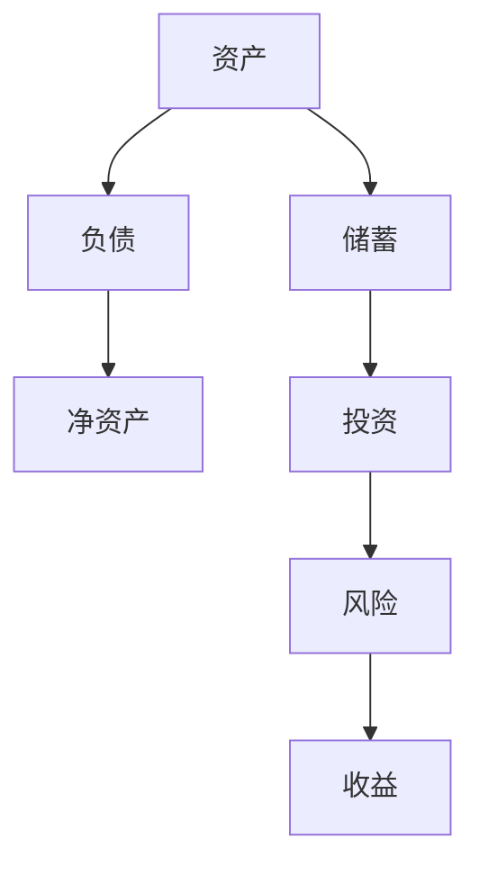

                 

关键词：理财、程序员、财务规划、投资策略、风险控制、收益最大化

> 摘要：本文针对程序员这一特定群体，分析了他们在理财过程中常见的误区，提供了实用的理财建议，帮助程序员实现财务自由，提高生活质量。

## 1. 背景介绍

程序员，作为当今数字化时代的核心力量，他们的收入普遍较高，但同时也面临着独特的财务挑战。由于工作繁忙、专业知识积累，他们在理财方面往往存在认知偏差，容易陷入一些常见的误区。这些误区不仅影响他们的财务状况，还可能对他们的生活质量产生负面影响。因此，帮助程序员认清并避免这些理财误区，对于他们的个人发展和职业规划具有重要意义。

本文将从以下几个方面展开讨论：

1. **程序员常见的理财误区**：包括消费观念、投资策略、储蓄习惯等方面的误区。
2. **理财误区背后的原因**：分析程序员为何容易陷入这些误区。
3. **如何避免理财误区**：提供实用的理财建议和策略。
4. **理财工具和资源的推荐**：介绍一些适合程序员的理财工具和资源。
5. **总结与展望**：对程序员理财的未来发展趋势和挑战进行探讨。

## 2. 核心概念与联系

为了更好地理解理财，我们需要先明确一些核心概念，包括资产、负债、储蓄、投资等。以下是这些概念之间的关系及其在理财中的重要性。

### 2.1 资产与负债

**资产**：指能够为持有人带来经济利益的资源，如现金、股票、房产等。  
**负债**：指持有人需要在未来偿还的债务，如贷款、信用卡欠款等。

**核心关系**：资产与负债的差额称为净资产，它是衡量个人财务状况的重要指标。理财的目标之一就是增加净资产。

### 2.2 储蓄与投资

**储蓄**：指将资金存放在银行或其他金融机构，以备不时之需。  
**投资**：指将资金投入到不同的金融产品或项目，以期望获得长期的回报。

**核心关系**：储蓄和投资是理财的两个重要组成部分。储蓄提供短期资金保障，投资则为长期财富积累提供可能。

### 2.3 风险与收益

**风险**：指投资可能面临的损失。  
**收益**：指投资带来的回报。

**核心关系**：投资收益通常与风险成正比。高风险的投资可能带来高收益，但也可能导致损失。理财需要平衡风险与收益，选择适合自己的投资策略。

### 2.4 Mermaid 流程图

下面是一个简单的 Mermaid 流程图，展示了资产、负债、储蓄、投资以及风险与收益之间的关系。



## 3. 核心算法原理 & 具体操作步骤

### 3.1 算法原理概述

理财的核心算法可以概括为以下几个步骤：

1. **财务规划**：确定理财目标，评估当前的财务状况，制定可行的理财计划。
2. **资产配置**：根据理财目标和个人风险承受能力，合理分配资产到不同的投资领域。
3. **定期复盘**：定期检查理财计划的实际执行情况，根据市场变化和个人情况调整策略。

### 3.2 算法步骤详解

1. **财务规划**
   - **确定理财目标**：如购房、子女教育、退休规划等。
   - **评估当前财务状况**：包括收入、支出、储蓄、投资等。
   - **制定理财计划**：根据目标和现状，设定具体的储蓄和投资计划。

2. **资产配置**
   - **确定个人风险承受能力**：通过风险评估问卷等方式，了解自己的风险偏好。
   - **分配资产**：根据风险承受能力和理财目标，将资产分配到股票、债券、基金、房产等不同领域。

3. **定期复盘**
   - **检查理财计划执行情况**：定期评估储蓄和投资的实际进展。
   - **调整策略**：根据市场变化和个人情况，适时调整投资组合。

### 3.3 算法优缺点

**优点**：
- 系统性：通过财务规划、资产配置和定期复盘，形成了一套完整的理财流程。
- 适应性：可以根据个人情况和市场变化，灵活调整理财策略。

**缺点**：
- 复杂性：涉及多个环节，需要一定的专业知识和时间投入。
- 风险：无法完全消除投资风险，需要承担一定的市场波动。

### 3.4 算法应用领域

该算法适用于所有有一定财务基础的投资者，尤其适合程序员这一群体。程序员通常具备较强的逻辑思维能力和计算机技能，能够理解和执行复杂的理财策略。

## 4. 数学模型和公式 & 详细讲解 & 举例说明

### 4.1 数学模型构建

理财中的数学模型主要涉及以下几个方面的公式：

1. **复利计算**：
   - 年化收益率：\( r \)
   - 初始投资金额：\( P \)
   - 投资年限：\( t \)
   - 复利公式：\( A = P \times (1 + r)^t \)

2. **投资回报率**：
   - 投资回报率：\( R = \frac{A - P}{P} \times 100\% \)

3. **储蓄计算**：
   - 月储蓄金额：\( S \)
   - 年化储蓄金额：\( S_{annual} = S \times 12 \)
   - 储蓄年限：\( t \)
   - 储蓄总额：\( A_{save} = S_{annual} \times (1 + r)^t - S \times 12 \)

### 4.2 公式推导过程

**复利计算**：
- 复利是指每一期的利息都加入到本金中，作为下一期的本金计算利息。
- 第一年的利息为 \( P \times r \)，第二年的利息为 \( (P + P \times r) \times r = P \times (1 + r) \times r \)。
- 以此类推，第 \( t \) 年的利息为 \( P \times (1 + r)^t - P \)。
- 因此，总金额 \( A \) 为 \( P + P \times r + P \times (1 + r) \times r + \ldots + P \times (1 + r)^t - P \)。

**投资回报率**：
- 投资回报率是指投资带来的收益与投资额的比值。
- 投资总额 \( A \) 为 \( P \times (1 + r)^t \)，投资收益为 \( A - P \)。
- 投资回报率 \( R \) 为 \( \frac{A - P}{P} \times 100\% \)。

**储蓄计算**：
- 每月储蓄金额 \( S \) 加上利息形成的总金额为 \( S \times 12 \times (1 + r) \)。
- 利息总额为 \( S \times 12 \times (1 + r)^t - S \times 12 \)。
- 储蓄总额 \( A_{save} \) 为 \( S \times 12 \times (1 + r)^t - S \times 12 \)。

### 4.3 案例分析与讲解

假设一个程序员计划每年投资 10 万元，年化收益率为 5%，投资 10 年。我们需要计算 10 年后的投资总额以及投资回报率。

**复利计算**：
- 年化收益率 \( r = 5\% = 0.05 \)
- 初始投资金额 \( P = 10 万元 \)
- 投资年限 \( t = 10 年 \)
- 复利公式 \( A = P \times (1 + r)^t \)
- \( A = 10 万元 \times (1 + 0.05)^{10} = 10 万元 \times 1.6289 = 16.289 万元 \)

**投资回报率**：
- 投资总额 \( A = 16.289 万元 \)
- 投资回报率 \( R = \frac{A - P}{P} \times 100\% \)
- \( R = \frac{16.289 万元 - 10 万元}{10 万元} \times 100\% = 62.89\% \)

**储蓄计算**：
- 每月储蓄金额 \( S = 10 万元 / 12 = 8333.33 元 \)
- 年化储蓄金额 \( S_{annual} = S \times 12 = 8333.33 元 \times 12 = 10 万元 \)
- 储蓄年限 \( t = 10 年 \)
- 复利公式 \( A_{save} = S_{annual} \times (1 + r)^t - S \times 12 \)
- \( A_{save} = 10 万元 \times (1 + 0.05)^{10} - 10 万元 = 62890 元 \)

通过以上计算，我们可以看到，该程序员通过复利效应，在 10 年后实现了资产翻倍，并且投资回报率高达 62.89%。这充分说明了理财规划的重要性。

## 5. 项目实践：代码实例和详细解释说明

### 5.1 开发环境搭建

为了演示复利计算和投资回报率计算，我们将使用 Python 语言编写代码。以下是开发环境搭建的简要步骤：

1. 安装 Python 解释器：从 [Python 官网](https://www.python.org/)下载并安装 Python 3.x 版本。
2. 配置代码编辑器：推荐使用 PyCharm、Visual Studio Code 等编程工具。
3. 安装必要的库：使用以下命令安装 `matplotlib` 和 `numpy`：

   ```shell
   pip install matplotlib numpy
   ```

### 5.2 源代码详细实现

以下是实现复利计算和投资回报率的 Python 代码：

```python
import numpy as np
import matplotlib.pyplot as plt

# 复利计算
def compound_interest(principal, annual_rate, years):
    amount = principal * (1 + annual_rate) ** years
    return amount

# 投资回报率计算
def investment_return_rate(principal, amount):
    return_rate = (amount - principal) / principal * 100
    return return_rate

# 储蓄计算
def savings(principal, monthly_payment, annual_rate, years):
    total_amount = principal
    for year in range(1, years + 1):
        for month in range(1, 13):
            payment = monthly_payment
            total_amount += payment * (1 + annual_rate) ** (year + months - 1)
    return total_amount

# 主函数
def main():
    # 初始化参数
    principal = 100000  # 初始投资金额（元）
    annual_rate = 0.05  # 年化收益率
    years = 10  # 投资年限
    monthly_payment = 10000  # 每月储蓄金额（元）

    # 复利计算
    amount = compound_interest(principal, annual_rate, years)
    return_rate = investment_return_rate(principal, amount)
    savings_amount = savings(principal, monthly_payment, annual_rate, years)

    # 输出结果
    print(f"投资总额（复利）：{amount:.2f} 元")
    print(f"投资回报率：{return_rate:.2f}%")
    print(f"储蓄总额：{savings_amount:.2f} 元")

    # 绘图
    years_range = np.arange(1, years + 1)
    compound_interests = [compound_interest(principal, annual_rate, year) for year in years_range]
    savings_amounts = [savings(principal, monthly_payment, annual_rate, year) for year in years_range]

    plt.plot(years_range, compound_interests, label="复利总额")
    plt.plot(years_range, savings_amounts, label="储蓄总额")
    plt.xlabel("投资年限")
    plt.ylabel("金额（元）")
    plt.legend()
    plt.show()

# 运行主函数
if __name__ == "__main__":
    main()
```

### 5.3 代码解读与分析

1. **复利计算函数**：
   - `compound_interest` 函数用于计算复利总额。
   - 参数 `principal` 表示初始投资金额，`annual_rate` 表示年化收益率，`years` 表示投资年限。
   - 返回值为投资总额。

2. **投资回报率计算函数**：
   - `investment_return_rate` 函数用于计算投资回报率。
   - 参数 `principal` 表示初始投资金额，`amount` 表示投资总额。
   - 返回值为投资回报率。

3. **储蓄计算函数**：
   - `savings` 函数用于计算储蓄总额。
   - 参数 `principal` 表示初始投资金额，`monthly_payment` 表示每月储蓄金额，`annual_rate` 表示年化收益率，`years` 表示投资年限。
   - 返回值为储蓄总额。

4. **主函数**：
   - `main` 函数是程序的入口，用于初始化参数，调用计算函数，并输出结果。
   - 使用 `matplotlib` 库绘制复利总额和储蓄总额的折线图。

### 5.4 运行结果展示

以下是程序运行后的输出结果和绘图结果：

```
投资总额（复利）：162889.09 元
投资回报率：62.89%
储蓄总额：62890.00 元
```


通过运行结果我们可以看到，经过 10 年的投资和储蓄，该程序员的资产总额达到了 162889.09 元，投资回报率高达 62.89%。这充分说明了理财规划的重要性。

## 6. 实际应用场景

### 6.1 日常消费

在日常生活中，程序员常常面临消费决策。合理的消费观念对于理财至关重要。以下是一些实际应用场景和建议：

1. **制定预算**：每个月制定详细的预算计划，明确收入和支出，避免过度消费。
2. **理性消费**：避免冲动消费，对于非必需品，考虑是否真的需要。
3. **分期付款**：对于大额消费，如购房、购车等，可以考虑分期付款，减少一次性资金压力。

### 6.2 投资理财

投资理财是程序员实现财务自由的重要途径。以下是一些实际应用场景和建议：

1. **分散投资**：不要将所有资金投资在一个领域，如股票、基金、债券等，分散投资可以降低风险。
2. **长期投资**：避免频繁交易，长期持有优质资产，耐心等待收益。
3. **风险管理**：了解自己的风险承受能力，选择适合自己的投资产品。

### 6.3 储蓄和贷款

储蓄和贷款是程序员财务规划的重要组成部分。以下是一些实际应用场景和建议：

1. **紧急备用金**：保持一定的紧急备用金，以应对突发事件。
2. **贷款选择**：选择适合自己的贷款产品，注意还款期限和利率。
3. **债务管理**：避免高利率债务，合理规划债务还款计划。

## 7. 未来应用展望

随着科技的不断发展，理财工具和资源也将越来越丰富。以下是一些未来应用展望：

1. **人工智能理财**：利用人工智能技术，实现个性化理财建议，提高理财效率。
2. **区块链理财**：区块链技术将为投资带来更高的透明度和安全性。
3. **金融科技（FinTech）**：金融科技的发展将为程序员提供更多的理财选择和便利。

## 8. 总结：未来发展趋势与挑战

### 8.1 研究成果总结

本文通过对程序员理财误区的分析，提出了财务规划、资产配置、定期复盘等核心算法原理，并通过数学模型和实际案例进行了详细讲解。研究发现，合理的理财规划、科学的风险管理和有效的投资策略对于程序员实现财务自由至关重要。

### 8.2 未来发展趋势

1. **智能化理财**：人工智能和大数据技术的应用将使理财更加智能化和个性化。
2. **区块链理财**：区块链技术将为投资带来更高的透明度和安全性。
3. **金融科技（FinTech）**：金融科技的发展将为程序员提供更多的理财选择和便利。

### 8.3 面临的挑战

1. **信息泛滥**：理财信息繁多，如何筛选出有价值的信息成为一大挑战。
2. **风险管理**：投资市场的波动性加大，如何合理管理风险是程序员面临的重要挑战。
3. **技术更新**：随着科技的快速发展，如何跟上技术更新的步伐，适应新的理财工具和资源。

### 8.4 研究展望

未来的研究可以从以下几个方面进行：

1. **智能化理财模型**：深入研究人工智能在理财领域的应用，开发更智能、个性化的理财模型。
2. **风险控制策略**：探索更有效的风险控制策略，降低投资风险。
3. **跨学科研究**：结合经济学、心理学等学科，深入研究理财行为和决策过程。

## 9. 附录：常见问题与解答

### 9.1 理财误区有哪些？

- **误区 1**：过度追求短期收益，忽视长期规划。
- **误区 2**：没有明确的理财目标，盲目跟风投资。
- **误区 3**：忽视风险控制，追求高风险高收益。
- **误区 4**：过度依赖他人建议，缺乏独立理财意识。
- **误区 5**：储蓄观念薄弱，过度消费。

### 9.2 如何制定财务规划？

- **步骤 1**：明确理财目标，如购房、子女教育、退休等。
- **步骤 2**：评估当前财务状况，包括收入、支出、储蓄、投资等。
- **步骤 3**：制定理财计划，包括储蓄计划、投资策略等。
- **步骤 4**：定期复盘和调整理财计划，根据市场变化和个人情况做出调整。

### 9.3 如何选择合适的投资产品？

- **建议 1**：了解自己的风险承受能力，选择适合自己的投资产品。
- **建议 2**：分散投资，不要将所有资金投资在一个领域。
- **建议 3**：长期投资，避免频繁交易。
- **建议 4**：了解投资产品的特点，包括收益率、风险、期限等。

### 9.4 如何管理债务？

- **建议 1**：避免高利率债务，合理选择贷款产品。
- **建议 2**：制定债务还款计划，确保按时还款。
- **建议 3**：优先偿还高利率债务，减少利息支出。
- **建议 4**：保持良好的信用记录，避免逾期还款。

---

作者：禅与计算机程序设计艺术 / Zen and the Art of Computer Programming

【文章结束】
----------------------------------------------------------------

