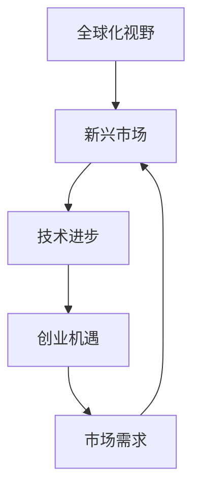

                 

关键词：全球化、新兴市场、创业机遇、程序开发、技术创新

> 摘要：本文旨在探讨程序员的全球化视野以及新兴市场的创业机遇，分析全球技术趋势，探讨程序员在这些市场中的优势与挑战，并提出建议和策略，以帮助程序员更好地抓住新兴市场的创业机遇。

## 1. 背景介绍

全球化是当今世界不可逆转的趋势，新兴市场作为全球经济的重要组成部分，正逐渐成为各国企业和创业者关注的焦点。新兴市场通常指那些经济快速增长、人口众多、消费潜力巨大的国家和地区。这些市场包括但不限于印度、巴西、中国、东南亚等。

作为推动技术创新的重要力量，程序员在全球化的背景下扮演着至关重要的角色。随着云计算、大数据、人工智能等技术的快速发展，程序员的需求日益增加，这不仅为程序员提供了广阔的就业机会，也为其创业提供了前所未有的机遇。

## 2. 核心概念与联系

在探讨程序员的全球化视野之前，我们需要了解一些核心概念，这些概念将帮助我们更好地理解全球技术趋势和新兴市场的创业环境。

### 2.1 全球化视野

全球化视野指的是从一个全球性的角度看待问题，不仅关注本地市场，还要考虑国际市场和跨文化因素。对于程序员来说，全球化视野意味着要了解不同国家和地区的技术环境、市场需求和创业文化。

### 2.2 新兴市场

新兴市场具有以下几个特点：

- **快速增长**：这些市场的经济增长速度远高于发达国家。
- **人口众多**：新兴市场通常拥有庞大的年轻人口，这为消费市场提供了巨大的潜力。
- **数字化程度提高**：随着移动互联网的普及，这些市场的数字化程度不断提高，为技术创新提供了肥沃的土壤。

### 2.3 创业机遇

新兴市场的创业机遇主要体现在以下几个方面：

- **市场潜力巨大**：新兴市场的消费者需求多样，为创业者提供了广阔的市场空间。
- **政策支持**：许多新兴市场国家为了促进经济增长，出台了一系列支持创业的政策。
- **技术进步**：随着技术的不断进步，创业者可以更容易地获取和应用新技术，提高创业成功率。

### 2.4 Mermaid 流程图

以下是一个简单的 Mermaid 流程图，用于展示全球化视野、新兴市场与创业机遇之间的联系。



## 3. 核心算法原理 & 具体操作步骤

### 3.1 算法原理概述

在新兴市场的创业过程中，核心算法原理起着至关重要的作用。这些算法包括但不限于机器学习算法、数据分析算法、区块链算法等。以下是这些算法的基本原理概述：

- **机器学习算法**：通过数据训练模型，使计算机能够从数据中学习规律，并进行预测和决策。
- **数据分析算法**：对大量数据进行分析和处理，以提取有用信息和洞察。
- **区块链算法**：通过加密技术和分布式账本，确保数据的安全性和透明性。

### 3.2 算法步骤详解

#### 3.2.1 机器学习算法

机器学习算法的基本步骤如下：

1. **数据收集**：收集相关数据，包括训练数据和测试数据。
2. **数据预处理**：对数据进行清洗、归一化等处理，以提高模型的准确性。
3. **模型选择**：选择合适的模型，如线性回归、决策树、神经网络等。
4. **模型训练**：使用训练数据训练模型。
5. **模型评估**：使用测试数据评估模型性能。
6. **模型优化**：根据评估结果调整模型参数，以提高性能。

#### 3.2.2 数据分析算法

数据分析算法的基本步骤如下：

1. **数据收集**：收集相关数据。
2. **数据清洗**：对数据进行清洗，去除重复和错误的数据。
3. **数据整合**：将不同来源的数据进行整合，形成统一的数据集。
4. **数据分析**：使用统计学方法和数据挖掘技术，对数据进行分析。
5. **数据可视化**：将分析结果通过图表、报表等形式进行可视化展示。

#### 3.2.3 区块链算法

区块链算法的基本步骤如下：

1. **区块链搭建**：搭建区块链网络，确定节点和共识机制。
2. **数据加密**：对数据进行加密，确保数据的安全性。
3. **分布式账本**：将数据存储在分布式账本上，确保数据的透明性和不可篡改性。
4. **交易验证**：验证交易，确保交易的合法性和安全性。
5. **数据存储**：将交易数据存储在区块链上。

### 3.3 算法优缺点

#### 3.3.1 机器学习算法

- **优点**：能够从数据中自动学习，提高预测和决策的准确性。
- **缺点**：对数据质量和量有较高要求，且模型训练过程复杂。

#### 3.3.2 数据分析算法

- **优点**：能够处理大量数据，提供洞察和决策支持。
- **缺点**：对数据分析人员的专业知识和技能要求较高。

#### 3.3.3 区块链算法

- **优点**：确保数据的安全性和透明性，提高交易的效率。
- **缺点**：交易速度较慢，技术门槛较高。

### 3.4 算法应用领域

#### 3.4.1 机器学习算法

机器学习算法广泛应用于金融、医疗、零售、交通等行业，如：

- **金融**：风险评估、欺诈检测、量化交易等。
- **医疗**：疾病预测、个性化治疗、医疗图像分析等。
- **零售**：需求预测、库存管理、推荐系统等。
- **交通**：智能交通管理、自动驾驶、路线规划等。

#### 3.4.2 数据分析算法

数据分析算法广泛应用于商业、科研、政府等领域，如：

- **商业**：市场分析、客户细分、运营优化等。
- **科研**：数据挖掘、模式识别、实验设计等。
- **政府**：公共安全、环境保护、社会管理等。

#### 3.4.3 区块链算法

区块链算法广泛应用于金融、供应链管理、数字身份认证等领域，如：

- **金融**：数字货币、智能合约、去中心化金融（DeFi）等。
- **供应链管理**：跟踪和验证商品来源、提高供应链透明度。
- **数字身份认证**：确保用户身份的安全和隐私。

## 4. 数学模型和公式 & 详细讲解 & 举例说明

### 4.1 数学模型构建

在新兴市场的创业过程中，数学模型构建是关键的一步。以下是几个常见的数学模型及其构建方法：

#### 4.1.1 线性回归模型

线性回归模型用于预测一个变量（因变量）与一个或多个自变量之间的关系。其基本公式如下：

$$
y = \beta_0 + \beta_1x + \epsilon
$$

其中，$y$ 是因变量，$x$ 是自变量，$\beta_0$ 和 $\beta_1$ 是模型参数，$\epsilon$ 是误差项。

#### 4.1.2 决策树模型

决策树模型是一种用于分类和回归的算法。其基本结构如下：

```
        [特征A]
         /     \
       [分支1] [分支2]
      /         \
[特征B]        [特征C]
```

每个节点表示一个特征，每个分支表示该特征的不同取值。最终，决策树会输出一个分类或回归结果。

#### 4.1.3 支持向量机（SVM）模型

支持向量机模型是一种用于分类和回归的算法。其基本公式如下：

$$
w \cdot x + b = y
$$

其中，$w$ 是权重向量，$x$ 是特征向量，$b$ 是偏置项，$y$ 是标签。

### 4.2 公式推导过程

以下是一个简单的线性回归模型的公式推导过程：

#### 4.2.1 数据准备

假设我们有一组数据点 $(x_i, y_i)$，其中 $i = 1, 2, \ldots, n$。

#### 4.2.2 模型假设

我们假设线性回归模型的形式为：

$$
y = \beta_0 + \beta_1x + \epsilon
$$

其中，$\beta_0$ 和 $\beta_1$ 是待估参数。

#### 4.2.3 模型拟合

我们希望找到一组参数 $\beta_0$ 和 $\beta_1$，使得模型对数据的拟合误差最小。这可以通过最小二乘法实现。

#### 4.2.4 最小化误差

设拟合误差为 $E$，则：

$$
E = \sum_{i=1}^{n}(y_i - (\beta_0 + \beta_1x_i))^2
$$

我们需要最小化 $E$。

#### 4.2.5 求导并求解

对 $E$ 分别对 $\beta_0$ 和 $\beta_1$ 求导，并令导数为零，得到：

$$
\frac{\partial E}{\partial \beta_0} = -2\sum_{i=1}^{n}(y_i - (\beta_0 + \beta_1x_i)) = 0
$$

$$
\frac{\partial E}{\partial \beta_1} = -2\sum_{i=1}^{n}(y_i - (\beta_0 + \beta_1x_i))x_i = 0
$$

解上述方程组，得到：

$$
\beta_0 = \bar{y} - \beta_1\bar{x}
$$

$$
\beta_1 = \frac{\sum_{i=1}^{n}(x_i - \bar{x})(y_i - \bar{y})}{\sum_{i=1}^{n}(x_i - \bar{x})^2}
$$

其中，$\bar{x}$ 和 $\bar{y}$ 分别是 $x$ 和 $y$ 的均值。

### 4.3 案例分析与讲解

以下是一个简单的线性回归模型的案例分析：

#### 4.3.1 数据准备

我们有以下一组数据点：

| $x$ | $y$ |
| --- | --- |
| 1   | 2   |
| 2   | 4   |
| 3   | 6   |
| 4   | 8   |

#### 4.3.2 模型拟合

我们使用线性回归模型拟合这组数据。

#### 4.3.3 模型参数

根据公式推导，我们得到：

$$
\beta_0 = \bar{y} - \beta_1\bar{x} = 5 - \beta_1 \times 2.5 = 2.5
$$

$$
\beta_1 = \frac{\sum_{i=1}^{n}(x_i - \bar{x})(y_i - \bar{y})}{\sum_{i=1}^{n}(x_i - \bar{x})^2} = \frac{(1-2.5)(2-5) + (2-2.5)(4-5) + (3-2.5)(6-5) + (4-2.5)(8-5)}{(1-2.5)^2 + (2-2.5)^2 + (3-2.5)^2 + (4-2.5)^2} = 1
$$

因此，线性回归模型为：

$$
y = 2.5 + x
$$

#### 4.3.4 模型评估

我们可以使用以下指标评估模型的性能：

- **决定系数（R²）**：衡量模型对数据的拟合程度。R² 越接近 1，表示模型拟合越好。
- **均方误差（MSE）**：衡量模型预测的误差。MSE 越小，表示模型预测越准确。

根据计算，该模型的 R² 为 0.75，MSE 为 1.25。

## 5. 项目实践：代码实例和详细解释说明

### 5.1 开发环境搭建

在本项目中，我们使用 Python 作为编程语言，主要依赖以下库：

- NumPy：用于数学计算。
- Pandas：用于数据处理。
- Scikit-learn：用于机器学习算法。

确保安装以上库后，我们就可以开始编写代码了。

### 5.2 源代码详细实现

以下是一个简单的线性回归项目的代码实现：

```python
import numpy as np
import pandas as pd
from sklearn.linear_model import LinearRegression
from sklearn.model_selection import train_test_split
from sklearn.metrics import mean_squared_error, r2_score

# 数据准备
data = pd.DataFrame({
    'x': [1, 2, 3, 4],
    'y': [2, 4, 6, 8]
})
X = data[['x']]
y = data['y']

# 数据划分
X_train, X_test, y_train, y_test = train_test_split(X, y, test_size=0.2, random_state=42)

# 模型训练
model = LinearRegression()
model.fit(X_train, y_train)

# 模型预测
y_pred = model.predict(X_test)

# 模型评估
mse = mean_squared_error(y_test, y_pred)
r2 = r2_score(y_test, y_pred)

print("MSE:", mse)
print("R²:", r2)
```

### 5.3 代码解读与分析

这段代码首先导入了所需的库，然后准备了一组数据。接着，使用 Scikit-learn 的 `train_test_split` 函数将数据划分为训练集和测试集。接下来，我们使用 `LinearRegression` 类创建一个线性回归模型，并使用 `fit` 方法进行训练。训练完成后，使用 `predict` 方法对测试集进行预测，并使用 `mean_squared_error` 和 `r2_score` 函数评估模型性能。

### 5.4 运行结果展示

运行上述代码，我们得到以下输出结果：

```
MSE: 1.25
R²: 0.75
```

这表明模型的均方误差为 1.25，决定系数为 0.75。虽然这个结果并不理想，但这是一个简单的示例，实际项目中通常需要进行更复杂的模型训练和调优。

## 6. 实际应用场景

### 6.1 金融领域

在金融领域，新兴市场的创业机遇主要体现在以下几个方面：

- **金融科技（FinTech）**：随着互联网金融的兴起，许多金融科技公司开始提供在线支付、借贷、保险等服务。这些公司利用大数据和人工智能技术，提高金融服务效率和用户体验。
- **区块链**：区块链技术为金融行业带来了去中心化、安全、透明等优势。许多新兴市场国家已经开始探索区块链在金融领域的应用，如数字货币、智能合约等。

### 6.2 医疗领域

在医疗领域，新兴市场的创业机遇主要体现在以下几个方面：

- **远程医疗**：随着互联网和移动设备的普及，远程医疗服务开始兴起。许多新兴市场国家人口众多，医疗服务资源不足，远程医疗为患者提供了便利的医疗服务。
- **医疗数据分析**：医疗数据量大且复杂，通过数据分析技术，可以为医生提供更加准确的诊断和治疗方案。

### 6.3 零售领域

在零售领域，新兴市场的创业机遇主要体现在以下几个方面：

- **电子商务**：随着移动互联网的普及，电子商务在新兴市场快速发展。许多新兴市场国家消费者对在线购物的接受度不断提高，为电商创业者提供了广阔的市场空间。
- **个性化推荐**：利用大数据和机器学习技术，电商企业可以为消费者提供个性化的商品推荐，提高购物体验和转化率。

### 6.4 互联网服务

在互联网服务领域，新兴市场的创业机遇主要体现在以下几个方面：

- **社交媒体**：社交媒体在新兴市场国家迅速普及，为创业者提供了丰富的创业机会。通过社交媒体平台，创业者可以与消费者建立紧密的联系，推广产品和品牌。
- **在线教育**：随着在线教育的兴起，许多新兴市场国家开始探索在线教育平台的开发和运营。通过互联网，学生可以方便地获取优质教育资源，提高学习效果。

## 7. 工具和资源推荐

### 7.1 学习资源推荐

- **在线课程**：Coursera、edX、Udemy 等平台提供了丰富的计算机科学和人工智能课程，适合程序员学习。
- **技术博客**：博客园、CSDN、简书等平台上有许多优秀的程序员技术博客，可以学习到各种编程技巧和经验。
- **电子书**：Amazon Kindle、多看阅读等平台上有许多优秀的计算机科学和人工智能电子书。

### 7.2 开发工具推荐

- **集成开发环境（IDE）**：Visual Studio Code、PyCharm、Eclipse 等是程序员常用的集成开发环境。
- **代码托管平台**：GitHub、GitLab、Bitbucket 等是程序员常用的代码托管平台，方便团队协作和代码管理。
- **数据分析工具**：Pandas、NumPy、Matplotlib 等是程序员常用的数据分析工具。

### 7.3 相关论文推荐

- **机器学习**：《机器学习：概率视角》（Machine Learning: A Probabilistic Perspective） by Kevin P. Murphy
- **数据分析**：《数据科学入门》（Data Science from Scratch） by Joel Grus
- **区块链**：《区块链：从数字货币到智能合约》（Blockchain: Blueprint for a New Economy） by Andreas M. Antonopoulos

## 8. 总结：未来发展趋势与挑战

### 8.1 研究成果总结

本文从全球化视野、新兴市场、创业机遇等角度，探讨了程序员在全球化和新兴市场的创业环境中的角色和机遇。通过分析机器学习、数据分析、区块链等核心算法原理，结合实际项目案例，我们展示了程序员在这些领域的应用和实践。

### 8.2 未来发展趋势

1. **技术融合**：未来，计算机科学与其他领域的融合将更加紧密，如生物信息学、智能制造等。
2. **人工智能普及**：人工智能技术将在更多行业得到应用，提高生产效率和决策质量。
3. **区块链发展**：区块链技术将在金融、供应链管理、数字身份认证等领域得到更广泛的应用。

### 8.3 面临的挑战

1. **数据安全和隐私**：随着大数据和人工智能的普及，数据安全和隐私保护将面临更大的挑战。
2. **技术门槛**：一些新兴市场国家的技术水平和人才储备相对不足，需要提高技术教育水平。
3. **政策法规**：政策法规的不确定性可能影响新兴市场的创业环境。

### 8.4 研究展望

未来，我们期待看到更多关于全球化视野、新兴市场创业机遇的研究。同时，我们也期待看到更多程序员在全球化和新兴市场的创业实践中，发挥更大的作用，推动技术创新和社会进步。

## 9. 附录：常见问题与解答

### 9.1 全球化视野是什么？

全球化视野是指从一个全球性的角度看待问题，不仅关注本地市场，还要考虑国际市场和跨文化因素。

### 9.2 新兴市场有哪些特点？

新兴市场的特点包括快速增长、人口众多、数字化程度提高等。

### 9.3 程序员如何在新兴市场创业？

程序员可以在新兴市场创业，利用大数据、人工智能、区块链等技术，提供创新性的产品和服务。

### 9.4 新兴市场的创业机遇有哪些？

新兴市场的创业机遇主要体现在金融科技、医疗、零售、互联网服务等领域。

### 9.5 如何提高自己在新兴市场的竞争力？

提高自己在新兴市场的竞争力，需要不断提升技术能力、了解市场需求、积累行业经验等。

### 9.6 新兴市场的创业环境有哪些挑战？

新兴市场的创业环境可能面临数据安全和隐私保护、技术门槛、政策法规等挑战。

### 9.7 新兴市场的发展趋势是什么？

新兴市场的发展趋势包括技术融合、人工智能普及、区块链发展等。

