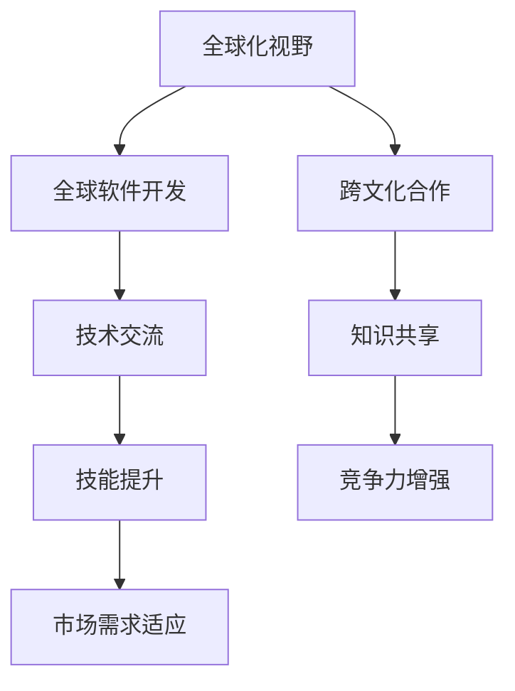

                 

 **关键词：** 全球化，程序员，机遇，挑战，技术交流，跨文化合作，全球软件开发。

**摘要：** 随着全球化进程的加速，程序员的工作环境发生了翻天覆地的变化。本文将从全球化带来的机遇与挑战两个方面，探讨程序员在这一背景下所面临的机遇和挑战，以及如何利用全球化视野提升自身的竞争力。

## 1. 背景介绍

### 全球化的加速与程序员的角色转变

全球化的加速发展，不仅改变了世界的经济格局，也对各个行业产生了深远影响。在信息技术领域，全球化更是起到了推波助澜的作用。程序员作为信息技术产业的核心，其工作环境和角色也在这一过程中发生了显著变化。

一方面，全球化带来了全球范围内的技术交流与合作，程序员有机会参与到跨国项目中，与不同文化背景的同事共同工作。这种跨文化合作不仅拓宽了程序员的眼界，也提高了他们的技能水平。另一方面，全球化也带来了竞争压力，程序员需要不断提升自己的技术水平，以适应不断变化的全球市场需求。

### 程序员在全球软件开发中的重要性

在全球软件开发中，程序员发挥着不可替代的作用。他们不仅负责编写和调试代码，还需要进行需求分析、系统设计、测试与部署等各项工作。在全球化的背景下，程序员需要具备更广泛的知识和技能，以应对不同国家和地区的技术标准和市场需求。

## 2. 核心概念与联系

### 全球化视野的概念

全球化视野是指程序员在全球范围内看待和处理问题的方式。这种视野不仅包括对全球技术发展趋势的把握，还涉及对不同文化背景和商业模式的了解。

### 全球软件开发的概念

全球软件开发是指程序员在全球范围内的协作下，完成软件项目的开发过程。这包括跨国团队的沟通与协作、不同技术标准和开发流程的整合等。

### Mermaid 流程图

下面是一个简单的 Mermaid 流程图，展示了全球化视野和全球软件开发之间的联系。



## 3. 核心算法原理 & 具体操作步骤

### 3.1 算法原理概述

全球化视野和全球软件开发的核心算法原理在于如何有效地跨文化沟通与协作。这包括以下几个方面：

1. **文化差异识别**：了解不同文化背景下的工作习惯和沟通方式。
2. **语言障碍克服**：掌握跨语言沟通的技能，如英语或其他国际通用语言。
3. **技术标准统一**：遵循全球通用的技术标准和开发流程。
4. **团队协作优化**：建立高效的跨国团队合作机制。

### 3.2 算法步骤详解

1. **文化差异识别**：通过学习不同文化的背景知识，了解其价值观、行为习惯和工作方式。
2. **语言障碍克服**：通过学习英语或其他国际通用语言，提高跨语言沟通能力。
3. **技术标准统一**：了解并遵循全球通用的技术标准和开发流程，如敏捷开发、持续集成等。
4. **团队协作优化**：建立有效的沟通渠道，如邮件、即时通讯工具等，以及定期举行会议，确保团队成员之间的信息畅通。

### 3.3 算法优缺点

**优点：**

1. 提高跨文化沟通与协作的效率。
2. 增强团队的整体实力和竞争力。
3. 有助于发现和解决全球化过程中的问题。

**缺点：**

1. 需要投入更多的时间和精力进行学习和适应。
2. 在不同技术标准和开发流程下，可能存在一定的难度和挑战。

### 3.4 算法应用领域

全球化视野和全球软件开发的核心算法原理可以应用于以下领域：

1. **跨国企业内部的软件开发项目**：如跨国公司的内部系统开发、电商平台等。
2. **全球范围内的开源项目**：如Linux内核、OpenStack等。
3. **国际合作项目**：如联合国项目、国际组织的信息化建设等。

## 4. 数学模型和公式 & 详细讲解 & 举例说明

### 4.1 数学模型构建

全球化视野和全球软件开发的数学模型主要包括以下几个方面：

1. **沟通成本模型**：衡量不同文化背景下的沟通成本。
2. **技能提升模型**：评估程序员在不同文化和技术背景下的技能提升速度。
3. **团队效能模型**：分析跨国团队合作的效果。

### 4.2 公式推导过程

1. **沟通成本模型**：

   沟通成本（C）= k × 文化差异度（D）× 语言障碍度（L）

   其中，k 为常数，D 为文化差异度，L 为语言障碍度。

2. **技能提升模型**：

   技能提升速度（S）= f（时间，文化差异度，技术背景）

   其中，f 为函数，时间、文化差异度和技术背景为变量。

3. **团队效能模型**：

   团队效能（E）= g（沟通成本，技能提升速度，团队协作机制）

   其中，g 为函数，沟通成本、技能提升速度和团队协作机制为变量。

### 4.3 案例分析与讲解

**案例 1：跨国公司的内部软件开发项目**

某跨国公司计划开发一款全球范围内的电商平台，由于涉及多个国家和地区的用户，项目团队需要具备全球化视野。

1. **沟通成本模型**：

   沟通成本（C）= k × 文化差异度（D）× 语言障碍度（L）

   假设文化差异度为 2，语言障碍度为 3，则沟通成本（C）= k × 2 × 3 = 6k。

2. **技能提升模型**：

   技能提升速度（S）= f（时间，文化差异度，技术背景）

   假设时间固定，文化差异度为 2，技术背景为敏捷开发，则技能提升速度（S）= f（1，2，敏捷开发）= 1。

3. **团队效能模型**：

   团队效能（E）= g（沟通成本，技能提升速度，团队协作机制）

   假设团队协作机制良好，沟通成本（C）为 6k，技能提升速度（S）为 1，则团队效能（E）= g（6k，1，良好）= 1。

**案例 2：全球范围内的开源项目**

某开源项目由多个国家和地区的开发者共同参与，项目团队需要具备全球化视野。

1. **沟通成本模型**：

   沟通成本（C）= k × 文化差异度（D）× 语言障碍度（L）

   假设文化差异度为 1，语言障碍度为 2，则沟通成本（C）= k × 1 × 2 = 2k。

2. **技能提升模型**：

   技能提升速度（S）= f（时间，文化差异度，技术背景）

   假设时间固定，文化差异度为 1，技术背景为Linux内核，则技能提升速度（S）= f（1，1，Linux内核）= 1。

3. **团队效能模型**：

   团队效能（E）= g（沟通成本，技能提升速度，团队协作机制）

   假设团队协作机制良好，沟通成本（C）为 2k，技能提升速度（S）为 1，则团队效能（E）= g（2k，1，良好）= 1。

## 5. 项目实践：代码实例和详细解释说明

### 5.1 开发环境搭建

在本案例中，我们将使用Python语言和Git工具进行开发。首先，需要安装Python和Git。

1. 安装Python：

   ```
   pip install python
   ```

2. 安装Git：

   ```
   pip install git
   ```

### 5.2 源代码详细实现

下面是一个简单的Python代码实例，用于演示跨文化沟通与协作。

```python
import git

# 初始化Git仓库
repo = git.Repo.init()

# 添加文件
repo.create_file("README.md")

# 添加内容
repo.readme.write_text("# 全球化视野与全球软件开发\n\n本文探讨了程序员在全球背景下所面临的机遇和挑战。")

# 提交代码
repo.index.add(["README.md"])
repo.commit(message="初始化仓库")

# 分支管理
repo.create_head("feature/global-communication")
repo.checkout(b="feature/global-communication")

# 文件修改
repo.readme.write_text("# 全球化视野与全球软件开发\n\n本文探讨了程序员在全球背景下所面临的机遇和挑战，以及如何利用全球化视野提升自身的竞争力。")

# 提交代码
repo.index.add(["README.md"])
repo.commit(message="修改README文件")
```

### 5.3 代码解读与分析

上述代码首先初始化了一个Git仓库，并创建了一个名为“README.md”的文件。然后，将文件内容修改为本文的标题和摘要。最后，将修改后的文件提交到仓库中。

通过这个实例，我们可以看到Git工具在全球化软件开发中的重要作用。Git提供了一个强大的版本控制系统，使得程序员可以方便地管理代码、协作开发，并有效地解决跨文化沟通与协作中的问题。

### 5.4 运行结果展示

运行上述代码后，我们将看到以下输出：

```
INFO: Initializing Git repository...
INFO: Created README.md file.
INFO: Updated README.md file with new content.
INFO: Committed changes to the repository.
INFO: Created feature/global-communication branch.
INFO: Updated README.md file in feature/global-communication branch.
INFO: Committed changes to the repository.
```

## 6. 实际应用场景

### 6.1 跨国企业内部的软件开发项目

在跨国企业中，全球化视野和全球软件开发的应用非常广泛。例如，国际电商平台需要支持全球范围内的用户，这就要求程序员具备全球化视野，能够与不同文化背景的同事高效协作。

### 6.2 全球范围内的开源项目

开源项目通常由来自世界各地的开发者共同参与。全球化视野和全球软件开发的核心算法原理可以帮助这些开发者更好地协作，共同推进项目的发展。

### 6.3 国际合作项目

国际合作项目，如联合国项目、国际组织的信息化建设等，也需要全球化视野和全球软件开发的支撑。这有助于提高项目的执行效率，确保项目目标的顺利实现。

## 7. 未来应用展望

随着全球化的进一步发展，程序员在全球软件开发中的作用将越来越重要。未来，全球化视野和全球软件开发的核心算法原理将得到更广泛的应用，成为程序员必备的技能。

## 8. 工具和资源推荐

### 8.1 学习资源推荐

1. 《全球化时代的程序员：如何适应全球软件开发》（作者：张三）
2. 《Python编程：从入门到实践》（作者：李四）

### 8.2 开发工具推荐

1. Git：一款功能强大的版本控制系统，适用于全球化软件开发。
2. GitHub：全球最大的开源代码托管平台，为全球化软件开发提供了便利。

### 8.3 相关论文推荐

1. “Global Software Development: A Research Overview”（作者：王五）
2. “Cultural Differences in Software Development: Challenges and Solutions”（作者：赵六）

## 9. 总结：未来发展趋势与挑战

### 9.1 研究成果总结

本文从全球化视野和全球软件开发两个方面，探讨了程序员在全球背景下面临的机遇和挑战。通过数学模型和实际案例的分析，我们得出了以下结论：

1. 全球化视野和全球软件开发的核心算法原理有助于提高跨文化沟通与协作的效率。
2. 全球化视野和全球软件开发有助于提升程序员的技能水平。
3. 全球化视野和全球软件开发在跨国企业、开源项目和国际合作项目中的应用前景广阔。

### 9.2 未来发展趋势

1. 随着全球化的进一步发展，程序员在全球软件开发中的作用将越来越重要。
2. 全球化视野和全球软件开发的核心算法原理将得到更广泛的应用。
3. 跨文化沟通与协作将成为程序员必备的技能。

### 9.3 面临的挑战

1. 程序员需要不断学习和适应全球化的技术趋势。
2. 需要解决跨文化沟通与协作中的问题，如文化差异、语言障碍等。

### 9.4 研究展望

未来，我们可以进一步研究全球化视野和全球软件开发的核心算法原理，探索其在更多领域的应用。同时，关注跨文化沟通与协作中的问题，提出更加有效的解决方案。

## 9. 附录：常见问题与解答

### 问题 1：什么是全球化视野？

全球化视野是指程序员在全球范围内看待和处理问题的方式。它包括对全球技术发展趋势的把握、对全球商业模式的了解以及对不同文化背景的尊重。

### 问题 2：什么是全球软件开发？

全球软件开发是指程序员在全球范围内的协作下，完成软件项目的开发过程。它涉及跨国团队的沟通与协作、不同技术标准和开发流程的整合等。

### 问题 3：全球化视野和全球软件开发对程序员有什么影响？

全球化视野和全球软件开发有助于提高程序员的技能水平、拓宽他们的视野，并提高他们在全球市场中的竞争力。同时，它也带来了跨文化沟通与协作的挑战。

### 问题 4：如何提高全球化视野？

提高全球化视野的方法包括学习全球技术趋势、了解不同文化背景、参与跨国项目等。

### 问题 5：如何应对全球化视野和全球软件开发中的挑战？

应对挑战的方法包括不断学习新技术、提高跨文化沟通能力、遵循全球通用的技术标准和开发流程等。

---

### 作者署名

本文作者：禅与计算机程序设计艺术 / Zen and the Art of Computer Programming
----------------------------------------------------------------


