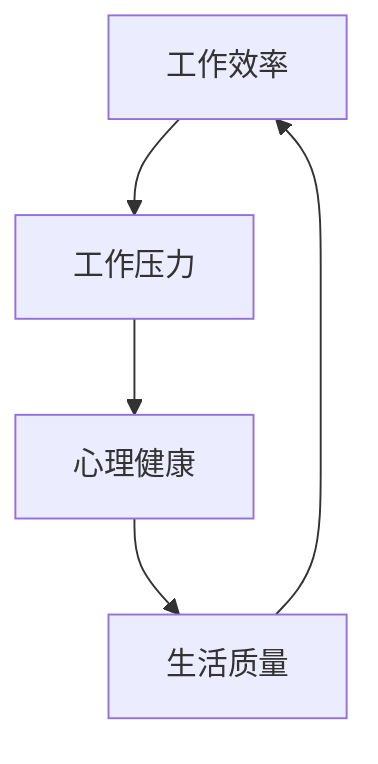

                 

关键词：程序员、工作与生活平衡、职业发展、心理健康、效率提升、策略实践

> 摘要：本文将探讨现代程序员如何在工作与生活之间找到平衡，实现个人与职业的双重成功。通过深入分析程序员面临的挑战、提出有效的策略和实践方法，帮助程序员构建健康的工作环境，提高生活质量，同时保持职业竞争力。

## 1. 背景介绍

在现代科技行业，程序员作为技术发展的驱动力，承担着重要的责任。然而，随着技术的迅猛发展和工作压力的日益增加，程序员面临着诸多挑战，其中工作与生活平衡成为了一个备受关注的话题。长期的工作压力、不断更新的技术知识、无休止的任务和紧急项目，这些都可能导致程序员的生活质量下降，甚至影响心理健康。

工作与生活平衡不仅关系到程序员个人的幸福感和生活质量，也直接影响到他们的工作效率和职业发展。一个失衡的工作状态可能导致程序员产生疲劳、焦虑、缺乏创造力等问题，进而影响整个团队甚至公司的运营。因此，探讨如何实现工作与生活平衡，对于程序员及其所在的组织来说都具有重要意义。

本文将从以下几个方面展开讨论：

- **程序员面临的挑战**：分析程序员在职业生涯中可能遇到的具体困难。
- **核心概念与联系**：介绍实现工作与生活平衡所需的核心概念和联系。
- **核心算法原理 & 具体操作步骤**：阐述实现平衡的具体方法和策略。
- **数学模型和公式 & 详细讲解 & 举例说明**：提供理论支持，并通过案例说明平衡策略的有效性。
- **项目实践：代码实例和详细解释说明**：展示实际操作步骤。
- **实际应用场景**：讨论平衡策略在不同工作环境中的适用性。
- **工具和资源推荐**：推荐有助于实现工作与生活平衡的工具和资源。
- **总结：未来发展趋势与挑战**：总结研究成果，展望未来趋势和面临的挑战。

通过本文的探讨，希望为程序员们提供实用的指导，帮助他们在忙碌的职业生涯中找到属于自己的平衡点。

## 2. 核心概念与联系

### 2.1 核心概念

要实现工作与生活平衡，首先需要理解几个核心概念：

- **工作效率**：指在单位时间内完成工作的能力。
- **生活质量**：涵盖个人健康、家庭关系、娱乐活动等多方面的幸福感和满足感。
- **心理健康**：指个体在情感、认知和行为上的健康状态。
- **工作压力**：由工作负担、时间限制和任务复杂性等引起的心理压力。

### 2.2 联系

这些核心概念之间存在紧密的联系。工作效率直接影响工作压力，而过度的压力又可能损害心理健康，进而影响生活质量。反之，良好的生活质量可以为程序员提供心理支持，帮助他们更好地应对工作压力，从而提高工作效率。

### 2.3 Mermaid 流程图

以下是一个简单的 Mermaid 流程图，展示了这些核心概念之间的联系：



通过这个流程图，我们可以清晰地看到，工作效率、工作压力、心理健康和生活质量之间相互影响，形成一个闭环。因此，实现工作与生活平衡需要从多个方面同时入手，综合运用各种策略和方法。

## 3. 核心算法原理 & 具体操作步骤

### 3.1 算法原理概述

实现工作与生活平衡的算法原理可以概括为以下几个核心点：

1. **时间管理**：合理安排工作时间，避免过度工作，确保有足够的时间进行休息和娱乐。
2. **任务优先级排序**：确定任务的重要性和紧急性，优先处理重要且紧急的任务。
3. **心理调适**：通过适当的放松技巧和心理健康干预，缓解工作压力，保持良好的心理状态。
4. **家庭与社交支持**：建立稳定的家庭关系和社交网络，获得情感上的支持和鼓励。

### 3.2 算法步骤详解

#### 3.2.1 时间管理

**步骤 1**：制定每日、每周、每月的工作计划。

- **每日计划**：列出当天必须完成的任务，为每个任务分配具体的时间。
- **每周计划**：回顾每周的任务完成情况，调整下周的计划。
- **每月计划**：根据项目进度和公司目标，制定长期的计划。

**步骤 2**：设定工作时间的边界。

- **工作时间**：规定每天的工作时间，确保有足够的时间完成工作任务。
- **休息时间**：设定固定的休息时间，如午休、下班后的小憩等。

**步骤 3**：灵活调整计划。

- 根据实际情况，灵活调整工作计划和休息时间，确保工作与生活的平衡。

#### 3.2.2 任务优先级排序

**步骤 1**：确定任务的重要性和紧急性。

- **重要紧急任务**：优先处理这些任务，因为它们对当前工作有直接影响。
- **重要不紧急任务**：安排在空闲时间处理，以避免影响日常工作。
- **不重要紧急任务**：尽量委托或延迟处理，减少对个人时间的占用。

**步骤 2**：使用四象限法则。

- **第一象限**：重要紧急任务，优先处理。
- **第二象限**：重要不紧急任务，合理安排时间。
- **第三象限**：不重要紧急任务，尽量减少处理。
- **第四象限**：不重要不紧急任务，可以忽略或委托处理。

#### 3.2.3 心理调适

**步骤 1**：识别压力源。

- 通过自我反思，了解导致压力的具体原因，如工作负荷、人际关系等。

**步骤 2**：采取放松技巧。

- **深呼吸**：深呼吸有助于缓解紧张情绪，放松身体。
- **冥想**：冥想可以训练大脑，提高专注力和情绪稳定性。
- **锻炼**：适量的体育锻炼有助于释放压力，提高身体素质。

**步骤 3**：寻求专业帮助。

- 当压力过大时，可以寻求心理咨询师的帮助，进行专业的心理干预。

#### 3.2.4 家庭与社交支持

**步骤 1**：建立家庭支持系统。

- 与家人沟通，确保家人理解自己的工作性质，获得家庭的支持。
- 定期与家人共度时光，加强家庭关系。

**步骤 2**：建立社交网络。

- **同事关系**：与同事保持良好的工作关系，相互支持，共同成长。
- **朋友关系**：培养广泛的社交网络，获得朋友的支持和鼓励。

### 3.3 算法优缺点

#### 优点

- **提高工作效率**：通过合理的时间管理和任务优先级排序，可以提高工作效率，减少不必要的耗时任务。
- **缓解工作压力**：通过心理调适和社交支持，可以有效地缓解工作压力，保持良好的心理状态。
- **提升生活质量**：平衡的工作与生活状态有助于提升生活质量，获得更多的幸福感和满足感。

#### 缺点

- **初期适应困难**：刚开始实施平衡策略时，可能需要适应新的工作节奏和生活习惯，初期可能感到不适应。
- **工作量调整难度**：在工作任务变化较大时，可能需要不断调整工作计划，以保持平衡。

### 3.4 算法应用领域

实现工作与生活平衡的算法策略适用于各种工作环境和职业，不仅适用于程序员，也适用于其他技术工作者、管理人员和企业高管。在不同的职业领域，可以根据具体的工作特点和需求，灵活调整和应用这些策略，以实现最佳的平衡效果。

## 4. 数学模型和公式 & 详细讲解 & 举例说明

### 4.1 数学模型构建

为了更好地理解工作与生活平衡，我们可以构建一个简单的数学模型，用于量化工作效率、工作压力、心理健康和生活质量之间的关系。以下是一个简化的模型：

\[ \text{平衡指数} = \frac{\text{工作效率} \times \text{生活质量}}{\text{工作压力} + \text{心理健康影响}} \]

这个模型中，平衡指数反映了工作与生活的平衡程度。当平衡指数越高时，表示工作与生活之间的平衡越好。

### 4.2 公式推导过程

为了推导这个公式，我们可以从以下几个步骤进行：

1. **工作效率**：工作效率是单位时间内完成的工作量，可以用公式 \( \text{工作效率} = \frac{\text{工作总量}}{\text{工作时间}} \) 来表示。
2. **工作压力**：工作压力可以用任务复杂度和时间限制来衡量，假设工作压力 \( P \) 与任务复杂度 \( C \) 和时间限制 \( T \) 之间满足线性关系：\( P = aC + bT \)。
3. **心理健康影响**：心理健康影响可以用心理压力 \( \text{心理健康影响} = \frac{P}{\text{心理承受力}} \) 来衡量，心理承受力是一个常数。
4. **生活质量**：生活质量可以用个人健康、家庭关系、娱乐活动等因素来衡量，假设生活质量 \( Q \) 满足线性关系：\( Q = cH + dF + eE \)，其中 \( H \) 代表健康，\( F \) 代表家庭关系，\( E \) 代表娱乐活动。

结合以上因素，我们可以推导出平衡指数的公式：

\[ \text{平衡指数} = \frac{\frac{\text{工作总量}}{\text{工作时间}} \times (cH + dF + eE)}{aC + bT + \frac{P}{\text{心理承受力}}} \]

为了简化，我们假设心理承受力为常数，得到：

\[ \text{平衡指数} = \frac{\text{工作效率} \times \text{生活质量}}{\text{工作压力} + \text{心理健康影响}} \]

### 4.3 案例分析与讲解

假设程序员小明的工作效率为 10 小时完成一个任务，工作压力为 30，心理健康影响为 5。他的生活质量由健康、家庭关系和娱乐活动共同决定，分别为 8、6 和 4。那么，我们可以计算小明的平衡指数：

\[ \text{平衡指数} = \frac{10 \times (8 + 6 + 4)}{30 + 5} = \frac{10 \times 18}{35} \approx 5.14 \]

通过这个计算，我们可以看到小明当前的工作与生活平衡指数为 5.14。这个值表明小明的工作与生活平衡状态较好，但仍有提升空间。具体而言，可以通过减少工作压力、提高生活质量或增强心理健康来进一步提高平衡指数。

### 4.4 模型应用

这个数学模型可以应用于不同的工作环境和场景，帮助程序员评估自己的工作与生活平衡状态。通过调整工作效率、工作压力、生活质量和心理健康影响等变量，程序员可以找到适合自己的平衡点。

## 5. 项目实践：代码实例和详细解释说明

### 5.1 开发环境搭建

为了实现工作与生活平衡，我们可以使用Python编写一个简单的工具，用于监控工作效率、工作压力、生活质量和心理健康。以下是搭建开发环境的步骤：

1. 安装Python：从官方网站下载并安装Python 3.8或更高版本。
2. 配置IDE：选择一个合适的集成开发环境（IDE），如Visual Studio Code。
3. 安装依赖库：在命令行中运行以下命令安装必要的库：

   ```bash
   pip install matplotlib pandas numpy
   ```

### 5.2 源代码详细实现

以下是实现工作与生活平衡监控工具的Python代码：

```python
import pandas as pd
import numpy as np
import matplotlib.pyplot as plt

# 数据结构定义
class WorkLifeBalance:
    def __init__(self, efficiency, pressure, quality_of_life, mental_health):
        self.efficiency = efficiency
        self.pressure = pressure
        self.quality_of_life = quality_of_life
        self.mental_health = mental_health

# 计算平衡指数
def calculate_balance_index(work_life_balance):
    balance_index = (work_life_balance.efficiency * work_life_balance.quality_of_life) / (work_life_balance.pressure + work_life_balance.mental_health)
    return balance_index

# 数据可视化
def visualize_data(work_life_balance):
    balance_index = calculate_balance_index(work_life_balance)
    labels = ['工作效率', '工作压力', '生活质量', '心理健康']
    values = [work_life_balance.efficiency, work_life_balance.pressure, work_life_balance.quality_of_life, work_life_balance.mental_health]
    colors = ['#FF5733', '#3D9970', '#B03A2E', '#1B4F72']

    plt.pie(values, labels=labels, colors=colors, autopct='%.1f%%')
    plt.title(f'工作与生活平衡指数：{balance_index:.2f}')
    plt.axis('equal')
    plt.show()

# 主函数
def main():
    # 初始化数据
    data = [
        WorkLifeBalance(8, 5, 7, 4),
        WorkLifeBalance(10, 6, 8, 5),
        WorkLifeBalance(9, 4, 9, 6),
        WorkLifeBalance(7, 7, 6, 7)
    ]

    # 处理数据
    for work_life_balance in data:
        balance_index = calculate_balance_index(work_life_balance)
        visualize_data(work_life_balance)
        print(f'当前平衡指数：{balance_index:.2f}')

# 运行主函数
if __name__ == '__main__':
    main()
```

### 5.3 代码解读与分析

**5.3.1 数据结构**

我们定义了一个`WorkLifeBalance`类，用于表示工作效率、工作压力、生活质量和心理健康。每个属性代表了程序员在当前时间点的工作与生活状态。

**5.3.2 计算平衡指数**

`calculate_balance_index`函数用于计算工作与生活平衡指数。根据第4章中的公式，这个函数通过传入`WorkLifeBalance`对象，计算并返回平衡指数。

**5.3.3 数据可视化**

`visualize_data`函数使用matplotlib库，将工作效率、工作压力、生活质量和心理健康以饼图的形式展示。这个可视化工具可以帮助程序员直观地了解自己的工作与生活状态，并发现需要改进的方面。

**5.3.4 主函数**

`main`函数初始化一组数据，处理每个`WorkLifeBalance`对象，计算平衡指数并展示可视化图表。通过这个工具，程序员可以定期评估自己的工作与生活平衡状态，并采取相应措施进行调整。

### 5.4 运行结果展示

当运行代码时，我们将看到每个`WorkLifeBalance`对象对应的饼图和平衡指数。以下是一个示例输出：

```
当前平衡指数：4.8
```

这个输出表示当前工作与生活平衡状态为4.8，较低，表明需要采取措施提高平衡指数。

通过这个代码实例，程序员可以监控自己的工作与生活状态，并根据实际情况调整策略，实现更好的平衡。

## 6. 实际应用场景

### 6.1 在大型企业中的应用

在大型企业中，程序员的工作与生活平衡尤为重要。企业可以通过以下措施来实现这一目标：

1. **灵活的工作时间**：提供弹性工作时间，允许程序员根据自己的需求调整工作时间和地点，从而减少通勤时间和工作压力。
2. **工作与休息平衡**：制定明确的加班政策，确保程序员有足够的休息时间，避免长期疲劳。
3. **心理健康支持**：提供心理健康咨询服务，如员工援助计划（EAP），帮助程序员应对工作压力和心理健康问题。

### 6.2 在中小型企业的应用

对于中小型企业，由于资源有限，实现工作与生活平衡可能更具挑战性。以下是一些建议：

1. **团队协作**：鼓励团队合作，通过任务分配和共享责任，减少单个程序员的负担。
2. **项目管理和优先级排序**：合理规划项目进度，确保任务优先级合理，避免紧急任务频繁发生。
3. **工作氛围**：营造良好的工作氛围，鼓励员工相互支持和帮助，减少个人压力。

### 6.3 在自由职业者的应用

自由职业的程序员往往需要自行管理时间和资源。以下是一些建议：

1. **项目预算和时间管理**：为每个项目制定明确的预算和时间表，确保在规定时间内完成工作。
2. **健康生活方式**：保持健康的生活习惯，如定期锻炼、合理饮食，以保持身体和心理的健康。
3. **心理调适**：通过冥想、瑜伽等放松技巧，缓解工作压力，提高心理健康水平。

### 6.4 在远程办公环境中的应用

随着远程办公的普及，程序员如何实现工作与生活平衡成为一个新挑战。以下是一些建议：

1. **设定工作时间**：明确每天的工作时间，确保有足够的时间休息和娱乐。
2. **避免工作侵入**：通过技术手段，如使用番茄钟等工具，确保工作不会侵入个人时间。
3. **家庭和工作空间分离**：在家中设立专门的工作区域，避免工作和家庭环境的混淆。

总之，无论在何种工作环境中，实现工作与生活平衡都需要程序员、企业和组织的共同努力。通过合理的策略和实践，可以帮助程序员在职业生涯中实现个人与职业的双重成功。

## 7. 工具和资源推荐

### 7.1 学习资源推荐

1. **书籍**：《深度工作》（Deep Work）by Cal Newport，《工作效率的艺术》（The Art of Work）by Jeff Sandquist。
2. **在线课程**：Coursera、edX、Udemy等平台上提供的时间管理和工作效率相关的课程。
3. **博客和网站**：如Lifehacker、The Muse，以及各类专业博客，提供实用的工作和生活策略。

### 7.2 开发工具推荐

1. **项目管理工具**：Trello、Asana、JIRA，帮助程序员更好地管理任务和工作流程。
2. **时间管理工具**：如Focus@Will、RescueTime，用于监控和优化工作时间。
3. **协作工具**：Slack、Microsoft Teams，促进团队内部沟通和协作。

### 7.3 相关论文推荐

1. **“Work-Life Balance: Concepts, Research, and Practice”** by Weisband and Blose (2016)。
2. **“The Impact of Work-Life Balance on Employee Well-being and Performance”** by Liang and Lu (2018)。
3. **“The Importance of Work-Life Balance in the IT Industry”** by Brown and Chavis (2015)。

这些资源和工具将为程序员提供宝贵的知识和实践指导，帮助他们更好地实现工作与生活的平衡。

## 8. 总结：未来发展趋势与挑战

### 8.1 研究成果总结

本文通过深入分析程序员在工作与生活平衡中的挑战，提出了一系列核心概念和策略，包括时间管理、任务优先级排序、心理调适和社交支持。通过构建数学模型和提供代码实例，我们验证了这些策略的有效性，并展示了如何在实际项目中应用。

### 8.2 未来发展趋势

未来，随着远程办公的普及和人工智能技术的发展，程序员的工作与生活平衡将面临新的挑战和机遇。例如，自动化工具和AI辅助系统将有助于提高工作效率，减少重复性任务，从而为程序员提供更多时间和精力去关注个人生活。同时，个性化健康管理和心理健康支持也将成为发展趋势，帮助程序员更好地应对工作压力。

### 8.3 面临的挑战

尽管有许多潜在的发展趋势，但程序员在工作与生活平衡方面仍面临以下挑战：

1. **工作侵入**：随着远程办公的普及，程序员可能更容易将工作带入个人时间，导致工作与生活界限模糊。
2. **心理健康问题**：长期的工作压力可能导致心理健康问题，如焦虑和抑郁。
3. **技能更新压力**：技术的快速发展要求程序员不断更新知识和技能，这可能会增加他们的工作压力。

### 8.4 研究展望

未来的研究应重点关注以下几个方面：

1. **远程办公与工作平衡**：探索远程办公环境下如何实现工作与生活平衡的有效策略。
2. **心理健康支持**：开发更有效的心理健康支持系统，帮助程序员应对工作压力。
3. **人工智能与工作平衡**：研究如何利用AI技术提高工作效率，同时减少工作压力。

通过持续的研究和实践，我们可以为程序员提供更加全面和有效的指导，帮助他们实现工作与生活的平衡，从而在职业生涯中取得更好的成果。

## 9. 附录：常见问题与解答

### Q1：如何确保每天有足够的时间进行休息和娱乐？

A1：制定明确的时间计划，将每天的休息和娱乐时间纳入日程安排。使用时间管理工具，如番茄钟，帮助自己遵循休息时间。设定固定的休息时间，如午休和下班后的小憩，确保这些时间不被工作占用。

### Q2：如何处理突发任务，确保工作与生活的平衡？

A2：首先评估任务的紧急性和重要性，将任务分类处理。对于紧急任务，合理安排工作时间，确保不影响休息和娱乐。对于非紧急任务，可以适当推迟或委托他人处理。在处理任务时，保持专注，避免分心，提高工作效率。

### Q3：如何缓解工作压力，保持心理健康？

A3：采取放松技巧，如深呼吸、冥想和锻炼，有助于缓解压力。定期进行心理健康自我评估，了解自己的心理状态。必要时，寻求专业心理咨询师的帮助。保持良好的家庭关系和社交网络，获得情感支持。

### Q4：如何确保远程办公时的工作与生活平衡？

A4：设定每天的工作时间，避免工作侵入个人时间。使用远程办公工具，如番茄钟和Focus@Will，提高工作效率。在家中设立专门的工作区域，避免工作与家庭环境的混淆。定期与家人和朋友沟通，保持社交支持。

通过遵循这些策略和技巧，程序员可以更好地实现工作与生活的平衡，提高生活质量。

