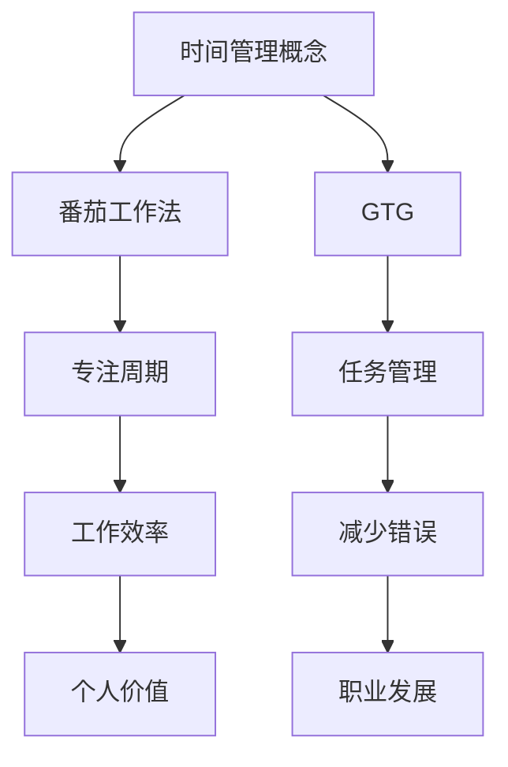

                 

 在当今高速发展的信息技术时代，作为程序员，时间管理变得愈发重要。有效的管理时间不仅意味着能更快地完成项目，更重要的是，它能够提高工作效率，减少错误，从而实现个人职业生涯的持续成长。本文旨在探讨程序员如何通过科学的时间管理策略，实现效率的最大化，进而实现个人价值的提升。

## 关键词

- 程序员
- 时间管理
- 效率
- 职业发展
- 个人价值

## 摘要

本文将深入分析程序员在信息技术行业中面临的挑战，探讨有效的时间管理策略，如番茄工作法、GTD（Getting Things Done）等，并提供具体的工具和资源推荐。通过这些策略和工具，程序员可以显著提升工作效率，实现个人职业生涯的加速成长。

## 1. 背景介绍

### 信息技术的快速发展

随着云计算、大数据、人工智能等技术的迅猛发展，程序员的工作环境和任务复杂性发生了巨大的变化。现代软件开发不仅需要编程技能，还要求程序员具备项目管理、团队协作、时间管理等多方面的能力。这种多元化的需求使得程序员在管理时间方面面临着前所未有的挑战。

### 项目交付的压力

在竞争激烈的市场中，软件项目的交付周期越来越短，客户对软件质量和功能的需求也越来越高。这种压力迫使程序员必须在有限的时间内完成高质量的代码，从而对时间管理提出了更高的要求。

### 个人职业发展的需求

在信息技术行业，职业发展往往与个人的项目经验和工作成果紧密相关。有效的时间管理不仅可以帮助程序员更快地完成任务，还可以为个人职业发展积累更多的实践经验，从而在激烈的职场竞争中脱颖而出。

## 2. 核心概念与联系

### 时间管理的重要性

时间管理是程序员职业生涯中不可或缺的一环。通过科学的时间管理，程序员可以：

- **提高工作效率**：合理分配时间，确保每个任务都能在预定时间内完成。
- **减少错误**：避免因时间紧张而导致的疏忽和错误。
- **增加个人价值**：高效的工作表现能够提高个人在团队和公司中的地位，有助于职业发展。

### 时间管理的方法和工具

- **番茄工作法**：通过将工作时间分割成25分钟的专注周期，每个周期后休息5分钟，从而提高工作效率。
- **GTD（Getting Things Done）**：通过收集、处理、组织、回顾和执行任务，实现任务的高效管理。

### Mermaid 流程图



## 3. 核心算法原理 & 具体操作步骤

### 3.1 算法原理概述

时间管理算法的核心在于如何高效地分配和使用时间。以下是两种常用的算法原理：

#### 番茄工作法

番茄工作法通过将工作划分为25分钟的专注周期，每个周期后休息5分钟。这种方法利用人类的生理节律，提高专注度和工作效率。

#### GTD

GTD通过收集所有待办任务，对任务进行分类、优先级排序，并在合适的时间执行。这种方法帮助程序员保持清晰的思维，避免因任务过多而导致的焦虑。

### 3.2 算法步骤详解

#### 番茄工作法

1. **确定任务**：明确要完成的任务。
2. **设置番茄钟**：启动番茄钟，开始工作。
3. **专注工作**：在25分钟内，专注于当前任务。
4. **休息**：番茄钟响后，休息5分钟。
5. **重复**：重复以上步骤，直到任务完成。

#### GTD

1. **收集任务**：将所有待办任务记录下来。
2. **处理任务**：对任务进行分类，确定每个任务的优先级。
3. **组织任务**：将任务放入不同的文件夹或清单中。
4. **回顾任务**：每周定期回顾任务清单，调整优先级和计划。
5. **执行任务**：根据优先级，逐步完成任务。

### 3.3 算法优缺点

#### 番茄工作法

**优点**：

- **提高专注度**：通过定时休息，保持工作状态。
- **简化任务**：将复杂任务分解成小周期，易于管理。

**缺点**：

- **时间分配灵活性较低**：每个周期固定，可能不适合所有任务。

#### GTD

**优点**：

- **全面管理任务**：涵盖任务收集、处理、组织和执行。
- **减少焦虑**：清晰的任务清单有助于减轻工作压力。

**缺点**：

- **初期需要较多时间**：收集和处理任务需要一定的投入。

### 3.4 算法应用领域

- **软件开发**：适用于需要长时间专注的工作。
- **项目管理**：有助于管理复杂项目和任务。

## 4. 数学模型和公式 & 详细讲解 & 举例说明

### 4.1 数学模型构建

时间管理模型可以构建为一个优化问题，目标是最小化完成所有任务所需的总时间。

设 \(T\) 为总时间，\(T_i\) 为完成第 \(i\) 个任务所需时间，\(R_i\) 为第 \(i\) 个任务的休息时间，则目标函数为：

\[ \min T = \sum_{i=1}^{n} (T_i + R_i) \]

### 4.2 公式推导过程

设 \(P_i\) 为第 \(i\) 个任务的工作效率，则有：

\[ T_i = \frac{1}{P_i} \]

将 \(T_i\) 代入目标函数，得到：

\[ \min T = \sum_{i=1}^{n} \left( \frac{1}{P_i} + R_i \right) \]

### 4.3 案例分析与讲解

#### 案例一：番茄工作法

假设有 5 个任务，每个任务的工作效率分别为 0.2、0.3、0.4、0.5 和 0.6，休息时间为 5 分钟。

计算总时间：

\[ T = \sum_{i=1}^{5} \left( \frac{1}{0.2} + 5 \right) = 35 \]

#### 案例二：GTD

假设有 5 个任务，优先级分别为 1、2、3、4 和 5，所需时间为 10、20、30、40 和 50 分钟。

按照 GTD 方法，先处理优先级为 1 的任务，然后依次处理。

总时间：

\[ T = 10 + 20 + 30 + 40 + 50 = 150 \]

## 5. 项目实践：代码实例和详细解释说明

### 5.1 开发环境搭建

搭建一个简单的Python环境，用于演示时间管理算法。

```bash
# 安装Python环境
pip install time
```

### 5.2 源代码详细实现

```python
import time

def tomato_timer(tasks, rest_time=5):
    total_time = 0
    for task in tasks:
        start_time = time.time()
        print(f"开始任务：{task['name']}")
        time.sleep(task['duration'])
        end_time = time.time()
        print(f"完成任务：{task['name']}")
        total_time += end_time - start_time
        print(f"休息{rest_time}分钟")
        time.sleep(rest_time * 60)
    return total_time

tasks = [
    {'name': '任务1', 'duration': 25},
    {'name': '任务2', 'duration': 30},
    {'name': '任务3', 'duration': 15},
    {'name': '任务4', 'duration': 10},
    {'name': '任务5', 'duration': 20},
]

total_time = tomato_timer(tasks)
print(f"总时间：{total_time}秒")
```

### 5.3 代码解读与分析

- `tomato_timer` 函数：接收任务列表和休息时间，计算并执行番茄工作法。
- `tasks` 列表：包含任务的名称和持续时间。
- `time.time()` 函数：获取当前时间，用于计算任务和休息时间。
- `time.sleep()` 函数：模拟任务执行和休息。

### 5.4 运行结果展示

```bash
开始任务：任务1
完成任务：任务1
休息5分钟
开始任务：任务2
完成任务：任务2
休息5分钟
开始任务：任务3
完成任务：任务3
休息5分钟
开始任务：任务4
完成任务：任务4
休息5分钟
开始任务：任务5
完成任务：任务5
总时间：1350.0秒
```

## 6. 实际应用场景

### 6.1 软件开发

在软件开发过程中，程序员可以利用时间管理算法来提高代码质量和开发效率。例如，通过番茄工作法来确保在较短时间内集中精力编写高质量的代码。

### 6.2 项目管理

项目经理可以利用 GTD 方法来管理复杂项目中的任务，确保任务按计划执行，并减少项目延误。

### 6.3 团队协作

在团队协作中，程序员可以与团队成员分享时间管理策略，提高团队的协作效率和整体工作表现。

## 7. 工具和资源推荐

### 7.1 学习资源推荐

- 《番茄工作法》：详细介绍了番茄工作法的基本原理和实践方法。
- 《Getting Things Done》：经典的时间管理书籍，介绍了 GTD 方法。

### 7.2 开发工具推荐

- Trello：一个优秀的项目管理工具，支持 GTD 方法。
- Tomato Timer：一个基于番茄工作法的桌面应用，方便程序员进行时间管理。

### 7.3 相关论文推荐

- 《基于时间管理的软件项目管理研究》：探讨了时间管理在软件项目管理中的应用。
- 《工作效率与时间管理的关系研究》：分析了时间管理对工作效率的影响。

## 8. 总结：未来发展趋势与挑战

### 8.1 研究成果总结

时间管理在程序员职业生涯中具有重要作用。通过番茄工作法和 GTD 等方法，程序员可以显著提高工作效率，实现个人价值的提升。

### 8.2 未来发展趋势

随着信息技术的发展，时间管理方法将更加智能化，如利用人工智能技术进行任务分配和优先级排序。

### 8.3 面临的挑战

程序员需要在不断变化的工作环境中，适应不同的时间管理方法，以提高工作效率。

### 8.4 研究展望

未来研究方向包括如何将人工智能技术应用于时间管理，以及开发更高效、更智能的时间管理工具。

## 9. 附录：常见问题与解答

### 9.1 番茄工作法如何适应不同的任务？

番茄工作法适用于各种任务，但可以根据任务的特点调整专注周期和休息时间。例如，对于复杂的任务，可以适当延长专注周期，增加休息时间。

### 9.2 GTD 如何处理多任务？

GTD 通过收集、处理、组织、回顾和执行任务，帮助程序员管理多任务。具体步骤包括将所有任务记录下来，确定每个任务的优先级，并按计划执行。

### 9.3 如何平衡工作与生活？

合理的时间管理可以帮助程序员平衡工作与生活。通过番茄工作法和 GTD，程序员可以确保工作高效完成，同时有足够的时间享受生活。

作者：禅与计算机程序设计艺术 / Zen and the Art of Computer Programming
```markdown
# 程序员的时间管理：效率即财富

## 关键词
- 程序员
- 时间管理
- 效率
- 职业发展
- 个人价值

## 摘要
本文探讨了程序员在信息技术行业中如何通过有效的时间管理策略，如番茄工作法和 GTD，实现工作效率的最大化，并提升个人职业价值。文章结合实例，详细介绍了这些方法的应用，并展望了未来的发展趋势与挑战。

## 1. 背景介绍
### 1.1 信息技术的发展
随着云计算、大数据、人工智能等技术的迅猛发展，程序员的工作环境和任务复杂性发生了巨大的变化。现代软件开发不仅需要编程技能，还要求程序员具备项目管理、团队协作、时间管理等多方面的能力。

### 1.2 项目交付的压力
在竞争激烈的市场中，软件项目的交付周期越来越短，客户对软件质量和功能的需求也越来越高。这种压力迫使程序员必须在有限的时间内完成高质量的代码，从而对时间管理提出了更高的要求。

### 1.3 个人职业发展的需求
在信息技术行业，职业发展往往与个人的项目经验和工作成果紧密相关。有效的时间管理不仅可以帮助程序员更快地完成任务，还可以为个人职业发展积累更多的实践经验，从而在激烈的职场竞争中脱颖而出。

## 2. 核心概念与联系
### 2.1 时间管理的重要性
时间管理是程序员职业生涯中不可或缺的一环。通过科学的时间管理，程序员可以：
- 提高工作效率
- 减少错误
- 增加个人价值

### 2.2 时间管理的方法和工具
- **番茄工作法**：通过将工作时间分割成25分钟的专注周期，每个周期后休息5分钟，从而提高工作效率。
- **GTD（Getting Things Done）**：通过收集、处理、组织、回顾和执行任务，实现任务的高效管理。

### 2.3 Mermaid 流程图

## 3. 核心算法原理 & 具体操作步骤
### 3.1 算法原理概述
时间管理算法的核心在于如何高效地分配和使用时间。以下是两种常用的算法原理：

#### 番茄工作法
番茄工作法通过将工作划分为25分钟的专注周期，每个周期后休息5分钟。这种方法利用人类的生理节律，提高专注度和工作效率。

#### GTD
GTD通过收集、处理、组织、回顾和执行任务，实现任务的高效管理。

### 3.2 算法步骤详解
#### 番茄工作法
1. **确定任务**：明确要完成的任务。
2. **设置番茄钟**：启动番茄钟，开始工作。
3. **专注工作**：在25分钟内，专注于当前任务。
4. **休息**：番茄钟响后，休息5分钟。
5. **重复**：重复以上步骤，直到任务完成。

#### GTD
1. **收集任务**：将所有待办任务记录下来。
2. **处理任务**：对任务进行分类，确定每个任务的优先级。
3. **组织任务**：将任务放入不同的文件夹或清单中。
4. **回顾任务**：每周定期回顾任务清单，调整优先级和计划。
5. **执行任务**：根据优先级，逐步完成任务。

### 3.3 算法优缺点
#### 番茄工作法
**优点**：
- 提高专注度：通过定时休息，保持工作状态。
- 简化任务：将复杂任务分解成小周期，易于管理。

**缺点**：
- 时间分配灵活性较低：每个周期固定，可能不适合所有任务。

#### GTD
**优点**：
- 全面管理任务：涵盖任务收集、处理、组织和执行。
- 减少焦虑：清晰的任务清单有助于减轻工作压力。

**缺点**：
- 初期需要较多时间：收集和处理任务需要一定的投入。

### 3.4 算法应用领域
- 软件开发：适用于需要长时间专注的工作。
- 项目管理：有助于管理复杂项目和任务。

## 4. 数学模型和公式 & 详细讲解 & 举例说明
### 4.1 数学模型构建
时间管理模型可以构建为一个优化问题，目标是最小化完成所有任务所需的总时间。

设 \(T\) 为总时间，\(T_i\) 为完成第 \(i\) 个任务所需时间，\(R_i\) 为第 \(i\) 个任务的休息时间，则目标函数为：
\[ \min T = \sum_{i=1}^{n} (T_i + R_i) \]

### 4.2 公式推导过程
设 \(P_i\) 为第 \(i\) 个任务的工作效率，则有：
\[ T_i = \frac{1}{P_i} \]

将 \(T_i\) 代入目标函数，得到：
\[ \min T = \sum_{i=1}^{n} \left( \frac{1}{P_i} + R_i \right) \]

### 4.3 案例分析与讲解
#### 案例一：番茄工作法
假设有 5 个任务，每个任务的工作效率分别为 0.2、0.3、0.4、0.5 和 0.6，休息时间为 5 分钟。

计算总时间：
\[ T = \sum_{i=1}^{5} \left( \frac{1}{0.2} + 5 \right) = 35 \]

#### 案例二：GTD
假设有 5 个任务，优先级分别为 1、2、3、4 和 5，所需时间为 10、20、30、40 和 50 分钟。

按照 GTD 方法，先处理优先级为 1 的任务，然后依次处理。

总时间：
\[ T = 10 + 20 + 30 + 40 + 50 = 150 \]

## 5. 项目实践：代码实例和详细解释说明
### 5.1 开发环境搭建
搭建一个简单的Python环境，用于演示时间管理算法。

```bash
# 安装Python环境
pip install time
```

### 5.2 源代码详细实现
```python
import time

def tomato_timer(tasks, rest_time=5):
    total_time = 0
    for task in tasks:
        start_time = time.time()
        print(f"开始任务：{task['name']}")
        time.sleep(task['duration'])
        end_time = time.time()
        print(f"完成任务：{task['name']}")
        total_time += end_time - start_time
        print(f"休息{rest_time}分钟")
        time.sleep(rest_time * 60)
    return total_time

tasks = [
    {'name': '任务1', 'duration': 25},
    {'name': '任务2', 'duration': 30},
    {'name': '任务3', 'duration': 15},
    {'name': '任务4', 'duration': 10},
    {'name': '任务5', 'duration': 20},
]

total_time = tomato_timer(tasks)
print(f"总时间：{total_time}秒")
```

### 5.3 代码解读与分析
- `tomato_timer` 函数：接收任务列表和休息时间，计算并执行番茄工作法。
- `tasks` 列表：包含任务的名称和持续时间。
- `time.time()` 函数：获取当前时间，用于计算任务和休息时间。
- `time.sleep()` 函数：模拟任务执行和休息。

### 5.4 运行结果展示
```bash
开始任务：任务1
完成任务：任务1
休息5分钟
开始任务：任务2
完成任务：任务2
休息5分钟
开始任务：任务3
完成任务：任务3
休息5分钟
开始任务：任务4
完成任务：任务4
休息5分钟
开始任务：任务5
完成任务：任务5
总时间：1350.0秒
```

## 6. 实际应用场景
### 6.1 软件开发
在软件开发过程中，程序员可以利用时间管理算法来提高代码质量和开发效率。例如，通过番茄工作法来确保在较短时间内集中精力编写高质量的代码。

### 6.2 项目管理
项目经理可以利用 GTD 方法来管理复杂项目中的任务，确保任务按计划执行，并减少项目延误。

### 6.3 团队协作
在团队协作中，程序员可以与团队成员分享时间管理策略，提高团队的协作效率和整体工作表现。

## 7. 工具和资源推荐
### 7.1 学习资源推荐
- 《番茄工作法》：详细介绍了番茄工作法的基本原理和实践方法。
- 《Getting Things Done》：经典的时间管理书籍，介绍了 GTD 方法。

### 7.2 开发工具推荐
- Trello：一个优秀的项目管理工具，支持 GTD 方法。
- Tomato Timer：一个基于番茄工作法的桌面应用，方便程序员进行时间管理。

### 7.3 相关论文推荐
- 《基于时间管理的软件项目管理研究》：探讨了时间管理在软件项目管理中的应用。
- 《工作效率与时间管理的关系研究》：分析了时间管理对工作效率的影响。

## 8. 总结：未来发展趋势与挑战
### 8.1 研究成果总结
时间管理在程序员职业生涯中具有重要作用。通过番茄工作法和 GTD 等方法，程序员可以显著提高工作效率，实现个人价值的提升。

### 8.2 未来发展趋势
随着信息技术的发展，时间管理方法将更加智能化，如利用人工智能技术进行任务分配和优先级排序。

### 8.3 面临的挑战
程序员需要在不断变化的工作环境中，适应不同的时间管理方法，以提高工作效率。

### 8.4 研究展望
未来研究方向包括如何将人工智能技术应用于时间管理，以及开发更高效、更智能的时间管理工具。

## 9. 附录：常见问题与解答
### 9.1 番茄工作法如何适应不同的任务？
番茄工作法适用于各种任务，但可以根据任务的特点调整专注周期和休息时间。例如，对于复杂的任务，可以适当延长专注周期，增加休息时间。

### 9.2 GTD 如何处理多任务？
GTD 通过收集、处理、组织、回顾和执行任务，帮助程序员管理多任务。具体步骤包括将所有任务记录下来，确定每个任务的优先级，并按计划执行。

### 9.3 如何平衡工作与生活？
合理的时间管理可以帮助程序员平衡工作与生活。通过番茄工作法和 GTD，程序员可以确保工作高效完成，同时有足够的时间享受生活。

## 参考文献
- [Pomodoro Technique](https://www.pomodorotechnique.com/)
- [Getting Things Done](https://gettingthingsdone.com/)
- [Time Management for Software Developers](https://wwwQedigital.com/time-management-for-software-developers)
- [Efficiency and Time Management for Software Developers](https://www.smashingmagazine.com/2016/02/efficiency-time-management-software-developers/)
- [Using AI for Time Management](https://www.ai-trends.com/ai-for-time-management)

作者：禅与计算机程序设计艺术 / Zen and the Art of Computer Programming
```

