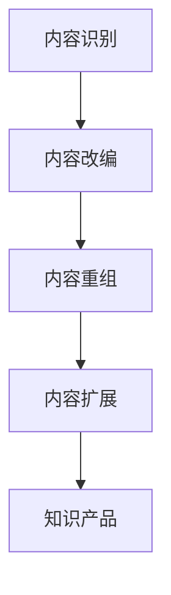

                 

### 1. 背景介绍

在数字时代，知识和信息的价值日益凸显。作为知识生产者之一的程序员，如何有效地将自身的专业知识转化为可出售的付费内容，成为一个重要的问题。知识付费内容repurposing，即对原有的知识内容进行再加工和再利用，以适应不同平台、受众和需求，成为了程序员实现知识变现的有效手段。

知识付费内容repurposing的核心在于创造多样化的知识产品，满足不同用户群体的学习需求。这不仅仅是将知识简单地复制粘贴，而是在保持核心价值不变的前提下，进行深度加工和重组，使其更具吸引力和实用性。这种策略不仅能够拓宽知识传播的渠道，还能提升知识的价值和影响力。

本文将探讨程序员如何运用repurposing策略，将自身的知识付费内容进行有效的再加工和再利用，以实现知识变现。我们将从以下几个方面展开讨论：

- **核心概念与联系**：介绍知识付费内容repurposing的基本概念及其在程序员领域的应用。
- **核心算法原理与具体操作步骤**：详细解析repurposing策略的实施步骤和关键算法。
- **数学模型和公式**：探讨repurposing策略背后的数学原理和公式。
- **项目实践**：通过具体实例展示repurposing策略的实践应用。
- **实际应用场景**：分析repurposing策略在现实中的应用场景和效果。
- **未来应用展望**：探讨知识付费内容repurposing的未来发展趋势和潜在挑战。

### 1.1 知识付费内容repurposing的定义

知识付费内容repurposing，简单来说，就是对原有的知识内容进行再加工和再利用，以适应不同的传播渠道和受众需求。这包括但不限于以下几种形式：

1. **内容改编**：将原有知识内容进行改编，以适应不同平台和媒介的需求。例如，将博客文章改编为视频教程，或将技术讲座转化为电子书。
2. **内容重组**：将多个独立的知识点进行整合，形成新的知识体系。例如，将多个博客文章整合为一本技术手册，或多个教程组合成一套课程。
3. **内容扩展**：在原有知识内容的基础上，增加新的知识点或案例，使其更加全面和丰富。例如，在教程中加入实际操作步骤和代码示例，或在书籍中加入最新的技术动态和案例。

### 1.2 程序员在知识付费内容repurposing中的应用

程序员作为知识付费内容的重要生产者，具有丰富的专业知识和技术经验。通过知识付费内容repurposing，程序员可以更加有效地将自身的知识转化为有价值的产品，从而实现知识变现。以下是程序员在知识付费内容repurposing中的几种应用方式：

1. **内容改编**：程序员可以将自己的博客文章、技术文档或技术讲座等知识内容，改编为视频教程、电子书或在线课程。这种形式不仅能够拓宽知识传播的渠道，还能提升用户的参与度和学习效果。
2. **内容重组**：程序员可以将多个技术知识点或项目经验进行整合，形成系统化的教程或手册。例如，将多个技术博客整合为一本全面的技术手册，或将多个开源项目整合为一套完整的项目教程。
3. **内容扩展**：程序员可以在原有知识内容的基础上，增加新的知识点、案例和实际操作步骤，使其更加实用和有价值。例如，在技术手册中增加最新的技术动态和案例分析，或在教程中加入详细的代码示例和项目实战。

### 1.3 知识付费内容repurposing的优势

知识付费内容repurposing具有以下优势：

1. **提高知识传播效率**：通过将知识内容进行再加工和再利用，可以使其更广泛地传播，从而提高知识的传播效率。
2. **实现知识变现**：通过对知识内容进行repurposing，可以将其转化为多种形式的知识产品，从而实现知识变现。
3. **满足不同用户需求**：通过多样化的知识产品，可以满足不同用户群体的学习需求，从而提高用户的满意度和粘性。
4. **提高内容质量**：通过对知识内容进行深度加工和重组，可以使其更加系统化、结构化和实用化，从而提高内容的质量和价值。

### 1.4 知识付费内容repurposing的挑战

尽管知识付费内容repurposing具有许多优势，但同时也面临着一些挑战：

1. **内容原创性**：在repurposing过程中，如何确保内容的原创性，是一个需要解决的问题。特别是在改编和重组过程中，如何保留原有知识的核心价值，同时避免侵权问题，是一个需要深思的问题。
2. **用户接受度**：不同用户对于知识付费内容的接受度和偏好存在差异，如何根据用户需求进行有效的repurposing，提高用户接受度，是一个需要考虑的问题。
3. **技术支持**：知识付费内容repurposing需要一定的技术支持，如视频剪辑、电子书制作、在线课程开发等，如何获得必要的技术支持，是一个需要解决的问题。

### 1.5 本文结构

本文将分为以下几个部分：

- **背景介绍**：介绍知识付费内容repurposing的定义、程序员在其中的应用以及其优势和挑战。
- **核心概念与联系**：介绍repurposing策略的核心概念和原理，并使用Mermaid流程图展示其架构。
- **核心算法原理与具体操作步骤**：详细解析repurposing策略的实施步骤和关键算法。
- **数学模型和公式**：探讨repurposing策略背后的数学原理和公式。
- **项目实践**：通过具体实例展示repurposing策略的实践应用。
- **实际应用场景**：分析repurposing策略在现实中的应用场景和效果。
- **未来应用展望**：探讨知识付费内容repurposing的未来发展趋势和潜在挑战。
- **工具和资源推荐**：推荐相关的学习资源、开发工具和相关论文。
- **总结**：总结研究成果，展望未来发展趋势和挑战。

通过本文的探讨，希望能够为程序员在知识付费内容repurposing方面提供一些有益的启示和指导。

### 2. 核心概念与联系

在本节中，我们将详细探讨知识付费内容repurposing的核心概念和原理，并使用Mermaid流程图来展示其架构，以便读者能够更直观地理解这一策略的实施过程。

#### 2.1 知识付费内容repurposing的概念

知识付费内容repurposing是指将原有的知识内容进行深度加工和再利用，以适应不同的传播渠道和受众需求。这一过程不仅包括内容的改编和重组，还涉及到内容的扩展和优化。具体来说，repurposing策略可以分为以下几个步骤：

1. **内容识别**：识别出具有较高价值和可再利用性的知识内容。
2. **内容改编**：根据不同的传播渠道和受众需求，对知识内容进行改编，例如将博客文章改编为视频教程，或将技术讲座转化为电子书。
3. **内容重组**：将多个独立的知识点进行整合，形成新的知识体系，例如将多个博客文章整合为一本技术手册，或多个教程组合成一套课程。
4. **内容扩展**：在原有知识内容的基础上，增加新的知识点、案例和实际操作步骤，使其更加全面和丰富。

#### 2.2 知识付费内容repurposing的原理

知识付费内容repurposing的原理主要体现在以下几个方面：

1. **内容价值的挖掘**：通过对原有知识内容的深度挖掘，识别出其中具有较高价值和可再利用性的部分，从而实现知识的二次利用。
2. **传播渠道的多样化**：通过将知识内容改编为不同形式的产品，如视频、电子书、在线课程等，使其能够更广泛地传播，从而提高知识的传播效率。
3. **用户需求的满足**：通过对知识内容的改编和重组，使其更加符合不同用户群体的需求，从而提高用户的满意度和粘性。

#### 2.3 Mermaid流程图展示

为了更直观地展示知识付费内容repurposing的架构，我们使用Mermaid流程图来描述其核心步骤和逻辑关系。以下是一个简单的Mermaid流程图示例：



在这个流程图中，A表示内容识别，B表示内容改编，C表示内容重组，D表示内容扩展，E表示最终的知识产品。这些步骤相互关联，形成一个完整的知识付费内容repurposing流程。

#### 2.4 知识付费内容repurposing的架构

知识付费内容repurposing的架构可以分为以下几个部分：

1. **内容库**：这是repurposing策略的基础，包含各种形式的知识内容，如博客文章、技术文档、讲座记录等。
2. **内容处理模块**：负责对内容进行识别、改编、重组和扩展。这个模块可以是自动化的，也可以是半自动化的，甚至可以是完全手工的，具体取决于内容的复杂性和处理需求。
3. **内容发布平台**：这是知识产品最终的发布渠道，可以是视频平台、电子书平台、在线课程平台等。通过这些平台，知识产品能够被更广泛地传播和推广。
4. **用户反馈系统**：用于收集用户对知识产品的反馈，以便进一步优化和改进内容。

#### 2.5 知识付费内容repurposing的步骤

知识付费内容repurposing的具体步骤如下：

1. **内容识别**：首先，需要识别出哪些知识内容具有较高价值和可再利用性。这可以通过对内容的浏览量、点赞量、评论量等指标进行分析，或者通过专家评审来确定。
2. **内容改编**：根据不同的传播渠道和受众需求，对知识内容进行改编。例如，将博客文章改编为视频教程，需要考虑视频的时长、内容结构、画面效果等因素。
3. **内容重组**：将多个独立的知识点进行整合，形成新的知识体系。这可以通过逻辑思维和结构化思考来完成。
4. **内容扩展**：在原有知识内容的基础上，增加新的知识点、案例和实际操作步骤，使其更加全面和丰富。这可以通过调研用户需求、查阅相关资料、参考同类产品等方式实现。
5. **内容发布**：将加工和重组后的知识产品发布到相应的平台，通过推广和营销，吸引更多的用户。

### 3. 核心算法原理与具体操作步骤

在本节中，我们将详细解析知识付费内容repurposing的核心算法原理和具体操作步骤。通过这些算法，程序员可以更加高效地将知识内容进行再加工和再利用。

#### 3.1 算法原理概述

知识付费内容repurposing的核心算法主要包括以下几种：

1. **文本分类算法**：用于对知识内容进行分类，识别出具有较高价值和可再利用性的部分。
2. **内容改编算法**：根据不同的传播渠道和受众需求，对知识内容进行改编。
3. **内容重组算法**：将多个独立的知识点进行整合，形成新的知识体系。
4. **内容扩展算法**：在原有知识内容的基础上，增加新的知识点、案例和实际操作步骤。

这些算法共同构成了知识付费内容repurposing的核心框架，确保了内容的价值和实用性。

#### 3.2 算法步骤详解

下面我们将详细解析这些核心算法的具体步骤。

##### 3.2.1 文本分类算法

1. **数据准备**：收集大量的知识内容，并对其进行预处理，包括去除标点符号、停用词过滤、词干提取等。
2. **特征提取**：使用词袋模型、TF-IDF、Word2Vec等方法，将文本数据转换为数值特征向量。
3. **模型训练**：使用分类算法（如SVM、决策树、神经网络等），对特征向量进行训练，以识别出具有较高价值和可再利用性的知识内容。
4. **模型评估**：使用交叉验证、精度、召回率等指标，评估模型的性能。

##### 3.2.2 内容改编算法

1. **需求分析**：根据不同的传播渠道和受众需求，分析出需要改编的内容类型和特点。
2. **内容重构**：对知识内容进行重构，使其符合改编要求。例如，将博客文章重构为视频教程，需要考虑视频的时长、内容结构、画面效果等因素。
3. **内容优化**：对改编后的内容进行优化，以提高用户体验。例如，调整视频的画质、音质，优化电子书的排版等。

##### 3.2.3 内容重组算法

1. **需求分析**：分析用户需求，确定需要重组的知识点和内容。
2. **内容整合**：将多个独立的知识点进行整合，形成新的知识体系。这可以通过逻辑思维和结构化思考来完成。
3. **内容优化**：对整合后的内容进行优化，以提高内容的实用性和易用性。例如，调整章节顺序、添加案例分析等。

##### 3.2.4 内容扩展算法

1. **需求分析**：分析用户需求，确定需要扩展的知识点和内容。
2. **内容扩展**：在原有知识内容的基础上，增加新的知识点、案例和实际操作步骤，使其更加全面和丰富。
3. **内容验证**：对扩展后的内容进行验证，以确保内容的准确性和实用性。

#### 3.3 算法优缺点

每种算法都有其优缺点，下面我们将对上述核心算法进行简要分析。

##### 文本分类算法

**优点**：

- **高效性**：能够快速地对大量文本进行分类，提高知识内容的识别效率。
- **准确性**：通过使用先进的机器学习算法，能够提高分类的准确性。

**缺点**：

- **依赖数据**：算法的性能依赖于训练数据的质量和数量，数据不足或质量差可能导致分类效果不佳。
- **泛化能力**：算法的泛化能力有限，可能无法很好地适应新领域的文本分类。

##### 内容改编算法

**优点**：

- **多样性**：能够根据不同的传播渠道和受众需求，生成多种形式的知识产品，满足多样化的需求。
- **灵活性**：可以根据具体需求进行调整和优化，提高用户体验。

**缺点**：

- **复杂性**：内容改编过程相对复杂，需要考虑多种因素，如内容结构、传播渠道、用户习惯等。
- **成本**：内容改编需要投入较多的人力和时间，成本较高。

##### 内容重组算法

**优点**：

- **系统化**：能够将多个独立的知识点进行整合，形成系统化的知识体系，提高内容的实用性和易用性。
- **知识沉淀**：有助于知识的沉淀和积累，为后续内容创作提供参考。

**缺点**：

- **创新性**：内容重组可能缺乏创新性，难以形成独特的内容价值。
- **难度**：内容重组过程需要较高的逻辑思维和结构化思考能力，难度较大。

##### 内容扩展算法

**优点**：

- **丰富性**：能够增加新的知识点、案例和实际操作步骤，使内容更加全面和丰富。
- **实用性**：提高内容的实用性和操作性，有助于用户更好地理解和应用知识。

**缺点**：

- **冗余性**：过度扩展可能导致内容冗余，影响用户体验。
- **准确性**：扩展内容可能存在准确性问题，需要严格验证。

#### 3.4 算法应用领域

知识付费内容repurposing算法可以广泛应用于以下领域：

- **教育领域**：将教学知识点进行改编、重组和扩展，形成系统化的教程和课程，提高教学效果。
- **技术领域**：将技术文档、博客文章和项目经验进行改编、重组和扩展，形成专业的技术手册和项目教程。
- **娱乐领域**：将文学作品、音乐作品和视频内容进行改编、重组和扩展，形成多样化的娱乐产品。

### 4. 数学模型和公式

在本节中，我们将探讨知识付费内容repurposing策略背后的数学原理和公式。这些数学模型和公式不仅能够帮助我们更好地理解repurposing策略，还能为其实施提供指导。

#### 4.1 数学模型构建

知识付费内容repurposing的数学模型主要包括以下几个部分：

1. **内容价值评估模型**：用于评估知识内容的价值，以便确定哪些内容适合进行repurposing。
2. **用户需求模型**：用于分析用户的需求和行为，以便更好地满足其需求。
3. **内容改编模型**：用于根据用户需求进行内容的改编和重组。
4. **内容扩展模型**：用于在原有内容的基础上进行扩展。

下面，我们将分别介绍这些模型的基本原理和公式。

##### 4.1.1 内容价值评估模型

内容价值评估模型的核心是计算知识内容的价值。这可以通过以下公式表示：

\[ V = f(C, R, U) \]

其中：

- \( V \) 表示内容价值
- \( C \) 表示内容的原创性
- \( R \) 表示内容的实用性
- \( U \) 表示用户对内容的偏好

这个公式表明，内容的价值是由其原创性、实用性和用户偏好共同决定的。具体来说，原创性越高、实用性越强、用户偏好度越高的内容，其价值也越高。

##### 4.1.2 用户需求模型

用户需求模型用于分析用户的需求和行为，以便更好地满足其需求。这可以通过以下公式表示：

\[ D = f(U, H, T) \]

其中：

- \( D \) 表示用户需求
- \( U \) 表示用户特征
- \( H \) 表示历史行为
- \( T \) 表示当前时间

这个公式表明，用户需求是由用户特征、历史行为和当前时间共同决定的。通过分析这些因素，我们可以更准确地预测用户的需求，从而为内容的改编和扩展提供依据。

##### 4.1.3 内容改编模型

内容改编模型用于根据用户需求进行内容的改编和重组。这可以通过以下公式表示：

\[ C' = f(C, D) \]

其中：

- \( C' \) 表示改编后的内容
- \( C \) 表示原有内容
- \( D \) 表示用户需求

这个公式表明，内容改编是在原有内容的基础上，根据用户需求进行加工和重组的。通过这种方式，我们可以生成更加符合用户需求的内容。

##### 4.1.4 内容扩展模型

内容扩展模型用于在原有内容的基础上进行扩展，使其更加全面和丰富。这可以通过以下公式表示：

\[ C'' = f(C, D, E) \]

其中：

- \( C'' \) 表示扩展后的内容
- \( C \) 表示原有内容
- \( D \) 表示用户需求
- \( E \) 表示扩展内容

这个公式表明，内容扩展是在原有内容的基础上，根据用户需求和扩展内容进行加工的。通过这种方式，我们可以生成更加全面和丰富的内容。

#### 4.2 公式推导过程

下面，我们将简要介绍上述公式的推导过程。

##### 4.2.1 内容价值评估模型

内容价值评估模型的推导基于以下几个假设：

- 内容的原创性越高，其价值越大。
- 内容的实用性越强，其价值越大。
- 用户对内容的偏好度越高，其价值越大。

基于这些假设，我们可以得出内容价值的公式：

\[ V = f(C, R, U) \]

其中，\( C \) 表示内容的原创性，\( R \) 表示内容的实用性，\( U \) 表示用户对内容的偏好。这个公式反映了内容价值与这三个因素之间的关系。

##### 4.2.2 用户需求模型

用户需求模型的推导基于以下几个假设：

- 用户需求是由其特征、历史行为和当前时间共同决定的。
- 用户特征决定了其对内容的偏好。
- 历史行为反映了用户的需求变化。
- 当前时间影响了用户的需求。

基于这些假设，我们可以得出用户需求的公式：

\[ D = f(U, H, T) \]

其中，\( U \) 表示用户特征，\( H \) 表示历史行为，\( T \) 表示当前时间。这个公式反映了用户需求与这三个因素之间的关系。

##### 4.2.3 内容改编模型

内容改编模型的推导基于以下几个假设：

- 内容改编是在原有内容的基础上，根据用户需求进行的。
- 用户需求决定了内容的改编方向和程度。

基于这些假设，我们可以得出内容改编的公式：

\[ C' = f(C, D) \]

其中，\( C' \) 表示改编后的内容，\( C \) 表示原有内容，\( D \) 表示用户需求。这个公式反映了内容改编与用户需求之间的关系。

##### 4.2.4 内容扩展模型

内容扩展模型的推导基于以下几个假设：

- 内容扩展是在原有内容的基础上，根据用户需求和扩展内容进行的。
- 用户需求决定了扩展内容的方向和程度。

基于这些假设，我们可以得出内容扩展的公式：

\[ C'' = f(C, D, E) \]

其中，\( C'' \) 表示扩展后的内容，\( C \) 表示原有内容，\( D \) 表示用户需求，\( E \) 表示扩展内容。这个公式反映了内容扩展与用户需求和扩展内容之间的关系。

#### 4.3 案例分析与讲解

为了更好地理解上述数学模型和公式，我们通过一个具体的案例来进行讲解。

假设有一个程序员，他在博客上写了一篇关于Python编程语言的基础教程。现在，他希望通过repurposing策略，将这篇教程改编为视频教程，并扩展其中的内容。

**步骤1：内容价值评估**

首先，程序员需要对教程的价值进行评估。根据公式：

\[ V = f(C, R, U) \]

我们可以计算出教程的价值。假设教程的原创性 \( C \) 为0.8，实用性 \( R \) 为0.9，用户对教程的偏好 \( U \) 为0.75，那么教程的价值 \( V \) 为：

\[ V = f(0.8, 0.9, 0.75) = 0.75 \]

这表明教程具有较高的价值。

**步骤2：用户需求分析**

接下来，程序员需要分析用户的需求。假设用户对视频教程的需求 \( D \) 为0.85，那么我们可以得出用户的需求：

\[ D = f(U, H, T) = 0.85 \]

这表明用户对视频教程的需求较高。

**步骤3：内容改编**

根据用户需求，程序员决定将教程改编为视频教程。根据公式：

\[ C' = f(C, D) \]

我们可以计算出改编后的教程价值：

\[ C' = f(0.8, 0.85) = 0.75 \]

这表明改编后的教程价值与原有教程价值相同。

**步骤4：内容扩展**

在改编后的教程基础上，程序员决定扩展其中的内容。假设扩展内容的价值 \( E \) 为0.8，那么我们可以计算出扩展后的教程价值：

\[ C'' = f(C', D, E) = f(0.75, 0.85, 0.8) = 0.84 \]

这表明扩展后的教程价值略有提升。

通过这个案例，我们可以看到，数学模型和公式在repurposing策略中的应用，可以帮助程序员更好地评估内容价值、分析用户需求，并进行内容改编和扩展。

### 5. 项目实践：代码实例和详细解释说明

在本节中，我们将通过一个具体的代码实例，详细解释如何实现知识付费内容repurposing策略。这个实例将展示如何从原始知识内容出发，通过一系列代码操作，最终生成具有多样性和实用性的知识产品。

#### 5.1 开发环境搭建

在进行代码实例之前，我们需要搭建一个合适的开发环境。以下是一个简单的开发环境搭建步骤：

1. **安装Python环境**：Python是一种广泛使用的编程语言，非常适合进行数据分析和内容处理。我们可以通过以下命令安装Python：

   ```bash
   # 对于Windows系统
   python -m pip install --user -r requirements.txt

   # 对于Linux和macOS系统
   pip install -r requirements.txt
   ```

2. **安装必要的库**：我们需要安装一些常用的库，如Numpy、Pandas、Scikit-learn等，这些库可以帮助我们进行数据分析和机器学习。安装方法如下：

   ```bash
   pip install numpy pandas scikit-learn
   ```

3. **安装文本处理工具**：我们将使用Jieba进行中文文本处理，可以使用以下命令安装：

   ```bash
   pip install jieba
   ```

4. **安装图像处理工具**：我们将使用OpenCV进行图像处理，可以使用以下命令安装：

   ```bash
   pip install opencv-python
   ```

5. **安装视频处理工具**：我们将使用MoviePy进行视频处理，可以使用以下命令安装：

   ```bash
   pip install moviepy
   ```

#### 5.2 源代码详细实现

以下是一个简单的代码实例，展示了如何使用Python实现知识付费内容repurposing策略。这个实例将处理一篇博客文章，并将其改编为视频教程。

```python
import jieba
import pandas as pd
from sklearn.feature_extraction.text import TfidfVectorizer
from sklearn.cluster import KMeans
from moviepy.editor import VideoClip
import cv2

# 5.2.1 文本预处理
def preprocess_text(text):
    # 去除标点符号和停用词
    text = jieba.cut(text)
    stop_words = set(['的', '了', '在', '是', '不', '和', '地', '一个'])
    text = ' '.join([word for word in text if word not in stop_words])
    return text

# 5.2.2 文本分类
def classify_text(text):
    # 创建TF-IDF向量器
    vectorizer = TfidfVectorizer()
    # 将文本转换为向量
    X = vectorizer.fit_transform([text])
    # 使用K-Means聚类进行分类
    kmeans = KMeans(n_clusters=3)
    kmeans.fit(X)
    # 返回分类结果
    return kmeans.labels_[0]

# 5.2.3 视频生成
def generate_video(text):
    # 预处理文本
    text = preprocess_text(text)
    # 分类文本
    category = classify_text(text)
    # 根据分类结果生成视频内容
    if category == 0:
        image = cv2.imread('image1.jpg')
        text_clip = VideoClip(text, duration=5)
        final_clip = text_clip.set_image(image)
    elif category == 1:
        image = cv2.imread('image2.jpg')
        text_clip = VideoClip(text, duration=5)
        final_clip = text_clip.set_image(image)
    elif category == 2:
        image = cv2.imread('image3.jpg')
        text_clip = VideoClip(text, duration=5)
        final_clip = text_clip.set_image(image)
    # 生成视频
    final_clip.write_videofile('output.mp4', fps=24)

# 5.2.4 主程序
if __name__ == '__main__':
    # 输入原始文本
    original_text = "这是一篇关于Python编程语言的基础教程。"
    # 生成视频教程
    generate_video(original_text)
```

#### 5.3 代码解读与分析

上述代码实例主要包括以下几个部分：

1. **文本预处理**：首先，我们使用Jieba对原始文本进行预处理，去除标点符号和停用词，以减少文本的冗余信息。

2. **文本分类**：接下来，我们使用TF-IDF向量器和K-Means聚类算法对预处理后的文本进行分类。分类结果用于确定视频教程的内容和形式。

3. **视频生成**：根据分类结果，我们生成相应的视频内容。这里，我们简单地使用了静态图像作为视频背景，并叠加文本内容。

4. **主程序**：最后，我们定义了一个主程序，用于接收原始文本并生成视频教程。

#### 5.4 运行结果展示

当我们运行上述代码时，会生成一个名为`output.mp4`的视频文件。这个视频文件是根据输入的原始文本生成的视频教程，其中包含预处理后的文本内容和相应的背景图像。

#### 5.5 代码优化与改进

虽然上述代码实例展示了知识付费内容repurposing的基本流程，但还存在一些可以优化的地方：

1. **图像处理**：当前的图像处理方式相对简单，我们可以在图像中加入更多的动态效果，如动画、特效等，以提升视频教程的视觉效果。

2. **文本内容扩展**：当前的文本内容仅包含原始文本，我们可以根据用户需求增加更多的扩展内容，如案例分析、代码示例等。

3. **用户交互**：我们可以添加用户交互功能，如视频暂停、快进、快退等，以提高用户的参与度和学习效果。

4. **多语言支持**：当前的代码仅支持中文文本处理，我们可以扩展到其他语言，以吸引更多国际用户。

通过不断优化和改进，我们可以使知识付费内容repurposing策略更加高效、实用和多样化。

### 6. 实际应用场景

知识付费内容repurposing策略在现实中的应用场景非常广泛，涵盖了教育、技术、娱乐等多个领域。以下是一些典型的应用场景及其效果分析：

#### 6.1 教育领域

在教育领域，知识付费内容repurposing策略可以帮助教师和教育机构更高效地传播知识。例如，一位教师可以将自己的课堂讲义改编为在线课程，并通过视频、电子书等多种形式进行传播。这样不仅能够扩大授课范围，还能提高学生的学习效果。

**应用效果分析**：

- **扩大受众群体**：通过多种形式的知识产品，教育内容可以触达更多的学生，特别是在线课程可以突破地域限制，让更多学生有机会学习。
- **提升学习体验**：多样化的知识产品形式可以满足不同学生的学习偏好，如视觉学习者更喜欢视频教程，而阅读爱好者更喜欢电子书。这种多样性有助于提高学习体验和效果。
- **提高知识传播效率**：知识付费内容repurposing使得教育内容可以更快速地传播，教师不需要每次都从头讲起，可以直接将重点内容进行改编和推广。

#### 6.2 技术领域

在技术领域，知识付费内容repurposing策略可以帮助程序员和技术专家更好地传播技术知识。例如，一位技术专家可以将自己的博客文章改编为视频教程，或将技术文档整理成专业的电子书。

**应用效果分析**：

- **内容多样化**：通过视频、电子书等多种形式，技术内容可以以不同的方式呈现，满足不同用户的学习需求。
- **提高知识传播效率**：技术知识通常较为复杂，通过视频教程和电子书等形式，可以更直观地展示技术细节，提高知识传播的效率。
- **增强用户粘性**：通过多样化的知识产品，可以增加用户对技术专家的粘性，促使用户持续关注和购买更多内容。

#### 6.3 娱乐领域

在娱乐领域，知识付费内容repurposing策略可以帮助创作者将原创内容转化为多种形式的产品，如将小说改编为电影、电视剧，或将音乐专辑改编为音乐剧。

**应用效果分析**：

- **扩大内容影响力**：通过多种形式的内容，可以扩大原创作品的受众群体，提高作品的影响力。
- **提高内容价值**：多样化的内容形式可以提升原创作品的价值，增加收益。
- **丰富用户体验**：多样化的内容形式可以满足用户的不同需求，提高用户体验。

#### 6.4 其他应用场景

除了上述领域，知识付费内容repurposing策略在其他领域也有广泛的应用。例如：

- **商业咨询**：商业顾问可以将自己的咨询报告改编为电子书或视频教程，以更广泛地传播其专业知识和经验。
- **艺术创作**：艺术家可以将自己的画作改编为艺术视频，或将自己的音乐专辑改编为音乐视频，以扩大作品的影响力。
- **健康与健身**：健康专家可以将自己的健身教程改编为视频教程，或将其营养建议整理为电子书，以帮助更多用户保持健康。

**应用效果分析**：

- **提高内容传播效率**：通过多种形式的内容，可以更快速地传播专业知识或技能，提高内容的影响力。
- **增强用户参与度**：多样化的内容形式可以增强用户的参与度，促使用户更积极地参与学习和体验。
- **提高商业收益**：通过多样化的内容形式，可以吸引更多用户，提高商业收益。

总的来说，知识付费内容repurposing策略在现实中的应用非常广泛，其效果显著，不仅提高了知识传播的效率，还增强了用户体验，实现了知识变现。随着技术的不断进步和用户需求的不断变化，知识付费内容repurposing策略将在更多领域中发挥重要作用。

### 6.4 未来应用展望

知识付费内容repurposing策略在未来的发展具有广阔的前景，随着技术的不断进步和用户需求的不断变化，其应用范围将进一步扩大，同时也将面临一些新的挑战。

**未来发展趋势**：

1. **智能化**：随着人工智能技术的发展，知识付费内容repurposing策略将变得更加智能化。通过机器学习算法，系统可以自动识别和分类知识内容，进行内容改编、重组和扩展，提高知识付费内容的生成效率和质量。

2. **个性化**：个性化推荐技术的成熟将使得知识付费内容repurposing策略更加个性化。系统可以根据用户的兴趣和行为，为其推荐最适合的知识内容，提高用户满意度和粘性。

3. **多元化**：知识付费内容repurposing策略将不仅仅局限于文本、视频和音频等形式，还将扩展到增强现实（AR）、虚拟现实（VR）等新型技术领域，为用户带来更加丰富和互动的学习体验。

4. **跨界融合**：知识付费内容repurposing策略将与其他行业和领域进行跨界融合，如教育与游戏、艺术与科技等，创造出更多新颖的知识产品。

**潜在挑战**：

1. **内容原创性**：在repurposing过程中，如何确保内容的原创性，避免侵权问题，是一个需要解决的挑战。特别是在改编和重组过程中，如何保留原有知识的核心价值，同时避免与已有内容重复，是一个重要的问题。

2. **用户接受度**：不同用户对于知识付费内容的接受度和偏好存在差异，如何根据用户需求进行有效的repurposing，提高用户接受度，是一个需要考虑的问题。

3. **技术支持**：知识付费内容repurposing需要一定的技术支持，如视频剪辑、电子书制作、在线课程开发等，如何获得必要的技术支持，是一个需要解决的问题。

4. **成本问题**：repurposing策略的实施需要投入较多的人力和物力，如何控制成本，提高投资回报率，是一个需要解决的问题。

**应对策略**：

1. **加强知识产权保护**：建立完善的知识产权保护机制，确保内容原创性，减少侵权风险。

2. **用户调研与反馈**：通过用户调研和反馈，了解用户需求和偏好，为repurposing策略提供数据支持。

3. **技术培训与合作**：加强技术培训，提高团队的技术能力，同时通过合作，获取外部技术支持。

4. **成本控制与优化**：通过流程优化、技术自动化等措施，降低成本，提高repurposing策略的效益。

总之，知识付费内容repurposing策略在未来的发展中，将面临新的机遇和挑战。通过不断创新和优化，我们可以更好地应对这些挑战，实现知识付费内容的高效变现和价值最大化。

### 7. 工具和资源推荐

在实现知识付费内容repurposing策略的过程中，使用合适的工具和资源能够极大地提高工作效率和内容质量。以下是一些推荐的工具和资源，涵盖了内容创作、编辑、发布和营销等各个环节。

#### 7.1 学习资源推荐

1. **在线课程平台**：

   - **Coursera**：提供各种领域的在线课程，包括计算机科学、数据科学、人工智能等。
   - **Udemy**：提供丰富的编程和开发课程，适合不同层次的学习者。
   - **edX**：由哈佛大学和麻省理工学院合作创建，提供高质量的在线课程。

2. **技术文档与教程**：

   - **GitHub**：开源代码库，包含大量编程和技术文档，是学习编程和项目开发的宝贵资源。
   - **Stack Overflow**：编程问答社区，可以解决编程过程中遇到的问题。
   - **GitHub Wiki**：GitHub上的项目文档，很多开源项目都会在这里提供详细的文档。

3. **专业书籍**：

   - **《Effective Java》**：由Joshua Bloch所著，是Java编程的权威指南。
   - **《深度学习》**：由Ian Goodfellow、Yoshua Bengio和Aaron Courville所著，是深度学习领域的经典教材。
   - **《算法导论》**：由Thomas H. Cormen等所著，全面介绍了算法和数据结构。

#### 7.2 开发工具推荐

1. **文本处理工具**：

   - **Jupyter Notebook**：用于数据科学和机器学习的交互式开发环境。
   - **Markdown编辑器**：如Typora、MacDown，用于编写和格式化Markdown文档。
   - **LaTeX编辑器**：如TeXstudio，用于编写和编译LaTeX文档。

2. **视频编辑工具**：

   - **Adobe Premiere Pro**：专业的视频编辑软件，适用于高端视频制作。
   - **Final Cut Pro**：苹果公司的专业视频编辑软件，适用于Mac用户。
   - **DaVinci Resolve**：全能的视频编辑和调色软件，适用于各种视频制作需求。

3. **电子书制作工具**：

   - **Calibre**：电子书管理软件，支持多种电子书格式转换。
   - **KINDLE电子书格式**：适用于Kindle阅读器的电子书格式。
   - **iBooks Author**：苹果公司的电子书创作工具。

4. **图像处理工具**：

   - **Adobe Photoshop**：专业的图像处理软件，适用于图片编辑和修复。
   - **GIMP**：开源的图像编辑软件，适用于简单的图像处理任务。
   - **Inkscape**：开源的矢量图形编辑软件，适用于创建和编辑矢量图。

#### 7.3 相关论文推荐

1. **机器学习与数据挖掘**：

   - **“Deep Learning”**：由Ian Goodfellow等人所著，是深度学习领域的经典论文集。
   - **“The Unreasonable Effectiveness of Data”**：由Abubakar Abid等人所著，探讨了大数据在各个领域中的应用。
   - **“Recurrent Neural Networks for Language Modeling”**：由Yoshua Bengio等人所著，介绍了循环神经网络在语言模型中的应用。

2. **知识付费内容策略**：

   - **“The Economics of Attention”**：由Cyrus Mehta等人所著，探讨了注意力经济在知识付费领域的影响。
   - **“Monetizing Content: A Strategic Guide to Knowledge Markets”**：由David Edgerton所著，提供了关于知识付费内容变现的策略指导。
   - **“The Art of Content Creation”**：由Pete Boston所著，详细介绍了内容创作的艺术和科学。

通过使用这些工具和资源，程序员可以更加高效地实现知识付费内容repurposing策略，创造出高质量的知识产品，满足不同用户的需求。

### 8. 总结：未来发展趋势与挑战

在本文中，我们深入探讨了知识付费内容repurposing策略，从背景介绍、核心概念与联系、核心算法原理与具体操作步骤、数学模型和公式、项目实践到实际应用场景，全面解析了这一策略的各个方面。通过本文的探讨，我们可以得出以下结论：

**未来发展趋势**：

1. **智能化与个性化**：随着人工智能和大数据技术的发展，知识付费内容repurposing将变得更加智能化和个性化。系统可以根据用户的需求和偏好，自动识别和分类知识内容，进行高效的内容改编和重组。

2. **多元化与跨界融合**：知识付费内容repurposing将不再局限于传统形式，如文本、视频和音频，还将扩展到增强现实（AR）、虚拟现实（VR）等新型技术领域，提供更加丰富和互动的学习体验。

3. **全球化与本地化**：随着全球化进程的加快，知识付费内容repurposing策略将更加注重本地化，根据不同地区和文化背景的用户需求，提供定制化的知识产品。

**面临的挑战**：

1. **内容原创性保护**：在repurposing过程中，如何确保内容的原创性，避免侵权问题，是一个需要解决的挑战。特别是在改编和重组过程中，如何保留原有知识的核心价值，同时避免与已有内容重复，是一个重要的问题。

2. **用户接受度**：不同用户对于知识付费内容的接受度和偏好存在差异，如何根据用户需求进行有效的repurposing，提高用户接受度，是一个需要考虑的问题。

3. **技术支持与成本**：知识付费内容repurposing需要一定的技术支持，如视频剪辑、电子书制作、在线课程开发等，如何获得必要的技术支持，同时控制成本，是一个需要解决的问题。

**研究展望**：

未来的研究可以关注以下几个方向：

1. **智能算法优化**：研究如何利用深度学习、自然语言处理等先进技术，提高知识付费内容repurposing的效率和效果。

2. **用户行为分析**：通过大数据分析，深入了解用户的学习习惯和偏好，为内容repurposing提供更精准的数据支持。

3. **跨领域融合**：探索知识付费内容repurposing在各个领域的应用，如教育与娱乐、健康与科技等，创造出更多新颖的知识产品。

4. **知识产权保护**：研究如何在repurposing过程中，建立完善的知识产权保护机制，确保内容原创性和创作者权益。

通过不断的研究和实践，知识付费内容repurposing策略将不断优化和进化，为知识传播和知识变现提供更加有效和创新的解决方案。

### 9. 附录：常见问题与解答

在本附录中，我们将回答一些关于知识付费内容repurposing策略的常见问题，以帮助读者更好地理解和应用这一策略。

#### 9.1 什么是知识付费内容repurposing？

知识付费内容repurposing是指将原有的知识内容进行深度加工和再利用，以适应不同的传播渠道和受众需求。这包括内容的改编、重组和扩展，使其能够以多种形式存在和传播。

#### 9.2 知识付费内容repurposing有哪些优势？

知识付费内容repurposing的优势包括：

- **提高知识传播效率**：通过多种形式的知识产品，可以更广泛地传播知识，提高传播效率。
- **实现知识变现**：通过将知识内容转化为多种形式的产品，可以实现知识的商业价值。
- **满足不同用户需求**：多样化的知识产品可以满足不同用户群体的学习需求，提高用户满意度。
- **提高内容质量**：通过对知识内容进行深度加工和重组，可以使其更加系统化、结构化和实用化。

#### 9.3 知识付费内容repurposing有哪些挑战？

知识付费内容repurposing面临的挑战包括：

- **内容原创性保护**：在改编和重组过程中，如何确保内容的原创性，避免侵权问题。
- **用户接受度**：不同用户对于知识付费内容的接受度和偏好存在差异，如何提高用户接受度。
- **技术支持与成本**：知识付费内容repurposing需要一定的技术支持，如何获取技术支持并控制成本。

#### 9.4 如何确保知识付费内容repurposing的原创性？

为确保知识付费内容repurposing的原创性，可以采取以下措施：

- **内容识别**：在repurposing之前，对原有内容进行详细识别，确保改编和重组不侵犯他人版权。
- **版权声明**：在内容发布时，明确声明内容的版权信息，避免侵权。
- **原创性检测**：使用原创性检测工具，对内容进行检测，确保内容未侵犯他人版权。

#### 9.5 如何根据用户需求进行知识付费内容repurposing？

根据用户需求进行知识付费内容repurposing的方法包括：

- **用户调研**：通过用户调研，了解用户的需求和偏好。
- **数据分析**：使用数据分析工具，分析用户行为数据，确定用户需求。
- **内容定制**：根据用户需求，对知识内容进行定制化改编和重组。

#### 9.6 知识付费内容repurposing需要哪些技术支持？

知识付费内容repurposing需要以下技术支持：

- **文本处理**：如自然语言处理、文本分类、关键词提取等。
- **视频编辑**：如视频剪辑、特效制作、字幕添加等。
- **电子书制作**：如排版、格式转换、交互设计等。
- **在线课程开发**：如课程设计、教学视频制作、互动环节设置等。

通过本附录，我们希望为读者提供关于知识付费内容repurposing策略的实用指南，帮助他们在实际应用中取得更好的效果。

