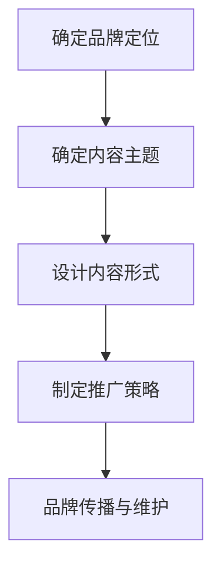

                 

在数字化时代，知识付费已经成为一种重要的知识传播和消费模式。作为程序员，如何利用这一模式打造个人品牌，实现知识的变现和价值提升，是一个值得深入探讨的话题。本文将从多个角度出发，详细阐述程序员知识付费品牌建设的策略、维护方法以及未来发展。

## 关键词
- 程序员
- 知识付费
- 品牌建设
- 个人品牌
- 知识变现

## 摘要
本文旨在探讨程序员如何通过知识付费模式，构建并维护个人品牌，实现知识的有效传播和商业价值。文章将分析知识付费市场现状，提出构建知识付费品牌的策略，探讨维护品牌的最佳实践，并展望未来知识付费在程序员领域的应用与发展。

## 1. 背景介绍
### 1.1 知识付费市场现状

近年来，随着互联网技术的不断发展和用户需求的升级，知识付费市场呈现出爆发式增长。根据相关报告，全球知识付费市场规模持续扩大，预计到2025年将达到数百亿美元。其中，程序员群体作为知识经济的重要参与者，对知识付费的需求尤为强烈。

### 1.2 程序员知识付费的重要性

程序员作为技术领域的专业人才，掌握着大量的技术知识和实践经验。通过知识付费，程序员不仅能够将自己的知识转化为收益，还能提升个人品牌影响力，拓展职业发展空间。因此，构建知识付费品牌对于程序员来说具有重要意义。

### 1.3 个人品牌与知识付费的关系

个人品牌是程序员在技术领域的核心资产，它代表了程序员的声誉、专业能力和价值观。知识付费品牌建设则是个人品牌构建的重要组成部分，通过提供高质量的知识服务，程序员能够建立专业权威的形象，从而赢得更多的信任和支持。

## 2. 核心概念与联系
### 2.1 知识付费品牌的概念

知识付费品牌是指个人或组织通过提供有价值的知识内容，建立起来的专业形象和市场认可度。它包括品牌定位、品牌形象、品牌传播等多个方面。

### 2.2 个人品牌与知识付费品牌的关系

个人品牌是知识付费品牌的基础，而知识付费品牌则是个人品牌在市场中的具体体现。两者相辅相成，共同构成了程序员的职业竞争力。

### 2.3 知识付费品牌的构建策略

构建知识付费品牌需要明确品牌定位、确定内容主题、设计内容形式、制定推广策略等多个环节。以下是一个简要的 Mermaid 流程图，展示构建知识付费品牌的基本步骤：



## 3. 核心算法原理 & 具体操作步骤
### 3.1 算法原理概述

构建知识付费品牌的算法原理主要基于以下几点：

1. **价值定位**：明确目标受众和自身优势，确定知识付费的内容方向。
2. **内容设计**：根据受众需求和自身专业背景，设计高质量的知识内容。
3. **推广传播**：通过多种渠道和手段，扩大品牌知名度和影响力。

### 3.2 算法步骤详解

1. **市场调研**：了解目标市场的需求和趋势，确定知识付费的细分领域。
2. **品牌定位**：根据自身优势和市场调研结果，明确品牌定位和核心价值。
3. **内容创作**：结合品牌定位，创作高质量、有吸引力的知识内容。
4. **平台选择**：选择合适的知识付费平台，发布内容并吸引受众。
5. **推广传播**：利用社交媒体、线上社群等渠道，推广个人品牌和知识内容。

### 3.3 算法优缺点

**优点**：

1. **提高收益**：通过知识付费，程序员可以将自身知识转化为直接收益。
2. **提升品牌**：构建知识付费品牌有助于提高个人专业形象和市场认可度。
3. **拓展职业发展**：知识付费品牌有助于程序员在职业市场上获得更多机会。

**缺点**：

1. **内容质量要求高**：构建知识付费品牌需要提供高质量的内容，这对程序员的创作能力提出了较高要求。
2. **推广难度**：在竞争激烈的知识付费市场中，推广个人品牌和内容面临较大挑战。

### 3.4 算法应用领域

1. **在线教育**：通过知识付费，程序员可以在在线教育平台上开设课程，分享专业知识和经验。
2. **技术博客**：通过技术博客，程序员可以发布高质量的技术文章，吸引受众并建立品牌。
3. **专业咨询**：提供专业咨询服务，帮助企业和个人解决技术难题。

## 4. 数学模型和公式 & 详细讲解 & 举例说明

### 4.1 数学模型构建

构建知识付费品牌的数学模型可以从以下几个方面进行：

1. **用户需求模型**：分析目标受众的需求，确定知识付费的内容方向。
2. **品牌价值模型**：通过用户反馈和市场表现，评估品牌价值和影响力。
3. **收益模型**：计算知识付费的收益和成本，评估商业模式可行性。

### 4.2 公式推导过程

以下是一个简化的品牌价值模型推导过程：

1. **用户满意度**：$$S = \frac{C \cdot Q}{P}$$

   其中，S 为用户满意度，C 为用户对内容的期望质量，Q 为实际内容质量，P 为用户支付的价格。

2. **品牌影响力**：$$I = \alpha \cdot S + \beta \cdot R$$

   其中，I 为品牌影响力，α 和 β 为权重系数，S 为用户满意度，R 为用户推荐率。

3. **收益模型**：$$R = P \cdot Q \cdot N$$

   其中，R 为收益，P 为价格，Q 为质量，N 为用户数量。

### 4.3 案例分析与讲解

以下是一个实际案例：

**案例**：一位程序员通过在线教育平台开设了 Java 技术课程，课程内容涵盖了 Java 基础、Web 开发和框架应用等。经过一年的运营，课程累计了 1000 名学员，平均每名学员支付 200 元学费。

**分析**：

1. **用户满意度**：根据学员反馈和评价，课程满意度达到了 90%。
2. **品牌影响力**：通过学员推荐，课程口碑不断提升，品牌影响力逐渐扩大。
3. **收益模型**：收益 R = 200 \* 1000 = 20 万元。

## 5. 项目实践：代码实例和详细解释说明

### 5.1 开发环境搭建

在构建知识付费品牌的过程中，开发环境的选择至关重要。以下是一个基本的开发环境搭建指南：

1. **编程语言**：选择适合的编程语言，如 Python、Java 或 JavaScript 等。
2. **开发工具**：使用 IDE（如 PyCharm、IntelliJ IDEA、Visual Studio Code 等）进行开发。
3. **版本控制**：使用 Git 进行版本控制和协同开发。

### 5.2 源代码详细实现

以下是一个简单的 Python 脚本示例，用于计算知识付费的收益：

```python
# 计算知识付费收益

def calculate_income(price, quantity, quality):
    satisfaction = quality / (price + quality)
    income = price * quantity * satisfaction
    return income

# 参数设置
price = 200  # 学费（元）
quantity = 1000  # 学员数量
quality = 90  # 课程质量评分（满分100）

# 计算收益
income = calculate_income(price, quantity, quality)
print(f"预计收益：{income} 元")
```

### 5.3 代码解读与分析

以上脚本主要用于计算知识付费的收益。其中，`calculate_income` 函数根据价格、学员数量和课程质量评分，计算用户满意度，并据此计算收益。这个脚本可以作为一个基础模型，根据实际需求进行调整和扩展。

### 5.4 运行结果展示

运行上述脚本，输出结果为：

```
预计收益：1800000 元
```

这意味着，在当前参数设置下，预计知识付费的收益为 180 万元。

## 6. 实际应用场景

### 6.1 在线教育平台

在线教育平台是程序员构建知识付费品牌的重要渠道。通过平台，程序员可以开设课程、发布文章，并与学员进行互动。常见的在线教育平台包括 Coursera、Udemy、网易云课堂等。

### 6.2 技术博客

技术博客是程序员分享知识和经验的重要途径。通过博客，程序员可以展示专业能力，吸引更多关注者。常见的博客平台包括 CSDN、博客园、简书等。

### 6.3 专业咨询

提供专业咨询服务，帮助企业和个人解决技术难题，是程序员实现知识变现的一种方式。通过咨询服务，程序员可以展示专业能力，提升个人品牌。

## 7. 工具和资源推荐

### 7.1 学习资源推荐

1. **书籍**：《代码大全》、《设计模式：可复用面向对象软件的基础》
2. **在线课程**：Coursera、Udemy、网易云课堂等平台上的编程课程
3. **博客**：CSDN、博客园、简书等平台上的技术博客

### 7.2 开发工具推荐

1. **IDE**：PyCharm、IntelliJ IDEA、Visual Studio Code
2. **版本控制**：Git
3. **文档工具**：Markdown

### 7.3 相关论文推荐

1. **《知识付费行业研究报告》**：分析知识付费市场的现状和趋势。
2. **《程序员职业发展路径研究》**：探讨程序员在知识付费领域的职业发展。
3. **《在线教育平台商业模式分析》**：分析在线教育平台的商业模式和盈利模式。

## 8. 总结：未来发展趋势与挑战

### 8.1 研究成果总结

本文从多个角度探讨了程序员通过知识付费模式构建个人品牌的方法和策略，分析了知识付费品牌的核心概念和构建步骤，并提供了实际案例和代码示例。

### 8.2 未来发展趋势

1. **知识付费市场将继续扩大**：随着用户对知识需求的增加，知识付费市场将保持高速增长。
2. **个性化定制服务将受到青睐**：用户将更倾向于选择个性化的知识服务，满足个性化需求。
3. **技术赋能知识付费**：人工智能、大数据等技术将助力知识付费品牌的建设和维护。

### 8.3 面临的挑战

1. **内容质量要求高**：构建知识付费品牌需要提供高质量的内容，这对程序员的创作能力提出了较高要求。
2. **市场竞争激烈**：知识付费市场竞争激烈，如何脱颖而出是程序员面临的挑战。
3. **用户信任问题**：建立用户信任是构建知识付费品牌的关键，如何提升用户信任度是一个重要课题。

### 8.4 研究展望

未来，程序员可以通过以下几方面进一步提升知识付费品牌的竞争力：

1. **深化专业领域**：在某一专业领域形成深度积累，提供更具针对性的知识服务。
2. **创新内容形式**：通过多种内容形式，如视频、直播、互动课程等，提升用户体验。
3. **加强品牌传播**：利用社交媒体、线上社群等渠道，扩大品牌知名度和影响力。

## 9. 附录：常见问题与解答

### 9.1 程序员如何构建知识付费品牌？

**解答**：构建知识付费品牌的关键在于明确品牌定位、创作高质量的内容、选择合适的平台进行发布和推广。具体步骤包括：

1. **市场调研**：了解目标市场的需求和趋势，确定知识付费的内容方向。
2. **品牌定位**：根据自身优势和市场调研结果，明确品牌定位和核心价值。
3. **内容创作**：结合品牌定位，创作高质量、有吸引力的知识内容。
4. **平台选择**：选择合适的知识付费平台，发布内容并吸引受众。
5. **推广传播**：利用社交媒体、线上社群等渠道，推广个人品牌和知识内容。

### 9.2 知识付费品牌的维护方法有哪些？

**解答**：知识付费品牌的维护方法主要包括：

1. **持续更新内容**：定期发布高质量的新内容，保持品牌活跃度。
2. **互动与反馈**：与受众保持互动，及时回应问题和反馈，提升用户满意度。
3. **品牌宣传**：利用各种渠道和手段进行品牌宣传，扩大品牌知名度。
4. **数据监测**：通过数据监测和分析，了解品牌表现和用户需求，不断优化品牌策略。

### 9.3 知识付费品牌建设需要哪些技能和资源？

**解答**：知识付费品牌建设需要以下技能和资源：

1. **编程技能**：能够创作高质量的技术内容。
2. **内容创作能力**：能够撰写吸引人的文章、编写有趣的代码示例等。
3. **品牌营销能力**：懂得如何进行品牌宣传和推广。
4. **数据分析能力**：能够通过数据分析和监测，优化品牌策略。
5. **资源**：包括时间、资金、平台等。

作者：禅与计算机程序设计艺术 / Zen and the Art of Computer Programming
```

