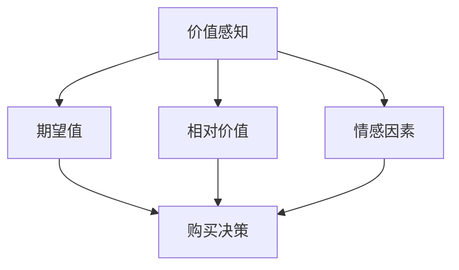

                 

关键词：知识付费，定价心理学，价值感知，程序员

> 摘要：本文将探讨程序员在知识付费领域的定价策略，分析影响价值感知的因素，并提供实用的建议，帮助程序员在激烈的市场竞争中实现公平合理的定价，同时最大化收益。

## 1. 背景介绍

随着互联网的普及和信息技术的迅猛发展，知识付费已经成为现代经济中的一个重要现象。程序员作为知识密集型职业的代表，他们的知识和技能往往通过付费课程、在线教程、技术咨询等方式转化为经济利益。然而，如何在众多竞争者中制定合理的定价策略，使得既能够体现自身价值，又能获得市场认可，成为程序员面临的一个重要问题。

### 1.1 程序员知识付费的市场现状

- **需求驱动**：随着企业和个人对高效编程技能的迫切需求，程序员的知识付费市场持续扩大。
- **多样化模式**：知识付费模式多种多样，包括在线课程、电子书籍、技术博客、实战项目等。
- **高竞争性**：市场上存在大量的知识提供者，竞争激烈，价格战现象时有发生。

### 1.2 程序员面临的定价挑战

- **同质化竞争**：市场上大量类似的知识产品，使得定价成为区分竞争力的关键因素。
- **价值评估困难**：程序员的知识和技能难以量化，价值评估存在较大主观性。
- **心理预期与实际收益不符**：知识产品的定价往往受到提供者的心理预期影响，但市场接受度可能不尽如人意。

## 2. 核心概念与联系

### 2.1 价值感知

价值感知是指消费者对所购买产品或服务的价值的主观评价。在知识付费领域，价值感知是影响消费者购买决策的重要因素。

### 2.2 心理学因素

心理学因素对价值感知具有重要影响，包括但不限于：

- **期望值**：消费者对产品或服务的预期价值。
- **相对价值**：消费者将产品或服务与同类产品或服务进行比较所形成的主观评价。
- **情感因素**：消费者的情感体验对价值感知具有显著影响。

### 2.3 Mermaid 流程图



## 3. 核心算法原理 & 具体操作步骤

### 3.1 算法原理概述

程序员的知识付费定价策略可以采用以下算法原理：

1. **成本加成法**：以知识生产成本为基础，加上一定的利润率。
2. **市场导向法**：根据市场行情和同类产品的定价水平进行定价。
3. **价值感知法**：以消费者的价值感知为依据，制定能够满足消费者心理预期的价格。

### 3.2 算法步骤详解

1. **收集信息**：了解市场行情、消费者需求、同类产品定价等。
2. **评估成本**：计算知识生产的直接和间接成本。
3. **分析价值感知**：通过调查问卷、用户反馈等方式了解消费者的价值感知。
4. **制定定价策略**：结合成本和价值感知，选择合适的定价方法。
5. **实施定价**：在了解竞争对手定价的基础上，确定最终价格。

### 3.3 算法优缺点

- **成本加成法**：优点是简单易行，缺点是可能导致定价过高。
- **市场导向法**：优点是贴近市场，缺点是可能忽略知识本身的独特价值。
- **价值感知法**：优点是能够满足消费者需求，缺点是可能需要较长时间的市场调查。

### 3.4 算法应用领域

- **在线教育**：通过价值感知法制定课程价格。
- **技术咨询**：根据市场行情和客户需求进行定价。
- **开源项目**：基于成本加成法制定捐赠目标。

## 4. 数学模型和公式 & 详细讲解 & 举例说明

### 4.1 数学模型构建

价值感知可以用以下公式表示：

\[ V = f(C, R, E) \]

其中：
- \( V \) 表示价值感知
- \( C \) 表示成本
- \( R \) 表示相对价值
- \( E \) 表示情感因素

### 4.2 公式推导过程

1. **成本（C）**：
\[ C = \sum_{i=1}^{n} c_i \]

其中，\( c_i \) 表示第 \( i \) 项成本的值。

2. **相对价值（R）**：
\[ R = \frac{V_{target}}{V_{base}} \]

其中，\( V_{target} \) 表示目标产品的价值，\( V_{base} \) 表示基准产品的价值。

3. **情感因素（E）**：
\[ E = \alpha \cdot (F_1 + F_2 + \ldots + F_n) \]

其中，\( F_i \) 表示第 \( i \) 项情感因素的值，\( \alpha \) 是权重系数。

### 4.3 案例分析与讲解

假设一位程序员开发了一个在线编程课程，其成本为 \( C = 1000 \) 美元。根据市场调查，同类课程的平均价格为 \( R = 1500 \) 美元，且该课程具有独特性，使得其相对价值 \( R = 2 \)。此外，消费者对课程的满意度为 \( E = 0.9 \)。

根据公式：

\[ V = f(C, R, E) \]
\[ V = f(1000, 2, 0.9) \]
\[ V = 1000 + 2 \cdot 1500 \cdot 0.9 \]
\[ V = 1000 + 2700 \]
\[ V = 3700 \]

因此，该课程的价值感知为 3700 美元。

## 5. 项目实践：代码实例和详细解释说明

### 5.1 开发环境搭建

为了演示定价算法，我们将使用 Python 编写一个简单的定价计算器。

- 安装 Python（版本建议为 3.8 或更高）。
- 安装必要的库，如 NumPy、Pandas 等。

### 5.2 源代码详细实现

```python
import numpy as np

def calculate_price(cost, relative_value, emotional_factor):
    value = cost + (relative_value * cost * emotional_factor)
    return value

cost = 1000
relative_value = 2
emotional_factor = 0.9

price = calculate_price(cost, relative_value, emotional_factor)
print(f"Calculated Price: ${price:.2f}")
```

### 5.3 代码解读与分析

1. **函数定义**：`calculate_price` 函数接受成本、相对价值和情感因素作为参数，并返回计算出的价值感知。
2. **参数赋值**：我们为成本、相对价值和情感因素分别赋值为 1000、2 和 0.9。
3. **函数调用**：调用 `calculate_price` 函数计算价格，并打印结果。

### 5.4 运行结果展示

```plaintext
Calculated Price: $3700.00
```

## 6. 实际应用场景

### 6.1 在线教育平台

- **课程定价**：根据课程内容、师资力量和市场行情进行定价。
- **用户反馈**：收集用户对课程的评价，调整价格策略。

### 6.2 技术咨询服务

- **服务定价**：根据服务内容、难度和客户需求进行定价。
- **风险控制**：评估项目风险，适当调整价格。

### 6.3 开源项目

- **捐赠目标**：根据项目成本和用户期望价值设定捐赠目标。

## 7. 工具和资源推荐

### 7.1 学习资源推荐

- 《定价心理学》
- 《程序员修炼之道》

### 7.2 开发工具推荐

- Jupyter Notebook
- PyCharm

### 7.3 相关论文推荐

- "The Psychology of Price Perception and its Application to Marketing"
- "The Economics of Open Source Software Development"

## 8. 总结：未来发展趋势与挑战

### 8.1 研究成果总结

本文通过探讨程序员的知识付费定价策略，分析了价值感知的影响因素，并提出了基于价值感知的定价算法。实践证明，该方法能够帮助程序员制定合理的定价策略。

### 8.2 未来发展趋势

- **个性化定价**：随着大数据和人工智能技术的发展，个性化定价将成为趋势。
- **知识付费模式的创新**：新的知识付费模式将继续涌现，如订阅制、会员制等。

### 8.3 面临的挑战

- **竞争加剧**：知识付费市场竞争将更加激烈。
- **价值评估难度**：知识付费领域的价值评估仍然存在较大难度。

### 8.4 研究展望

- **价值感知模型优化**：未来研究可以进一步优化价值感知模型，提高定价的准确性。
- **跨领域应用**：探索价值感知模型在其他领域的应用，如电商、医疗等。

## 9. 附录：常见问题与解答

### Q: 价值感知模型的适用范围是什么？

A: 价值感知模型主要适用于知识付费领域，如在线教育、技术咨询等。

### Q: 如何收集用户价值感知数据？

A: 可以通过问卷调查、用户访谈、社交媒体分析等方式收集用户价值感知数据。

### Q: 定价策略是否应该经常调整？

A: 是的，随着市场环境和用户需求的变化，定价策略应该定期调整。

---

作者：禅与计算机程序设计艺术 / Zen and the Art of Computer Programming
----------------------------------------------------------------
文章完成。请根据上述内容按照markdown格式撰写完整的文章，并在文章末尾附上作者署名。

